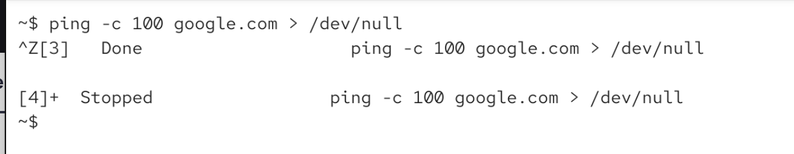
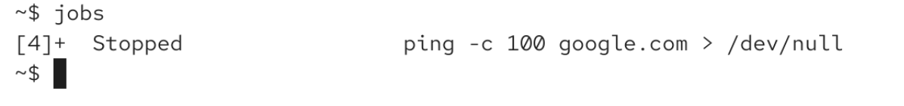
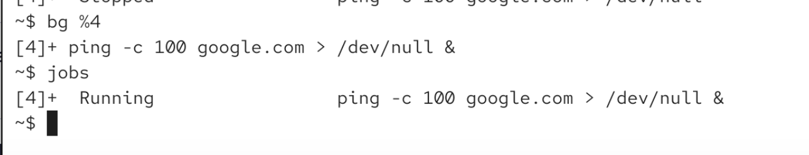
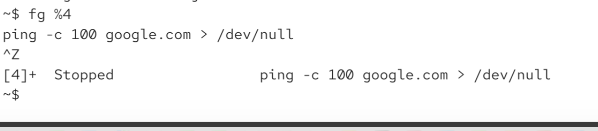
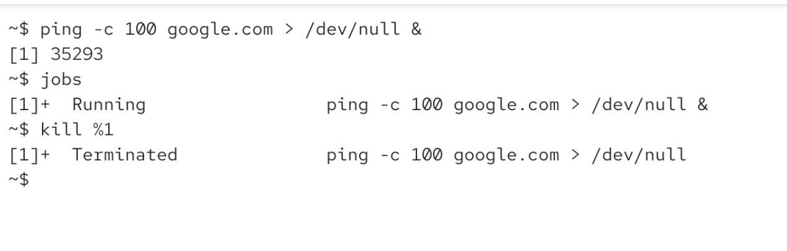

if we are in forground and we want to send it to background

we can suspend the job (CTRL Z) -> this sentds SIGSTP signal to the program

SITTSTP is nicer verion of SIGSTOP

we can still see the job is still there:

# how to resume it?

we can put it to background

bg %[job-ID]

when we continuins: a SIGCONT signal is sent to the program

then again to foreground and then i ctrl z:

then again foreground will make it run

# how to kill a job and say to come to an end

kill %[job-ID] it will send SIGTERM to the job to terminate itself

% sign is necessary to say its a job id, not a process id

jobs are shell feature, feature of our bash. on mac its on /bin/kill on linux might be usr/bin/kill

its important to use kill without any folder (so it will be bash command, not os command with the path)