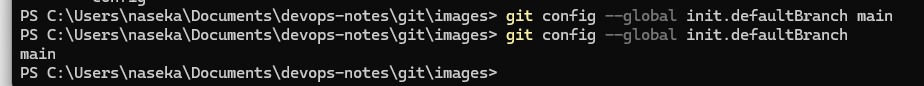

**GIT** = distributed version control system. Git is decentralized. Every developer has a full copy on their machine.

No internet is needed for local Git. What I run:

```bash
 git init
 git add
 git commit
```

Key features:

- distributed (no need in central server)
- version tracking
- collaboration
- branching
- merging
- remote repositories (github, bitbuckert)
- extensive tooling
- staging area
- speed
- open-source and free

**GitHub** = web based platform, used for version control and collaboration. it hosts repositories and provides gui to manage your code. Offers other features like bug tracking, feature requests, task management & wikis. This is for collaboration. Its platform, that hosts GIT repositories

Internet needed:

```bash
git push
git pull
git clone
```

_Whats homebrew in the context of installing GIT??_

Terminal vs GUI for Git (like GitHub Desktop).

# Git Workflow

We have Local Machine: working directory (changing the files), staging area, local repo

Remote: remote repository

first off we run
`git init` will initialize a new repository in my project folder and it will be hidden folder called .git

then once we are ready to add files to staging area (for ex. we fixed a bug) we run `git add` command

when we are ready to commit changes to our local repository we run the `git commit` command

when we want to push to remote repository we use `git push` command

when we want to pull changes from remote repository `git pull`. We are taking latest code

once we go to the repository for the first file and we want to get repo to our machine -> so we use `git clone` command

you create a new branch and then merge your changes to main branch. you can create prod, stage, dev branches. for ex. you create new branch "calories" then we merge changes to main branch, called "pull request".

# To install Git

first check if you have it:
`git --version`

if you dont have it: few ways: homebrew on mac or go to git-scm.com/downloads

then perform configuration

```bash
git config --global user.name "Eka Nasirova"
git config --global user.email "myemail"
```

or check what is set just by taking the value away:

`git config --global user.name`


one other thing to configure: name of main branch. master or main. check what it is:

`git config --global init.defaultBranch`

if no output, means git has no value set, so no global branch configured, so i configured it and i can see:




