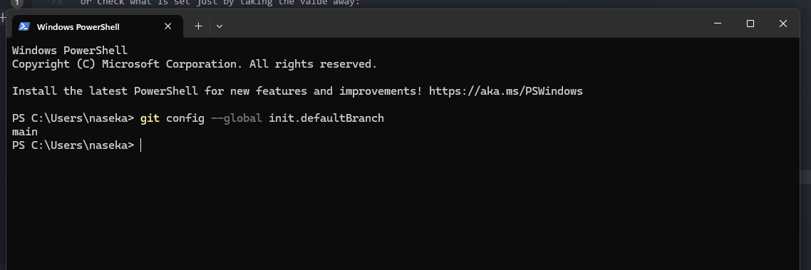
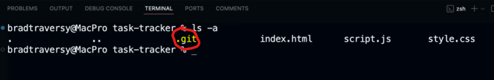
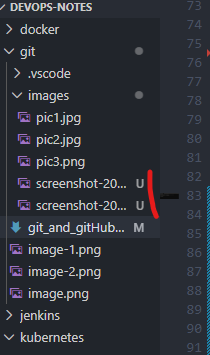
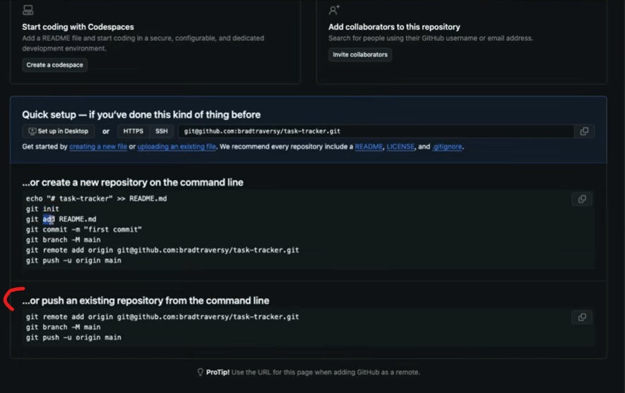
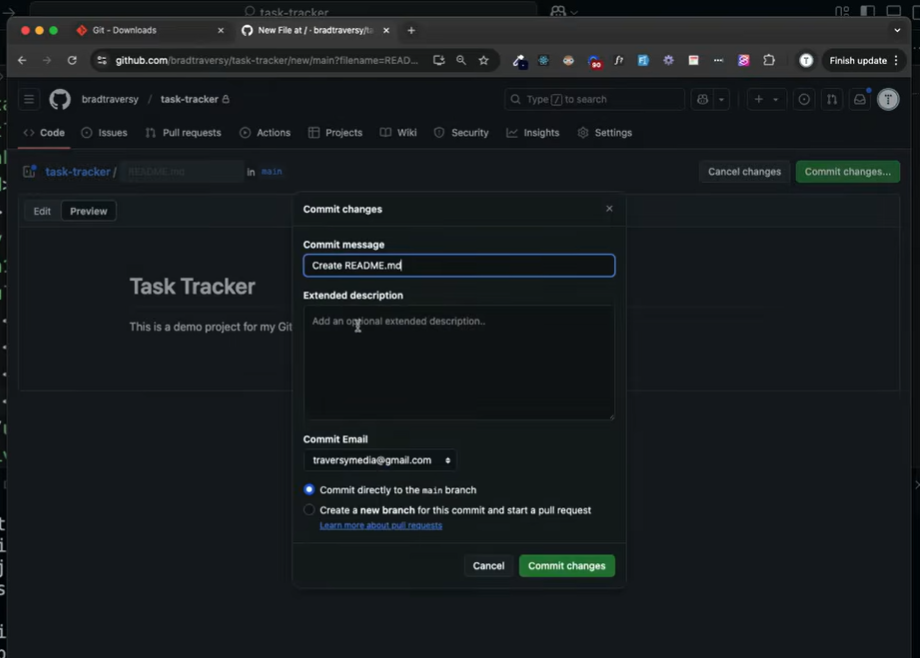
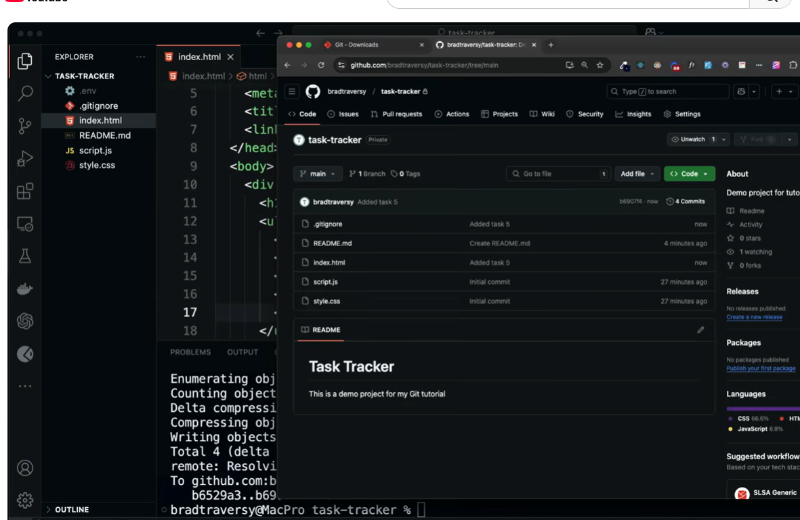

**GIT** = distributed version control system. Git is decentralized. Every developer has a full copy on their machine.

No internet is needed for local Git. What I run:

```bash
 git init
 git add
 git commit
```

Key features:

- distributed (no need in central server)
- version tracking
- collaboration
- branching
- merging
- remote repositories (github, bitbuckert)
- extensive tooling
- staging area
- speed
- open-source and free

**GitHub** = web based platform, used for version control and collaboration. it hosts repositories and provides gui to manage your code. Offers other features like bug tracking, feature requests, task management & wikis. This is for collaboration. Its platform, that hosts GIT repositories

Internet needed:

```bash
git push
git pull
git clone
```

_Whats homebrew in the context of installing GIT??_

Terminal vs GUI for Git (like GitHub Desktop).

# Git Workflow

We have Local Machine: working directory (changing the files), staging area, local repo

Remote: remote repository

first off we run
`git init` will initialize a new repository in my project folder and it will be hidden folder called .git

then once we are ready to add files to staging area (for ex. we fixed a bug) we run `git add` command

when we are ready to commit changes to our local repository we run the `git commit` command

when we want to push to remote repository we use `git push` command

when we want to pull changes from remote repository `git pull`. We are taking latest code

once we go to the repository for the first file and we want to get repo to our machine -> so we use `git clone` command

you create a new branch and then merge your changes to main branch. you can create prod, stage, dev branches. for ex. you create new branch "calories" then we merge changes to main branch, called "pull request".

# To install Git

first check if you have it:
`git --version`

if you dont have it: few ways: homebrew on mac or go to git-scm.com/downloads

then perform configuration

```bash
git config --global user.name "Eka Nasirova"
git config --global user.email "myemail"
```

or check what is set just by taking the value away:

`git config --global user.name`

one other thing to configure: name of main branch. master or main. check what it is:

`git config --global init.defaultBranch`

if no output, means git has no value set, so no global branch configured, so i configured it and i can see:



# Initiate and use GIT locally on your machine

if it was my own project on my laptop. i need to go my folder via cd command and then open vs code via this command:

```bash
code . #opens folder in vs code
```

in vs code i can see terminal.

we would run git init first

```bash
git init
```

then when i run this command while being in my folder

```bash
ls -a
```

i will see my hidden .git file for my initiated repository:


if I want to remove the file completely:

```bash
rm -rf .git #it will completely delete the file
```

**U** means Untracked:


```bash
git status # will show untracked changes
```

```bash
git add . # will add all files files
git add index.html #it will add files to staging area

git commit -m 'Initial commit' #commit changes

git status
```

from here we can create remote repository or we can keep working locally

```bash
git log # will show all commits starting with most recent first. i can click down arror to keep seeing older commits. put Q on keyboard to exit
```

# Push to your remote repository.

1. set up your repository in GitHub: create new repo in Github -> name it -> specify if its public (anyone can come and see the code) or private. You can initialize Readme file, .gitignore file etc. then you create repository



2. add remote repository:

```bash
git remote add origin ...@github.com:..... #we are adding address to repo
```

3. next we want to make sure that we are using main branch:

```bash
git branch -M main
```

4. then we run git push -u origin main

```bash
git push -u origin main # u means upstream. its only necessary first time. in the future we just say git push
```

Then we can see our code gets pushed to github

## git push -u origin main

`push` is how you publish your work to a remote repository.
`origin` is just a nickname. It usually means: “the GitHub repo I cloned from”
`main` this is your local branch name, that you want to push
`-u` means _set upstream thracking_ This creates a permanent relationship:

````
local branch:  main
tracks remote: origin/main```
````

Then i will see all my code in GitHub

# Pull from remote repository

For ex. we added readme file directly in GitHub. Readme file: its full instructions on how to use the project:



we commited changes in GitHub GUI, but we cannot see them in our VS code locally. So we need git pull:

```bash
git pull #pulls changes from remote repo
```

and now we will have readme file in vs code

# GitIgnore file

for ex. we created .env file with variables. we dont want this to be available in our repository (especially when its public repo)

in the file we will specify to not have this file in the repo:


then when we add any changes and commit, we will have .gitignore, but we will not have .env in our remote repo:



# ShortCuts

To add and commit in the same command:

```bash
git commit -am 'Added task 6' #for all files
git add index.html && git commit -m "Added task 7" # also combined two commands
```

# GitHub interface

Issues: we can add issues here
Pull request: we can make a pull request
Actions: here we can setup CICD pipelines
Projects: here we can use managemnt tools
Wiki
Security
Insights: traffic and analytics
Settings of repo
-> here we can add collaborators for ex.

# Getting code from GitHub

- you can download code
- `git clone`: same as download but better. we clone with ssh link or we use https. you need to create ssh key.
- `git fetch`: get latest changes without merging. so you see changes, but they are not merged with your local branch

* `git merge`: apply changes to your local branch

## why we need git fetch:

Safe inspection:

```bash
git fetch
git log origin/main
```

So you can review:

- commits

- messages

- authors

**Before touching your code.**

**Compair before merging**

See exactly what would change:

```bash
git diff main origin/main
```

GIT PULL = GIT FETCH + GIT MERGE
so `git pull` is automatic and risky

# Forking: is how Git lets you work freely on someone else's project without touching their code

```pgsql
Original repo (owned by someone else)
        ↓
Your fork (owned by you)
```

Forking solves this problem:

“I want to contribute, experiment, or learn — but I don’t have permission to push to the original repository.”

So instead of asking for access, you fork.

- Think of a textbook 📘

- Original repo = published textbook

- Fork = your photocopy

You can:

- write notes

- highlight

- add chapters

You cannot scribble in the original book

If the author likes your changes → they merge them.

## How contributions work (pull request)

Forking is usually paired with a Pull Request (PR):

- You fork the repo

- You make changes in your fork

- You open a PR:

  “Hey, I propose these changes — do you want them?”

- The original owner can:

  - accept

  - reject

  - ask for changes

  ## After forking

  `git clone` to work on it in my local machine. git fork copies to remote repo in github. git clone will copy already my github repo to my local machine

# SSH

1. Generate new ssh key pair:

```bash
ssh-keygen -t rsa -b 4096
#ssh-keygen = the tool that creates SSH keys
#-t rsa = choose the RSA algorith (older but still widely supported)
#-b 4096 = key size
#(4096-bit RSA is stronger than 2048)
```

Note: GitHub also supports ed25519 (newer + faster), but RSA 4096 is still fine.

2. Choose where to save the key

you will see smth like:

```bash
Enter file in which to save the key (/Users/eka/.ssh/id_rsa):
#The default location is your home folder’s SSH directory: ~/.ssh/
#The default filename for RSA is typically: id_rsa
```

What you do

- Press Enter to accept default:
  `~/.ssh/id_rsa`

- Or type your own file name if you want multiple keys, e.g.:
  `~/.ssh/id_github2`

Why you might type a custom name

- If you already have id_rsa and don’t want to overwrite it

- If you want separate keys for work/personal

3. Passphrase prompt

Then it asks:

```nginx
Enter passphrase (empty for no passphrase):
```

What it means

- Passphrase encrypts your private key on disk.

- If someone steals the file, they still can’t use it without the passphrase.

What you do

- Type a passphrase (more secure), OR

- Press Enter twice (no passphrase, more convenient)

4. You now have TWO files (public + private)

If you saved as id_rsa:

- Private key: `~/.ssh/id_rsa` ✅ keep secret

- Public key: `~/.ssh/id_rsa.pub` ✅ can share

If you saved as id_github2:

- Private: `~/.ssh/id_github2`

- Public: `~/.ssh/id_github2.pub`

5. Print the public key (to copy it)

```bash
cat ~/.ssh/id_github2.pub`
```

That is correct only if you actually created the key with that name.

If you used default id_rsa, then the command is:

```bash
cat ~/.ssh/id_rsa.pub
```

Golden rule

✅ Upload the .pub to GitHub

❌ Never upload the private key (no .pub)

6. Add the public key to GitHub:

GitHub steps:

- Profile → Settings

- SSH and GPG keys

- New SSH key

- Title: describe the machine (e.g., Eka MacBook)

- Paste the public key text

- Save

**Title matters**, cause if you later rotate keys or have multiple devices, you’ll know which key is which.

7. Test authentication

```bash
ssh -T git@github.com
```

What this test does

- It attempts an SSH authentication handshake with GitHub.

- It only verifies your key is accepted

Expected success looks like:

```bash
“Hi <username>! You’ve successfully authenticated…”
```

If you get "Permission denied (piblickey)"

That means your computer did not offer the correct key to GitHub (or GitHub doesn’t have that public key).

A common fix is: **start ssh-agent + add your private key.**

```bash
eval `ssh-agent -s`
```

modern safe form is:

```bash
eval "$(ssh-agent -s)"
```

You will see something like:

```nginx
Agent pid 12345
```

Add the key to the agent

```bash
ssh-add ~/.ssh/id_github2
#Example if your key is id_github2:
```

Then it prints something like:

```swift
Identity added: /Users/eka/.ssh/id_github2
```

Now test again:

```bash
ssh -T git@github.com
```

## Reason 1 why people get stuck

They generate the key as id_rsa, but later run:

```bash
cat ~/.ssh/id_github2.pub
```

…which doesn’t exist, or is a different key than the one GitHub has.

If you want, paste the output of:

```bash
ls -la ~/.ssh
```
