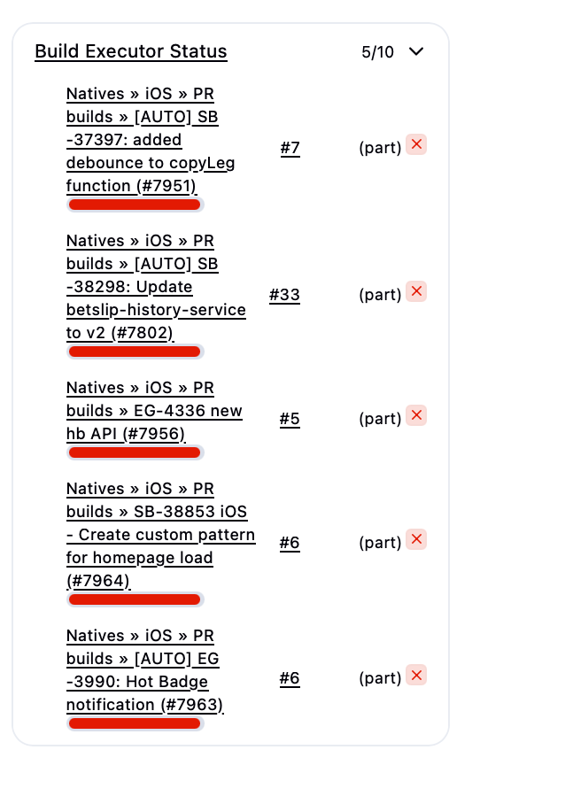
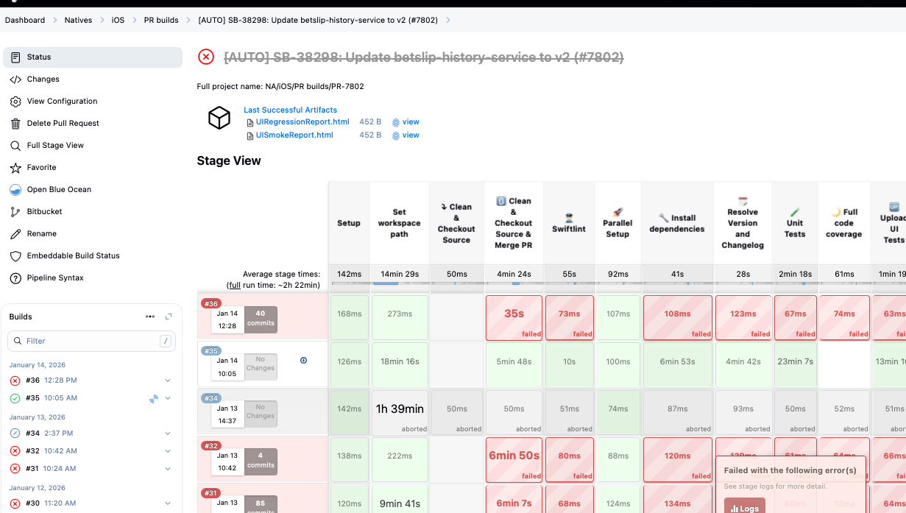
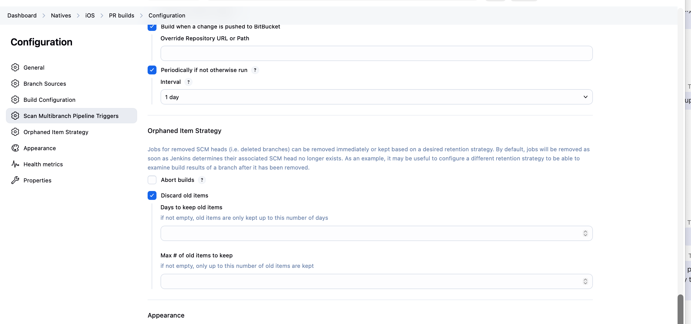

# macosbuild3 node goes offline

i can see that its online ok. 

i see that it has orphaned executors:

all those bulds are for closed PRs. majority are deleted form jenkins, so page is not found, when clicking on build



this job takes to orphaned pr:



how to fix:

-> mark temporary offline
-> disconnect
-> reconnect agent


!!! set Mac to never sleep while plugged in

! check disk space for the mac:

```bash
df -h #line ending with /
```


# "stuck" pr requests

the page had pull requests crossed out:


this is the job, which is crossed out, it means:

1) the job is disabled
    * verify via going to the job configuration and check if its enabled or not: in my case its enabled

2) its closed/merged in bitbucket.

In our case its merged


the setting on the multibranch pipeline level:



we need to put one of the following or both:

1) days to keep old items (suggest 7 to 14 days)
2) max # of old items to keep (we can say 20 for ex.)

    


