# Jenkins Configuration as Code (JCasC)

## WORKFLOW

```bash
cd /var/lib/jenkins

cp jenkins.yaml jenkins.yaml.20250602   # backup
vim jenkins.yaml                        # edit
yamllint jenkins.yaml                   # check yaml syntax (optional)
diff jenkins.yaml jenkins.yaml.20250602 # review changes
systemctl restart jenkins               # apply
```


    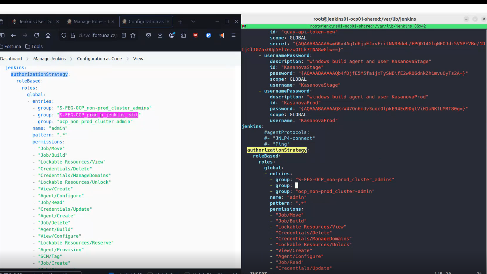

    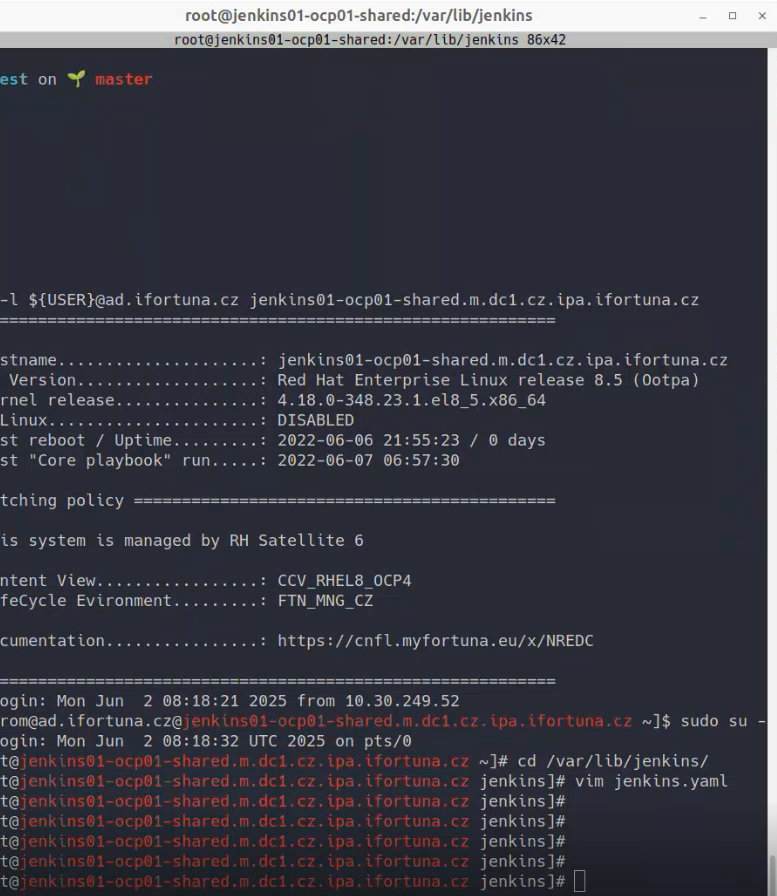

    so we do it in GUI -> then we add it also in YAML, which is stored on the server

- roles

- agent configuration

Example:
If you add a new user to a group in Jenkins GUI, you should also edit the YAML file so the setting is not lost when Jenkins restarts.

## Yaml formatting -> whitespaces matter (indentation)

Example:
One extra space can break a configuration:

```yaml
agent:
  name: windows
```

## Connect as my user to Jenkins server (SSH)

```bash
ssh naseka@jenkins01-ocp01-shared.m.dc1.ipa.ifortuna.cz
```

if succesfull i see:

```
naseka@jenkins01-ocp01-shared:~$
```

## then I temporarily (if allowed) become root:

```bash
sudo su
```
or

```bash
sudo -i
```

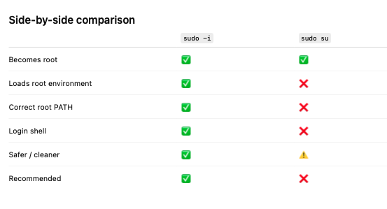


then prompt changes to:

```
root@jenkins01-ocp01-shared:~#
```

```pgsql
    root@jenkins01-ocp01-shared.m.dc1.ipa.ifortuna.cz
    │    │
    │    └── hostname (server name)
    └─────── user (root = administrator)

```

So:

- jenkins01-ocp01-shared... = the Jenkins server
- root = administrator account

## Go to Jenkins configuration directory

```bash
cd /var/lib/jenkins
```

To see what’s inside:

```
ls
```

Example output:

```bash
jobs/
plugins/
secrets/
jenkins.yaml
```
## Yaml backups are also on the repo:

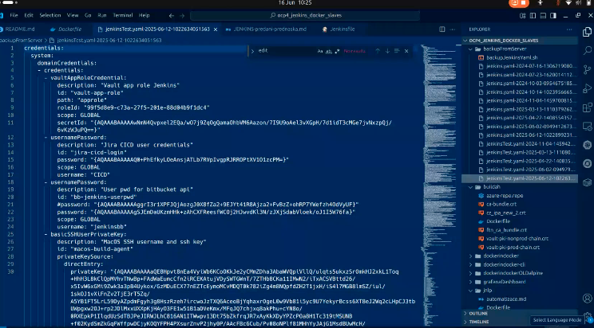

you can compair files directly in vs code meld
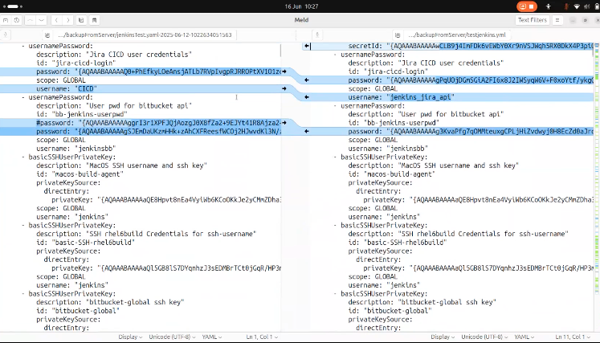

!!always back up

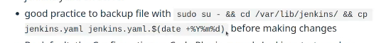

you can check if smth is not working -> what was changed check:

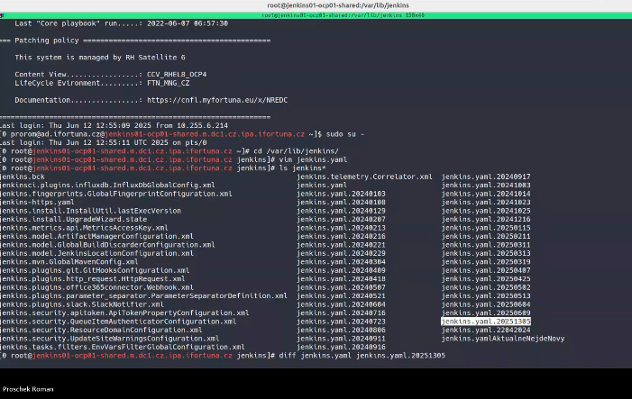


## View the YAML file (safe, read-only)

```bash
cat jenkins.yaml
```

or (better for beginners):

```bash
less jenkins.yaml
```

Tips for less:

- scroll → arrow keys
- quit → q

## Create a backup copy of YAML file:

```bash
cp jenkins.yaml jenkins.yaml.20250602
```

- cp = copy
- jenkins.yaml = source file
- jenkins.yaml.20250602 = backup with date

## Edit the YAML file

Option A: `nano` (BEST for beginners)

```bash
nano jenkins.yaml
```

Inside nano:

- edit text normally
- save → CTRL + O, then Enter
- exit → CTRL + X

Option B: vim (you saw instructor use this)

```bash
vim jenkins.yaml
```

Minimal vim survival kit:

- press i → start editing
- edit text
- press ESC
- type :wq
- press Enter
- That’s it.

### Search for authorizationStrategy inside vim:

Inside `vim` you type:

```
/authorizationStrategy
```

- `/` = search forward
- `authorizationStrategy is the text we are looking for

Exit search mode: press `ESC`

### Type new group to admin name roles:

We copy pasted the group name from GUI configuration as a file into our Yaml on the server:

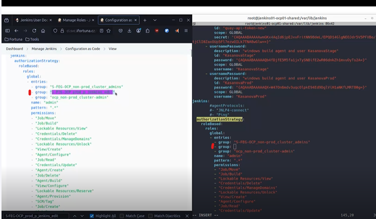

## Check YAML syntax (optional)

```bash
yamllint jenkins.yaml
```

- If no output → good
- If errors → fix indentation
- (YAML is very sensitive to spaces!)

## first he changes in UI and checks if all works and then he updates yuml:

You need to click new configuration -> it doesnt affect pipelines. We added permissions and we shoudl be able to login now
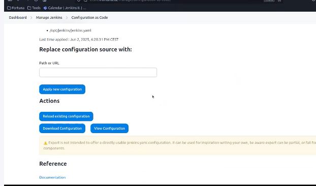


## use diff functions to always compair yaml files

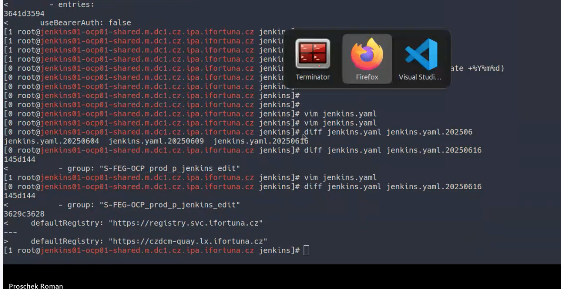

## Review changes (compairing back up with actual yaml file)

```bash
diff jenkins.yaml jenkins.yaml.20250602 # review changes
```

## then in configuration as code you click apply new configuration
then you reload page and you will see new entry there

## Tell Jenkins to reload configuration (not needed in our case)

not needed here, cause GUI changes will be applied till the restart. Restart will happen if we do some plugin, upgrades etc)

Restart Jenkins (most common)

```bash
systemctl restart jenkins
```

Check status:

```bash
systemctl status jenkins
```

## Typical real workflow:

```bash
cd /var/lib/jenkins

cp jenkins.yaml jenkins.yaml.20250602   # backup
vim jenkins.yaml                        # edit
yamllint jenkins.yaml                   # check yaml syntax (optional)
diff jenkins.yaml jenkins.yaml.20250602 # review changes
systemctl restart jenkins               # apply
```

# OpenShift OC command-line tool (OpenShift CLI)
## Commands:

```bash
oc login ...token.. #token is taken from here: https://console-openshift-console.apps.ocp01-shared.m.dc1.cz.ipa.ifortuna.cz
oc logout
oc get projects
oc project jenkins-shared
oc get pods # to see table with pods
oc whoami
oc status
oc get is gradle8-java21 -n shared-images 
oc describe is gradle8-java21

```

# To see everything related to Jenkins (jobs, plugins etc):

```bash
ls -la /var/lib/jenkins/
```


# to experiment/test jenkins updates:

  Jenkins is regularly backed up by copying its data to separate folders, and these backups can be downloaded and used locally to safely experiment, test changes, or even intentionally break Jenkins without risking production. For local testing, Jenkins YAML configuration must be adjusted so it does not connect to real OpenShift or external systems. The key message is that updates and risky changes should always be tested on a local or test setup first, never directly on the production Jenkins.

## Process:

- Update plugins
- Update Jenkins core
- Update plugins again
- Restart

  
  

## back up functional plugins

`cp -ar plugins plugins.$(date +%Y%m%d)`

# undestand installs, updates and stability: 
`cat /etc/yum.repos.d/jenkins.repo` 
    shows where Jenkins packages are downloaded from, which is crucial for understanding installs, updates, and stability.

# to instal jenkins

```bash
yum install jenkins
```

# agents are built here

## flow:

1. Admin changes Dockerfile (repo on bitbucket: https://app-bitb-shared.o.dc1.cz.ipa.ifortuna.cz/projects/OS/repos/ocp4_jenkins_docker_slaves/browse)

2. Then admin pushes the changes to bitbucket

3. This triggers jenkins CI job to build image here: https://ci.svc.ifortuna.cz/job/Openshift/job/ocp4_jenkins_docker_slaves/job/master/

4. CI job  in jenkins builds image

5. Image is pushed to internal registry (Quay)

6. Jenkins (via OpenShift plugin) requests agent
OpenShift runs pod from that image (image was built above and recipe for the image correspond to folder names (which are agent names): buildah, slave-base-java11/ etc)

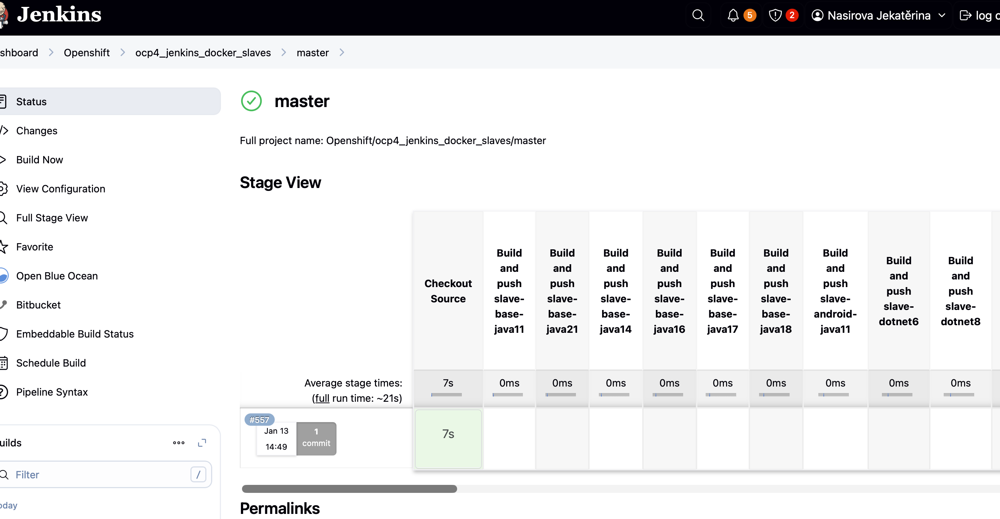

https://ci.svc.ifortuna.cz/job/Openshift/job/ocp4_jenkins_docker_slaves/job/master/


the repository corresponds to this demo pic:

-> every agent has its own folder

        * these are Jenkins agent image definitions:

            buildah/
            dockerindocker/
            jnlp/
            OCP4setup/
            slave-android-java21/
            slave-base-java11/


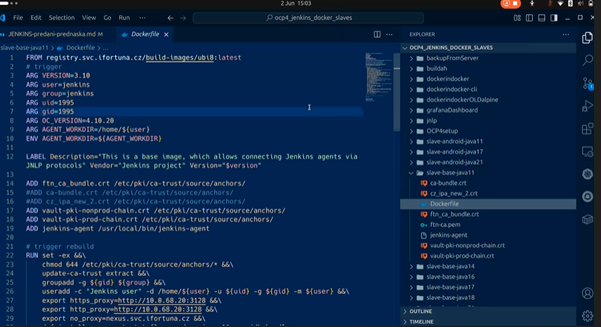

the repo itself is on bitbucket:
https://app-bitb-shared.o.dc1.cz.ipa.ifortuna.cz/projects/OS/repos/ocp4_jenkins_docker_slaves/browse

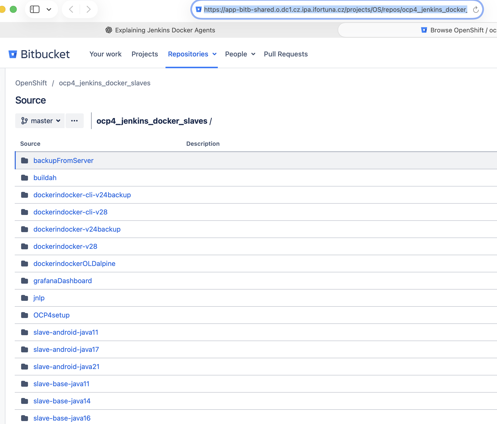

* That repository is used to build Docker images for Jenkins agents that will later run in OpenShift (OCP4).

Inside image definitions folder (for ex. `slave-base-java11`)

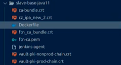

```csharp
slave-base-java11/
├── Dockerfile
├── ca-bundle.crt
├── cz_ipa_new_2.crt
├── fan_ca_bundle.crt
├── ftn-ca.pem
├── vault-pki-nonprod-chain.crt
├── vault-pki-prod-chain.crt
├── jenkins-agent
```

* shortly (more below): 
```css
Git repository
└── Agent image folder
    ├── Dockerfile      ← how to build the image
    ├── certs           ← trust company services
    └── agent binary    ← connect to Jenkins
```

## Dockerfile = recipe for the agent image


## .crt/.pem files = company security certificates "this agent trusts company infrastructure"

## jenkins-agent file
          

# Jenkins listens on port 8080
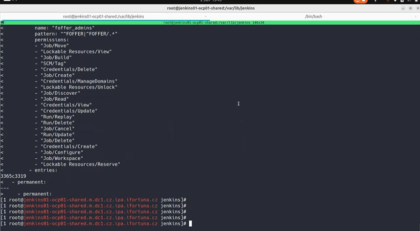

```sql
    root@jenkins01-ocp01-shared.m.dc1.ipa.ifortuna.cz
    │    │
    │    └── hostname (server name)
    └─────── user (root = administrator)
```

## lsof: list open files

Jenkins listens to port 8080 by default:

```bash
lsof -i :8080
```

Output example:

```nginx
java  12345 jenkins  123u  IPv6  TCP *:8080 (LISTEN)
```

👉 This tells you what is blocking the port

`ss -tpan` shows which processes are using which network ports right now.

## ss - tulnp: Shows all listening network ports and which programs are using them.

```bash
ss -tulnp
```

- ss → show network sockets
- -t → TCP (web, Jenkins, SSH)
- -u → UDP (DNS, streaming, etc.)
- -l → listening only (servers waiting for connections)
- -n → show numbers (8080, not names)
- -p → show process name + PID


# Real Task: updating and building a new Jenkins agent

Agent uses:

- Gradle 8 instead of Gradle 7
- Java 21 instead of Java 17

**In Jenkins pipelines you’ll see either:**:

```bash
mvn clean install
```

or

```bash
gradle build
```

## here we configure template pod:
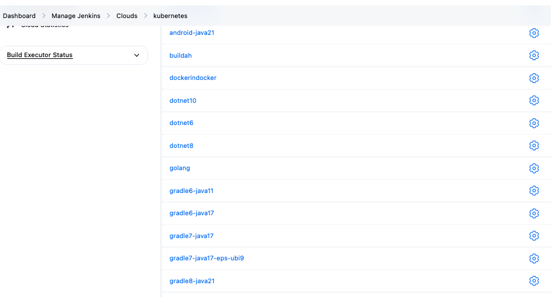

when we open the pod we can see image registry link:
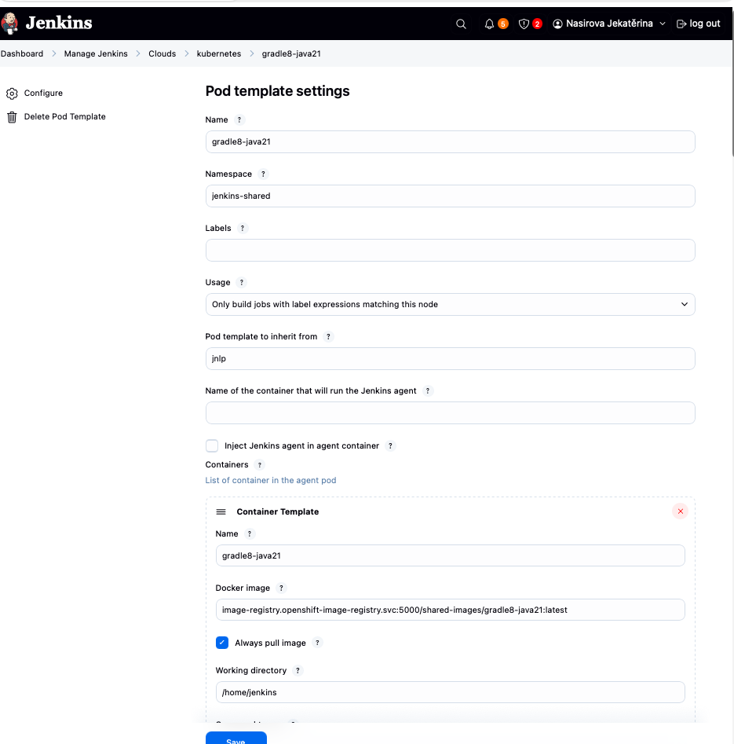

## here i can see all running pods
`oc get pods`
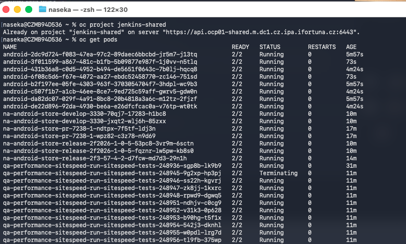


## how i get into specific pod:
`oc describe pod ..podnamefromthecommandabove`
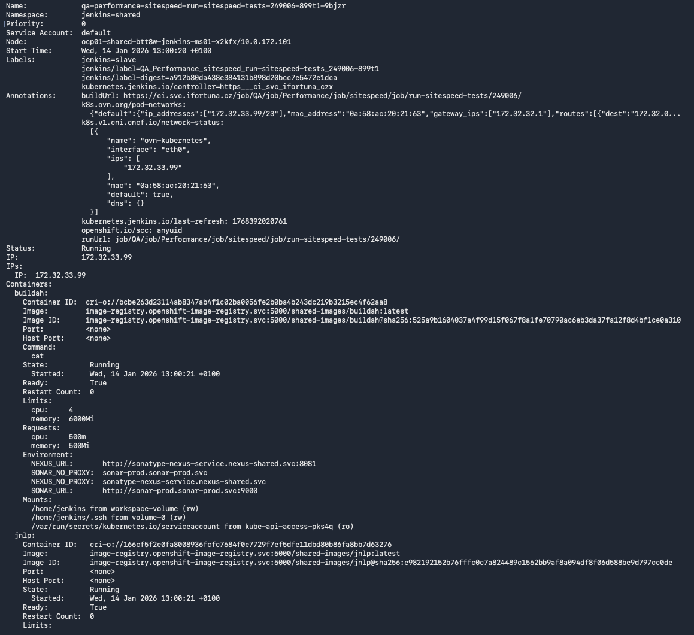

in the pod we:
1) first we check that there is a container we need -> for ex android java 21
2) in every pod there is a container there is jnlp
3) we can check docker file for that image (pulled from bitbucket based on folder name. so in our case will be slave-android-21)
4) inside the docker file its important whcih image we pull. ubi 8 or ubi 9 -> its red hat universal base image. its big. can create a bottle neck. used exceptinally. we use lightweight prebuilt image from image stream:

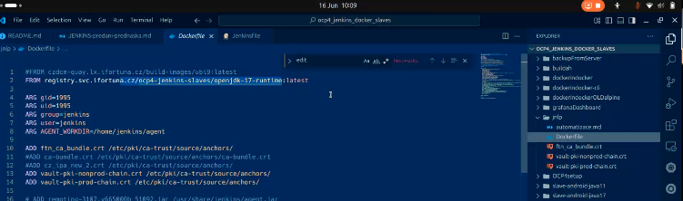

every time its rebuilt it checks    update for latest build of agent, downloads it unpacks it. link to git hub located here:

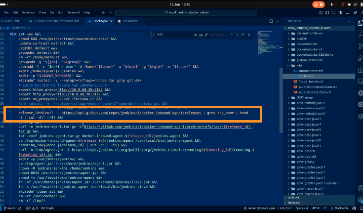

we need to create image streams: link in open shift from where download the image

```bash
oc get is -n shared-images
```

      This will list ImageStreams like:
        java-17
        java-21
        jnlp
        maven-java17
        etc.

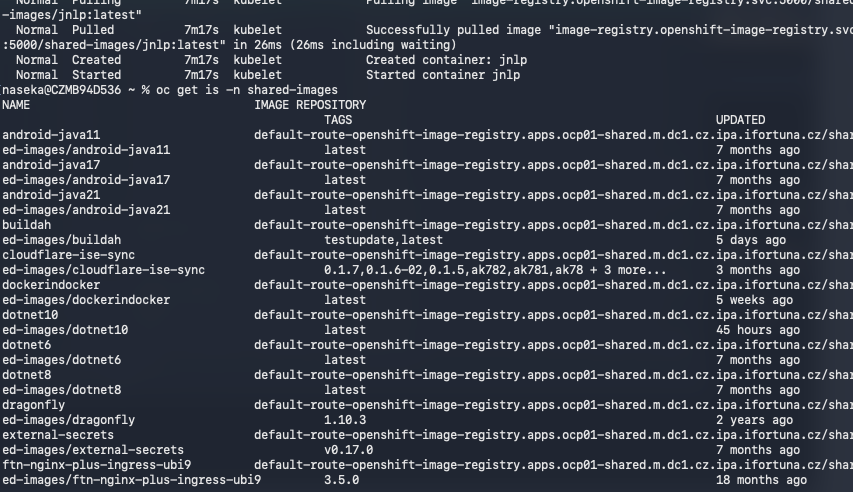

in open shift we make links to quay images and in the end htey are downloaded directly from openshift store

thats why this url:

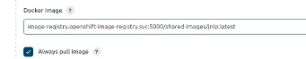

almost no one uses it, but with this almost anyone can ssh to bitbucket:

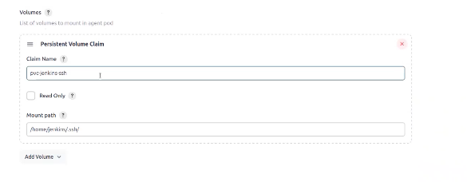

jira has mulptiple ip addresses:

dns lookup coommand:

`nslookup jira.myfortuna.eu`

```bash
naseka@CZMB94D536 ~ % nslookup jira.myfortuna.eu
Server:		10.32.193.20
Address:	10.32.193.20#53

Non-authoritative answer:
Name:	jira.myfortuna.eu
Address: 185.172.118.55
```
but in openshift we need to use this address:
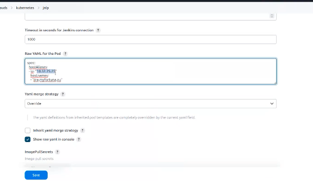

every agent has jnlp as dependancy: it inherits all variables and settings from here

everyone should use images from openshift - from this image stream. in the past we had links to quay but then during deploytment quay was not able to serve images to so many clients

quay = history of images

## buildah image

tool called build

we have oc command here to interact with oc and few different commands which are needed for deployment

A Buildah image is usually a container image whose job is to build other container images — without Docker daemon.

# dockerindocker
in the past master is on VM (same as now), but agents used to run on Docker Swam. 
Openshift uses Crio, not Docker as runtime for containers. 
one pod when we run docker in docker it has docker inside it. its like incpetion. thats the reason why in containers we have docker_host set up to ip address endport tcp: 
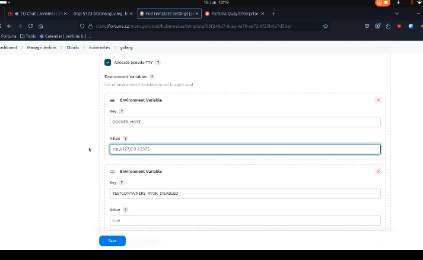
every agent has setup that it expects api on port..
sometimes its hardcoded. from then there are no troubles with this

# except openshift we have Nodes
Jenkins/Nodes

## mac os
for ex. macos-qa:

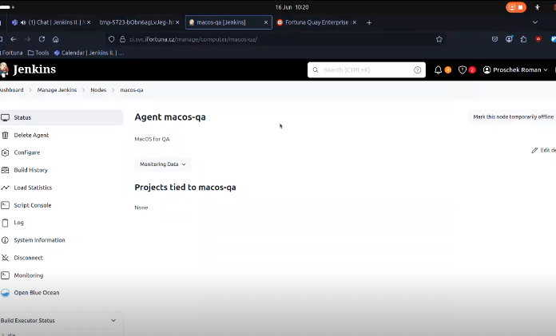

target computer has ssh and java installed, then jenkins can connect via ssh, it can copy jenkins agent application to target computer and run it

you can use it in pipelines

## windows computers
we have for kasanova
same logic
we installed ssh in target
we have ip address, username and password. then developers can run jobs on windows machines

## linux nodes
same idea

## nodes agent buildah-932mt
its for specific person for testing. roman is not sure how its done


# Manage credentials

dont forget to change yaml after changing in ui
username and password
choose domain - global
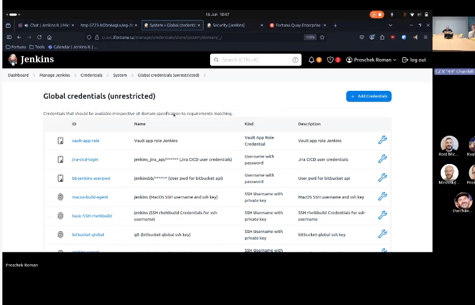

there is a way to decode credentials, but its tied to installation of jenkins.

i cant decode credentials from production server on test server. 
its possible if you copy master key -> everything is hashed with this master key. on test we have different master key

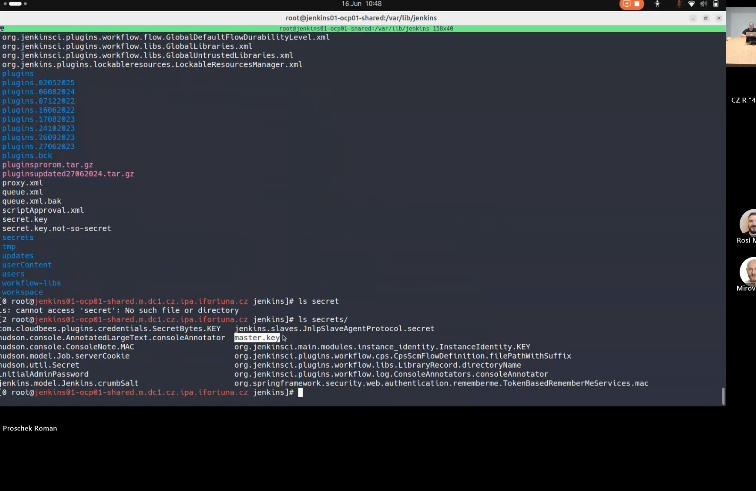


# changing gradle 7 to 8 and java 17 to 21. so biuld updated agent (jenkins |||)

existing agent has gradle 7 and java 17

we store info on building agents here in repo in bitbucket

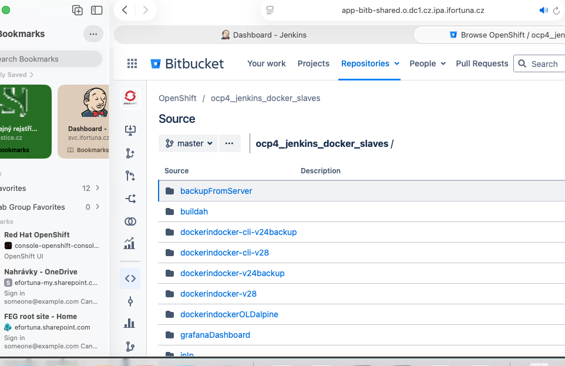


roman added 5 people to the repo
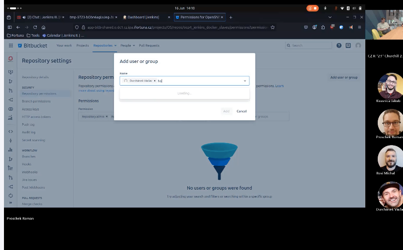


roman said we should be able to pull this repo! 

we copied this agent (whole folder) as inspiration:
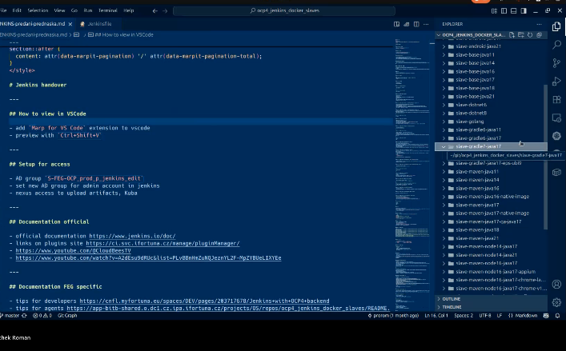

there is only docker file in that folder

we open changed the path in registry to java -21:

```
FROM registry... java21

```

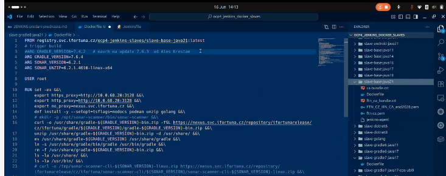

now gradle:

we need to find which verison we can install. for him easiest way is to run this base image:

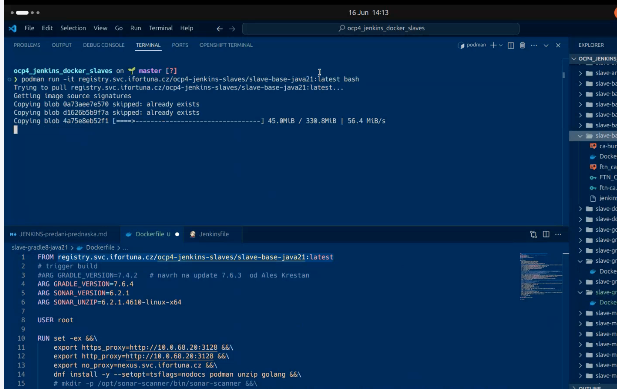


**My extra notes**:

In a Dockerfile:
* FROM <image> = “start building my image on top of this base image”

So by changing java17 → java21, they’re saying:
“I want everything the Java base image provides, but with Java 21 instead of Java 17.”

            Important detail:
            That base image might be only Java (no Gradle).
            Or it might already contain Java + some tooling. Depends on how your company built it.

He changed the Java base, but Gradle could be:
* installed in the Dockerfile (e.g., download Gradle, set PATH), 
* or already included in the base image, or
* not installed at all (then the “gradle agent” would be broken / misleading)

So he needs to verify what you actually get when you run the image.

Why “the easiest is to run this base image”

        Before building the new derived image, he wants to quickly inspect the base image defined in FROM.
        Running the base image answers immediately:
        What Java is there? (should be 21)
        Is Gradle already there? If yes, which version?
        Is the environment sane (shell, permissions, PATH)?


## 1) Important Command


```bash
podman run -it <image-from-FROM> bash
```

after we are done with it -> exit shell process (only shell process stops):

`exit`

podman run = start a container from an image
-i = keep STDIN open (so you can type)
-t = allocate a TTY (interactive terminal)

podman run -it registry.../java21:latest

he’s basically opening a shell-like session inside that image.

Sometimes you need to specify a shell explicitly, depending on the image:
podman run -it <image> bash
or podman run -it <image> sh

## 2) then we check inside

            Inside the running container, the typical checks are:
            Java:
            java -version
            Gradle:
            gradle -v (or gradle --version)
            if that fails: which gradle or ls /opt/gradle (depends how it’s installed)
            Possible outcomes:
            Gradle is present and already version 8.x
            → Great, then the Dockerfile might not need to install Gradle at all; the folder name “gradle8” matches reality.
            Gradle is present but it’s 7.x or something else
            → Then the Dockerfile must be updated to install/point to Gradle 8.
            Gradle is not installed
            → Then the Dockerfile must install Gradle, otherwise this “gradle agent” is just a Java agent.

## image doesnt include Gradle 8

so we need to download binary + upload to nexus

then change variable here: `ARG GRADLE_VERSION=7.6.4z

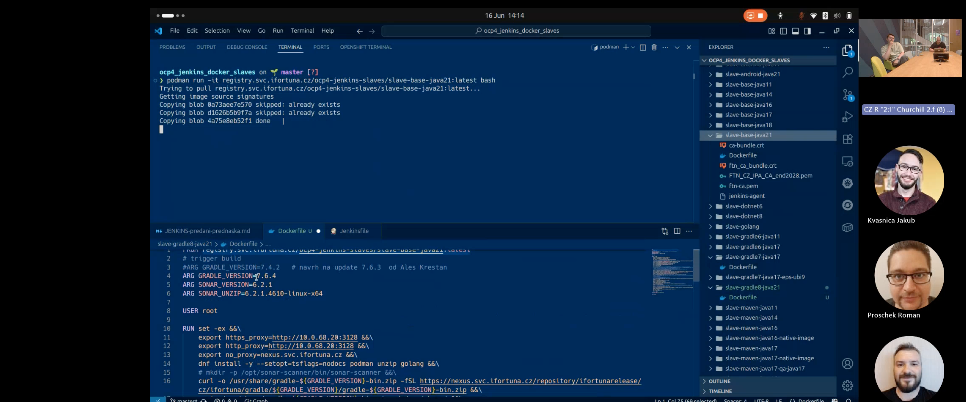

and we will rebuild agent

in readme there is info where to download gradle and where to uppload it in nexus Browse..:

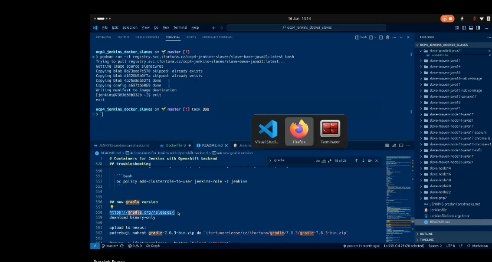

we download binary only latest version: 8/14.2

so we prepare docker file: write there 8.14.2

we change in gradle version ARG -> then its automatically updated every where in docker file, cause we change variable

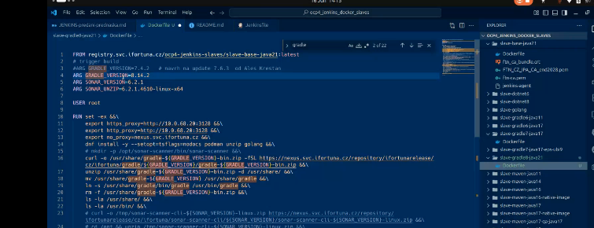

then we go to nexus -> we need to sign in
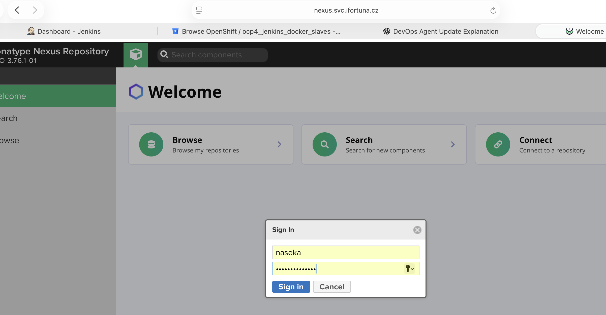

we uppload the binary: we go to browse ifortuna ...gradle

upload component 

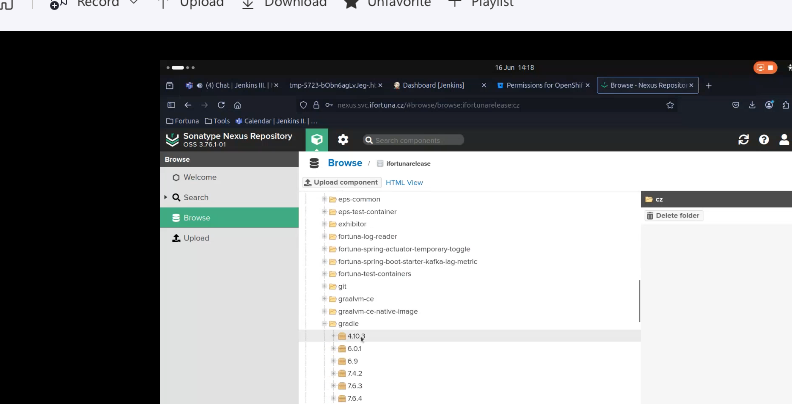

in downloads we select the downloaded binary

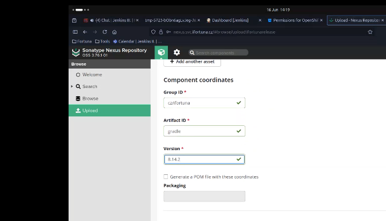

## Last Thing: Jenkins file

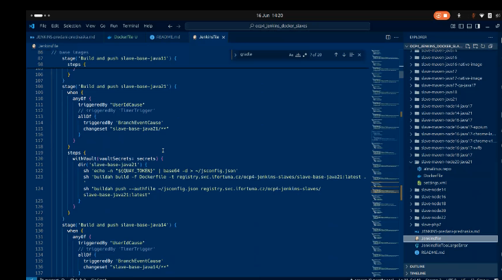

contains pipeline which builds the agents, so we need to add the entry, so it knows it should build smth new

here is a good example, cause this is built based on java21

so there correctly written dependancies on when to rebuild these agents. look at entire stage ('Build and push slave-node20') it tells when to rebuild this agent

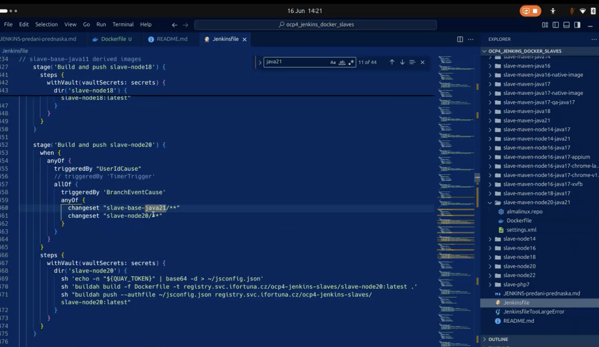

so he took whole stage:

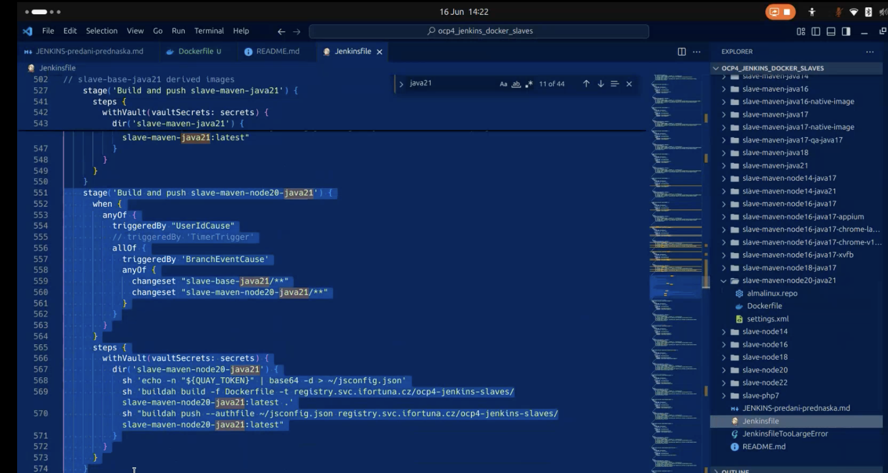
and copy pasted it below:

and he selected  maven-node20 within this stage and replaced it with gradle8

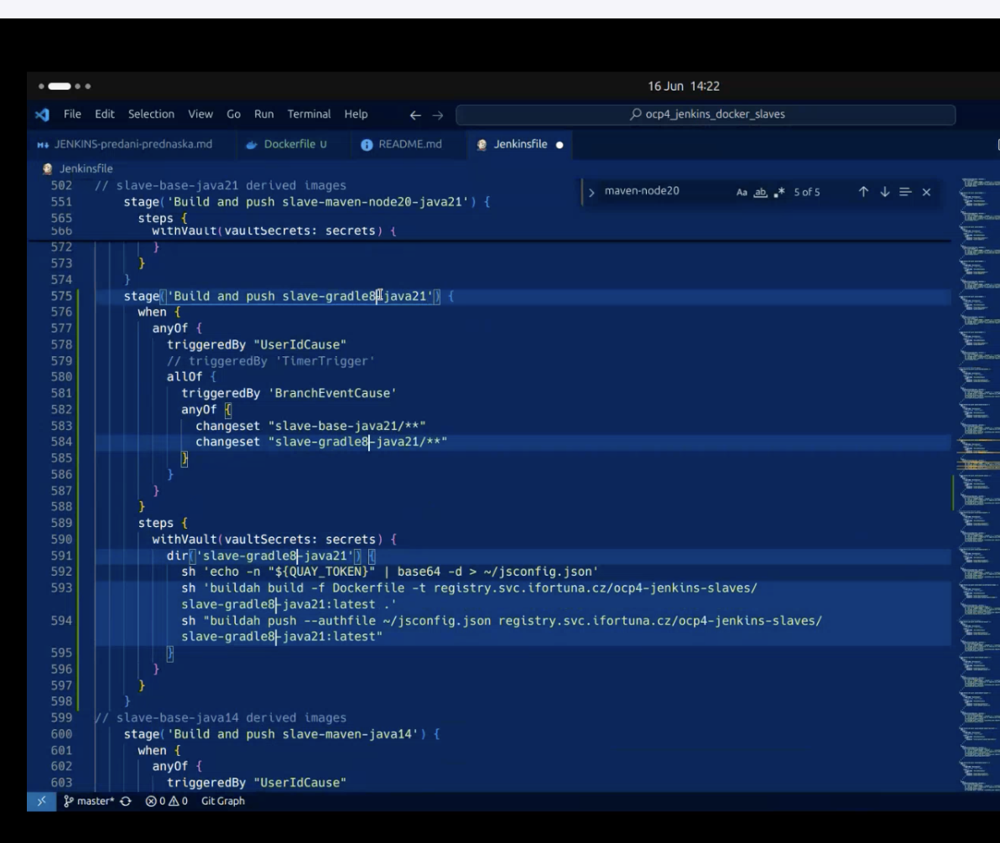

## then in quay we need to create entry there

we create new repository

always public

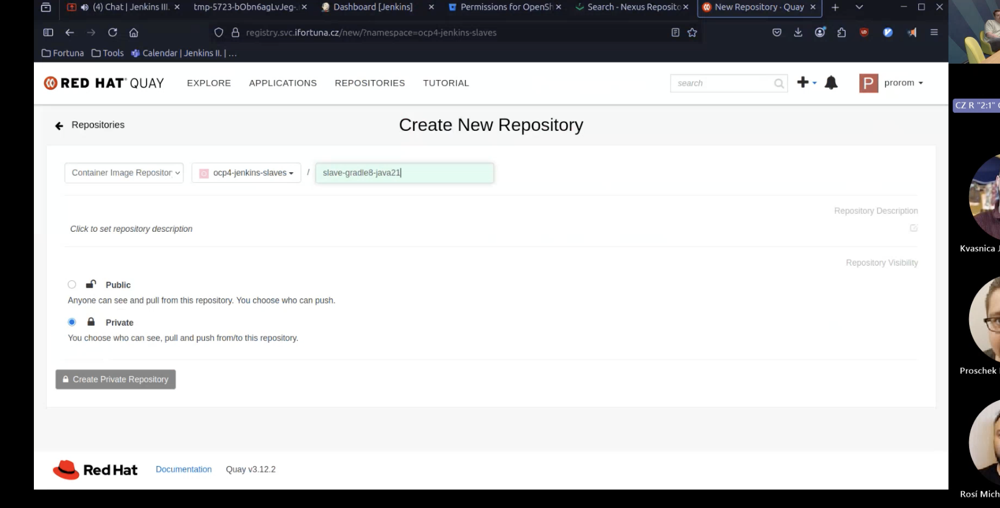

now we have a new place where we can upload image to Quay


## create link between quay and image stream

in readme:

he copies 112 line

and then he changes node22 into gradle8 in both spots

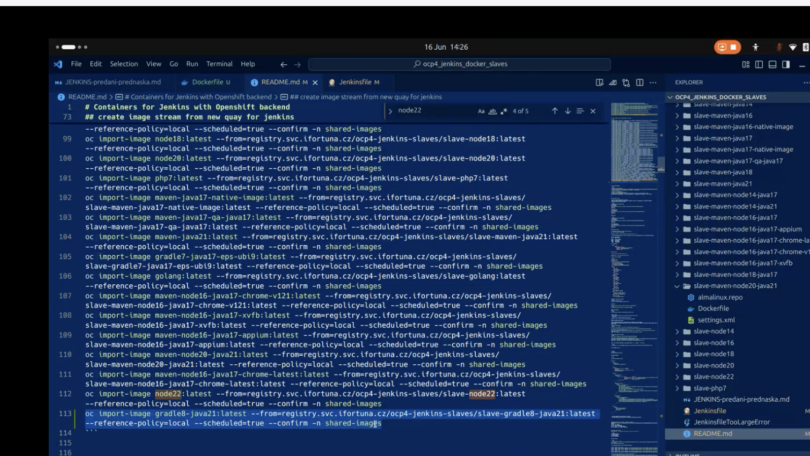

we will later run this line in open shift (in readme its the whole command). but it will be done after the image is upploaed to Quay

## push changes to repo:

then we need to commit and SYNCH changes to bitbucket: what ever we changd here:
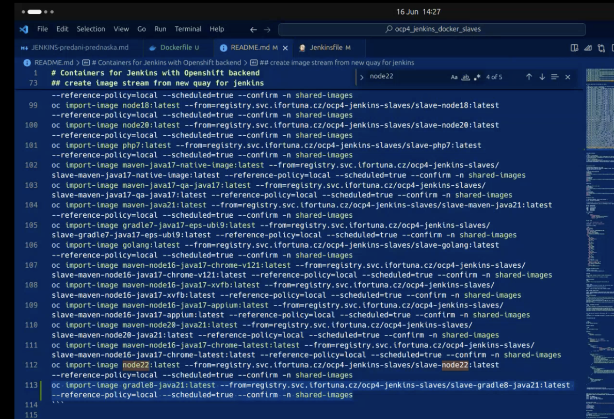

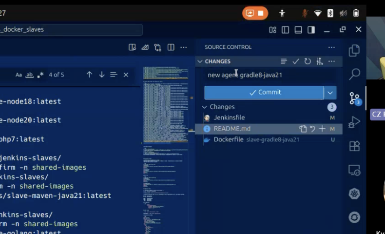

it goes to bitbucket -> there is webhook created -> it will trigger the build in jenkins:

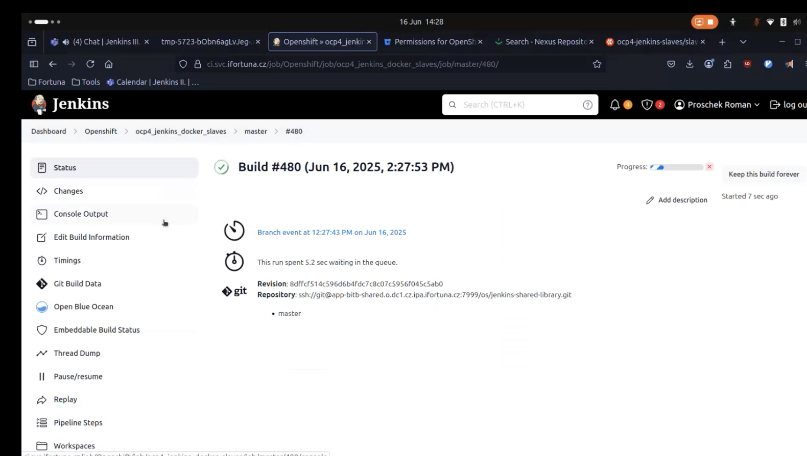

PS: he edits things on master branch directly:

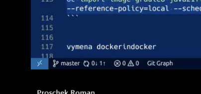


## jenkins rebuild

we have this done automatically: Openshift -> ocp4_jenkins_docker_slaves


master branch


we can check the log of build in jenkins as usual:


some agents are 2 min to build, but for ex. android agents and it takes 15-20 min. cause they have almost 10 gb of dependacies and downloaded software

at the end pipeline pushes image into quay:


## we can verify quay

we can refresh-> go to Tags and we can see the latest agent


## then he goes to dashboard -> quay management
https://lnd.svc.ifortuna.cz

there was some change

we need to go via terminal

`oc get is gradle8-java21:latest -n shared-images'


response he gets:


meaning it was not even created.

then he realised there was a mistake in the command, so all good


`oc describe is gradle8-java21`
here we can see where it links:


## manage jenkins -> clouds

kubernetes -> pod templates->

add the entry here

in this case its much easier to do it in YAML, otherise you need to copy everything from one window


we copied gradle7-java17 under and just changed the name (it has same cpu recourses and so on). Resources are the same, but we need to remove ID (we deleted whole line). so remove ID and we rename gradle7 and java 17 into gradle 8 and java21


then we type :wq (save it)
then check changes with diff

refresh termplates -> nothing..

go to configuration as code -> click Apply new configuration

then we go back to pod templates and refresh and we have the pod template there


## to check that everything works:

he has his own repo:


this pipeleine is set the same, so it will automatically trigger build:


his own romantest in Openshift folder jenkins:


first run takes some time. casue image stream needs to download
in the start of pipeline there is always configuration of new pods:


it failed due to gradle. so whats the point of hte test?:


## oc command to actually link them when the image is upploaded

Command tells to openshift to import this image from quay and its scheduled true, so it periodically tracks if there is a new image

```bash
oc import-image gradle8...
```


# decode password:

needed when we need to do manual steps (like login to some apps etc):


he added new credential with username and password 

testdecrypt 


you need to go to configuration as code:

view configuration
there you can find hashed password:


then you add it here and you see the password:


for ex. if he wants to check smth in bitbucket, where he doesnt have priveleges -> he uses jenkins credentials to login , check for webhook and find the error. if someone doesnt want to cooperate its handy

# in console you can change some jenkins parameters

there was problem with one plugin: html report
plugin sumarizes info from building and testing

in browswer developer view there was issue with csp
so he ran it and it worked:


then he changes this in production jenkins:


we can alsways resize the disk (check his presentation):


# architecture:


commands

```bash
systemctl status jenkins #check status
journalctl -e -u jenkins.service #show jenkins log = also available in GUI. manage jenkins -> system log -> all jenkins log
```


on server there is opt -> where everything related to jenkins is stored

## the server is on VMware:


# jenkins 4 - rewatch slowly - good to practice with shared library and big pipelins
openshift instructions for dif operations are in repo

we agreed with developers we test on chrome

check read me 

if you rebuild base container java 17 -> there are instructions on `rg trigger build` -> its enough to run pipeline

method code too large

for the future one of solutions when it hits limit

he created same directory vars in repo then he loaded all repo as shared library. cela pipeline and one line will call groovy script aso you will not have problem with this limit

global trusted pipeline libraries in jenkins ettings: for ex. for romantest he set up other custom libraries


# .net agent:
➡️ For a new .NET agent, this is where you work:
Add a new Dockerfile / folder for the .NET agent
Base it on an existing agent (Java, base, etc.)

3️⃣ Caching & volumes (good to know, not first step)
From this part:
“YAML files to create disks which are then mounted to some agents”
“Used as cache… saves network bandwidth”
This tells you:
Some agents mount PVCs (persistent volumes)
Used for Maven/npm/etc caches
➡️ For a first .NET agent:
❌ You do not need this initially
✅ Add later if NuGet caching is needed


https://console-openshift-console.apps.ocp02-cz.p.dc1.cz.ipa.ifortuna.cz/add/all-namespaces