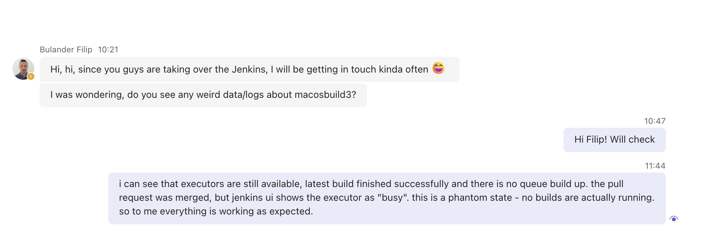
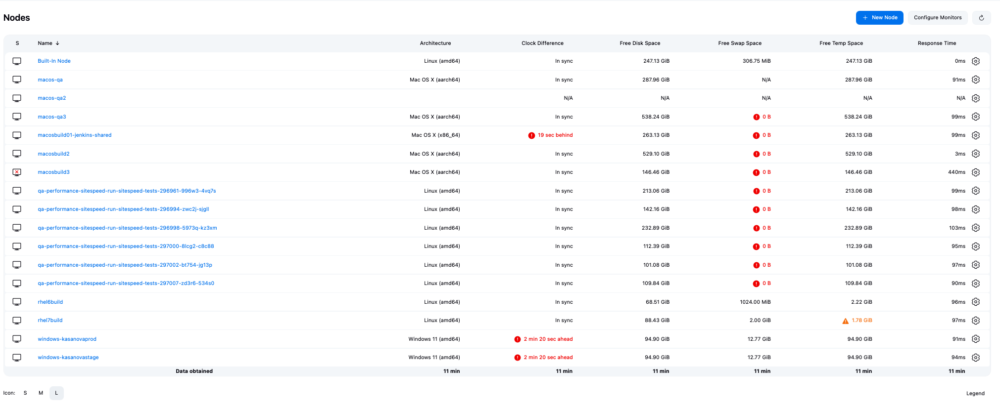
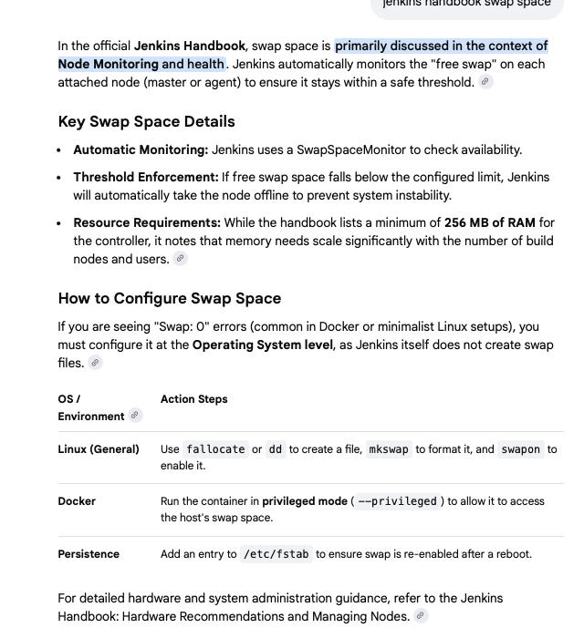

1. i went to the node macosbuild3
2. i checked that the builds and last one ran on 14 of jan and successfully
3. executors seemed to be still busy
4. i checked online, that it can happen, but main thing is that queue doesnt grow and node is responsive. 
5. i have verified that connection is ok:

```bash
Last login: Mon Feb  9 17:15:05 2026 from 10.255.5.120
[0 naseka@ad.ifortuna.cz@jenkins01-ocp01-shared.m.dc1.cz.ipa.ifortuna.cz ~]$ ping 10.90.213.11
PING 10.90.213.11 (10.90.213.11) 56(84) bytes of data.
^C                    
--- 10.90.213.11 ping statistics ---
256 packets transmitted, 0 received, 100% packet loss, time 261137ms

[1 naseka@ad.ifortuna.cz@jenkins01-ocp01-shared.m.dc1.cz.ipa.ifortuna.cz ~]$ nc -vz 10.90.213.11 22
Ncat: Version 7.92 ( https://nmap.org/ncat )
Ncat: Connected to 10.90.213.11:22.
Ncat: 0 bytes sent, 0 bytes received in 0.03 seconds.
```

Questions:
1) node offline. is it regular?
2) i cannot load build history or log

3) i also saw that i has 0 swap space? 


4) 





