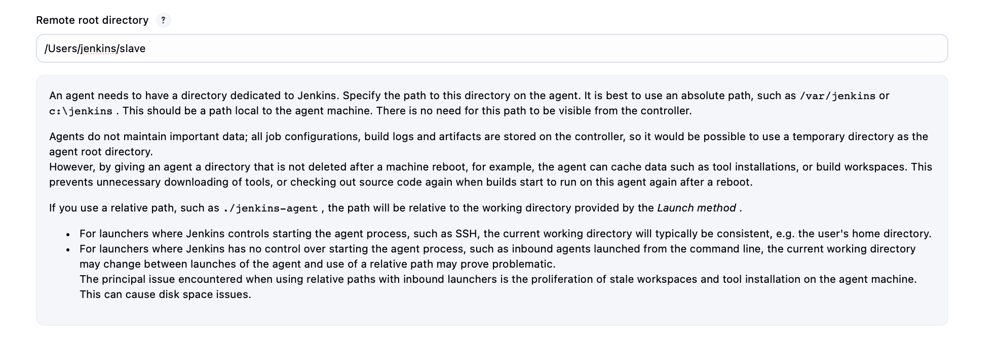

user 

server woruld be macos.2

manage jenkins -> nodes -> macos-qa is configured

## add new node: 
 macos-qa2 -> permanent agent
    
### Permanent Agent means:
        This Mac machine is always available
        Jenkins connects to it and keeps it registered
        It is not created dynamically like Kubernetes/OpenShift agents
        So this is a static machine, not ephemeral.
 
 

### number of executors: 

how many pipelines can run the same time (we can always add more if they want). 

            More executors = more parallel builds = more CPU/RAM usage.
            For Mac + Xcode builds, usually:
            1 executor is safest
            Sometimes 2 if the machine is strong


### Usage - only build jobs: 

jenkins doesnt try to run openshift agents 

This usually means:
* This node is meant only for regular build jobs
* Jenkins should NOT try to:
    * provision Kubernetes/OpenShift agents
    * run container-based dynamic agents
    * execute jobs that require special cloud configurations

How this is achieved in practice:

* You give this node a label, e.g. mac
* Pipelines must explicitly request:

```groovy
agent { label 'mac' }
```
So only jobs that ask for mac will run here.

Jenkins will not randomly schedule OpenShift/Kubernetes agents on it.


### Remote root directory:




its jenkins's home folder on that Mac agent, where Jenkins will:

* create workspace /
* cashe tools
* store temporary build data

we use absolute path, which is correct. we ssh to the mac.

it might lead to problems if on the mac side this `/Users/jenkins/slave` is not configured correctly

**How to check**

* SSH to the mac as Jenkins user
    use same credentials as Jenkins uses from my mac or try it from Jenkins controller?
    ```bash
    ssh jenkins@macos-qa2
    ```

* check directory exists and path is the same as in jenkins ui
   ```bash
    ls -ld /Users/jenkins/slave
    ```

* Check ownership (VERY important)

`stat /Users/jenkins/slave`

or 

`ls -ld /Users/jenkins/slave`

you want: 

        Owner: jenkins
        Group: usually staff
        Writable by owner
        If owner is not jenkins, builds will fail.


* Check Jenkins can write there:

```bash
touch /Users/jenkins/slave/.jenkins_test
rm /Users/jenkins/slave/.jenkins_test
```

* What Jenkins will do next (so you recognize problems)

When the agent connects, Jenkins will auto-create:

```swift
/Users/jenkins/slave/
├── remoting/
├── workspace/
└── tools/
```

If you don’t see these after connection, Jenkins cannot write there.


# Continuationf from notes:


for ex. we copy ip address requestor provided:


we need to add certificate (he added private one ). add credenetials -> ssh username with private key. private ssh key provided by requestor. 


we create environmental variables (copy paste from other mac):


then we can see the node -> check log:
trying to connect to that mac:


check if firewall network rules are in place in jenkins server:
`nc -zv 10.30.213.11.22`


and it is not:


the connection timeout -> they are missing firewall rules

so requestor needs to request firewall rules to allow jenkins server


we can do it ourselves:


source host is jenkins server

to check ip this command: `ip a`
destination is that computer 
port:22
protocol:both

you can theck ticket example:


we need to add this into permanent config:

manage jenkins -> configuration as code -> view configuration and ctl f for macos-qa2

we create a backup of jenkins yaml
then we edit the yaml file. -> check back up file for that day to see what exactly was changed:


