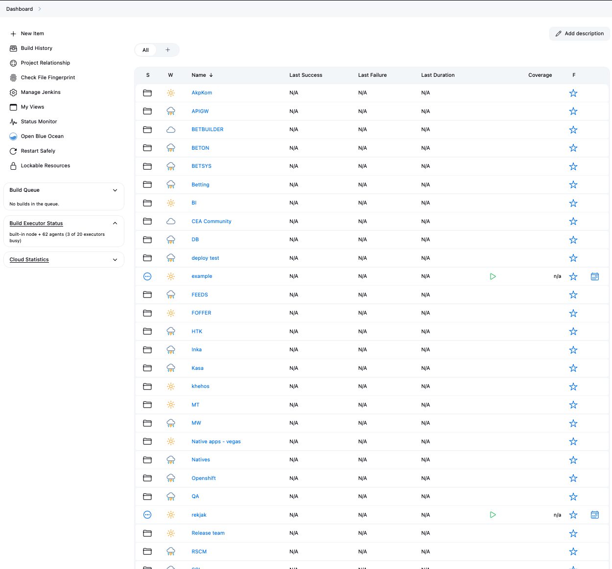
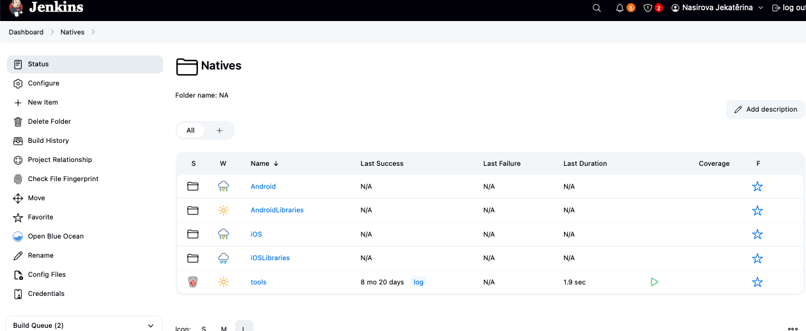
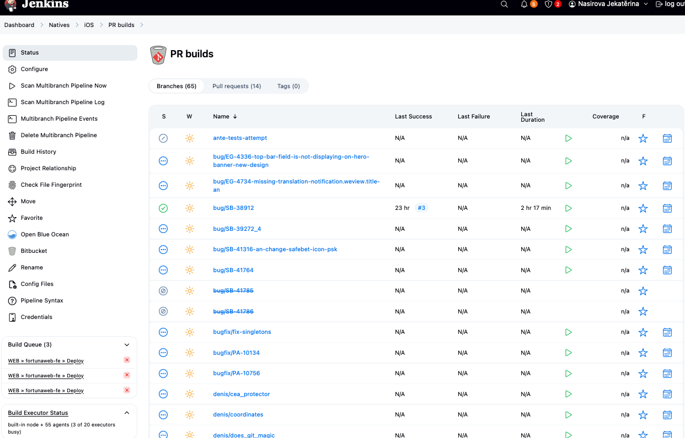
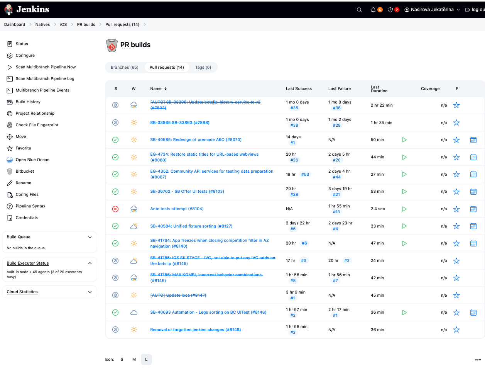
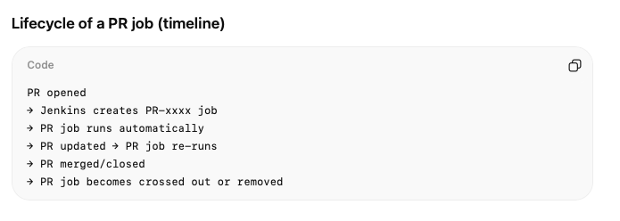
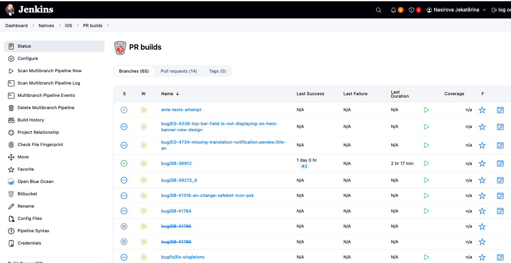

Our hierarchy in Fortuna:

```yaml
Jenkins (Dashboard)
└── Folder: Natives
    └── Folder: iOS
        ├── Multibranch Pipeline: PR builds
        │   ├── Pull Requests
        │   │   ├── PR-8145   (actual pipeline job)
        │   │   └── PR-8146
        │   └── Branches
        │       ├── main      (actual pipeline job)
        │       └── develop
        └── Pipeline Job: Release
```


screenshots explanation of levels:

* Jenkins (Dashboard)
    * some are folders (they group jobs logically, give structure, not execution)
    * some are jobs or pipelines (they can execute builds, have play button)


* Folder: Natives
    * platform folders
    * job tools = multibranch pipeline job



* Folder: iOS
    * PR builds (multibranch pipeline) - itself does not build application code, it only creates and manages build jobs
        * exists to automatically validate code changes coming from Pull Requests and (optionally) branches.
        * it is CI entry point for iOS changes
        * PR builds ("if we merge this change, will the codebase still work?") -> if build successes code is merged and is now in main or develop
        1) it connects to the iOS Git repository (Bitbucket)
        2) it scans the repository
        3) it discovers: pull requests and branches (two columns on top):
        
        4) for each discovered item creates a child pipeline job, runs jesnkinsfile from that branch/PR

    * Release (multinbranch pipeline release oriented)
        * it runs release workflows from selected branches of the iOS repository
        * answers a question: out of approved code in main or develop, which do we ship and when? its not automatic. 
    
* Folder: iOS - PR builds - Pull requests

    

    * automatically created pipeline jobs. created when
        * a PR is opened
        * new commmits are pushed to the PR branch
    * each entry corresponds 1:1 to a PR in Bitbucket
    * temporary pipeline job, created automatically when PR is opened
    * deleted or disabled when the PR is closed/merged
    * it builds potential merge "if we merge this PR right now, will the result still build and pass tests?"
    * exists only to protect merges
    * crossed out when
        * PR was merged
        * PR was closed
        * Jenkins marks it as orphaned
        * crossed out means historical, no longer active.
    * play button on pr jobs: run the pipelione for that PR. usually not needed because PR jobs are autotriggered. used mainly for re-runs or debugging.
    * Lifecycle of a PR job:
        

    

* Folder: iOS - branches


    * exists because GIT branch exists
    
        the flow:

            Local branch created:
            → branch pushed to Bitbucket
            → Jenkins branch job created & runs
            → PR created
            → Jenkins PR job created & runs
            → PR merged
            → PR job crossed out
            → branch optionally deleted
            → branch job crossed out