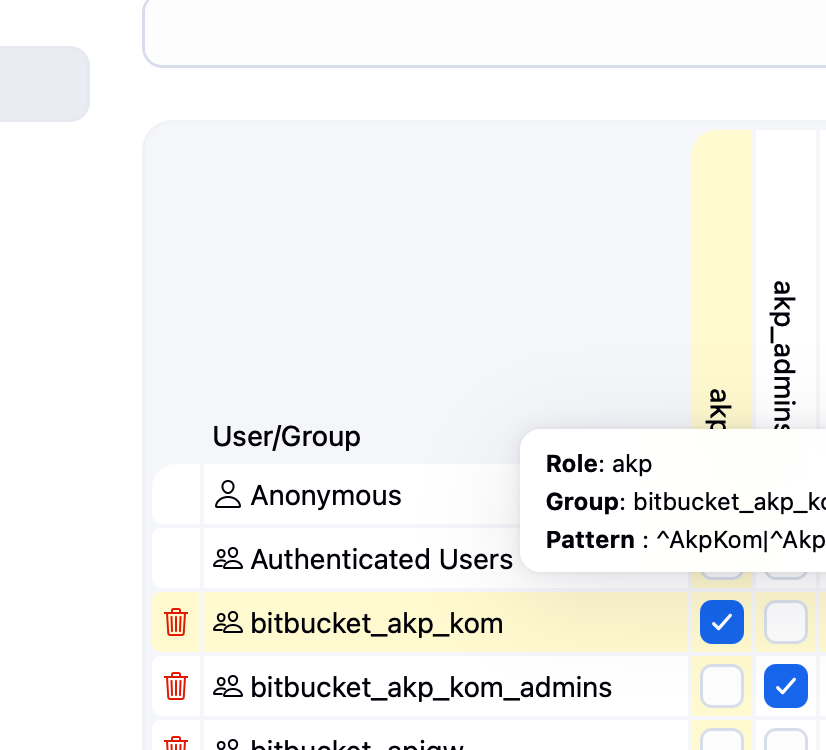
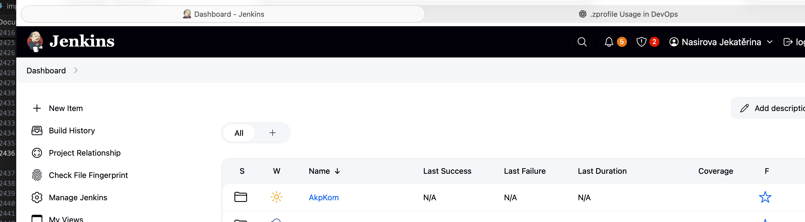
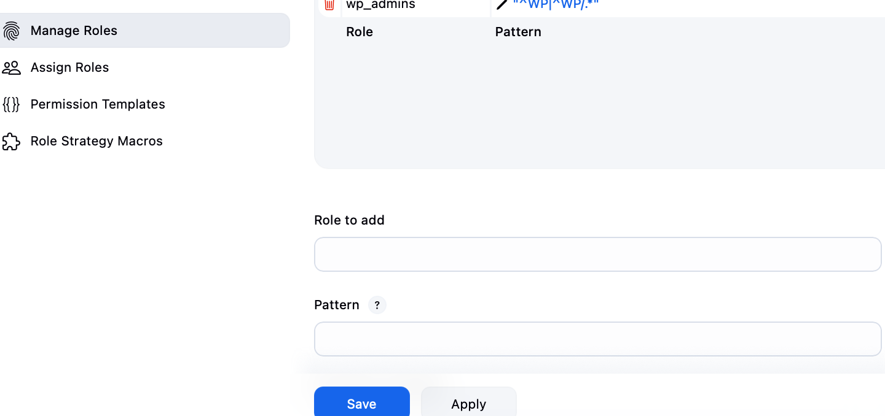
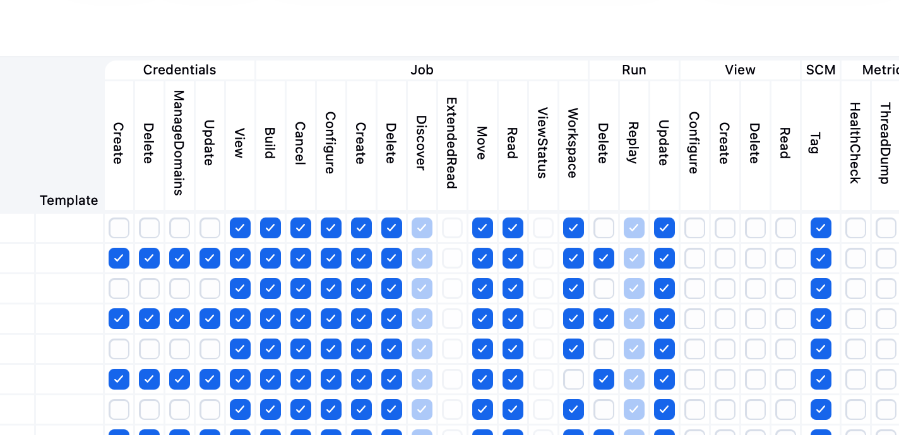
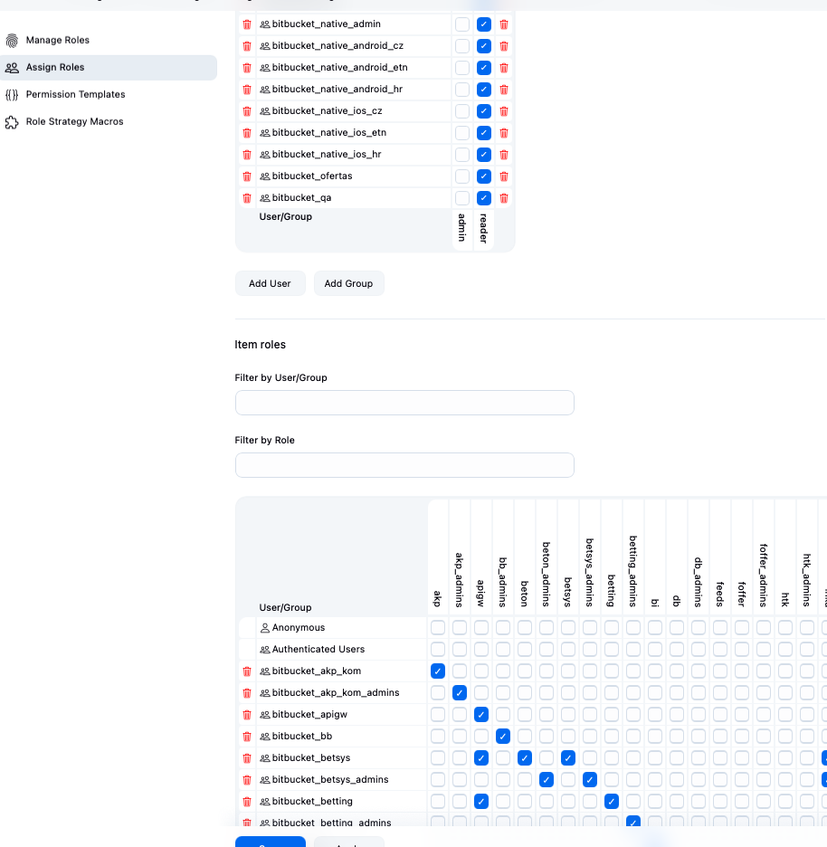
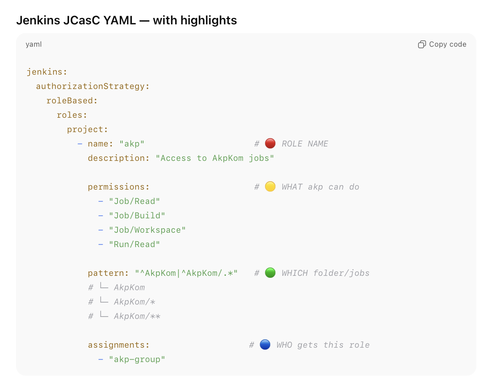
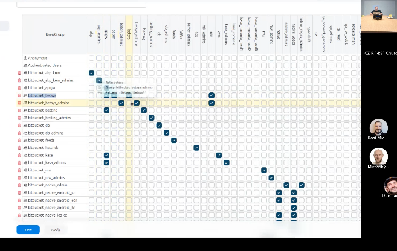
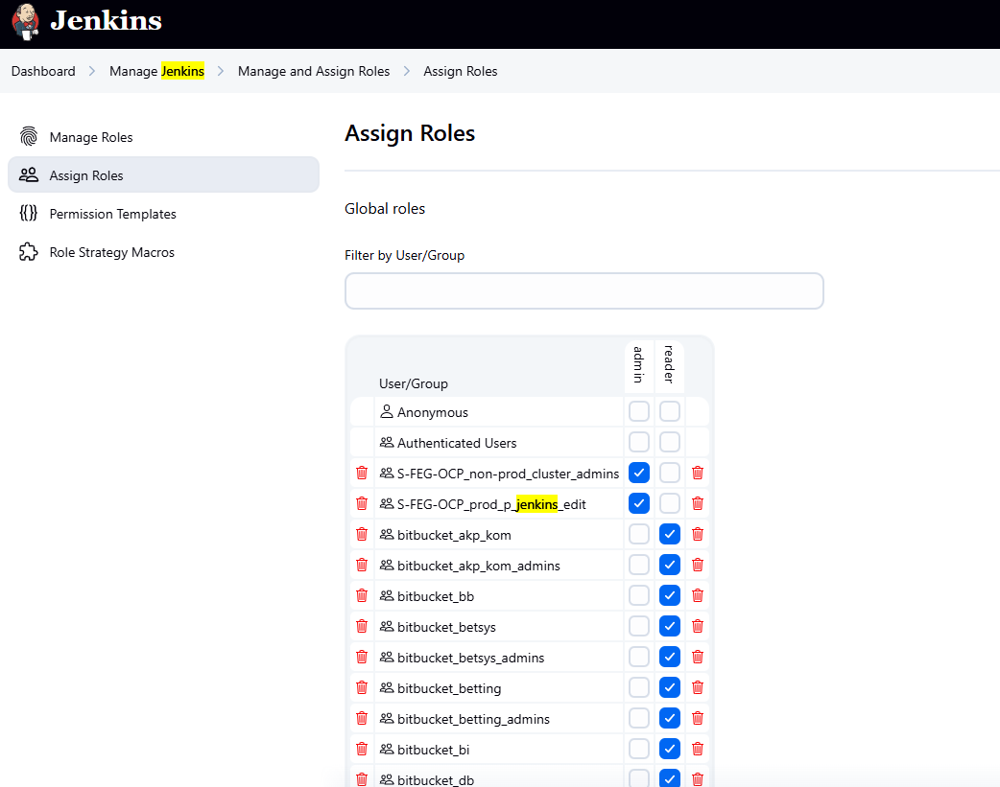

# Creating New Teams/Spaces in Jenkins

When a new team wants Jenkins space:

Steps are:

1. Create folder / space in Jenkins.

   - add access to this folder
   - all bitbucket group assigned to this folder will be able to create jobs

2. Update configuration-as-code files.

3. IT term: Configuration as Code = storing Jenkins settings in text files rather than manual GUI edits.

Example:
Adding a new group to the YAML ensures the configuration survives Jenkins restarts.

## Organizationally

- Admins create folders & set access.

- Teams configure their own pipelines.

- Some unclear folder naming conventions.

- Jira integration exists but not centrally managed.

## Folders & Access Control

Folders represent teams or shared projects.

- access is controlled via Bitbucket groups

- admins can see everything

- regular teams see only assigned folders

Example:

- Team A sees Folder A

- Team B sees Folder B

Admins: full access.

## adding a new groupe/role to Jenkins UI:

Roles map to AD groups.

* *Role akp can access the Jenkins folder AkpKom and everything inside it — nothing else.*

here is the folder:

how to do it in UI:

In the Project roles section:
In “Role to add”: type akp
In “Pattern”: paste:
^AkpKom|^AkpKom/.*
Click Add:

then check boxes on on the right side for that role:

then go back to assign roles and add the group and check reader

then update yaml (not exactly, adjust for actual yaml in fortuna):

## Active Directory Authentication

Jenkins uses AD for login:

- AD groups govern roles
- Some login slowness exists
- Still unresolved, but optimized where possible

_IT term: AD = centralized user management system._

Example:
Member of AD_DEV_TEAM → gets access to folder Dev.

## Roles & Permissions

Two building blocks:

- Roles = WHAT you can do (read/configure/build)
- Folder assignment = WHERE you can do it

we have regular and admin role next to group name. for ex betsys and betsys admin. best is to compair side by side existing ui and existing yaml. its really hard in yaml 

**Example:**
Role _mobile_admin_ applied to folder _/mobile-app_ enables:

- read
- configure
- build

Roles map to AD groups.

* *Role akp can access the Jenkins folder AkpKom and everything inside it — nothing else.*

here is the folder:

Assign the role to a group/user
Go back to Manage and Assign Roles
Click Assign Roles
Go to Project roles tab/section
In “User/group to add”:
type your group name (e.g. akp-group) or a username
click Add
In the table, find that user/group row and tick akp
Click Save

