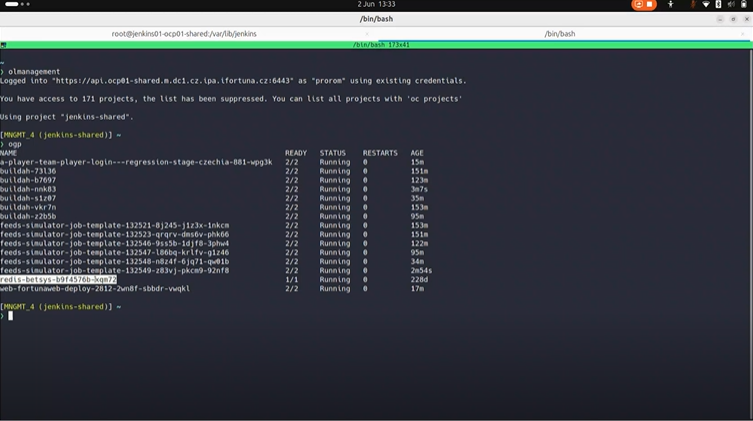

# OpenShift OC command-line tool (OpenShift CLI)

## commands

```bash
oc login ...token.. #token is taken from here: https://console-openshift-console.apps.ocp01-shared.m.dc1.cz.ipa.ifortuna.cz
oc logout
oc get projects
oc project jenkins-shared
oc get pods # to see table with pods
oc whoami
oc status
oc get is gradle8-java21 -n shared-images 
oc describe is gradle8-java21
```


Roman was connected to OpenShift using the oc command-line tool (OpenShift CLI).

This is NOT Jenkins.

This is the container platform where Jenkins agents run:



```pgsql
Logged into "https://api.ifortuna.cz:6443" as "prorom" using existing credentials.
You have access to 171 projects, the list has been suppressed.
Using project "jenkins-shared".
```

**Logged into "https://...:6443"**

This means:

- He is connected to an OpenShift cluster
- :6443 is the Kubernetes API port
- This is the central control endpoint of OpenShift

Think of it as: _“I am now connected to the OpenShift control plane”_

**as "prorom" using existing credentials.**

This means:

- he is authenticated as himself

* He logged in earlier
* OpenShift saved his login token
* No need to retype password now

**You have access to 171 projects**

In OpenShift:

- a project = namespace
- it’s a logical environment

Examples:

- jenkins-shared
- dev-app1
- test-app2

He has access to many, but OpenShift hides the list to avoid clutter.

**Using project "jenkins-shared"**

This is **very important.**

It means: _“All commands I run now apply to the jenkins-shared namespace.”_

This is where:

- Jenkins agents run
- Jenkins-related containers live

## To see pods

Type in OpenSHift CLI

```bash
ogp
```

or

```bash
oc get pods
```

Then you see table with pods

```sql

NAME                                  READY   STATUS    RESTARTS   AGE
jenkins-agent-abc123                  2/2     Running   0          12m
jenkins-agent-def456                  2/2     Running   1          3h

```

- **NAME**: autogenerated pod name. Each pod usually = one Jenkins agent
- **READY**: 2 containers inside the pod, 2 are running correctly.
  - Common Jenkins pod containers:
    - `jnlp` (communication with Jenkins)
    - `build` (actual build container)
  * If you see 1/2 -> smth is wrong

* **STATUS**: common values:

  - Running ✅
  - Pending (waiting for resources)
  - CrashLoopBackOff ❌
  - Completed (job finished)

* **RESTARTS**:

  - `1` means:
    - a container crashed and restarted
    - occasional 1 is normal
    - growing numbers = problem

* **AGE**: How long the pod has existed

  - Example:
    `` go
12m`, `3h`, `2d`
     ``

Jenkins agents: - appear when pipeline starts - disappear when pipeline ends
