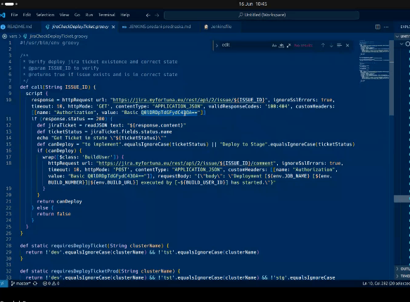
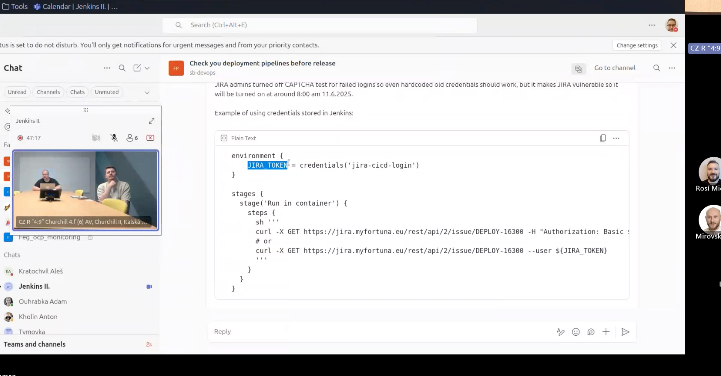

# Credentials Management

Stored credentials include:

- Bitbucket tokens
- Jira credentials
- SSH keys

Developers reference credentials using variables.

_IT term: base64 encoding_ = representation of binary data in ASCII text.

Example workflow:

- Developer references $BITBUCKET_TOKEN
- Jenkins injects the actual token from credential store

Important detail:

- Shared pipelines sometimes hardcode passwords → bad practice → painful during password changes.

for ex. here in shared pipeline:

but they should use the credential:

it depends on developers though. we dont change shared pipelines, it is done by developers.

you need to choose domain - global 

we use username with password

after that dont forget to update yaml file