# Pull latest changes from Bitbucket 

1. docker repo is already on my comp
2. stashed changes: `git stash`
3. pull latest fortuna repo `git pull` -> conflict:
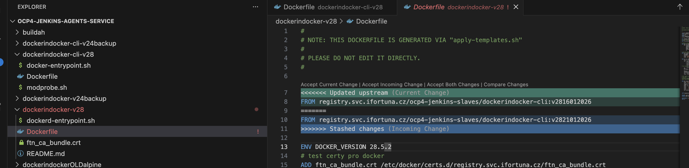
4. accepted current change (roman's registry address)
5. `git add ..file..`
6. `git commit -m "keep upstream dockerfile"`
7. `git stash list`
8. `git stash drop stash{0}` or `git stash clear`
9. `git status`

### i can see that all is modified already!!!! -> so no need to push to repo 

# verify whether v28 both cli and daemon images are in the registry
1. i can see cli image:
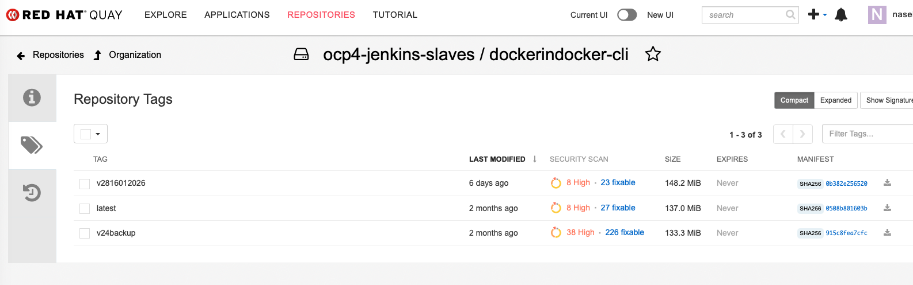
2. i can see daemon image:
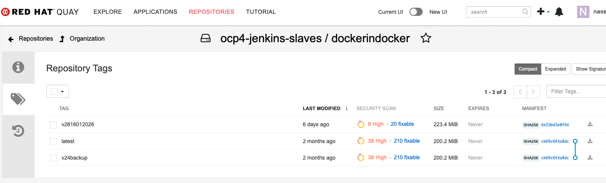

# verify docker daemon runnning

* so i open orbstack app: 

```bash
naseka@CZMB94D536 ocp4-jenkins-agents-service % open -a OrbStack
```

* then i verify docker daemon:

`docker info`

# docker login to registry
### Generate encrypted pwd

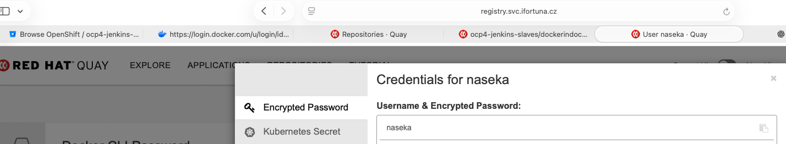

### docker login cmd

```bash
naseka@CZMB94D536 ocp4-jenkins-agents-service % docker login registry.svc.ifortuna.cz \
> -u="naseka" \
> -p="here i put generated encripted pwd from registry account"
```


# pull remote image for cli


### pull existing image

`docker pull registry.svc.ifortuna.cz/<repo>:<tag>`

### another error 
```bash
naseka@CZMB94D536 ocp4-jenkins-agents-service % docker pull registry.svc.ifortuna.cz/repository/ocp4-jenkins-slaves/dockerindocker-cli:v2816012026
Error response from daemon: unauthorized: access to the requested resource is not authorized
naseka@CZMB94D536 ocp4-jenkins-agents-service % 
```

### quay actually gives you correct command with repo address:

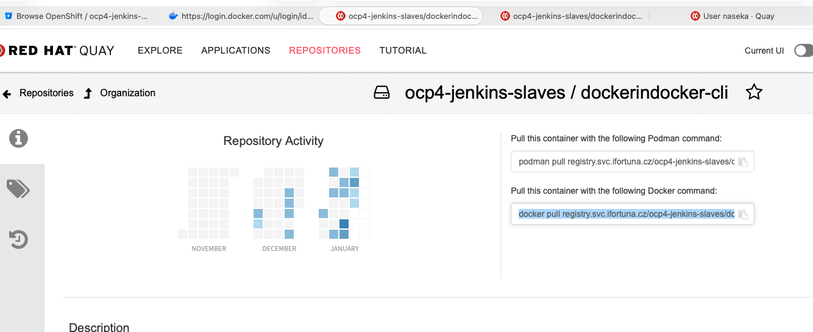

now all good:

```bash
naseka@CZMB94D536 ocp4-jenkins-agents-service % docker pull registry.svc.ifortuna.cz/ocp4-jenkins-slaves/dockerindocker-cli:v2816012026
v2816012026: Pulling from ocp4-jenkins-slaves/dockerindocker-cli
ff45be1b2cf4: Already exists 
1a33311d8ecf: Pull complete 
8f8886f680ef: Pull complete 
1a878466937c: Pull complete 
d97052227e3a: Pull complete 
ba114cd4047b: Pull complete 
9daa6df0e600: Pull complete 
2d62301305a3: Pull complete 
Digest: sha256:0b382e25652098a5528a54d19dd8fc1a11b43b507d66595bd479d206b4488e48
Status: Downloaded newer image for registry.svc.ifortuna.cz/ocp4-jenkins-slaves/dockerindocker-cli:v2816012026
registry.svc.ifortuna.cz/ocp4-jenkins-slaves/dockerindocker-cli:v2816012026
naseka@CZMB94D536 ocp4-jenkins-agents-service % 
```

I can see it in Orbstack

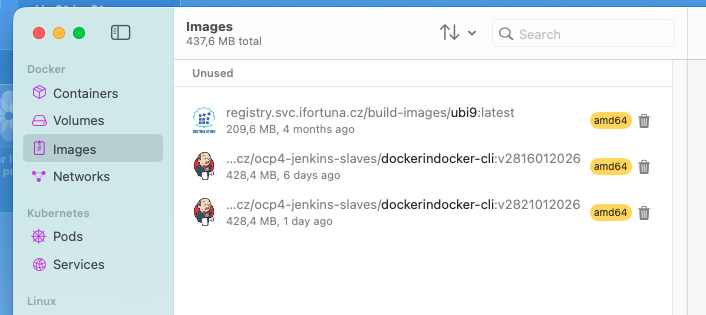


# inspect pulled image locally (metadata)

`docker images`

`docker inspect ..`:

search for creation date, os, architecture

```bash
naseka@CZMB94D536 ocp4-jenkins-agents-service % docker inspect registry.svc.ifortuna.cz/ocp4-jenkins-slaves/dockerindocker-cli:v2816012026|less
```

# run image locally

```bash
naseka@CZMB94D536 ocp4-jenkins-agents-service % docker run --rm -it \
> registry.svc.ifortuna.cz/ocp4-jenkins-slaves/dockerindocker-cli:v2816012026 \
> sh
WARNING: The requested image's platform (linux/amd64) does not match the detected host platform (linux/arm64/v8) and no specific platform was requested
sh-5.1# 
```

### test cli commands

`docker --version`
`docker buildx version`
`docker compose version`


```bash
sh-5.1# docker --version
Docker version 28.5.2, build ecc6942
sh-5.1# buildx version 
sh: buildx: command not found
sh-5.1# docker buildx version
github.com/docker/buildx v0.29.1 a32761aeb3debd39be1eca514af3693af0db334b
sh-5.1# docker compose version
Docker Compose version v2.40.3
sh-5.1# 
```

i compaired it with the version in github docker file for latest major 28 release: all good

# exit running container -> all good
`exit`

# pull remote image for daemon

`docker pull registry.svc.ifortuna.cz/ocp4-jenkins-slaves/dockerindocker:v2816012026`

# inspect metadata 
`docker inspect registry.svc.ifortuna.cz/ocp4-jenkins-slaves/dockerindocker:v2816012026|less`


# run tests

Roman's instructions:
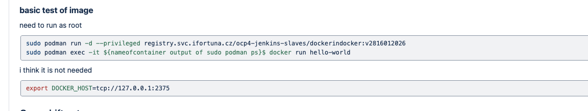

## why sudo:
Podman “rootless vs rootful”

Without sudo you’re running rootless Podman (as your user).
With sudo you’re running rootful Podman (as real root).

DinD is one of those cases where rootless often breaks or becomes painful, because starting a daemon inside a container needs things like:
mounting filesystems / managing cgroups
creating network devices / iptables/NAT
manipulating namespaces in ways rootless restricts

So the quick reliable path is: run the DinD container with rootful Podman → sudo podman run

## why privileged:
--privileged basically says: “give this container almost all capabilities and relax most security restrictions.”
DinD specifically tends to need it because the inner Docker daemon wants to:
create its own network stack (bridge, veth pairs)
manage iptables rules
mount overlayfs / manage storage drivers
access cgroups properly

`sudo podman run -d --privileged registry.../dockerindocker:v28...` = This starts your DinD agent container, which runs Docker daemon inside


### actual tests:
1) `sudo docker run`

```bash
naseka@Mac ocp4-jenkins-agents-service % sudo docker run -d --privileged registry.svc.ifortuna.cz/ocp4-jenkins-slaves/dockerindocker:v2816012026
Password:
WARNING: The requested image's platform (linux/amd64) does not match the detected host platform (linux/arm64/v8) and no specific platform was requested
d8fcc04fda25aeb4d374a77026e5b77fb18e62531c653628f486ce1bc7fc5063
naseka@Mac ocp4-jenkins-agents-service % 
```
2) `sudo docker ps` = shows running containers

 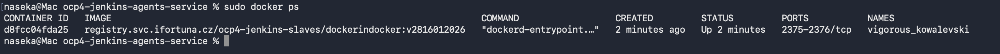

3) `sudo docker exec`

`sudo docker exec -it d8fcc04fda25 docker run hello-world`

SUCCESS!!!

```bash
naseka@Mac ocp4-jenkins-agents-service % sudo docker run -d --privileged registry.svc.ifortuna.cz/ocp4-jenkins-slaves/dockerindocker:v2816012026
Password:
WARNING: The requested image's platform (linux/amd64) does not match the detected host platform (linux/arm64/v8) and no specific platform was requested
d8fcc04fda25aeb4d374a77026e5b77fb18e62531c653628f486ce1bc7fc5063
naseka@Mac ocp4-jenkins-agents-service % sudo docker ps
CONTAINER ID   IMAGE                                                                     COMMAND                  CREATED         STATUS         PORTS           NAMES
d8fcc04fda25   registry.svc.ifortuna.cz/ocp4-jenkins-slaves/dockerindocker:v2816012026   "dockerd-entrypoint.…"   2 minutes ago   Up 2 minutes   2375-2376/tcp   vigorous_kowalevski
naseka@Mac ocp4-jenkins-agents-service % sudo docker exec -it d8fcc04fda25 docker run hello-world
Password:
Unable to find image 'hello-world:latest' locally
latest: Pulling from library/hello-world
17eec7bbc9d7: Pull complete 
Digest: sha256:05813aedc15fb7b4d732e1be879d3252c1c9c25d885824f6295cab4538cb85cd
Status: Downloaded newer image for hello-world:latest

Hello from Docker!
This message shows that your installation appears to be working correctly.

To generate this message, Docker took the following steps:
 1. The Docker client contacted the Docker daemon.
 2. The Docker daemon pulled the "hello-world" image from the Docker Hub.
    (amd64)
 3. The Docker daemon created a new container from that image which runs the
    executable that produces the output you are currently reading.
 4. The Docker daemon streamed that output to the Docker client, which sent it
    to your terminal.

To try something more ambitious, you can run an Ubuntu container with:
 $ docker run -it ubuntu bash

Share images, automate workflows, and more with a free Docker ID:
 https://hub.docker.com/

For more examples and ideas, visit:
 https://docs.docker.com/get-started/

naseka@Mac ocp4-jenkins-agents-service % 
```


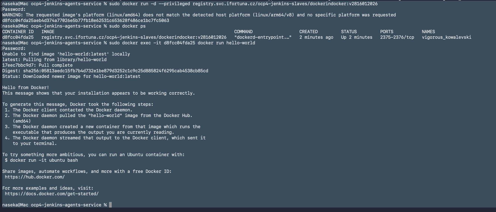


# image stream (check and update readme)


1. login to oc

`oc login`

2. change project to shared images:
`oc project shared-images`

3. check existing image streams:
`oc get is`


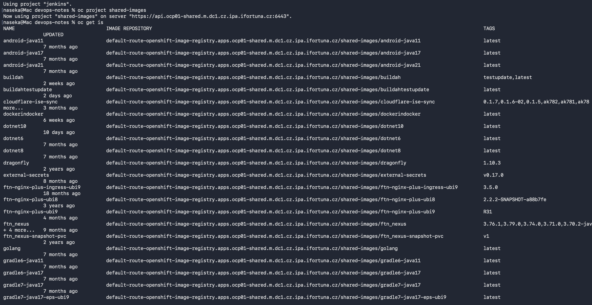


4. search for docker ones:
`oc get is|grep docker`

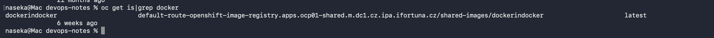

i can see only one image stream with latest tag -> so i can add my tag

the name of image and tag are inside this link in pod template: 


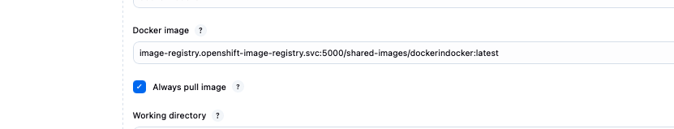


5. add a new tag to our image stream 

```bash
oc import-image dockerindocker:v28-16012026 \ # imagename:tag -> we name it as we wish. i added dash for readability
  --from=registry.svc.ifortuna.cz/ocp4-jenkins-slaves/dockerindocker:v2816012026 \ #address in registry, where image is 
  --reference-policy=local \ #when pods reference this imageStreamTag -> rewrite it to pull from the openshift internal registry (image-registry.openshift-image-registry.svc:5000/...) instead of the original external registry.
  --scheduled=true \ # here its unnecessary, cause with every new import new tag will be added, so it will keep checking, but nothing will change anyway
  --confirm \ # actually performs the import
  -n jenkins # running import in the shared-images namespace (project)
```

## my actual command is without scheduled:
naseka@Mac devops-notes % oc import-image dockerindocker:v28-16012026 \                            
> --from=registry.svc.ifortuna.cz/ocp4-jenkins-slaves/dockerindocker:v2816012026 \
> --reference-policy=local \
> --confirm \
> -n jenkins


## ran command, but error forbidden, but then the rights were added:
```bash
Error from server (Forbidden): imagestreamimports.image.openshift.io is forbidden: User "naseka" cannot create resource "imagestreamimports" in API group "image.openshift.io" in the namespace "shared-images"
naseka@Mac devops-notes % 
```

## full terminal:

```bash
naseka@CZMB94D536 ~ % oc import-image dockerindocker:v28-16012026 \
> --from=registry.svc.ifortuna.cz/ocp4-jenkins-slaves/dockerindocker:v2816012026 \
> --reference-policy=local \
> --confirm \
> -n jenkins
imagestream.image.openshift.io/dockerindocker imported

Name:			dockerindocker
Namespace:		jenkins
Created:		Less than a second ago
Labels:			<none>
Annotations:		openshift.io/image.dockerRepositoryCheck=2026-01-23T11:59:36Z
Image Repository:	default-route-openshift-image-registry.apps.ocp01-shared.m.dc1.cz.ipa.ifortuna.cz/jenkins/dockerindocker
Image Lookup:		local=false
Unique Images:		1
Tags:			1

v28-16012026
  tagged from registry.svc.ifortuna.cz/ocp4-jenkins-slaves/dockerindocker:v2816012026
    prefer registry pullthrough when referencing this tag

  * registry.svc.ifortuna.cz/ocp4-jenkins-slaves/dockerindocker@sha256:6e53bd3e0f64062404e02dd49a25653b37ecfe47865dd3cb8a776e32b7e8e1e4
      Less than a second ago

Image Name:	dockerindocker:v2816012026
Docker Image:	registry.svc.ifortuna.cz/ocp4-jenkins-slaves/dockerindocker@sha256:6e53bd3e0f64062404e02dd49a25653b37ecfe47865dd3cb8a776e32b7e8e1e4
Name:		sha256:6e53bd3e0f64062404e02dd49a25653b37ecfe47865dd3cb8a776e32b7e8e1e4
Created:	Less than a second ago
Annotations:	image.openshift.io/dockerLayersOrder=ascending
Image Size:	234.2MB in 14 layers
Layers:		76.8MB	sha256:ff45be1b2cf4d7ce703ce242a15cfc63cf31056018b4654e68665c53371b2e2f
		12.73MB	sha256:1a33311d8ecf534b3eac6f139bfb4a0cfd296f9dff08d30b70f30d1339c1e11c
		20.09MB	sha256:8f8886f680ef51b8b83eb1dcc63a45d5197ad59993ca415a67aaace496a07fc0
		23.07MB	sha256:1a878466937c57b2aa36540512ff2ea95441643a5cffbe0e372f6af715d3bdcc
		22.74MB	sha256:d97052227e3a6cee142faef1f013cd8ac4b45e560a38516531bfd4b129a57442
		705B	sha256:ba114cd4047b755e4b4a7900b24119b621c33d6adce96e39f08ecbb740dc2983
		1.182kB	sha256:9daa6df0e6002f6df648405cfcecfdb3eca69b28e87cf284c9abf128eccc29ad
		234B	sha256:2d62301305a3185093eb8441999d210dd572488d604b8a37a6a7d0de7abe9ea3
		12.78kB	sha256:e99792ea3d392aff79eacb490fa1295e075ad7a0621829e5230c279921dd6068
		13.81MB	sha256:e585e00720eb0abb75efd3b7e0eee3a72fd6991a50b2db1f46bc6c24fe4b3ca0
		1.523kB	sha256:7408a080784056ab30ac2f55430bd8be5fe93a2e9108202905bb979caaa08a3f
		64.96MB	sha256:bb52a8b4153eb6a6ba9f16197f07fa78737dd13af03f6244a4ce8c63c27936dd
		2.153kB	sha256:69cc52d9334c6eb7ab6594094fa9465b4de417ba0434e459333814e296e76904
		3.084kB	sha256:5ecc2d987739837811a586c54b33c95964a146c512f67e638cf8eaf381502eab
Image Created:	7 days ago
Author:		<none>
Arch:		amd64
Entrypoint:	dockerd-entrypoint.sh
Working Dir:	/
User:		<none>
Exposes Ports:	2375/tcp, 2376/tcp
Docker Labels:	architecture=x86_64
		build-date=2025-09-18T08:46:43Z
		com.redhat.component=ubi9-container
		com.redhat.license_terms=https://www.redhat.com/en/about/red-hat-end-user-license-agreements#UBI
		description=The Universal Base Image is designed and engineered to be the base layer for all of your containerized applications, middleware and utilities. This base image is freely redistributable, but Red Hat only supports Red Hat technologies through subscriptions for Red Hat products. This image is maintained by Red Hat and updated regularly.
		distribution-scope=public
		io.buildah.version=1.33.7
		io.k8s.description=The Universal Base Image is designed and engineered to be the base layer for all of your containerized applications, middleware and utilities. This base image is freely redistributable, but Red Hat only supports Red Hat technologies through subscriptions for Red Hat products. This image is maintained by Red Hat and updated regularly.
		io.k8s.display-name=Red Hat Universal Base Image 9
		io.openshift.expose-services=
		io.openshift.tags=base rhel9
		maintainer=Red Hat, Inc.
		name=ubi9
		org.opencontainers.image.revision=a467c5c3b658cb31bf21105b08df3cffa0f60ca7
		release=1758184894
		summary=Provides the latest release of Red Hat Universal Base Image 9.
		url=https://catalog.redhat.com/en/search?searchType=containers
		vcs-ref=a467c5c3b658cb31bf21105b08df3cffa0f60ca7
		vcs-type=git
		vendor=Red Hat, Inc.
		version=9.6
Environment:	PATH=/usr/local/sbin:/usr/local/bin:/usr/sbin:/usr/bin:/sbin:/bin
		container=oci
		DOCKER_BUILDX_VERSION=0.29.1
		DOCKER_COMPOSE_VERSION=2.40.3
		DOCKER_TLS_CERTDIR=/certs
		DOCKER_VERSION=28.5.2
Volumes:	/var/lib/docker


naseka@CZMB94D536 ~ % oc import-image dockerindocker:v28-16012026 \
--from=registry.svc.ifortuna.cz/ocp4-jenkins-slaves/dockerindocker:v2816012026 \
--reference-policy=local \
--confirm \
-n jenkins

```

6. `oc get is`

i can see my image now:

```bash
naseka@CZMB94D536 ~ % oc get is                                    
NAME             IMAGE REPOSITORY                                                                                           TAGS           UPDATED
dockerindocker   default-route-openshift-image-registry.apps.ocp01-shared.m.dc1.cz.ipa.ifortuna.cz/jenkins/dockerindocker   v28-16012026   2 minutes ago
naseka@CZMB94D536 ~ % 
```
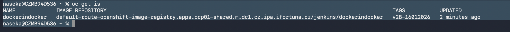


# edit file on the server - simpler to do it first


# create a new pod template in jenkins


# Extras: 


Variable "DOCKER_HOST"	= where Docker daemon lives

```bash
sh-5.1# echo "$DOCKER_HOST"
tcp://docker:2375
sh-5.1# 
```

`env`
prints all environment variables available in the current shell


```bash
sh-5.1# env | grep DOCKER
DOCKER_VERSION=28.5.2
DOCKER_BUILDX_VERSION=0.29.1
DOCKER_TLS_CERTDIR=/certs
DOCKER_COMPOSE_VERSION=2.40.3
DOCKER_HOST=tcp://docker:2375
sh-5.1# 
```

