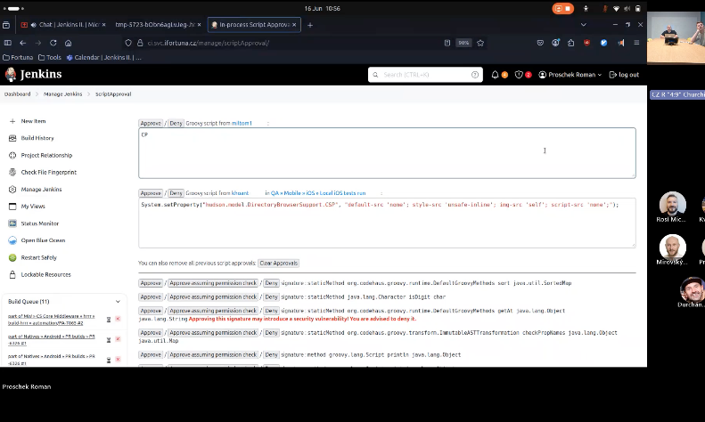

# Manage Jenkins -> Script Approval

Jenkins sometimes blocks scripts for security reasons.

      Jenkins can run scripts (small programs) inside pipelines.

      Some scripts are powerful.
      Too powerful.

      So Jenkins thinks:

      “I don’t fully trust this script yet.”

      And it blocks it.

Admin can:

- approve script
- or reject it

This happens rarely, but requires trust — because approval could open vulnerabilities.

you need to approve here. but its hard cause its just we trust developer.

## What happens when a script is blocked?

- Pipeline starts
- Jenkins sees an unsafe operation
- Jenkins stops the pipeline
- Jenkins asks an admin for a decision

This is called Script Approval.