# Monitoring with Grafana

Grafana dashboards help track:

- CPU spikes
- memory usage
- agent failures

_IT term: Grafana = tool for visualization of metrics._

Helpful for:

- diagnosing memory problems
- deciding resource increases

Example:

- find pod name in Jenkins log
- search it in Grafana
- view historical graph

# Troubleshooting - CPU and RAM usage of agents

- https://grafana-thanos-shared.apps.ocp01-shared.m.dc1.cz.ipa.ifortuna.cz/d/OdFOFFNIk/jenkins-agents?orgId=1&from=1747659691680&to=1747660591680
- select time and refresh page
- select pod
- select container

---

# checking memory spikes

in jenkins log i found out when OOM error started happening and based on that filtered grafana:


## i can check the logs on controller for the time around OOM for all pods and find out name of pods:

```bash
sudo journalctl -u jenkins --since "2026-03-31 11:30:00" --until "2026-03-31 13:30:00" -o short-iso | grep 'Created Pod: kubernetes jenkins-shared/'
```

i found out that for some time no pods were created (so its the time of crash exactly):

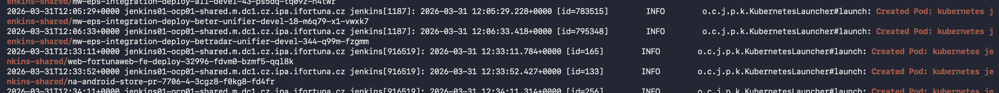

## now i want to find top pod-creatig job famillies before the crash:

```bash
sudo journalctl -u jenkins --since "2026-03-31 11:30:00" --until "2026-03-31 12:10:00" -o short-iso | grep 'Created Pod: kubernetes jenkins-shared/' | sed 's/.*jenkins-shared\///' | awk -F- '{NF-=2; print $0}' OFS="-" | sort | uniq -c | sort -nr | head -20
```
result:

```bash
[0 naseka@ad.ifortuna.cz@jenkins01-ocp01-shared.m.dc1.cz.ipa.ifortuna.cz ~]$ sudo journalctl -u jenkins --since "2026-03-31 11:30:00" --until "2026-03-31 12:10:00" -o short-iso | grep 'Created Pod: kubernetes jenkins-shared/' | sed 's/.*jenkins-shared\///' | awk -F- '{NF-=2; print $0}' OFS="-" | sort | uniq -c | sort -nr | head -20
      8 ifier-sb-41925-springboot-4-uplift-analysis-with-cursor
      7 orter-sb-41925-springboot-4-uplift-analysis-with-cursor
      4 rvice-sb-41925-springboot-4-uplift-analysis-with-cursor
      4 ore-middleware-data-shovel-build-data-shovel-fix-master
      3 ation-an-validate-coverage-reports-from-nighlty-builds
      2 tting--deployment-pipelines-betting-backoffice-service
      2 isher-sb-41925-springboot-4-uplift-analysis-with-cursor
      2 b-services-mw-promotion-manager-build-bugfix-2feg-5160
      1 xeps-integration-sonarqube-offer-pairing-service-pr-937
      1 xbuild-jacktime-service-feature-2fpa-12121-mls-unsettle
      1 x-all-sb-41925-springboot-4-uplift-analysis-with-cursor
      1 wp-platform-deploy-919-xc52k
      1 wp-platform-deploy-918-9d4mb
      1 wp-platform-build-pr-551-5-2c2z3
      1 wp-platform-build-pr-551-4-0mdp4
      1 wp-platform-build-fix-bonus-perf-5-2mmpn
      1 web-fortunaweb-fe-sonarqube-release-2f4-39-100-27-rgllc
      1 web-fortunaweb-fe-sonarqube-develop-7406-bbnct
      1 web-fortunaweb-fe-fortunaweb-fe-release-2f4-39-100-28
      1 web-fortunaweb-fe-fortunaweb-fe-pr-13770-1-m85d8
[0 naseka@ad.ifortuna.cz@jenkins01-ocp01-shared.m.dc1.cz.ipa.ifortuna.cz ~]$ 

```

### so the job families with this are the main contributors before the crash: 

sb-41925-springboot-4-uplift-analysis-with-cursor

## now i would get the full pod names of this springboot uplift analysis

```bash
sudo journalctl -u jenkins -l --since "2026-03-31 11:30:00" --until "2026-03-31 12:10:00" -o short-iso | grep 'Created Pod: kubernetes jenkins-shared/' | grep 'sb-41925-springboot-4-uplift-analysis-with-cursor'
```

```bash
[0 naseka@ad.ifortuna.cz@jenkins01-ocp01-shared.m.dc1.cz.ipa.ifortuna.cz ~]$ sudo journalctl -u jenkins -l --since "2026-03-31 11:30:00" --until "2026-03-31 12:10:00" -o short-iso | grep 'Created Pod: kubernetes jenkins-shared/' | grep 'sb-41925-springboot-4-uplift-analysis-with-cursor'
2026-03-31T11:58:51+0000 jenkins01-ocp01-shared.m.dc1.cz.ipa.ifortuna.cz jenkins[1187]: 2026-03-31 11:58:51.262+0000 [id=775363]        INFO        o.c.j.p.k.KubernetesLauncher#launch: Created Pod: kubernetes jenkins-shared/x-all-sb-41925-springboot-4-uplift-analysis-with-cursor-3-2qchj
2026-03-31T11:59:10+0000 jenkins01-ocp01-shared.m.dc1.cz.ipa.ifortuna.cz jenkins[1187]: 2026-03-31 11:59:10.259+0000 [id=773665]        INFO        o.c.j.p.k.KubernetesLauncher#launch: Created Pod: kubernetes jenkins-shared/ifier-sb-41925-springboot-4-uplift-analysis-with-cursor-3-4f882
2026-03-31T11:59:10+0000 jenkins01-ocp01-shared.m.dc1.cz.ipa.ifortuna.cz jenkins[1187]: 2026-03-31 11:59:10.312+0000 [id=756375]        INFO        o.c.j.p.k.KubernetesLauncher#launch: Created Pod: kubernetes jenkins-shared/orter-sb-41925-springboot-4-uplift-analysis-with-cursor-3-l7hr5
2026-03-31T11:59:10+0000 jenkins01-ocp01-shared.m.dc1.cz.ipa.ifortuna.cz jenkins[1187]: 2026-03-31 11:59:10.331+0000 [id=783506]        INFO        o.c.j.p.k.KubernetesLauncher#launch: Created Pod: kubernetes jenkins-shared/ifier-sb-41925-springboot-4-uplift-analysis-with-cursor-3-qhpnq
2026-03-31T11:59:10+0000 jenkins01-ocp01-shared.m.dc1.cz.ipa.ifortuna.cz jenkins[1187]: 2026-03-31 11:59:10.403+0000 [id=783475]        INFO        o.c.j.p.k.KubernetesLauncher#launch: Created Pod: kubernetes jenkins-shared/ifier-sb-41925-springboot-4-uplift-analysis-with-cursor-9-gwqs9
2026-03-31T11:59:10+0000 jenkins01-ocp01-shared.m.dc1.cz.ipa.ifortuna.cz jenkins[1187]: 2026-03-31 11:59:10.418+0000 [id=756379]        INFO        o.c.j.p.k.KubernetesLauncher#launch: Created Pod: kubernetes jenkins-shared/orter-sb-41925-springboot-4-uplift-analysis-with-cursor-8-qw57j
2026-03-31T11:59:10+0000 jenkins01-ocp01-shared.m.dc1.cz.ipa.ifortuna.cz jenkins[1187]: 2026-03-31 11:59:10.457+0000 [id=783478]        INFO        o.c.j.p.k.KubernetesLauncher#launch: Created Pod: kubernetes jenkins-shared/rvice-sb-41925-springboot-4-uplift-analysis-with-cursor-3-vnpxl
2026-03-31T11:59:10+0000 jenkins01-ocp01-shared.m.dc1.cz.ipa.ifortuna.cz jenkins[1187]: 2026-03-31 11:59:10.473+0000 [id=783515]        INFO        o.c.j.p.k.KubernetesLauncher#launch: Created Pod: kubernetes jenkins-shared/orter-sb-41925-springboot-4-uplift-analysis-with-cursor-3-dxbmm
2026-03-31T11:59:10+0000 jenkins01-ocp01-shared.m.dc1.cz.ipa.ifortuna.cz jenkins[1187]: 2026-03-31 11:59:10.594+0000 [id=765043]        INFO        o.c.j.p.k.KubernetesLauncher#launch: Created Pod: kubernetes jenkins-shared/orter-sb-41925-springboot-4-uplift-analysis-with-cursor-3-dl4b5
2026-03-31T11:59:10+0000 jenkins01-ocp01-shared.m.dc1.cz.ipa.ifortuna.cz jenkins[1187]: 2026-03-31 11:59:10.639+0000 [id=783533]        INFO        o.c.j.p.k.KubernetesLauncher#launch: Created Pod: kubernetes jenkins-shared/rvice-sb-41925-springboot-4-uplift-analysis-with-cursor-3-1gbwz
2026-03-31T11:59:10+0000 jenkins01-ocp01-shared.m.dc1.cz.ipa.ifortuna.cz jenkins[1187]: 2026-03-31 11:59:10.655+0000 [id=748555]        INFO        o.c.j.p.k.KubernetesLauncher#launch: Created Pod: kubernetes jenkins-shared/ifier-sb-41925-springboot-4-uplift-analysis-with-cursor-3-586q8
2026-03-31T11:59:10+0000 jenkins01-ocp01-shared.m.dc1.cz.ipa.ifortuna.cz jenkins[1187]: 2026-03-31 11:59:10.681+0000 [id=783476]        INFO        o.c.j.p.k.KubernetesLauncher#launch: Created Pod: kubernetes jenkins-shared/gator-sb-41925-springboot-4-uplift-analysis-with-cursor-3-dh1z6
2026-03-31T11:59:10+0000 jenkins01-ocp01-shared.m.dc1.cz.ipa.ifortuna.cz jenkins[1187]: 2026-03-31 11:59:10.698+0000 [id=785389]        INFO        o.c.j.p.k.KubernetesLauncher#launch: Created Pod: kubernetes jenkins-shared/story-sb-41925-springboot-4-uplift-analysis-with-cursor-3-fnv3k
2026-03-31T11:59:10+0000 jenkins01-ocp01-shared.m.dc1.cz.ipa.ifortuna.cz jenkins[1187]: 2026-03-31 11:59:10.711+0000 [id=769697]        INFO        o.c.j.p.k.KubernetesLauncher#launch: Created Pod: kubernetes jenkins-shared/rvice-sb-41925-springboot-4-uplift-analysis-with-cursor-5-q34zv
2026-03-31T11:59:10+0000 jenkins01-ocp01-shared.m.dc1.cz.ipa.ifortuna.cz jenkins[1187]: 2026-03-31 11:59:10.841+0000 [id=756349]        INFO        o.c.j.p.k.KubernetesLauncher#launch: Created Pod: kubernetes jenkins-shared/ifier-sb-41925-springboot-4-uplift-analysis-with-cursor-3-54nnh
2026-03-31T11:59:10+0000 jenkins01-ocp01-shared.m.dc1.cz.ipa.ifortuna.cz jenkins[1187]: 2026-03-31 11:59:10.890+0000 [id=783532]        INFO        o.c.j.p.k.KubernetesLauncher#launch: Created Pod: kubernetes jenkins-shared/ifier-sb-41925-springboot-4-uplift-analysis-with-cursor-3-qrv11
2026-03-31T11:59:10+0000 jenkins01-ocp01-shared.m.dc1.cz.ipa.ifortuna.cz jenkins[1187]: 2026-03-31 11:59:10.896+0000 [id=756383]        INFO        o.c.j.p.k.KubernetesLauncher#launch: Created Pod: kubernetes jenkins-shared/isher-sb-41925-springboot-4-uplift-analysis-with-cursor-3-tsvl3
2026-03-31T11:59:14+0000 jenkins01-ocp01-shared.m.dc1.cz.ipa.ifortuna.cz jenkins[1187]: 2026-03-31 11:59:14.324+0000 [id=771644]        INFO        o.c.j.p.k.KubernetesLauncher#launch: Created Pod: kubernetes jenkins-shared/eaner-sb-41925-springboot-4-uplift-analysis-with-cursor-3-b2hzq
2026-03-31T11:59:14+0000 jenkins01-ocp01-shared.m.dc1.cz.ipa.ifortuna.cz jenkins[1187]: 2026-03-31 11:59:14.329+0000 [id=756405]        INFO        o.c.j.p.k.KubernetesLauncher#launch: Created Pod: kubernetes jenkins-shared/isher-sb-41925-springboot-4-uplift-analysis-with-cursor-3-5chwf
2026-03-31T11:59:14+0000 jenkins01-ocp01-shared.m.dc1.cz.ipa.ifortuna.cz jenkins[1187]: 2026-03-31 11:59:14.330+0000 [id=790018]        INFO        o.c.j.p.k.KubernetesLauncher#launch: Created Pod: kubernetes jenkins-shared/orter-sb-41925-springboot-4-uplift-analysis-with-cursor-3-gwmnw
2026-03-31T11:59:14+0000 jenkins01-ocp01-shared.m.dc1.cz.ipa.ifortuna.cz jenkins[1187]: 2026-03-31 11:59:14.337+0000 [id=783695]        INFO        o.c.j.p.k.KubernetesLauncher#launch: Created Pod: kubernetes jenkins-shared/orter-sb-41925-springboot-4-uplift-analysis-with-cursor-3-7t6d4
2026-03-31T11:59:14+0000 jenkins01-ocp01-shared.m.dc1.cz.ipa.ifortuna.cz jenkins[1187]: 2026-03-31 11:59:14.337+0000 [id=783477]        INFO        o.c.j.p.k.KubernetesLauncher#launch: Created Pod: kubernetes jenkins-shared/ifier-sb-41925-springboot-4-uplift-analysis-with-cursor-3-hq86c
2026-03-31T11:59:14+0000 jenkins01-ocp01-shared.m.dc1.cz.ipa.ifortuna.cz jenkins[1187]: 2026-03-31 11:59:14.337+0000 [id=724703]        INFO        o.c.j.p.k.KubernetesLauncher#launch: Created Pod: kubernetes jenkins-shared/rvice-sb-41925-springboot-4-uplift-analysis-with-cursor-3-s404n
2026-03-31T11:59:14+0000 jenkins01-ocp01-shared.m.dc1.cz.ipa.ifortuna.cz jenkins[1187]: 2026-03-31 11:59:14.337+0000 [id=790019]        INFO        o.c.j.p.k.KubernetesLauncher#launch: Created Pod: kubernetes jenkins-shared/tools-sb-41925-springboot-4-uplift-analysis-with-cursor-3-khpxg
2026-03-31T11:59:14+0000 jenkins01-ocp01-shared.m.dc1.cz.ipa.ifortuna.cz jenkins[1187]: 2026-03-31 11:59:14.338+0000 [id=775363]        INFO        o.c.j.p.k.KubernetesLauncher#launch: Created Pod: kubernetes jenkins-shared/ifier-sb-41925-springboot-4-uplift-analysis-with-cursor-3-wp3nq
2026-03-31T11:59:14+0000 jenkins01-ocp01-shared.m.dc1.cz.ipa.ifortuna.cz jenkins[1187]: 2026-03-31 11:59:14.339+0000 [id=765619]        INFO        o.c.j.p.k.KubernetesLauncher#launch: Created Pod: kubernetes jenkins-shared/orter-sb-41925-springboot-4-uplift-analysis-with-cursor-3-g5p48
[0 naseka@ad.ifortuna.cz@jenkins01-ocp01-shared.m.dc1.cz.ipa.ifortuna.cz ~]$
```

## now i can put those names into grafana and check

### separately pods are within limits:
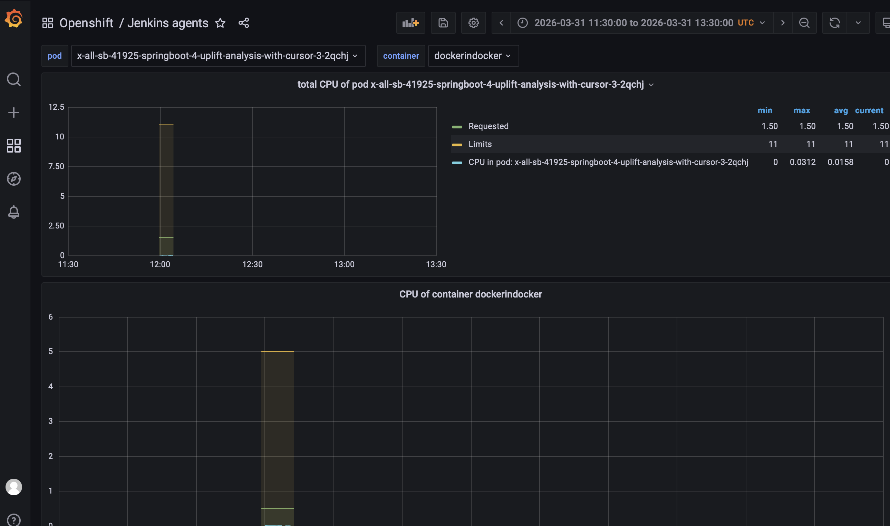

### i go to explore in grafana and run this query

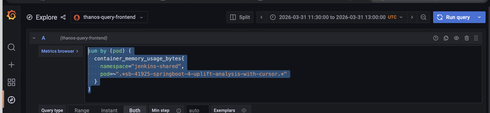


sum by (pod) (
  container_memory_usage_bytes{
    namespace="jenkins-shared",
    pod=~".*sb-41925-springboot-4-uplift-analysis-with-cursor.*"
  }
)


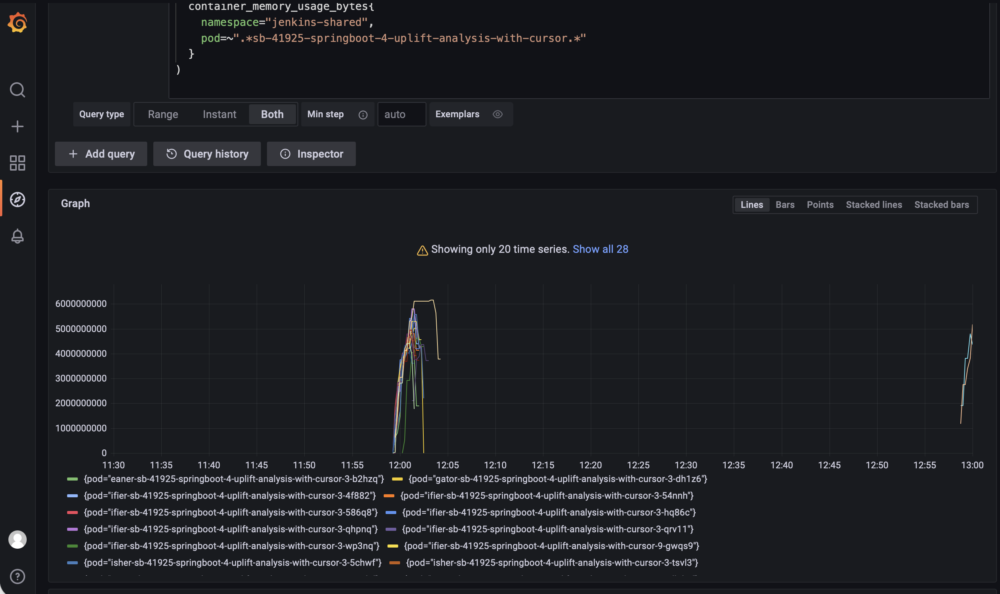


## different useful queries

### Memory for one suspicious family (from logs above)


            sum by (pod) (
            container_memory_working_set_bytes{
                namespace="jenkins-shared",
                pod=~".*sb-41925-springboot-4-uplift-analysis-with-cursor.*",
                container!="",
                container!="POD"
            }
            )

### boroader query for all pods, where i can see android

            sum by (pod) (
            container_memory_usage_bytes{
                namespace="jenkins-shared"
            }
            )

### Top memory-consuming pods

            topk(20,
            sum by (pod) (
                container_memory_usage_bytes{
                namespace="jenkins-shared"
                }
            )
            )

### focused top memory pods on android:

            sum by (pod) (
            container_memory_usage_bytes{
                namespace="jenkins-shared",
                pod=~"android-.*"
            }
            )

### top cpu consuming pods:

            topk(20,
            sum by (pod) (
                rate(container_cpu_usage_seconds_total{
                namespace="jenkins-shared"
                }[5m])
            )
            )

## journalctl commands

```bash
sudo journalctl -u jenkins --since "2026-03-31 11:30:00" --until "2026-03-31 13:30:00" -o short-iso | grep 'Created Pod: kubernetes jenkins-shared/' # created jenkins pods during the time (i used approximate time, from when developer coomplained)

sudo journalctl -u jenkins --since "2026-03-31 11:30:00" --until "2026-03-31 12:10:00" -o short-iso | grep 'Created Pod: kubernetes jenkins-shared/' | sed 's/.*jenkins-shared\///' | awk -F- '{NF-=2; print $0}' OFS="-" | sort | uniq -c | sort -nr | head -20 # find jobs who creates many pods at once before the crash

```


# video from Roman

When you run multiple agents in pod as for ex. docker in docker, they have automatically common storage. The best practice woudl be instead of large angets to have small agents (for ex. agent only with java 17) and make each step in container to do whats needed (that would be redoing all existing pipeliens)


esoirces for agents

Cloud 

dockerindocker pod template

usually in openshift the best way how to setup cpu and memory 
give them small amount of memory and hifher limit:

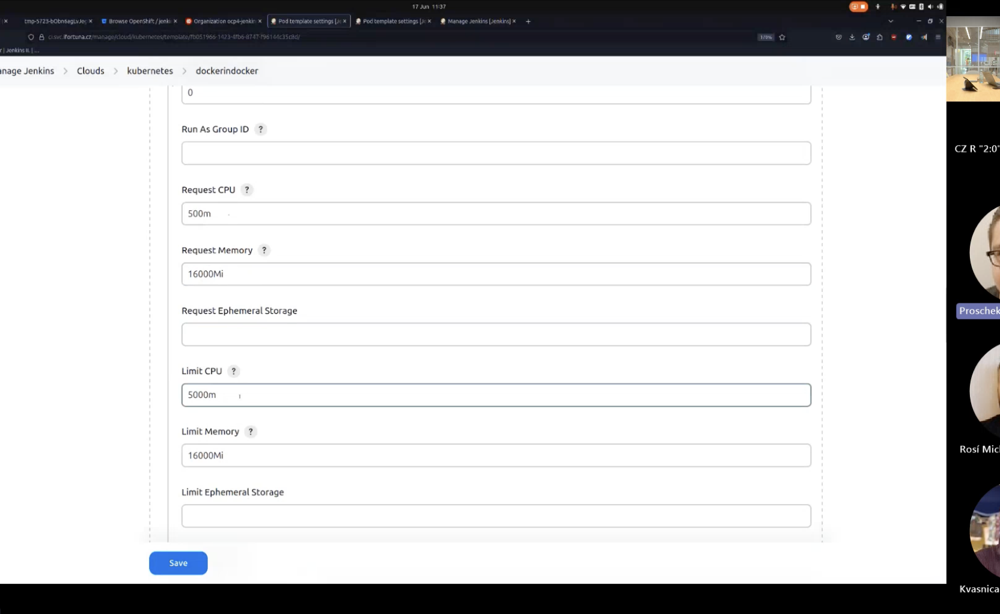

to have request and limit the same isnt best practice for resource handling. in htis case the problem was that container started and it needed 1gb of ram, but as developers started this containers -> they created 7 different containers and amount of needed memoy grow to 12 gigabytes. and what wa shappening before: this pod (dockerindocker) was spinned up on host with 4gb of free memory, cause at the time of start it just needed 1gb. and then host didnt have needed amount of free memory. so we needed to reseve insane 16gn (limit memory in pod template)

other pods are different (there are 2,3 which are set up like that) for ex. node18 pod template

when happens that some nuld hasnt finished becuase of memory

grafana -> brows -> openshift -> jenkins agents 

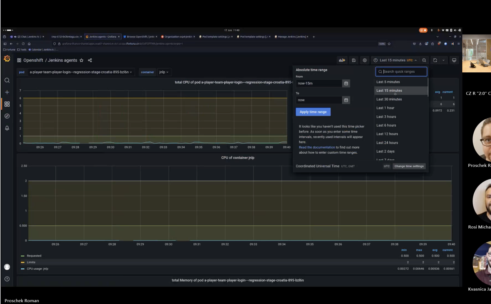

if you want something longer -> refresh the page after changes the time on the right side of the screen

for ex. pod name search -> then you can check. when you are troublehoosting something older, you can find it in the log of pipelien: dashboard -> openshift -> find the bulid -> check console output -> there you would find the the name of container (running on) -> with this he can go to grafana -> he can put hte name into the pod filter. container he needs to switchto gradle8java21 -> then he can see the memory data in grafana. there we can see cpu. useful for troubleshooting for cpu and memory issues. if there are any -> we can change the setting of memory for the pod. 

# PVC

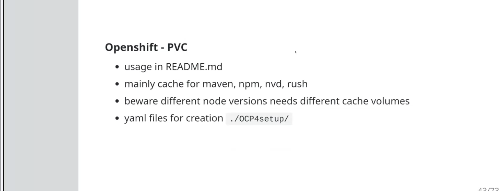

this is the space of disk for storage in openshift

we can check for ex. cash:

here we have the file under the agent, specifying pvc:

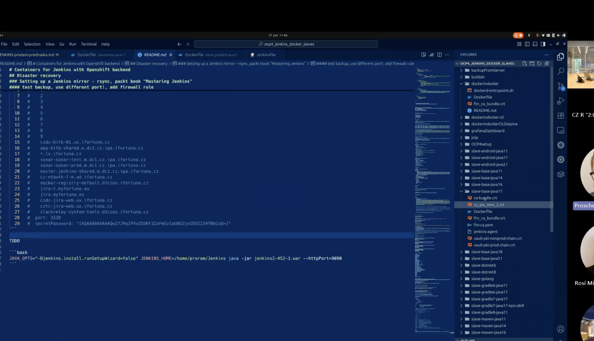

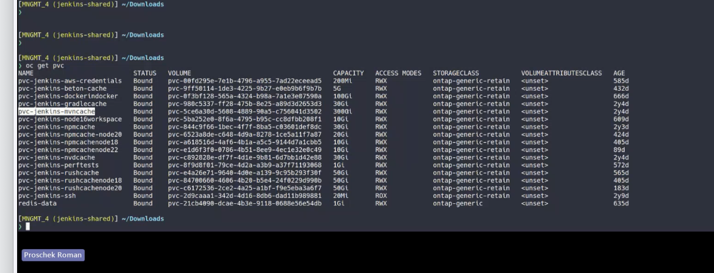

when we need to recreate the agent -> it will use that file., where we specify the storage

if we go to pod template config in jenkins (find some maven):


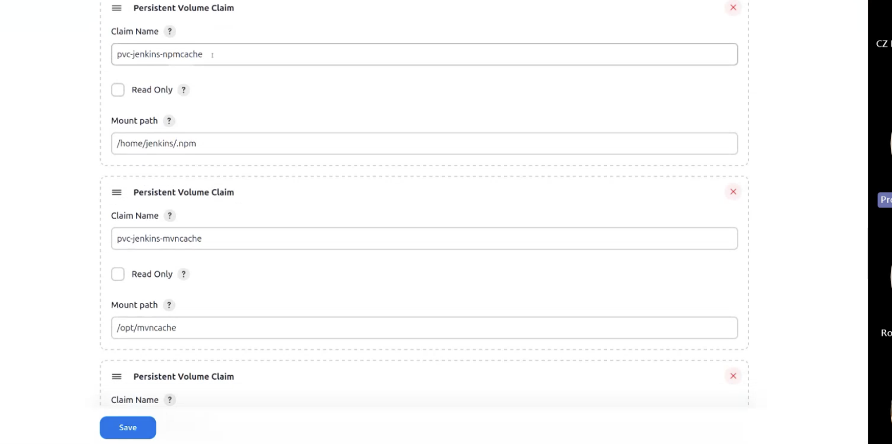

we just specify there name of pvc in opensjhioft and where its mounted inside of agents

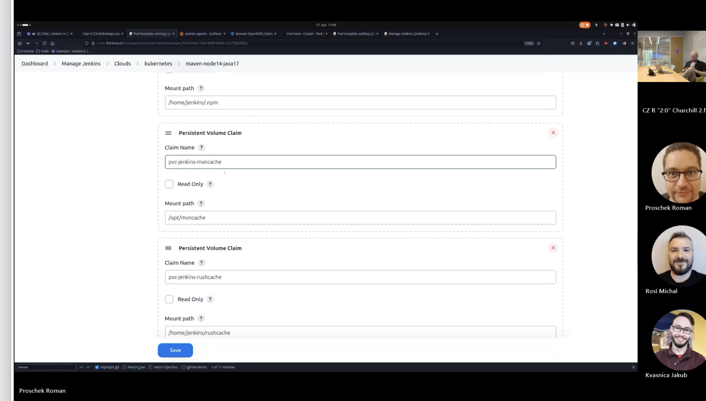

here its mounted to 2 different places

few use rushcashe tool (they also need some cash, cause they are few gb of data so they dont need to download them everybuild)

for a tool npm the cash cant be shared among different version of node npm:

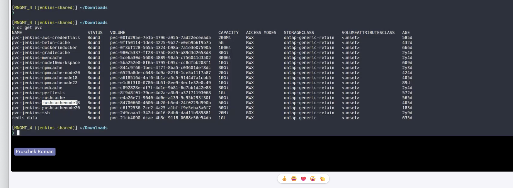

so if in the future we need to create agent with rush, we would need to create a enw pvc and reflect it pod template config

# recap of those notes:

Grafana is just a place where you can see history graphs. For Jenkins/OpenShift, you use it to answer: “Was this pod short on memory?” or “Did CPU go crazy?” It does not fix anything. It only shows what happened over time.

In dummy terms:

Jenkins log tells you which pod was used
Grafana lets you search that pod name
then you see graphs for memory and CPU
if memory was climbing to the limit, the pod probably needed more RAM
if CPU was maxed out, the pod may have needed more CPU or the job was just heavy
Why this matters for memory:

a pod may start fine with low memory
later the build does more work and memory usage grows
if it grows too much, the node or pod can run into trouble
Grafana helps you see that growth, instead of guessing
Your notes also mention an important point:

request = what the pod asks for at start
limit = the maximum it is allowed to use
if request is too low, OpenShift may place the pod on a node that looks free at the start
but later the pod may need much more memory and the node can get overloaded
PVC means PersistentVolumeClaim.

In dummy terms:

PVC is a disk that survives after the pod dies
pod memory disappears when the pod stops
PVC storage stays
Why PVC is useful:

cache
downloaded dependencies
big reusable files
Example from your notes:

if an agent downloads a lot of data every build, a PVC can keep that data
next build can reuse it instead of downloading again
that saves time and network traffic
How it connects to Jenkins agents:

in the pod template, Jenkins says:
which PVC to use
where to mount it inside the container
then the agent sees that storage as a normal folder
Important difference:

memory = RAM, fast, temporary, gone when pod dies
PVC = disk, slower, persistent, kept for reuse
Very simple summary:

Grafana helps you see whether a pod had memory/CPU problems
PVC gives pods persistent disk space for cache/data
Grafana is for observing problems
PVC is for storing files between pod runs
If you want, I can turn your notes into a cleaner “cheat sheet” version in very simple English.


GPT-5.4

Medium


Local

Default permissions
