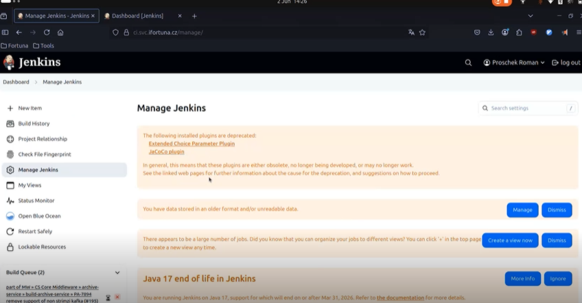

# Jenkins Test Instance upgrade

Difficulties of this update:

- Bitbucket plugin changes were released just days ago
- These changes break existing webhook functionality
- Therefore, the upgrade is harder than usual

## Snapshot and Rollback Strategy

Before upgrading:

- they create a snapshot of the test Jenkins VM

**IT term: snapshot** = a point-in-time copy of a virtual machine’s disk that can be restored if something goes wrong.

**Example:**
If update breaks authentication or plugins, revert snapshot → restore working state instantly.

This is a crucial DevOps practice.

## Understanding Jenkins + Bitbucket Integration

Jenkins integrates with Bitbucket mainly through:

- multi-branch pipelines
- webhooks

IT terms:

- multi-branch pipeline = automatically detects branches and builds them
- webhook = trigger that notifies Jenkins when code changes happen

**Example:**
Developer pushes commit → Bitbucket webhook → Jenkins job starts automatically.

## Plugin Dependencies Change

The Bitbucket Branch Source plugin recently:

- removed support for plugin-based webhooks
- now supports only native Bitbucket webhooks

Meaning:

- the version Jenkins relies on is deprecated
- new version breaks compatibility
- downgrade is required

_IT term: deprecation = feature is being phased out and should not be used anymore._

## Downgrading Plugins
Here we can see warning that some plugins are depreciated, so its good to remove them with next restart. Talk to developpers if they are used:

To keep Jenkins working:

- they downgrade 3 plugins:
  - Bitbucket Branch Source
  - Blue Ocean
  - Bitbucket Pipeline plugins

This is needed so:

- old webhook mechanism works
- developers don’t need to change pipelines immediately

## Testing the Upgrade

They:

- stop Jenkins
- update plugins
- update Jenkins core
- restart Jenkins
- test webhook triggers

At each step, validation is critical.

Example test:

- add a commit to Bitbucket
- see if webhook triggers build

This is good upgrade hygiene.

## Problems Discovered

During testing:

- webhook didn’t trigger builds
- plugin downgrade required additional older dependencies
- some plugins report “unsatisfied dependencies”
- Blue Ocean plugin caused additional dependency issues

This illustrates:

- plugin upgrades are not isolated
- Jenkins plugin ecosystem is interconnected

## Native vs Plugin-Based Webhooks

There are **two webhook strategies**:

**Plugin-based (old)**

- handled by Bitbucket Branch Source plugin
- previously used by company
- works well with current pipelines

**Native Bitbucket webhook (new)**

- official Bitbucket feature
- plugin maintainers are dropping plugin version
- needs testing before migration

Difference:

- old plugin created “POST webhooks”
- new version creates Bitbucket-native hooks

## Risk: forced migration in future

Because of plugin deprecation:

- eventually native webhooks must be adopted
- plugin path may vanish
- timing is outside company control

Therefore:

- prepare a developer survey to check usage
- collect impact before deciding migration path

_This is proactive stakeholder management._

## Upgrade Best Practices Shown

The presenter demonstrates:

- snapshot creation before changes
- test environment upgrade before production
- downgrade when new versions break compatibility
- reading change logs & upgrade guide
- manual editing of Jenkins Configuration as Code
- removing obsolete plugin folders
- restarting Jenkins multiple times
- validating webhook functionality

These are textbook DevOps procedures.

## Additional Details

Worth noting:

- Jenkins can run without plugin compatibility, but webhooks will break
- upgrade windows usually occur early morning (6–7 a.m.)
- plugin dependencies often release silently without warning
- documentation may lag behind actual plugin behavior
- plugin management in Jenkins remains one of the biggest operational risks

## Backup Strategy for Production

Goal:

- nightly backups of Jenkins home
- using LVM snapshots

_IT term: LVM = Logical Volume Manager; supports flexible storage and snapshots._

Purpose:

- disaster recovery
- migration capability
- VM-level portability

Restoring backup → rebuild Jenkins on another server.

## Why This Upgrade Was “Worst Timing”

Because:

- Bitbucket plugin refactor changed webhook features
- deprecation announced poorly (single line in README)
- no backward compatibility layer
- forced downgrade needed
- adds uncertainty + developer risk

This is a classic DevOps challenge:
→ dealing with upstream changes outside of your control.