## 1st issue - no bitbtest repos appearing in drop down

1. there is no dropdown appearing
2. scanned multibranch
3. checked log - saw proxy error
4. tested from jenkins machine with curl (bypassing proxy test) - test bitbucket works. so issue is proxy only
5. added the test bitbucket to no proxy setting in jenkins:
 
 in yaml is here:

 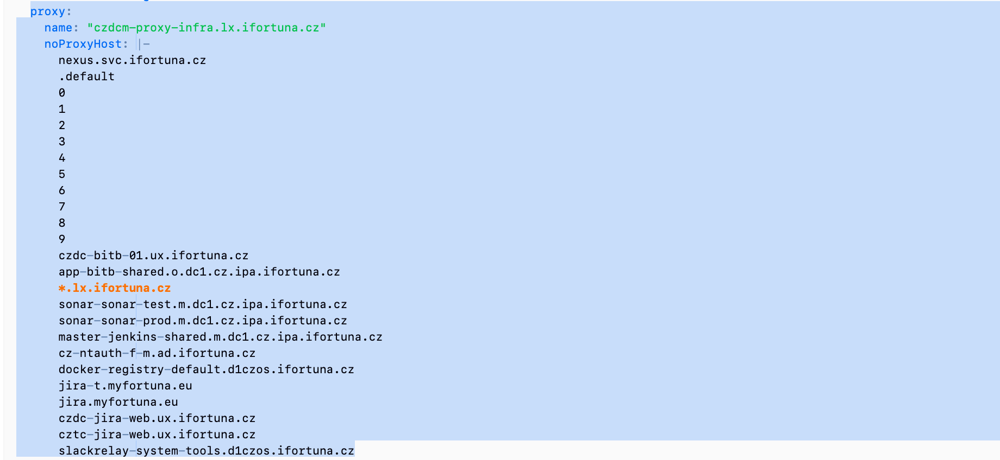

 in gui is here:
 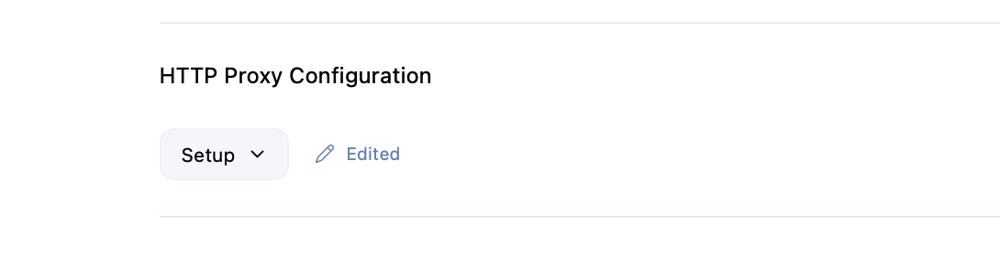


## 2nd issue

pull request job is failing: 

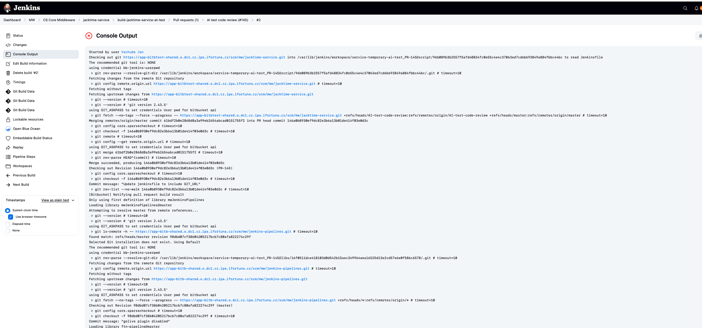


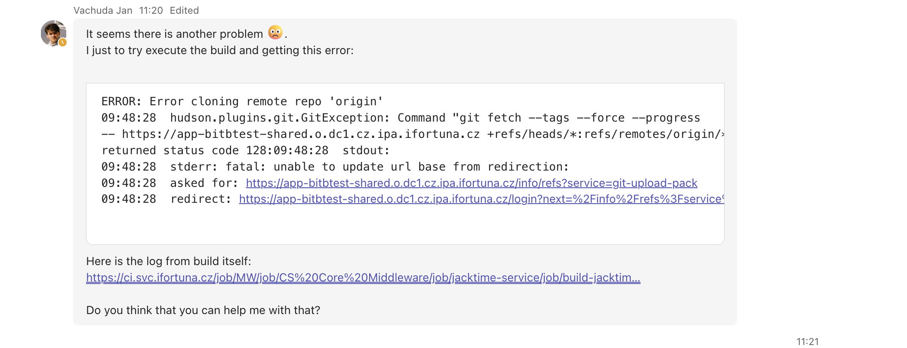

### what is happening

the new multubranch pipeline job was created, which is linked to test bitbucket

jenkinsfile is located in production bitbucket in the root of repo. we can see it in the console ouput of failed PR build:

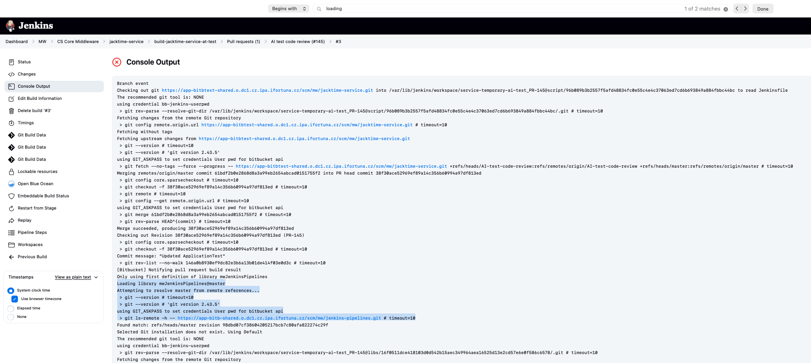

in the configuration of multibranch pipeline we can see this script path: Jenkinsfile


in bitbucket test we check jenkins file at the repositorry root and we can see its shared liberary:


this shared library configred in the hierarchy above:


so we can see that bitbucket test using pipeline logic from bitbucket prod

we can see the shared pipelines location in bitbucket prod repo indicated here in the hierarchy above:


if i go to that repo -> i go to vars:


then i select one indicated in my tiny jenkinsfile in test bitbucket:


here is the gitUrl what we could pass in our tiny jenkinsfile to fix the issue:

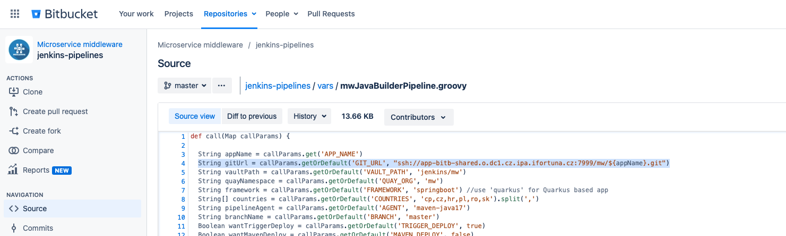

so in my tiny jenkins file i would have this:

```groovy
mwJavaBuilderPipeline([
  'APP_NAME': 'jacktime-service',
  'GIT_URL': 'ssh://git@app-bitbtest-shared.o.dc1.cz.ipa.ifortuna.cz:7999/mw/jacktime-service.git',
  'COUNTRIES': 'cz,sk,pl,ro,cp',
  'AGENT': 'maven-java17'
])
```
the git url ssh is taken from test bb repo here:

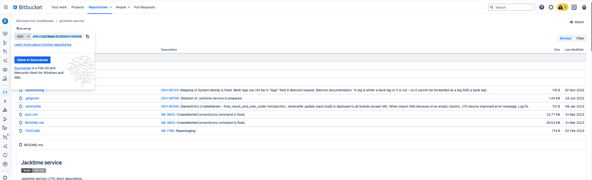

## 3rd issue

We moved forward I would say but still an error:

Build is here: https://ci.svc.ifortuna.cz/job/MW/job/CS%20Core%20Middleware/job/jacktime-service/job/build-jacktime-service-temporary-ai-test/view/change-requests/job/PR-145/4/console

```groovy
09:53:44  stderr: ssh: connect to host app-bitbtest-shared.o.dc1.cz.ipa.ifortuna.cz port 7999: 
Connection timed out09:53:44  fatal: Could not read from remote repository.09:53:44 09:53:44  
Please make sure you have the correct access rights09:53:44  and the repository exists.
```

when clicked on that build url in jenkins -> i can see the console log

the console log right on the top shows the link to bitbucket repo:

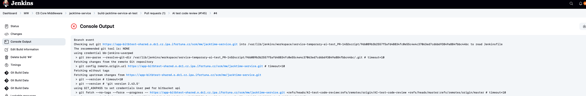

when i click on it and i am in bitbucket -> change branch. 

i know from jenkins that its job failing in the pull request called *Ai test code review* 

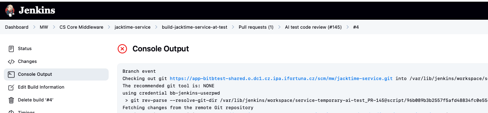

so i switch to that branch and i see updated jenkinsfile:

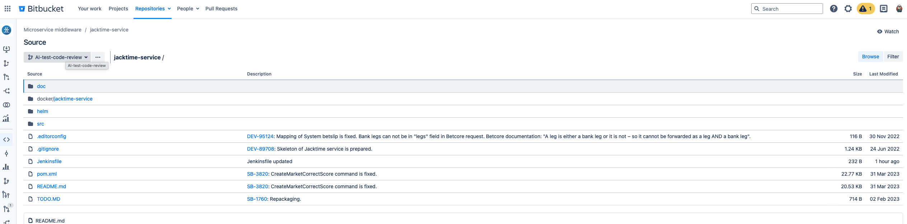


1) it can be network:

from same oc namespace where builds run (jenkins-shared), run:

```bash
nc -vz app-bitbtest-shared.o.dc1.cz.ipa.ifortuna.cz 7999
```


# console log breakdown:

## we can see pod was created:

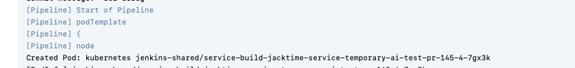

## connectivity to Bitbucket from that pod

under it i can see important pod info: namespace, buildUrl etc:

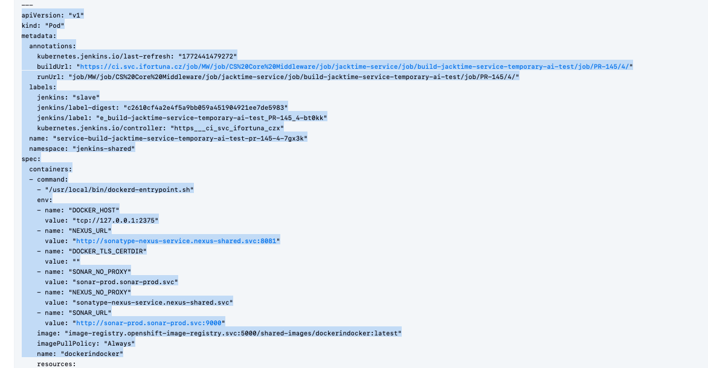

when jenkins runs `git fetch` -> it runs it from wherever the agent is.

in our case the agent is NOT jenkins controller vm, its a *pod* running somewhere in OpenShift cluster network. 

so connectivity to Bitbuycket must work from *that pod*. Not from jenkins ui server.

## failure itself:

* first check for "skipped due to earlier failure(s)"
* then scroll above and look for possible reasons. in our case its clear ssh:

    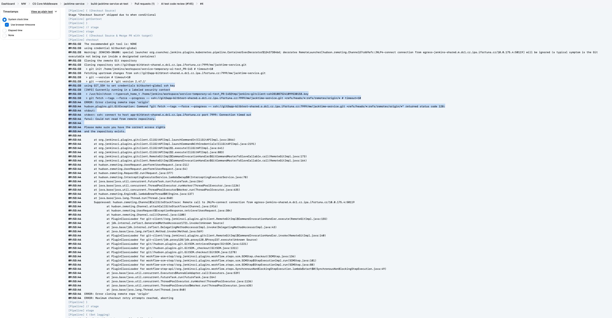

## jenkins pipelines break in common places:

1. Before pipeline starts (Jenkinsfile can’t be loaded)
2. Agent provisioning (pod won’t start / image pull / pending)
3. Checkout (git clone/fetch fails)
4. Build/test (mvn/gradle etc.)
5. Push image/deploy (registry/cluster perms)


in our case : agent provisioning succeeds (pod crelated, then it runs and enters workspace). it breaks in Checkout fase -> git fetch over SSH times out. 

usually when there is a failure like `returned status code 128` -> look at the next lines for `stderr:` 

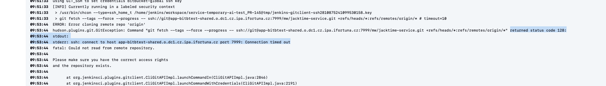


`git fetch` = check what changed on the server

`git pull` = fetch + merge into my branch


in my log: 
`git fetch --tags --force --progress -- ssh://git@... +refs/heads/*:refs/remotes/origin/*`

Meaning:
* connect to Bitbucket
* download all branch heads
* store them as origin/<branch>
* then later checkout the commit it needs

But fetch failed because it couldn’t connect to Bitbucket over SSH. So the build never even got the code.


## fix

i will try to swap ssh into http. maybe that would work

### first clone the repo to my laptop

so first clone repo to my laptop (i used http)

```bash
git clone https://app-bitbtest-shared.o.dc1.cz.ipa.ifortuna.cz/scm/mw/jacktime-service.git
```

then i verified on which branch i am:

`git branch -r`

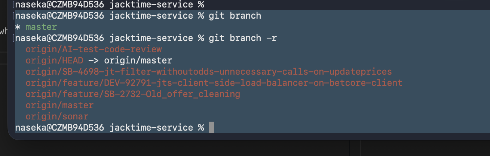


so i can see his branch remotely, not locally

i will now create a new branch based om hte remote PR branch and i will switch to it:

`git checkout -b use-http-checkout origin/AI-test-code-review`

then i can see i am on correct branch:

`git status`:

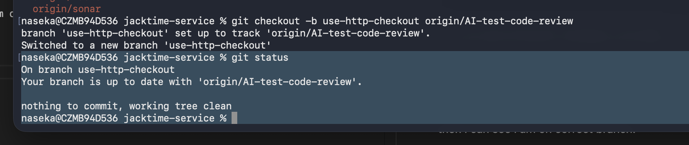

### then modify the Jenkinsfile:

instead of ssh i go to repo and copy http:

https://app-bitbtest-shared.o.dc1.cz.ipa.ifortuna.cz/scm/mw/jacktime-service.git

before:

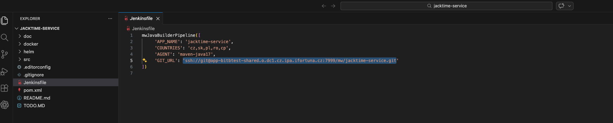

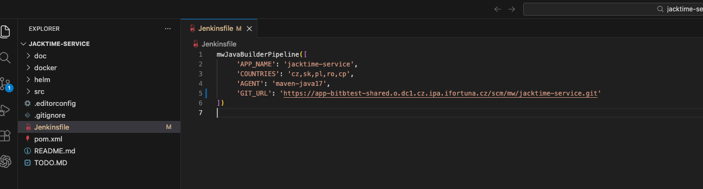

### then git add, git commit -m, git push

```bash
naseka@CZMB94D536 jacktime-service % git status
On branch use-http-checkout
Your branch is up to date with 'origin/AI-test-code-review'.

Changes not staged for commit:
  (use "git add <file>..." to update what will be committed)
  (use "git restore <file>..." to discard changes in working directory)
	modified:   Jenkinsfile

no changes added to commit (use "git add" and/or "git commit -a")
naseka@CZMB94D536 jacktime-service % git add .
naseka@CZMB94D536 jacktime-service % git status
On branch use-http-checkout
Your branch is up to date with 'origin/AI-test-code-review'.

Changes to be committed:
  (use "git restore --staged <file>..." to unstage)
	modified:   Jenkinsfile

naseka@CZMB94D536 jacktime-service % git commit -m "use http instead of ssh in git_url param"
[use-http-checkout df464d5] use http instead of ssh in git_url param
 Committer: Jekatěrina Nasirova <naseka@CZMB94D536.local>
Your name and email address were configured automatically based
on your username and hostname. Please check that they are accurate.
You can suppress this message by setting them explicitly. Run the
following command and follow the instructions in your editor to edit
your configuration file:

    git config --global --edit

After doing this, you may fix the identity used for this commit with:

    git commit --amend --reset-author

 1 file changed, 1 insertion(+), 1 deletion(-)
naseka@CZMB94D536 jacktime-service % git status
On branch use-http-checkout
Your branch is ahead of 'origin/AI-test-code-review' by 1 commit.
  (use "git push" to publish your local commits)

nothing to commit, working tree clean
naseka@CZMB94D536 jacktime-service % git push -u origin use-http-checkout
Enumerating objects: 5, done.
Counting objects: 100% (5/5), done.
Delta compression using up to 12 threads
Compressing objects: 100% (3/3), done.
Writing objects: 100% (3/3), 344 bytes | 344.00 KiB/s, done.
Total 3 (delta 2), reused 0 (delta 0), pack-reused 0 (from 0)
remote: 
remote: Create pull request for use-http-checkout:
remote:   https://app-bitbtest-shared.o.dc1.cz.ipa.ifortuna.cz/projects/MW/repos/jacktime-service/pull-requests?create&sourceBranch=refs%2Fheads%2Fuse-http-checkout
remote: 
To https://app-bitbtest-shared.o.dc1.cz.ipa.ifortuna.cz/scm/mw/jacktime-service.git
 * [new branch]      use-http-checkout -> use-http-checkout
branch 'use-http-checkout' set up to track 'origin/use-http-checkout'.
naseka@CZMB94D536 jacktime-service % 
```

then i went to bitbicket and created a pull request from source: my branch to destination: master

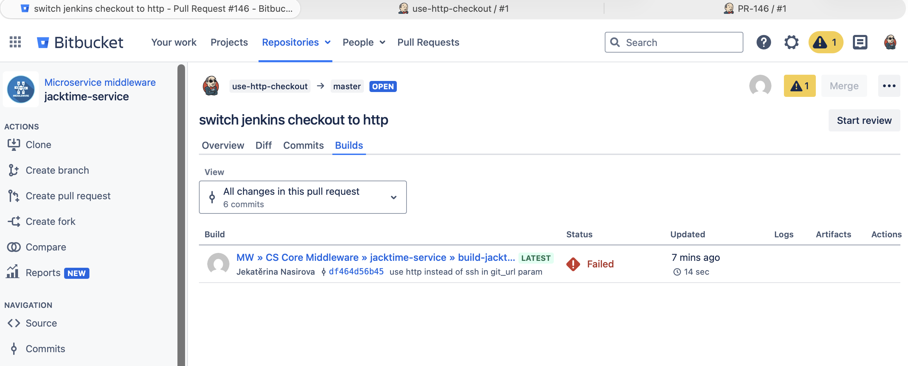

failure is different -> 

I made progress: I successfully forced the checkout URL to HTTPS, so the original “SSH port 7999 timeout” problem is gone.
Now it fails for a different reason:


`fatal: Authentication failed for 'https://app-bitbtest-shared.../scm/mw/jacktime-service.git/'`

so before the issue was jenkins pod could not even open a network connection. now it reaches bitbucket, but fails authentication

# 4th issue:

my Jenkins file uses the hardcoded credentials from shared library:

line 83 and line 96:

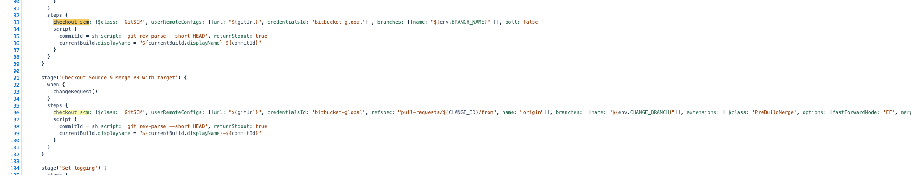

and its ssh:

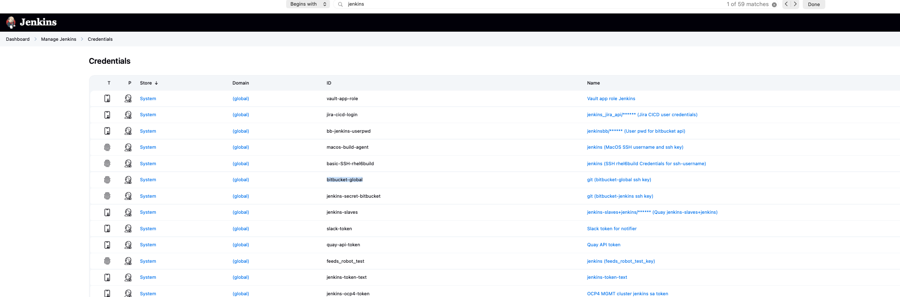

so i would need to most likely make ssh work from openshift pods. i should verify whether its the case for current production set up. if so -> i can safely ask openshift guys to do it for me for test bitbucket.


## why would i have two separate credentials?

| Purpose | Credential | Credential is|
|---|---|---|
|Repo discovery, Jenkinsfile reading|`bb-jenkins-userpwd(HTTPS)`|centrally managed|
|Actual code cloning during build, build needs source code|`bitbucket-global(SSH)`|used inside build pods, mounted via PVC (`/home/jenkins/.ssh`)


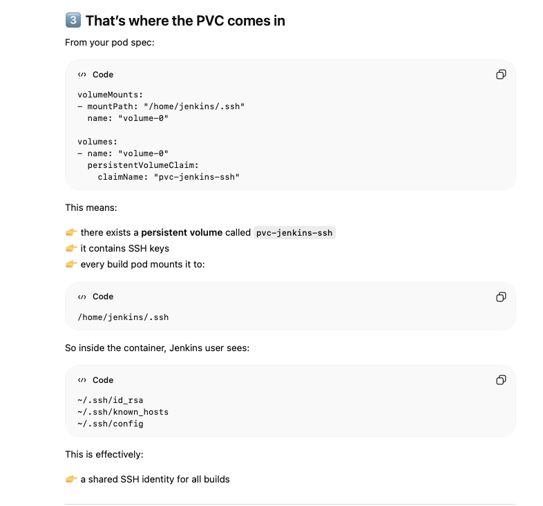


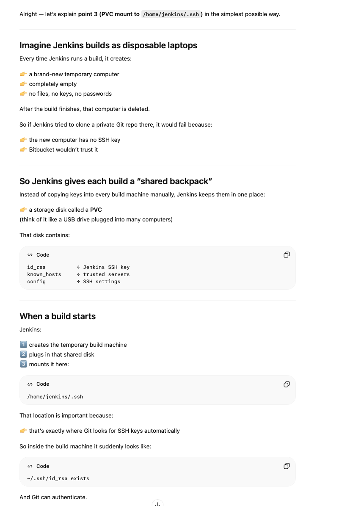

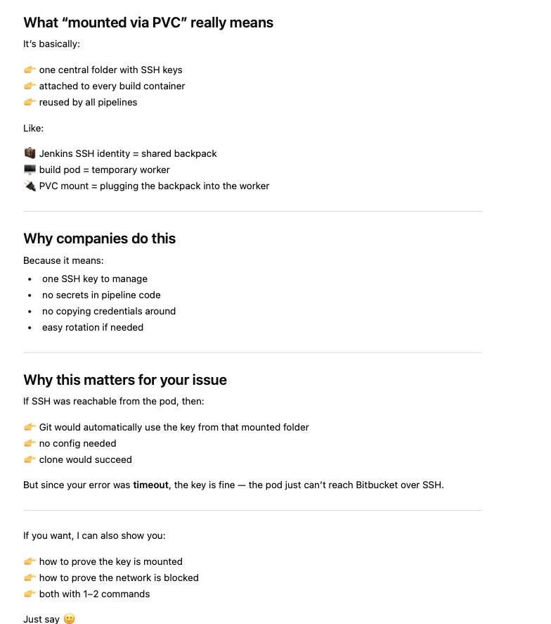

## logged into oc and ran commands

* openshift login `oc login --tooken..`

```bash
naseka@CZMB94D536 jacktime-service % oc login --token=sha256~qnZlgvUN9hNQZoM88yrQWpVbVQwgFygjkNsUn7bf7bs --server=https://api.ocp01-shared.m.dc1.cz.ipa.ifortuna.cz:6443
Logged into "https://api.ocp01-shared.m.dc1.cz.ipa.ifortuna.cz:6443" as "naseka" using the token provided.

You have access to the following projects and can switch between them with 'oc project <projectname>':

    isesync
  * jenkins
    jenkins-shared
    mw
    netbox
    nexus
    openshift-logging
    prometheus
    quay
    revelio
    shared-images
    sonar
    thanos
    thanos-shared
    tools
    vault
    wulcan

Using project "jenkins".
```


```bash 
naseka@CZMB94D536 jacktime-service % oc project jenkins-shared
Now using project "jenkins-shared" on server "https://api.ocp01-shared.m.dc1.cz.ipa.ifortuna.cz:6443".
```

* now i will find some base image in my registry for my test. we store base images in the namespace shared-images `oc projects`

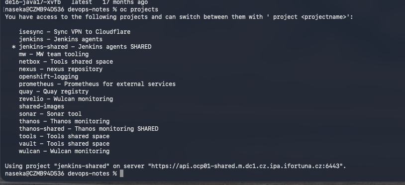


* changed project `oc project shared-images`
* find if in shared-images we have something basic/minimal: `oc get is | egrep -i 'ubi|alpine|curl|debug|minimal'` i will try ubi9:latest image

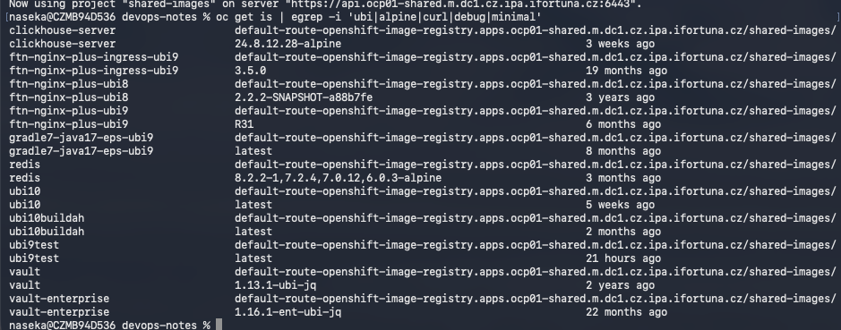

* what are sizes of those images? i want smallest. check it: `oc -n shared-images get istag ubi9test:latest -o jsonpath='{.image.dockerImageMetadata.Size}'; echo`

i recieve answer in bytes. / 1000 will be megabytes:

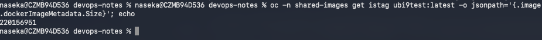


* on the screenshot abover we can see *external route to the image* -> used from outside cluster
  
`default-route-openshift-image..`
* *internal service* used inside cluster. every OpenShift cluster exposes registry as a Kubernetes service (`svc`):
  
`image-registry.openshift-image-registry.svc:5000`

* in my build output in jenkins i could see the internal registry address in the pod specs:

```yaml
Agent service-build-...
---
apiVersion: "v1"
kind: "Pod"
...
spec:
  containers:
  - image: "image-registry.openshift-image-registry.svc:5000/shared-images/dockerindocker:latest"
  - image: "image-registry.openshift-image-registry.svc:5000/shared-images/maven-java17:latest"
  - image: "image-registry.openshift-image-registry.svc:5000/shared-images/jnlp:latest"
```

* jenkins job logs and pods are inside jenkins-shared. so i will use that one for troubleshooting.

* pods run as ServiceAccount (SA). i checked SA of currently running jenkins-shared pod:

`oc -n jenkins-shared get pod offer-continuous-integration-offer-market-service-main-81-gqbs8 \
  -o jsonpath='{.spec.serviceAccountName}'; echo`

```bash
naseka@CZMB94D536 devops-notes % oc -n jenkins-shared get pod offer-continuous-integration-offer-market-service-main-81-gqbs8 \
  -o jsonpath='{.spec.serviceAccountName}'; echo
default
naseka@CZMB94D536 devops-notes % 
```
i can see its running as *default* SA

* to list all service accounts use `oc -n jenkins-shared get sa`

```bash
naseka@CZMB94D536 devops-notes % oc -n jenkins-shared get sa
NAME         SECRETS   AGE
builder      2         3y275d
default      2         3y275d
deployer     2         3y275d
ipfailover   2         3y275d
jenkins      2         2y343d
k6           1         2y75d
pipeline     1         175d
naseka@CZMB94D536 devops-notes % 
```

* i will just create a pod from this light base image on our internal registry:

```bash
oc -n jenkins-shared run netcheck \
  --image=image-registry.openshift-image-registry.svc:5000/shared-images/ubi9test:latest \
  --restart=Never \
  -it --rm \
  -- sh
  ```

* then i will do the test inside the pod -> i test TCP 7999
* in bitbucket i can try to clone ssh:

  * test: ssh://git@app-bitbtest-shared.o.dc1.cz.ipa.ifortuna.cz:7999/mw/jacktime-service.git

  * prod: ssh://git@app-bitb-shared.o.dc1.cz.ipa.ifortuna.cz:7999/os/jenkins-shared-library.git

* so i can run my commands:

```bash
timeout 5 sh -c 'cat < /dev/null > /dev/tcp/app-bitb-shared.o.dc1.cz.ipa.ifortuna.cz/7999' && echo PROD_OK || echo PROD_FAIL
timeout 5 sh -c 'cat < /dev/null > /dev/tcp/app-bitbtest-shared.o.dc1.cz.ipa.ifortuna.cz/7999' && echo TEST_OK || echo TEST_FAIL

```

## full flow to test TCP:

```bash
naseka@CZMB94D536 devops-notes % oc project jenkins-shared
Now using project "jenkins-shared" on server "https://api.ocp01-shared.m.dc1.cz.ipa.ifortuna.cz:6443".
naseka@CZMB94D536 devops-notes % oc -n jenkins-shared run netcheck \
  --image=image-registry.openshift-image-registry.svc:5000/shared-images/ubi9test:latest \
  --restart=Never \
  -it --rm \
  -- sh
If you don't see a command prompt, try pressing enter.
sh-5.1$ timeout 5 sh -c 'cat < /dev/null > /dev/tcp/app-bitb-shared.o.dc1.cz.ipa.ifortuna.cz/7999' && echo PROD_OK || echo PROD_FAIL
PROD_OK
sh-5.1$ timeout 5 sh -c 'cat < /dev/null > /dev/tcp/app-bitb-shared.o.dc1.cz.ipa.ifortuna.cz/7999' && echo PROD_OK || echo PROD_FAIL    
PROD_OK
sh-5.1$ timeout 5 sh -c 'cat < /dev/null > /dev/tcp/app-bitbtest-shared.o.dc1.cz.ipa.ifortuna.cz/7999' && echo TEST_OK || echo TEST_FAIL
TEST_FAIL
sh-5.1$ exit
exit
pod "netcheck" deleted
naseka@CZMB94D536 devops-notes % 
```

then i also decided to test HTTPS, cause in my logs it worked there:

```bash
naseka@CZMB94D536 devops-notes % oc project
Using project "jenkins-shared" on server "https://api.ocp01-shared.m.dc1.cz.ipa.ifortuna.cz:6443".
naseka@CZMB94D536 devops-notes % oc -n jenkins-shared run netcheck \
  --image=image-registry.openshift-image-registry.svc:5000/shared-images/ubi9test:latest \
  --restart=Never \
  -it --rm \
  -- sh
If you don't see a command prompt, try pressing enter.
sh-5.1$ timeout 5 sh -c 'cat < /dev/null > /dev/tcp/app-bitbtest-shared.o.dc1.cz.ipa.ifortuna.cz/443' && echo TEST_443_OK || echo TEST_443_FAIL
TEST_443_OK
sh-5.1$ 
```


## decided not to run processes inside real pods, so i will create a tiny disposable pod

This tells OpenShift:
👉 “Create a temporary container for me, let me enter it, and delete it when I leave.”:

`
oc -n jenkins-shared run netcheck \
  --image=registry.access.redhat.com/ubi9/ubi-minimal \
  --restart=Never \
  -it --rm \
  -- sh
`
```bash
oc -n jenkins-shared run netcheck \ # switch to jenkins-shared name space and create a pod named netcheck. it will start one container
  --image=registry.access.redhat.com/ubi9/ubi-minimal \ # use this container image, which is official red hat base image, its tiny, secure and it contains shell + networking tools. good for debugging connectivity
  --restart=Never \ # !!!important, cause its just one disposable pod. use it so it doesnt restart!
  -it --rm \ # -it means interactive terminal, lets you type commands inside container. --rm means the pod will be deleted automatically when you exit the shell
  -- sh # means run the shell program inside the container
  ```


inside it test connectivity. so run: 

`timeout 5 sh -c 'cat < /dev/null > /dev/tcp/app-bitb-shared.o.dc1.cz.ipa.ifortuna.cz/7999' && echo PROD_OK || echo PROD_FAIL`

`timeout 5 sh -c 'cat < /dev/null > /dev/tcp/app-bitbtest-shared.o.dc1.cz.ipa.ifortuna.cz/7999' && echo TEST_OK || echo TEST_FAIL`


ssh://git@app-bitbtest-shared.o.dc1.cz.ipa.ifortuna.cz:7999/mw/jacktime-service.git

ssh://git@app-bitb-shared.o.dc1.cz.ipa.ifortuna.cz:7999/os/jenkins-shared-library.git