## 1st issue - no bitbtest repos appearing in drop down. fix: add test bitbucket to no proxy setting in jenkins

1. there is no dropdown appearing
2. scanned multibranch
3. checked log - saw proxy error
4. tested from jenkins machine with curl (bypassing proxy test) - test bitbucket works. so issue is proxy only
5. added the test bitbucket to no proxy setting in jenkins:
 
 in yaml is here:

 

 in gui is here:
 


## 2nd issue: ssh is not working. fix: i swapped to http -> error gone

pull request job is failing: 


### what is happening

the new multubranch pipeline job was created, which is linked to test bitbucket

jenkinsfile is located in production bitbucket in the root of repo. we can see it in the console ouput of failed PR build:


in the configuration of multibranch pipeline we can see this script path: Jenkinsfile


in bitbucket test we check jenkins file at the repositorry root and we can see its shared liberary:


this shared library configred in the hierarchy above:


so we can see that bitbucket test using pipeline logic from bitbucket prod

we can see the shared pipelines location in bitbucket prod repo indicated here in the hierarchy above:


if i go to that repo -> i go to vars:


then i select one indicated in my tiny jenkinsfile in test bitbucket:


here is the gitUrl what we could pass in our tiny jenkinsfile to fix the issue:


so in my tiny jenkins file i would have this:

```groovy
mwJavaBuilderPipeline([
  'APP_NAME': 'jacktime-service',
  'GIT_URL': 'ssh://git@app-bitbtest-shared.o.dc1.cz.ipa.ifortuna.cz:7999/mw/jacktime-service.git',
  'COUNTRIES': 'cz,sk,pl,ro,cp',
  'AGENT': 'maven-java17'
])
```
the git url ssh is taken from test bb repo here:


## 3rd issue - http authentication error. fix: swap git_url back to ssh

We moved forward I would say but still an error:

Build is here: https://ci.svc.ifortuna.cz/job/MW/job/CS%20Core%20Middleware/job/jacktime-service/job/build-jacktime-service-temporary-ai-test/view/change-requests/job/PR-145/4/console

```groovy
09:53:44  stderr: ssh: connect to host app-bitbtest-shared.o.dc1.cz.ipa.ifortuna.cz port 7999: 
Connection timed out09:53:44  fatal: Could not read from remote repository.09:53:44 09:53:44  
Please make sure you have the correct access rights09:53:44  and the repository exists.
```

when clicked on that build url in jenkins -> i can see the console log

the console log right on the top shows the link to bitbucket repo:


when i click on it and i am in bitbucket -> change branch. 

i know from jenkins that its job failing in the pull request called *Ai test code review* 


so i switch to that branch and i see updated jenkinsfile:


1) it can be network:

from same oc namespace where builds run (jenkins-shared), run:

```bash
nc -vz app-bitbtest-shared.o.dc1.cz.ipa.ifortuna.cz 7999
```


## console log breakdown:

### we can see pod was created:


### connectivity to Bitbucket from that pod

under it i can see important pod info: namespace, buildUrl etc:


when jenkins runs `git fetch` -> it runs it from wherever the agent is.

in our case the agent is NOT jenkins controller vm, its a *pod* running somewhere in OpenShift cluster network. 

so connectivity to Bitbuycket must work from *that pod*. Not from jenkins ui server.

## failure itself:

* first check for "skipped due to earlier failure(s)"
* then scroll above and look for possible reasons. in our case its clear ssh:

    

### jenkins pipelines break in common places:

1. Before pipeline starts (Jenkinsfile can’t be loaded)
2. Agent provisioning (pod won’t start / image pull / pending)
3. Checkout (git clone/fetch fails)
4. Build/test (mvn/gradle etc.)
5. Push image/deploy (registry/cluster perms)


in our case : agent provisioning succeeds (pod crelated, then it runs and enters workspace). it breaks in Checkout fase -> git fetch over SSH times out. 

usually when there is a failure like `returned status code 128` -> look at the next lines for `stderr:` 


`git fetch` = check what changed on the server

`git pull` = fetch + merge into my branch


in my log: 
`git fetch --tags --force --progress -- ssh://git@... +refs/heads/*:refs/remotes/origin/*`

Meaning:
* connect to Bitbucket
* download all branch heads
* store them as origin/<branch>
* then later checkout the commit it needs

But fetch failed because it couldn’t connect to Bitbucket over SSH. So the build never even got the code.


### fix

i will try to swap ssh into http. maybe that would work

### first clone the repo to my laptop

so first clone repo to my laptop (i used http)

```bash
git clone https://app-bitbtest-shared.o.dc1.cz.ipa.ifortuna.cz/scm/mw/jacktime-service.git
```

then i verified on which branch i am:

`git branch -r`


so i can see his branch remotely, not locally

i will now create a new branch based om hte remote PR branch and i will switch to it:

`git checkout -b use-http-checkout origin/AI-test-code-review`

then i can see i am on correct branch:

`git status`:


### then modify the Jenkinsfile:

instead of ssh i go to repo and copy http:

https://app-bitbtest-shared.o.dc1.cz.ipa.ifortuna.cz/scm/mw/jacktime-service.git

before:


### then git add, git commit -m, git push

```bash
naseka@CZMB94D536 jacktime-service % git status
On branch use-http-checkout
Your branch is up to date with 'origin/AI-test-code-review'.

Changes not staged for commit:
  (use "git add <file>..." to update what will be committed)
  (use "git restore <file>..." to discard changes in working directory)
	modified:   Jenkinsfile

no changes added to commit (use "git add" and/or "git commit -a")
naseka@CZMB94D536 jacktime-service % git add .
naseka@CZMB94D536 jacktime-service % git status
On branch use-http-checkout
Your branch is up to date with 'origin/AI-test-code-review'.

Changes to be committed:
  (use "git restore --staged <file>..." to unstage)
	modified:   Jenkinsfile

naseka@CZMB94D536 jacktime-service % git commit -m "use http instead of ssh in git_url param"
[use-http-checkout df464d5] use http instead of ssh in git_url param
 Committer: Jekatěrina Nasirova <naseka@CZMB94D536.local>
Your name and email address were configured automatically based
on your username and hostname. Please check that they are accurate.
You can suppress this message by setting them explicitly. Run the
following command and follow the instructions in your editor to edit
your configuration file:

    git config --global --edit

After doing this, you may fix the identity used for this commit with:

    git commit --amend --reset-author

 1 file changed, 1 insertion(+), 1 deletion(-)
naseka@CZMB94D536 jacktime-service % git status
On branch use-http-checkout
Your branch is ahead of 'origin/AI-test-code-review' by 1 commit.
  (use "git push" to publish your local commits)

nothing to commit, working tree clean
naseka@CZMB94D536 jacktime-service % git push -u origin use-http-checkout
Enumerating objects: 5, done.
Counting objects: 100% (5/5), done.
Delta compression using up to 12 threads
Compressing objects: 100% (3/3), done.
Writing objects: 100% (3/3), 344 bytes | 344.00 KiB/s, done.
Total 3 (delta 2), reused 0 (delta 0), pack-reused 0 (from 0)
remote: 
remote: Create pull request for use-http-checkout:
remote:   https://app-bitbtest-shared.o.dc1.cz.ipa.ifortuna.cz/projects/MW/repos/jacktime-service/pull-requests?create&sourceBranch=refs%2Fheads%2Fuse-http-checkout
remote: 
To https://app-bitbtest-shared.o.dc1.cz.ipa.ifortuna.cz/scm/mw/jacktime-service.git
 * [new branch]      use-http-checkout -> use-http-checkout
branch 'use-http-checkout' set up to track 'origin/use-http-checkout'.
naseka@CZMB94D536 jacktime-service % 
```

then i went to bitbicket and created a pull request from source: my branch to destination: master


failure is different -> 

I made progress: I successfully forced the checkout URL to HTTPS, so the original “SSH port 7999 timeout” problem is gone.
Now it fails for a different reason:


`fatal: Authentication failed for 'https://app-bitbtest-shared.../scm/mw/jacktime-service.git/'`

so before the issue was jenkins pod could not even open a network connection. now it reaches bitbucket, but fails authentication

# 4th issue: ssh error (same as 2nd issue, so we came to the begining) -> fixed with infra team allowing connectivity from jenkins-shared namespace to test bitbucket

my Jenkins file uses the hardcoded credentials from shared library:

line 83 and line 96:


and its ssh:


so i would need to most likely make ssh work from openshift pods. i should verify whether its the case for current production set up. if so -> i can safely ask openshift guys to do it for me for test bitbucket.


## why would i have two separate credentials?

| Purpose | Credential | Credential is|
|---|---|---|
|Repo discovery, Jenkinsfile reading|`bb-jenkins-userpwd(HTTPS)`|centrally managed|
|Actual code cloning during build, build needs source code|`bitbucket-global(SSH)`|used inside build pods, mounted via PVC (`/home/jenkins/.ssh`)


## logged into oc and ran commands

* openshift login `oc login --tooken..`

```bash
naseka@CZMB94D536 jacktime-service % oc login --token=sha256~qnZlgvUN9hNQZoM88yrQWpVbVQwgFygjkNsUn7bf7bs --server=https://api.ocp01-shared.m.dc1.cz.ipa.ifortuna.cz:6443
Logged into "https://api.ocp01-shared.m.dc1.cz.ipa.ifortuna.cz:6443" as "naseka" using the token provided.

You have access to the following projects and can switch between them with 'oc project <projectname>':

    isesync
  * jenkins
    jenkins-shared
    mw
    netbox
    nexus
    openshift-logging
    prometheus
    quay
    revelio
    shared-images
    sonar
    thanos
    thanos-shared
    tools
    vault
    wulcan

Using project "jenkins".
```


```bash 
naseka@CZMB94D536 jacktime-service % oc project jenkins-shared
Now using project "jenkins-shared" on server "https://api.ocp01-shared.m.dc1.cz.ipa.ifortuna.cz:6443".
```

* now i will find some base image in my registry for my test. we store base images in the namespace shared-images `oc projects`


* changed project `oc project shared-images`
* find if in shared-images we have something basic/minimal: `oc get is | egrep -i 'ubi|alpine|curl|debug|minimal'` i will try ubi9:latest image


* what are sizes of those images? i want smallest. check it: `oc -n shared-images get istag ubi9test:latest -o jsonpath='{.image.dockerImageMetadata.Size}'; echo`

i recieve answer in bytes. / 1000 will be megabytes:


* on the screenshot abover we can see *external route to the image* -> used from outside cluster
  
`default-route-openshift-image..`
* *internal service* used inside cluster. every OpenShift cluster exposes registry as a Kubernetes service (`svc`):
  
`image-registry.openshift-image-registry.svc:5000`

* in my build output in jenkins i could see the internal registry address in the pod specs:

```yaml
Agent service-build-...
---
apiVersion: "v1"
kind: "Pod"
...
spec:
  containers:
  - image: "image-registry.openshift-image-registry.svc:5000/shared-images/dockerindocker:latest"
  - image: "image-registry.openshift-image-registry.svc:5000/shared-images/maven-java17:latest"
  - image: "image-registry.openshift-image-registry.svc:5000/shared-images/jnlp:latest"
```

* jenkins job logs and pods are inside jenkins-shared. so i will use that one for troubleshooting.

* pods run as ServiceAccount (SA). i checked SA of currently running jenkins-shared pod:

`oc -n jenkins-shared get pod offer-continuous-integration-offer-market-service-main-81-gqbs8 \
  -o jsonpath='{.spec.serviceAccountName}'; echo`

```bash
naseka@CZMB94D536 devops-notes % oc -n jenkins-shared get pod offer-continuous-integration-offer-market-service-main-81-gqbs8 \
  -o jsonpath='{.spec.serviceAccountName}'; echo
default
naseka@CZMB94D536 devops-notes % 
```
i can see its running as *default* SA

* to list all service accounts use `oc -n jenkins-shared get sa`

```bash
naseka@CZMB94D536 devops-notes % oc -n jenkins-shared get sa
NAME         SECRETS   AGE
builder      2         3y275d
default      2         3y275d
deployer     2         3y275d
ipfailover   2         3y275d
jenkins      2         2y343d
k6           1         2y75d
pipeline     1         175d
naseka@CZMB94D536 devops-notes % 
```

* i will just create a pod from this light base image on our internal registry:

```bash
oc -n jenkins-shared run netcheck \
  --image=image-registry.openshift-image-registry.svc:5000/shared-images/ubi9test:latest \
  --restart=Never \
  -it --rm \
  -- sh
  ```

* then i will do the test inside the pod -> i test TCP 7999
* in bitbucket i can try to clone ssh:

  * test: ssh://git@app-bitbtest-shared.o.dc1.cz.ipa.ifortuna.cz:7999/mw/jacktime-service.git

  * prod: ssh://git@app-bitb-shared.o.dc1.cz.ipa.ifortuna.cz:7999/os/jenkins-shared-library.git

* so i can run my commands:

```bash
timeout 5 sh -c 'cat < /dev/null > /dev/tcp/app-bitb-shared.o.dc1.cz.ipa.ifortuna.cz/7999' && echo PROD_OK || echo PROD_FAIL
timeout 5 sh -c 'cat < /dev/null > /dev/tcp/app-bitbtest-shared.o.dc1.cz.ipa.ifortuna.cz/7999' && echo TEST_OK || echo TEST_FAIL

```

## full flow to test TCP:

```bash
naseka@CZMB94D536 devops-notes % oc project jenkins-shared
Now using project "jenkins-shared" on server "https://api.ocp01-shared.m.dc1.cz.ipa.ifortuna.cz:6443".
naseka@CZMB94D536 devops-notes % oc -n jenkins-shared run netcheck \
  --image=image-registry.openshift-image-registry.svc:5000/shared-images/ubi9test:latest \
  --restart=Never \
  -it --rm \
  -- sh
If you don't see a command prompt, try pressing enter.
sh-5.1$ timeout 5 sh -c 'cat < /dev/null > /dev/tcp/app-bitb-shared.o.dc1.cz.ipa.ifortuna.cz/7999' && echo PROD_OK || echo PROD_FAIL
PROD_OK
sh-5.1$ timeout 5 sh -c 'cat < /dev/null > /dev/tcp/app-bitb-shared.o.dc1.cz.ipa.ifortuna.cz/7999' && echo PROD_OK || echo PROD_FAIL    
PROD_OK
sh-5.1$ timeout 5 sh -c 'cat < /dev/null > /dev/tcp/app-bitbtest-shared.o.dc1.cz.ipa.ifortuna.cz/7999' && echo TEST_OK || echo TEST_FAIL
TEST_FAIL
sh-5.1$ exit
exit
pod "netcheck" deleted
naseka@CZMB94D536 devops-notes % 
```

then i also decided to test HTTPS, cause in my logs it worked there:

```bash
naseka@CZMB94D536 devops-notes % oc project
Using project "jenkins-shared" on server "https://api.ocp01-shared.m.dc1.cz.ipa.ifortuna.cz:6443".
naseka@CZMB94D536 devops-notes % oc -n jenkins-shared run netcheck \
  --image=image-registry.openshift-image-registry.svc:5000/shared-images/ubi9test:latest \
  --restart=Never \
  -it --rm \
  -- sh
If you don't see a command prompt, try pressing enter.
sh-5.1$ timeout 5 sh -c 'cat < /dev/null > /dev/tcp/app-bitbtest-shared.o.dc1.cz.ipa.ifortuna.cz/443' && echo TEST_443_OK || echo TEST_443_FAIL
TEST_443_OK
sh-5.1$ 
```


## how to create a tiny disposable pod for a test

This tells OpenShift:
👉 “Create a temporary container for me, let me enter it, and delete it when I leave.”:

`
oc -n jenkins-shared run netcheck \
  --image=registry.access.redhat.com/ubi9/ubi-minimal \
  --restart=Never \
  -it --rm \
  -- sh
`
```bash
oc -n jenkins-shared run netcheck \ # switch to jenkins-shared name space and create a pod named netcheck. it will start one container
  --image=registry.access.redhat.com/ubi9/ubi-minimal \ # use this container image, which is official red hat base image, its tiny, secure and it contains shell + networking tools. good for debugging connectivity
  --restart=Never \ # !!!important, cause its just one disposable pod. use it so it doesnt restart!
  -it --rm \ # -it means interactive terminal, lets you type commands inside container. --rm means the pod will be deleted automatically when you exit the shell
  -- sh # means run the shell program inside the container
  ```


inside it test connectivity. so run: 

`timeout 5 sh -c 'cat < /dev/null > /dev/tcp/app-bitb-shared.o.dc1.cz.ipa.ifortuna.cz/7999' && echo PROD_OK || echo PROD_FAIL`

`timeout 5 sh -c 'cat < /dev/null > /dev/tcp/app-bitbtest-shared.o.dc1.cz.ipa.ifortuna.cz/7999' && echo TEST_OK || echo TEST_FAIL`


ssh://git@app-bitbtest-shared.o.dc1.cz.ipa.ifortuna.cz:7999/mw/jacktime-service.git

ssh://git@app-bitb-shared.o.dc1.cz.ipa.ifortuna.cz:7999/os/jenkins-shared-library.git

## Jira ticket creation to enable ssh from jenkins-shared to bitbucket test: INFRA-40551

### command to get egress IP

`get egressips.k8s.ovn.org`

* egress IP:
  * pods have internal cluster IPs (not visible outside)
  * when they call something expternal (like Bitbucket) -> they must leave the cluster using a specific external IP -> that IP is called EGRESS IP
  * all pods in jenkins-shared wear the same "mask" when they talk to the outside world
* k8s = short form of Kubernetes (K+8letters+s)
* ovn = open virtual network. in OpenShift OVN is the network system. It handles:
      * pod networking
      * routing
      * load balancing
      * egress IPs
      * firewall logic
* org: its just a naming convenction for Kubernetes API resources. In Kubernetes advanced resources use this format:
  `resource-name.group.domain` -> so in our case: `egressips.k8s.ovn.org`

Issue fixed via adding a rule to allos SSH connectivity from jenkins-shared namespace to bitbucket test.

# 5th issue: no route to host error

1. Infra allowed SSH → Bitbucket test
2. I created branch + PR
3. Jenkins triggered the PR pipeline
4. Checkout worked
5. No Bitbucket timeout

That proves Bitbucket -> Jenkins integration path is workking.

Bitbucket PR
   ↓ webhook
Jenkins job triggered
   ↓
Checkout source
   ↓
merge PR with target


new error: 

`Failed to pull image:
czdcm-quay.lx.ifortuna.cz/testcontainers/postgres:12-alpine`

and

`dial tcp 10.0.136.14:443: connect: no route to host`

this means:

Jenkins build pod
    ↓
tries to pull container image
    ↓
from internal Quay registry
    ↓
network route does not exist

Failure path:

Testcontainers
   ↓
Docker daemon
   ↓
Pull image from registry
   ↓
Quay registry

and **registry is not reachable from that pod/network**

Our integration tests use Testcontainers. From the log:

`org.testcontainers.containers.ContainerLaunchException`

That means the test tries to start containers like:

```
Postgres
Kafka
```

These images are pulled from:

```
czdcm-quay.lx.ifortuna.cz/testcontainers/postgres:12-alpine
czdcm-quay.lx.ifortuna.cz/testcontainers/kafka:5.2.1
```
But Jenkins cannot reach the registry.

two different network paths:

|System|Port|Result|
|---|---|---|
Bitbucket test	|7999	|✅ works
Quay registry |443	|❌ no route

--> meaning its Network problem:

```
dial tcp 10.0.136.14:443
no route to host
```
Possible causes:

• network policy blocking
• firewall blocking
• missing route from cluster
• wrong network segment


## reading the log:

"running on e-build-jacktime-service..." = Which Jenkins agent (node) is executing the pipeline.

Build is not running on the Jenkins controller, but on an agent, so the network problem is from that pod, not from Jenkins controller.

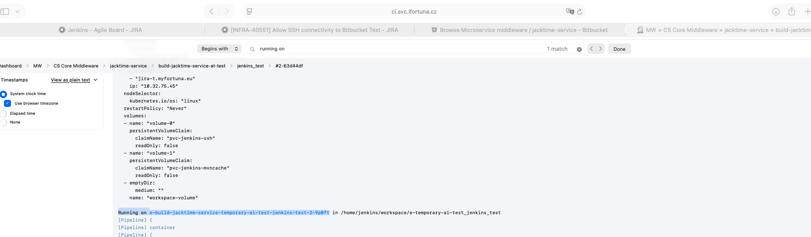

Question is "Can this pod reach that service?" 

```
oc rsh <pod>
curl registry:443
```

right next to info on which agent build is running -> we can see where files are stored inside the agent

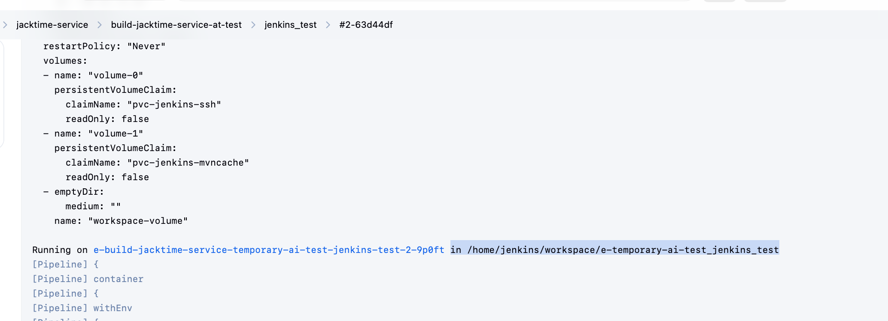

to quickly spot the problem i searched for words:

* skipped due to earlier failure


* i opened fresh pr to start the pod
* then i logged into oc and found the running pod name
* then i opened a shell inside a running oc pod container


# what was done:
```bash
naseka@CZMB94D536 jacktime-service % oc login
You must obtain an API token by visiting https://oauth-openshift.apps.ocp01-shared.m.dc1.cz.ipa.ifortuna.cz/oauth/token/request

Alternatively, use "oc login --web" to login via your browser. See "oc login --help" for more information.
naseka@CZMB94D536 jacktime-service % oc login --token=sha256~g01xFvuVj2USGQJwSxXRK-S7u_rQMrwqRf0oRXIx_-w --server=https://api.ocp01-shared.m.dc1.cz.ipa.ifortuna.cz:6443
Logged into "https://api.ocp01-shared.m.dc1.cz.ipa.ifortuna.cz:6443" as "naseka" using the token provided.

You have access to the following projects and can switch between them with 'oc project <projectname>':

    isesync
    jenkins
  * jenkins-shared
    mw
    netbox
    nexus
    openshift-logging
    prometheus
    quay
    revelio
    shared-images
    sonar
    thanos
    thanos-shared
    tools
    vault
    wulcan

Using project "jenkins-shared".
naseka@CZMB94D536 jacktime-service % oc get pods
NAME                                                              READY   STATUS    RESTARTS   AGE
nt-team-stage-native-regression-ios-cz-regressiontests-78-9hgwx   2/2     Running   0          43m
nt-team-stage-native-regression-ios-hr-regressiontests-78-gmrsr   2/2     Running   0          43m
nt-team-stage-native-regression-ios-ro-regressiontests-78-99tpv   2/2     Running   0          43m
proromtoolbox                                                     1/1     Running   0          7d9h
qa-performance-sitespeed-run-sitespeed-tests-331871-sdjtk-304t5   2/2     Running   0          13m
qa-performance-sitespeed-run-sitespeed-tests-331872-cb28h-74lhm   2/2     Running   0          13m
qa-performance-sitespeed-run-sitespeed-tests-331873-flsz8-1w5qn   2/2     Running   0          13m
qa-performance-sitespeed-run-sitespeed-tests-331874-rr3bk-2kp16   2/2     Running   0          13m
qa-performance-sitespeed-run-sitespeed-tests-331875-6nx2s-44p5r   2/2     Running   0          13m
qa-performance-sitespeed-run-sitespeed-tests-331876-lqq1b-jz19k   2/2     Running   0          13m
qa-performance-sitespeed-run-sitespeed-tests-331877-1mnbd-gq4gs   2/2     Running   0          13m
qa-performance-sitespeed-run-sitespeed-tests-331878-jx08j-hts9h   2/2     Running   0          13m
qa-performance-sitespeed-run-sitespeed-tests-331879-c7hgm-nkmtz   2/2     Running   0          13m
qa-performance-sitespeed-run-sitespeed-tests-331880-czm8n-bkdxv   2/2     Running   0          13m
qa-performance-sitespeed-run-sitespeed-tests-331881-c0k3t-n1911   2/2     Running   0          13m
qa-performance-sitespeed-run-sitespeed-tests-331882-n5kfq-vs1vz   2/2     Running   0          13m
qa-performance-sitespeed-run-sitespeed-tests-331883-xr5v7-b8v0r   2/2     Running   0          13m
qa-performance-sitespeed-run-sitespeed-tests-331884-g849z-3qbf8   2/2     Running   0          13m
qa-performance-sitespeed-run-sitespeed-tests-331885-h11dt-vg56j   2/2     Running   0          13m
qa-performance-sitespeed-run-sitespeed-tests-331887-wks2q-0gj90   2/2     Running   0          13m
qa-performance-sitespeed-run-sitespeed-tests-331888-55sm2-5s4t4   2/2     Running   0          13m
qa-performance-sitespeed-run-sitespeed-tests-331889-f16tt-jkcld   2/2     Running   0          13m
qa-performance-sitespeed-run-sitespeed-tests-331890-qj20s-cgs8m   2/2     Running   0          13m
qa-performance-sitespeed-run-sitespeed-tests-331891-wz1d8-j0xhg   2/2     Running   0          13m
qa-performance-sitespeed-run-sitespeed-tests-331894-gzgbw-8flb1   2/2     Running   0          13m
qa-performance-sitespeed-run-sitespeed-tests-331895-10vwz-6xq79   2/2     Running   0          13m
redis-betsys-b9f4576b-rttdx                                       1/1     Running   0          28d
service-build-jacktime-service-temporary-ai-test-pr-148-1-l2t7k   3/3     Running   0          5m42s
tting--deployment-pipelines--automated-tests-testseps-862-dv898   2/2     Running   0          103m
uild-jacktime-service-temporary-ai-test-jenkins-test-v2-1-x4636   3/3     Running   0          6m58s
xteam-stage-native-regression-ios-casa-regressiontests-78-xcd42   2/2     Running   0          43m
naseka@CZMB94D536 jacktime-service % oc exec -it uild-jacktime-service-temporary-ai-test-jenkins-test-v2-1-x4636 -- sh
Defaulted container "dockerindocker" out of: dockerindocker, maven-java17, jnlp
Error from server (Forbidden): pods "uild-jacktime-service-temporary-ai-test-jenkins-test-v2-1-x4636" is forbidden: exec operation is not allowed because the pod's security context exceeds your permissions: pods "uild-jacktime-service-temporary-ai-test-jenkins-test-v2-1-x4636" is forbidden: unable to validate against any security context constraint: [provider "tools-shared-nms-scc": Forbidden: not usable by user or serviceaccount, provider "anyuid": Forbidden: not usable by user or serviceaccount, provider "pipelines-scc": Forbidden: not usable by user or serviceaccount, provider "nms-restricted-v2-scc": Forbidden: not usable by user or serviceaccount, provider restricted-v2: .containers[0].runAsUser: Invalid value: 0: must be in the ranges: [1000680000, 1000689999], provider restricted-v2: .containers[0].privileged: Invalid value: true: Privileged containers are not allowed, provider restricted: .containers[0].runAsUser: Invalid value: 0: must be in the ranges: [1000680000, 1000689999], provider restricted: .containers[0].privileged: Invalid value: true: Privileged containers are not allowed, provider "nonroot-v2": Forbidden: not usable by user or serviceaccount, provider "nonroot": Forbidden: not usable by user or serviceaccount, provider "forklift-controller-scc": Forbidden: not usable by user or serviceaccount, provider "hostmount-anyuid": Forbidden: not usable by user or serviceaccount, provider "trident-controller": Forbidden: not usable by user or serviceaccount, provider "hostmount-anyuid-v2": Forbidden: not usable by user or serviceaccount, provider "machine-api-termination-handler": Forbidden: not usable by user or serviceaccount, provider "hostnetwork-v2": Forbidden: not usable by user or serviceaccount, provider "hostnetwork": Forbidden: not usable by user or serviceaccount, provider "hostaccess": Forbidden: not usable by user or serviceaccount, provider "quay-privileged-quay": Forbidden: not usable by user or serviceaccount, provider "quay-shared-privileged-quay": Forbidden: not usable by user or serviceaccount, provider "trident-node-linux": Forbidden: not usable by user or serviceaccount, provider "node-exporter": Forbidden: not usable by user or serviceaccount, provider "acs-central-privileged-ipfailover": Forbidden: not usable by user or serviceaccount, provider "isesync-shared-privileged-ipfailover": Forbidden: not usable by user or serviceaccount, provider "jenkins-shared-privileged-ipfailover": Forbidden: not usable by user or serviceaccount, provider "jenkins-test-privileged-ipfailover": Forbidden: not usable by user or serviceaccount, provider "mw-shared-privileged-ipfailover": Forbidden: not usable by user or serviceaccount, provider "netbox-prod-privileged-ipfailover": Forbidden: not usable by user or serviceaccount, provider "netbox-shared-privileged-ipfailover": Forbidden: not usable by user or serviceaccount, provider "netbox-test-privileged-ipfailover": Forbidden: not usable by user or serviceaccount, provider "nexus-shared-privileged-ipfailover": Forbidden: not usable by user or serviceaccount, provider "openshift-logging-privileged-fluentd": Forbidden: not usable by user or serviceaccount, provider "openshift-quay-s3-access-privileged": Forbidden: not usable by user or serviceaccount, provider "privileged": Forbidden: not usable by user or serviceaccount, provider "prometheus-shared-privileged-ipfailover": Forbidden: not usable by user or serviceaccount, provider "quay-shared-privileged-ipfailover": Forbidden: not usable by user or serviceaccount, provider "revelio-shared-privileged-ipfailover": Forbidden: not usable by user or serviceaccount, provider "sonar-prod-privileged-ipfailover": Forbidden: not usable by user or serviceaccount, provider "sonar-shared-privileged-ipfailover": Forbidden: not usable by user or serviceaccount, provider "sonar-test-privileged-ipfailover": Forbidden: not usable by user or serviceaccount, provider "thanos-shared-privileged-ipfailover": Forbidden: not usable by user or serviceaccount, provider "timesheetchecker-shared-privileged-ipfailover": Forbidden: not usable by user or serviceaccount, provider "tools-shared-privileged-ipfailover": Forbidden: not usable by user or serviceaccount, provider "vault-shared-privileged-ipfailover": Forbidden: not usable by user or serviceaccount, provider "vault-test-privileged-ipfailover": Forbidden: not usable by user or serviceaccount, provider "wulcan-shared-privileged-ipfailover": Forbidden: not usable by user or serviceaccount]
naseka@CZMB94D536 jacktime-service % oc exec -it uild-jacktime-service-temporary-ai-test-jenkins-test-v2-1-x4636 -c maven-java17 -- sh
Error from server (Forbidden): pods "uild-jacktime-service-temporary-ai-test-jenkins-test-v2-1-x4636" is forbidden: exec operation is not allowed because the pod's security context exceeds your permissions: pods "uild-jacktime-service-temporary-ai-test-jenkins-test-v2-1-x4636" is forbidden: unable to validate against any security context constraint: [provider "tools-shared-nms-scc": Forbidden: not usable by user or serviceaccount, provider "anyuid": Forbidden: not usable by user or serviceaccount, provider "pipelines-scc": Forbidden: not usable by user or serviceaccount, provider "nms-restricted-v2-scc": Forbidden: not usable by user or serviceaccount, provider restricted-v2: .containers[0].runAsUser: Invalid value: 0: must be in the ranges: [1000680000, 1000689999], provider restricted-v2: .containers[0].privileged: Invalid value: true: Privileged containers are not allowed, provider restricted: .containers[0].runAsUser: Invalid value: 0: must be in the ranges: [1000680000, 1000689999], provider restricted: .containers[0].privileged: Invalid value: true: Privileged containers are not allowed, provider "nonroot-v2": Forbidden: not usable by user or serviceaccount, provider "nonroot": Forbidden: not usable by user or serviceaccount, provider "forklift-controller-scc": Forbidden: not usable by user or serviceaccount, provider "hostmount-anyuid": Forbidden: not usable by user or serviceaccount, provider "trident-controller": Forbidden: not usable by user or serviceaccount, provider "hostmount-anyuid-v2": Forbidden: not usable by user or serviceaccount, provider "machine-api-termination-handler": Forbidden: not usable by user or serviceaccount, provider "hostnetwork-v2": Forbidden: not usable by user or serviceaccount, provider "hostnetwork": Forbidden: not usable by user or serviceaccount, provider "hostaccess": Forbidden: not usable by user or serviceaccount, provider "quay-privileged-quay": Forbidden: not usable by user or serviceaccount, provider "quay-shared-privileged-quay": Forbidden: not usable by user or serviceaccount, provider "trident-node-linux": Forbidden: not usable by user or serviceaccount, provider "node-exporter": Forbidden: not usable by user or serviceaccount, provider "acs-central-privileged-ipfailover": Forbidden: not usable by user or serviceaccount, provider "isesync-shared-privileged-ipfailover": Forbidden: not usable by user or serviceaccount, provider "jenkins-shared-privileged-ipfailover": Forbidden: not usable by user or serviceaccount, provider "jenkins-test-privileged-ipfailover": Forbidden: not usable by user or serviceaccount, provider "mw-shared-privileged-ipfailover": Forbidden: not usable by user or serviceaccount, provider "netbox-prod-privileged-ipfailover": Forbidden: not usable by user or serviceaccount, provider "netbox-shared-privileged-ipfailover": Forbidden: not usable by user or serviceaccount, provider "netbox-test-privileged-ipfailover": Forbidden: not usable by user or serviceaccount, provider "nexus-shared-privileged-ipfailover": Forbidden: not usable by user or serviceaccount, provider "openshift-logging-privileged-fluentd": Forbidden: not usable by user or serviceaccount, provider "openshift-quay-s3-access-privileged": Forbidden: not usable by user or serviceaccount, provider "privileged": Forbidden: not usable by user or serviceaccount, provider "prometheus-shared-privileged-ipfailover": Forbidden: not usable by user or serviceaccount, provider "quay-shared-privileged-ipfailover": Forbidden: not usable by user or serviceaccount, provider "revelio-shared-privileged-ipfailover": Forbidden: not usable by user or serviceaccount, provider "sonar-prod-privileged-ipfailover": Forbidden: not usable by user or serviceaccount, provider "sonar-shared-privileged-ipfailover": Forbidden: not usable by user or serviceaccount, provider "sonar-test-privileged-ipfailover": Forbidden: not usable by user or serviceaccount, provider "thanos-shared-privileged-ipfailover": Forbidden: not usable by user or serviceaccount, provider "timesheetchecker-shared-privileged-ipfailover": Forbidden: not usable by user or serviceaccount, provider "tools-shared-privileged-ipfailover": Forbidden: not usable by user or serviceaccount, provider "vault-shared-privileged-ipfailover": Forbidden: not usable by user or serviceaccount, provider "vault-test-privileged-ipfailover": Forbidden: not usable by user or serviceaccount, provider "wulcan-shared-privileged-ipfailover": Forbidden: not usable by user or serviceaccount]
naseka@CZMB94D536 jacktime-service % oc describe pod uild-jacktime-service-temporary-ai-test-jenkins-test-v2-1-x4636
Name:             uild-jacktime-service-temporary-ai-test-jenkins-test-v2-1-x4636
Namespace:        jenkins-shared
Priority:         0
Service Account:  default
Node:             ocp01-shared-btt8w-jenkins-ms01-9tkgj/10.0.172.115
Start Time:       Thu, 05 Mar 2026 21:36:42 +0100
Labels:           jenkins=slave
                  jenkins/label=acktime-service-temporary-ai-test_jenkins_test_v2_1-flx29
                  jenkins/label-digest=2f156a4a252505f54ebaec56ee8e54608877780d
                  kubernetes.jenkins.io/controller=https___ci_svc_ifortuna_czx
Annotations:      buildUrl:
                    https://ci.svc.ifortuna.cz/job/MW/job/CS%20Core%20Middleware/job/jacktime-service/job/build-jacktime-service-temporary-ai-test/job/jenkins...
                  k8s.ovn.org/pod-networks:
                    {"default":{"ip_addresses":["172.32.75.119/23"],"mac_address":"0a:58:ac:20:4b:77","gateway_ips":["172.32.74.1"],"routes":[{"dest":"172.32....
                  k8s.v1.cni.cncf.io/network-status:
                    [{
                        "name": "ovn-kubernetes",
                        "interface": "eth0",
                        "ips": [
                            "172.32.75.119"
                        ],
                        "mac": "0a:58:ac:20:4b:77",
                        "default": true,
                        "dns": {}
                    }]
                  kubernetes.jenkins.io/last-refresh: 1772743002255
                  openshift.io/scc: privileged
                  runUrl: job/MW/job/CS%20Core%20Middleware/job/jacktime-service/job/build-jacktime-service-temporary-ai-test/job/jenkins_test_v2/1/
Status:           Running
IP:               172.32.75.119
IPs:
  IP:  172.32.75.119
Containers:
  dockerindocker:
    Container ID:  cri-o://ff06a79710c5da28a85611d30989afd72ae95f7a16a5719e594b62e86cf65f4c
    Image:         image-registry.openshift-image-registry.svc:5000/shared-images/dockerindocker:latest
    Image ID:      image-registry.openshift-image-registry.svc:5000/shared-images/dockerindocker@sha256:32aec02ec82ded134aaa0eb970180fc0b0cf187c54f5a7496c98cbb196536e02
    Port:          <none>
    Host Port:     <none>
    Command:
      /usr/local/bin/dockerd-entrypoint.sh
    State:          Running
      Started:      Thu, 05 Mar 2026 21:36:45 +0100
    Ready:          True
    Restart Count:  0
    Limits:
      cpu:     5
      memory:  16000Mi
    Requests:
      cpu:     500m
      memory:  16000Mi
    Environment:
      DOCKER_HOST:         tcp://127.0.0.1:2375
      NEXUS_URL:           http://sonatype-nexus-service.nexus-shared.svc:8081
      DOCKER_TLS_CERTDIR:  
      SONAR_NO_PROXY:      sonar-prod.sonar-prod.svc
      NEXUS_NO_PROXY:      sonatype-nexus-service.nexus-shared.svc
      SONAR_URL:           http://sonar-prod.sonar-prod.svc:9000
    Mounts:
      /home/jenkins from workspace-volume (rw)
      /home/jenkins/.ssh from volume-0 (rw)
      /opt/mvncache from volume-1 (rw)
      /var/run/secrets/kubernetes.io/serviceaccount from kube-api-access-rxvjt (ro)
  maven-java17:
    Container ID:  cri-o://27c5b8676720f0f10d25ae9194825c4ed0056abf1c31beab9260d81794f1c1b6
    Image:         image-registry.openshift-image-registry.svc:5000/shared-images/maven-java17:latest
    Image ID:      image-registry.openshift-image-registry.svc:5000/shared-images/maven-java17@sha256:863d736c78b4f9a4a5bb46e3efed13ba8170adb85207d132b1a6851b1abff9dd
    Port:          <none>
    Host Port:     <none>
    Command:
      cat
    State:          Running
      Started:      Thu, 05 Mar 2026 21:36:45 +0100
    Ready:          True
    Restart Count:  0
    Limits:
      cpu:     4
      memory:  6000Mi
    Requests:
      cpu:     500m
      memory:  500Mi
    Environment:
      DOCKER_HOST:                    tcp://127.0.0.1:2375
      TESTCONTAINERS_CHECKS_DISABLE:  true
      NEXUS_URL:                      http://sonatype-nexus-service.nexus-shared.svc:8081
      SONAR_NO_PROXY:                 sonar-prod.sonar-prod.svc
      TESTCONTAINERS_RYUK_DISABLED:   true
      NEXUS_NO_PROXY:                 sonatype-nexus-service.nexus-shared.svc
      SONAR_URL:                      http://sonar-prod.sonar-prod.svc:9000
    Mounts:
      /home/jenkins from workspace-volume (rw)
      /home/jenkins/.ssh from volume-0 (rw)
      /opt/mvncache from volume-1 (rw)
      /var/run/secrets/kubernetes.io/serviceaccount from kube-api-access-rxvjt (ro)
  jnlp:
    Container ID:   cri-o://262bdbff21458f9e3a561f1da6846eb888f120ab7f1cb50a17c595a3ded99c0c
    Image:          image-registry.openshift-image-registry.svc:5000/shared-images/jnlp:latest
    Image ID:       image-registry.openshift-image-registry.svc:5000/shared-images/jnlp@sha256:e982192152b76fffc0c7a824489c1562bb9af8a094df8f06d588be9d797cc0de
    Port:           <none>
    Host Port:      <none>
    State:          Running
      Started:      Thu, 05 Mar 2026 21:36:45 +0100
    Ready:          True
    Restart Count:  0
    Limits:
      cpu:     2
      memory:  6000Mi
    Requests:
      cpu:     500m
      memory:  1000Mi
    Environment:
      JENKINS_SECRET:         4d49fb892b738bd13d204b4d86bbf376942fefd5714657d36e45f02ed3218c80
      JENKINS_TUNNEL:         :50000
      GIT_SSL_NO_VERIFY:      true
      GIT_COMMITTER_NAME:     Jenkins
      SONAR_NO_PROXY:         sonar-prod.sonar-prod.svc
      JAVA_OPTS:              -Xmx2G -Xms1G
      JENKINS_AGENT_WORKDIR:  /home/jenkins
      JENKINS_AGENT_NAME:     uild-jacktime-service-temporary-ai-test-jenkins-test-v2-1-x4636
      GIT_COMMITTER_EMAIL:    jenkins@feg.eu
      NEXUS_URL:              http://sonatype-nexus-service.nexus-shared.svc:8081
      REMOTING_OPTS:          -noReconnectAfter 1d
      NEXUS_NO_PROXY:         sonatype-nexus-service.nexus-shared.svc
      JENKINS_NAME:           uild-jacktime-service-temporary-ai-test-jenkins-test-v2-1-x4636
      JENKINS_URL:            https://ci.svc.ifortuna.cz/
      SONAR_URL:              http://sonar-prod.sonar-prod.svc:9000
    Mounts:
      /home/jenkins from workspace-volume (rw)
      /home/jenkins/.ssh from volume-0 (rw)
      /opt/mvncache from volume-1 (rw)
      /var/run/secrets/kubernetes.io/serviceaccount from kube-api-access-rxvjt (ro)
Conditions:
  Type                        Status
  PodReadyToStartContainers   True 
  Initialized                 True 
  Ready                       True 
  ContainersReady             True 
  PodScheduled                True 
Volumes:
  volume-0:
    Type:       PersistentVolumeClaim (a reference to a PersistentVolumeClaim in the same namespace)
    ClaimName:  pvc-jenkins-ssh
    ReadOnly:   false
  volume-1:
    Type:       PersistentVolumeClaim (a reference to a PersistentVolumeClaim in the same namespace)
    ClaimName:  pvc-jenkins-mvncache
    ReadOnly:   false
  workspace-volume:
    Type:       EmptyDir (a temporary directory that shares a pod's lifetime)
    Medium:     
    SizeLimit:  <unset>
  kube-api-access-rxvjt:
    Type:                    Projected (a volume that contains injected data from multiple sources)
    TokenExpirationSeconds:  3607
    ConfigMapName:           kube-root-ca.crt
    ConfigMapOptional:       <nil>
    DownwardAPI:             true
    ConfigMapName:           openshift-service-ca.crt
    ConfigMapOptional:       <nil>
QoS Class:                   Burstable
Node-Selectors:              compute=jenkins
                             kubernetes.io/os=linux
Tolerations:                 node.kubernetes.io/memory-pressure:NoSchedule op=Exists
                             node.kubernetes.io/not-ready:NoExecute op=Exists for 300s
                             node.kubernetes.io/unreachable:NoExecute op=Exists for 300s
                             role=jenkins:NoSchedule
Events:
  Type    Reason                  Age   From                     Message
  ----    ------                  ----  ----                     -------
  Normal  Scheduled               13m   default-scheduler        Successfully assigned jenkins-shared/uild-jacktime-service-temporary-ai-test-jenkins-test-v2-1-x4636 to ocp01-shared-btt8w-jenkins-ms01-9tkgj
  Normal  SuccessfulAttachVolume  13m   attachdetach-controller  AttachVolume.Attach succeeded for volume "pvc-5ce6a30d-5608-4889-90a5-c756041d3502"
  Normal  AddedInterface          13m   multus                   Add eth0 [172.32.75.119/23] from ovn-kubernetes
  Normal  Pulling                 13m   kubelet                  Pulling image "image-registry.openshift-image-registry.svc:5000/shared-images/dockerindocker:latest"
  Normal  Pulled                  13m   kubelet                  Successfully pulled image "image-registry.openshift-image-registry.svc:5000/shared-images/dockerindocker:latest" in 61ms (61ms including waiting). Image size: 578070347 bytes.
  Normal  Created                 13m   kubelet                  Created container: dockerindocker
  Normal  Started                 13m   kubelet                  Started container dockerindocker
  Normal  Pulling                 13m   kubelet                  Pulling image "image-registry.openshift-image-registry.svc:5000/shared-images/maven-java17:latest"
  Normal  Pulled                  13m   kubelet                  Successfully pulled image "image-registry.openshift-image-registry.svc:5000/shared-images/maven-java17:latest" in 52ms (52ms including waiting). Image size: 1545531869 bytes.
  Normal  Created                 13m   kubelet                  Created container: maven-java17
  Normal  Started                 13m   kubelet                  Started container maven-java17
  Normal  Pulling                 13m   kubelet                  Pulling image "image-registry.openshift-image-registry.svc:5000/shared-images/jnlp:latest"
  Normal  Pulled                  13m   kubelet                  Successfully pulled image "image-registry.openshift-image-registry.svc:5000/shared-images/jnlp:latest" in 51ms (51ms including waiting). Image size: 458098411 bytes.
  Normal  Created                 13m   kubelet                  Created container: jnlp
  Normal  Started                 13m   kubelet                  Started container jnlp
naseka@CZMB94D536 jacktime-service % oc describe pod uild-jacktime-service-temporary-ai-test-jenkins-test-v2-1-x4636
Name:             uild-jacktime-service-temporary-ai-test-jenkins-test-v2-1-x4636
Namespace:        jenkins-shared
Priority:         0
Service Account:  default
Node:             ocp01-shared-btt8w-jenkins-ms01-9tkgj/10.0.172.115
Start Time:       Thu, 05 Mar 2026 21:36:42 +0100
Labels:           jenkins=slave
                  jenkins/label=acktime-service-temporary-ai-test_jenkins_test_v2_1-flx29
                  jenkins/label-digest=2f156a4a252505f54ebaec56ee8e54608877780d
                  kubernetes.jenkins.io/controller=https___ci_svc_ifortuna_czx
Annotations:      buildUrl:
                    https://ci.svc.ifortuna.cz/job/MW/job/CS%20Core%20Middleware/job/jacktime-service/job/build-jacktime-service-temporary-ai-test/job/jenkins...
                  k8s.ovn.org/pod-networks:
                    {"default":{"ip_addresses":["172.32.75.119/23"],"mac_address":"0a:58:ac:20:4b:77","gateway_ips":["172.32.74.1"],"routes":[{"dest":"172.32....
                  k8s.v1.cni.cncf.io/network-status:
                    [{
                        "name": "ovn-kubernetes",
                        "interface": "eth0",
                        "ips": [
                            "172.32.75.119"
                        ],
                        "mac": "0a:58:ac:20:4b:77",
                        "default": true,
                        "dns": {}
                    }]
                  kubernetes.jenkins.io/last-refresh: 1772743002255
                  openshift.io/scc: privileged
                  runUrl: job/MW/job/CS%20Core%20Middleware/job/jacktime-service/job/build-jacktime-service-temporary-ai-test/job/jenkins_test_v2/1/
Status:           Running
IP:               172.32.75.119
IPs:
  IP:  172.32.75.119
Containers:
  dockerindocker:
    Container ID:  cri-o://ff06a79710c5da28a85611d30989afd72ae95f7a16a5719e594b62e86cf65f4c
    Image:         image-registry.openshift-image-registry.svc:5000/shared-images/dockerindocker:latest
    Image ID:      image-registry.openshift-image-registry.svc:5000/shared-images/dockerindocker@sha256:32aec02ec82ded134aaa0eb970180fc0b0cf187c54f5a7496c98cbb196536e02
    Port:          <none>
    Host Port:     <none>
    Command:
      /usr/local/bin/dockerd-entrypoint.sh
    State:          Running
      Started:      Thu, 05 Mar 2026 21:36:45 +0100
    Ready:          True
    Restart Count:  0
    Limits:
      cpu:     5
      memory:  16000Mi
    Requests:
      cpu:     500m
      memory:  16000Mi
    Environment:
      DOCKER_HOST:         tcp://127.0.0.1:2375
      NEXUS_URL:           http://sonatype-nexus-service.nexus-shared.svc:8081
      DOCKER_TLS_CERTDIR:  
      SONAR_NO_PROXY:      sonar-prod.sonar-prod.svc
      NEXUS_NO_PROXY:      sonatype-nexus-service.nexus-shared.svc
      SONAR_URL:           http://sonar-prod.sonar-prod.svc:9000
    Mounts:
      /home/jenkins from workspace-volume (rw)
      /home/jenkins/.ssh from volume-0 (rw)
      /opt/mvncache from volume-1 (rw)
      /var/run/secrets/kubernetes.io/serviceaccount from kube-api-access-rxvjt (ro)
  maven-java17:
    Container ID:  cri-o://27c5b8676720f0f10d25ae9194825c4ed0056abf1c31beab9260d81794f1c1b6
    Image:         image-registry.openshift-image-registry.svc:5000/shared-images/maven-java17:latest
    Image ID:      image-registry.openshift-image-registry.svc:5000/shared-images/maven-java17@sha256:863d736c78b4f9a4a5bb46e3efed13ba8170adb85207d132b1a6851b1abff9dd
    Port:          <none>
    Host Port:     <none>
    Command:
      cat
    State:          Running
      Started:      Thu, 05 Mar 2026 21:36:45 +0100
    Ready:          True
    Restart Count:  0
    Limits:
      cpu:     4
      memory:  6000Mi
    Requests:
      cpu:     500m
      memory:  500Mi
    Environment:
      DOCKER_HOST:                    tcp://127.0.0.1:2375
      TESTCONTAINERS_CHECKS_DISABLE:  true
      NEXUS_URL:                      http://sonatype-nexus-service.nexus-shared.svc:8081
      SONAR_NO_PROXY:                 sonar-prod.sonar-prod.svc
      TESTCONTAINERS_RYUK_DISABLED:   true
      NEXUS_NO_PROXY:                 sonatype-nexus-service.nexus-shared.svc
      SONAR_URL:                      http://sonar-prod.sonar-prod.svc:9000
    Mounts:
      /home/jenkins from workspace-volume (rw)
      /home/jenkins/.ssh from volume-0 (rw)
      /opt/mvncache from volume-1 (rw)
      /var/run/secrets/kubernetes.io/serviceaccount from kube-api-access-rxvjt (ro)
  jnlp:
    Container ID:   cri-o://262bdbff21458f9e3a561f1da6846eb888f120ab7f1cb50a17c595a3ded99c0c
    Image:          image-registry.openshift-image-registry.svc:5000/shared-images/jnlp:latest
    Image ID:       image-registry.openshift-image-registry.svc:5000/shared-images/jnlp@sha256:e982192152b76fffc0c7a824489c1562bb9af8a094df8f06d588be9d797cc0de
    Port:           <none>
    Host Port:      <none>
    State:          Running
      Started:      Thu, 05 Mar 2026 21:36:45 +0100
    Ready:          True
    Restart Count:  0
    Limits:
      cpu:     2
      memory:  6000Mi
    Requests:
      cpu:     500m
      memory:  1000Mi
    Environment:
      JENKINS_SECRET:         4d49fb892b738bd13d204b4d86bbf376942fefd5714657d36e45f02ed3218c80
      JENKINS_TUNNEL:         :50000
      GIT_SSL_NO_VERIFY:      true
      GIT_COMMITTER_NAME:     Jenkins
      SONAR_NO_PROXY:         sonar-prod.sonar-prod.svc
      JAVA_OPTS:              -Xmx2G -Xms1G
      JENKINS_AGENT_WORKDIR:  /home/jenkins
      JENKINS_AGENT_NAME:     uild-jacktime-service-temporary-ai-test-jenkins-test-v2-1-x4636
      GIT_COMMITTER_EMAIL:    jenkins@feg.eu
      NEXUS_URL:              http://sonatype-nexus-service.nexus-shared.svc:8081
      REMOTING_OPTS:          -noReconnectAfter 1d
      NEXUS_NO_PROXY:         sonatype-nexus-service.nexus-shared.svc
      JENKINS_NAME:           uild-jacktime-service-temporary-ai-test-jenkins-test-v2-1-x4636
      JENKINS_URL:            https://ci.svc.ifortuna.cz/
      SONAR_URL:              http://sonar-prod.sonar-prod.svc:9000
    Mounts:
      /home/jenkins from workspace-volume (rw)
      /home/jenkins/.ssh from volume-0 (rw)
      /opt/mvncache from volume-1 (rw)
      /var/run/secrets/kubernetes.io/serviceaccount from kube-api-access-rxvjt (ro)
Conditions:
  Type                        Status
  PodReadyToStartContainers   True 
  Initialized                 True 
  Ready                       True 
  ContainersReady             True 
  PodScheduled                True 
Volumes:
  volume-0:
    Type:       PersistentVolumeClaim (a reference to a PersistentVolumeClaim in the same namespace)
    ClaimName:  pvc-jenkins-ssh
    ReadOnly:   false
  volume-1:
    Type:       PersistentVolumeClaim (a reference to a PersistentVolumeClaim in the same namespace)
    ClaimName:  pvc-jenkins-mvncache
    ReadOnly:   false
  workspace-volume:
    Type:       EmptyDir (a temporary directory that shares a pod's lifetime)
    Medium:     
    SizeLimit:  <unset>
  kube-api-access-rxvjt:
    Type:                    Projected (a volume that contains injected data from multiple sources)
    TokenExpirationSeconds:  3607
    ConfigMapName:           kube-root-ca.crt
    ConfigMapOptional:       <nil>
    DownwardAPI:             true
    ConfigMapName:           openshift-service-ca.crt
    ConfigMapOptional:       <nil>
QoS Class:                   Burstable
Node-Selectors:              compute=jenkins
                             kubernetes.io/os=linux
Tolerations:                 node.kubernetes.io/memory-pressure:NoSchedule op=Exists
                             node.kubernetes.io/not-ready:NoExecute op=Exists for 300s
                             node.kubernetes.io/unreachable:NoExecute op=Exists for 300s
                             role=jenkins:NoSchedule
Events:
  Type    Reason                  Age   From                     Message
  ----    ------                  ----  ----                     -------
  Normal  Scheduled               16m   default-scheduler        Successfully assigned jenkins-shared/uild-jacktime-service-temporary-ai-test-jenkins-test-v2-1-x4636 to ocp01-shared-btt8w-jenkins-ms01-9tkgj
  Normal  SuccessfulAttachVolume  16m   attachdetach-controller  AttachVolume.Attach succeeded for volume "pvc-5ce6a30d-5608-4889-90a5-c756041d3502"
  Normal  AddedInterface          16m   multus                   Add eth0 [172.32.75.119/23] from ovn-kubernetes
  Normal  Pulling                 16m   kubelet                  Pulling image "image-registry.openshift-image-registry.svc:5000/shared-images/dockerindocker:latest"
  Normal  Pulled                  16m   kubelet                  Successfully pulled image "image-registry.openshift-image-registry.svc:5000/shared-images/dockerindocker:latest" in 61ms (61ms including waiting). Image size: 578070347 bytes.
  Normal  Created                 16m   kubelet                  Created container: dockerindocker
  Normal  Started                 16m   kubelet                  Started container dockerindocker
  Normal  Pulling                 16m   kubelet                  Pulling image "image-registry.openshift-image-registry.svc:5000/shared-images/maven-java17:latest"
  Normal  Pulled                  16m   kubelet                  Successfully pulled image "image-registry.openshift-image-registry.svc:5000/shared-images/maven-java17:latest" in 52ms (52ms including waiting). Image size: 1545531869 bytes.
  Normal  Created                 16m   kubelet                  Created container: maven-java17
  Normal  Started                 16m   kubelet                  Started container maven-java17
  Normal  Pulling                 16m   kubelet                  Pulling image "image-registry.openshift-image-registry.svc:5000/shared-images/jnlp:latest"
  Normal  Pulled                  16m   kubelet                  Successfully pulled image "image-registry.openshift-image-registry.svc:5000/shared-images/jnlp:latest" in 51ms (51ms including waiting). Image size: 458098411 bytes.
  Normal  Created                 16m   kubelet                  Created container: jnlp
  Normal  Started                 16m   kubelet                  Started container jnlp
naseka@CZMB94D536 jacktime-service % oc -n jenkins-shared run netcheck \ # switch to jenkins-shared name space and create a pod named netcheck. it will start one container
  --image=registry.access.redhat.com/ubi9/ubi-minimal \ # use this container image, which is official red hat base image, its tiny, secure and it contains shell + networking tools. good for debugging connectivity
  --restart=Never \ # !!!important, cause its just one disposable pod. use it so it doesnt restart!
  -it --rm \ # -it means interactive terminal, lets you type commands inside container. --rm means the pod will be deleted automatically when you exit the shell
  -- sh # means run the shell program inside the container
naseka@CZMB94D536 jacktime-service % oc -n jenkins-shared run netcheck \
  --image=registry.access.redhat.com/ubi9/ubi-minimal \
  --restart=Never \
  -it --rm \
  -- sh
If you don't see a command prompt, try pressing enter.
sh-5.1$ timeout 5 sh -c 'cat < /dev/null > /dev/tcp/czdcm-quay.lx.ifortuna.cz/443' && echo OK || echo FAIL
sh: connect: No route to host
sh: line 1: /dev/tcp/czdcm-quay.lx.ifortuna.cz/443: No route to host
FAIL
sh-5.1$ getent hosts czdcm-quay.lx.ifortuna.cz || nslookup czdcm-quay.lx.ifortuna.cz
10.0.136.14     czdcm-quay.lx.ifortuna.cz
sh-5.1$ ip route
sh: ip: command not found
sh-5.1$ timeout 5 sh -c 'cat < /dev/null > /dev/tcp/10.0.136.14/443' && echo OK || echo FAIL
sh: connect: No route to host
sh: line 1: /dev/tcp/10.0.136.14/443: No route to host
FAIL
sh-5.1$ timeout 5 bash -lc 'cat < /dev/null > /dev/tcp/10.0.136.14/443' && echo OK || echo FAIL
bash: connect: No route to host
bash: line 1: /dev/tcp/10.0.136.14/443: No route to host
FAIL
sh-5.1$ exit
exit
pod "netcheck" deleted
naseka@CZMB94D536 jacktime-service % 
```

# Debugging plan of the no rout to host error

## Debugging template: from console output

      Stage: Build jar
      Top-level command: mvn clean install
      Inner failing component: Testcontainers / Docker image pull
      Destination: czdcm-quay.lx.ifortuna.cz:443
      First meaningful error: connect: no route to host


1. Confirm the exact failing stage: 

Failure stage: Build jar

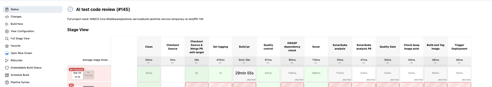
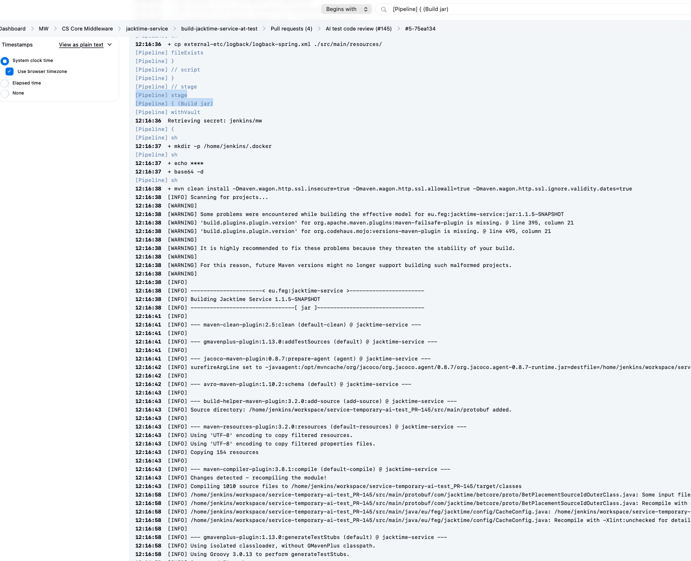

2. in that stage i can see last command prior the Errors start -> last command (in the log shell commands appear with `+` in front)

`mvn clean install`

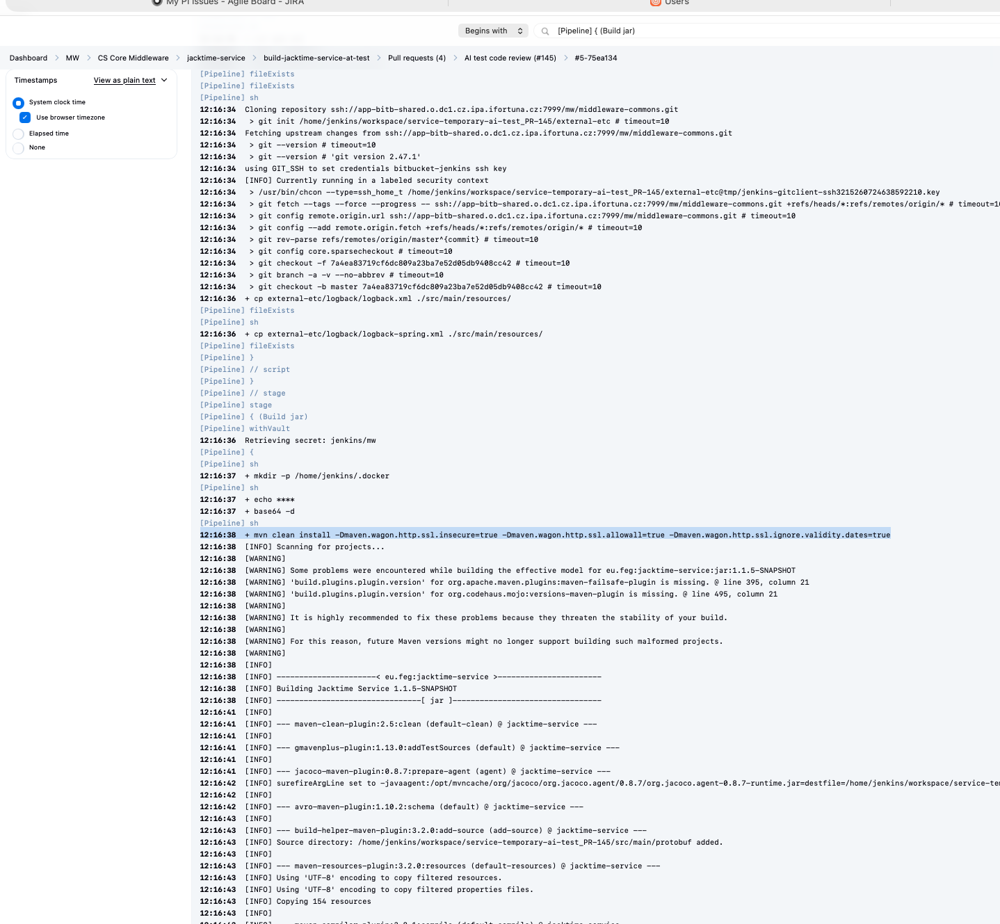

Failing command family: mvn clean install

Jenkins ran mvn clean install
→ tests started
→ tests used Testcontainers
→ Testcontainers needed image kafka:5.2.1
→ container runtime tried to pull from Quay
→ Quay registry endpoint was unreachable
→ Maven reported overall build failure

Inner failing component: Testcontainers → Docker → Quay


3. Separate noise from real error:

real error = first error that explains what actually broke

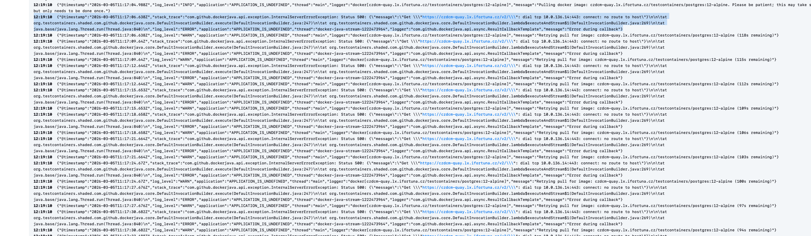

the error line shows the destination host:

`czdcm-quay.lx.ifortuna.cz`

**!!! thats what i am going to test manually**


## actual debugging

here i will modify the pipeline:

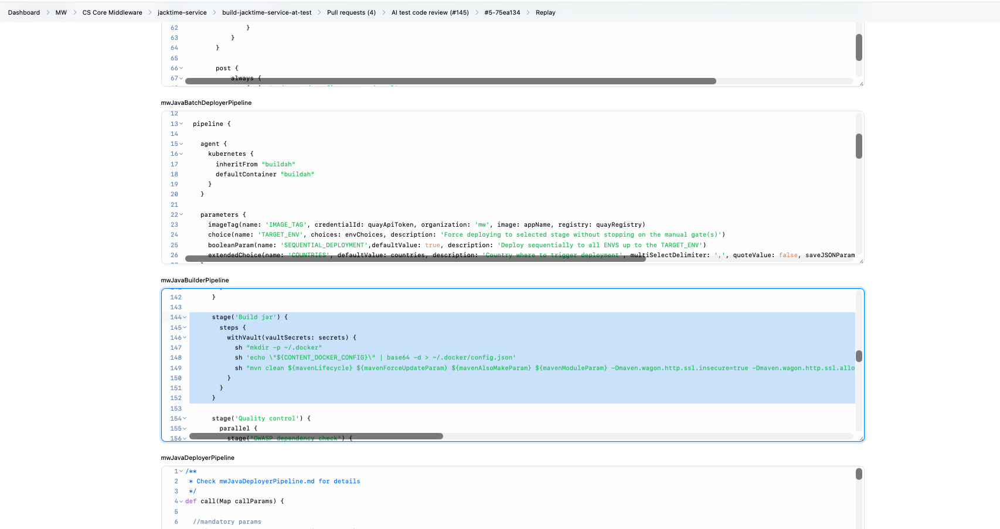


add this block prior `mvn clean isntall ...`

```groovy
            sh '''
            echo "=======DEBUG ENV========="
            env | sort
            echo "=======DNS========="
            cat /etc/resolv.conf || true
            echo "=======HOSTS========="
            cat /etc/hosts || true
            echo "=======PAUSE FOR DEBUG========="
            sleep 30m
            '''
```
# Jenkins Pipeline Debug Block Explanation

This debug block is used when troubleshooting Jenkins pipelines.  
It runs **inside the Jenkins agent container** before the real build command so we can inspect the runtime environment.

Example debug block:

```groovy
sh '''
echo "===== DEBUG ENV ====="
env | sort
echo "===== DNS ====="
cat /etc/resolv.conf || true
echo "===== HOSTS ====="
cat /etc/hosts || true
echo "===== PAUSE FOR DEBUG ====="
sleep 30m
'''
```

The goal is to understand **how the environment actually looks inside the CI agent**.

---

## 1. Environment Debug

```bash
echo "===== DEBUG ENV ====="
env | sort
```

### What it does

`env` prints **all environment variables available to the current process**.

Example output:

```text
HOME=/home/jenkins
HTTP_PROXY=http://10.8.68.20:3128
HTTPS_PROXY=http://10.8.68.20:3128
NO_PROXY=nexus.svc.ifortuna.cz,...
PATH=/usr/local/sbin:/usr/local/bin:/usr/sbin:/usr/bin
JENKINS_URL=https://jenkins.company
BRANCH_NAME=master
WORKSPACE=/home/jenkins/agent/workspace/job
```

### Why this is important

Many CI failures are caused by environment configuration.

Important variables to check:

| Variable | Why it matters |
|---|---|
| `HTTP_PROXY` | outbound HTTP traffic |
| `HTTPS_PROXY` | outbound HTTPS traffic |
| `NO_PROXY` | hosts that bypass proxy |
| `PATH` | which binaries are used |
| `JAVA_HOME` | Java version |
| `HOME` | where configs are stored |
| `DOCKER_*` | Docker configuration |
| `MAVEN_OPTS` | Maven behavior |

### Why `sort` is used

Environment variables are usually printed in random order.

Using:

```bash
env | sort
```

makes them alphabetical and much easier to read in Jenkins logs.

---

## 2. DNS Configuration

```bash
echo "===== DNS ====="
cat /etc/resolv.conf || true
```

### What `/etc/resolv.conf` is

This file defines **how DNS resolution works inside the container**.

Example:

```text
nameserver 10.96.0.10
search svc.cluster.local cluster.local
options ndots:5
```

### Meaning of the fields

| Field | Meaning |
|---|---|
| `nameserver` | DNS server used by the container |
| `search` | domains automatically appended |
| `options` | DNS resolver behavior |

In Kubernetes/OpenShift, the DNS server is usually an internal cluster DNS service.

### Why this matters

If the container cannot resolve a hostname like:

```text
czdcm-quay.lx.ifortuna.cz
```

then DNS may be the real problem.

Possible issues:

- missing nameserver
- broken cluster DNS
- bad resolver configuration
- unexpected search domain behavior

### Why `|| true` is used

Normally, if `cat /etc/resolv.conf` failed, the shell step could fail too.

Using:

```bash
cat /etc/resolv.conf || true
```

means:

- try to show the file
- if it fails, do not stop the debug script

This is useful for diagnostics because we want the script to continue.

---

## 3. Host Overrides

```bash
echo "===== HOSTS ====="
cat /etc/hosts || true
```

### What `/etc/hosts` is

This file defines **manual hostname to IP mappings**.

Example:

```text
127.0.0.1 localhost
10.0.1.23 internal-service
```

### Why we inspect it

Sometimes a hostname is overridden here and points to the wrong IP.

Example problem:

```text
10.0.1.23 czdcm-quay.lx.ifortuna.cz
```

If that IP is wrong, network calls will fail even if DNS itself is fine.

Checking `/etc/hosts` helps verify:

- no wrong hostname overrides
- expected container network setup
- no manual mapping causing confusion

---

## 4. Pause for Debugging

```bash
echo "===== PAUSE FOR DEBUG ====="
sleep 30m
```

### What it does

This pauses the pipeline for **30 minutes**.

The Jenkins agent container stays alive during that time.

I ran the replay with modified pipeline and i can see this in the logs:

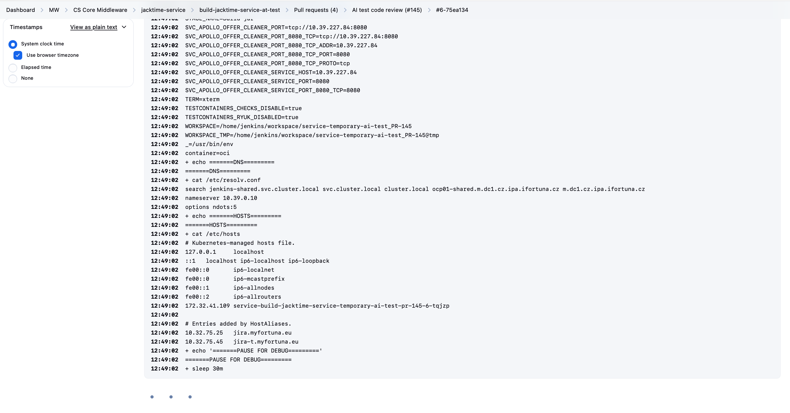


output in the console: all looks fine

        12:49:02  + echo =======DNS=========
        12:49:02  =======DNS=========
        12:49:02  + cat /etc/resolv.conf
        12:49:02  search jenkins-shared.svc.cluster.local svc.cluster.local cluster.local ocp01-shared.m.dc1.cz.ipa.ifortuna.cz m.dc1.cz.ipa.ifortuna.cz
        12:49:02  nameserver 10.39.0.10
        12:49:02  options ndots:5
        12:49:02  + echo =======HOSTS=========
        12:49:02  =======HOSTS=========
        12:49:02  + cat /etc/hosts
        12:49:02  # Kubernetes-managed hosts file.
        12:49:02  127.0.0.1	localhost
        12:49:02  ::1	localhost ip6-localhost ip6-loopback
        12:49:02  fe00::0	ip6-localnet
        12:49:02  fe00::0	ip6-mcastprefix
        12:49:02  fe00::1	ip6-allnodes
        12:49:02  fe00::2	ip6-allrouters
        12:49:02  172.32.41.109	service-build-jacktime-service-temporary-ai-test-pr-145-6-tqjzp
        12:49:02  
        12:49:02  # Entries added by HostAliases.
        12:49:02  10.32.75.25	jira.myfortuna.eu
        12:49:02  10.32.75.45	jira-t.myfortuna.eu
        12:49:02  + echo '=======PAUSE FOR DEBUG========='
        12:49:02  =======PAUSE FOR DEBUG=========

### Why this is useful

Without a pause:

1. pipeline runs
2. build fails
3. pod disappears
4. you cannot inspect the live environment

With a pause:

1. pipeline runs
2. debug section executes
3. pod stays alive
4. you can enter it and inspect it manually

This is a classic CI/CD debugging trick.

---

## 5. What to do during the pause

While the pipeline is sleeping, you can connect to the running pod.

### Find the pod

```bash
oc get pods
```

then in my logs i know the pod name:         12:49:02  172.32.41.109	service-build-jacktime-service-temporary-ai-test-pr-145-6-tqjzp

so i ran 
```bash
oc describe pod service-build-jacktime-service-temporary-ai-test-pr-145-6-tqjzp
```

output: 

```bash
naseka@CZMB94D536 Devops % oc describe pod service-build-jacktime-service-temporary-ai-test-pr-145-6-tqjzp
Name:             service-build-jacktime-service-temporary-ai-test-pr-145-6-tqjzp
Namespace:        jenkins-shared
Priority:         0
Service Account:  default
Node:             ocp01-shared-btt8w-jenkins-ms01-pf6l5/10.0.172.108
Start Time:       Tue, 10 Mar 2026 12:48:46 +0100
Labels:           jenkins=slave
                  jenkins/label=e_build-jacktime-service-temporary-ai-test_PR-145_6-jp80n
                  jenkins/label-digest=6bc043c2693ae9c38c8fac53efa558c40fd5617e
                  kubernetes.jenkins.io/controller=https___ci_svc_ifortuna_czx
Annotations:      buildUrl:
                    https://ci.svc.ifortuna.cz/job/MW/job/CS%20Core%20Middleware/job/jacktime-service/job/build-jacktime-service-temporary-ai-test/job/PR-145/...
                  k8s.ovn.org/pod-networks:
                    {"default":{"ip_addresses":["172.32.41.109/23"],"mac_address":"0a:58:ac:20:29:6d","gateway_ips":["172.32.40.1"],"routes":[{"dest":"172.32....
                  k8s.v1.cni.cncf.io/network-status:
                    [{
                        "name": "ovn-kubernetes",
                        "interface": "eth0",
                        "ips": [
                            "172.32.41.109"
                        ],
                        "mac": "0a:58:ac:20:29:6d",
                        "default": true,
                        "dns": {}
                    }]
                  kubernetes.jenkins.io/last-refresh: 1773143326608
                  openshift.io/scc: privileged
                  runUrl: job/MW/job/CS%20Core%20Middleware/job/jacktime-service/job/build-jacktime-service-temporary-ai-test/job/PR-145/6/
Status:           Running
IP:               172.32.41.109
IPs:
  IP:  172.32.41.109
Containers:
  dockerindocker:
    Container ID:  cri-o://6c5ce6c024303cf01bbaf98c65327ab8735de26c35e5f86b7830542f1db8c732
    Image:         image-registry.openshift-image-registry.svc:5000/shared-images/dockerindocker:latest
    Image ID:      image-registry.openshift-image-registry.svc:5000/shared-images/dockerindocker@sha256:32aec02ec82ded134aaa0eb970180fc0b0cf187c54f5a7496c98cbb196536e02
    Port:          <none>
    Host Port:     <none>
    Command:
      /usr/local/bin/dockerd-entrypoint.sh
    State:          Running
      Started:      Tue, 10 Mar 2026 12:48:52 +0100
    Ready:          True
    Restart Count:  0
    Limits:
      cpu:     5
      memory:  16000Mi
    Requests:
      cpu:     500m
      memory:  16000Mi
    Environment:
      DOCKER_HOST:         tcp://127.0.0.1:2375
      NEXUS_URL:           http://sonatype-nexus-service.nexus-shared.svc:8081
      DOCKER_TLS_CERTDIR:  
      SONAR_NO_PROXY:      sonar-prod.sonar-prod.svc
      NEXUS_NO_PROXY:      sonatype-nexus-service.nexus-shared.svc
      SONAR_URL:           http://sonar-prod.sonar-prod.svc:9000
    Mounts:
      /home/jenkins from workspace-volume (rw)
      /home/jenkins/.ssh from volume-0 (rw)
      /opt/mvncache from volume-1 (rw)
      /var/run/secrets/kubernetes.io/serviceaccount from kube-api-access-h77hv (ro)
  maven-java17:
    Container ID:  cri-o://212da5e594a2faaa8ea631b6006229463065ce00c1f705e946b740c624e2fa0b
    Image:         image-registry.openshift-image-registry.svc:5000/shared-images/maven-java17:latest
    Image ID:      image-registry.openshift-image-registry.svc:5000/shared-images/maven-java17@sha256:863d736c78b4f9a4a5bb46e3efed13ba8170adb85207d132b1a6851b1abff9dd
    Port:          <none>
    Host Port:     <none>
    Command:
      cat
    State:          Running
      Started:      Tue, 10 Mar 2026 12:48:52 +0100
    Ready:          True
    Restart Count:  0
    Limits:
      cpu:     4
      memory:  6000Mi
    Requests:
      cpu:     500m
      memory:  500Mi
    Environment:
      DOCKER_HOST:                    tcp://127.0.0.1:2375
      TESTCONTAINERS_CHECKS_DISABLE:  true
      NEXUS_URL:                      http://sonatype-nexus-service.nexus-shared.svc:8081
      SONAR_NO_PROXY:                 sonar-prod.sonar-prod.svc
      TESTCONTAINERS_RYUK_DISABLED:   true
      NEXUS_NO_PROXY:                 sonatype-nexus-service.nexus-shared.svc
      SONAR_URL:                      http://sonar-prod.sonar-prod.svc:9000
    Mounts:
      /home/jenkins from workspace-volume (rw)
      /home/jenkins/.ssh from volume-0 (rw)
      /opt/mvncache from volume-1 (rw)
      /var/run/secrets/kubernetes.io/serviceaccount from kube-api-access-h77hv (ro)
  jnlp:
    Container ID:   cri-o://c3b2c0bd8191c09a4fa8c7d1786d3e5f5c699624e3c659dc18f94c6d45f8652c
    Image:          image-registry.openshift-image-registry.svc:5000/shared-images/jnlp:latest
    Image ID:       image-registry.openshift-image-registry.svc:5000/shared-images/jnlp@sha256:e982192152b76fffc0c7a824489c1562bb9af8a094df8f06d588be9d797cc0de
    Port:           <none>
    Host Port:      <none>
    State:          Running
      Started:      Tue, 10 Mar 2026 12:48:52 +0100
    Ready:          True
    Restart Count:  0
    Limits:
      cpu:     2
      memory:  6000Mi
    Requests:
      cpu:     500m
      memory:  1000Mi
    Environment:
      JENKINS_SECRET:         cd29eea552f182bbea086813dfab948360c22f8ea895855841b78601a4ad4ee1
      JENKINS_TUNNEL:         :50000
      GIT_SSL_NO_VERIFY:      true
      GIT_COMMITTER_NAME:     Jenkins
      SONAR_NO_PROXY:         sonar-prod.sonar-prod.svc
      JAVA_OPTS:              -Xmx2G -Xms1G
      JENKINS_AGENT_WORKDIR:  /home/jenkins
      JENKINS_AGENT_NAME:     service-build-jacktime-service-temporary-ai-test-pr-145-6-tqjzp
      GIT_COMMITTER_EMAIL:    jenkins@feg.eu
      NEXUS_URL:              http://sonatype-nexus-service.nexus-shared.svc:8081
      REMOTING_OPTS:          -noReconnectAfter 1d
      NEXUS_NO_PROXY:         sonatype-nexus-service.nexus-shared.svc
      JENKINS_NAME:           service-build-jacktime-service-temporary-ai-test-pr-145-6-tqjzp
      JENKINS_URL:            https://ci.svc.ifortuna.cz/
      SONAR_URL:              http://sonar-prod.sonar-prod.svc:9000
    Mounts:
      /home/jenkins from workspace-volume (rw)
      /home/jenkins/.ssh from volume-0 (rw)
      /opt/mvncache from volume-1 (rw)
      /var/run/secrets/kubernetes.io/serviceaccount from kube-api-access-h77hv (ro)
Conditions:
  Type                        Status
  PodReadyToStartContainers   True 
  Initialized                 True 
  Ready                       True 
  ContainersReady             True 
  PodScheduled                True 
Volumes:
  volume-0:
    Type:       PersistentVolumeClaim (a reference to a PersistentVolumeClaim in the same namespace)
    ClaimName:  pvc-jenkins-ssh
    ReadOnly:   false
  volume-1:
    Type:       PersistentVolumeClaim (a reference to a PersistentVolumeClaim in the same namespace)
    ClaimName:  pvc-jenkins-mvncache
    ReadOnly:   false
  workspace-volume:
    Type:       EmptyDir (a temporary directory that shares a pod's lifetime)
    Medium:     
    SizeLimit:  <unset>
  kube-api-access-h77hv:
    Type:                    Projected (a volume that contains injected data from multiple sources)
    TokenExpirationSeconds:  3607
    ConfigMapName:           kube-root-ca.crt
    ConfigMapOptional:       <nil>
    DownwardAPI:             true
    ConfigMapName:           openshift-service-ca.crt
    ConfigMapOptional:       <nil>
QoS Class:                   Burstable
Node-Selectors:              compute=jenkins
                             kubernetes.io/os=linux
Tolerations:                 node.kubernetes.io/memory-pressure:NoSchedule op=Exists
                             node.kubernetes.io/not-ready:NoExecute op=Exists for 300s
                             node.kubernetes.io/unreachable:NoExecute op=Exists for 300s
                             role=jenkins:NoSchedule
Events:
  Type    Reason                  Age    From                     Message
  ----    ------                  ----   ----                     -------
  Normal  Scheduled               6m40s  default-scheduler        Successfully assigned jenkins-shared/service-build-jacktime-service-temporary-ai-test-pr-145-6-tqjzp to ocp01-shared-btt8w-jenkins-ms01-pf6l5
  Normal  SuccessfulAttachVolume  6m40s  attachdetach-controller  AttachVolume.Attach succeeded for volume "pvc-5ce6a30d-5608-4889-90a5-c756041d3502"
  Normal  AddedInterface          6m35s  multus                   Add eth0 [172.32.41.109/23] from ovn-kubernetes
  Normal  Pulling                 6m35s  kubelet                  Pulling image "image-registry.openshift-image-registry.svc:5000/shared-images/dockerindocker:latest"
  Normal  Pulled                  6m35s  kubelet                  Successfully pulled image "image-registry.openshift-image-registry.svc:5000/shared-images/dockerindocker:latest" in 64ms (64ms including waiting). Image size: 578070347 bytes.
  Normal  Created                 6m35s  kubelet                  Created container: dockerindocker
  Normal  Started                 6m35s  kubelet                  Started container dockerindocker
  Normal  Pulling                 6m35s  kubelet                  Pulling image "image-registry.openshift-image-registry.svc:5000/shared-images/maven-java17:latest"
  Normal  Pulled                  6m35s  kubelet                  Successfully pulled image "image-registry.openshift-image-registry.svc:5000/shared-images/maven-java17:latest" in 55ms (55ms including waiting). Image size: 1545531869 bytes.
  Normal  Created                 6m35s  kubelet                  Created container: maven-java17
  Normal  Started                 6m35s  kubelet                  Started container maven-java17
  Normal  Pulling                 6m35s  kubelet                  Pulling image "image-registry.openshift-image-registry.svc:5000/shared-images/jnlp:latest"
  Normal  Pulled                  6m35s  kubelet                  Successfully pulled image "image-registry.openshift-image-registry.svc:5000/shared-images/jnlp:latest" in 56ms (56ms including waiting). Image size: 458098411 bytes.
  Normal  Created                 6m35s  kubelet                  Created container: jnlp
  Normal  Started                 6m35s  kubelet                  Started container jnlp
```

in the output i can see

1. The pod itself is healthy
These lines are the key proof:
Status: Running
Ready: True
ContainersReady: True
all 3 containers are Running
Events show only Normal
So:
pod startup is not the problem
This means:
OpenShift scheduled the pod
images pulled fine
containers started fine
no crashloop
no image pull error
no mount error
That already removes a lot of possibilities.

2. You have 3 containers in this pod
They are:
dockerindocker
maven-java17
jnlp
This matches your Jenkins agent design.
What they do
jnlp
This is the Jenkins connection container.
Its job is mainly:
connect the pod back to Jenkins controller
keep agent communication alive
This is not your main debugging target.
maven-java17
This is the main build container.
This is where your pipeline shell steps likely run by default, because in your pipeline you set:
defaultContainer "${pipelineAgent}"
and your AGENT was:
'AGENT': 'maven-java17'
So this is most likely the first container you should enter.
dockerindocker
This is very important.
It runs:
/usr/local/bin/dockerd-entrypoint.sh
So this container provides the Docker daemon.
And both dockerindocker and maven-java17 have:
DOCKER_HOST=tcp://127.0.0.1:2375
That means:
the Maven container talks to the Docker daemon running in the dockerindocker container
This is a major clue for your failure.
Because if Testcontainers needs Docker, then the path is:
Java test in maven-java17 → Docker daemon in dockerindocker → registry/network
So we should debug both containers, but start with maven-java17.


Very important clue from environment
Inside maven-java17 you have:
DOCKER_HOST=tcp://127.0.0.1:2375
TESTCONTAINERS_CHECKS_DISABLE=true
TESTCONTAINERS_RYUK_DISABLED=true
This means Testcontainers is definitely expected to work in this setup.
So the build was designed to run container-based tests here.
That makes your earlier failure hypothesis even stronger:
the issue is likely not “Testcontainers unsupported”, but rather registry/network access during image pull.


Another important clue: images pulled successfully
Events show OpenShift successfully pulled these internal images:
shared-images/dockerindocker:latest
shared-images/maven-java17:latest
shared-images/jnlp:latest
So:
internal registry access works
That means:
pod can pull from OpenShift internal image registry
cluster-internal networking is working
So the failure is probably not general networking.
It is more likely specific to the destination used later by Docker/Testcontainers.


What is not visible here
Notice something important:
I do not see your pipeline-level env vars here:
HTTP_PROXY
HTTPS_PROXY
NO_PROXY
Why?
Because oc describe pod shows the container spec environment, not necessarily every runtime env value injected by Jenkins into a shell step.
So this output does not prove whether your shell really sees proxy vars.
For that, your env | sort in the Jenkins log is still important.


Best interpretation so far
Current evidence suggests:
Working
pod creation
image pulling from internal registry
container startup
Jenkins agent connection
workspace volumes
Docker daemon sidecar exists
Maven container exists
Still suspicious
connectivity from build runtime to czdcm-quay.lx.ifortuna.cz
proxy / no_proxy behavior
whether failure happens from maven-java17 or from Docker daemon in dockerindocker


What to do next
First enter maven-java17
Run:


oc rsh -c maven-java17 service-build-jacktime-service-temporary-ai-test-pr-145-6-tqjzp

i ran into the permissions issue:

Error from server (Forbidden): pods "service-build-jacktime-service-temporary-ai-test-pr-145-6-tqjzp" is forbidden: exec operation is not allowed because the pod's security context exceeds your permissions: pods "service-build-jacktime-service-temporary-ai-test-pr-145-6-tqjzp" is forbidden: unable to validate against any security context constraint: [provider "tools-shared-nms-scc": Forbidden: not usable by user or serviceaccount, provider "anyuid": Forbidden: not usable by user or serviceaccount, provider "pipelines-scc": Forbidden: not usable by user or serviceaccount, provider "nms-restricted-v2-scc": Forbidden: not usable by user or serviceaccount, provider restricted-v2: .containers[0].runAsUser: Invalid value: 0: must be in the ranges: [1000680000, 1000689999], provider restricted-v2: .containers[0].privileged: Invalid value: true: Privileged containers are not allowed, provider restricted: .containers[0].runAsUser: Invalid value: 0: must be in the ranges: [1000680000, 1000689999], provider restricted: .containers[0].privileged: Invalid value: true: Privileged containers are not allowed, provider "nonroot-v2": Forbidden: not usable by user or serviceaccount, provider "nonroot": Forbidden: not usable by user or serviceaccount, provider "forklift-controller-scc": Forbidden: not usable by user or serviceaccount, provider "hostmount-anyuid": Forbidden: not usable by user or serviceaccount, provider "trident-controller": Forbidden: not usable by user or serviceaccount, provider "hostmount-anyuid-v2": Forbidden: not usable by user or serviceaccount, provider "machine-api-termination-handler": Forbidden: not usable by user or serviceaccount, provider "hostnetwork-v2": Forbidden: not usable by user or serviceaccount, provider "hostnetwork": Forbidden: not usable by user or serviceaccount, provider "hostaccess": Forbidden: not usable by user or serviceaccount, provider "quay-privileged-quay": Forbidden: not usable by user or serviceaccount, provider "quay-shared-privileged-quay": Forbidden: not usable by user or serviceaccount, provider "trident-node-linux": Forbidden: not usable by user or serviceaccount, provider "node-exporter": Forbidden: not usable by user or serviceaccount, provider "acs-central-privileged-ipfailover": Forbidden: not usable by user or serviceaccount, provider "isesync-shared-privileged-ipfailover": Forbidden: not usable by user or serviceaccount, provider "jenkins-shared-privileged-ipfailover": Forbidden: not usable by user or serviceaccount, provider "jenkins-test-privileged-ipfailover": Forbidden: not usable by user or serviceaccount, provider "mw-shared-privileged-ipfailover": Forbidden: not usable by user or serviceaccount, provider "netbox-prod-privileged-ipfailover": Forbidden: not usable by user or serviceaccount, provider "netbox-shared-privileged-ipfailover": Forbidden: not usable by user or serviceaccount, provider "netbox-test-privileged-ipfailover": Forbidden: not usable by user or serviceaccount, provider "nexus-shared-privileged-ipfailover": Forbidden: not usable by user or serviceaccount, provider "openshift-logging-privileged-fluentd": Forbidden: not usable by user or serviceaccount, provider "openshift-quay-s3-access-privileged": Forbidden: not usable by user or serviceaccount, provider "privileged": Forbidden: not usable by user or serviceaccount, provider "prometheus-shared-privileged-ipfailover": Forbidden: not usable by user or serviceaccount, provider "quay-shared-privileged-ipfailover": Forbidden: not usable by user or serviceaccount, provider "revelio-shared-privileged-ipfailover": Forbidden: not usable by user or serviceaccount, provider "sonar-prod-privileged-ipfailover": Forbidden: not usable by user or serviceaccount, provider "sonar-shared-privileged-ipfailover": Forbidden: not usable by user or serviceaccount, provider "sonar-test-privileged-ipfailover": Forbidden: not usable by user or serviceaccount, provider "thanos-shared-privileged-ipfailover": Forbidden: not usable by user or serviceaccount, provider "timesheetchecker-shared-privileged-ipfailover": Forbidden: not usable by user or serviceaccount, provider "tools-shared-privileged-ipfailover": Forbidden: not usable by user or serviceaccount, provider "vault-shared-privileged-ipfailover": Forbidden: not usable by user or serviceaccount, provider "vault-test-privileged-ipfailover": Forbidden: not usable by user or serviceaccount, provider "wulcan-shared-privileged-ipfailover": Forbidden: not usable by user or serviceaccount]
naseka@CZMB94D536 Devops % 

so i troubleshoot via jenkjins..

i know that it fails after mvn clean command, so beofre this i need to modify pipeline:
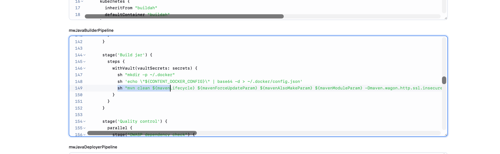

since from slides we know: 

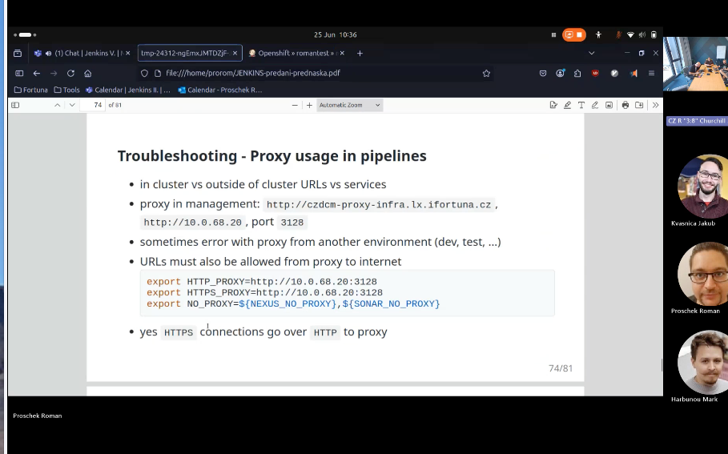


so i modified the pipeline in replay:

```

def call(Map callParams) {

  String appName = callParams.get('APP_NAME')
  String gitUrl = callParams.getOrDefault('GIT_URL', "ssh://app-bitb-shared.o.dc1.cz.ipa.ifortuna.cz:7999/mw/${appName}.git")
  String vaultPath = callParams.getOrDefault('VAULT_PATH', 'jenkins/mw')
  String quayNamespace = callParams.getOrDefault('QUAY_ORG', 'mw')
  String framework = callParams.getOrDefault('FRAMEWORK', 'springboot') //use 'quarkus' for Quarkus based app
  String[] countries = callParams.getOrDefault('COUNTRIES', 'cp,cz,hr,pl,ro,sk').split(',')
  String pipelineAgent = callParams.getOrDefault('AGENT', 'maven-java17')
  String branchName = callParams.getOrDefault('BRANCH', 'master')
  Boolean wantTriggerDeploy = callParams.getOrDefault('TRIGGER_DEPLOY', true)
  Boolean wantMavenDeploy = callParams.getOrDefault('MAVEN_DEPLOY', false)
  String onlyMavenModule = callParams.get('ONLY_MAVEN_MODULE')
  String deployJobName = callParams.getOrDefault('DEPLOY_JOB_NAME', (onlyMavenModule) ? onlyMavenModule : appName)
  String mavenLifecycle = callParams.getOrDefault('MAVEN_LIFECYCLE', 'install')
  Boolean mavenForceUpdate = callParams.getOrDefault('MAVEN_FORCE_UPDATE', false)
  Boolean withNpm = callParams.getOrDefault('WITH_NPM', false)
  Integer timeoutMinutes = callParams.getOrDefault('TIMEOUT_MINUTES', 30)
  String globalsGitUrl = "ssh://app-bitb-shared.o.dc1.cz.ipa.ifortuna.cz:7999/mw/middleware-commons.git"
  String jenkinsFolder = callParams.getOrDefault('JENKINS_FOLDER', 'MW/CS Core Middleware')
  
  def quayRegistryHostname = mwUtils.quayRegistryHostname()
  def quayRegistry = "https://" + quayRegistryHostname
  def quayApiToken = mwUtils.quayApiToken()
  def imageTag = 'UNKNOWN'
  def commitId = ''
  def tagExists = true
  def targetEnv = 'tst'
  List<String> mavenModulesList = []
  if (onlyMavenModule != null) {
    mavenModulesList.add(onlyMavenModule)
  }
  String mavenModuleParam = (onlyMavenModule != null) ? "-pl ${onlyMavenModule}" : ""
  String mavenAlsoMakeParam = (onlyMavenModule != null) ? "-am " : ""
  String mavenForceUpdateParam = mavenForceUpdate ? "-U " : ""
  String sonarModuleParam = mavenModuleParam.length() > 0 ? mavenModuleParam + ",." : ""

  def secrets = [
    [$class: 'VaultSecret', path: vaultPath, secretValues: [
      [$class: 'VaultSecretValue', envVar: 'CONTENT_DOCKER_CONFIG', vaultKey: 'docker-config-new'],
      [$class: 'VaultSecretValue', envVar: 'QUAY_API_TOKEN', vaultKey: quayApiToken]
    ]
    ]
  ]

  pipeline {

    agent {
      kubernetes {
        inheritFrom "${pipelineAgent} dockerindocker"
        defaultContainer "${pipelineAgent}"
      }
    }

    environment {
      HTTP_PROXY = "http://10.8.68.20:3128"
      HTTPS_PROXY = "http://10.8.68.20:3128"
      NO_PROXY = "nexus.svc.ifortuna.cz,0,1,2,3,4,5,6,7,8,9,czdcm-quay.lx.ifortuna.cz,.ux.ifortuna.cz,localhost,127.0.0.1"
      NPM_NEXUS_REGISTRY = "https://nexus.svc.ifortuna.cz/repository/npmjs_org/"
    }

    options {
      timeout(time: timeoutMinutes, unit: 'MINUTES')
      timestamps()
      buildDiscarder(logRotator(numToKeepStr: '10'))
      skipDefaultCheckout()
    }

    stages {
      stage('Clean') {
        steps {
          deleteDir()
        }
      }

      stage('Checkout Source') {
        when {
          not {
            changeRequest()
          }
        }
        steps {
          checkout scm: [$class: 'GitSCM', userRemoteConfigs: [[url: "${gitUrl}", credentialsId: 'bitbucket-global']], branches: [[name: "${env.BRANCH_NAME}"]]], poll: false
          script {
            commitId = sh script: 'git rev-parse --short HEAD', returnStdout: true
            currentBuild.displayName = "${currentBuild.displayName}-${commitId}"
          }
        }
      }

      stage('Checkout Source & Merge PR with target') {
        when {
          changeRequest()
        }
        steps {
          checkout scm: [$class: 'GitSCM', userRemoteConfigs: [[url: "${gitUrl}", credentialsId: 'bitbucket-global', refspec: "pull-requests/${CHANGE_ID}/from", name: "origin"]], branches: [[name: "${env.CHANGE_BRANCH}"]], extensions: [[$class: 'PreBuildMerge', options: [fastForwardMode: 'FF', mergeRemote: 'origin', mergeStrategy: 'DEFAULT', mergeTarget: "${env.CHANGE_TARGET}"]], [$class: 'LocalBranch', localBranch: "${env.CHANGE_TARGET}"]]], poll: false
          script {
            commitId = sh script: 'git rev-parse --short HEAD', returnStdout: true
            currentBuild.displayName = "${currentBuild.displayName}-${commitId}"
          }
        }
      }

      stage('Set logging') {
        steps {
          script {
            dir('external-etc') {
              git credentialsId: 'jenkins-secret-bitbucket', url: globalsGitUrl, branch: "master"
            }

            if (onlyMavenModule == null) {
              //get all maven modules ONLY if ONLY_MAVEN_MODULE param is not provided, otherwise use just single module
              String modules = sh script: 'cat pom.xml | grep "<module>" | sed \'s/\\s*<.*>\\(.*\\)<.*>/\\1/\'\n', returnStdout: true
              String[] mavenModules = modules.split('\n')
              if (mavenModules.length > 0 && mavenModules[0].length() > 0) {
                mavenModulesList = java.util.Arrays.asList(mavenModules)
              }
            }

            (mavenModulesList.size() == 0 ? ['.'] : mavenModulesList).each {
              def targetDir = "${it}/src/main/resources/"
              def targetDirExists = fileExists(targetDir)

              if (framework != "quarkus" && targetDirExists && fileExists('external-etc/logback/logback.xml')) {
                sh "cp external-etc/logback/logback.xml ${targetDir}"
              }

              if (framework == "quarkus" && targetDirExists && fileExists('external-etc/logback/logback-quarkus.xml')) {
                sh "cp external-etc/logback/logback-quarkus.xml ${targetDir}/logback.xml"
              }

              if (framework != "quarkus" && targetDirExists && fileExists('external-etc/logback/logback-spring.xml')) {
                sh "cp external-etc/logback/logback-spring.xml ${targetDir}"
              }

              if (framework != "quarkus" && targetDirExists && fileExists('external-etc/logback-access-spring.xml')) {
                sh "cp external-etc/logback/logback-access-spring.xml ${targetDir}"
              }
            }
          }
        }
      }

      stage('Build jar') {
        steps {
          withVault(vaultSecrets: secrets) {
            sh "mkdir -p ~/.docker"
            sh 'echo \"${CONTENT_DOCKER_CONFIG}\" | base64 -d > ~/.docker/config.json'
            sh '''
            echo "======CURL TO QAY WITH EXPLICIT PROXY AND CLEARED NO_PROXY========"
            HTTP_PROXY=http://10.8.68.20:3128 HTTPS_PROXY=http://10.8.68.20:3128 NO_PROXY= curl -vk --connect-timeout 10 https://czdcm-quay.lx.ifortuna.cz/v2/ || true
            '''
            sh "mvn clean ${mavenLifecycle} ${mavenForceUpdateParam} ${mavenAlsoMakeParam} ${mavenModuleParam} -Dmaven.wagon.http.ssl.insecure=true -Dmaven.wagon.http.ssl.allowall=true -Dmaven.wagon.http.ssl.ignore.validity.dates=true"
          }
        }
      }

      stage('Quality control') {
        parallel {
          stage("OWASP dependency check") {
            steps {
              sh "mvn org.owasp:dependency-check-maven:check ${mavenModuleParam}"
            }
          }

          stage("Sonar") {
            stages {
              stage('SonarQube analysis') {
                when {
                  not {
                    changeRequest()
                  }
                }
                steps {
                  withSonarQubeEnv('sonar-prod') {
                    sh "mvn sonar:sonar ${sonarModuleParam} -Dsonar.branch.name=${env.BRANCH_NAME}"
                  }
                }
              }

              stage('SonarQube analysis PR') {
                when {
                  changeRequest()
                }
                steps {
                  withSonarQubeEnv('sonar-prod') {
                    script {
                      GIT_COMMIT_HASH = sh(script: "git log -n 1 --pretty=format:'%H'", returnStdout: true)
                    }
                    sh "mvn sonar:sonar ${sonarModuleParam} -Dsonar.scm.revision=${GIT_COMMIT_HASH} -Dsonar.pullrequest.key=${env.CHANGE_ID} -Dsonar.pullrequest.branch=${env.CHANGE_BRANCH} -Dsonar.pullrequest.base=${env.CHANGE_TARGET}"
                  }
                }
              }
              stage("Quality Gate") {
                steps {
                  timeout(time: 2, unit: 'MINUTES') {
                    // Just in case something goes wrong, pipeline will be killed after a timeout
                    waitForQualityGate abortPipeline: "true"
                    // Reuse taskId previously collected by withSonarQubeEnv
                  }
                }
              }
            }
          }
        }
      }

      stage('Check Quay image exist') {
        steps {
          withVault(vaultSecrets: secrets) {
            script {
              //imageTag = readMavenPom().getVersion()
              imageTag = sh script: "mvn help:evaluate ${mavenModuleParam} -Dexpression=project.version -q -DforceStdout", returnStdout: true
              def artifactId = deployJobName //sh script: "mvn help:evaluate ${mavenModuleParam} -Dexpression=project.artifactId -q -DforceStdout", returnStdout: true
              def quayRepository = quayNamespace + "/" + artifactId //readMavenPom().getArtifactId()
              echo "Params: imageTag = ${imageTag}, quayRepository = ${quayRepository}"

              if (mwUtils.isUnstableVersion()) {
                echo "Building unstable version (-SNAPSHOT). Overwrite in Quay is allowed."
                tagExists = false
              } else {
                tagExists = quayCheckTagExist(QUAY_REGISTRY: "${quayRegistry}", REPOSITORY: "${quayRepository}", IMAGE_TAG: "${imageTag}", API_TOKEN: "${QUAY_API_TOKEN}")
                echo "Tag exists in Quay: ${tagExists}"
                if (!tagExists && mwUtils.isReleaseCandidateVersion()) {
                  targetEnv = 'stg'
                }
              }
              echo "Branch name: $branchName"
              echo "Image tag: $imageTag"
              echo "Branch name in ENV: ${env.BRANCH_NAME}"
              echo "Target ENV: $targetEnv"
              echo "Tag exists: $tagExists"
            }
          }
        }
      }

      stage('Build and Tag Image') {
        when {
          beforeAgent true
          expression { !tagExists }
          branch "${branchName}"
        }
        steps {
          withVault(vaultSecrets: secrets) {
            script {
              if (withNpm) {
                echo "NPM support is enabled (Agent is '${pipelineAgent}'), setting up NPM registry..."
                sh "mkdir -p ~/.npm/node_modules"
                sh "ln -snfT ~/.npm/node_modules ~/node_modules"
                sh "npm config set registry ${NPM_NEXUS_REGISTRY}"
              }
              sh "mkdir -p ~/.docker"
              sh 'echo \"${CONTENT_DOCKER_CONFIG}\" | base64 -d > ~/.docker/config.json'
              env.EXPIRES_AFTER = mwUtils.isSnapshotVersion() ? "-Djib.container.labels=quay.expires-after=\"30d\"" : ""
              if (framework == "quarkus") {
                env.EXPIRES_AFTER = mwUtils.isSnapshotVersion() ? "-Dquarkus.container-image.labels.\"quay.expires-after\"=\"30d\"" : ""
                //TODO replace hardcoded registry with variable
                env.BUILD_COMMAND = "mvn quarkus:build -Dquarkus.container-image.build=true -Dquarkus.container-image.push=true -Dquarkus.container-image.registry=${quayRegistryHostname} -Dquarkus.container-image.name=${appName} ${EXPIRES_AFTER}"
                //this is another possibility: env.BUILD_COMMAND = "mvn ${mavenModuleParam} -Djib.alwaysCacheBaseImage=true ${EXPIRES_AFTER} install -Dquarkus.container-image.push=true"
              } else {
                env.BUILD_COMMAND = "mvn ${mavenModuleParam} -Djib.alwaysCacheBaseImage=true ${EXPIRES_AFTER} jib:build"
                //env.BUILD_COMMAND = "mvn ${mavenModuleParam} -X -DproxySet=true -Dhttp.proxyHost=czdcm-proxy-infra.lx.ifortuna.cz -Dhttp.proxyPort=3128 -Dhttp.nonProxyHosts=\"*.local|registry.svc.ifortuna.cz\" -Dhttps.nonProxyHosts=\"*.local|registry.svc.ifortuna.cz\" -Dhttps.proxyHost=czdcm-proxy-infra.lx.ifortuna.cz -Dhttps.proxyPort=3128 -DsendCredentialsOverHttp=true -Djib.alwaysCacheBaseImage=true ${EXPIRES_AFTER} jib:build"
              }
            }
            //just for debugging...
            //sh "sleep 30m"
            //sh "export no_proxy='quay-registry-quay-app.quay-shared.svc.cluster.local,registry.svc.ifortuna.cz'"
            //sh "mvn help:effective-pom"
            sh "${BUILD_COMMAND}"
          }
        }
      }

      stage('Trigger Deployment') {
        when {
          beforeAgent true
          expression { !tagExists && wantTriggerDeploy }
          branch "${branchName}"
        }
        steps {
          echo 'Triggering deployment pipelines...'
          script {
            commitId = sh script: 'git rev-parse --short HEAD', returnStdout: true
          }
          echo "Commit ID is ${commitId}"
          script {
            if (wantMavenDeploy) {
              echo "Deploying to Nexus repository..."
              sh "mvn deploy ${mavenModuleParam} -Dmaven.test.skip=true"
            }
            countries.each {
              String jobName = "${jenkinsFolder}/${appName}/deploy-${deployJobName}-${it}"
              echo "Triggering pipeline deploy-${deployJobName}-${it}..."
              build job: jobName,
                parameters: [
                  string(name: 'IMAGE_TAG', value: imageTag),
                  string(name: 'COMMIT_ID', value: commitId),
                  string(name: 'TARGET_ENV', value: targetEnv),
                ],
                wait: false
            }
          }
        }
      }

    }

    post {
      success {
        script {
          if (mavenModulesList.isEmpty()) {
            junit "target/surefire-reports/*.xml"
          } else {
            mavenModulesList.each {
              junit "${it}/target/surefire-reports/*.xml"
            }
          }
        }
      }
    }
  }

}


### Enter the pod or container

```bash
oc rsh <pod-name>
```

If the pod has multiple containers, you may need:

```bash
oc rsh -c <container-name> <pod-name>
```

### Run useful checks

```bash
env | grep -i proxy
getent hosts czdcm-quay.lx.ifortuna.cz
curl -vk https://czdcm-quay.lx.ifortuna.cz/v2/
```

These commands help confirm whether the runtime can:

- see proxy variables
- resolve the registry hostname
- reach the registry over HTTPS

---

## 6. Why this technique works

Many problems appear only inside CI.

Typical differences between local machine and CI agent:

| Developer machine | CI agent |
|---|---|
| local DNS | cluster DNS |
| direct internet | proxy |
| local Docker | shared/runtime container setup |
| open network | restricted network |

That is why it is so valuable to inspect the live Jenkins runtime directly.

Instead of guessing, you observe the real environment.

---

## 7. Optional extra debug command

You can also add this:

```bash
echo "===== NETWORK TEST ====="
getent hosts czdcm-quay.lx.ifortuna.cz || true
```

This quickly checks whether hostname resolution works.

---

## 8. Mental model

This debug block does four simple things:

1. prints environment variables
2. prints DNS configuration
3. prints hostname overrides
4. pauses the pipeline so you can inspect the live agent

That makes it one of the most practical Jenkins debugging techniques when working with OpenShift/Kubernetes agents.


# from videos of roman:

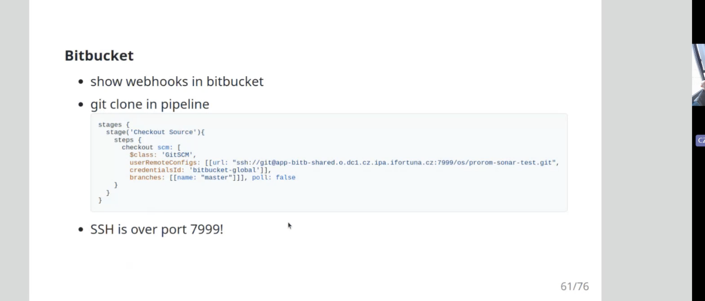