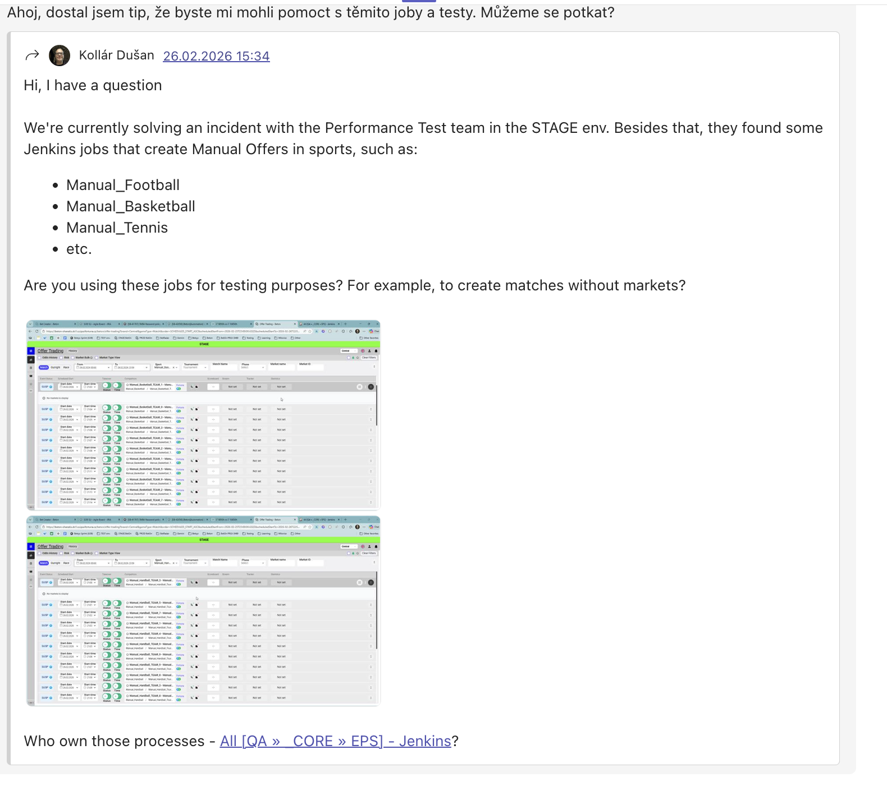
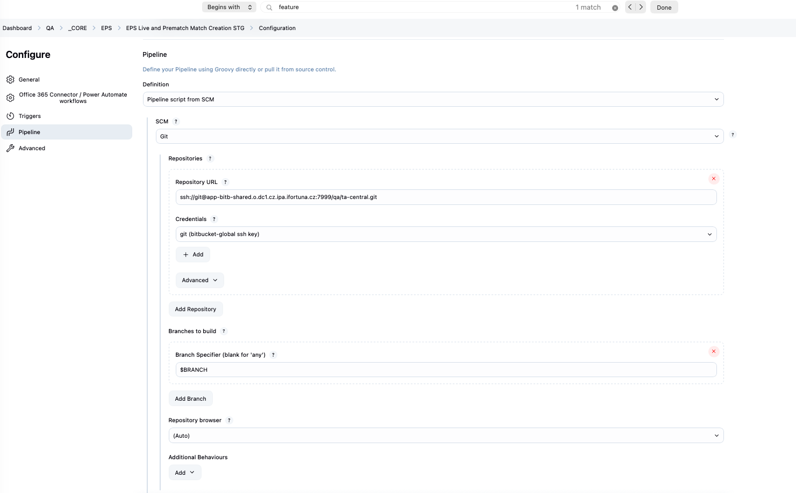
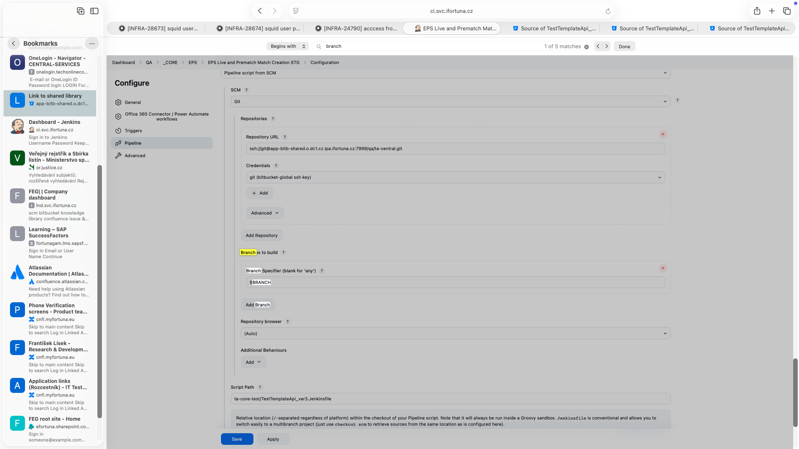
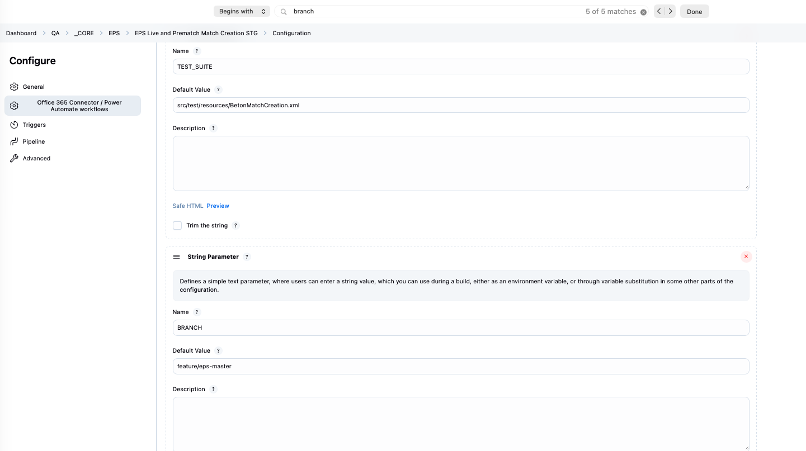
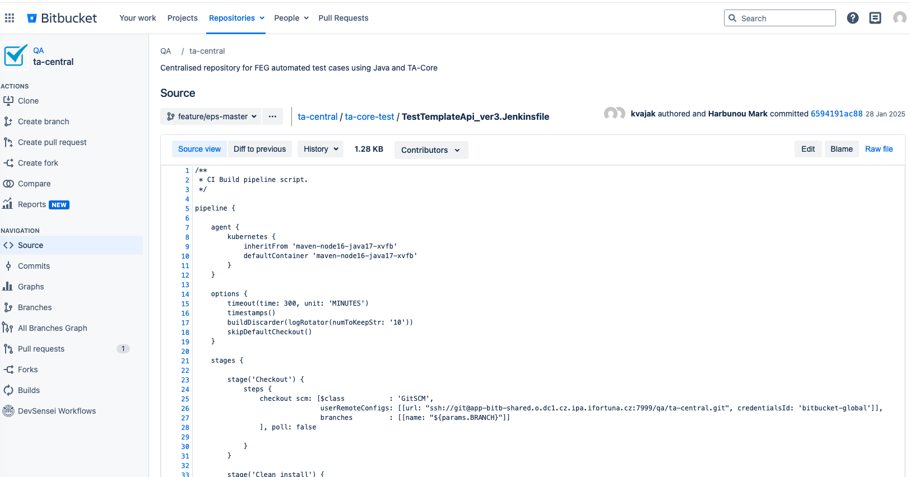
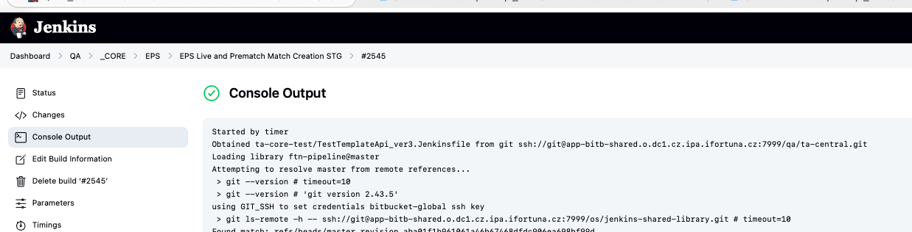
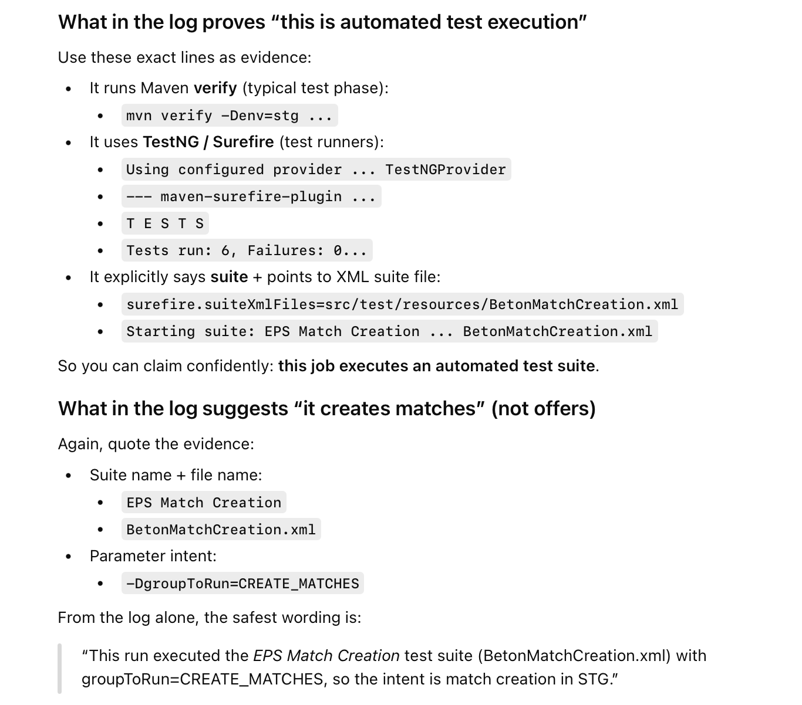
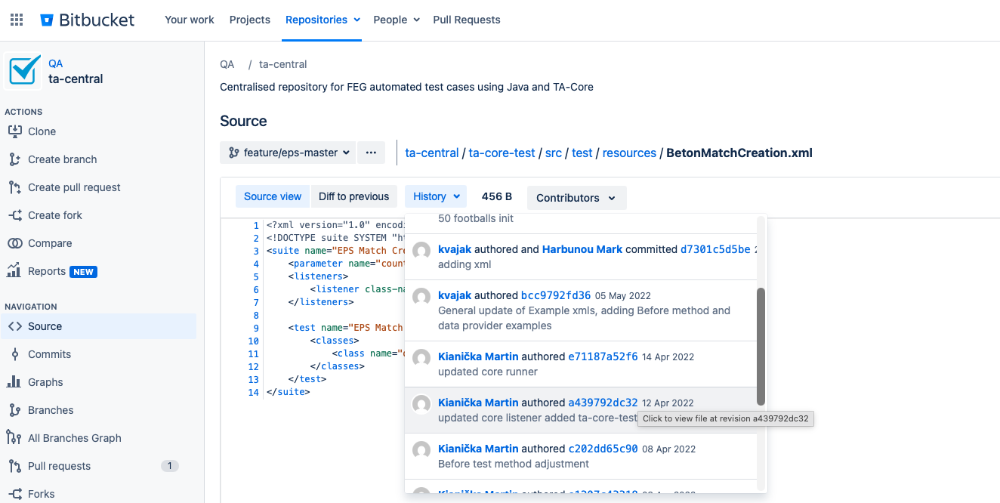

# request:

# find owners in bitbucket

1. i went to this job config and verified the pipeline repo:

2. its qa/ta-central
3. then i checked which branch and script path (location of jenkins file) exactly: 

i can see that its Branch Specifier $BRANCH:

it looks like variable -> on the same page indeed i can see name BRANCH and the value: feature/eps-master:

4. i can go to bitbucket and check who was handling the jenkinsfile (location of it is in script path of job's pipeline)

both people in bitbucket left the company

# check console output of the job

in console output for any build right on the top i can see who triggered the job. in my case its started by timer:

## EPS Live and Prematch Match Creation STG

1) triggered by timer
2) job is test automation that creates matches in STG:

3) based on bitbucket history - nobody from those people are still in the company:

