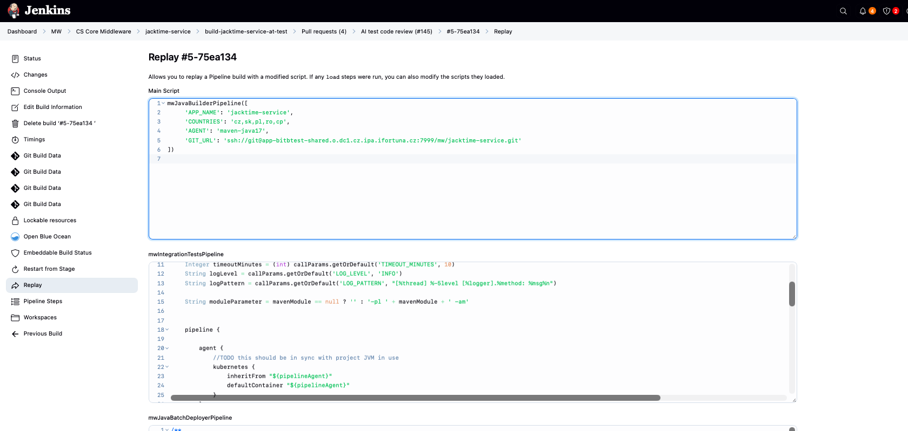
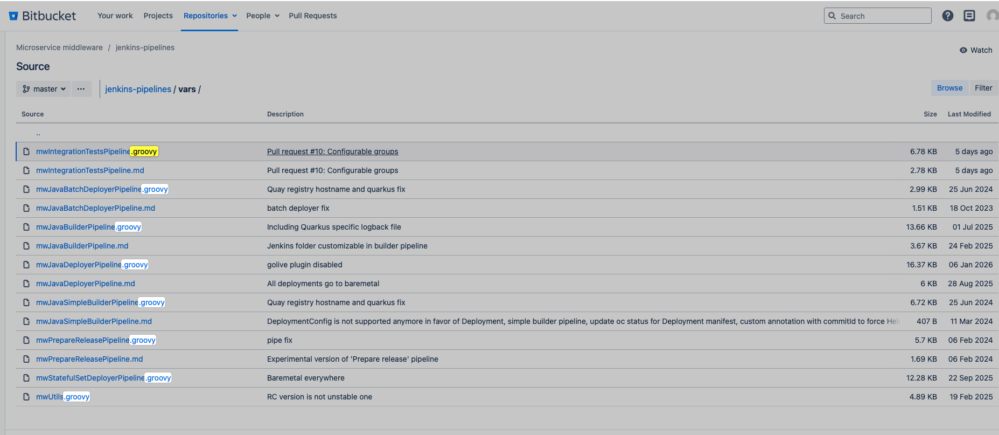
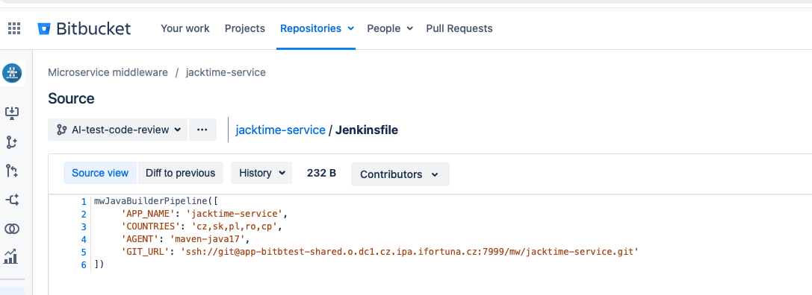
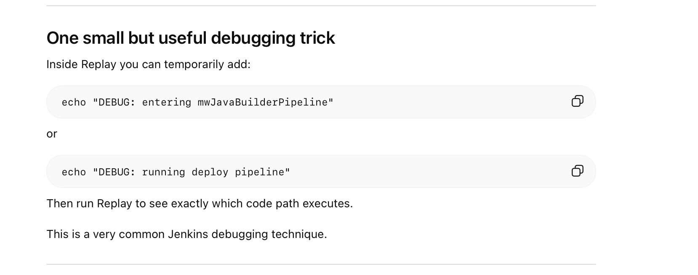

I went to my failed job -> chlicked on the failed build -> Replay:

# Main Script

This is my actual tiny Jenkinsfile.

this is the call into a **shared library function**

During Build Jenkins Loaded multiple scripts from the shared library:

            mwIntegrationTestsPipeline
            mwJavaBatchDeployerPipeline
            mwJavaBuilderPipeline
            mwJavaDeployerPipeline
            mwJavaSimpleBuilderPipeline
            mwPrepareReleasePipeline
            mwStatefulSetDeployerPipeline
            mwUtils

It loaded ALL vars from the indicated shared library:

**So Replay is basically saying:**

“This build started from Main Script, and while running it, these additional Groovy files were also loaded. You may edit them too for this replayed run.”

# Flow

1. Jenkins job starts 
2. Jenkins gets Jenkinsfile
3. Jenkinsfile calls shared library code. Inside the Jenksins file:

4. That script `mwJavaBuilderPipeline` might call other helpers (other vars):

            mwIntegrationTestsPipeline
            mwJavaBatchDeployerPipeline
            mwJavaBuilderPipeline
            mwJavaDeployerPipeline
            mwJavaSimpleBuilderPipeline
            mwPrepareReleasePipeline
            mwStatefulSetDeployerPipeline
            mwUtils

    But Only if hte code ath reaches them. Replay shows ALL of them, cause they were loaded into the runtime, they wered not necessarily executed. 

# Debug trick

# Likeable troubleshooting flow

1. Main Script -> to understand which parameters were passed
2. mwJavaBuilderPipeline -> to understand the real build flow
3. mwUtils -> if the failure is around helper logic, env resolution, OpenShift, Helm, registry, naming

That is usually enough to understand where the failure really comes from.

# Where Replay is good

Replay works best for troubleshooting pipeline code, not external system problems.

It is good when failure is caused by:

        wrong Groovy logic
        wrong condition
        wrong parameter passing
        wrong shell command in pipeline
        missing echo, need debug output

It is less useful when problem is:
        Bitbucket connectivity
        SSH/firewall/DNS
        broken agent image
        missing Jenkins credential
        OpenShift permission issue
        external service unavailable

In those cases Replay can still help by adding debug output, but it does not fix the external root cause.