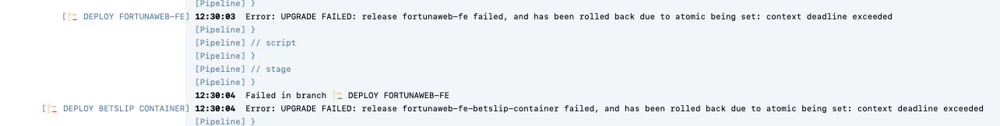

# ISSUE

https://ci.svc.ifortuna.cz/job/WEB/job/fortunaweb-fe/job/Deploy/31234/

1. check the console log. the error:

# Helm Error Explanation: UPGRADE FAILED ... context deadline exceeded
Meaning:
Helm tried to upgrade a release
Release name: fortunaweb-fe
Upgrade failed
--atomic flag is enabled
Helm automatically rolled back to the previous working version
Root reason
context deadline exceeded
→ something took too long and timed out
## Original Error

UPGRADE FAILED: release fortunaweb-fe failed, and has been rolled back due to atomic being set: context deadline exceeded

---

# Simple Explanation

Think of a Helm deployment like updating an application.  
Jenkins triggers Helm to install or update an application running in Kubernetes/OpenShift.

---

# 1. Helm tried to upgrade a release

Helm is a deployment tool for Kubernetes.

A **release** means:

A running application installed in the cluster.

Example:

release name = fortunaweb-fe

This is the **Fortuna Web Frontend application** running in Kubernetes.

Helm tried to **upgrade it to a new version**.

Example flow:

old version running → v1  
pipeline deploys → v2

---

# 2. Upgrade failed

During the update something went wrong.

Helm expected the new version to start successfully, but it didn’t.

Normally Helm waits for:

- pods to start
- containers to run
- readiness checks to pass

Expected behaviour:

new pods start  
containers run
health checks pass

But something prevented that from happening.

---

# 3. --atomic flag is enabled

The deployment was executed with the **atomic flag**.

Meaning:

If deployment fails, Helm automatically restores the previous working version.

Without atomic:

deployment fails  
cluster may stay half-broken

With atomic:

deployment fails  
Helm restores previous working version automatically

---

# 4. Helm rolled back to the previous working version

Example timeline:

Version v1 running successfully  
Pipeline deploys v2  
v2 fails to start  
Helm restores v1 again

So the system should still be running the **previous working version**.

---

# 5. context deadline exceeded

This is the key error.

It simply means:

Helm waited too long for the application to become ready.

Helm usually waits a fixed amount of time (for example 5 minutes).

During this time it waits for:

- pods to start
- containers to run
- readiness probes to pass

If this takes too long:

timeout is reached

Then Helm returns:

context deadline exceeded

Meaning:

Helm waited long enough and stopped the deployment.

---

# 6. Simplified timeline

Jenkins pipeline starts deployment  
↓  
Helm upgrades fortunaweb-fe  
↓  
Kubernetes tries to start new pods  
↓  
Pods fail or start too slowly  
↓  
Helm waits for readiness  
↓  
Timeout reached  
↓  
context deadline exceeded  
↓  
Helm rolls back to previous version

---

# 7. Key takeaway

This error does NOT automatically mean Jenkins is broken.

It usually means:

The application deployment did not become healthy before the Helm timeout.

---

# 8. One sentence summary

Jenkins triggered a Helm deployment of a new version of the application.  
Helm waited for the application to start, it took too long, so Helm cancelled the deployment and restored the previous working version.

# Fix Recap – fortunaweb-fe nginx configuration

## Context

The fix was implemented in:

helm/fortunaweb-fe/nginx.conf

This means the change was made in the **application configuration inside the Helm chart**, not in Jenkins or the pipeline.

The deployment process itself did not change. Instead, the behavior of the **NGINX server inside the application container** was adjusted.

---

# What Was Changed

## 1. Improved gzip compression

Several gzip settings were enabled or refined.

Example configuration:

    gzip on;
    gzip_static on;
    gzip_vary on;
    gzip_proxied any;
    gzip_comp_level 6;

Purpose:

- reduce response size
- improve performance when serving frontend assets (JS, CSS, fonts, etc.)

---

## 2. Added consistent CORS configuration

Multiple NGINX locations now include a shared configuration file:

    include {{ .Values.fortunaweb_fe.nginx.mountBasepath }}/cors-common.conf;

Purpose:

- ensure correct **CORS headers**
- allow frontend assets to be accessed from approved Fortuna domains.

Allowed origins include patterns such as:

- *.ifortuna.cz
- *.ifortuna.sk
- *.efortuna.pl
- *.efortuna.ro

---

## 3. Improved caching for static assets

Static files with hashed filenames now receive strong caching headers.

Example rule pattern:

    location ~* "^/.+-[A-Za-z0-9_-]{8}\.[^/]+$"

Cache header used:

    Cache-Control: public, max-age=86400, stale-while-revalidate=86400, immutable

Purpose:

- browsers can safely cache versioned assets
- improves performance and reduces repeated downloads

These files are safe to cache because their **filename changes when the content changes**.

---

## 4. Disabled caching for remoteEntry.js

A specific rule was added for the file `remoteEntry.js`:

    location ~* "/remoteEntry\.js$"

Cache header:

    Cache-Control: no-cache, no-store, must-revalidate

Purpose:

- force browsers to **always download the newest version** of `remoteEntry.js`.

Why this matters:

`remoteEntry.js` often contains runtime module mappings (for example in microfrontend/module federation setups).  
If browsers cache an old version, the frontend can load **outdated modules after deployment**.

This change ensures the browser always requests the latest version.

---

# Summary

The fix modifies the **application’s NGINX configuration inside the Helm chart**.

Main goals:

- improve gzip compression
- standardize CORS behavior
- allow long caching for versioned static assets
- prevent stale `remoteEntry.js` from breaking the frontend after deployments

This change affects **runtime behavior of the application**, not the Jenkins pipeline.