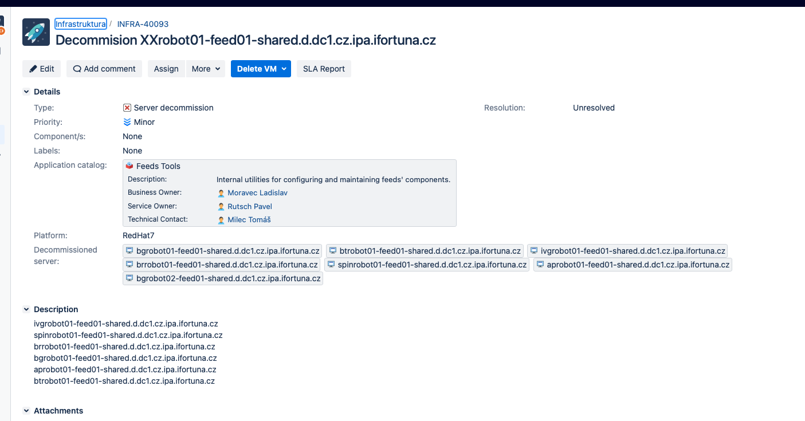
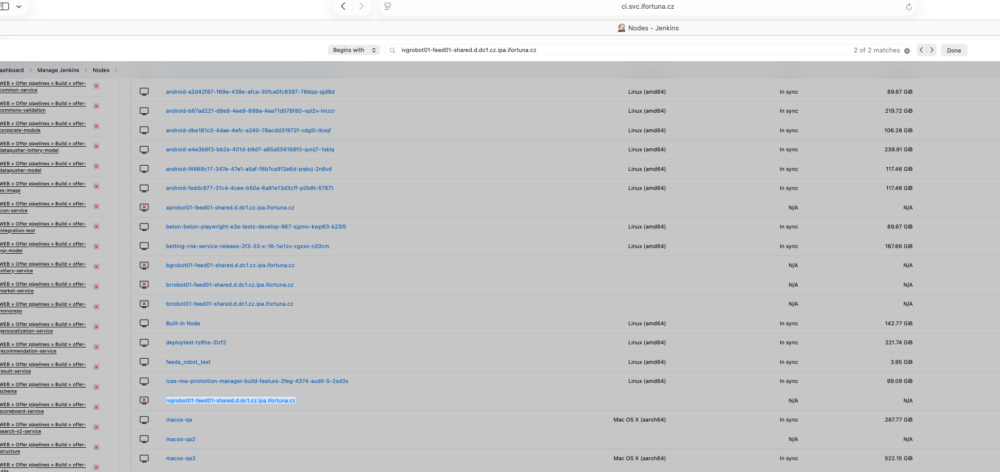
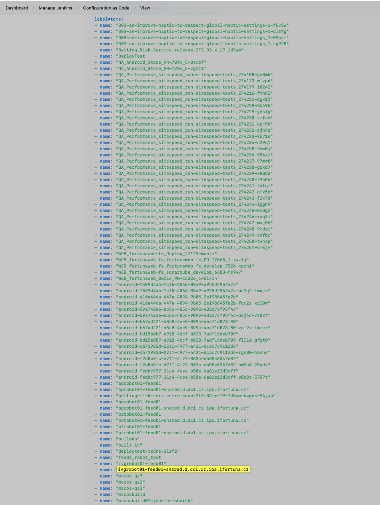
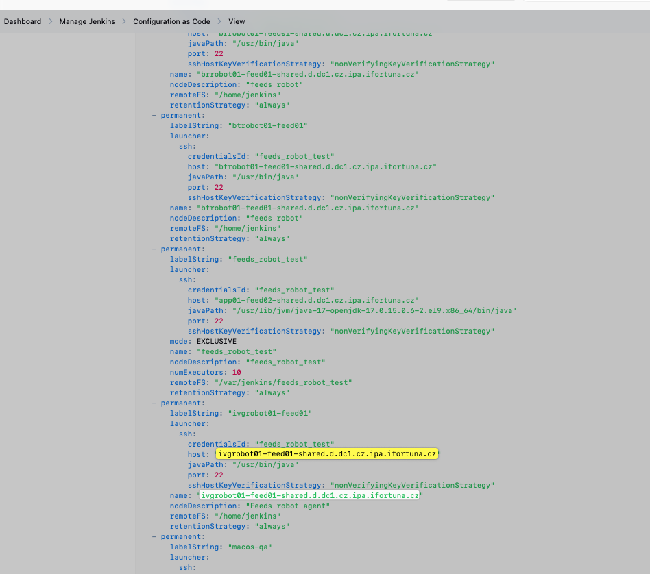

# Ticket: https://jira.myfortuna.eu/browse/INFRA-40093

# servers were decomissioned in this ticket:


# my ticket is to remove agents: https://jira.myfortuna.eu/browse/INFRA-40093

## Explanation of request: 

### 1) Infra ticket = the servers are being retired
The first ticket (“server decommission”) is owned by another team. It lists the robot servers and has status-type updates:
Monitoring disabled → they stopped alerting/metrics for these hosts (so noise doesn’t happen while they shut them down).
Servers stopped, will be decommissioned in two weeks → the machines are already powered off (or services stopped) and will be fully removed soon (DNS/CMDB/VM deletion/etc.).
So: those hosts are dead / going away.

### 2) Your ticket = clean up Jenkins configuration
Tomas Milec created a follow-up ticket assigned to you because Jenkins still has references to those hosts as agents (nodes).
If Jenkins keeps agents like:

        ivgrobot01-feed01-shared...
        spinrobot01-feed01-shared...
        etc.
        plus feeds_robot_test

Then Jenkins will:

        show them offline / failing
        waste time trying to schedule jobs there (depending on labels/restrictions)
        confuse people (looks like an incident, but it’s just old config)

### So my task is: remove Jenkins agents whose names contain robot01-feed01, and also remove feeds_robot_test.


# Safety check prior removal
i can see that all mentioned agents are offline:


# i delete in GUI:


# i delete in Yaml

## in yaml the node is in two places:



**labelAtoms**: Jenkins keeps a global registry of all labels. It just metadata -> remove agents from here

```yaml
labelAtoms:
  - name: "ivgrobot01-feed01-shared.d.dc1.cz.ipa.ifortuna.cz"
```

**-permanent:**: this is actual configuration of the node



Here is actual technical connectionL Jenkins SSHs to this host. Since infra stopped the server -> ssh will never succed and the node will be shown "offline"

```yaml
launcher:
  ssh:
    host: ivgrobot01-feed01-shared.d.dc1.cz.ipa.ifortuna.cz
```

Remove the whole block:

```yaml
- permanent:
      labelString: "ivgrobot01-feed01"
      launcher:
        ssh:
          credentialsId: "feeds_robot_test"
          host: "ivgrobot01-feed01-shared.d.dc1.cz.ipa.ifortuna.cz"
          javaPath: "/usr/bin/java"
          port: 22
          sshHostKeyVerificationStrategy: "nonVerifyingKeyVerificationStrategy"
      name: "ivgrobot01-feed01-shared.d.dc1.cz.ipa.ifortuna.cz"
      nodeDescription: "Feeds robot agent"
      remoteFS: "/home/jenkins"
      retentionStrategy: "always"
```

## workflow for changin yaml:

1) push backup to bitbucket repo: 
```bash
naseka@CZMB94D536 backupFromServer % ssh jenkins-prod "sudo cat /var/lib/jenkins/jenkins.yaml" > jenkins.yaml$(date +-%Y-%m-%d-%H%M%S%N) 
```
2) then ssh to the server and do changes there:

```bash
cd /var/lib/jenkins

cp jenkins.yaml jenkins.yaml.20250602   # backup
vim jenkins.yaml                        # edit
yamllint jenkins.yaml                   # check yaml syntax (optional)
diff jenkins.yaml jenkins.yaml.20250602 # review changes
```

