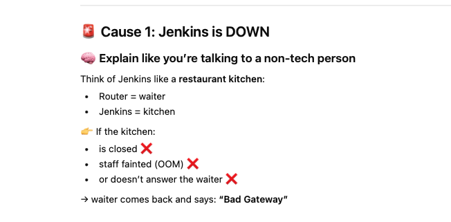
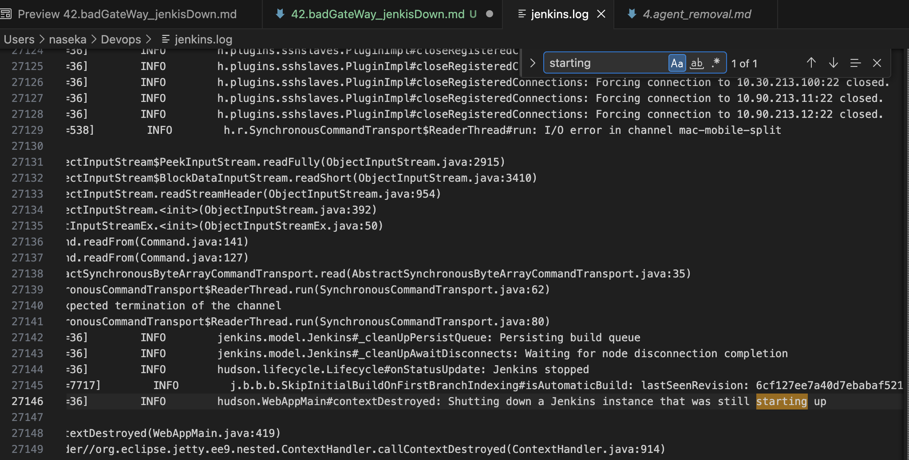
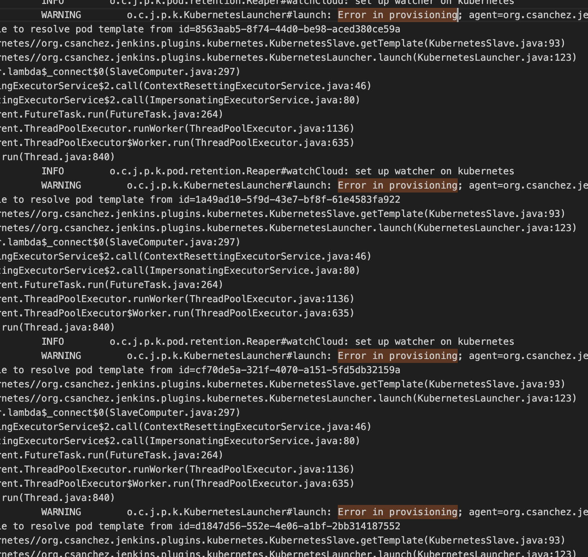
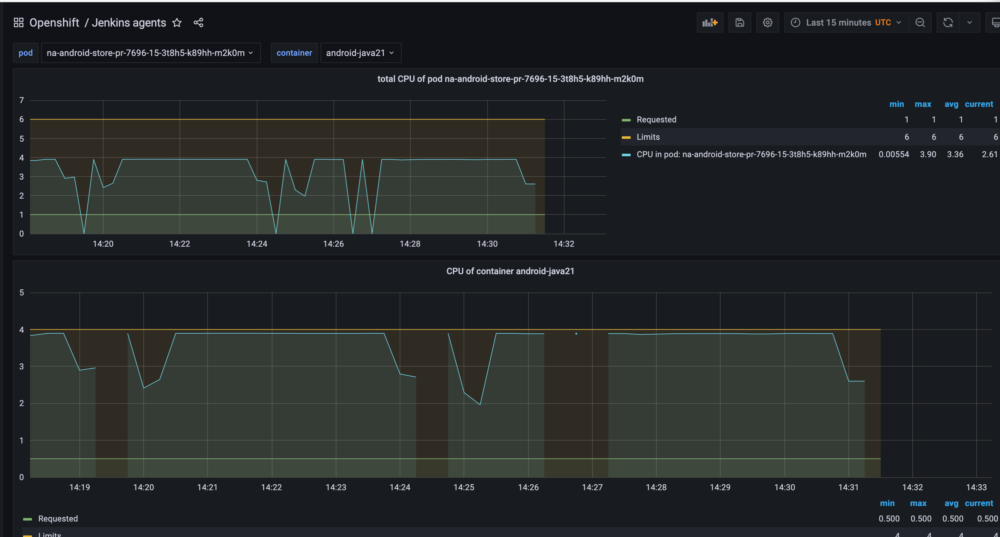
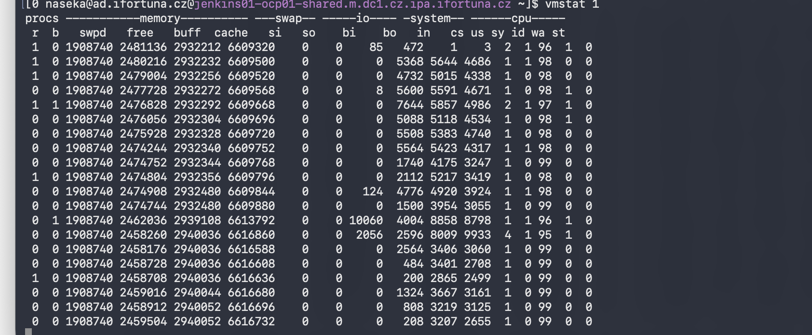
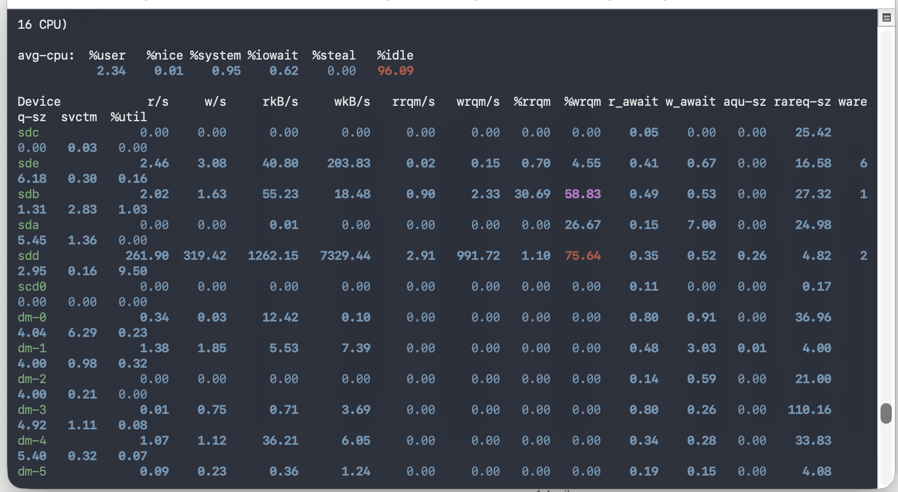

# PROBLEM: 

Hi, can you help me with Jenkins, can't connect there at all

 
502 Bad Gateway
 

## explanation of the error



router = the component that sits between users and Jenkins VM. It receives requests from browser and forwards them to Jenkins.


## check the status of jenkins

```bash
systemctl status jenkins 
```


```bash
[0 naseka@ad.ifortuna.cz@jenkins01-ocp01-shared.m.dc1.cz.ipa.ifortuna.cz ~]$ systemctl status jenkins
● jenkins.service - Jenkins Continuous Integration Server
   Loaded: loaded (/usr/lib/systemd/system/jenkins.service; enabled; vendor preset: disabled)
  Drop-In: /etc/systemd/system/jenkins.service.d
           └─override.conf
   Active: active (running) since Mon 2026-03-30 07:07:13 UTC; 1h 26min ago
 Main PID: 991136 (java)
    Tasks: 334 (limit: 203886)
   Memory: 12.7G
   CGroup: /system.slice/jenkins.service
           └─991136 /usr/bin/java -Dorg.apache.commons.jelly.tags.fmt.timeZone=Europe/Prague -Djava.naming.referral=ignore -Dcom.sun.jndi.ldap.object.disableEndpointIdentification=true -Dhudson.model.DownloadS>
lines 1-10/10 (END)
```

## i have exported the log to the file i created on vm under naseka -> then i copied this vm file to my machiine locally:

```bash
[0 naseka@ad.ifortuna.cz@jenkins01-ocp01-shared.m.dc1.cz.ipa.ifortuna.cz ~]$ sudo systemctl status jenkins
● jenkins.service - Jenkins Continuous Integration Server
   Loaded: loaded (/usr/lib/systemd/system/jenkins.service; enabled; vendor preset: disabled)
  Drop-In: /etc/systemd/system/jenkins.service.d
           └─override.conf
   Active: active (running) since Mon 2026-03-30 07:07:13 UTC; 1h 44min ago
 Main PID: 991136 (java)
    Tasks: 278 (limit: 203886)
   Memory: 13.4G
   CGroup: /system.slice/jenkins.service
           └─991136 /usr/bin/java -Dorg.apache.commons.jelly.tags.fmt.timeZone=Europe/Prague -Djava.naming.referral=ignore -Dcom.sun.jndi.ldap.object.disableEndpointIdentification=true -Dhudson.model.DownloadS>

Mar 30 08:51:40 jenkins01-ocp01-shared.m.dc1.cz.ipa.ifortuna.cz jenkins[991136]:         at org.jenkinsci.plugins.gitclient.RemoteGitImpl$CommandInvocationHandler$GitCommandMasterToSlaveCallable.call(RemoteGit>
Mar 30 08:51:40 jenkins01-ocp01-shared.m.dc1.cz.ipa.ifortuna.cz jenkins[991136]:         at hudson.remoting.UserRequest.perform(UserRequest.java:211)
Mar 30 08:51:40 jenkins01-ocp01-shared.m.dc1.cz.ipa.ifortuna.cz jenkins[991136]:         at hudson.remoting.UserRequest.perform(UserRequest.java:54)
Mar 30 08:51:40 jenkins01-ocp01-shared.m.dc1.cz.ipa.ifortuna.cz jenkins[991136]:         at hudson.remoting.Request$2.run(Request.java:377)
Mar 30 08:51:40 jenkins01-ocp01-shared.m.dc1.cz.ipa.ifortuna.cz jenkins[991136]:         at hudson.remoting.InterceptingExecutorService.lambda$wrap$0(InterceptingExecutorService.java:78)
Mar 30 08:51:40 jenkins01-ocp01-shared.m.dc1.cz.ipa.ifortuna.cz jenkins[991136]:         at java.base/java.util.concurrent.FutureTask.run(FutureTask.java:264)
Mar 30 08:51:40 jenkins01-ocp01-shared.m.dc1.cz.ipa.ifortuna.cz jenkins[991136]:         at java.base/java.util.concurrent.ThreadPoolExecutor.runWorker(ThreadPoolExecutor.java:1136)
Mar 30 08:51:40 jenkins01-ocp01-shared.m.dc1.cz.ipa.ifortuna.cz jenkins[991136]:         at java.base/java.util.concurrent.ThreadPoolExecutor$Worker.run(ThreadPoolExecutor.java:635)
Mar 30 08:51:40 jenkins01-ocp01-shared.m.dc1.cz.ipa.ifortuna.cz jenkins[991136]:         at hudson.remoting.Engine$1.lambda$newThread$0(Engine.java:137)
Mar 30 08:51:40 jenkins01-ocp01-shared.m.dc1.cz.ipa.ifortuna.cz jenkins[991136]:         at java.base/java.lang.Thread.run(Thread.java:840)
[0 naseka@ad.ifortuna.cz@jenkins01-ocp01-shared.m.dc1.cz.ipa.ifortuna.cz ~]$ sudo journalctl -u jenkins --since "3 hours ago" -o short-iso > /tmp/jenkins.log
[0 naseka@ad.ifortuna.cz@jenkins01-ocp01-shared.m.dc1.cz.ipa.ifortuna.cz ~]$ pwd
/home/ad.ifortuna.cz/naseka
[0 naseka@ad.ifortuna.cz@jenkins01-ocp01-shared.m.dc1.cz.ipa.ifortuna.cz ~]$ ls -lh /tmp/jenkins.log
-rw-rw-r-- 1 naseka@ad.ifortuna.cz naseka@ad.ifortuna.cz 182M Mar 30 08:52 /tmp/jenkins.log
[0 naseka@ad.ifortuna.cz@jenkins01-ocp01-shared.m.dc1.cz.ipa.ifortuna.cz ~]$ exit
logout
Connection to jenkins01-ocp01-shared.m.dc1.cz.ipa.ifortuna.cz closed.
naseka@CZMB94D536 backupFromServer % pwd                               
/Users/naseka/Devops/ocp4-jenkins-agents-service/backupFromServer
naseka@CZMB94D536 backupFromServer % cd /Users/naseka/Devops
naseka@CZMB94D536 Devops % scp jenkins-prod:/tmp/jenkins.log .
jenkins.log                                                                                                                                                                     100%  182MB   5.9MB/s   00:30    
naseka@CZMB94D536 Devops % 
```
## opened file in vs codels

## searched logs

### searched for word "starting"

found out when roman restarted jenkins:



```bash
2026-03-30T07:06:27+0000 jenkins01-ocp01-shared.m.dc1.cz.ipa.ifortuna.cz jenkins[982707]: 2026-03-30 07:06:27.500+0000 [id=36]        INFO        hudson.WebAppMain#contextDestroyed: Shutting down a Jenkins instance that was still starting up
```

+0000 means its UTC (coordinated universal time) -> we are GMT+2 -> so retart happended at 07:06 + 2 hours -> 09:06 prague time


### took all log before and started exploring:

Then search by keywords
In your local log file, search for:
ERROR
Exception
SEVERE
OutOfMemory
Jenkins stopped
Shutting down
Failed

### then i found this security error many times:
```bash
WARNING hudson.model.RunMap#retrieve: could not load /var/lib/jenkins/jobs/QA/jobs/_CORE/jobs/ta-central/branches/task-SB-2.elrvct55ap9v.le-tennis/builds/3 2026-03-30T06:16:28+0000 jenkins01-ocp01-shared.m.dc1.cz.ipa.ifortuna.cz jenkins[7602]: com.thoughtworks.xstream.security.InputManipulationException: Denial of Service attack assumed. Adding elements to collections or maps exceeds 5 seconds. 2026-03-30T06:16:28+0000 jenkins01-ocp01-shared.m.dc1.cz.ipa.ifortuna.cz jenkins[7602]: at hudson.util.XStream2SecurityUtils.checkForCollectionDoSAttack(XStream2SecurityUtils.java:54) 2026-03-30T06:16:28+0000 jenkins01-ocp01-shared.m.dc1.cz.ipa.ifortuna.cz jenkins[7602]: at hudson.util.RobustCollectionConverter.populateCollection(RobustCollectionConverter.java:129) 2026-03-30T06:16:28+0000 jenkins01-ocp01-shared.m.dc1.cz.ipa.ifortuna.cz jenkins[7602]: Caused: jenkins.util.xstream.CriticalXStreamException:
```

Jenkins controller was broadly struggling to deserialize many build records, and its XStream safety protection was firing repeatedly. 

Simple analogy:

Jenkins is opening saved documents
the reader says: "this file format looks suspicious or broken"
and keeps refusing to load it
Usually this happens because of things like:

corrupted build files
old plugin data no longer matching current Jenkins/plugin versions
removed or changed classes after upgrades
unsafe data Jenkins now refuses to load
So the full sentence really means:

Jenkins had trouble reading lots of saved build history
its security checks kept stopping that data from loading

i exported the logs and this security exception triggers every time when parsing takes too long, so i guess jenkins then assumes it might be dangerous and aborts. 

### running pods there was this -> huge load for jenkins -> all those pods from beton pipelines:

```bash
oc get pods -n <namespace>
```

beton-backfeg-ui-1-16-28-5-5jjtj-pvvpw-11q3x                      3/3     Running       0          37h
beton-backfeg-ui-1-16-28-5-5jjtj-pvvpw-6wgth                      3/3     Running       0          36h
beton-backfeg-ui-pr-262-1-drnt1-v8lvq-4hn0t                       3/3     Running       0          36h
beton-backfeg-ui-pr-262-1-drnt1-v8lvq-k9v9n                       3/3     Running       0          37h
beton-backfeg-ui-pr-262-1-drnt1-v8lvq-slm6d                       3/3     Running       0          37h
beton-beton-fe-pr-1524-4-w77sd-0ps5w-vs81f                        3/3     Running       0          36h
beton-beton-fe-pr-1524-4-w77sd-0ps5w-xwm22                        3/3     Running       0          37h
beton-beton-fe-pr-1524-4-w77sd-0ps5w-znj8z                        3/3     Running       0          37h
beton-beton-fe-pr-1530-2-7gb8m-60xvw-b8w4p                        3/3     Running       0          37h
beton-beton-fe-pr-1530-2-7gb8m-60xvw-pj52t                        3/3     Running       0          36h
beton-beton-fe-pr-1530-2-7gb8m-60xvw-rdz4n                        3/3     Running       0          36h
beton-beton-fe-pr-1530-2-7gb8m-60xvw-wjhpl                        3/3     Running       0          37h
beton-beton-playwright-e2e-tests-pr-1524-5-b2djq-0trsx-6r0kj      2/2     Running       0          37h
beton-beton-playwright-e2e-tests-pr-1524-5-b2djq-0trsx-9ww2l      2/2     Running       0          36h
beton-beton-playwright-e2e-tests-pr-1524-5-b2djq-0trsx-c7d0q      2/2     Running       0          36h
beton-beton-playwright-e2e-tests-pr-1524-5-b2djq-0trsx-dssfv      2/2     Running       0          36h
beton-beton-playwright-e2e-tests-pr-1524-5-b2djq-0trsx-t2dtw      2/2     Running       0          35h
beton-beton-playwright-e2e-tests-pr-1530-1-04047-vvp28-1d3cx      2/2     Running       0          37h
beton-beton-playwright-e2e-tests-pr-1530-1-04047-vvp28-1k9zk      2/2     Running       0          36h
beton-beton-playwright-e2e-tests-pr-1530-1-04047-vvp28-t6sjl      2/2     Running       0          36h
beton-tools-syncroutestokeycloak-5256-0vktb-dpmzt-096cr           2/2     Terminating   0          15s
beton-tools-syncroutestokeycloak-5256-0vktb-dpmzt-9pcb2           2/2     Running       0          37h
beton-tools-syncroutestokeycloak-5256-0vktb-dpmzt-gx2f6           2/2     Running       0          36h
beton-tools-syncroutestokeycloak-5256-0vktb-dpmzt-t3kq3           2/2     Running       0          36h
beton-tools-syncroutestokeycloak-5257-880hc-4txgh-1xch5           2/2     Running       0          37h
beton-tools-syncroutestokeycloak-5257-880hc-4txgh-fj8rd           2/2     Running       0          37h
beton-tools-syncroutestokeycloak-5257-880hc-4txgh-mbll0           0/2     Pending       0          95s
beton-tools-syncroutestokeycloak-5257-880hc-4txgh-rbckw           2/2     Running       0          36h
beton-tools-syncroutestokeycloak-5257-880hc-4txgh-zlstp           2/2     Running       0          36h
beton-tools-syncroutestokeycloak-5258-02xqt-3nsqv-1d8p3           2/2     Running       0          36h
beton-tools-syncroutestokeycloak-5259-tg8p2-qkk76-n3zqc           2/2     Running       0          36h
beton-tools-syncroutestokeycloak-5259-tg8p2-qkk76-qm8c1           2/2     Running       0          37h
beton-tools-syncroutestokeycloak-5259-tg8p2-qkk76-qwxns           2/2     Running       0          36h
beton-tools-syncroutestokeycloak-5260-3v2xb-h6qjr-qjcq6           2/2     Running       0          36h
beton-tools-syncroutestokeycloak-5261-kh61n-4kwdb-6vfsz           2/2     Running       0          36h
beton-tools-syncroutestokeycloak-5261-kh61n-4kwdb-8sk1k           2/2     Running       0          36h
beton-tools-syncroutestokeycloak-5261-kh61n-4kwdb-wt7hk           2/2     Running       0          37h
beton-tools-syncroutestokeycloak-5262-t1886-6zs96-1ggdz           2/2     Running       0          36h
beton-tools-syncroutestokeycloak-5262-t1886-6zs96-d5k8w           2/2     Running       0          36h
beton-tools-syncroutestokeycloak-5262-t1886-6zs96-x7s8j           2/2     Running       0          36h
beton-tools-syncroutestokeycloak-5263-lpc5f-3t6ct-55196           2/2     Running       0          36h
beton-tools-syncroutestokeycloak-5264-l5txz-q3t26-81k57           2/2     Running       0          37h
beton-tools-syncroutestokeycloak-5264-l5txz-q3t26-dv0q8           2/2     Running       0          37h
beton-tools-syncroutestokeycloak-5264-l5txz-q3t26-n7kq5           2/2     Running       0          36h
beton-tools-syncroutestokeycloak-5266-z7kvm-x1gp7-nwxmj           2/2     Running       0          35h
beton-tools-syncroutestokeycloak-5266-z7kvm-x1gp7-pbfqt           2/2     Running       0          37h
beton-tools-syncroutestokeycloak-5266-z7kvm-x1gp7-tgdzv           2/2     Running       0          36h
beton-tools-syncroutestokeycloak-5266-z7kvm-x1gp7-xp3n5           2/2     Running       0          37h
beton-tools-syncroutestokeycloak-5267-cr4b8-7x3w5-m919g           2/2     Running       0          36h
beton-tools-syncroutestokeycloak-5267-cr4b8-7x3w5-qztlk           2/2     Running       0          37h
beton-tools-syncroutestokeycloak-5267-cr4b8-7x3w5-zj5kv           0/2     Pending       0          36h
beton-tools-syncroutestokeycloak-5268-n4474-l05cf-np26f           2/2     Running       0          37h
beton-tools-syncroutestokeycloak-5269-1kb8h-ph7vh-5nttk           2/2     Running       0          36h
beton-tools-syncroutestokeycloak-5270-7hkmx-8gx20-05lc3           2/2     Running       0          36h
beton-tools-syncroutestokeycloak-5270-7hkmx-8gx20-5djv7           2/2     Running       0          36h
beton-tools-syncroutestokeycloak-5270-7hkmx-8gx20-l9cxv           2/2     Running       0          37h
beton-tools-syncroutestokeycloak-5270-7hkmx-8gx20-v1txf           2/2     Running       0          37h
beton-tools-syncroutestokeycloak-5271-zh4q8-rjd32-0d9wr           2/2     Running       0          36h
beton-tools-syncroutestokeycloak-5271-zh4q8-rjd32-z83zv           2/2     Running       0          36h
beton-tools-syncroutestokeycloak-5272-x0f5m-xw12r-nvzln           2/2     Running       0          36h
beton-tools-syncroutestokeycloak-5272-x0f5m-xw12r-r5rnv           0/2     Pending       0          35h
beton-tools-syncroutestokeycloak-5272-x0f5m-xw12r-sphw7           2/2     Running       0          36h
beton-tools-syncroutestokeycloak-5272-x0f5m-xw12r-tw2pl           2/2     Running       0          36h
beton-tools-syncroutestokeycloak-5273-10bfj-cwlcf-zz14j           2/2     Running       0          36h
beton-tools-syncwithmr-5245-5qcbd-2kmvn-3mgrh                     2/2     Running       0          36h
beton-tools-syncwithmr-5245-5qcbd-2kmvn-5srx2                     2/2     Running       0          37h
beton-tools-syncwithmr-5246-xgnrp-wlwkb-94dtw                     2/2     Running       0          35h
beton-tools-syncwithmr-5246-xgnrp-wlwkb-9r538                     2/2     Running       0          37h
beton-tools-syncwithmr-5246-xgnrp-wlwkb-p24qd                     2/2     Running       0          36h
beton-tools-syncwithmr-5246-xgnrp-wlwkb-td44w                     2/2     Running       0          37h
beton-tools-syncwithmr-5246-xgnrp-wlwkb-z329f                     2/2     Running       0          36h
beton-tools-syncwithmr-5247-0v85j-nr9n3-6525r                     2/2     Running       0          36h
beton-tools-syncwithmr-5247-0v85j-nr9n3-cscdg                     2/2     Running       0          37h
beton-tools-syncwithmr-5247-0v85j-nr9n3-xkjfh                     0/2     Pending       0          35h
beton-tools-syncwithmr-5248-8bxlx-nns9l-5hwbl                     0/2     Pending       0          35h
beton-tools-syncwithmr-5248-8bxlx-nns9l-5nk59                     2/2     Running       0          36h
beton-tools-syncwithmr-5248-8bxlx-nns9l-87sf0                     2/2     Running       0          36h
beton-tools-syncwithmr-5248-8bxlx-nns9l-ns21k                     2/2     Running       0          37h
beton-tools-syncwithmr-5249-8zbkm-vnhp6-7n58w                     2/2     Running       0          36h
beton-tools-syncwithmr-5250-cn6jz-cc758-dmq53                     2/2     Running       0          36h
beton-tools-syncwithmr-5250-cn6jz-cc758-m36jf                     2/2     Running       0          36h
beton-tools-syncwithmr-5250-cn6jz-cc758-pl8jx                     2/2     Running       0          37h
beton-tools-syncwithmr-5250-cn6jz-cc758-tncmk                     2/2     Running       0          35h
beton-tools-syncwithmr-5251-vqpsr-3xswp-z8d39                     2/2     Running       0          36h
beton-tools-syncwithmr-5252-cwwtb-897x7-4j0v5                     2/2     Running       0          36h
beton-tools-syncwithmr-5252-cwwtb-897x7-9ggzb                     2/2     Running       0          36h
beton-tools-syncwithmr-5253-xc20n-3nlrv-3jgtq                     2/2     Running       0          36h
beton-tools-syncwithmr-5253-xc20n-3nlrv-f8d5k                     2/2     Running       0          36h
beton-tools-syncwithmr-5253-xc20n-3nlrv-grmn9                     2/2     Running       0          37h
beton-tools-syncwithmr-5254-ktzv3-hdr6c-2lphd                     2/2     Running       0          36h
beton-tools-syncwithmr-5254-ktzv3-hdr6c-49tz6                     2/2     Running       0          37h
beton-tools-syncwithmr-5254-ktzv3-hdr6c-pcbb4                     2/2     Running       0          37h
beton-tools-syncwithmr-5255-wqf98-dx52c-7c821                     2/2     Running       0          37h
beton-tools-syncwithmr-5255-wqf98-dx52c-cgfpd                     2/2     Running       0          37h
beton-tools-syncwithmr-5255-wqf98-dx52c-zz84t                     2/2     Running       0          36h
beton-tools-syncwithmr-5256-f4kls-x24fb-24ssz                     0/2     Pending       0          35h
beton-tools-syncwithmr-5256-f4kls-x24fb-4q1m1                     2/2     Running       0          36h
beton-tools-syncwithmr-5256-f4kls-x24fb-b9xcl                     2/2     Running       0          37h
beton-tools-syncwithmr-5257-b9nxt-vx22f-65187                     0/2     Pending       0          36h
beton-tools-syncwithmr-5257-b9nxt-vx22f-f2ps4                     0/2     Pending       0          35h
beton-tools-syncwithmr-5257-b9nxt-vx22f-w6zv2                     2/2     Running       0          37h
beton-tools-syncwithmr-5258-b7brs-lwdcz-49zv0                     0/2     Pending       0          36h
beton-tools-syncwithmr-5258-b7brs-lwdcz-v3qxf                     2/2     Running       0          36h
beton-tools-syncwithmr-5259-qjgxg-qsh7s-03gj7                     2/2     Running       0          36h
beton-tools-syncwithmr-5259-qjgxg-qsh7s-8n963                     2/2     Running       0          37h
beton-tools-syncwithmr-5259-qjgxg-qsh7s-mpt9x                     2/2     Running       0          37h
beton-tools-syncwithmr-5259-qjgxg-qsh7s-vp3l8                     2/2     Running       0          36h
beton-tools-syncwithmr-5260-wzz3n-6d7c5-2xp0p                     2/2     Running       0          36h
beton-tools-syncwithmr-5260-wzz3n-6d7c5-kc60g                     2/2     Running       0          36h
beton-tools-syncwithmr-5261-rnd1b-6xhn3-hr1sc                     0/2     Pending       0          36h

### Misa deleted old hanging pods (within openshift) and build are now running

A common flow is:

```bash
oc get pods -n <namespace>
oc delete pod <pod-name> -n <namespace>
```
Important:

* deleting a pod usually does not delete the whole application
* if the pod is managed by a Deployment, Job, or similar controller, OpenShift may recreate it automatically
* if these were just hanging leftover build/pipeline pods, deleting them can free resources and let builds run again

### in the log i see thousands of error in provisioning in the log:



Jenkins was trying to start Kubernetes/OpenShift agent pods for Beton jobs, but when it tried to launch them, it could not find the pod template definition it expected.

# Monitoring with Grafana

Grafana dashboards help track:

- CPU spikes
- memory usage
- agent failures

_IT term: Grafana = tool for visualization of metrics._

Helpful for:

- diagnosing memory problems
- deciding resource increases

Example:

- find pod name in Jenkins log
- search it in Grafana
- view historical graph

# Troubleshooting - CPU and RAM usage of agents

- https://grafana-thanos-shared.apps.ocp01-shared.m.dc1.cz.ipa.ifortuna.cz/d/OdFOFFNIk/jenkins-agents?orgId=1&from=1747659691680&to=1747660591680
- select time and refresh page
- select pod
- select container

---

# checking memory spikes

in jenkins log i found out when OOM error started happening and based on that filtered grafana:


## i can check the logs on controller for the time around OOM for all pods and find out name of pods:

```bash
sudo journalctl -u jenkins --since "2026-03-31 11:30:00" --until "2026-03-31 13:30:00" -o short-iso | grep 'Created Pod: kubernetes jenkins-shared/'
```

i found out that for some time no pods were created (so its the time of crash exactly):


## now i want to find top pod-creatig job famillies before the crash:

```bash
sudo journalctl -u jenkins --since "2026-03-31 11:30:00" --until "2026-03-31 12:10:00" -o short-iso | grep 'Created Pod: kubernetes jenkins-shared/' | sed 's/.*jenkins-shared\///' | awk -F- '{NF-=2; print $0}' OFS="-" | sort | uniq -c | sort -nr | head -20
```
result:

```bash
[0 naseka@ad.ifortuna.cz@jenkins01-ocp01-shared.m.dc1.cz.ipa.ifortuna.cz ~]$ sudo journalctl -u jenkins --since "2026-03-31 11:30:00" --until "2026-03-31 12:10:00" -o short-iso | grep 'Created Pod: kubernetes jenkins-shared/' | sed 's/.*jenkins-shared\///' | awk -F- '{NF-=2; print $0}' OFS="-" | sort | uniq -c | sort -nr | head -20
      8 ifier-sb-41925-springboot-4-uplift-analysis-with-cursor
      7 orter-sb-41925-springboot-4-uplift-analysis-with-cursor
      4 rvice-sb-41925-springboot-4-uplift-analysis-with-cursor
      4 ore-middleware-data-shovel-build-data-shovel-fix-master
      3 ation-an-validate-coverage-reports-from-nighlty-builds
      2 tting--deployment-pipelines-betting-backoffice-service
      2 isher-sb-41925-springboot-4-uplift-analysis-with-cursor
      2 b-services-mw-promotion-manager-build-bugfix-2feg-5160
      1 xeps-integration-sonarqube-offer-pairing-service-pr-937
      1 xbuild-jacktime-service-feature-2fpa-12121-mls-unsettle
      1 x-all-sb-41925-springboot-4-uplift-analysis-with-cursor
      1 wp-platform-deploy-919-xc52k
      1 wp-platform-deploy-918-9d4mb
      1 wp-platform-build-pr-551-5-2c2z3
      1 wp-platform-build-pr-551-4-0mdp4
      1 wp-platform-build-fix-bonus-perf-5-2mmpn
      1 web-fortunaweb-fe-sonarqube-release-2f4-39-100-27-rgllc
      1 web-fortunaweb-fe-sonarqube-develop-7406-bbnct
      1 web-fortunaweb-fe-fortunaweb-fe-release-2f4-39-100-28
      1 web-fortunaweb-fe-fortunaweb-fe-pr-13770-1-m85d8
[0 naseka@ad.ifortuna.cz@jenkins01-ocp01-shared.m.dc1.cz.ipa.ifortuna.cz ~]$ 

```

### so the job families with this are the main contributors before the crash: 

sb-41925-springboot-4-uplift-analysis-with-cursor

## now i would get the full pod names of this springboot uplift analysis

```bash
sudo journalctl -u jenkins -l --since "2026-03-31 11:30:00" --until "2026-03-31 12:10:00" -o short-iso | grep 'Created Pod: kubernetes jenkins-shared/' | grep 'sb-41925-springboot-4-uplift-analysis-with-cursor'
```

```bash
[0 naseka@ad.ifortuna.cz@jenkins01-ocp01-shared.m.dc1.cz.ipa.ifortuna.cz ~]$ sudo journalctl -u jenkins -l --since "2026-03-31 11:30:00" --until "2026-03-31 12:10:00" -o short-iso | grep 'Created Pod: kubernetes jenkins-shared/' | grep 'sb-41925-springboot-4-uplift-analysis-with-cursor'
2026-03-31T11:58:51+0000 jenkins01-ocp01-shared.m.dc1.cz.ipa.ifortuna.cz jenkins[1187]: 2026-03-31 11:58:51.262+0000 [id=775363]        INFO        o.c.j.p.k.KubernetesLauncher#launch: Created Pod: kubernetes jenkins-shared/x-all-sb-41925-springboot-4-uplift-analysis-with-cursor-3-2qchj
2026-03-31T11:59:10+0000 jenkins01-ocp01-shared.m.dc1.cz.ipa.ifortuna.cz jenkins[1187]: 2026-03-31 11:59:10.259+0000 [id=773665]        INFO        o.c.j.p.k.KubernetesLauncher#launch: Created Pod: kubernetes jenkins-shared/ifier-sb-41925-springboot-4-uplift-analysis-with-cursor-3-4f882
2026-03-31T11:59:10+0000 jenkins01-ocp01-shared.m.dc1.cz.ipa.ifortuna.cz jenkins[1187]: 2026-03-31 11:59:10.312+0000 [id=756375]        INFO        o.c.j.p.k.KubernetesLauncher#launch: Created Pod: kubernetes jenkins-shared/orter-sb-41925-springboot-4-uplift-analysis-with-cursor-3-l7hr5
2026-03-31T11:59:10+0000 jenkins01-ocp01-shared.m.dc1.cz.ipa.ifortuna.cz jenkins[1187]: 2026-03-31 11:59:10.331+0000 [id=783506]        INFO        o.c.j.p.k.KubernetesLauncher#launch: Created Pod: kubernetes jenkins-shared/ifier-sb-41925-springboot-4-uplift-analysis-with-cursor-3-qhpnq
2026-03-31T11:59:10+0000 jenkins01-ocp01-shared.m.dc1.cz.ipa.ifortuna.cz jenkins[1187]: 2026-03-31 11:59:10.403+0000 [id=783475]        INFO        o.c.j.p.k.KubernetesLauncher#launch: Created Pod: kubernetes jenkins-shared/ifier-sb-41925-springboot-4-uplift-analysis-with-cursor-9-gwqs9
2026-03-31T11:59:10+0000 jenkins01-ocp01-shared.m.dc1.cz.ipa.ifortuna.cz jenkins[1187]: 2026-03-31 11:59:10.418+0000 [id=756379]        INFO        o.c.j.p.k.KubernetesLauncher#launch: Created Pod: kubernetes jenkins-shared/orter-sb-41925-springboot-4-uplift-analysis-with-cursor-8-qw57j
2026-03-31T11:59:10+0000 jenkins01-ocp01-shared.m.dc1.cz.ipa.ifortuna.cz jenkins[1187]: 2026-03-31 11:59:10.457+0000 [id=783478]        INFO        o.c.j.p.k.KubernetesLauncher#launch: Created Pod: kubernetes jenkins-shared/rvice-sb-41925-springboot-4-uplift-analysis-with-cursor-3-vnpxl
2026-03-31T11:59:10+0000 jenkins01-ocp01-shared.m.dc1.cz.ipa.ifortuna.cz jenkins[1187]: 2026-03-31 11:59:10.473+0000 [id=783515]        INFO        o.c.j.p.k.KubernetesLauncher#launch: Created Pod: kubernetes jenkins-shared/orter-sb-41925-springboot-4-uplift-analysis-with-cursor-3-dxbmm
2026-03-31T11:59:10+0000 jenkins01-ocp01-shared.m.dc1.cz.ipa.ifortuna.cz jenkins[1187]: 2026-03-31 11:59:10.594+0000 [id=765043]        INFO        o.c.j.p.k.KubernetesLauncher#launch: Created Pod: kubernetes jenkins-shared/orter-sb-41925-springboot-4-uplift-analysis-with-cursor-3-dl4b5
2026-03-31T11:59:10+0000 jenkins01-ocp01-shared.m.dc1.cz.ipa.ifortuna.cz jenkins[1187]: 2026-03-31 11:59:10.639+0000 [id=783533]        INFO        o.c.j.p.k.KubernetesLauncher#launch: Created Pod: kubernetes jenkins-shared/rvice-sb-41925-springboot-4-uplift-analysis-with-cursor-3-1gbwz
2026-03-31T11:59:10+0000 jenkins01-ocp01-shared.m.dc1.cz.ipa.ifortuna.cz jenkins[1187]: 2026-03-31 11:59:10.655+0000 [id=748555]        INFO        o.c.j.p.k.KubernetesLauncher#launch: Created Pod: kubernetes jenkins-shared/ifier-sb-41925-springboot-4-uplift-analysis-with-cursor-3-586q8
2026-03-31T11:59:10+0000 jenkins01-ocp01-shared.m.dc1.cz.ipa.ifortuna.cz jenkins[1187]: 2026-03-31 11:59:10.681+0000 [id=783476]        INFO        o.c.j.p.k.KubernetesLauncher#launch: Created Pod: kubernetes jenkins-shared/gator-sb-41925-springboot-4-uplift-analysis-with-cursor-3-dh1z6
2026-03-31T11:59:10+0000 jenkins01-ocp01-shared.m.dc1.cz.ipa.ifortuna.cz jenkins[1187]: 2026-03-31 11:59:10.698+0000 [id=785389]        INFO        o.c.j.p.k.KubernetesLauncher#launch: Created Pod: kubernetes jenkins-shared/story-sb-41925-springboot-4-uplift-analysis-with-cursor-3-fnv3k
2026-03-31T11:59:10+0000 jenkins01-ocp01-shared.m.dc1.cz.ipa.ifortuna.cz jenkins[1187]: 2026-03-31 11:59:10.711+0000 [id=769697]        INFO        o.c.j.p.k.KubernetesLauncher#launch: Created Pod: kubernetes jenkins-shared/rvice-sb-41925-springboot-4-uplift-analysis-with-cursor-5-q34zv
2026-03-31T11:59:10+0000 jenkins01-ocp01-shared.m.dc1.cz.ipa.ifortuna.cz jenkins[1187]: 2026-03-31 11:59:10.841+0000 [id=756349]        INFO        o.c.j.p.k.KubernetesLauncher#launch: Created Pod: kubernetes jenkins-shared/ifier-sb-41925-springboot-4-uplift-analysis-with-cursor-3-54nnh
2026-03-31T11:59:10+0000 jenkins01-ocp01-shared.m.dc1.cz.ipa.ifortuna.cz jenkins[1187]: 2026-03-31 11:59:10.890+0000 [id=783532]        INFO        o.c.j.p.k.KubernetesLauncher#launch: Created Pod: kubernetes jenkins-shared/ifier-sb-41925-springboot-4-uplift-analysis-with-cursor-3-qrv11
2026-03-31T11:59:10+0000 jenkins01-ocp01-shared.m.dc1.cz.ipa.ifortuna.cz jenkins[1187]: 2026-03-31 11:59:10.896+0000 [id=756383]        INFO        o.c.j.p.k.KubernetesLauncher#launch: Created Pod: kubernetes jenkins-shared/isher-sb-41925-springboot-4-uplift-analysis-with-cursor-3-tsvl3
2026-03-31T11:59:14+0000 jenkins01-ocp01-shared.m.dc1.cz.ipa.ifortuna.cz jenkins[1187]: 2026-03-31 11:59:14.324+0000 [id=771644]        INFO        o.c.j.p.k.KubernetesLauncher#launch: Created Pod: kubernetes jenkins-shared/eaner-sb-41925-springboot-4-uplift-analysis-with-cursor-3-b2hzq
2026-03-31T11:59:14+0000 jenkins01-ocp01-shared.m.dc1.cz.ipa.ifortuna.cz jenkins[1187]: 2026-03-31 11:59:14.329+0000 [id=756405]        INFO        o.c.j.p.k.KubernetesLauncher#launch: Created Pod: kubernetes jenkins-shared/isher-sb-41925-springboot-4-uplift-analysis-with-cursor-3-5chwf
2026-03-31T11:59:14+0000 jenkins01-ocp01-shared.m.dc1.cz.ipa.ifortuna.cz jenkins[1187]: 2026-03-31 11:59:14.330+0000 [id=790018]        INFO        o.c.j.p.k.KubernetesLauncher#launch: Created Pod: kubernetes jenkins-shared/orter-sb-41925-springboot-4-uplift-analysis-with-cursor-3-gwmnw
2026-03-31T11:59:14+0000 jenkins01-ocp01-shared.m.dc1.cz.ipa.ifortuna.cz jenkins[1187]: 2026-03-31 11:59:14.337+0000 [id=783695]        INFO        o.c.j.p.k.KubernetesLauncher#launch: Created Pod: kubernetes jenkins-shared/orter-sb-41925-springboot-4-uplift-analysis-with-cursor-3-7t6d4
2026-03-31T11:59:14+0000 jenkins01-ocp01-shared.m.dc1.cz.ipa.ifortuna.cz jenkins[1187]: 2026-03-31 11:59:14.337+0000 [id=783477]        INFO        o.c.j.p.k.KubernetesLauncher#launch: Created Pod: kubernetes jenkins-shared/ifier-sb-41925-springboot-4-uplift-analysis-with-cursor-3-hq86c
2026-03-31T11:59:14+0000 jenkins01-ocp01-shared.m.dc1.cz.ipa.ifortuna.cz jenkins[1187]: 2026-03-31 11:59:14.337+0000 [id=724703]        INFO        o.c.j.p.k.KubernetesLauncher#launch: Created Pod: kubernetes jenkins-shared/rvice-sb-41925-springboot-4-uplift-analysis-with-cursor-3-s404n
2026-03-31T11:59:14+0000 jenkins01-ocp01-shared.m.dc1.cz.ipa.ifortuna.cz jenkins[1187]: 2026-03-31 11:59:14.337+0000 [id=790019]        INFO        o.c.j.p.k.KubernetesLauncher#launch: Created Pod: kubernetes jenkins-shared/tools-sb-41925-springboot-4-uplift-analysis-with-cursor-3-khpxg
2026-03-31T11:59:14+0000 jenkins01-ocp01-shared.m.dc1.cz.ipa.ifortuna.cz jenkins[1187]: 2026-03-31 11:59:14.338+0000 [id=775363]        INFO        o.c.j.p.k.KubernetesLauncher#launch: Created Pod: kubernetes jenkins-shared/ifier-sb-41925-springboot-4-uplift-analysis-with-cursor-3-wp3nq
2026-03-31T11:59:14+0000 jenkins01-ocp01-shared.m.dc1.cz.ipa.ifortuna.cz jenkins[1187]: 2026-03-31 11:59:14.339+0000 [id=765619]        INFO        o.c.j.p.k.KubernetesLauncher#launch: Created Pod: kubernetes jenkins-shared/orter-sb-41925-springboot-4-uplift-analysis-with-cursor-3-g5p48
[0 naseka@ad.ifortuna.cz@jenkins01-ocp01-shared.m.dc1.cz.ipa.ifortuna.cz ~]$
```

## now i can put those names into grafana and check

### separately pods are within limits:


### i go to explore in grafana and run this query


sum by (pod) (
  container_memory_usage_bytes{
    namespace="jenkins-shared",
    pod=~".*sb-41925-springboot-4-uplift-analysis-with-cursor.*"
  }
)


## different useful queries

### Memory for one suspicious family (from logs above)


            sum by (pod) (
            container_memory_working_set_bytes{
                namespace="jenkins-shared",
                pod=~".*sb-41925-springboot-4-uplift-analysis-with-cursor.*",
                container!="",
                container!="POD"
            }
            )

### boroader query for all pods, where i can see android

            sum by (pod) (
            container_memory_usage_bytes{
                namespace="jenkins-shared"
            }
            )

### Top memory-consuming pods

            topk(20,
            sum by (pod) (
                container_memory_usage_bytes{
                namespace="jenkins-shared"
                }
            )
            )

### focused top memory pods on android:

            sum by (pod) (
            container_memory_usage_bytes{
                namespace="jenkins-shared",
                pod=~"android-.*"
            }
            )

### top cpu consuming pods:

            topk(20,
            sum by (pod) (
                rate(container_cpu_usage_seconds_total{
                namespace="jenkins-shared"
                }[5m])
            )
            )

## journalctl commands

```bash
sudo journalctl -u jenkins --since "2026-03-31 11:30:00" --until "2026-03-31 13:30:00" -o short-iso | grep 'Created Pod: kubernetes jenkins-shared/' # created jenkins pods during the time (i used approximate time, from when developer coomplained)

sudo journalctl -u jenkins --since "2026-03-31 11:30:00" --until "2026-03-31 12:10:00" -o short-iso | grep 'Created Pod: kubernetes jenkins-shared/' | sed 's/.*jenkins-shared\///' | awk -F- '{NF-=2; print $0}' OFS="-" | sort | uniq -c | sort -nr | head -20 # find jobs who creates many pods at once before the crash

```

# disableConcurrentBuilds()
The point of that setting is: do not allow the same pipeline job to run in parallel.

QA/Performance/sitespeed/run-sitespeed-tests: that job was being started many times in parallel, which means Jenkins had to manage too many builds and too many pods at the same time.


# OOM: Java heap space

[0 naseka@ad.ifortuna.cz@jenkins01-ocp01-shared.m.dc1.cz.ipa.ifortuna.cz ~]$ sudo journalctl -u jenkins --since "30 minutes ago" -o short-iso | egrep 'OutOfMemoryError|SEVERE|completed or broken execution|Connection pool shut down|Agent is not connected after 1000 seconds' | tail -n 100
2026-03-31T12:00:13+0000 jenkins01-ocp01-shared.m.dc1.cz.ipa.ifortuna.cz jenkins[1187]: 2026-03-31 12:00:13.619+0000 [id=791735]        SEVERE        i.j.b.l.DownstreamJobListener#onStarted: Could not persist node: java.io.IOException: Cannot save actions for StepAtomNode[id=31, exec=CpsFlowExecution[WEB/fortunaweb-fe/dev-hourly-release#4747]] for completed execution CpsFlowExecution[WEB/fortunaweb-fe/dev-hourly-release#4747]: [org.jenkinsci.plugins.workflow.cps.actions.ArgumentsActionImpl@53d3b829, org.jenkinsci.plugins.workflow.actions.TimingAction@3d947804, org.jenkinsci.plugins.workflow.support.actions.LogStorageAction@2c2ee26, org.jenkinsci.plugins.workflow.actions.LabelAction@2561dc5e, io.jenkins.blueocean.listeners.NodeDownstreamBuildAction@657bbb45]
2026-03-31T12:00:36+0000 jenkins01-ocp01-shared.m.dc1.cz.ipa.ifortuna.cz jenkins[1187]: java.lang.IllegalStateException: completed or broken execution
2026-03-31T12:00:36+0000 jenkins01-ocp01-shared.m.dc1.cz.ipa.ifortuna.cz jenkins[1187]: java.lang.IllegalStateException: completed or broken execution
2026-03-31T12:00:36+0000 jenkins01-ocp01-shared.m.dc1.cz.ipa.ifortuna.cz jenkins[1187]: java.lang.IllegalStateException: completed or broken execution
2026-03-31T12:00:36+0000 jenkins01-ocp01-shared.m.dc1.cz.ipa.ifortuna.cz jenkins[1187]: java.lang.IllegalStateException: completed or broken execution
2026-03-31T12:00:36+0000 jenkins01-ocp01-shared.m.dc1.cz.ipa.ifortuna.cz jenkins[1187]: java.lang.IllegalStateException: completed or broken execution
2026-03-31T12:00:36+0000 jenkins01-ocp01-shared.m.dc1.cz.ipa.ifortuna.cz jenkins[1187]: java.lang.IllegalStateException: completed or broken execution
2026-03-31T12:00:36+0000 jenkins01-ocp01-shared.m.dc1.cz.ipa.ifortuna.cz jenkins[1187]: java.lang.IllegalStateException: completed or broken execution
2026-03-31T12:00:36+0000 jenkins01-ocp01-shared.m.dc1.cz.ipa.ifortuna.cz jenkins[1187]: java.lang.IllegalStateException: completed or broken execution
2026-03-31T12:00:36+0000 jenkins01-ocp01-shared.m.dc1.cz.ipa.ifortuna.cz jenkins[1187]: java.lang.IllegalStateException: completed or broken execution
2026-03-31T12:00:37+0000 jenkins01-ocp01-shared.m.dc1.cz.ipa.ifortuna.cz jenkins[1187]: java.lang.IllegalStateException: completed or broken execution
2026-03-31T12:00:37+0000 jenkins01-ocp01-shared.m.dc1.cz.ipa.ifortuna.cz jenkins[1187]: java.lang.IllegalStateException: completed or broken execution
2026-03-31T12:00:37+0000 jenkins01-ocp01-shared.m.dc1.cz.ipa.ifortuna.cz jenkins[1187]: java.lang.IllegalStateException: completed or broken execution
2026-03-31T12:00:37+0000 jenkins01-ocp01-shared.m.dc1.cz.ipa.ifortuna.cz jenkins[1187]: java.lang.IllegalStateException: completed or broken execution
2026-03-31T12:00:37+0000 jenkins01-ocp01-shared.m.dc1.cz.ipa.ifortuna.cz jenkins[1187]: java.lang.IllegalStateException: completed or broken execution
2026-03-31T12:00:37+0000 jenkins01-ocp01-shared.m.dc1.cz.ipa.ifortuna.cz jenkins[1187]: java.lang.IllegalStateException: completed or broken execution
2026-03-31T12:00:37+0000 jenkins01-ocp01-shared.m.dc1.cz.ipa.ifortuna.cz jenkins[1187]: java.lang.IllegalStateException: completed or broken execution
2026-03-31T12:00:37+0000 jenkins01-ocp01-shared.m.dc1.cz.ipa.ifortuna.cz jenkins[1187]: java.lang.IllegalStateException: completed or broken execution
2026-03-31T12:00:37+0000 jenkins01-ocp01-shared.m.dc1.cz.ipa.ifortuna.cz jenkins[1187]: java.lang.IllegalStateException: completed or broken execution
2026-03-31T12:00:37+0000 jenkins01-ocp01-shared.m.dc1.cz.ipa.ifortuna.cz jenkins[1187]: java.lang.IllegalStateException: completed or broken execution
2026-03-31T12:00:37+0000 jenkins01-ocp01-shared.m.dc1.cz.ipa.ifortuna.cz jenkins[1187]: java.lang.IllegalStateException: completed or broken execution
2026-03-31T12:00:37+0000 jenkins01-ocp01-shared.m.dc1.cz.ipa.ifortuna.cz jenkins[1187]: java.lang.IllegalStateException: completed or broken execution
2026-03-31T12:00:37+0000 jenkins01-ocp01-shared.m.dc1.cz.ipa.ifortuna.cz jenkins[1187]: java.lang.IllegalStateException: completed or broken execution
2026-03-31T12:00:37+0000 jenkins01-ocp01-shared.m.dc1.cz.ipa.ifortuna.cz jenkins[1187]: java.lang.IllegalStateException: completed or broken execution
2026-03-31T12:00:37+0000 jenkins01-ocp01-shared.m.dc1.cz.ipa.ifortuna.cz jenkins[1187]: java.lang.IllegalStateException: completed or broken execution
2026-03-31T12:00:37+0000 jenkins01-ocp01-shared.m.dc1.cz.ipa.ifortuna.cz jenkins[1187]: java.lang.IllegalStateException: completed or broken execution
2026-03-31T12:00:37+0000 jenkins01-ocp01-shared.m.dc1.cz.ipa.ifortuna.cz jenkins[1187]: java.lang.IllegalStateException: completed or broken execution
2026-03-31T12:00:37+0000 jenkins01-ocp01-shared.m.dc1.cz.ipa.ifortuna.cz jenkins[1187]: java.lang.IllegalStateException: completed or broken execution
2026-03-31T12:00:37+0000 jenkins01-ocp01-shared.m.dc1.cz.ipa.ifortuna.cz jenkins[1187]: java.lang.IllegalStateException: completed or broken execution
2026-03-31T12:00:37+0000 jenkins01-ocp01-shared.m.dc1.cz.ipa.ifortuna.cz jenkins[1187]: java.lang.IllegalStateException: completed or broken execution
2026-03-31T12:00:37+0000 jenkins01-ocp01-shared.m.dc1.cz.ipa.ifortuna.cz jenkins[1187]: java.lang.IllegalStateException: completed or broken execution
2026-03-31T12:00:37+0000 jenkins01-ocp01-shared.m.dc1.cz.ipa.ifortuna.cz jenkins[1187]: java.lang.IllegalStateException: completed or broken execution
2026-03-31T12:00:37+0000 jenkins01-ocp01-shared.m.dc1.cz.ipa.ifortuna.cz jenkins[1187]: java.lang.IllegalStateException: completed or broken execution
2026-03-31T12:00:37+0000 jenkins01-ocp01-shared.m.dc1.cz.ipa.ifortuna.cz jenkins[1187]: java.lang.IllegalStateException: completed or broken execution
2026-03-31T12:00:37+0000 jenkins01-ocp01-shared.m.dc1.cz.ipa.ifortuna.cz jenkins[1187]: java.lang.IllegalStateException: completed or broken execution
2026-03-31T12:00:37+0000 jenkins01-ocp01-shared.m.dc1.cz.ipa.ifortuna.cz jenkins[1187]: java.lang.IllegalStateException: completed or broken execution
2026-03-31T12:00:37+0000 jenkins01-ocp01-shared.m.dc1.cz.ipa.ifortuna.cz jenkins[1187]: java.lang.IllegalStateException: completed or broken execution
2026-03-31T12:00:37+0000 jenkins01-ocp01-shared.m.dc1.cz.ipa.ifortuna.cz jenkins[1187]: java.lang.IllegalStateException: completed or broken execution
2026-03-31T12:00:37+0000 jenkins01-ocp01-shared.m.dc1.cz.ipa.ifortuna.cz jenkins[1187]: java.lang.IllegalStateException: completed or broken execution
2026-03-31T12:03:54+0000 jenkins01-ocp01-shared.m.dc1.cz.ipa.ifortuna.cz jenkins[1187]: 2026-03-31 12:03:54.242+0000 [id=801654]        SEVERE        i.j.b.l.DownstreamJobListener#onStarted: Could not persist node: java.io.IOException: Cannot save actions for StepAtomNode[id=33, exec=CpsFlowExecution[WEB/fortunaweb-fe/dev-hourly-release#4747]] for completed execution CpsFlowExecution[WEB/fortunaweb-fe/dev-hourly-release#4747]: [org.jenkinsci.plugins.workflow.cps.actions.ArgumentsActionImpl@63fc317b, org.jenkinsci.plugins.workflow.actions.TimingAction@56883305, org.jenkinsci.plugins.workflow.support.actions.LogStorageAction@df38218, org.jenkinsci.plugins.workflow.actions.LabelAction@4e5f12a4, io.jenkins.blueocean.listeners.NodeDownstreamBuildAction@657bbf07]
2026-03-31T12:08:28+0000 jenkins01-ocp01-shared.m.dc1.cz.ipa.ifortuna.cz jenkins[1187]: 2026-03-31 12:08:24.972+0000 [id=795349]        SEVERE        hudson.slaves.ChannelPinger#install: Failed to set up a ping for JNLP4-connect connection from egress-jenkins-shared.m.dc1.cz.ipa.ifortuna.cz/10.0.175.4:52975
2026-03-31T12:10:31+0000 jenkins01-ocp01-shared.m.dc1.cz.ipa.ifortuna.cz jenkins[1187]: 2026-03-31 12:10:28.625+0000 [id=790113]        SEVERE        h.i.i.InstallUncaughtExceptionHandler$DefaultUncaughtExceptionHandler#uncaughtException: A thread (-440757715-pool-74-thread-70/790113) died unexpectedly due to an uncaught exception. This may leave your server corrupted and usually indicates a software bug.
2026-03-31T12:10:31+0000 jenkins01-ocp01-shared.m.dc1.cz.ipa.ifortuna.cz jenkins[1187]: java.lang.OutOfMemoryError: Java heap space
2026-03-31T12:10:33+0000 jenkins01-ocp01-shared.m.dc1.cz.ipa.ifortuna.cz jenkins[1187]: java.lang.OutOfMemoryError: Java heap space
2026-03-31T12:14:19+0000 jenkins01-ocp01-shared.m.dc1.cz.ipa.ifortuna.cz jenkins[1187]: 2026-03-31 12:10:28.626+0000 [id=121]        SEVERE        hudson.triggers.SafeTimerTask#run: Timer task jenkins.metrics.util.AutoSamplingHistogram$PeriodicWorkImpl@104b7d8 failed
2026-03-31T12:14:19+0000 jenkins01-ocp01-shared.m.dc1.cz.ipa.ifortuna.cz jenkins[1187]: java.lang.OutOfMemoryError: Java heap space
2026-03-31T12:16:15+0000 jenkins01-ocp01-shared.m.dc1.cz.ipa.ifortuna.cz jenkins[1187]: Exception: java.lang.OutOfMemoryError thrown from the UncaughtExceptionHandler in thread "Ping thread for channel hudson.remoting.Channel@47d0b8f2:JNLP4-connect connection from egress-jenkins-shared.m.dc1.cz.ipa.ifortuna.cz/10.0.175.4:33695"
2026-03-31T12:18:14+0000 jenkins01-ocp01-shared.m.dc1.cz.ipa.ifortuna.cz jenkins[1187]: Exception: java.lang.OutOfMemoryError thrown from the UncaughtExceptionHandler in thread "OkHttp TaskRunner"

## how to increase heap size and then restart it

`systemctl edit jenkins` -> That creates or edits a systemd override file for Jenkins. The relevant file was:

`cat /etc/systemd/system/jenkins.service.d/override.conf` -> inside it these memory options were added:

`-Xmx16g -Xms16g -XX:MaxDirectMemorySize=4g`


What they mean:

* `-Xmx16g` = Jenkins can use up to 16 GB heap memory
* `-Xms16g` = Jenkins starts with 16 GB heap memory already allocated
* `-XX:MaxDirectMemorySize=4g` = up to 4 GB direct/off-heap memory

# jornal logs again

`journal -u jenkins -f` -> then feed it to gemini to find error and found;

## ouput of gemini

                        1. Critical: Build Metadata Corruption (XML Failure)
                        Log Entry: javax.xml.stream.XMLStreamException: Premature end of file ... path: /flow-build/execution/script
                        Location: /var/lib/jenkins/jobs/WEB/jobs/fortunaweb-fe/jobs/sonarqube/branches/release-4-39-100.gunmra/builds/27/build.xml

                        * What it means: Build #27 of the fortunaweb-fe sonarqube job has a physically corrupted build.xml file.
                        * The Impact: This is the most dangerous error in your logs. Because this file is corrupted, the Background Global Build Discarder (the process that cleans up old builds) is crashing. This can eventually
                        lead to disk space issues and UI sluggishness as the "RunMap" fails to load properly.
                        * The Fix: You must manually delete the directory for build 27 on the Jenkins controller's disk:
                        rm -rf /var/lib/jenkins/jobs/WEB/jobs/fortunaweb-fe/jobs/sonarqube/branches/release-4-39-100.gunmra/builds/27


### delete broken build directory manually:

`rm -rf /var/lib/jenkins/jobs/WEB/jobs/fortunaweb-fe/jobs/sonarqube/branches/release-4-39-100.gunmra/builds/27`


After that, the error disappeared from the logs. The remaining doubt was whether old build cleanup had fully recovered, because disk usage was still high.


## second issue from gemini was: 

The second issue was Kubernetes/OpenShift permissions. Jenkins was trying to read pod events, but its service account was not allowed to list or watch the events resource. That meant Jenkins could not properly show why build agent pods were failing. The explanation in simple words is: Jenkins was blind when pods had problems.

The fix was to update the Jenkins OpenShift role and add permission for events:

```yaml
- apiGroups:
  - ""
  resources:
  - events
  verbs:
  - list
  - watch
```

# android-java21 was using all cpus, so increase by 1 cpu




!!! who and when done?

# disc performance

## check overall system pressure

### vmstat

`vmstat 1`



vmstat 1 prints a new line of system performance stats every 1 second.

It gives a quick summary of:

processes
memory
swap
disk I/O
system activity
CPU usage
Command
vmstat 1
How to read the columns
procs
r = number of processes waiting for CPU
b = number of processes blocked, usually waiting for I/O like disk
Simple meaning:

high r = CPU is busy
high b = something is waiting, often disk-related
memory
swpd = amount of swap currently used
free = free RAM
buff = memory used for buffers
cache = memory used for filesystem cache
Simple meaning:

Linux uses RAM for caching on purpose, so low free alone is not automatically bad
high swpd can mean memory pressure, but not always a problem by itself
swap
si = swap in, data moved from disk into RAM
so = swap out, data moved from RAM to disk
Simple meaning:

if si and so are actively changing, the system may be under memory pressure
lots of swap activity is usually bad for performance
io
bi = blocks received from a block device, usually disk reads
bo = blocks sent to a block device, usually disk writes
Simple meaning:

high bi = lots of disk reading
high bo = lots of disk writing
system
in = interrupts per second
cs = context switches per second
Simple meaning:

higher values mean the kernel is busier handling activity
useful for spotting heavy system churn, but usually not the first thing people focus on
cpu
us = CPU time spent in user processes
sy = CPU time spent in kernel/system code
id = CPU idle time
wa = CPU time waiting for I/O, often disk
st = stolen time, usually in virtualized systems when the hypervisor took CPU time away
Simple meaning:

high us = applications are using CPU
high sy = kernel/system work is using CPU
high id = CPU is mostly free
high wa = CPU is waiting on disk or I/O
high st = VM host may be oversubscribed
How to interpret it like a dummy
If CPU is the problem
You might see:

high r
high us or sy
low id
Meaning:

lots of processes want CPU
CPU is busy
machine may be CPU-bound
If disk is the problem
You might see:

b above 0 often
high bi or bo
wa above 0 consistently
Meaning:

processes are waiting on disk
there is lots of disk activity
machine may be I/O-bound
If memory is the problem
You might see:

high swpd
active si and so
Meaning:

system is using swap heavily
memory pressure may be hurting performance
Important note about the first line
With vmstat 1, the first output line is often an average since boot or since a long interval.
The lines after that are the real 1-second live samples.

So when troubleshooting, focus mostly on the lines after the first one.

Simple example
r  b swpd free buff cache si so bi bo in cs us sy id wa st
1  0 6512 1500000 ...                0  0  0 2000 ...  1  1 98  0  0
Simple reading:

1 process waiting for CPU
no blocked processes
some swap exists but no active swapping
almost no disk reads
some disk writes
CPU is 98% idle
system is mostly healthy at that moment
Short summary
vmstat 1 helps answer:

is the system busy on CPU?
is it waiting on disk?
is it swapping?
is it mostly idle?

### uptime
this checks the load

```bash
[130 naseka@ad.ifortuna.cz@jenkins01-ocp01-shared.m.dc1.cz.ipa.ifortuna.cz ~]$ uptime
 07:33:55 up 9 days,  1:56,  1 user,  load average: 0.55, 0.84, 0.88
[0 naseka@ad.ifortuna.cz@jenkins01-ocp01-shared.m.dc1.cz.ipa.ifortuna.cz ~]$ 
```


## check disk level stats

`iostat -xz 1`



## Find which process is causing disk I/O

`sudo iotop -o`

This shows processes actively doing disk I/O.

If iotop is not installed, use:

sudo pidstat -d 1
That shows per-process disk reads/writes every second.

This is the step that helps you say:

Jenkins is causing it
Rapid7 is causing it
backup/scan/logging is causing it

## check filesystem usage

Run:

df -h
This shows whether disks are nearly full.

Also check inode usage:

df -i
Why this matters:

a filesystem near 100% full can become slow
inode exhaustion can also break behavior even if space remains

## Find which directories are consuming space

Start broad:

sudo du -xh /var | sort -h | tail
and for Jenkins specifically:

sudo du -xh /var/lib/jenkins | sort -h | tail
This helps find:

huge logs
old builds
workspace growth
caches
artifacts

## Check for deleted-but-still-open files

Sometimes disk looks full because a process still holds a deleted file open.

Run:

sudo lsof +L1
If large deleted files appear there, restarting the owning process may release the space.

## Check kernel/system messages for storage problems

Run:

dmesg | grep -Ei 'error|fail|ext4|xfs|blk|i/o'
and:

journalctl -p err -xb
This can reveal:

filesystem errors
disk timeouts
device resets
I/O errors

## Check Jenkins-specific disk pressure

On a Jenkins controller, common disk consumers are:

build history
workspaces
archived artifacts
logs
plugin caches
Useful checks:

sudo du -sh /var/lib/jenkins/*
sudo find /var/lib/jenkins/jobs -name builds -type d
If builds are huge or not being discarded, that can heavily affect disk usage and UI performance.

## Compare before/after a suspected change

If you suspect one process or service:

run vmstat 1
run iostat -xz 1
identify heavy process with iotop -o
stop that one thing temporarily
watch whether bi, bo, wa, await, %util improve
That is the practical way to isolate a culprit.

## Good troubleshooting order

Use this order:

vmstat 1
iostat -xz 1
sudo iotop -o
df -h
df -i
sudo du -sh /var/lib/jenkins/*
sudo lsof +L1
dmesg | grep -Ei 'error|fail|ext4|xfs|blk|i/o'
Simple interpretation
High wa + high disk %util = storage bottleneck likely
High disk use + one process dominating iotop = likely culprit found
Disk nearly full = cleanup needed
Deleted open files = hidden disk usage
Kernel I/O errors = storage/system issue, not just app behavior
If you want, I can turn this into a Jenkins-controller-specific troubleshooting checklist with exact commands and what each result means.