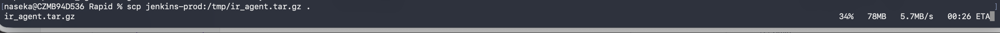

# check vmstat

Before disabling Rapid7:

* the server showed a lot of disk activity
* vmstat 1 showed higher bi/bo
* there was some I/O wait
* the system was busier


bi = blocks read from disk
bo = blocks written to disk
wa = CPU waiting for disk I/O

high bi = lots of reading
high bo = lots of writing
high wa = disk/storage may be slowing the system down

Example:

bi bo wa
0  0  0
means:

almost no disk activity
no waiting on disk
Example:


bi bo wa
50000 12000 20
means:

a lot of disk reads
a lot of disk writes
CPU is spending 20% of time waiting on storage


# try to disable rapid

## check its status

`sudo systemctl status ir_agent`


```bash
[1 naseka@ad.ifortuna.cz@jenkins01-ocp01-shared.m.dc1.cz.ipa.ifortuna.cz ~]$ sudo systemctl status ir_agent
● ir_agent.service - Rapid7 Insight Agent
   Loaded: loaded (/etc/systemd/system/ir_agent.service; enabled; vendor preset: disabled)
   Active: inactive (dead)

Mar 31 05:37:11 jenkins01-ocp01-shared.m.dc1.cz.ipa.ifortuna.cz systemd[1]: Started Rapid7 Insight Agent.
Mar 31 11:00:01 jenkins01-ocp01-shared.m.dc1.cz.ipa.ifortuna.cz systemd[1]: Stopping Rapid7 Insight Agent...
Mar 31 11:00:03 jenkins01-ocp01-shared.m.dc1.cz.ipa.ifortuna.cz systemd[1]: ir_agent.service: Succeeded.
Mar 31 11:00:03 jenkins01-ocp01-shared.m.dc1.cz.ipa.ifortuna.cz systemd[1]: Stopped Rapid7 Insight Agent.
Mar 31 11:00:04 jenkins01-ocp01-shared.m.dc1.cz.ipa.ifortuna.cz systemd[1]: Started Rapid7 Insight Agent.
Mar 31 14:41:19 jenkins01-ocp01-shared.m.dc1.cz.ipa.ifortuna.cz systemd[1]: Stopping Rapid7 Insight Agent...
Mar 31 14:41:21 jenkins01-ocp01-shared.m.dc1.cz.ipa.ifortuna.cz systemd[1]: ir_agent.service: Succeeded.
Mar 31 14:41:21 jenkins01-ocp01-shared.m.dc1.cz.ipa.ifortuna.cz systemd[1]: Stopped Rapid7 Insight Agent.
[3 naseka@ad.ifortuna.cz@jenkins01-ocp01-shared.m.dc1.cz.ipa.ifortuna.cz ~]$ 
```

## stop rapid

`sudo systemctl stop ir_agent`

# check vmstat again

improved


# recap

Elevated disk activity on the controller VM -> after stoping rapid -> disk input/output stats got better. 

either to not scan /var/lib/jenkins at all ( jenkins data directory)

or to not scan /var/lib/jenkins/jobs (job configs, build records, logs, artifacts, metadata)

or do this out of 9-17 and when there are releases so like from midnight to 8 am.

zip all rapid7 directory and send it: upplload it to confluence as Jan mentioned (i should) -> 

# meeting with rapid

* I explained that rapid was pressuring disk and asked whether we can stop scanning or limit it to specific timeframe
* they said: 
    * rapid perfoms the scanning once a day
    * last time they perfomred it at 11:00 am on march 31
* they requested zip of rapid to check how it was configured


## my tasks

`/opt/rapid7/` 

```bash
[0 naseka@ad.ifortuna.cz@jenkins01-ocp01-shared.m.dc1.cz.ipa.ifortuna.cz ~]$ sudo ls -lah /opt/rapid7/
total 97M
drwxr-xr-x 7 root root 4.0K Oct 22  2024 .
drwxr-xr-x 6 root root 4.0K Dec 29 13:42 ..
drwx------ 2 root root 4.0K Oct 22  2024 .bootstrapcommon
drwxr----- 2 root root 4.0K Oct 22  2024 .endpoint_brokercommon
drwxr----- 2 root root 4.0K Oct 22  2024 .insight_agent_contentcommon
drwx------ 2 root root 4.0K Oct 22  2024 .insight_agentcommon
-rw-r--r-- 1 root root  14K Feb 22  2024 cafile.pem
-rw-r--r-- 1 root root 2.5K Feb 22  2024 client.crt
-rw-r--r-- 1 root root 3.2K Feb 22  2024 client.key
-rw-r--r-- 1 root root 4.4K Feb 22  2024 config.json
drwx------ 3 root root 4.0K Oct 22  2024 ir_agent
-rwxr-xr-x 1 root root  19K Oct 18  2024 migration.sh
-rwxr-xr-x 1 root root  34M Feb 22  2024 rapid7-agent_installer-x86_64.sh
-rw-r--r-- 1 root root  63M Oct 18  2024 rapid7-insight-agent-4.0.10.72-1.x86_64.rpm
[0 naseka@ad.ifortuna.cz@jenkins01-ocp01-shared.m.dc1.cz.ipa.ifortuna.cz ~]$ sudo ls -lah /opt/rapid7/ir_agent/
total 6.9M
drwx------ 3 root root 4.0K Oct 22  2024 .
drwxr-xr-x 7 root root 4.0K Oct 22  2024 ..
drwx------ 7 root root 4.0K Oct 22  2024 components
-rwx------ 1 root root 6.9M Oct 22  2024 ir_agent
[0 naseka@ad.ifortuna.cz@jenkins01-ocp01-shared.m.dc1.cz.ipa.ifortuna.cz ~]$ sudo tar -czf /tmp/ir_agent.tar.gz /opt/rapid7/ir_agent
tar: Removing leading `/' from member names
tar: /opt/rapid7/ir_agent/components/agent_core/common/communicator.sock: socket ignored
tar: /opt/rapid7/ir_agent/components/agent_core/common/agent_core.rpc.sock: socket ignored
[0 naseka@ad.ifortuna.cz@jenkins01-ocp01-shared.m.dc1.cz.ipa.ifortuna.cz ~]$ ls -lh /tmp/ir_agent.tar.gz
-rw-r--r-- 1 root root 227M Apr  9 08:27 /tmp/ir_agent.tar.gz
[0 naseka@ad.ifortuna.cz@jenkins01-ocp01-shared.m.dc1.cz.ipa.ifortuna.cz ~]$ exit
naseka@CZMB94D536 Rapid % scp jenkins-prod:/tmp/ir_agent.tar.gz .
ir_agent.tar.gz                                                                                                                                                                 100%  227MB   6.1MB/s   00:37    
naseka@CZMB94D536 Rapid % 
```





# provide hardware config of the server

