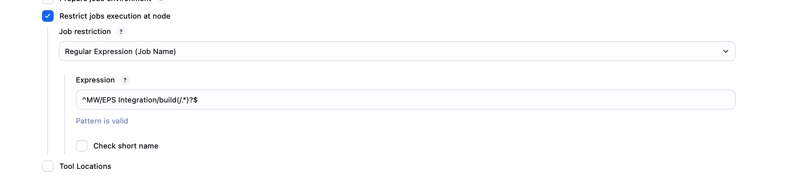
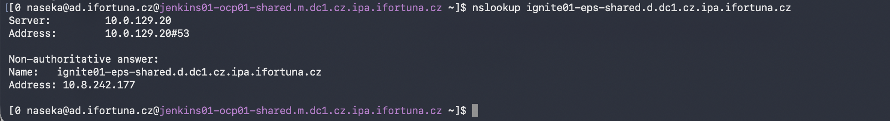

# Ticket: create EPS Ignite Jenkins SSH nodes

## What the Czech ticket means in plain English

Requester wants Jenkins to add new permanent SSH agents for EPS Ignite:

```text
ignite01-eps-shared.d.dc1.cz.ipa.ifortuna.cz
ignite01-eps-shared.t.dc1.cz.ipa.ifortuna.cz
ignite01-eps-shared.s.dc1.cz.ipa.ifortuna.cz
ignite01-eps-shared.p.dc1.cz.ipa.ifortuna.cz
```

For now, do only DEV:

```text
ignite01-eps-shared.d.dc1.cz.ipa.ifortuna.cz
```

The builds probably run under:

```text
http://jenkins01-ocp01-shared.m.dc1.cz.ipa.ifortuna.cz:8080/job/MW/job/EPS%20Integration/job/build/
```

Tests are here:

```text
http://jenkins01-ocp01-shared.m.dc1.cz.ipa.ifortuna.cz:8080/job/FEEDS/job/Test/
```

The provided Java path on the DEV host is:

```text
/usr/lib/jvm/java-21-openjdk-21.0.9.0.10-1.el8.x86_64/bin/java
```

## Important Jenkins-admin translation

This is not an OpenShift pod-template agent.

This is a static Linux machine where Jenkins connects by SSH, copies/starts `remoting.jar`, and runs builds there.

In Jenkins terminology:

- create a new `Permanent Agent`
- launch method is `Launch agents via SSH`
- host is `ignite01-eps-shared.d.dc1.cz.ipa.ifortuna.cz`
- user is probably `jenkins`
- remote root should probably be `/home/jenkins`
- Java path must be the Java 21 path from the ticket
- label should be something EPS-specific so only EPS jobs run there

## Bitbucket group note

The Bitbucket/AD group controls who can see/configure/build Jenkins folders/jobs.

It does not make Jenkins able to SSH into the node.

So there are two separate things:

- EPS group/role: folder/job permissions for users.
- SSH credential: technical login from Jenkins controller to the Linux node.

If the EPS folder already exists and access already works, you probably do not need to touch groups for the first DEV-node test.

## Check what is missing before creating the node

The ticket gives a public SSH key:

```text
ssh-rsa AAAAB3... jenkins@ignite01-eps-shared.d.dc1.cz.ipa.ifortuna.cz
```

For Jenkins SSH launcher you need a Jenkins credential of type:

```text
SSH Username with private key
```

The private key must match the public key installed in:

```text
/home/jenkins/.ssh/authorized_keys
```

on the target host.

If you only have the public key, ask requester/infra:

```text
Please confirm which Jenkins credential ID should be used for SSH to ignite01-eps-shared.d.dc1.cz.ipa.ifortuna.cz, or provide the matching private key so I can add it as an SSH Username with private key credential.
```

## Jenkins UI steps for DEV

Go to:

```text
Manage Jenkins -> Nodes -> New Node
```

Use:

```text
Node name: ignite01-eps-shared.d.dc1.cz.ipa.ifortuna.cz
Type: Permanent Agent
Number of executors: 1
Remote root directory: /home/jenkins
Labels: eps ignite eps-ignite eps-ignite-dev ignite01-eps-shared
Usage: Only build jobs with label expressions matching this node
Launch method: Launch agents via SSH
Host: ignite01-eps-shared.d.dc1.cz.ipa.ifortuna.cz
Credentials: SSH credential for jenkins user on this host
Host Key Verification Strategy: same as comparable existing Linux nodes
JavaPath: /usr/lib/jvm/java-21-openjdk-21.0.9.0.10-1.el8.x86_64/bin/java
Availability: Keep this agent online as much as possible
```

Why `1` executor:

- safest for a new node
- avoids multiple builds fighting for disk/CPU/RAM during first test
- can be increased later after monitoring

## YAML/JCasC skeleton

First make backup on Jenkins server:

```bash
cd /var/lib/jenkins
cp jenkins.yaml jenkins.yaml.$(date +%Y%m%d-%H%M%S)
```

Then add a permanent node block similar to this. Adjust `credentialsId` to the real Jenkins SSH credential ID.

```yaml
- permanent:
    labelString: "eps ignite eps-ignite eps-ignite-dev ignite01-eps-shared"
    launcher:
      ssh:
        credentialsId: "CHANGE_ME_EPS_SSH_CREDENTIAL_ID"
        host: "ignite01-eps-shared.d.dc1.cz.ipa.ifortuna.cz"
        javaPath: "/usr/lib/jvm/java-21-openjdk-21.0.9.0.10-1.el8.x86_64/bin/java"
        port: 22
        sshHostKeyVerificationStrategy: "nonVerifyingKeyVerificationStrategy"
    name: "ignite01-eps-shared.d.dc1.cz.ipa.ifortuna.cz"
    nodeDescription: "EPS Ignite DEV shared Linux agent"
    numExecutors: 1
    remoteFS: "/home/jenkins"
    retentionStrategy: "always"
```

Also check if `labelAtoms` are explicitly listed in this Jenkins YAML. If yes, add the new labels there too, following the existing style.

## Apply configuration

After editing:

```bash
yamllint jenkins.yaml
diff jenkins.yaml jenkins.yaml.YOUR_BACKUP_FILE
```

Then in Jenkins UI:

```text
Manage Jenkins -> Configuration as Code -> Apply new configuration
```

Or use the same reload/apply method already used on this Jenkins instance.

## Connectivity checks

From the Jenkins controller, check SSH port:

```bash
nc -zv ignite01-eps-shared.d.dc1.cz.ipa.ifortuna.cz 22
```

If you can SSH from Jenkins controller with the same user/key, verify:

```bash
ssh jenkins@ignite01-eps-shared.d.dc1.cz.ipa.ifortuna.cz
```

On the target node, verify:

```bash
id jenkins
ls -ld /home/jenkins
ls -ld /home/jenkins/.ssh
ls -l /home/jenkins/.ssh/authorized_keys
/usr/lib/jvm/java-21-openjdk-21.0.9.0.10-1.el8.x86_64/bin/java -version
touch /home/jenkins/.jenkins_test
rm /home/jenkins/.jenkins_test
```

Expected:

```text
/home/jenkins is owned/writable by jenkins
/home/jenkins/.ssh is 700
/home/jenkins/.ssh/authorized_keys is 600
Java command works
jenkins user can write to /home/jenkins
```

## If SSH fails

If `nc` times out, ask infra for firewall/network rule:

```text
Please allow SSH from Jenkins controller jenkins01-ocp01-shared.m.dc1.cz.ipa.ifortuna.cz to ignite01-eps-shared.d.dc1.cz.ipa.ifortuna.cz on TCP/22.
```

If SSH authentication fails:

```text
Please confirm that the public key matching Jenkins credential <credentialId> is present in /home/jenkins/.ssh/authorized_keys on ignite01-eps-shared.d.dc1.cz.ipa.ifortuna.cz and that file ownership/permissions are correct.
```

If Jenkins connects but node stays offline:

- open node log in Jenkins
- verify Java path
- verify remote root `/home/jenkins`
- check whether Jenkins can copy/start `remoting.jar`

## How to test after node is online

1. Confirm the node is online in:

```text
Manage Jenkins -> Nodes
```

2. Run a small test job with:

```groovy
agent { label 'eps-ignite-dev' }
```

3. Use the existing FEEDS test job if it can be pointed to the label:

```text
http://jenkins01-ocp01-shared.m.dc1.cz.ipa.ifortuna.cz:8080/job/FEEDS/job/Test/
```

4. Then ask requester to test the real EPS Integration build:

```text
http://jenkins01-ocp01-shared.m.dc1.cz.ipa.ifortuna.cz:8080/job/MW/job/EPS%20Integration/job/build/
```

## Suggested reply to requester

```text
I will start with the DEV node ignite01-eps-shared.d.dc1.cz.ipa.ifortuna.cz.

This will be configured as a permanent Linux SSH Jenkins agent, not as an OpenShift dynamic agent. I need to confirm the Jenkins SSH credential/private key matching the provided public key, then I can add the node with Java path /usr/lib/jvm/java-21-openjdk-21.0.9.0.10-1.el8.x86_64/bin/java and test connectivity.

The EPS Bitbucket group is only for Jenkins access/permissions. It does not replace the SSH credential needed for the node connection.
```

## Restrictions to enable

^MW/EPS Integration/build(/.*)?$



## host 



10.8.242.177

