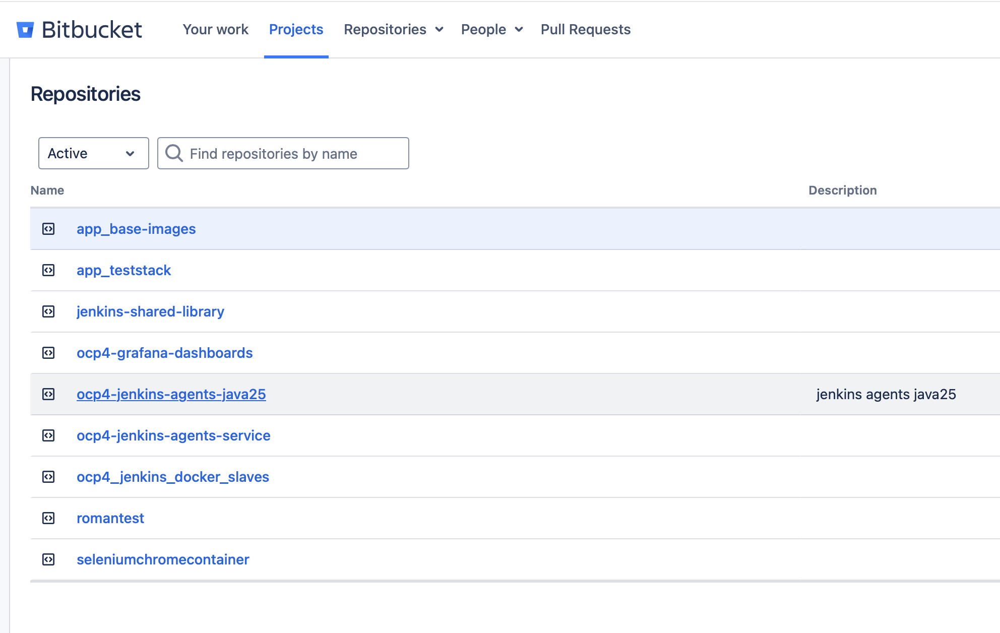

# Ticket: create Jenkins agent with Java 25 and Node 22, without Maven

## what i have done to complete the ticket is indicated in JIRA:

https://jira.myfortuna.eu/browse/INFRA-41445


## Request

Requester wrote:

```text
Hi, can you please create new agent? It is for Alexandros Charos and he needs java25 with node22 but without maven.
So it should be easy.
Please let me know when it is ready, i need to let him know when it is done.
Thank you
```

## What this means in plain English

They need a new Jenkins build agent image for OpenShift/Kubernetes Jenkins jobs.

The agent should contain:

- Java 25
- Node.js 22

The agent should not contain:

- Maven

So do not copy a `maven-*` agent as the final base unless you remove Maven. Better starting point is probably an existing `node22` agent or a Java-only agent, depending what already exists in the agent repo.

## Important distinction

This is not like adding a Mac/Linux permanent SSH node.

This is a dynamic OpenShift Jenkins agent:

```text
Dockerfile/folder in Bitbucket
-> Jenkins builds image
-> image is pushed to Quay/internal registry
-> OpenShift ImageStream imports it
-> Jenkins Kubernetes pod template references it
-> developers use it by label/agent name in pipelines
```

## Existing workflow from notes

Agent images are built from Bitbucket repo:

```text
https://app-bitb-shared.o.dc1.cz.ipa.ifortuna.cz/projects/OS/repos/ocp4_jenkins_docker_slaves/browse
```

Jenkins build job:

```text
https://ci.svc.ifortuna.cz/job/Openshift/job/ocp4_jenkins_docker_slaves/job/master/
```

I found this Bitbucket repo for java25 in OS project:




Normal process:

1. Modify/create agent folder in Bitbucket repo.
2. Push changes.
3. Bitbucket webhook triggers Jenkins image build.
4. Jenkins builds container image.
5. Image is pushed to Quay/internal registry.
6. OpenShift imports image into ImageStream.
7. Jenkins `jenkins.yaml` gets a new Kubernetes pod template.
8. Apply Configuration as Code.
9. Test with a small pipeline.

## Suggested agent name

Use a clear name that describes tools:

```text
java25-node22
```

Possible folder/image/template names:

```text
slave-java25-node22
java25-node22
```

Before choosing, check naming style in the repo. Match existing naming.

## What to copy

First inspect the repo for existing similar agents:

```bash
ls
find . -maxdepth 2 -iname '*node22*'
find . -maxdepth 2 -iname '*java*'
find . -maxdepth 2 -iname '*maven*'
```

Best copy candidates:

- existing `node22` agent, if it exists
- existing Java-only agent, if it exists
- existing Java + Node agent with older Java/Node versions

Avoid copying:

```text
maven-node22
maven-java*
```

unless there is no better option and you explicitly remove Maven from the Dockerfile and final image.

## Dockerfile idea

The Dockerfile should start from a Java 25 base image if one exists internally.

Conceptual example only:

```dockerfile
FROM registry.svc.ifortuna.cz/ocp4-jenkins-slaves/slave-base-java25:latest

# install or copy Node.js 22 using the same method as existing node22 agents
# do not install Maven
```

Do not invent internet downloads if existing agents use internal Nexus/registry sources. Follow how current `node22` agent installs Node.js.

## Verification inside image

After build, the image must prove:

```bash
java -version
node --version
npm --version
mvn --version
```

Expected:

```text
java -version -> Java 25
node --version -> v22.x
npm --version -> works if Node package includes npm
mvn --version -> command not found
```

The Maven failure is expected because requester asked for no Maven.

## Jenkinsfile / build pipeline change

The agent repo Jenkinsfile usually contains stages for each image, for example:

```text
Build and push slave-node20
Build and push gradle8-java21
```

Add a stage for the new image, following the existing pattern.

Important:

- copy a similar existing stage
- rename image/folder references to the new agent
- make cascade dependencies correct
- if Java 25 base image changes, this agent should rebuild
- if Node 22 base/source changes, this agent should rebuild

## Quay/internal registry

Create the image repository before first push if needed.

From previous notes:

- create repository in Quay
- make it public, matching existing Jenkins agent repos
- image build pipeline pushes the finished agent image there

Use the same organization/project as existing Jenkins slave images.

## OpenShift ImageStream

After image exists, import it to OpenShift, following existing repo README examples.

Conceptual command:

```bash
oc import-image java25-node22:latest \
  --from=registry.svc.ifortuna.cz/ocp4-jenkins-slaves/java25-node22:latest \
  --confirm \
  --scheduled=true \
  --reference-policy=local \
  -n shared-images
```

Adjust image name and registry path to the actual repo naming.

Check:

```bash
oc get is java25-node22 -n shared-images
oc describe is java25-node22 -n shared-images
```

## Jenkins pod template / JCasC

Add a Kubernetes pod template in Jenkins Configuration as Code.

Practical method from notes:

1. SSH to Jenkins controller.
2. Backup `jenkins.yaml`.
3. Copy a similar existing pod template.
4. Rename it to `java25-node22`.
5. Update image reference to OpenShift ImageStream/internal registry image.
6. Remove generated `id` field if present.
7. Keep resources/volumes/env vars same as similar Node agents unless there is a reason to change.
8. Apply Configuration as Code.

Backup:

```bash
cd /var/lib/jenkins
cp jenkins.yaml jenkins.yaml.$(date +%Y%m%d-%H%M%S)
```

After edit:

```bash
diff jenkins.yaml jenkins.yaml.YOUR_BACKUP_FILE
yamllint jenkins.yaml
```

Apply:

```text
Manage Jenkins -> Configuration as Code -> Apply new configuration
```

## What the pod template should expose

The new template/label should be something developers can request:

```groovy
agent { label 'java25-node22' }
```

or in scripted/shared-library style, whatever the local pipelines use:

```groovy
AGENT: 'java25-node22'
```

## Test pipeline

Run a simple Jenkins test job using the new agent:

```groovy
pipeline {
  agent { label 'java25-node22' }

  stages {
    stage('Check tools') {
      steps {
        sh '''
          set -eux
          java -version
          node --version
          npm --version
          if command -v mvn; then
            echo "ERROR: Maven is installed but requester asked for agent without Maven"
            exit 1
          fi
        '''
      }
    }
  }
}
```

Expected result:

- Java 25 prints successfully
- Node 22 prints successfully
- npm prints successfully if included with Node
- Maven is not found

## Possible blocker: Java 25 base image

The request says this should be easy, but it is easy only if a Java 25 base image already exists.

Check in repo/OpenShift:

```bash
oc get is -n shared-images | grep -i java
```

Look for:

```text
java25
slave-base-java25
```

If Java 25 base image does not exist, then the real task becomes two tasks:

1. Create/build Java 25 base image.
2. Create Java 25 + Node 22 agent from it.

Suggested reply if Java 25 base is missing:

```text
I can create the java25-node22 agent, but first I need to check whether we already have a Java 25 base Jenkins image. If not, we need to create the Java 25 base image first, then build the Java 25 + Node 22 agent on top of it.
```

## Suggested final reply to requester

When done:

```text
Hi,

the new Jenkins agent java25-node22 is ready for testing.

It contains Java 25 and Node.js 22. Maven is intentionally not installed.

Please use agent label:
java25-node22
```

If still waiting for build/import:

```text
Hi,

I am preparing a new OpenShift Jenkins agent with Java 25 and Node.js 22, without Maven. I am checking whether a Java 25 base image already exists. If it exists, this should only require a new agent image + Jenkins pod template. If not, I will need to create the Java 25 base image first.
```
