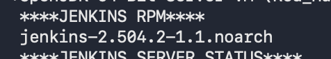
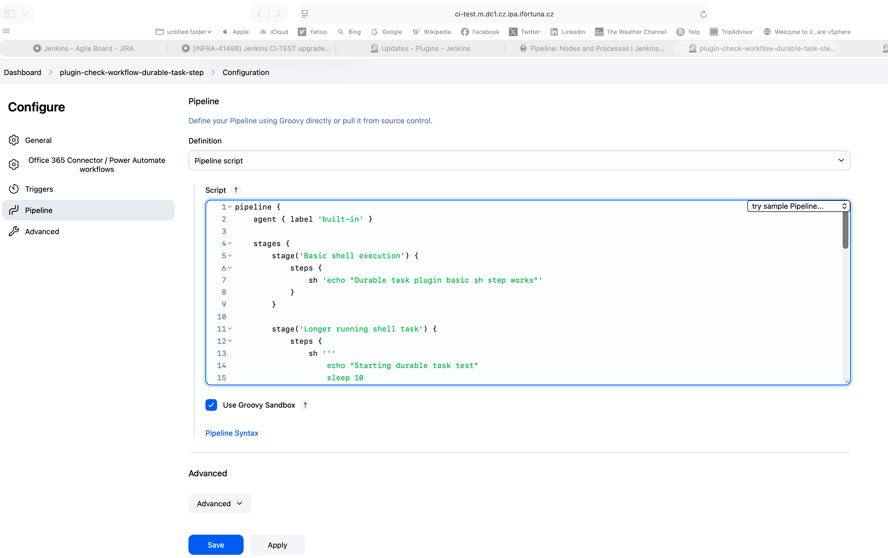
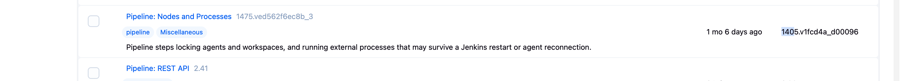
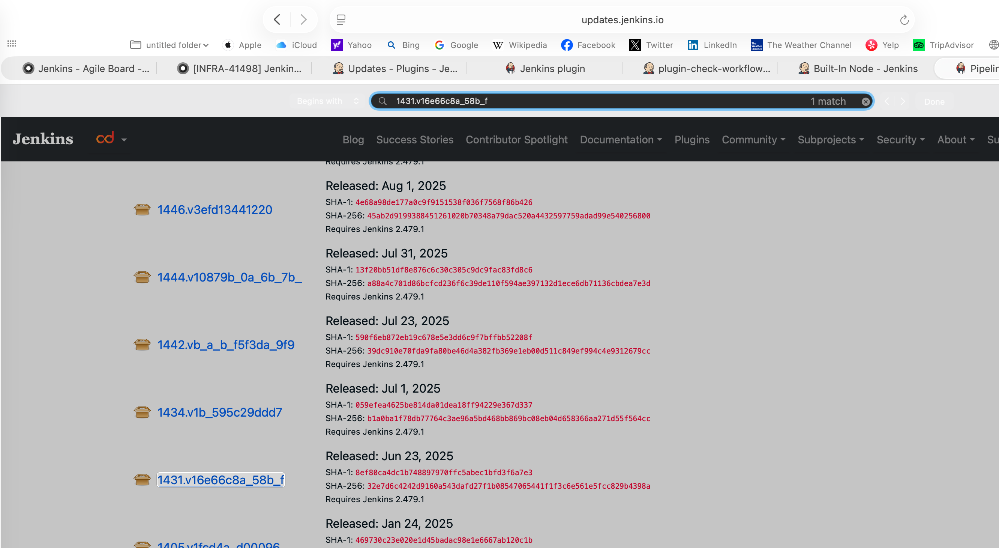
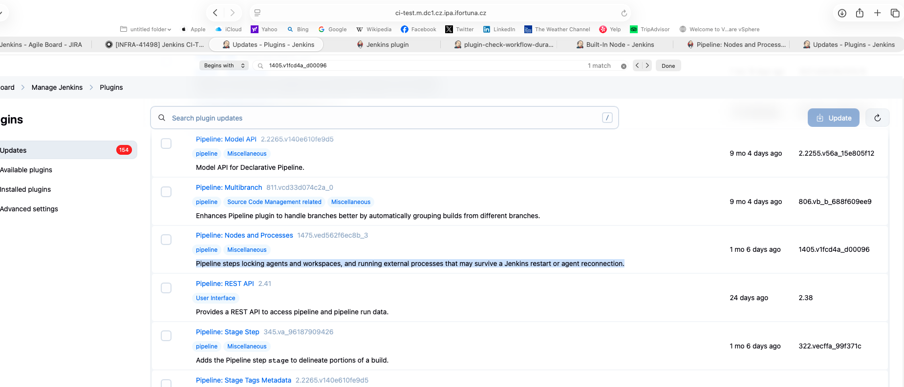
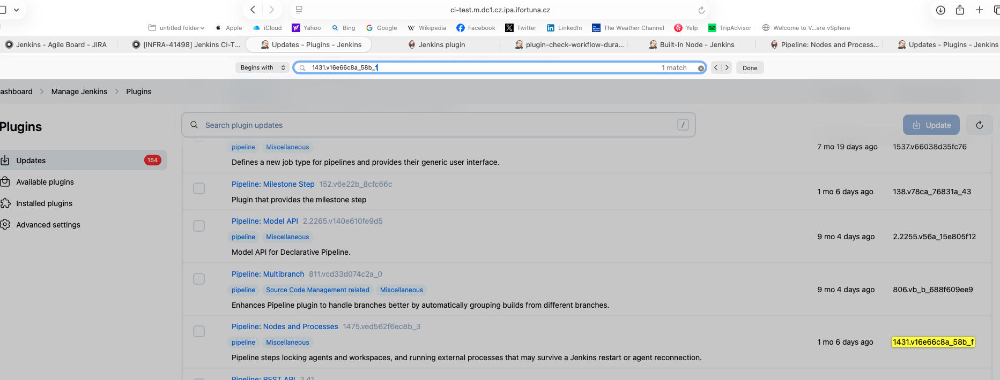
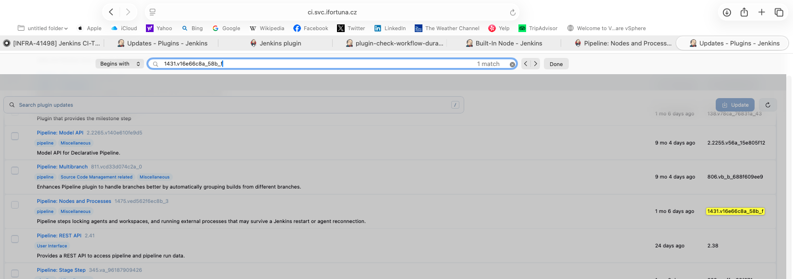
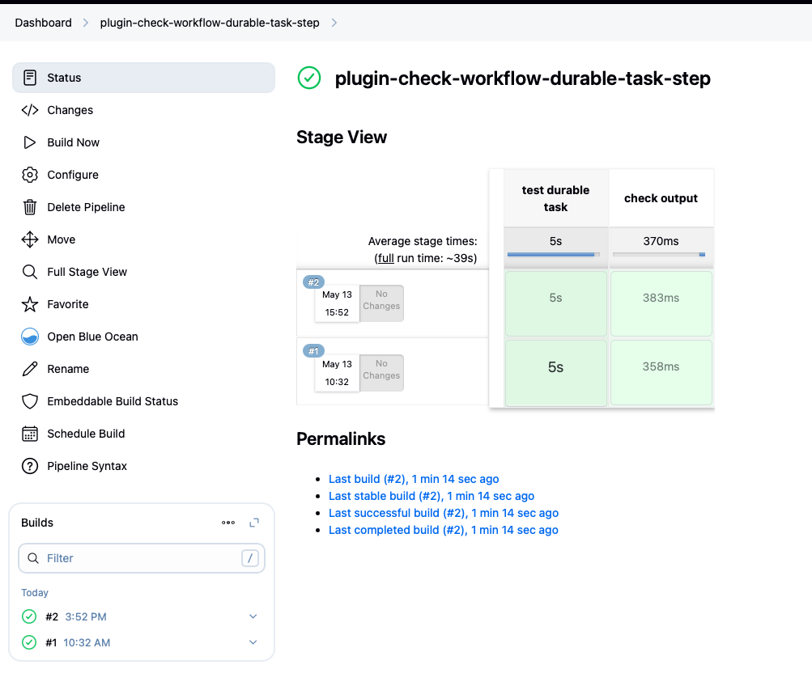
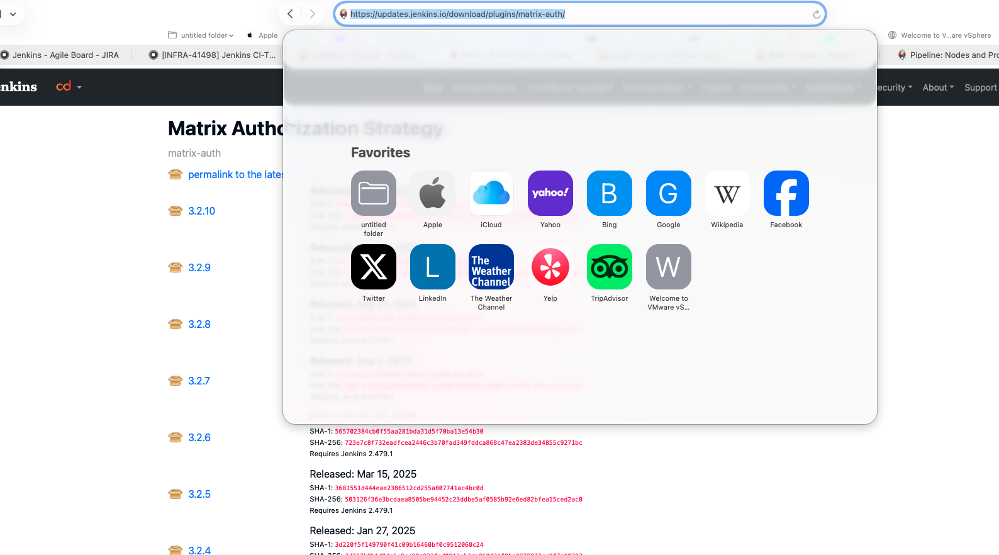
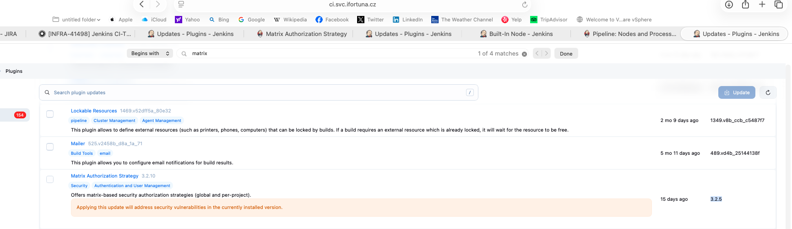

# Jenkins Test update - what needs to be done

Test Jenkins URL:

```text
https://ci-test.m.dc1.cz.ipa.ifortuna.cz
```

Test server:

```bash
ssh -l naseka@ad.ifortuna.cz el8builder01-ocp01-shared.m.dc1.cz.ipa.ifortuna.cz
```

I configured:

```bash
ssh jenkins-test
```

OpenShift project:

```bash
oc project jenkins-test
```
## check what we are updating

its useful to check and compair what jenkins rpm is installed, what version is available from enabled repo, whether prod/test use the same jenkins repo

```bash
[255 naseka@ad.ifortuna.cz@el8builder01-ocp01-shared.m.dc1.cz.ipa.ifortuna.cz ~]$ sudo dnf info jenkins #command to show package info for jenkins: what jenkins version is currently installed, what jenkins version is available from enabled repositories, which repo provides it, package size, license, description etc:
Updating Subscription Management repositories.
Zabbix_6_nonsupported_el8                                                                                                                                                          81 kB/s | 2.9 kB     00:00    
rsyslog_v8_el8                                                                                                                                                                     98 kB/s | 3.0 kB     00:00    
Red Hat Enterprise Linux 8 for x86_64 - AppStream (RPMs)                                                                                                                          112 kB/s | 4.5 kB     00:00    
Red Hat Enterprise Linux 8 for x86_64 - BaseOS (RPMs)                                                                                                                             106 kB/s | 4.1 kB     00:00    
Zabbix_6.4_el8                                                                                                                                                                     92 kB/s | 2.9 kB     00:00    
Red Hat Satellite Client 6 for RHEL 8 x86_64 (RPMs)                                                                                                                               105 kB/s | 3.8 kB     00:00    
Red Hat CodeReady Linux Builder for RHEL 8 x86_64 (RPMs)                                                                                                                          107 kB/s | 4.5 kB     00:00    
Zabbix_7.0_el8                                                                                                                                                                     98 kB/s | 3.0 kB     00:00    
Zabbix_7_nonsupported_el8                                                                                                                                                          94 kB/s | 2.9 kB     00:00    
Installed Packages
Name         : jenkins
Version      : 2.504.2
Release      : 1.1
Architecture : noarch
Size         : 90 M
Source       : jenkins-2.504.2-1.1.src.rpm
Repository   : @System
From repo    : jenkins
Summary      : Jenkins Automation Server
URL          : https://www.jenkins.io/
License      : MIT/X License, GPL/CDDL, ASL2
Description  : Jenkins is the leading open source automation server supported by a large and growing community of developers, testers, designers and other people interested in continuous integration, continuous
             : delivery and modern software delivery practices. Built on the Java Virtual Machine (JVM), it provides more than 2,000 plugins that extend Jenkins to automate with practically any technology
             : software delivery teams use. In 2022, Jenkins reached 300,000 known installations making it the most widely deployed automation server.
             : 
             : For more information, see https://www.jenkins.io.

Available Packages
Name         : jenkins
Version      : 2.555.1
Release      : 1
Architecture : noarch
Size         : 95 M
Source       : jenkins-2.555.1-1.src.rpm
Repository   : jenkins
Summary      : Jenkins Automation Server
URL          : https://www.jenkins.io/
License      : MIT/X License, GPL/CDDL, ASL2
Description  : Jenkins is the leading open source automation server supported by a large and growing community of developers, testers, designers and other people interested in continuous integration, continuous
             : delivery and modern software delivery practices. Built on the Java Virtual Machine (JVM), it provides more than 2,000 plugins that extend Jenkins to automate with practically any technology
             : software delivery teams use. In 2022, Jenkins reached 300,000 known installations making it the most widely deployed automation server.
             : 
             : For more information, see https://www.jenkins.io.

[0 naseka@ad.ifortuna.cz@el8builder01-ocp01-shared.m.dc1.cz.ipa.ifortuna.cz ~]$ 
```

**I compaired this info between test and stage and they both are alligned. Commands used:**


```bash
ssh jenkins-prod 'sudo dnf info jenkins' > prod-dnf-info-jenkins.txt
ssh jenkins-test 'sudo dnf info jenkins' > test-dnf-info-jenkins.txt
diff -u prod-dnf-info-jenkins.txt test-dnf-info-jenkins.txt
```

## check if the enabled Jenkins repo is the stable/LTS repo

```bash
[0 naseka@ad.ifortuna.cz@el8builder01-ocp01-shared.m.dc1.cz.ipa.ifortuna.cz yum.repos.d]$ cat jenkins.repo
[jenkins]
name=Jenkins-stable #means stable repo
baseurl=http://pkg.jenkins.io/redhat-stable
gpgcheck=0
proxy=http://czdcm-proxy-infra.lx.ifortuna.cz:3128
[0 naseka@ad.ifortuna.cz@el8builder01-ocp01-shared.m.dc1.cz.ipa.ifortuna.cz yum.repos.d]$ 
```


!!! Yazdan said after update there were problems with Bitbucket. check this after next test update:

```bash
sudo journalctl -u jenkins --since "time-of-update" --no-pager | grep -Ei "bitbucket|branch|scm|git|credential|error|exception|failed"
```


## Main idea

The dangerous part is usually not the Jenkins core package itself. The dangerous part is:

- plugin compatibility
- plugin dependencies
- Bitbucket webhooks
- Jenkins Configuration as Code
- Java version requirement
- proxy / no-proxy settings
- old saved Jenkins data that cannot be read after update

## Important current Jenkins note

Available latest version: 

Available Packages
Name         : jenkins
Version      : 2.555.1

so, check the official Jenkins LTS upgrade guide and changelog:

### - https://www.jenkins.io/doc/upgrade-guide/

Require Java 21
Beginning with Jenkins 2.555.1, Jenkins requires Java 21 or Java 25 on both the controller JVM and agent JVMs.

! before update we need to inform all anget owners: all agents must run on Java 21 or Java 25!

! Check/update the DinD Jenkins agent image so the Jenkins agent JVM is Java 21 or Java 25.

    So simple rule:

    Jenkins agent Java = Java 21/25
    Application build Java = whatever the application needs
    They can be different.

    This matters for your Docker-in-Docker or custom agent images. The image may need Java 21/25 installed for Jenkins connection, even if the actual build uses Java 8, 11, or 17.

!So for your upgrade:

    If Jenkins Test controller uses RPM/systemd, check/install Java 21 or 25 on the VM before upgrading Jenkins to 2.555.1.
    And later confirm Jenkins service actually uses it:

! 


test instance checks prior update:

#### commands to perform prior updates based on docs

```bash
[0 naseka@ad.ifortuna.cz@el8builder01-ocp01-shared.m.dc1.cz.ipa.ifortuna.cz ~]$ java --version
openjdk 17.0.15 2025-04-15 LTS
OpenJDK Runtime Environment (Red_Hat-17.0.15.0.6-1) (build 17.0.15+6-LTS)
OpenJDK 64-Bit Server VM (Red_Hat-17.0.15.0.6-1) (build 17.0.15+6-LTS, mixed mode, sharing)
[0 naseka@ad.ifortuna.cz@el8builder01-ocp01-shared.m.dc1.cz.ipa.ifortuna.cz ~]$ which java
/usr/bin/java # /usr/bin/java is often only a shortcut/symlink, not the real Java binary.
[0 naseka@ad.ifortuna.cz@el8builder01-ocp01-shared.m.dc1.cz.ipa.ifortuna.cz ~]$ readlink -f $(which java) # readlink -f ..follows the shortcut to the real file
/usr/lib/jvm/java-17-openjdk-17.0.15.0.6-2.el8.x86_64/bin/java # here is a real java path
[0 naseka@ad.ifortuna.cz@el8builder01-ocp01-shared.m.dc1.cz.ipa.ifortuna.cz ~]$ sudo dnf list available 'java-21-openjdk*' # this checks whether Java 21 is already available/installable from the server repos
Updating Subscription Management repositories.
Zabbix_6_nonsupported_el8                                                                                                                                                                                                                     86 kB/s | 2.9 kB     00:00    
rsyslog_v8_el8                                                                                                                                                                                                                                89 kB/s | 3.0 kB     00:00    
Red Hat Enterprise Linux 8 for x86_64 - AppStream (RPMs)                                                                                                                                                                                     104 kB/s | 4.5 kB     00:00    
Red Hat Enterprise Linux 8 for x86_64 - BaseOS (RPMs)                                                                                                                                                                                         97 kB/s | 4.1 kB     00:00    
Zabbix_6.4_el8                                                                                                                                                                                                                                81 kB/s | 2.9 kB     00:00    
Red Hat Satellite Client 6 for RHEL 8 x86_64 (RPMs)                                                                                                                                                                                          103 kB/s | 3.8 kB     00:00    
Red Hat CodeReady Linux Builder for RHEL 8 x86_64 (RPMs)                                                                                                                                                                                     112 kB/s | 4.5 kB     00:00    
Zabbix_7.0_el8                                                                                                                                                                                                                                94 kB/s | 3.0 kB     00:00    
Zabbix_7_nonsupported_el8                                                                                                                                                                                                                     98 kB/s | 2.9 kB     00:00    
Available Packages
java-21-openjdk.x86_64                                                                                                         1:21.0.9.0.10-1.el8                                                                                   rhel-8-for-x86_64-appstream-rpms        
java-21-openjdk-demo.x86_64                                                                                                    1:21.0.9.0.10-1.el8                                                                                   rhel-8-for-x86_64-appstream-rpms        
java-21-openjdk-demo-fastdebug.x86_64                                                                                          1:21.0.9.0.10-1.el8                                                                                   codeready-builder-for-rhel-8-x86_64-rpms
java-21-openjdk-demo-slowdebug.x86_64                                                                                          1:21.0.9.0.10-1.el8                                                                                   codeready-builder-for-rhel-8-x86_64-rpms
java-21-openjdk-devel.x86_64                                                                                                   1:21.0.9.0.10-1.el8                                                                                   rhel-8-for-x86_64-appstream-rpms        
java-21-openjdk-devel-fastdebug.x86_64                                                                                         1:21.0.9.0.10-1.el8                                                                                   codeready-builder-for-rhel-8-x86_64-rpms
java-21-openjdk-devel-slowdebug.x86_64                                                                                         1:21.0.9.0.10-1.el8                                                                                   codeready-builder-for-rhel-8-x86_64-rpms
java-21-openjdk-fastdebug.x86_64                                                                                               1:21.0.9.0.10-1.el8                                                                                   codeready-builder-for-rhel-8-x86_64-rpms
java-21-openjdk-headless.x86_64                                                                                                1:21.0.9.0.10-1.el8                                                                                   rhel-8-for-x86_64-appstream-rpms        
java-21-openjdk-headless-fastdebug.x86_64                                                                                      1:21.0.9.0.10-1.el8                                                                                   codeready-builder-for-rhel-8-x86_64-rpms
java-21-openjdk-headless-slowdebug.x86_64                                                                                      1:21.0.9.0.10-1.el8                                                                                   codeready-builder-for-rhel-8-x86_64-rpms
java-21-openjdk-javadoc.x86_64                                                                                                 1:21.0.9.0.10-1.el8                                                                                   rhel-8-for-x86_64-appstream-rpms        
java-21-openjdk-javadoc-zip.x86_64                                                                                             1:21.0.9.0.10-1.el8                                                                                   rhel-8-for-x86_64-appstream-rpms        
java-21-openjdk-jmods.x86_64                                                                                                   1:21.0.9.0.10-1.el8                                                                                   rhel-8-for-x86_64-appstream-rpms        
java-21-openjdk-jmods-fastdebug.x86_64                                                                                         1:21.0.9.0.10-1.el8                                                                                   codeready-builder-for-rhel-8-x86_64-rpms
java-21-openjdk-jmods-slowdebug.x86_64                                                                                         1:21.0.9.0.10-1.el8                                                                                   codeready-builder-for-rhel-8-x86_64-rpms
java-21-openjdk-slowdebug.x86_64                                                                                               1:21.0.9.0.10-1.el8                                                                                   codeready-builder-for-rhel-8-x86_64-rpms
java-21-openjdk-src.x86_64                                                                                                     1:21.0.9.0.10-1.el8                                                                                   rhel-8-for-x86_64-appstream-rpms        
java-21-openjdk-src-fastdebug.x86_64                                                                                           1:21.0.9.0.10-1.el8                                                                                   codeready-builder-for-rhel-8-x86_64-rpms
java-21-openjdk-src-slowdebug.x86_64                                                                                           1:21.0.9.0.10-1.el8                                                                                   codeready-builder-for-rhel-8-x86_64-rpms
java-21-openjdk-static-libs.x86_64                                                                                             1:21.0.9.0.10-1.el8                                                                                   rhel-8-for-x86_64-appstream-rpms        
java-21-openjdk-static-libs-fastdebug.x86_64                                                                                   1:21.0.9.0.10-1.el8                                                                                   codeready-builder-for-rhel-8-x86_64-rpms
java-21-openjdk-static-libs-slowdebug.x86_64                                                                                   1:21.0.9.0.10-1.el8                                                                                   codeready-builder-for-rhel-8-x86_64-rpms

```

But jenkins is started by systemd and systemd reads service config files -> those lines are commented out

```bash
#Environment="JAVA_HOME=/usr/lib/jvm/java-17-openjdk-amd64"
#Environment="JENKINS_JAVA_CMD=/etc/alternatives/java"
```
So Jenkins is currently choosing from default system path/alternatives:

```text
/usr/bin/java → Java 17
```

`cat systemd jenkins`

```bash
[0 naseka@ad.ifortuna.cz@el8builder01-ocp01-shared.m.dc1.cz.ipa.ifortuna.cz ~]$ systemctl cat jenkins #prints the full systemd definistion for Jenkins
# /usr/lib/systemd/system/jenkins.service
#
# This file is managed by systemd(1). Do NOT edit this file manually!
# To override these settings, run:
#
#     systemctl edit jenkins
#
# For more information about drop-in files, see:
#
#     https://www.freedesktop.org/software/systemd/man/systemd.unit.html
#

[Unit]
Description=Jenkins Continuous Integration Server
Requires=network.target
After=network.target
StartLimitBurst=5
StartLimitIntervalSec=5m

[Service]
Type=notify
NotifyAccess=main
ExecStart=/usr/bin/jenkins #systemd starts Jenkins through the /usr/bin/jenkins script
Restart=on-failure
SuccessExitStatus=143

# Configures the time to wait for start-up. If Jenkins does not signal start-up
# completion within the configured time, the service will be considered failed
# and will be shut down again. Takes a unit-less value in seconds, or a time span
# value such as "5min 20s". Pass "infinity" to disable the timeout logic.
#TimeoutStartSec=90

# Unix account that runs the Jenkins daemon
# Be careful when you change this, as you need to update the permissions of
# $JENKINS_HOME, $JENKINS_LOG, and (if you have already run Jenkins)
# $JENKINS_WEBROOT.
User=jenkins
Group=jenkins

# Directory where Jenkins stores its configuration and workspaces
Environment="JENKINS_HOME=/var/lib/jenkins"
WorkingDirectory=/var/lib/jenkins

# Location of the Jenkins WAR
#Environment="JENKINS_WAR=/usr/share/java/jenkins.war"

# Location of the exploded WAR
Environment="JENKINS_WEBROOT=%C/jenkins/war"

# Location of the Jenkins log. By default, systemd-journald(8) is used.
#Environment="JENKINS_LOG=%L/jenkins/jenkins.log"

# The Java home directory. When left empty, JENKINS_JAVA_CMD and PATH are consulted.
#Environment="JAVA_HOME=/usr/lib/jvm/java-17-openjdk-amd64"

# The Java executable. When left empty, JAVA_HOME and PATH are consulted.
#Environment="JENKINS_JAVA_CMD=/etc/alternatives/java"

# Arguments for the Jenkins JVM
Environment="JAVA_OPTS=-Djava.awt.headless=true"

# Unix Domain Socket to listen on for local HTTP requests. Default is disabled.
#Environment="JENKINS_UNIX_DOMAIN_PATH=/run/jenkins/jenkins.socket"

# IP address to listen on for HTTP requests.
# The default is to listen on all interfaces (0.0.0.0).
#Environment="JENKINS_LISTEN_ADDRESS="

# Port to listen on for HTTP requests. Set to -1 to disable.
lines 1-69

```


- Yazdan sent: https://www.jenkins.io/security/advisories/
- https://www.jenkins.io/changelog-stable/

Current important warning from Jenkins LTS notes:

- Jenkins `2.555.x` requires **Java 21 or newer**
- Jenkins controller Java version must be checked before updating to that line

So before update, check:

```bash
java -version
systemctl status jenkins
cat /etc/yum.repos.d/jenkins.repo
```

If the controller still runs on older Java, do not update Jenkins core to a version that requires Java 21 until Java is solved.

## Compare Test vs Prod

### check both servers

```bash
ssh jenkins-prod
java -version
rpm -qa | grep jenkins # rpm = package manager query tool -q = query -a = all installed packagescc
sudo systemctl status jenkins
cat /etc/yum.repos.d/jenkins.repo # its repo file, where jenkins packages are downloaded from. output: baseurl = where jenkins rpms come from; redhat-stable = stable jenkins package repository; proxy = server downloads packages through company proxy; gpgcheck=0 = packagre signature checking is disabled here
```

better put outputs to the files and compair them:

```bash
ssh jenkins-prod 'java -version 2>&1' > prod-java.txt #&number = redirect to an output stream number (in our case 1, so error output shoudl be redirected to the same place as standard output); > file = redirect to a file
```

Run for test and prod: 

```bash
naseka@CZMB94D536 Documents % ssh jenkins-test '        
echo "****HOSTNAME****"
hostname

echo "****JAVA VERSION****"
java -version 2>&1

echo "****JENKINS RPM****"
rpm -qa | grep jenkins

echo "****JENKINS SERVER STATUS****"
sudo systemctl status jenkins

echo "****JENKINS REPO****"
cat /etc/yum.repos.d/jenkins.repo
' > test-jenkins-check.txt
```
Then compair test and prod files:

```bash
diff -u prod-jenkins-check.txt test-jenkins-check.txt
```


in the output i can see that installed Jenkins RPM package version is the same on both = both test and prod are using the same jenkins:



### check plugin list

run for prod and you will receive plugin-name plugin-version in the each line of new file:

Prod:
```bash
ssh jenkins-prod '
for f in /var/lib/jenkins/plugins/*/META-INF/MANIFEST.MF; do
  name=$(sudo awk -F": *" "/^Short-Name:/ {print \$2; exit}" "$f" | tr -d "\r")
  version=$(sudo awk -F": *" "/^Plugin-Version:/ {print \$2; exit}" "$f" | tr -d "\r")
  if [ -n "$name" ] && [ -n "$version" ]; then
    printf "%s %s\n" "$name" "$version"
  fi
done | sort
' > prod-plugins-versions.txt
```

Test:
```bash
ssh jenkins-test '
for f in /var/lib/jenkins/plugins/*/META-INF/MANIFEST.MF; do
  name=$(sudo awk -F": *" "/^Short-Name:/ {print \$2; exit}" "$f" | tr -d "\r")
  version=$(sudo awk -F": *" "/^Plugin-Version:/ {print \$2; exit}" "$f" | tr -d "\r")
  if [ -n "$name" ] && [ -n "$version" ]; then
    printf "%s %s\n" "$name" "$version"
  fi
done | sort
' > test-plugins-versions.txt
```

then compair:

```bash
diff -u prod-plugins-versions.txt test-plugins-versions.txt
```

final output:

```bash
naseka@CZMB94D536 Documents % diff -u prod-plugins-versions.txt test-plugins-versions.txt

--- prod-plugins-versions.txt	2026-05-11 12:43:26
+++ test-plugins-versions.txt	2026-05-11 12:46:12
@@ -141,7 +141,7 @@
 lockable-resources 1349.v8b_ccb_c5487f7
 mailer 489.vd4b_25144138f
 mapdb-api 1.0.9-44.va_1e1310c9118
-matrix-auth 3.2.5
+matrix-auth 3.2.6
 matrix-project 849.v0cd64ed7e531
 maven-plugin 3.26
 mercurial 1309.v6802b_f0efb_b_9
@@ -220,7 +220,7 @@
 workflow-basic-steps 1079.vce64b_a_929c5a_
 workflow-cps 4117.vc0f3c515a_a_a_0
 workflow-cps-global-lib 609.vd95673f149b_b
-workflow-durable-task-step 1431.v16e66c8a_58b_f
+workflow-durable-task-step 1405.v1fcd4a_d00096
 workflow-job 1537.v66038d35fc76
 workflow-multibranch 806.vb_b_688f609ee9
 workflow-scm-step 437.v05a_f66b_e5ef8
naseka@CZMB94D536 Documents % 
```
Summary: Plugin comparison shows two differences:

```text
- matrix-auth is newer on test: prod 3.2.5, test 3.2.6
- workflow-durable-task-step is older on test: prod 1431.v16e66c8a_58b_f, test 1405.v1fcd4a_d00096
```

### test workflow-durable-task-step upgrade to allign with prod

**Description of plugin**: Pipeline steps locking agents and workspaces, and running external processes that may survive a Jenkins restart or agent reconnection.

1) verify current version on both

```bash
ssh jenkins-test '
sudo awk -F": *" "
/^Short-Name:/ {print}
/^Plugin-Version:/ {print}
" /var/lib/jenkins/plugins/workflow-durable-task-step/META-INF/MANIFEST.MF | tr -d "\r"
'
```
result:
```bash
Short-Name: workflow-durable-task-step
Plugin-Version: 1405.v1fcd4a_d00096
```


```bash
ssh jenkins-prod '
sudo awk -F": *" "
/^Short-Name:/ {print}
/^Plugin-Version:/ {print}
" /var/lib/jenkins/plugins/workflow-durable-task-step/META-INF/MANIFEST.MF | tr -d "\r"
'
```
result:
```bash
Short-Name: workflow-durable-task-step
Plugin-Version: 1431.v16e66c8a_58b_f
```
2) did a test job (i used built-in node - dont do it in prod, here should be ok for a quick check) !add your comp as a test node for the future!

i added new item pipeline -> saved it and built it



```groovy
pipeline {
    agent { label 'built-in' }

    options {
        timeout(time: 2, unit: 'MINUTES')
        skipDefaultCheckout(true)
    }

    stages {
        stage('test durable task') {
            steps {
                echo "node: ${env.NODE_NAME}"

                sh '''
                    echo "start"
                    sleep 5
                    echo "done"
                '''
            }
        }

        stage('check output') {
            steps {
                script {
                    def output = sh(script: 'echo ok', returnStdout: true).trim()

                    if (output != 'ok') {
                        error "wrong output: ${output}"
                    }
                }
            }
        }
    }
}

Verified: sh step, short durable task, returnStdout
```

```bash
Running on Jenkins in /var/lib/jenkins/workspace/plugin-check-workflow-durable-task-step #that proves workspace allocation ok
node: built-in #that proves allocation of agent
+ echo start
start
+ sleep 5
+ echo done
done
+ echo ok
Finished: SUCCESS
```


3)  Try to update test plugin in UI
it offers much newer plugin version:



4) Since UI offers too new version, I will install desired version manually in controller

a) create back up of plugins first


```bash
[0 naseka@ad.ifortuna.cz@el8builder01-ocp01-shared.m.dc1.cz.ipa.ifortuna.cz ~]$ cd /var/lib/jenkins
[0 naseka@ad.ifortuna.cz@el8builder01-ocp01-shared.m.dc1.cz.ipa.ifortuna.cz jenkins]$ sudo cp -ar plugins plugins.$(date +%Y%m%d)
[0 naseka@ad.ifortuna.cz@el8builder01-ocp01-shared.m.dc1.cz.ipa.ifortuna.cz jenkins]$ ls -ld plugins plugins.$(date +%Y%m%d)
drwxr-xr-x 234 jenkins jenkins 36864 Jun 23  2025 plugins
drwxr-xr-x 234 jenkins jenkins 36864 Jun 23  2025 plugins.20260513
[0 naseka@ad.ifortuna.cz@el8builder01-ocp01-shared.m.dc1.cz.ipa.ifortuna.cz jenkins]$ 
```

b) donwload exact prod version

here is the prod version located:



```bash
sudo https_proxy=http://czdcm-proxy-infra.lx.ifortuna.cz:3128 curl -o workflow-durable-task-step.hpi -fSL https://updates.jenkins.io/download/plugins/workflow-durable-task-step/1431.v16e66c8a_58b_f/workflow-durable-task-step.hpi
```

c) i downloaded it to /var/lib/jenkins.. so i need to move it

there are three things in jenkins plugins for one plugin:

```bash
[130 naseka@ad.ifortuna.cz@el8builder01-ocp01-shared.m.dc1.cz.ipa.ifortuna.cz plugins]$ ls | grep workflow-durable-task-step
workflow-durable-task-step #this is the extracted plugin directory Jenkins created from the archive (contains META-INF and WEB-INF)
workflow-durable-task-step.bak #this is an old backup file. Jenkins often creates .bak files when plugins are upgraded through the UI, or someone created it before. It is not the active plugin.
workflow-durable-task-step.jpi #This is the active plugin package/file/archive Jenkins currently uses
[0 naseka@ad.ifortuna.cz@el8builder01-ocp01-shared.m.dc1.cz.ipa.ifortuna.cz plugins]$ 
```
rename old active plugin file and old extracted plugin folder

```bash
sudo mv workflow-durable-task-step.jpi workflow-durable-task-step.jpi.before-update
sudo mv workflow-durable-task-step workflow-durable-task-step.before-update
```

now i am ready to move downloaded new plugin version to plugins

```bash
sudo mv /var/lib/jenkins/workflow-durable-task-step.hpi /var/lib/jenkins/plugins/workflow-durable-task-step.hpi
```


d) change owner

```bash
[0 naseka@ad.ifortuna.cz@el8builder01-ocp01-shared.m.dc1.cz.ipa.ifortuna.cz plugins]$ sudo chown jenkins:jenkins /var/lib/jenkins/plugins/workflow-durable-task-step.hpi
[0 naseka@ad.ifortuna.cz@el8builder01-ocp01-shared.m.dc1.cz.ipa.ifortuna.cz plugins]$ ls -l /var/lib/jenkins/plugins/workflow-durable-task-step.hpi
-rw-r--r-- 1 jenkins jenkins 143000 May 13 08:57 /var/lib/jenkins/plugins/workflow-durable-task-step.hpi
[0 naseka@ad.ifortuna.cz@el8builder01-ocp01-shared.m.dc1.cz.ipa.ifortuna.cz plugins]$ 
```
e) change full plugin state before restart (jenkins loads plugins from plugins directory when it starts):

```bash
[0 naseka@ad.ifortuna.cz@el8builder01-ocp01-shared.m.dc1.cz.ipa.ifortuna.cz plugins]$ ls -l /var/lib/jenkins/plugins/workflow-durable-task-step*
-rw-r--r-- 1 jenkins jenkins 141542 Jun 23  2025 /var/lib/jenkins/plugins/workflow-durable-task-step.bak
-rw-r--r-- 1 jenkins jenkins 143000 May 13 08:57 /var/lib/jenkins/plugins/workflow-durable-task-step.hpi
-rw-r--r-- 1 jenkins jenkins 142071 Jun 23  2025 /var/lib/jenkins/plugins/workflow-durable-task-step.jpi.before-update

/var/lib/jenkins/plugins/workflow-durable-task-step.before-update:
total 8
drwxr-xr-x 3 jenkins jenkins 4096 Jun 23  2025 META-INF
drwxr-xr-x 3 jenkins jenkins 4096 Jun 23  2025 WEB-INF
[0 naseka@ad.ifortuna.cz@el8builder01-ocp01-shared.m.dc1.cz.ipa.ifortuna.cz plugins]$ 
```

f) UI prior the change:

 -> we can see old version

UI after the change:



corresponds to prod current version:




g) restart Jenkins and verify its status:

```bash
[0 naseka@ad.ifortuna.cz@el8builder01-ocp01-shared.m.dc1.cz.ipa.ifortuna.cz ~]$ sudo systemctl restart jenkins
[0 naseka@ad.ifortuna.cz@el8builder01-ocp01-shared.m.dc1.cz.ipa.ifortuna.cz ~]$ sudo systemctl status jenkins
● jenkins.service - Jenkins Continuous Integration Server
   Loaded: loaded (/usr/lib/systemd/system/jenkins.service; enabled; vendor preset: disabled)
  Drop-In: /etc/systemd/system/jenkins.service.d
           └─override.conf
   Active: active (running) since Wed 2026-05-13 13:36:58 UTC; 50s ago
 Main PID: 75261 (java)
    Tasks: 92 (limit: 100691)
   Memory: 1.0G
   CGroup: /system.slice/jenkins.service
           └─75261 /usr/bin/java -Dorg.apache.commons.jelly.tags.fmt.timeZone=Europe/Prague -Djava.naming.referral=ignore -Dcom.sun.jndi.ldap.object.disableEndpointIdentification=true -Dhudson.model.DownloadService.noSignatureCheck=true -Djava.awt.headless=true -Djava> 
```
h) redo the test - i reran the same job with test pipeline - SUCCESS



### test matrix-auth downgrade to allign with prod

1) confirm test version (expected 3.2.6):

```bash
[130 naseka@ad.ifortuna.cz@el8builder01-ocp01-shared.m.dc1.cz.ipa.ifortuna.cz ~]$ sudo awk -F": *" '/^Plugin-Version:/ {print $2; exit}' /var/lib/jenkins/plugins/matrix-auth/META-INF/MANIFEST.MF
3.2.6
[0 naseka@ad.ifortuna.cz@el8builder01-ocp01-shared.m.dc1.cz.ipa.ifortuna.cz ~]$ 
```
2) check current files: 

```bash
[0 naseka@ad.ifortuna.cz@el8builder01-ocp01-shared.m.dc1.cz.ipa.ifortuna.cz plugins]$ ls | grep matrix-auth
matrix-auth
matrix-auth.bak
matrix-auth.jpi
[0 naseka@ad.ifortuna.cz@el8builder01-ocp01-shared.m.dc1.cz.ipa.ifortuna.cz plugins]$ 
```

3) perform smoke test prior downgrade: all accesses for my naseka seem to work as usual (manage jenkins, security, system, plugins, nodes, pod templates, new item, run the job)

4) rename the files prior downloading older plugin version

```bash
[0 naseka@ad.ifortuna.cz@el8builder01-ocp01-shared.m.dc1.cz.ipa.ifortuna.cz plugins]$ ls -l matrix-auth*
-rw-r--r-- 1 jenkins jenkins 178433 Jun 23  2025 matrix-auth.bak
-rw-r--r-- 1 jenkins jenkins 178600 Jun 23  2025 matrix-auth.jpi.before-update

matrix-auth.before-update:
total 8
drwxr-xr-x 3 jenkins jenkins 4096 Jun 23  2025 META-INF
drwxr-xr-x 3 jenkins jenkins 4096 Jun 23  2025 WEB-INF
[0 naseka@ad.ifortuna.cz@el8builder01-ocp01-shared.m.dc1.cz.ipa.ifortuna.cz plugins]$ 
```

5) download older plugin version

here are plugin versions, we need 3.2.5:




```bash
[0 naseka@ad.ifortuna.cz@el8builder01-ocp01-shared.m.dc1.cz.ipa.ifortuna.cz plugins]$ sudo https_proxy=http://czdcm-proxy-infra.lx.ifortuna.cz:3128 curl -o matrix-auth.hpi -fSL https://updates.jenkins.io/download/plugins/matrix-auth/3.2.5/matrix-auth.hpi
  % Total    % Received % Xferd  Average Speed   Time    Time     Time  Current
                                 Dload  Upload   Total   Spent    Left  Speed
100   288  100   288    0     0    668      0 --:--:-- --:--:-- --:--:--   668
  0     0    0     0    0     0      0      0 --:--:--  0:00:01 --:--:--     0
100  174k  100  174k    0     0  96659      0  0:00:01  0:00:01 --:--:-- 1082k
[0 naseka@ad.ifortuna.cz@el8builder01-ocp01-shared.m.dc1.cz.ipa.ifortuna.cz plugins]$ 
```

6) fix ownership

```bash
[0 naseka@ad.ifortuna.cz@el8builder01-ocp01-shared.m.dc1.cz.ipa.ifortuna.cz plugins]$ sudo chown jenkins:jenkins /var/lib/jenkins/plugins/matrix-auth.hpi
[0 naseka@ad.ifortuna.cz@el8builder01-ocp01-shared.m.dc1.cz.ipa.ifortuna.cz plugins]$ ls -l matrix-au*
-rw-r--r-- 1 jenkins jenkins 178433 Jun 23  2025 matrix-auth.bak
-rw-r--r-- 1 jenkins jenkins 178433 May 13 14:19 matrix-auth.hpi
-rw-r--r-- 1 jenkins jenkins 178600 Jun 23  2025 matrix-auth.jpi.before-update

matrix-auth.before-update:
total 8
drwxr-xr-x 3 jenkins jenkins 4096 Jun 23  2025 META-INF
drwxr-xr-x 3 jenkins jenkins 4096 Jun 23  2025 WEB-INF
[0 naseka@ad.ifortuna.cz@el8builder01-ocp01-shared.m.dc1.cz.ipa.ifortuna.cz plugins]$ 
```

7) restart jenkins
```bash
[0 naseka@ad.ifortuna.cz@el8builder01-ocp01-shared.m.dc1.cz.ipa.ifortuna.cz plugins]$ sudo systemctl restart jenkins
[0 naseka@ad.ifortuna.cz@el8builder01-ocp01-shared.m.dc1.cz.ipa.ifortuna.cz plugins]$ sudo systemctl status jenkins
● jenkins.service - Jenkins Continuous Integration Server
   Loaded: loaded (/usr/lib/systemd/system/jenkins.service; enabled; vendor preset: disabled)
  Drop-In: /etc/systemd/system/jenkins.service.d
           └─override.conf
   Active: active (running) since Wed 2026-05-13 14:27:45 UTC; 2min 43s ago
 Main PID: 79469 (java)
    Tasks: 83 (limit: 100691)
   Memory: 888.6M
   CGroup: /system.slice/jenkins.service
           └─79469 /usr/bin/java -Dorg.apache.commons.jelly.tags.fmt.timeZone=Europe/Prague -Djava.naming.referral=ignore -Dcom.sun.jndi.ldap.object.disableEndpointIdentification=true -Dhudson.model.DownloadService.noSignatureCheck=true -Djava.awt.headless=true -Djava>
```

8) check plugin version in ui:

test:


same as prod:



9) smoke test: all accesses work for naseka

## recheck plugins again

1) first i delete back up separate files, cause i created the backup for all plugins:

```bash
[0 naseka@ad.ifortuna.cz@el8builder01-ocp01-shared.m.dc1.cz.ipa.ifortuna.cz ~]$ ls -ld /var/lib/jenkins/plugins.20260513
drwxr-xr-x 234 jenkins jenkins 36864 Jun 23  2025 /var/lib/jenkins/plugins.20260513
[0 naseka@ad.ifortuna.cz@el8builder01-ocp01-shared.m.dc1.cz.ipa.ifortuna.cz ~]$ sudo rm -rf /var/lib/jenkins/plugins/matrix-auth.before-update
[0 naseka@ad.ifortuna.cz@el8builder01-ocp01-shared.m.dc1.cz.ipa.ifortuna.cz ~]$ sudo rm -f /var/lib/jenkins/plugins/matrix-auth.jpi.before-update
[0 naseka@ad.ifortuna.cz@el8builder01-ocp01-shared.m.dc1.cz.ipa.ifortuna.cz ~]$ sudo rm -rf /var/lib/jenkins/plugins/workflow-durable-task-step.before-update
[0 naseka@ad.ifortuna.cz@el8builder01-ocp01-shared.m.dc1.cz.ipa.ifortuna.cz ~]$ sudo rm -f /var/lib/jenkins/plugins/workflow-durable-task-step.jpi.before-update
[0 naseka@ad.ifortuna.cz@el8builder01-ocp01-shared.m.dc1.cz.ipa.ifortuna.cz ~]$ 
```

2) recheck itsself - success

```bash
naseka@CZMB94D536 JenkinsTestUpdate % ssh jenkins-prod '
for f in /var/lib/jenkins/plugins/*/META-INF/MANIFEST.MF; do
  name=$(sudo awk -F": *" "/^Short-Name:/ {print \$2; exit}" "$f" | tr -d "\r")
  version=$(sudo awk -F": *" "/^Plugin-Version:/ {print \$2; exit}" "$f" | tr -d "\r")
  if [ -n "$name" ] && [ -n "$version" ]; then
    printf "%s %s\n" "$name" "$version"
  fi
done | sort
' > prod-plugins-versions.txt
naseka@CZMB94D536 JenkinsTestUpdate % ssh jenkins-test '
for f in /var/lib/jenkins/plugins/*/META-INF/MANIFEST.MF; do
  name=$(sudo awk -F": *" "/^Short-Name:/ {print \$2; exit}" "$f" | tr -d "\r")
  version=$(sudo awk -F": *" "/^Plugin-Version:/ {print \$2; exit}" "$f" | tr -d "\r")
  if [ -n "$name" ] && [ -n "$version" ]; then
    printf "%s %s\n" "$name" "$version"
  fi
done | sort
' > test-plugins-versions.txt
naseka@CZMB94D536 JenkinsTestUpdate % ls
prod-dnf-info-jenkins.txt	prod-plugins-versions.txt	test-dnf-info-jenkins.txt	test-plugins-versions.txt
naseka@CZMB94D536 JenkinsTestUpdate % diff -u prod-plugins-versions.txt test-plugins-versions.txt
naseka@CZMB94D536 JenkinsTestUpdate % 
```

### important jenkins config files

1) Compair file names

```bash
ssh jenkins-prod "sudo find /opt/jenkins -maxdepth 1 -type f -name '*.xml' -printf '%f\n' | sort" > prod-jenkins-xml-files.txt

ssh jenkins-test "sudo find /opt/jenkins -maxdepth 1 -type f -name '*.xml' -printf '%f\n' | sort" > test-jenkins-xml-files.txt

diff -u prod-jenkins-xml-files.txt test-jenkins-xml-files.txt
```
Output:

```bash
naseka@CZMB94D536 Documents % diff -u prod-jenkins-xml-files.txt test-jenkins-xml-files.txt
--- prod-jenkins-xml-files.txt	2026-05-11 14:44:34
+++ test-jenkins-xml-files.txt	2026-05-11 14:44:54
@@ -6,24 +6,6 @@
 com.cloudbees.jenkins.plugins.bitbucket.endpoints.BitbucketEndpointConfiguration.xml
 com.cloudbees.plugins.credentials.CredentialsProviderManager$Configuration.xml
 com.datapipe.jenkins.vault.configuration.GlobalVaultConfiguration.xml
-com.openshift.jenkins.plugins.OpenShift.xml
-com.openshift.jenkins.plugins.OpenShiftClientTools.xml
-com.openshift.jenkins.plugins.pipeline.OpenShiftBuildCanceller.xml
-com.openshift.jenkins.plugins.pipeline.OpenShiftBuildVerifier.xml
-com.openshift.jenkins.plugins.pipeline.OpenShiftBuilder.xml
-com.openshift.jenkins.plugins.pipeline.OpenShiftCreator.xml
-com.openshift.jenkins.plugins.pipeline.OpenShiftDeleterJsonYaml.xml
-com.openshift.jenkins.plugins.pipeline.OpenShiftDeleterLabels.xml
-com.openshift.jenkins.plugins.pipeline.OpenShiftDeleterList.xml
-com.openshift.jenkins.plugins.pipeline.OpenShiftDeployCanceller.xml
-com.openshift.jenkins.plugins.pipeline.OpenShiftDeployer.xml
-com.openshift.jenkins.plugins.pipeline.OpenShiftDeploymentVerifier.xml
-com.openshift.jenkins.plugins.pipeline.OpenShiftExec.xml
-com.openshift.jenkins.plugins.pipeline.OpenShiftImageStreams.xml
-com.openshift.jenkins.plugins.pipeline.OpenShiftImageTagger.xml
-com.openshift.jenkins.plugins.pipeline.OpenShiftScaler.xml
-com.openshift.jenkins.plugins.pipeline.OpenShiftScalerPostAction.xml
-com.openshift.jenkins.plugins.pipeline.OpenShiftServiceVerifier.xml
 config.xml
 credentials-configuration.xml
 credentials.xml
@@ -37,24 +19,18 @@
 hudson.plugins.build_timeout.operations.BuildStepOperation.xml
 hudson.plugins.copyartifact.CopyArtifactConfiguration.xml
 hudson.plugins.copyartifact.TriggeredBuildSelector.xml
-hudson.plugins.copyartifact.monitor.LegacyJobConfigMigrationMonitor.xml
 hudson.plugins.emailext.ExtendedEmailPublisher.xml
 hudson.plugins.git.GitSCM.xml
 hudson.plugins.git.GitTool.xml
-hudson.plugins.gradle.Gradle.xml
 hudson.plugins.gradle.enriched.EnrichedSummaryConfig.xml
 hudson.plugins.gradle.injection.InjectionConfig.xml
 hudson.plugins.groovy.Groovy.xml
 hudson.plugins.jira.JiraGlobalConfiguration.xml
-hudson.plugins.mercurial.MercurialInstallation.xml
-hudson.plugins.sonar.MsBuildSQRunnerInstallation.xml
+hudson.plugins.logparser.LogParserPublisher.xml
 hudson.plugins.sonar.SonarGlobalConfiguration.xml
-hudson.plugins.sonar.SonarRunnerInstallation.xml
 hudson.plugins.timestamper.TimestamperConfig.xml
 hudson.scm.SubversionSCM.xml
-hudson.tasks.Ant.xml
 hudson.tasks.Mailer.xml
-hudson.tasks.Maven.xml
 hudson.tasks.Shell.xml
 hudson.triggers.SCMTrigger.xml
 io.jenkins.plugins.casc.CasCGlobalConfig.xml
@@ -62,7 +38,6 @@
 io.jenkins.plugins.junit.storage.JunitTestResultStorageConfiguration.xml
 io.jenkins.plugins.prism.PrismAppearanceConfiguration.xml
 io.jenkins.plugins.prism.PrismConfiguration.xml
-javaposse.jobdsl.plugin.ExecuteDslScripts.xml
 javaposse.jobdsl.plugin.GlobalJobDslSecurityConfiguration.xml
 jenkins.fingerprints.GlobalFingerprintConfiguration.xml
 jenkins.metrics.api.MetricsAccessKey.xml
@@ -82,14 +57,12 @@
 jenkins.security.apitoken.ApiTokenPropertyConfiguration.xml
 jenkins.tasks.filters.EnvVarsFilterGlobalConfiguration.xml
 jenkins.telemetry.Correlator.xml
-jenkinsci.plugins.influxdb.InfluxDbGlobalConfig.xml
 jp.ikedam.jenkins.plugins.extensible_choice_parameter.ExtensibleChoiceParameterDefinition.xml
 jp.ikedam.jenkins.plugins.extensible_choice_parameter.GlobalTextareaChoiceListProvider.xml
 locale.xml
 net.nemerosa.jenkins.seed.SeedPlugin.xml
 net.uaznia.lukanus.hudson.plugins.gitparameter.GitParameterDefinition.xml
 nodeMonitors.xml
-oauth-consumers.xml
 org.jenkins.plugins.lockableresources.LockableResourcesManager.xml
 org.jenkinsci.main.modules.sshd.SSHD.xml
 org.jenkinsci.plugins.DependencyCheck.tools.DependencyCheckInstallation.xml
@@ -100,20 +73,15 @@
 org.jenkinsci.plugins.ewm.steps.ExwsAllocateStep.xml
 org.jenkinsci.plugins.ewm.steps.ExwsStep.xml
 org.jenkinsci.plugins.gitclient.GitHostKeyVerificationConfiguration.xml
-org.jenkinsci.plugins.gitclient.JGitApacheTool.xml
-org.jenkinsci.plugins.gitclient.JGitTool.xml
 org.jenkinsci.plugins.github_branch_source.GitHubConfiguration.xml
 org.jenkinsci.plugins.githubautostatus.BuildStatusConfig.xml
 org.jenkinsci.plugins.gwt.global.CacheConfig.xml
 org.jenkinsci.plugins.gwt.global.Whitelist.xml
-org.jenkinsci.plugins.prometheus.config.PrometheusConfiguration.xml
 org.jenkinsci.plugins.queuecleanup.QueueCleanup.xml
-org.jenkinsci.plugins.resourcedisposer.AsyncResourceDisposer.xml
 org.jenkinsci.plugins.schedulebuild.ScheduleBuildGlobalConfiguration.xml
 org.jenkinsci.plugins.workflow.flow.FlowExecutionList.xml
 org.jenkinsci.plugins.workflow.flow.GlobalDefaultFlowDurabilityLevel.xml
 org.jenkinsci.plugins.workflow.libs.GlobalLibraries.xml
 org.jenkinsci.plugins.workflow.libs.GlobalUntrustedLibraries.xml
 proxy.xml
-queue.xml
 scriptApproval.xml
naseka@CZMB94D536 Documents % 
```

!!! many differences, but i guess its normal. For bitbucket multibranch we need to check the checksum of this config file specifically:

`com.cloudbees.jenkins.plugins.bitbucket.endpoints.BitbucketEndpointConfiguration.xml`

```bash
ssh jenkins-prod "sudo sha256sum /opt/jenkins/com.cloudbees.jenkins.plugins.bitbucket.endpoints.BitbucketEndpointConfiguration.xml | sed 's#/opt/jenkins/##'" > prod-bitbucket-endpoint-checksum.txt

ssh jenkins-test "sudo sha256sum /opt/jenkins/com.cloudbees.jenkins.plugins.bitbucket.endpoints.BitbucketEndpointConfiguration.xml | sed 's#/opt/jenkins/##'" > test-bitbucket-endpoint-checksum.txt

diff -u prod-bitbucket-endpoint-checksum.txt test-bitbucket-endpoint-checksum.txt #returned nothing -> content is identical

```


2) check checksums for those files

```bash
ssh jenkins-prod '
sudo find /var/lib/jenkins -maxdepth 1 -type f -name "*.xml" -exec sha256sum {} \; | sed "s#/var/lib/jenkins/##" | sort
' > prod-jenkins-xml-checksums.txt

ssh jenkins-test '
sudo find /var/lib/jenkins -maxdepth 1 -type f -name "*.xml" -exec sha256sum {} \; | sed "s#/var/lib/jenkins/##" | sort
' > test-jenkins-xml-checksums.txt

diff -u prod-jenkins-xml-checksums.txt test-jenkins-xml-checksums.txt

```


## Before touching anything

Create a rollback point first.

Required:

- VM snapshot in VMware
- backup of Jenkins config
- backup of plugins
- note current Jenkins version
- note current Java version
- note current plugin versions

Commands on Jenkins Test server:

```bash
sudo systemctl status jenkins
java -version
rpm -qa | grep jenkins
cat /etc/yum.repos.d/jenkins.repo
```

Backup Jenkins config:

```bash
cd /var/lib/jenkins
sudo cp jenkins.yaml jenkins.yaml.$(date +%Y%m%d-%H%M%S)
```

Backup plugins:

```bash
cd /var/lib/jenkins
sudo cp -ar plugins plugins.$(date +%Y%m%d-%H%M%S)
```

Why:

- snapshot gives full rollback
- `jenkins.yaml` backup lets you compare config changes
- plugin backup lets you restore working plugin versions

## Check disk and basic health

Before update, check that Jenkins Test is not already unhealthy.

```bash
df -h
free -h
vmstat 1
sudo journalctl -u jenkins --since "2 hours ago" -o short-iso
```

Look for:

- disk almost full
- high memory pressure
- high disk I/O wait
- repeated Jenkins errors
- failed startup messages

If Jenkins is already broken before update, fix or document that first. Otherwise you will not know whether the update caused the problem.

## Update order

Normal order from notes:

1. Update plugins first.
2. Restart Jenkins.
3. Update Jenkins core.
4. Restart Jenkins.
5. Update remaining plugins.
6. Restart again if needed.
7. Validate jobs and webhooks.

Plugin Manager path:

```text
Manage Jenkins -> Plugins
```

Jenkins service commands:

```bash
sudo systemctl stop jenkins
sudo systemctl start jenkins
sudo systemctl restart jenkins
sudo systemctl status jenkins
```

Watch logs during startup:

```bash
sudo journalctl -u jenkins -f
```

Useful log after failed start:

```bash
sudo journalctl -eu jenkins
```

## Jenkins core update

Jenkins is installed from the Jenkins yum repo:

```bash
cat /etc/yum.repos.d/jenkins.repo
```

The repo from notes looks like:

```text
[jenkins]
name=Jenkins-stable
baseurl=http://pkg.jenkins.io/redhat-stable
gpgcheck=0
proxy=http://czdcm-proxy-infra.lx.ifortuna.cz:3128
```

Core update is done through package update:

```bash
sudo dnf update jenkins
```

If doing full system update, be more careful:

```bash
sudo dnf update
```

After update:

```bash
sudo systemctl restart jenkins
sudo systemctl status jenkins
```

## JCasC / jenkins.yaml checks

Some Jenkins upgrades remove or change old configuration options.

Example from previous notes:

```yaml
jenkins:
  agentProtocols:
  - "JNLP4-connect"
  - "Ping"
```

This had to be removed/commented during a previous upgrade.

Before restart, check current config:

```bash
cd /var/lib/jenkins
sudo diff jenkins.yaml jenkins.yaml.YOUR_BACKUP_FILE
```

If `yamllint` is available:

```bash
yamllint jenkins.yaml
```

YAML is indentation-sensitive. One wrong space can break Jenkins Configuration as Code.

## Plugin risk: Bitbucket webhooks

This is the biggest known risk from the notes.

Previous problem:

- Bitbucket Branch Source plugin changed webhook behavior
- plugin-based webhooks were deprecated
- native Bitbucket webhooks behaved differently
- builds stopped triggering correctly
- downgrade was needed

Known affected plugins from previous update:

- `cloudbees-bitbucket-branch-source`
- `blueocean`
- `blueocean-bitbucket-pipeline`

Previous working downgrade versions from notes:

```text
cloudbees-bitbucket-branch-source: 936.1.1
blueocean: 1.27.19
blueocean-bitbucket-pipeline: 1.27.19
```

Do not blindly downgrade first.

First update Jenkins Test, then test webhook behavior. If webhooks break, this is the known rollback area.

Bitbucket webhook setting in Jenkins:

```text
Manage Jenkins -> System -> Bitbucket Endpoints -> Webhook implementation
```

Old behavior:

- plugin-based webhook
- creates POST webhooks

Newer behavior:

- native Bitbucket webhook
- creates Bitbucket-native webhook entries

What must be tested:

- multibranch scan
- PR build trigger
- branch build trigger
- webhook creation/recreation after saving job config

## If Bitbucket plugin must be downgraded

Example from previous notes:

```bash
sudo systemctl stop jenkins
cd /var/lib/jenkins/plugins/
sudo rm -rf /var/lib/jenkins/plugins/cloudbees-bitbucket-branch-source*
sudo https_proxy=http://czdcm-proxy-infra.lx.ifortuna.cz:3128 curl -o cloudbees-bitbucket-branch-source.hpi -fSL https://updates.jenkins.io/download/plugins/cloudbees-bitbucket-branch-source/936.1.1/cloudbees-bitbucket-branch-source.hpi
sudo chown jenkins:jenkins cloudbees-bitbucket-branch-source.hpi
sudo systemctl start jenkins
```

Blue Ocean examples from notes:

```bash
sudo systemctl stop jenkins
cd /var/lib/jenkins/plugins/
sudo rm -rf blueocean blueocean.jpi blueocean.bak
sudo https_proxy=http://czdcm-proxy-infra.lx.ifortuna.cz:3128 curl -o blueocean.hpi -fSL https://updates.jenkins.io/download/plugins/blueocean/1.27.19/blueocean.hpi
sudo chown jenkins:jenkins blueocean.hpi
sudo systemctl start jenkins
```

```bash
cd /var/lib/jenkins/plugins/
sudo rm -rf blueocean-bitbucket-pipeline*
sudo https_proxy=http://czdcm-proxy-infra.lx.ifortuna.cz:3128 curl -o blueocean-bitbucket-pipeline.hpi -fSL https://updates.jenkins.io/download/plugins/blueocean-bitbucket-pipeline/1.27.19/blueocean-bitbucket-pipeline.hpi
sudo chown jenkins:jenkins blueocean-bitbucket-pipeline.hpi
sudo systemctl restart jenkins
```

After any plugin downgrade, always check:

```bash
sudo journalctl -u jenkins --since "20 minutes ago" -o short-iso
```

Look for:

- unsatisfied dependencies
- failed plugin load
- class loading errors
- Bitbucket plugin errors

## Proxy / no-proxy check for Bitbucket Test

From previous `bitbtest` notes:

There was a problem where Bitbucket Test repos did not appear in dropdowns. The fix was adding Bitbucket Test to Jenkins no-proxy settings.

Important host:

```text
app-bitbtest-shared.o.dc1.cz.ipa.ifortuna.cz
```

Check from Jenkins controller:

```bash
curl -vk https://app-bitbtest-shared.o.dc1.cz.ipa.ifortuna.cz
```

Check from agent pod/network if pipeline checkout fails:

```bash
nc -vz app-bitbtest-shared.o.dc1.cz.ipa.ifortuna.cz 7999
nc -vz app-bitbtest-shared.o.dc1.cz.ipa.ifortuna.cz 443
```

Important:

- controller connectivity is not enough
- checkout runs from the Jenkins agent pod
- agent pods run in OpenShift namespace
- for shared agents this was `jenkins-shared`
- for Jenkins Test, check the actual project, likely `jenkins-test`

If SSH to Bitbucket Test fails:

```text
ssh://git@app-bitbtest-shared.o.dc1.cz.ipa.ifortuna.cz:7999/mw/jacktime-service.git
```

then the issue may be firewall/connectivity from OpenShift namespace to Bitbucket Test, not Jenkins credentials.

Previous Jira for allowing SSH connectivity:

```text
INFRA-40551
```

## Validation after update

Do not consider update done just because Jenkins starts.

Validate these things:

- Jenkins UI opens
- login works
- Manage Jenkins page opens
- Plugin Manager opens
- Configuration as Code has no errors
- Jenkins logs do not show repeated severe errors
- Bitbucket endpoints are visible
- Bitbucket Test repo appears in dropdown
- multibranch scan works
- webhook triggers a build
- OpenShift agent pod starts
- checkout works
- simple build stage runs
- old jobs can be opened

Useful URLs:

```text
https://ci-test.m.dc1.cz.ipa.ifortuna.cz/manage
https://ci-test.m.dc1.cz.ipa.ifortuna.cz/manage/pluginManager/
https://ci-test.m.dc1.cz.ipa.ifortuna.cz/manage/computer/
```

## Webhook test

Good test:

1. Open a test multibranch job.
2. Save configuration.
3. Check Bitbucket repo webhooks.
4. Push a small commit to a test branch.
5. Confirm Jenkins starts build automatically.
6. Confirm PR build also triggers if this is a PR job.

Expected chain:

```text
commit in Bitbucket
  -> webhook
  -> Jenkins receives event
  -> multibranch job detects branch/PR
  -> agent pod starts
  -> checkout succeeds
  -> pipeline runs
```

If manual build works but webhook does not:

- Jenkins is probably healthy
- agent template is probably OK
- webhook/plugin/Bitbucket endpoint is suspicious

If webhook triggers but checkout fails:

- check Git URL
- check credentials
- check SSH port `7999`
- check HTTPS port `443`
- check agent pod network access

If job is stuck at scheduling:

- check label / node / pod template
- check OpenShift pod creation
- check Jenkins queue message

## OpenShift checks

Switch to Jenkins Test project:

```bash
oc project jenkins-test
```

Check pods:

```bash
oc get pods
```

Describe failed or pending pod:

```bash
oc describe pod POD_NAME
```

Check common failures:

- image pull error
- pod pending
- resource limits
- SCC / permission issue
- wrong namespace
- wrong image stream
- network to Bitbucket blocked

If you cannot `oc exec` into a pod, it can be a permission/SCC issue. Use `oc describe pod` first because it is usually enough for scheduling and image/network errors.

## Logs to check

Startup logs:

```bash
sudo journalctl -u jenkins --since "30 minutes ago" -o short-iso
```

Follow logs live:

```bash
sudo journalctl -u jenkins -f
```

Search common bad signs:

```text
ERROR
SEVERE
Exception
Failed Loading plugin
unsatisfied dependency
OutOfMemory
Shutting down
Failed to load
Bitbucket
webhook
```

If Jenkins starts but behaves strangely, export logs and inspect locally:

```bash
sudo journalctl -u jenkins --since "3 hours ago" -o short-iso > /tmp/jenkins-test.log
```

## Manage Old Data

After upgrade, Jenkins may report old/unreadable data.

Path:

```text
Manage Jenkins -> Manage Old Data
```

Do not immediately discard data unless you understand what it is.

Previous notes mention:

- after some upgrade/reboot, old unreadable data appeared
- there is a button `Discard Unreadable Data`

Use carefully. On Test it is safer, but still write down what data Jenkins says it cannot read.

## Rollback decision

Rollback from snapshot if:

- Jenkins does not start
- login/authentication breaks
- large number of critical plugins fail
- Bitbucket webhooks cannot be restored
- multibranch jobs cannot scan
- jobs cannot start agents
- logs show repeated severe errors and fix is unclear

Before rollback, save evidence:

```bash
sudo journalctl -u jenkins --since "3 hours ago" -o short-iso > /tmp/jenkins-test-failed-update.log
rpm -qa | grep jenkins > /tmp/jenkins-test-version.txt
java -version
```

Why:

- after snapshot revert, broken state disappears
- logs help explain what failed
- versions help plan next attempt

## Short execution checklist

Use this as the actual runbook:

1. Announce Jenkins Test maintenance.
2. Check current Jenkins, Java, disk, service status.
3. Create VMware snapshot.
4. Backup `/var/lib/jenkins/jenkins.yaml`.
5. Backup `/var/lib/jenkins/plugins`.
6. Read target Jenkins LTS upgrade guide.
7. Confirm Java requirement for target version.
8. Update plugins from GUI.
9. Restart Jenkins.
10. Check logs and UI.
11. Update Jenkins core with `dnf update jenkins`.
12. Restart Jenkins.
13. Check logs and UI again.
14. Update remaining plugins.
15. Restart if needed.
16. Check Bitbucket endpoint/webhook config.
17. Test Bitbucket Test dropdown/repo access.
18. Run multibranch scan.
19. Push test commit and verify webhook build.
20. Check OpenShift pod creation in `jenkins-test`.
21. Confirm checkout and simple pipeline stage works.
22. Check Manage Old Data.
23. Document versions, problems, fixes, and final result.

## Most likely problems and where to look

| Symptom | Likely area |
|---|---|
| Jenkins does not start | Java version, bad plugin, bad JCasC |
| Plugin Manager shows dependency errors | plugin compatibility |
| Bitbucket repo dropdown empty | proxy / no-proxy / Bitbucket endpoint |
| Webhook does not trigger build | Bitbucket plugin / webhook implementation |
| Manual build works but webhook does not | webhook, not agent |
| Agent pod not created | Kubernetes plugin / pod template / OpenShift |
| Pod pending | OpenShift resources / scheduling |
| Checkout fails over SSH | port `7999`, credentials, network |
| Checkout fails over HTTPS | credentials, proxy, port `443` |
| Job stuck waiting to schedule | label/node/pod template not matching |

## Final note

For Jenkins Test, it is acceptable to experiment because there is a snapshot. But still keep notes of every change:

- version before
- version after
- plugins updated
- plugins downgraded
- config changed
- test job used
- webhook result
- rollback needed or not

This is what will make the production update predictable.
