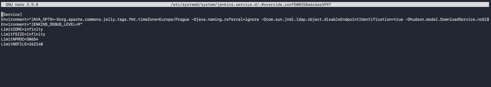
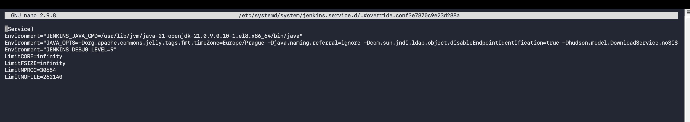
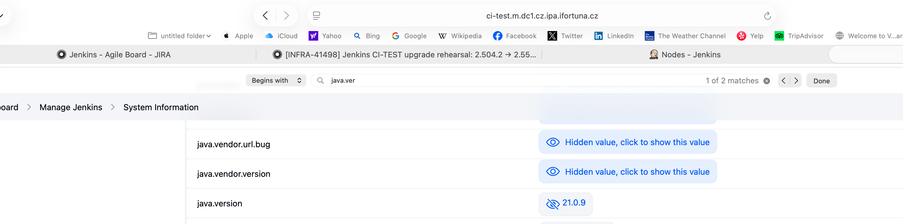

before:


added the line under [service] with path to new java:



verify the file `sudo cat /etc/systemd/system/jenkins.service.d/override.conf`

```bash
[0 naseka@ad.ifortuna.cz@el8builder01-ocp01-shared.m.dc1.cz.ipa.ifortuna.cz ~]$ sudo cat /etc/systemd/system/jenkins.service.d/override.conf
[Service]
Environment="JENKINS_JAVA_CMD=/usr/lib/jvm/java-21-openjdk-21.0.9.0.10-1.el8.x86_64/bin/java"
Environment="JAVA_OPTS=-Dorg.apache.commons.jelly.tags.fmt.timeZone=Europe/Prague -Djava.naming.referral=ignore -Dcom.sun.jndi.ldap.object.disableEndpointIdentification=true -Dhudson.model.DownloadService.noSignatureCheck=true -Djava.awt.headless=true -Djava.io.tmpdir=/var/lib/jenkins/tmp -Dhudson.slaves.NodeProvisioner.initialDelay=0 -Dhudson.slaves.NodeProvisioner.MARGIN=50 -Dhudson.slaves.NodeProvisioner.MARGIN0=0.85 -Dorg.jenkinsci.plugins.durabletask.BourneShellScript.HEARTBEAT_CHECK_INTERVAL=300 -Djavax.net.ssl.trustStore=/var/lib/jenkins/keystore/cacerts -XX:+UseG1GC -XX:MaxRAMPercentage=60.0 -XX:InitialRAMPercentage=20.0"
Environment="JENKINS_DEBUG_LEVEL=9"
LimitCORE=infinity
LimitFSIZE=infinity
LimitNPROC=30654
LimitNOFILE=262140
[0 naseka@ad.ifortuna.cz@el8builder01-ocp01-shared.m.dc1.cz.ipa.ifortuna.cz ~]$ 
```
then run

```bash
sudo systemctl daemon-reload
sudo systemctl restart jenkins
sudo systemctl status jenkins
```

i can see its java 21:

```bash
[130 naseka@ad.ifortuna.cz@el8builder01-ocp01-shared.m.dc1.cz.ipa.ifortuna.cz ~]$ sudo readlink -f /proc/$(pgrep -u jenkins -f jenkins.war)/exe
/usr/lib/jvm/java-21-openjdk-21.0.9.0.10-1.el8.x86_64/bin/java
[0 naseka@ad.ifortuna.cz@el8builder01-ocp01-shared.m.dc1.cz.ipa.ifortuna.cz ~]$ 
```

also in ui:



run checks in log (but unfortunately we have all agents offline in Jenkins, we we cannot fully test it here. But on production its essential to perform this check)

```bash
sudo journalctl -u jenkins --since "20 minutes ago" --no-pager | grep -Ei "UnsupportedClassVersion|major version|java version|SSHLauncher|JNLP|agent|offline|failed|exception"
```


# check for java runtime compatibility errors:

```bash
sudo journalctl -u jenkins --since "30 minutes ago" --no-pager | grep -Ei "UnsupportedClassVersion|UnsupportedClassVersionError|major version|classversion|has been compiled by a more recent version" # Checks whether Jenkins, plugins, or agents are failing because something was compiled for a newer Java version than the runtime supports.
```

# Java module-access warnings

```bash
sudo journalctl -u jenkins --since "30 minutes ago" --no-pager | grep -Ei "illegal reflective|reflective access|InaccessibleObjectException|IllegalAccessException|add-opens|module java" # Checks Java 21 module-access problems, often seen when old plugins use internal Java APIs.
```
