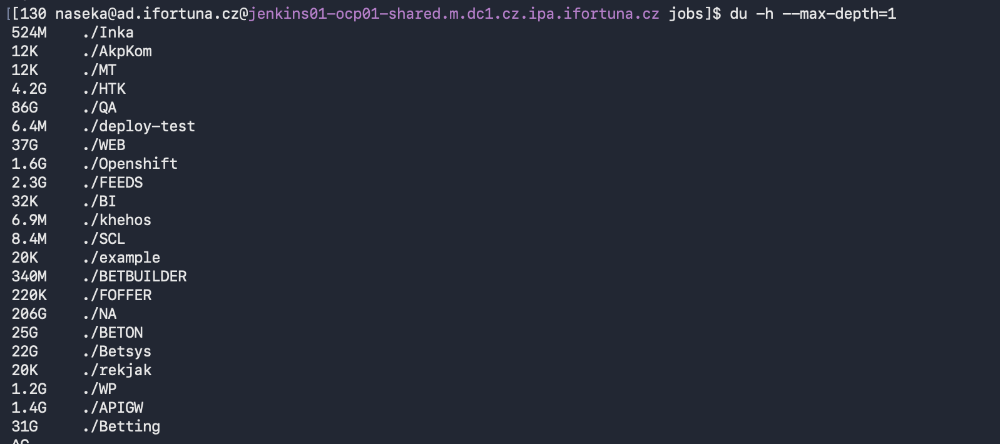
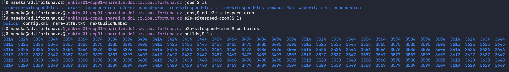
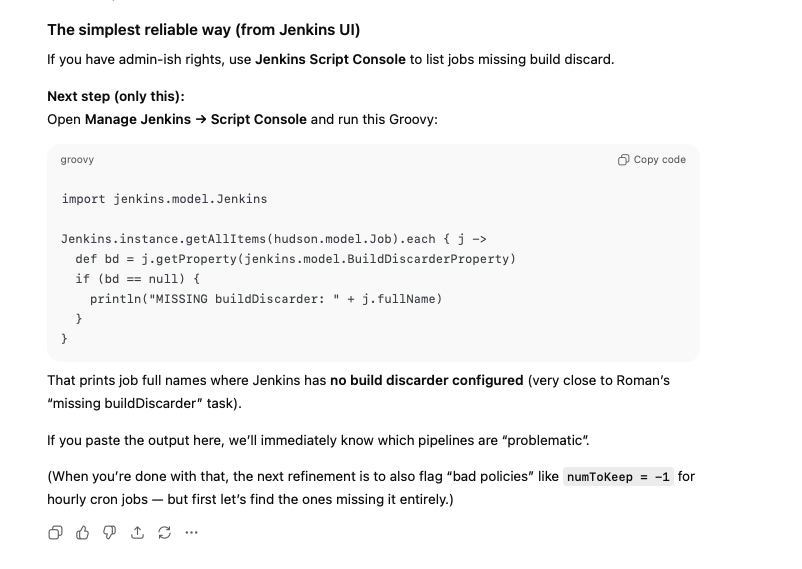

# Task

I have one more thing, on server, in /opt, it looks like there is something adding data, can you check which folder and pipeline in /opt/jenkins/jobs/ may be missing buildDiscarder(logRotator(numToKeepStr: '10')) number can be different Yazdan was doing this before, it is like this: cd /opt/jenkins/jobs/ du -hs * | sort -hr and traverse into like 5 largest folders and gradually try to find it there is some pipeline which is not discarding old builds last time it was sitespeed (performance testing)

# 1. Find biggest job folders

Roman suggested this command:

```bash
du -hs * | sort -hr | head -n 5
```

but first part froze my terminal, so better

```bash
du -h --max-depth=1 | sort -hr | head -n 5
```


same thing.. 

so i ran du for one level without sorting and saw some du (not complete):




las time it was "sitespeed (performance testing)" and also i can see that QA directory takes 86G of DU -> so I went to that Directory

Kept traversing: 
`cd QA => cd jobs -> cd Performance -> cd jobs -> cd sitespeed  -> cd jobs -> then i can see those:


I count items in builds:

`ls -1 | wc -l`ls 

so i get 338:

```bash
[0 naseka@ad.ifortuna.cz@jenkins01-ocp01-shared.m.dc1.cz.ipa.ifortuna.cz builds]$ ls -1 | wc -l
338
[0 naseka@ad.ifortuna.cz@jenkins01-ocp01-shared.m.dc1.cz.ipa.ifortuna.cz builds]$ 
```

i checked disk usage of current folder:

`du -hs .`

i get 598M:

```bash
[0 naseka@ad.ifortuna.cz@jenkins01-ocp01-shared.m.dc1.cz.ipa.ifortuna.cz builds]$ ls -1 | wc -l
338
[0 naseka@ad.ifortuna.cz@jenkins01-ocp01-shared.m.dc1.cz.ipa.ifortuna.cz builds]$ du -hs .
598M	.
[0 naseka@ad.ifortuna.cz@jenkins01-ocp01-shared.m.dc1.cz.ipa.ifortuna.cz builds]$ 
```
now i am checking config.xml (level above):


further solutions:



