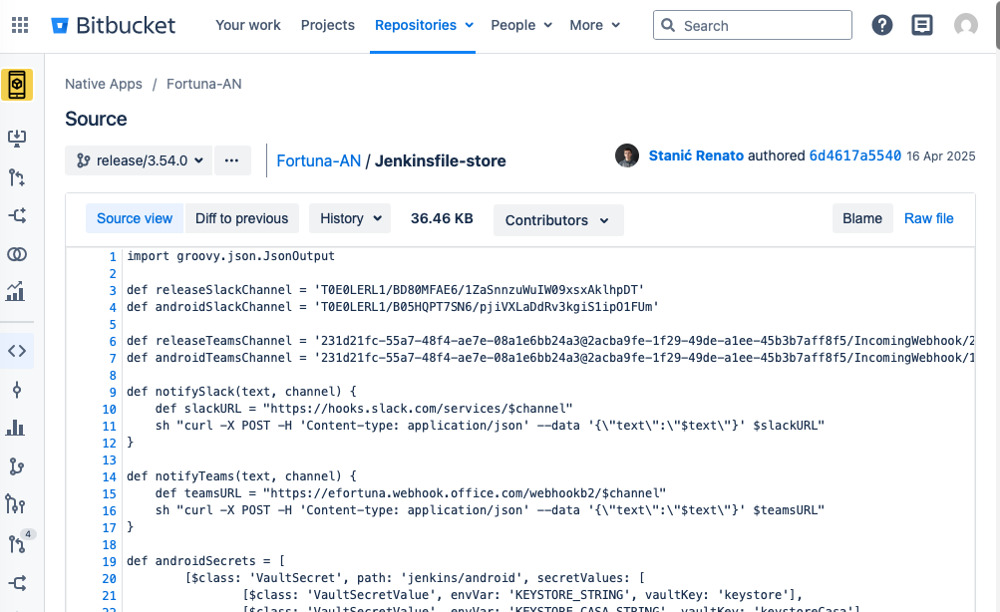

# Task

I have one more thing, on server, in /opt, it looks like there is something adding data, can you check which folder and pipeline in /opt/jenkins/jobs/ may be missing buildDiscarder(logRotator(numToKeepStr: '10')) number can be different Yazdan was doing this before, it is like this: cd /opt/jenkins/jobs/ du -hs * | sort -hr and traverse into like 5 largest folders and gradually try to find it there is some pipeline which is not discarding old builds last time it was sitespeed (performance testing)

# locate to top-level jobs

```bash
cd /opt/jenkins/jobs/
ls
```

# find top 5

```
du -hs * | sort -hr | head -n 5
```

-> for me it runs forever. Roman provided data that its NA


# found top 5 within /NA/jobs

```bash
[130 naseka@ad.ifortuna.cz@jenkins01-ocp01-shared.m.dc1.cz.ipa.ifortuna.cz jobs]$ du -hs * | sort -hr | head -n 5
184G	Android
22G	iOS
1.5G	AndroidLibraries
152M	tools
108M	iOSLibraries
[0 naseka@ad.ifortuna.cz@jenkins01-ocp01-shared.m.dc1.cz.ipa.ifortuna.cz jobs]$ 
```


# found top 5 within /Android/jobs

```bash
[0 naseka@ad.ifortuna.cz@jenkins01-ocp01-shared.m.dc1.cz.ipa.ifortuna.cz jobs]$ du -hs * | sort -hr | head -n 5
92G	Store Build
60G	Store
32G	Nightly Build
192M	Firebase-RemoteConfig
8.2M	Deploy to Production
```

# found out its multibranch


```bash
[0 naseka@ad.ifortuna.cz@jenkins01-ocp01-shared.m.dc1.cz.ipa.ifortuna.cz Store Build]$ ls
branches  config.xml  indexing  name-utf8.txt  state.xml
```


# found top 5 wihtin /Store Build/branches

```bash
[0 naseka@ad.ifortuna.cz@jenkins01-ocp01-shared.m.dc1.cz.ipa.ifortuna.cz Store Build]$ du -hs branches/* | sort -hr | head -n 5
9.0G	branches/release-3-54-0.lfqm37
6.4G	branches/release-3-52-1.3o5ihe
6.3G	branches/release-3-55-0.vjc4tv
5.8G	branches/release-3-53-0.br0mm8
5.3G	branches/release-3-55-2.bs1jan
```


# found top 5 builds of largest branch:

```bash
[0 naseka@ad.ifortuna.cz@jenkins01-ocp01-shared.m.dc1.cz.ipa.ifortuna.cz builds]$ du -hs * | sort -hr | head -n 5
1.7G	7
1.7G	6
1.7G	5
1.7G	4
1.7G	3
```

# they are huge, checked inside:

i figured that its archive folder which takes whole space:

```
[0 naseka@ad.ifortuna.cz@jenkins01-ocp01-shared.m.dc1.cz.ipa.ifortuna.cz builds]$ cd 7
[0 naseka@ad.ifortuna.cz@jenkins01-ocp01-shared.m.dc1.cz.ipa.ifortuna.cz 7]$ ls
archive  build.xml  changelog3128193366732089270.xml  changelog7599090320505863469.xml  libs  log  log-index  workflow-completed
[0 naseka@ad.ifortuna.cz@jenkins01-ocp01-shared.m.dc1.cz.ipa.ifortuna.cz 7]$ du -hs * | sort -hr
1.6G	archive
12M	log
1.4M	libs
988K	workflow-completed
396K	build.xml
68K	log-index
4.0K	changelog7599090320505863469.xml
4.0K	changelog3128193366732089270.xml
```

# conclusion: disk is growing due to artifacts

# check the pipeline:

## go to the level of the branch and find its config file:

```bash
[0 naseka@ad.ifortuna.cz@jenkins01-ocp01-shared.m.dc1.cz.ipa.ifortuna.cz 7]$ cd ..
[0 naseka@ad.ifortuna.cz@jenkins01-ocp01-shared.m.dc1.cz.ipa.ifortuna.cz builds]$ ls
1  2  3  4  5  6  7  legacyIds  permalinks
[0 naseka@ad.ifortuna.cz@jenkins01-ocp01-shared.m.dc1.cz.ipa.ifortuna.cz builds]$ cd ..
[0 naseka@ad.ifortuna.cz@jenkins01-ocp01-shared.m.dc1.cz.ipa.ifortuna.cz release-3-54-0.lfqm37]$ ls
builds  config.xml  name-utf8.txt  nextBuildNumber  scm-last-seen-revision-hash.xml
```

## in the config file find the pipeline file

```bash
[0 naseka@ad.ifortuna.cz@jenkins01-ocp01-shared.m.dc1.cz.ipa.ifortuna.cz release-3-54-0.lfqm37]$ cat config.xml|grep -nEi "<scriptPath>"
139:    <scriptPath>Jenkinsfile-store</scriptPath> #here we can see its Jenkinsfile-store
```

## in the config file find repo url in bitbucket:

```bash
[1 naseka@ad.ifortuna.cz@jenkins01-ocp01-shared.m.dc1.cz.ipa.ifortuna.cz release-3-54-0.lfqm37]$ cat config.xml|grep -nEi "<url>"
42:              <url>ssh://git@app-bitb-shared.o.dc1.cz.ipa.ifortuna.cz:7999/na/fortuna-an.git</url>
53:            <url>https://app-bitb-shared.o.dc1.cz.ipa.ifortuna.cz/projects/NA/repos/fortuna-an</url> #here is the link to bitbucket repo
64:              <url>ssh://git@app-bitb-shared.o.dc1.cz.ipa.ifortuna.cz:7999/na/fortuna-an.git</url>
77:            <url>https://app-bitb-shared.o.dc1.cz.ipa.ifortuna.cz/projects/NA/repos/fortuna-an/compare/commits?sourceBranch=refs%2Fheads%2Frelease%2F3.54.0</url>
```

## go to bitbucket and check the pipeline file for correct repo




## search for :

`buildDiscarder`


## possibilites to edit 


```groovy
options {
  parallelsAlwaysFailFast()

  // Add this part
  buildDiscarder(

    logRotator(

      // Keep at most the LAST 10 builds for this job/branch
      // Older builds are completely deleted (logs, metadata, workspace refs)
      numToKeepStr: '10',

      // Delete builds older than 14 days
      // If a build is older than 14 days, it is deleted even if there are fewer than 10 builds
      daysToKeepStr: '14',

      // Keep archived artifacts (archiveArtifacts) only for the LAST 5 builds
      // This deletes the heavy files under:
      //   builds/<buildNumber>/archive/
      // while the build record itself may still exist
      artifactNumToKeepStr: '5',

       // Delete archived artifacts older than 7 days
      // Even if the build itself is kept, its APK/AAB files are removed
      artifactDaysToKeepStr: '7'
    )
  )
}
```

