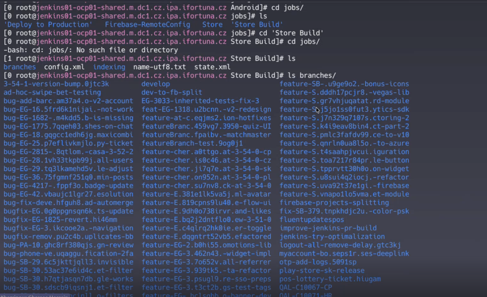
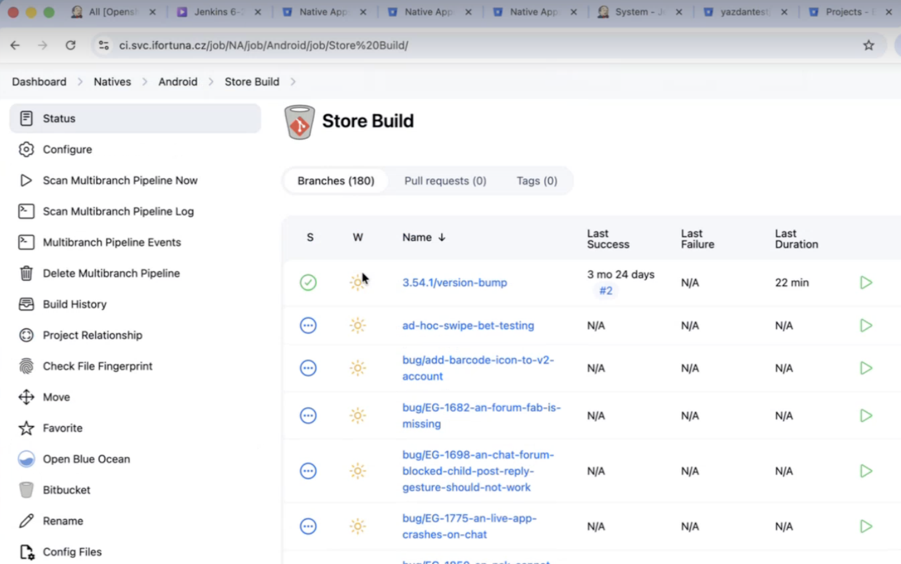
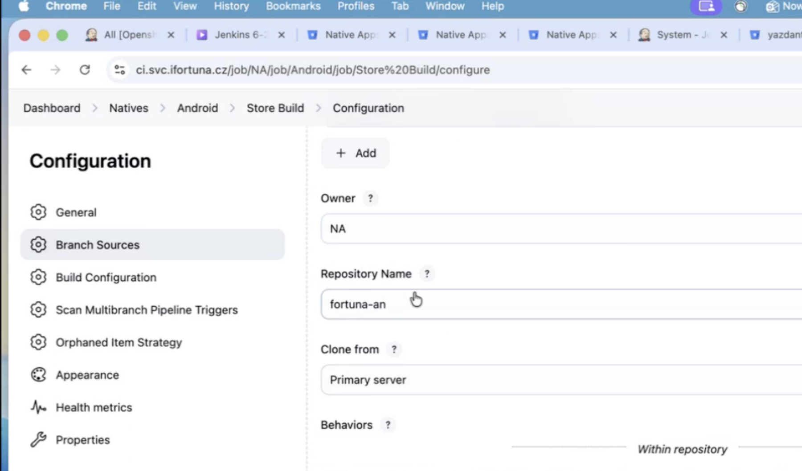
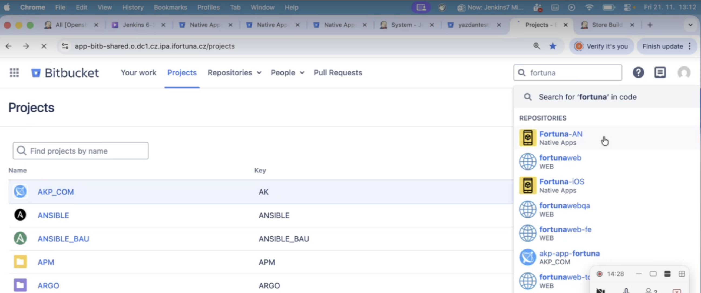
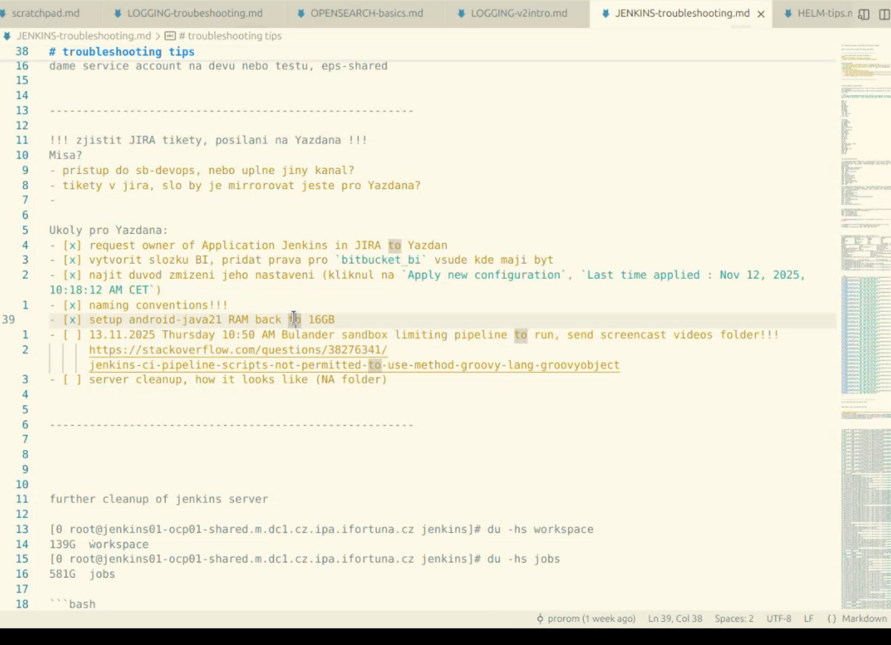

1) yazdan was checking the folders based on their GB size (same as we did in 5.0)

multibranch pipelines

2) he went to Store Build

and we can see all those branches in ui (180):

then he went here -> you can see repository Name in bitbucket:

then in bitbucket search:

# jenkins test

BUT YOU DONT NEED IT...  objection was to find builddiscarder

could be interesting on how to work with test jenkins and how to test on yoru test repo

# roman told smth relevant

