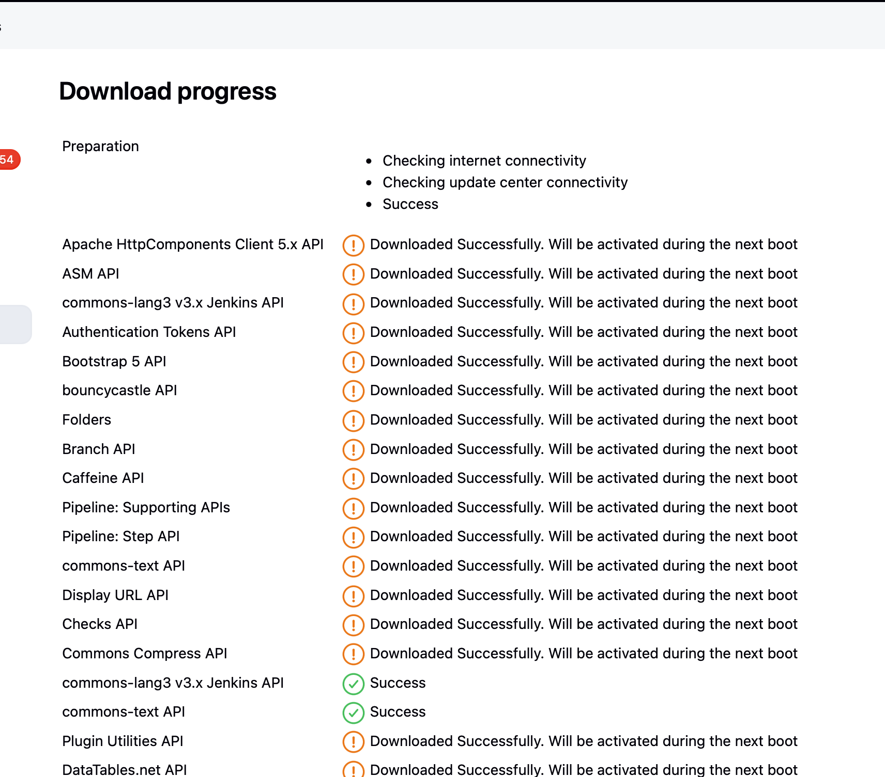
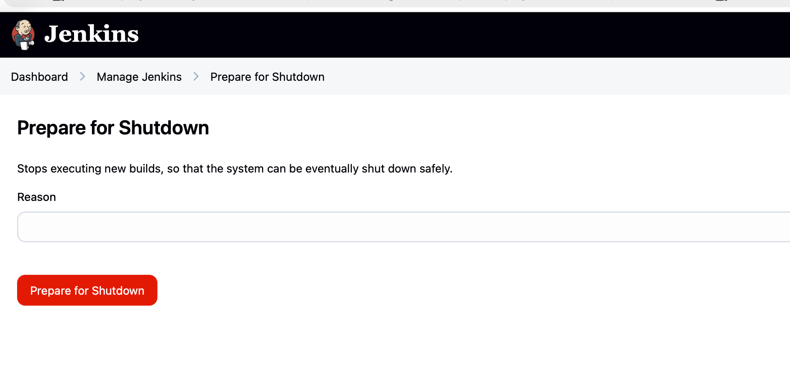
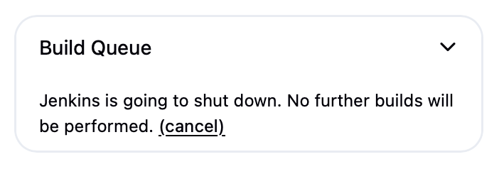
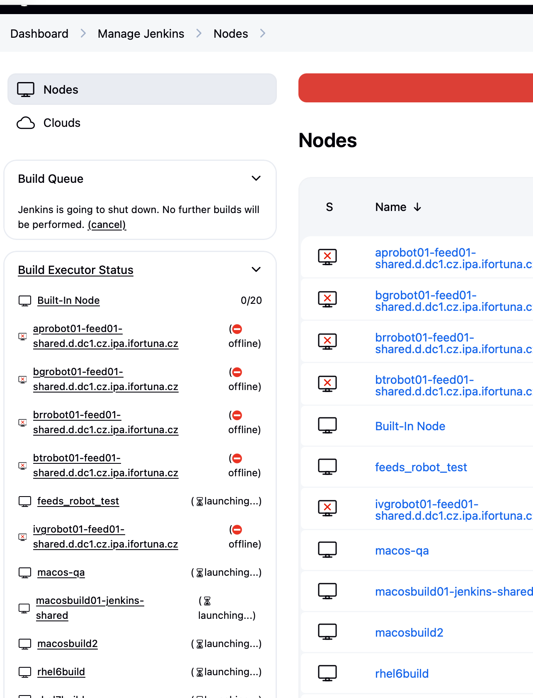
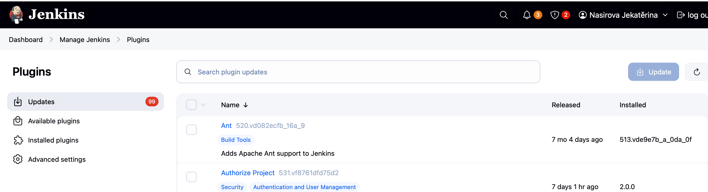

# validation of this batch

no failed plugin/dependency errors
no UI issues


# i removed old backup files to safe disk space
```bash
[0 naseka@ad.ifortuna.cz@el8builder01-ocp01-shared.m.dc1.cz.ipa.ifortuna.cz jenkins]$ sudo du -sh /var/lib/jenkins/plugins*
973M	/var/lib/jenkins/plugins
1.1G	/var/lib/jenkins/plugins.03072024
1.1G	/var/lib/jenkins/plugins.17072024
973M	/var/lib/jenkins/plugins.20260513
1.1G	/var/lib/jenkins/plugins.22052025
1.1G	/var/lib/jenkins/plugins.27062024
1.1G	/var/lib/jenkins/plugins.backup
985M	/var/lib/jenkins/pluginsbackup27062024.tar.gz
926M	/var/lib/jenkins/pluginsprorom.tar.gz
970M	/var/lib/jenkins/pluginsupdated27062024.tar.gz
[0 naseka@ad.ifortuna.cz@el8builder01-ocp01-shared.m.dc1.cz.ipa.ifortuna.cz jenkins]$ sudo rm -rf plugins.03072024
[0 naseka@ad.ifortuna.cz@el8builder01-ocp01-shared.m.dc1.cz.ipa.ifortuna.cz jenkins]$ sudo du -sh /var/lib/jenkins/plugins*
973M	/var/lib/jenkins/plugins
1.1G	/var/lib/jenkins/plugins.17072024
973M	/var/lib/jenkins/plugins.20260513
1.1G	/var/lib/jenkins/plugins.22052025
1.1G	/var/lib/jenkins/plugins.27062024
1.1G	/var/lib/jenkins/plugins.backup
985M	/var/lib/jenkins/pluginsbackup27062024.tar.gz
926M	/var/lib/jenkins/pluginsprorom.tar.gz
970M	/var/lib/jenkins/pluginsupdated27062024.tar.gz
[0 naseka@ad.ifortuna.cz@el8builder01-ocp01-shared.m.dc1.cz.ipa.ifortuna.cz jenkins]$ pwd
/var/lib/jenkins
[0 naseka@ad.ifortuna.cz@el8builder01-ocp01-shared.m.dc1.cz.ipa.ifortuna.cz jenkins]$ sudo rm -rf plugins.17072024 plugins.27062024
[0 naseka@ad.ifortuna.cz@el8builder01-ocp01-shared.m.dc1.cz.ipa.ifortuna.cz jenkins]$ sudo du -sh /var/lib/jenkins/plugins*
973M	/var/lib/jenkins/plugins
973M	/var/lib/jenkins/plugins.20260513
1.1G	/var/lib/jenkins/plugins.22052025
1.1G	/var/lib/jenkins/plugins.backup
985M	/var/lib/jenkins/pluginsbackup27062024.tar.gz
926M	/var/lib/jenkins/pluginsprorom.tar.gz
970M	/var/lib/jenkins/pluginsupdated27062024.tar.gz
[0 naseka@ad.ifortuna.cz@el8builder01-ocp01-shared.m.dc1.cz.ipa.ifortuna.cz jenkins]$ 
```

# create fresh plugin backup

```bash
sudo cp -ar plugins plugins.$(date +%Y%m%d-%H%M%S) # -a = archive mode to preseve things like ownership, permissions etc. -r = recursive meaning copy the whole directory and everythign inside it. plugins is a source directory and plugins.$(date +%Y%m%d-%H%M%S) is destination backup directory name
```
new backup directory is created:

```bash
[0 naseka@ad.ifortuna.cz@el8builder01-ocp01-shared.m.dc1.cz.ipa.ifortuna.cz jenkins]$ sudo du -sh /var/lib/jenkins/plugins*
973M	/var/lib/jenkins/plugins
973M	/var/lib/jenkins/plugins.20260513
973M	/var/lib/jenkins/plugins.20260518-124131 #new one
1.1G	/var/lib/jenkins/plugins.22052025
1.1G	/var/lib/jenkins/plugins.backup
985M	/var/lib/jenkins/pluginsbackup27062024.tar.gz
926M	/var/lib/jenkins/pluginsprorom.tar.gz
970M	/var/lib/jenkins/pluginsupdated27062024.tar.gz
[0 naseka@ad.ifortuna.cz@el8builder01-ocp01-shared.m.dc1.cz.ipa.ifortuna.cz jenkins]$ 
```

# Update first batch

done with first batch (source for first batch is excel):


# Make sure no important jobs are running

Make sure no important jobs are running -> use UI option to prepare for shutdown - immediately new jobs stop from being scheduled:



then check if anything is ongoins:

1. Dashboard -> Build queue should be empty like that:



2. Check Ndoes page that build in node's executors are not busy. should be 0 like here:




# restart jenkins manually

Restart Jenkins manually:

`sudo systemctl restart jenkins`

# perform quick checks

Verify the status:


`sudo systemctl status jenkins`

You can check the log:


`sudo journalctl -u jenkins --since "5 minutes ago" --no-pager | grep -Ei "failed loading plugin|failed to load plugin|unsatisfied dependency|dependency errors"`

In UI:

Dashboard opens
Manage Jenkins opens
Plugins page opens

Now i see 99 updates instead of 154: so it means that 55 updates were performed, but based on excel it was supposed to be 50 updates.. could it be that search in ui gave me udpate for plugin from different batch?! cause i believe in excel i have codes not exact names..




To get clean list of changed plugin IDS:

```bash
sudo diff -qr /var/lib/jenkins/plugins.20260518-124131 /var/lib/jenkins/plugins \
| sed -nE 's#.*/plugins.20260518-124131/([^/]+)/META-INF/MANIFEST.MF.*#\1#p; s#.*/plugins.20260518-124131/([^/]+)\.jpi.*#\1#p; s#Only in /var/lib/jenkins/plugins: ([^/]+)\.jpi#\1#p' \
| sort -u
```

result:
```bash
[0 naseka@ad.ifortuna.cz@el8builder01-ocp01-shared.m.dc1.cz.ipa.ifortuna.cz jenkins]$ sudo diff -qr /var/lib/jenkins/plugins.20260518-124131 /var/lib/jenkins/plugins \
> | sed -nE 's#.*/plugins.20260518-124131/([^/]+)/META-INF/MANIFEST.MF.*#\1#p; s#.*/plugins.20260518-124131/([^/]+)\.jpi.*#\1#p; s#Only in /var/lib/jenkins/plugins: ([^/]+)\.jpi#\1#p' \
> | sort -u
apache-httpcomponents-client-5-api
asm-api
authentication-tokens
bootstrap5-api
bouncycastle-api
branch-api
caffeine-api
checks-api
cloudbees-folder
commons-compress-api
commons-lang3-api
commons-text-api
data-tables-api
display-url-api
echarts-api
eddsa-api
envinject-api
favorite
font-awesome-api
forensics-api
gson-api
handy-uri-templates-2-api
ionicons-api
jackson-annotations2-api
jackson2-api
jakarta-activation-api
jakarta-mail-api
jakarta-xml-bind-api
jaxb
jersey2-api
jjwt-api
joda-time-api
jquery3-api
json-api
json-path-api
jsoup
locale
mina-sshd-api-common
mina-sshd-api-core
oss-symbols-api
parameter-separator
plain-credentials
plugin-util-api
prism-api
scm-api
snakeyaml-api
sse-gateway
ssh-credentials
sshd
structs
timestamper
token-macro
trilead-api
woodstox-core-api
workflow-cps
workflow-job
workflow-step-api
workflow-support
[0 naseka@ad.ifortuna.cz@el8builder01-ocp01-shared.m.dc1.cz.ipa.ifortuna.cz jenkins]$ 
```

variant is not in this list, but was in excel.. 

extra checks: atually it seems that it didnt need an update :)

```bash
[0 naseka@ad.ifortuna.cz@el8builder01-ocp01-shared.m.dc1.cz.ipa.ifortuna.cz jenkins]$ sudo ls -l /var/lib/jenkins/plugins/variant*
-rw-r--r-- 1 jenkins jenkins 9915 Sep 26  2023 /var/lib/jenkins/plugins/variant.bak
-rw-r--r-- 1 jenkins jenkins 9870 Jun 23  2025 /var/lib/jenkins/plugins/variant.jpi

/var/lib/jenkins/plugins/variant:
total 8
drwxr-xr-x 3 jenkins jenkins 4096 Jun 23  2025 META-INF
drwxr-xr-x 3 jenkins jenkins 4096 Jun 23  2025 WEB-INF
[0 naseka@ad.ifortuna.cz@el8builder01-ocp01-shared.m.dc1.cz.ipa.ifortuna.cz jenkins]$ sudo grep -E '^(Short-Name|Long-Name|Plugin-Version):' /var/lib/jenkins/plugins.20260518-124131/variant/META-INF/MANIFEST.MF
Short-Name: variant
Long-Name: Variant Plugin
Plugin-Version: 70.va_d9f17f859e0
[0 naseka@ad.ifortuna.cz@el8builder01-ocp01-shared.m.dc1.cz.ipa.ifortuna.cz jenkins]$ sudo grep -E '^(Short-Name|Long-Name|Plugin-Version):' /var/lib/jenkins/plugins/variant/META-INF/MANIFEST.MF
Short-Name: variant
Long-Name: Variant Plugin
Plugin-Version: 70.va_d9f17f859e0
[0 naseka@ad.ifortuna.cz@el8builder01-ocp01-shared.m.dc1.cz.ipa.ifortuna.cz jenkins]$ 
```