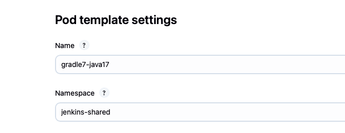
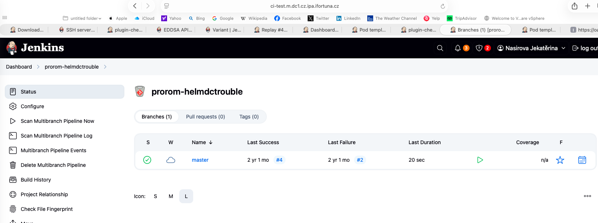
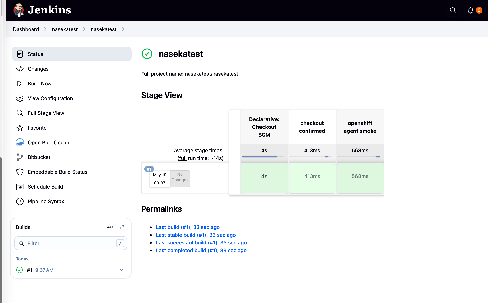

# Validation of this batch

## Smoke pipeline iwth sh, sleep, returnStdout

sample pipeline:

```groovy
pipeline {
    agent any

    stages {
        stage('Smoke') {
            steps {
                sh 'echo smoke-start'
                sh 'sleep 5'
                script {
                    def out = sh(script: 'echo smoke-output', returnStdout: true).trim()
                    echo "Captured: ${out}"
                }
                sh 'echo smoke-end'
            }
        }
    }
}
```

expected result: 

```text
Build starts
Agent/executor is allocated
Console log shows smoke-start
Build waits ~5 seconds
Console log shows Captured: smoke-output
Build finishes SUCCESS
```

i ran this job and all good: plugin-check-workflow-durable-task-step

## checked agent-provisioning

-> i picked 



so modify the label in my test job ( used replay for my job):


pipeline {
  agent {
    kubernetes {
      inheritFrom 'buildah'
    }
  }

  options {
    timeout(time: 10, unit: 'MINUTES')
    skipDefaultCheckout(true)
  }

  stages {
    stage('OpenShift agent smoke') {
      steps {
        container('buildah') {
          sh '''
            echo "node=$NODE_NAME"
            echo "workspace=$WORKSPACE"
            id || true
            pwd
            java -version || true
            buildah version || true
            echo "openshift-agent-ok"
          '''
        }
      }
    }
  }
}


successful run: https://ci-test.m.dc1.cz.ipa.ifortuna.cz/job/plugin-check-workflow-durable-task-step/8/


## Open Multibranch Job

This checks that Jenkins can still load older job configuration and plugin-backed job pages.

Open one existing multibranch pipeline job in UI. You are checking:

```text
Job page opens
Branch list opens
Configure page opens if needed
Scan Multibranch Pipeline option is present
No stack trace / form errors
```

### picked this one:




then run: Scan Multibranch Pipeline Now

Expected results: 

```text
Scan starts
Bitbucket connection works
Branches/PRs are discovered
No credential or SCM API errors
```

all good. 

## created my multibranch job

1. added repo to FEG TOOLS
2. cloned repo to pc
3. added jenkins file with with bulidah template
4. pushed chagnes to bitbucket
5. then created multibranch in jenkins
6. clickced scan multibranch pupeine now
7. finished: Success:




8. pushed changes to jenkins file
9. jenkins automatically triggered pipeline - success

# Create fresh plugin backup

`sudo cp -ar plugins plugins.$(date +%Y%m%d-%H%M%S)`

# Prepare for stutdown

Jenkins UI

# update in ui selected plugins

# restart jenkins
sudo systemctl restart jenkins
sudo systemctl status jenkins

# check logs

sudo journalctl -u jenkins --since "15 minutes ago" --no-pager | grep -Ei "failed loading plugin|failed to load plugin|unsatisfied dependency|dependency errors"

# smoke test

1. ran this job: plugin-check-workflow-durable-task-step
2. pushed changes to nasekatest repo -> it triggered webhook and all worked

second batch success!