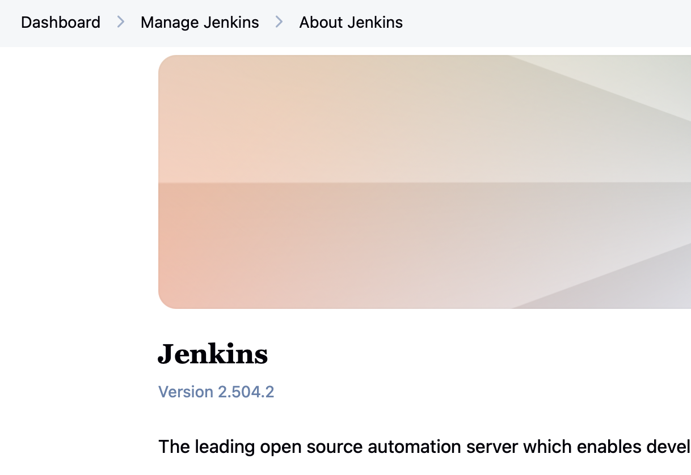

# after 4 batches are updated -> perform a smoke test:

Check plugin dependency/load errors
sudo journalctl -u jenkins --since "30 minutes ago" --no-pager | grep -Ei "failed loading plugin|failed to load plugin|unsatisfied dependency|dependency errors"
Check broader serious errors
sudo journalctl -u jenkins --since "30 minutes ago" --no-pager | grep -Ei "severe|error|exception|failed"
Ignore known offline SSH agent noise if it matches old/pre-existing agents.

UI checks
Open:

Dashboard
Manage Jenkins
Plugins
Credentials
Security
Script Approval
Expected:

pages open
no stack traces
no plugin dependency warnings
login/admin permissions OK
Run smoke jobs
Run your built-in pipeline smoke:

sh
sleep
returnStdout
Then run your nasekatest multibranch job.

Expected markers:

multibranch-checkout-ok
openshift-agent-ok
Finished: SUCCESS
Test multibranch scan
From parent nasekatest multibranch job:

Scan Multibranch Pipeline Now
Expected:

branch indexing succeeds
Jenkinsfile found
branch job remains healthy
Optional but recommended: push/webhook test
Change one harmless echo in Jenkinsfile, commit, push, and do not manually build.

Expected:

Jenkins starts new build automatically
Finished: SUCCESS

# record version after pre-core plugin update

1) i will create new plugins backup prior core
2) i will create yaml backup prior core update
3) record current versions
4) change yaml due to implemented changes in official docs
5) perform actual update


## Before touching anything

Create a rollback point first.

Required:

- VM snapshot in VMware
- backup of Jenkins config
- backup of plugins
- note current Jenkins version:



- note current Java version
- note current plugin versions

Commands on Jenkins Test server:

```bash
sudo systemctl status jenkins
java -version
rpm -qa | grep jenkins
cat /etc/yum.repos.d/jenkins.repo
```

Backup Jenkins config:

```bash
cd /var/lib/jenkins
sudo cp jenkins.yaml jenkins.yaml.$(date +%Y%m%d-%H%M%S)
```

Backup plugins:

```bash
cd /var/lib/jenkins
sudo cp -ar plugins plugins.$(date +%Y%m%d-%H%M%S)
```

Why:

- snapshot gives full rollback
- `jenkins.yaml` backup lets you compare config changes
- plugin backup lets you restore working plugin versions

## Check disk and basic health

Before update, check that Jenkins Test is not already unhealthy.

```bash
df -h
free -h
vmstat 1
sudo journalctl -u jenkins --since "2 hours ago" -o short-iso
```

disk health is ok:

```bash
[0 naseka@ad.ifortuna.cz@el8builder01-ocp01-shared.m.dc1.cz.ipa.ifortuna.cz ~]$ df -h
Filesystem                                 Size  Used Avail Use% Mounted on
devtmpfs                                   7.7G     0  7.7G   0% /dev
tmpfs                                      7.7G  120K  7.7G   1% /dev/shm
tmpfs                                      7.7G  9.0M  7.7G   1% /run
tmpfs                                      7.7G     0  7.7G   0% /sys/fs/cgroup
/dev/mapper/vg_system-lv_root              5.9G  4.0G  1.6G  73% /
/dev/sda1                                  488M  160M  293M  36% /boot
/dev/mapper/vg_system-lv_home              3.5G  309M  3.0G  10% /home
/dev/mapper/vg_system-lv_tmp               2.0G  160K  1.8G   1% /tmp
/dev/mapper/vg_data-lv_opt                  49G   11G   36G  24% /opt
/dev/mapper/vg_system-lv_var               4.9G  2.1G  2.6G  45% /var # here jenkins lives. 
/dev/mapper/vg_system-lv_var_spool_syslog  974M   21M  886M   3% /var/spool/syslog
/dev/mapper/vg_system-lv_var_log           974M   71M  836M   8% /var/log
tmpfs                                      1.6G     0  1.6G   0% /run/user/1025452171
[0 naseka@ad.ifortuna.cz@el8builder01-ocp01-shared.m.dc1.cz.ipa.ifortuna.cz ~]$ 
```
```bash
[0 naseka@ad.ifortuna.cz@el8builder01-ocp01-shared.m.dc1.cz.ipa.ifortuna.cz jenkins]$ sudo du -sh /var/lib/jenkins/* 2>/dev/null | sort -h | tail -20 # command shows the 20 largest top-level items inside Jenkins home, sorted by size
164K	/var/lib/jenkins/config.xmlBACKUP
164K	/var/lib/jenkins/global-build-stats
208K	/var/lib/jenkins/config.xml
348K	/var/lib/jenkins/fingerprints
1.5M	/var/lib/jenkins/logs
6.8M	/var/lib/jenkins/monitoring
6.8M	/var/lib/jenkins/updates
7.0M	/var/lib/jenkins/workspace
70M	/var/lib/jenkins/jobs
72M	/var/lib/jenkins/tmp
926M	/var/lib/jenkins/pluginsprorom.tar.gz
970M	/var/lib/jenkins/pluginsupdated27062024.tar.gz
973M	/var/lib/jenkins/plugins # maybe for the future clean up plugin backups..
973M	/var/lib/jenkins/plugins.20260513
985M	/var/lib/jenkins/pluginsbackup27062024.tar.gz
1.1G	/var/lib/jenkins/plugins.03072024
1.1G	/var/lib/jenkins/plugins.17072024
1.1G	/var/lib/jenkins/plugins.22052025
1.1G	/var/lib/jenkins/plugins.27062024
1.1G	/var/lib/jenkins/plugins.backup