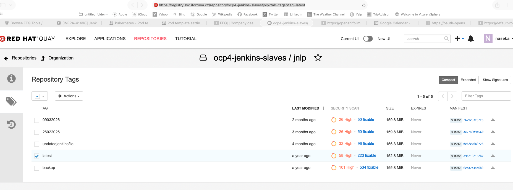
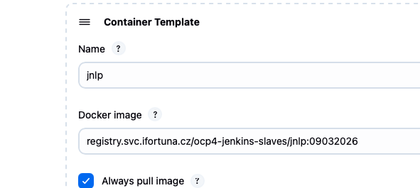
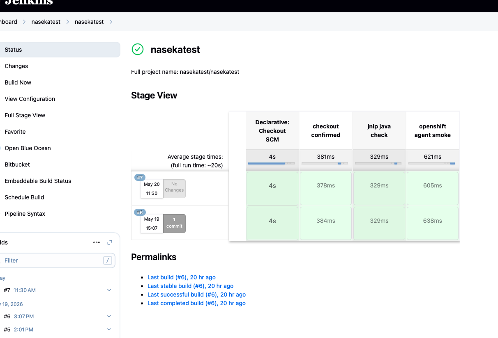
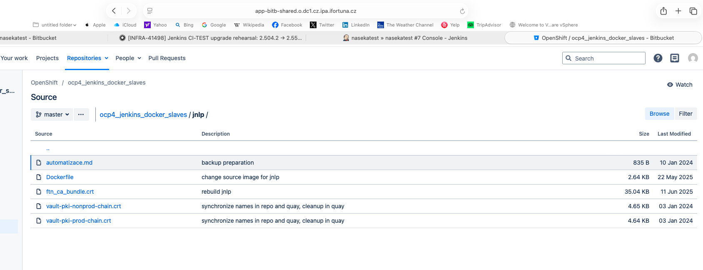
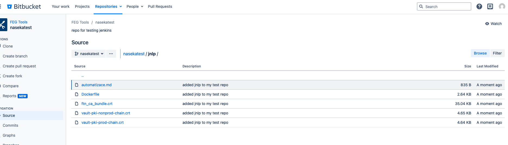
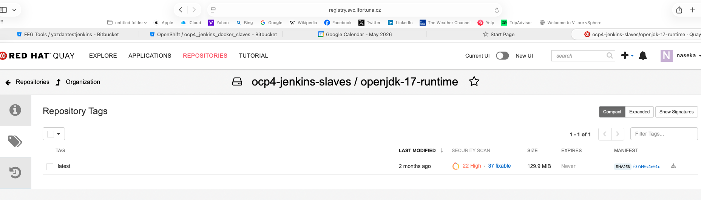

# check jnlp java version

In my smoke, java -version was run inside the buildah container and returned java: command not found; the real Jenkins connection is usually the jnlp container.

Add this stage to the smoke test before core:

stage('jnlp java check') {
  steps {
    sh '''
      echo "container default / agent JVM side"
      command -v java
      java -version
    '''
  }
}
If it prints Java 21 or 25, good. If it prints Java 17, then I need to update the agent image/template before core.

So corrected answer:

Pre-core plugins done.
Controller Java 21 done.
Now verify jenkins.yaml agent image/templates for Java 21/25.
Run smoke that checks Java in the Jenkins agent container.
Only then update Jenkins core.


## i ran this in my test pipeine, and figured that it runs still on Java 17. 

```groovy
pipeline {
    //testing webhook v3
  agent {
    kubernetes {
      inheritFrom 'buildah'
    }
  }

  options {
    timeout(time: 10, unit: 'MINUTES')
  }

  stages {
    stage('checkout confirmed') {
      steps {
        echo "branch=${env.BRANCH_NAME}"
        echo "node=${env.NODE_NAME}"
        sh '''
          pwd
          ls -la
          test -f Jenkinsfile
          echo "multibranch-checkout-ok"
        '''
      }
    }

    stage('jnlp java check') {
      steps {
        sh '''
          echo "checking default Jenkins agent container"
          command -v java
          java -version
        '''
      }
    }

    stage('openshift agent smoke') {
      steps {
        container('buildah') {
          sh '''
            id || true
            buildah version || true
            echo "openshift-agent-ok"
          '''
        }
      }
    }
  }
}
```


So the thing to change is probably this image:

image-registry.openshift-image-registry.svc:5000/shared-images/jnlp:latest


That image currently contains Java 17. You need a jnlp image with Java 21 or Java 25 before Jenkins core update

## change Openshift jnlp agent image used by Jenkins pod templates

at the moment pod is using: image-registry.`openshift-image-registry.svc:5000/shared-images/jnlp:latest`


### check yaml and find where jenkins uses it

```bash
sudo grep -n -A30 -B10 'shared-images/jnlp:latest\|name: "jnlp"\|name: jnlp' jenkins.yaml` # -n = show line numbers; -A30 = show 30 lines after each match' -B10 = show 10 lines before each match ' \| means OR in grep syntax
```

```bash
[0 naseka@ad.ifortuna.cz@el8builder01-ocp01-shared.m.dc1.cz.ipa.ifortuna.cz jenkins]$ sudo grep -n -A30 -B10 'shared-images/jnlp:latest\|name: "jnlp"\|name: jnlp' jenkins.yaml
1051-              key: "SONAR_URL"
1052-              value: "http://sonar-prod.sonar-prod.svc:9000"
1053-          - envVar:
1054-              key: "SONAR_NO_PROXY"
1055-              value: "sonar-prod.sonar-prod.svc"
1056-          - envVar:
1057-              key: "JAVA_OPTS"
1058-              value: "-Xmx2G -Xms1G"
1059-          command: ""
1060-          args: ""
1061:          image: "image-registry.openshift-image-registry.svc:5000/shared-images/jnlp:latest" # OS intenal image format is <registry>/<project>/<imagestream>:<tag> -> meaning registry = image-registry.openshift-image-registry.svc:5000; project   = shared-images;imageStream name = jnlp; tag       = latest
1062-          livenessProbe:
1063-            failureThreshold: 0
1064-            initialDelaySeconds: 0
1065-            periodSeconds: 0
1066-            successThreshold: 0
1067-            timeoutSeconds: 0
1068:          name: "jnlp"
1069-          resourceLimitCpu: "2000m"
1070-          resourceLimitMemory: "3000Mi"
1071-          resourceRequestCpu: "500m"
1072-          resourceRequestMemory: "500Mi"
1073-          workingDir: "/home/jenkins"
1074:        name: "jnlp"
1075-        namespace: "jenkins-shared"
1076-        volumes:
1077-        - persistentVolumeClaim:
1078-            claimName: "pvc-jenkins-ssh"
1079-            mountPath: "/home/jenkins/.ssh/"
1080-            readOnly: false
1081-        yaml: |-
1082-          spec:
1083-            hostAliases:
1084-            - ip: "10.32.75.25"
1085-              hostnames:
1086-              - "jira.myfortuna.eu"
1087-            - ip: "10.0.0.25"
1088-              hostnames:
1089-              - "mujzaznam.myfortuna.eu"
1090-        yamlMergeStrategy: "override"
1091-        yamls:
1092-        - |-
1093-          spec:
1094-            hostAliases:
1095-            - ip: "10.32.75.25"
1096-              hostnames:
1097-              - "jira.myfortuna.eu"
1098-            - ip: "10.0.0.25"
1099-              hostnames:
1100-              - "mujzaznam.myfortuna.eu"
1101-      - containers:
1102-        - alwaysPullImage: true
1103-          envVars:
1104-          - envVar:
[0 naseka@ad.ifortuna.cz@el8builder01-ocp01-shared.m.dc1.cz.ipa.ifortuna.cz jenkins]$ 
```

### check imagestream

```bash

naseka@CZMB94D536 nasekatest % oc get imagestream jnlp # here we got an image stream jnlp
NAME   IMAGE REPOSITORY                                                                                       TAGS     UPDATED
jnlp   default-route-openshift-image-registry.apps.ocp01-shared.m.dc1.cz.ipa.ifortuna.cz/shared-images/jnlp   latest   11 months ago # here it confirms that name is jnlp,project/namespace is shared-images,available tag = latest
naseka@CZMB94D536 nasekatest % oc describe imagestream jnlp # here we show detailed info 
Name:			jnlp
Namespace:		shared-images
Created:		2 years ago
Labels:			<none>
Annotations:		openshift.io/image.dockerRepositoryCheck=2026-01-13T01:29:02Z
Image Repository:	default-route-openshift-image-registry.apps.ocp01-shared.m.dc1.cz.ipa.ifortuna.cz/shared-images/jnlp
Image Lookup:		local=false
Unique Images:		2
Tags:			1

latest
  updates automatically from registry registry.svc.ifortuna.cz/ocp4-jenkins-slaves/jnlp:latest #openshift imports image from here

  * registry.svc.ifortuna.cz/ocp4-jenkins-slaves/jnlp@sha256:e982192152b76fffc0c7a824489c1562bb9af8a094df8f06d588be9d797cc0de
      11 months ago
    registry.svc.ifortuna.cz/ocp4-jenkins-slaves/jnlp@sha256:6cdd7e44b6b92d6eab159c047b759e3a5c9aa2870562e6c5cc72b2d4e2ffa7f3
      2 years ago
naseka@CZMB94D536 nasekatest % 
```

so i know from where image is imported based on the output of command `oc describe imagestream jnlp`: https://registry.svc.ifortuna.cz/repository/ocp4-jenkins-slaves/jnlp?tab=tags&tag=latest


### quay tags



i can see that Quay has newer looing tags.. so check which java those tags contain:

this tag seems to be latest imported to quay: 09032026 ->  https://registry.svc.ifortuna.cz/repository/ocp4-jenkins-slaves/jnlp?tab=tags&tag=09032026

### i just swap the latest tag to the tag imported 2 months ago and see

1) yaml back up creation:

```bash
sudo cp -a jenkins.yaml jenkins.yaml.$(date +%Y%m%d-%H%M%S).before-jnlp-09032026
```

2) editing yaml via swapping jnlp image

PS in vim for search escape forward lashes: /\/shared-images\/jnlp:latest

we swap the openshift imagestream imported image with :latest tag into quay image limnk:

so this

```yaml
image: "image-registry.openshift-image-registry.svc:5000/shared-images/jnlp:latest"
```

changed into this:

```yaml
image: "registry.svc.ifortuna.cz/ocp4-jenkins-slaves/jnlp:09032026"
````

```bash
[0 naseka@ad.ifortuna.cz@el8builder01-ocp01-shared.m.dc1.cz.ipa.ifortuna.cz jenkins]$ diff jenkins.yaml  jenkins.yaml.20260520-090732.before-jnlp-09032026
1061c1061
<           image: "registry.svc.ifortuna.cz/ocp4-jenkins-slaves/jnlp:09032026"
---
>           image: "image-registry.openshift-image-registry.svc:5000/shared-images/jnlp:latest"
[1 naseka@ad.ifortuna.cz@el8builder01-ocp01-shared.m.dc1.cz.ipa.ifortuna.cz jenkins]$ 
```

reflected here:



### rerun my multibranch with java version for jnlp pipeline:



prior the change, meaning with latest tag the version was: 17.0.15 -> now its: 17.0.18

still not suitable


tried this: 26022026 and same result in console log. so i need to create new java 21 image

[Pipeline] { (jnlp java check)
[Pipeline] sh
+ echo 'checking default Jenkins agent container'
checking default Jenkins agent container
+ command -v java
/usr/bin/java
+ java -version
openjdk version "17.0.18" 2026-01-20 LTS
OpenJDK Runtime Environment (Red_Hat-17.0.18.0.8-1) (build 17.0.18+8-LTS)
OpenJDK 64-Bit Server VM (Red_Hat-17.0.18.0.8-1) (build 17.0.18+8-LTS, mixed mode, sharing)


tried this: updatedjenkinsfile, not suitable

+ java -version
openjdk version "17.0.17" 2025-10-21 LTS
OpenJDK Runtime Environment (Red_Hat-17.0.17.0.10-1) (build 17.0.17+10-LTS)
OpenJDK 64-Bit Server VM (Red_Hat-17.0.17.0.10-1) (build 17.0.17+10-LTS, mixed mode, sharing)

### build/publish new janlp with java 21 image

here is the repo:



#### git pull  for jnlp on prod bitbucket

```bash
naseka@CZMB94D536 Devops % ls  
Rapid				jacktime-service		jenkins.log			ocp4-jenkins-agents-java25	ocp4_jenkins_docker_slaves	prod-jenkins-check.txt		romantest			test-jenkins-check.txt
docker				jenkins-shared-library		nasekatest			ocp4-jenkins-agents-service	prod-bitbucket-endpoints.xml	prod-jenkins-xml-files.txt	test-bitbucket-endpoints.xml	test-jenkins-xml-files.txt
naseka@CZMB94D536 Devops % ocp4_jenkins_docker_slave      
naseka@CZMB94D536 Devops % cd ocp4_jenkins_docker_slaves
naseka@CZMB94D536 ocp4_jenkins_docker_slaves % git pull
Already up to date.
naseka@CZMB94D536 ocp4_jenkins_docker_slaves % cd ..
naseka@CZMB94D536 Devops % cd nasekatest
naseka@CZMB94D536 nasekatest % git status
On branch nasekatest
Your branch is up to date with 'origin/nasekatest'.

nothing to commit, working tree clean
naseka@CZMB94D536 nasekatest %
```


#### copy jnlp from remote repo on prod to local naseka repo and push

```bash
naseka@CZMB94D536 nasekatest % cp -R ~/Devops/ocp4_jenkins_docker_slaves/jnlp ./jnlp
naseka@CZMB94D536 nasekatest % ls -la
total 8
drwxr-xr-x   5 naseka  staff  160 May 20 14:26 .
drwxr-xr-x  19 naseka  staff  608 May 19 09:27 ..
drwxr-xr-x  12 naseka  staff  384 May 20 14:23 .git
-rw-r--r--@  1 naseka  staff  874 May 20 14:22 Jenkinsfile
drwxr-xr-x   7 naseka  staff  224 May 20 14:26 jnlp
naseka@CZMB94D536 nasekatest % 
```

result: 



#### inspect/edit Dockerfile:

 ```bash
 sed -n '1,200p' jnlp/Dockerfile # read from 1 through line 200 dockerfile
 ```

inside Dockerfile i can see FROM has java 17, i need to change it:

FROM registry.svc.ifortuna.cz/ocp4-jenkins-slaves/openjdk-17-runtime:latest


```bash
naseka@CZMB94D536 nasekatest % sed -n '1,200p' jnlp/Dockerfile
#FROM czdcm-quay.lx.ifortuna.cz/build-images/ubi9:latest
FROM registry.svc.ifortuna.cz/ocp4-jenkins-slaves/openjdk-17-runtime:latest

ARG gid=1995
ARG uid=1995
ARG group=jenkins
ARG user=jenkins
ARG AGENT_WORKDIR=/home/jenkins/agent

ADD ftn_ca_bundle.crt /etc/pki/ca-trust/source/anchors/
#ADD ca-bundle.crt /etc/pki/ca-trust/source/anchors/ca-bundle.crt
#ADD cz_ipa_new_2.crt /etc/pki/ca-trust/source/anchors/
ADD vault-pki-nonprod-chain.crt /etc/pki/ca-trust/source/anchors/
ADD vault-pki-prod-chain.crt /etc/pki/ca-trust/source/anchors/

# ADD remoting-3107.v665000b_51092.jar /usr/share/jenkins/agent.jar
# ADD jenkins-agent /usr/local/bin/jenkins-agent
# trigger remove-signatures
USER root

RUN set -ex &&\
    chmod 644 /etc/pki/ca-trust/source/anchors/* &&\
    update-ca-trust extract &&\
    userdel default &&\
    groupdel default &&\
    rm -rf /home/default &&\
    groupadd -g "${gid}" "${group}" &&\
    useradd -l -c "Jenkins user" -d /home/"${user}" -u "${uid}" -g "${gid}" -m "${user}" &&\
    mkdir /home/${user}/.jenkins &&\
    mkdir -p "${AGENT_WORKDIR}" &&\
    microdnf install -y --setopt=tsflags=nodocs tar gzip git &&\
    # zatim buildim na lokale tak zakomentovano
    export https_proxy=http://10.0.68.20:3128 &&\
    export http_proxy=http://10.0.68.20:3128 &&\
    export no_proxy=nexus.svc.ifortuna.cz &&\
    #dnf install -y  --setopt=tsflags=nodocs java-17-openjdk-headless git &&\
    # git must be in this image, mount id_rsa and known_hosts from Jenkins GUI from PVC
    release_id=$(curl -L https://api.github.com/repos/jenkinsci/docker-inbound-agent/releases | grep tag_name | head -1 | cut -d\" -f4) &&\
    cd /tmp &&\
    curl -o jenkins-agent.tar.gz -L https://github.com/jenkinsci/docker-inbound-agent/archive/refs/tags/${release_id}.tar.gz &&\
    tar -zxvf jenkins-agent.tar.gz docker-inbound-agent-${release_id}/jenkins-agent &&\
    cp /tmp/docker-inbound-agent-${release_id}/jenkins-agent /usr/local/bin/jenkins-agent &&\
    remoting_id=$(echo ${release_id} | cut -d'-' -f1) &&\
    curl -o /tmp/agent.jar -L https://repo.jenkins-ci.org/public/org/jenkins-ci/main/remoting/${remoting_id}/remoting-${remoting_id}.jar &&\
    mkdir -p /usr/share/jenkins/ &&\
    cp /tmp/agent.jar /usr/share/jenkins/agent.jar &&\
    chown -R jenkins:jenkins /home/jenkins &&\
    chmod 0644 /usr/share/jenkins/agent.jar &&\
    chmod +x /usr/local/bin/jenkins-agent &&\
    ln -sf /usr/share/jenkins/agent.jar /usr/share/jenkins/slave.jar &&\
    ln -s /usr/local/bin/jenkins-agent /usr/local/bin/jenkins-slave &&\
    microdnf clean all &&\
    rm -rf /var/cache/* &&\
    rm -rf /tmp/*

WORKDIR /home/jenkins

USER ${user}

ENTRYPOINT ["/usr/local/bin/jenk
```


so this one is used:



#### check if java 21 runtime image exists

could not find in quay ui

lets try from oc, no clear runtime java21 only image:

```bash
naseka@CZMB94D536 nasekatest % oc login --token=sha256~EdmrpMkN_e0W4ZHtpIFs9gENne9LLGUeduLooc2SaL4 --server=https://api.ocp01-shared.m.dc1.cz.ipa.ifortuna.cz:6443
Logged into "https://api.ocp01-shared.m.dc1.cz.ipa.ifortuna.cz:6443" as "naseka" using the token provided.

You have access to the following projects and can switch between them with 'oc project <projectname>':

    arch
    atlantis
    idm
    isesync
    jenkins
    jenkins-shared
    jenkins-test
    mw
    netbox
    nexus
    openshift-logging
    prometheus
    quay
    revelio
  * shared-images
    sonar
    thanos
    thanos-shared
    tools
    vault
    wulcan

Using project "shared-images".
naseka@CZMB94D536 nasekatest % oc get is -A | grep -Ei 'java|openjdk|jdk'

Error from server (Forbidden): imagestreams.image.openshift.io is forbidden: User "naseka" cannot list resource "imagestreams" in API group "image.openshift.io" at the cluster scope
naseka@CZMB94D536 nasekatest % oc project jenkins
Now using project "jenkins" on server "https://api.ocp01-shared.m.dc1.cz.ipa.ifortuna.cz:6443".
naseka@CZMB94D536 nasekatest % oc get is | grep -Ei 'java|openjdk|jdk'
naseka@CZMB94D536 nasekatest % oc project jenkins-shared
Now using project "jenkins-shared" on server "https://api.ocp01-shared.m.dc1.cz.ipa.ifortuna.cz:6443".
naseka@CZMB94D536 nasekatest % oc get is | grep -Ei 'java|openjdk|jdk'
android-java11             default-route-openshift-image-registry.apps.ocp01-shared.m.dc1.cz.ipa.ifortuna.cz/jenkins-shared/android-java11             latest   19 months ago
maven-node16-java17-xvfb   default-route-openshift-image-registry.apps.ocp01-shared.m.dc1.cz.ipa.ifortuna.cz/jenkins-shared/maven-node16-java17-xvfb   latest   19 months ago
naseka@CZMB94D536 nasekatest % oc project jenkins-test
Now using project "jenkins-test" on server "https://api.ocp01-shared.m.dc1.cz.ipa.ifortuna.cz:6443".
naseka@CZMB94D536 nasekatest % oc get is | grep -Ei 'java|openjdk|jdk'
No resources found in jenkins-test namespace.
naseka@CZMB94D536 nasekatest % oc get is
No resources found in jenkins-test namespace.
naseka@CZMB94D536 nasekatest % oc project shared-images
Now using project "shared-images" on server "https://api.ocp01-shared.m.dc1.cz.ipa.ifortuna.cz:6443".
naseka@CZMB94D536 nasekatest % oc get is | grep -Ei 'java|openjdk|jdk'
android-java11                      default-route-openshift-image-registry.apps.ocp01-shared.m.dc1.cz.ipa.ifortuna.cz/shared-images/android-java11                      latest                                              11 months ago
android-java17                      default-route-openshift-image-registry.apps.ocp01-shared.m.dc1.cz.ipa.ifortuna.cz/shared-images/android-java17                      latest                                              11 months ago
android-java21                      default-route-openshift-image-registry.apps.ocp01-shared.m.dc1.cz.ipa.ifortuna.cz/shared-images/android-java21                      latest                                              11 months ago
gradle6-java11                      default-route-openshift-image-registry.apps.ocp01-shared.m.dc1.cz.ipa.ifortuna.cz/shared-images/gradle6-java11                      latest                                              11 months ago
gradle6-java17                      default-route-openshift-image-registry.apps.ocp01-shared.m.dc1.cz.ipa.ifortuna.cz/shared-images/gradle6-java17                      latest                                              11 months ago
gradle7-java17                      default-route-openshift-image-registry.apps.ocp01-shared.m.dc1.cz.ipa.ifortuna.cz/shared-images/gradle7-java17                      latest                                              11 months ago
gradle7-java17-eps-ubi9             default-route-openshift-image-registry.apps.ocp01-shared.m.dc1.cz.ipa.ifortuna.cz/shared-images/gradle7-java17-eps-ubi9             latest                                              11 months ago
gradle8-java21                      default-route-openshift-image-registry.apps.ocp01-shared.m.dc1.cz.ipa.ifortuna.cz/shared-images/gradle8-java21                      latest                                              11 months ago
maven-java11                        default-route-openshift-image-registry.apps.ocp01-shared.m.dc1.cz.ipa.ifortuna.cz/shared-images/maven-java11                        latest                                              11 months ago
maven-java14                        default-route-openshift-image-registry.apps.ocp01-shared.m.dc1.cz.ipa.ifortuna.cz/shared-images/maven-java14                        latest                                              11 months ago
maven-java16                        default-route-openshift-image-registry.apps.ocp01-shared.m.dc1.cz.ipa.ifortuna.cz/shared-images/maven-java16                        latest                                              11 months ago
maven-java16-native-image           default-route-openshift-image-registry.apps.ocp01-shared.m.dc1.cz.ipa.ifortuna.cz/shared-images/maven-java16-native-image           latest                                              11 months ago
maven-java17                        default-route-openshift-image-registry.apps.ocp01-shared.m.dc1.cz.ipa.ifortuna.cz/shared-images/maven-java17                        latest                                              11 months ago
maven-java17-native-image           default-route-openshift-image-registry.apps.ocp01-shared.m.dc1.cz.ipa.ifortuna.cz/shared-images/maven-java17-native-image           latest                                              11 months ago
maven-java17-qa-java17              default-route-openshift-image-registry.apps.ocp01-shared.m.dc1.cz.ipa.ifortuna.cz/shared-images/maven-java17-qa-java17              latest                                              11 months ago
maven-java18                        default-route-openshift-image-registry.apps.ocp01-shared.m.dc1.cz.ipa.ifortuna.cz/shared-images/maven-java18                        latest                                              11 months ago
maven-java21                        default-route-openshift-image-registry.apps.ocp01-shared.m.dc1.cz.ipa.ifortuna.cz/shared-images/maven-java21                        latest                                              11 months ago
maven-java25                        default-route-openshift-image-registry.apps.ocp01-shared.m.dc1.cz.ipa.ifortuna.cz/shared-images/maven-java25                        latest                                              4 months ago
maven-node14-java17                 default-route-openshift-image-registry.apps.ocp01-shared.m.dc1.cz.ipa.ifortuna.cz/shared-images/maven-node14-java17                 latest                                              11 months ago
maven-node14-java21                 default-route-openshift-image-registry.apps.ocp01-shared.m.dc1.cz.ipa.ifortuna.cz/shared-images/maven-node14-java21                 latest                                              11 months ago
maven-node16-java17                 default-route-openshift-image-registry.apps.ocp01-shared.m.dc1.cz.ipa.ifortuna.cz/shared-images/maven-node16-java17                 latest                                              11 months ago
maven-node16-java17-appium          default-route-openshift-image-registry.apps.ocp01-shared.m.dc1.cz.ipa.ifortuna.cz/shared-images/maven-node16-java17-appium          latest                                              11 months ago
maven-node16-java17-chrome-latest   default-route-openshift-image-registry.apps.ocp01-shared.m.dc1.cz.ipa.ifortuna.cz/shared-images/maven-node16-java17-chrome-latest   latest                                              11 months ago
maven-node16-java17-chrome-v121     default-route-openshift-image-registry.apps.ocp01-shared.m.dc1.cz.ipa.ifortuna.cz/shared-images/maven-node16-java17-chrome-v121     latest                                              11 months ago
maven-node16-java17-xvfb            default-route-openshift-image-registry.apps.ocp01-shared.m.dc1.cz.ipa.ifortuna.cz/shared-images/maven-node16-java17-xvfb            latest                                              11 months ago
maven-node18-java17                 default-route-openshift-image-registry.apps.ocp01-shared.m.dc1.cz.ipa.ifortuna.cz/shared-images/maven-node18-java17                 latest                                              11 months ago
maven-node20-java21                 default-route-openshift-image-registry.apps.ocp01-shared.m.dc1.cz.ipa.ifortuna.cz/shared-images/maven-node20-java21                 latest                                              11 months ago
node22-java25                       default-route-openshift-image-registry.apps.ocp01-shared.m.dc1.cz.ipa.ifortuna.cz/shared-images/node22-java25                       latest                                              2 weeks ago
naseka@CZMB94D536 nasekatest % oc project quay
Now using project "quay" on server "https://api.ocp01-shared.m.dc1.cz.ipa.ifortuna.cz:6443".
naseka@CZMB94D536 nasekatest % oc get is | grep -Ei 'java|openjdk|jdk'
No resources found in quay namespace.
naseka@CZMB94D536 nasekatest % 
```

will check maven-java21

```bash
naseka@CZMB94D536 nasekatest % oc describe is maven-java21
Name:			maven-java21
Namespace:		shared-images
Created:		2 years ago
Labels:			<none>
Annotations:		openshift.io/image.dockerRepositoryCheck=2026-01-12T21:51:26Z
Image Repository:	default-route-openshift-image-registry.apps.ocp01-shared.m.dc1.cz.ipa.ifortuna.cz/shared-images/maven-java21
Image Lookup:		local=false
Unique Images:		3
Tags:			1

latest
  updates automatically from registry registry.svc.ifortuna.cz/ocp4-jenkins-slaves/slave-maven-java21:latest

  * registry.svc.ifortuna.cz/ocp4-jenkins-slaves/slave-maven-java21@sha256:6721bd6199294b499c208eeb73d27cee9916f761130c230a48a7f3093a489eb8
      11 months ago
    registry.svc.ifortuna.cz/ocp4-jenkins-slaves/slave-maven-java21@sha256:597a7c665bced701abb7ff142a1f878ab09d37793715f5aba1d35de7614f72f5
      12 months ago
    registry.svc.ifortuna.cz/ocp4-jenkins-slaves/slave-maven-java21@sha256:75c01c40fa40b0e9ed9f0f62906977be6fc7da250a7cb2b9ea2ea7cd44f08dad
      14 months ago
naseka@CZMB94D536 nasekatest % 
```

checked if the base java 21 is in some dockerfile and found the address: registry.svc.ifortuna.cz/ocp4-jenkins-slaves/slave-base-java21:latest

:

```bash
naseka@CZMB94D536 Devops % ls
Rapid				jacktime-service		jenkins.log			ocp4-jenkins-agents-java25	ocp4_jenkins_docker_slaves	prod-jenkins-check.txt		romantest			test-jenkins-check.txt
docker				jenkins-shared-library		nasekatest			ocp4-jenkins-agents-service	prod-bitbucket-endpoints.xml	prod-jenkins-xml-files.txt	test-bitbucket-endpoints.xml	test-jenkins-xml-files.txt
naseka@CZMB94D536 Devops % cd ocp4_jenkins_docker_slaves
naseka@CZMB94D536 ocp4_jenkins_docker_slaves % find . -maxdepth 2 -iname '*maven*java21*' -o -iname '*java21*'
./slave-maven-node20-java21
./slave-base-java21
./slave-maven-node14-java21
./slave-android-java21
./slave-gradle8-java21
./slave-maven-java21
naseka@CZMB94D536 ocp4_jenkins_docker_slaves % grep -RniE 'FROM .*21|openjdk|java-21|java21' . --include=Dockerfile

./slave-maven-node20-java21/Dockerfile:1:FROM registry.svc.ifortuna.cz/ocp4-jenkins-slaves/slave-maven-java21:latest
./slave-maven-node16-java17-appium/Dockerfile:11:ENV JAVA_HOME=/usr/lib/jvm/java-17-openjdk-17.0.15.0.6-2.el8.x86_64/
./slave-base-java17/Dockerfile:32:    dnf install -y  --setopt=tsflags=nodocs java-17-openjdk-headless java-17-openjdk-devel java-17-openjdk shadow-utils less procps-ng tar gzip curl-devel expat-devel gettext openssl-devel zlib-devel gcc perl-ExtUtils-MakeMaker bzip2 make git git-lfs  &&\
./slave-base-java21/Dockerfile:28:    dnf install -y  --setopt=tsflags=nodocs --disablerepo=FTN_ftn-pg_contrib_\* tar java-21-openjdk-headless java-21-openjdk-devel java-21-openjdk shadow-utils less procps-ng tar gzip curl-devel expat-devel gettext openssl-devel zlib-devel gcc perl-ExtUtils-MakeMaker bzip2 make git git-lfs  &&\
./slave-base-java18/Dockerfile:38:    curl -k -o /tmp/java.tar.gz https://nexus.svc.ifortuna.cz/repository/ifortunarelease/openjdk/openjdk18/${OPEN_JDK_VERSION}/openjdk18-${OPEN_JDK_VERSION}.tar.gz &&\
./slave-base-java11/Dockerfile:30:    dnf install -y  --setopt=tsflags=nodocs java-11-openjdk-headless java-11-openjdk-devel java-11-openjdk shadow-utils less procps-ng tar gzip curl-devel expat-devel gettext openssl-devel zlib-devel gcc perl-ExtUtils-MakeMaker bzip2 make git git-lfs  &&\
./slave-maven-node14-java21/Dockerfile:1:FROM registry.svc.ifortuna.cz/ocp4-jenkins-slaves/slave-maven-java21:latest
./slave-base-java16/Dockerfile:34:    curl -o /tmp/jdk16.tar.gz -fSL  https://nexus.svc.ifortuna.cz/repository/ocp_infra/openjdk/16.0.0/openjdk-16_linux-x64_bin.tar.gz &&\
./slave-node22/Dockerfile:1:FROM registry.svc.ifortuna.cz/ocp4-jenkins-slaves/slave-base-java21:latest
./slave-android-java21/Dockerfile:1:FROM registry.svc.ifortuna.cz/ocp4-jenkins-slaves/slave-base-java21:latest
./slave-maven-java17-native-image/Dockerfile:19:    mv graalvm-community-openjdk-17.0.7+7.1 /usr/lib/jvm &&\
./slave-maven-java17-native-image/Dockerfile:20:    export PATH=/usr/lib/jvm/graalvm-community-openjdk-17.0.7+7.1/bin:$PATH &&\
./slave-maven-java17-native-image/Dockerfile:21:    export JAVA_HOME=/usr/lib/jvm/graalvm-community-openjdk-17.0.7+7.1 &&\
./slave-maven-java17-native-image/Dockerfile:63:ENV GRAALVM_HOME /usr/lib/jvm/graalvm-community-openjdk-17.0.7+7.1
./slave-base-java14/Dockerfile:36:    curl -o /tmp/ojdk14.tar.gz -fSL https://nexus.svc.ifortuna.cz/repository/ifortunarelease/cz/ifortuna/openjdk/14.0.2/openjdk-14.0.2.tar.gz &&\
./slave-gradle8-java21/Dockerfile:1:FROM registry.svc.ifortuna.cz/ocp4-jenkins-slaves/slave-base-java21:latest
./slave-maven-java21/Dockerfile:1:FROM registry.svc.ifortuna.cz/ocp4-jenkins-slaves/slave-base-java21:latest
./slave-gradle7-java17-eps-ubi9/Dockerfile:36:    dnf install -y  --setopt=tsflags=nodocs java-17-openjdk-headless java-17-openjdk-devel java-17-openjdk shadow-utils less procps-ng tar gzip curl-devel expat-devel gettext openssl-devel zlib-devel gcc perl-ExtUtils-MakeMaker bzip2 make git git-lfs  &&\
./slave-node20/Dockerfile:1:FROM registry.svc.ifortuna.cz/ocp4-jenkins-slaves/slave-base-java21:latest
./jnlp/Dockerfile:2:FROM registry.svc.ifortuna.cz/ocp4-jenkins-slaves/openjdk-17-runtime:latest
./jnlp/Dockerfile:36:    #dnf install -y  --setopt=tsflags=nodocs java-17-openjdk-headless git &&\
naseka@CZMB94D536 ocp4_jenkins_docker_slaves % 
```


but i will create openjdk-21-runtime image.

current prod jnlp is based on: 
FROM registry.svc.ifortuna.cz/ocp4-jenkins-slaves/openjdk-17-runtime:latest

# Recommended flow:

Create new image folder:
openjdk-21-runtime/
based on existing:

openjdk-17-runtime/
Change Java install from 17 to 21.

Add/adjust Jenkinsfile build stage for:

openjdk-21-runtime
Build/push:
registry.svc.ifortuna.cz/ocp4-jenkins-slaves/openjdk-21-runtime:latest
or safer first:

registry.svc.ifortuna.cz/ocp4-jenkins-slaves/openjdk-21-runtime:test
Create/update new jnlp-java21 image based on:
FROM registry.svc.ifortuna.cz/ocp4-jenkins-slaves/openjdk-21-runtime:latest
Build/push:
registry.svc.ifortuna.cz/ocp4-jenkins-slaves/jnlp-java21:latest
or test tag first.

In Jenkins Test jenkins.yaml, point jnlp pod template to jnlp-java21.

Run your nasekatest validation.

Only after that, plan prod change.