# Java 21 runtime + JNLP Java 21 image - local OrbStack test flow

Goal:

- create new Java 21 runtime image
- create new JNLP image based on that Java 21 runtime
- test first from my MacBook with OrbStack/Docker
- do not overwrite shared `jnlp:latest`
- do not trigger the real `ocp4_jenkins_docker_slaves` cascade build

Based on my old local image build notes:

- `1.docker_in_docker.md`
- `2.docker_in_docker.md`
- duplicated details in `to_do.md`

Important from my notes:

```text
OrbStack was used on MacBook.
Podman failed on company registry certificate.
Docker with OrbStack worked.
docker build creates image locally inside OrbStack Docker VM.
Local build does not automatically talk to Jenkins.
Local build does not automatically deploy.
Local build does not automatically affect OpenShift.
```

## 0) What must not be touched

Do not overwrite these:

```text
registry.svc.ifortuna.cz/ocp4-jenkins-slaves/jnlp:latest
image-registry.openshift-image-registry.svc:5000/shared-images/jnlp:latest
```

Do not push experimental changes to the real shared agent repo:

```text
~/Devops/ocp4_jenkins_docker_slaves
```

because that repo has Jenkins webhook / agent build pipeline behavior.

Use my test repo:

```text
~/Devops/nasekatest
```

Use new image repositories:

```text
registry.svc.ifortuna.cz/ocp4-jenkins-slaves/openjdk-21-runtime
registry.svc.ifortuna.cz/ocp4-jenkins-slaves/jnlp-java21
```


Use test tag first:

```text
naseka-test-YYYYMMDD
```

Example:

```text
naseka-test-20260520
```

## 1) Create new repositories in Quay first

Because these are new image names, create new Quay repositories first:

```text
ocp4-jenkins-slaves/openjdk-21-runtime
ocp4-jenkins-slaves/jnlp-java21
```

Make them public, same style as existing Jenkins agent image repositories.

This is only creating empty locations. It does not affect existing images.

## 2) Open OrbStack and verify Docker works

From my old notes:

```bash
open -a OrbStack
docker version
docker info
```

The Docker context should be OrbStack.

## 3) Login to registry

From my old notes, use the generated encrypted password / application token quay account settings, which gave me command to login:


```bash
naseka@CZMB94D536 nasekatest % docker login -u='$app' -p='IZJ5R02U0O0K2TNY051LJE3FF42W0VZM7A57E1XGF1ZCFKCNAOMWSKX8OME9U2P0W26KI53TZHNH8VE05JULHHS0CYLNWAADI2C5MS1UCBS7FWEYB7I66A4B' registry.svc.ifortuna.cz
WARNING! Using --password via the CLI is insecure. Use --password-stdin.
Login Succeeded
naseka@CZMB94D536 nasekatest % 
```


Important from old notes: Quay gives the correct repository address. Do not add `/repository/` into the Docker image name.

Correct style:

```text
registry.svc.ifortuna.cz/ocp4-jenkins-slaves/name:tag
```

Wrong style:

```text
registry.svc.ifortuna.cz/repository/ocp4-jenkins-slaves/name:tag
```

## 4) Prepare work only in nasekatest

```bash
cd ~/Devops/nasekatest
git status
```

Important correction after checking my local repos:

```text
~/Devops/ocp4_jenkins_docker_slaves/openjdk-17-runtime
```

does not exist locally.

What exists locally:

```text
~/Devops/ocp4_jenkins_docker_slaves/jnlp
~/Devops/ocp4_jenkins_docker_slaves/slave-base-java17
~/Devops/ocp4_jenkins_docker_slaves/slave-base-java21
```

But `jnlp/Dockerfile` starts from:

```dockerfile
FROM registry.svc.ifortuna.cz/ocp4-jenkins-slaves/openjdk-17-runtime:latest
```

So `openjdk-17-runtime` exists as a Quay image, but I do not currently have its Dockerfile folder locally.

After checking Bitbucket/local files, the actual runtime image flow is in:

```text
ocp4-jenkins-agents-service/Jenkinsfile
```

There, `openjdk-17-runtime` is created like this:

```bash
buildah pull registry.access.redhat.com/ubi9/openjdk-17-runtime:latest
buildah tag registry.access.redhat.com/ubi9/openjdk-17-runtime:latest registry.svc.ifortuna.cz/ocp4-jenkins-slaves/openjdk-17-runtime:latest
buildah push --authfile ~/jsconfig.json --remove-signatures registry.svc.ifortuna.cz/ocp4-jenkins-slaves/openjdk-17-runtime:latest
```

So for Java 21 runtime, I should not look for an `openjdk-17-runtime` folder. I should follow the same pull/tag/push idea, but with Java 21 and a test tag.

First copy the JNLP folder, because that source folder exists:

```bash
cp -R ~/Devops/ocp4_jenkins_docker_slaves/jnlp ./jnlp-java21
```

```bash
naseka@CZMB94D536 nasekatest % cp -R ~/Devops/ocp4_jenkins_docker_slaves/jnlp ./jnlp-java21
naseka@CZMB94D536 nasekatest % ls
Jenkinsfile	jnlp-java21
naseka@CZMB94D536 nasekatest % 
```


After copying, edits must be in `nasekatest`, not in the real shared image repo.

## 5) Create Java 21 runtime from Red Hat runtime image

This replaces my earlier wrong idea about copying `openjdk-17-runtime` folder.

The old Java 17 Jenkinsfile used:

```bash
buildah pull registry.access.redhat.com/ubi9/openjdk-17-runtime:latest
buildah tag registry.access.redhat.com/ubi9/openjdk-17-runtime:latest registry.svc.ifortuna.cz/ocp4-jenkins-slaves/openjdk-17-runtime:latest
buildah push --authfile ~/jsconfig.json --remove-signatures registry.svc.ifortuna.cz/ocp4-jenkins-slaves/openjdk-17-runtime:latest
```

here is jdk21 rintime image on ubi9: https://catalog.redhat.com/en/software/containers/ubi9/openjdk-21-runtime/6501ce769a0d86945c422d5f


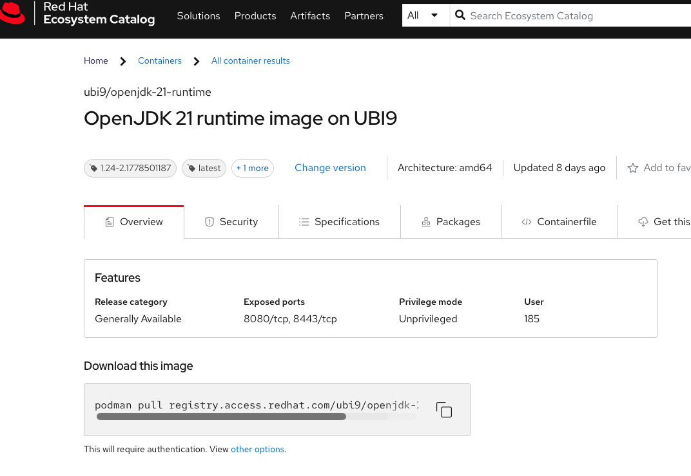


My local OrbStack/Docker equivalent for test Java 21 is:

```bash
TAG="naseka-test-$(date +%Y%m%d)"
echo $TAG

docker pull registry.access.redhat.com/ubi9/openjdk-21-runtime:latest

docker tag \
  registry.access.redhat.com/ubi9/openjdk-21-runtime:latest \
  registry.svc.ifortuna.cz/ocp4-jenkins-slaves/openjdk-21-runtime:$TAG #Take this local image: registry.access.redhat.com/ubi9/openjdk-21-runtime:latest Give it another local name: registry.svc.ifortuna.cz/ocp4-jenkins-slaves/openjdk-21-runtime:$TAG

```

This creates local tag:

```text
registry.svc.ifortuna.cz/ocp4-jenkins-slaves/openjdk-21-runtime:naseka-test-YYYYMMDD
```

```bash
naseka@CZMB94D536 nasekatest % TAG="naseka-test-$(date +%Y%m%d)"
naseka@CZMB94D536 nasekatest % echo $TAG
naseka-test-20260520
naseka@CZMB94D536 nasekatest % docker pull registry.access.redhat.com/ubi9/openjdk-21-runtime:latest
latest: Pulling from ubi9/openjdk-21-runtime
07b48350f339: Pull complete 
773f8db8dd4a: Pull complete 
Digest: sha256:6da5275dbb0148f3821e3f73fb3116522bee6f2a0d55e446f506607c75f77b4b
Status: Downloaded newer image for registry.access.redhat.com/ubi9/openjdk-21-runtime:latest
registry.access.redhat.com/ubi9/openjdk-21-runtime:latest
naseka@CZMB94D536 nasekatest % docker tag \
> registry.access.redhat.com/ubi9/openjdk-21-runtime:latest \
> registry.svc.ifortuna.cz/ocp4-jenkins-slaves/openjdk-21-runtime:$TAG
naseka@CZMB94D536 nasekatest % 
```


Important:

```text
Do not tag/push openjdk-21-runtime:latest during first test.
Do not change openjdk-17-runtime:latest.
```

## 6) Verify Java 21 runtime locally before push

Check local image exists:

```bash
docker images | grep openjdk-21-runtime
```
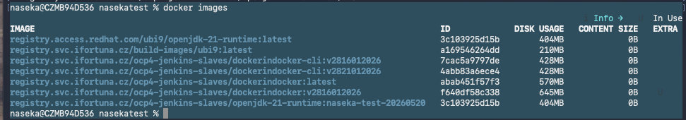


Inspect metadata:

```bash
docker inspect registry.svc.ifortuna.cz/ocp4-jenkins-slaves/openjdk-21-runtime:$TAG
```

!!! issue is architecture... i have arm64 but it shoudl be --platform linux/amd64.. so pull new image!

removing images: 

```bash
naseka@CZMB94D536 nasekatest % docker rmi registry.svc.ifortuna.cz/ocp4-jenkins-slaves/openjdk-21-runtime:$TAG
Untagged: registry.svc.ifortuna.cz/ocp4-jenkins-slaves/openjdk-21-runtime:naseka-test-20260520
naseka@CZMB94D536 nasekatest % docker rmi registry.access.redhat.com/ubi9/openjdk-21-runtime:latest
Untagged: registry.access.redhat.com/ubi9/openjdk-21-runtime:latest
Untagged: registry.access.redhat.com/ubi9/openjdk-21-runtime@sha256:6da5275dbb0148f3821e3f73fb3116522bee6f2a0d55e446f506607c75f77b4b
Deleted: sha256:3c103925d15b0db89fa01f91e46a757292fbb32aebd7c6422551f0d5dc099656
Deleted: sha256:46637ff34e85f7e91189320d23402a3e8ad4c9149ebda730d61576f1730df631
Deleted: sha256:ef5bd95cedc07d6b2d154b411aa19705f42f92d3a1dad17205590d2ad5c8cbd5
naseka@CZMB94D536 nasekatest % 
```

new pull:

```bash
docker pull --platform linux/amd64 registry.access.redhat.com/ubi9/openjdk-21-runtime:latest
```

```bash
naseka@CZMB94D536 nasekatest % docker pull --platform linux/amd64 registry.access.redhat.com/ubi9/openjdk-21-runtime:latest

latest: Pulling from ubi9/openjdk-21-runtime
34f4a557df81: Pull complete 
6c39dcccc070: Pull complete 
Digest: sha256:6da5275dbb0148f3821e3f73fb3116522bee6f2a0d55e446f506607c75f77b4b
Status: Downloaded newer image for registry.access.redhat.com/ubi9/openjdk-21-runtime:latest
registry.access.redhat.com/ubi9/openjdk-21-runtime:latest
naseka@CZMB94D536 nasekatest % 
```

then tag again:
```bash
docker tag \
  registry.access.redhat.com/ubi9/openjdk-21-runtime:latest \
  registry.svc.ifortuna.cz/ocp4-jenkins-slaves/openjdk-21-runtime:$TAG
```


verify architecture:

```bash
docker inspect registry.svc.ifortuna.cz/ocp4-jenkins-slaves/openjdk-21-runtime:$TAG | grep -E '"Architecture"|"JAVA_VERSION"'
```


dont see java.. but ar=chitecture is ocrrect

```bash
naseka@CZMB94D536 nasekatest % docker inspect registry.svc.ifortuna.cz/ocp4-jenkins-slaves/openjdk-21-runtime:$TAG | grep -E '"Architecture"|"JAVA_VERSION"'

        "Architecture": "amd64",
naseka@CZMB94D536 nasekatest % 
```


docker run

```bash
naseka@CZMB94D536 nasekatest % docker run --rm -it \
  registry.svc.ifortuna.cz/ocp4-jenkins-slaves/openjdk-21-runtime:$TAG \
  java -version

WARNING: The requested image's platform (linux/amd64) does not match the detected host platform (linux/arm64/v8) and no specific platform was requested
openjdk version "21.0.11" 2026-04-21 LTS
OpenJDK Runtime Environment (Red_Hat-21.0.11.0.10-1) (build 21.0.11+10-LTS)
OpenJDK 64-Bit Server VM (Red_Hat-21.0.11.0.10-1) (build 21.0.11+10-LTS, mixed mode, sharing)
naseka@CZMB94D536 nasekatest % 
```


## 8) Push Java 21 runtime to Quay

Only after local verification:

now we push ready image to quay:
```bash
docker push registry.svc.ifortuna.cz/ocp4-jenkins-slaves/openjdk-21-runtime:$TAG
```

so i have:

```bash
naseka@CZMB94D536 nasekatest % docker push registry.svc.ifortuna.cz/ocp4-jenkins-slaves/openjdk-21-runtime:$TAG

The push refers to repository [registry.svc.ifortuna.cz/ocp4-jenkins-slaves/openjdk-21-runtime]
56ab53616512: Pushed 
04b86c83948d: Pushed 
naseka-test-20260520: digest: sha256:bb69b409d031f5bdc1035449b31554487dd54603b80b799c2a6542bfecb1b887 size: 742
naseka@CZMB94D536 nasekatest % 
```


Verify in Quay repository tags:

```text
ocp4-jenkins-slaves/openjdk-21-runtime
tag: naseka-test-YYYYMMDD
```


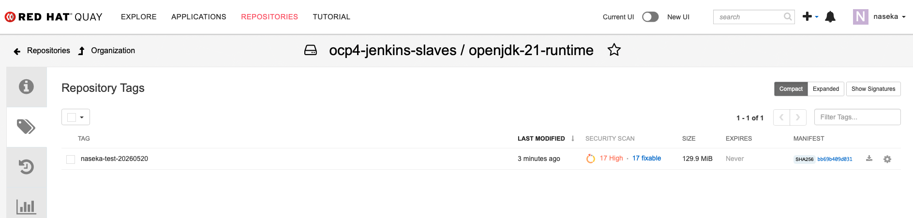


## 9) Edit JNLP Java 21 Dockerfile

Open dockerfile of new jnlp and modify FROM:

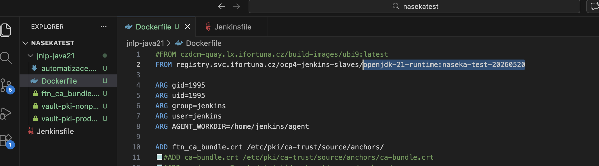

Change the `FROM` line to use my tested Java 21 runtime tag:

```dockerfile
FROM registry.svc.ifortuna.cz/ocp4-jenkins-slaves/openjdk-21-runtime:naseka-test-YYYYMMDD
```

Use the exact `$TAG` built and pushed above.

Do not use this during test:

```dockerfile
FROM registry.svc.ifortuna.cz/ocp4-jenkins-slaves/openjdk-21-runtime:latest
```

Do not change the old shared JNLP image:

```text
registry.svc.ifortuna.cz/ocp4-jenkins-slaves/jnlp:latest
```

## 10) Build JNLP Java 21 locally


first change to folder, which has dockerfile:

```bash
cd ~/Devops/nasekatest/jnlp-java21
```

Then run docker build:

`.` means use the current folder as build context, so docker will look for docker file inside that location

```bash
docker build \
  --platform linux/amd64 \
  -t registry.svc.ifortuna.cz/ocp4-jenkins-slaves/jnlp-java21:$TAG \
  .
```
got error:

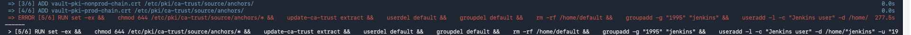

i have commented removed block of code out, which mentions proxies. cause we only build locally for now. 

then i try to rebuild:

```bash
cd ~/Devops/nasekatest/jnlp-java21

docker build \
  --platform linux/amd64 \
  -t registry.svc.ifortuna.cz/ocp4-jenkins-slaves/jnlp-java21:$TAG \
  .
```
SUCCESS:

```bash
naseka@CZMB94D536 jnlp-java21 % docker build \
  --platform linux/amd64 \
  -t registry.svc.ifortuna.cz/ocp4-jenkins-slaves/jnlp-java21:$TAG \
  .
[+] Building 17.2s (11/11) FINISHED                                                                                                                                                                                                                          docker:orbstack
 => [internal] load build definition from Dockerfile                                                                                                                                                                                                                    0.0s
 => => transferring dockerfile: 2.40kB                                                                                                                                                                                                                                  0.0s
 => [internal] load metadata for registry.svc.ifortuna.cz/ocp4-jenkins-slaves/openjdk-21-runtime:naseka-test-20260520                                                                                                                                                   0.0s
 => [internal] load .dockerignore                                                                                                                                                                                                                                       0.0s
 => => transferring context: 2B                                                                                                                                                                                                                                         0.0s
 => [1/6] FROM registry.svc.ifortuna.cz/ocp4-jenkins-slaves/openjdk-21-runtime:naseka-test-20260520                                                                                                                                                                     0.0s
 => [internal] load build context                                                                                                                                                                                                                                       0.0s
 => => transferring context: 131B                                                                                                                                                                                                                                       0.0s
 => CACHED [2/6] ADD ftn_ca_bundle.crt /etc/pki/ca-trust/source/anchors/                                                                                                                                                                                                0.0s
 => CACHED [3/6] ADD vault-pki-nonprod-chain.crt /etc/pki/ca-trust/source/anchors/                                                                                                                                                                                      0.0s
 => CACHED [4/6] ADD vault-pki-prod-chain.crt /etc/pki/ca-trust/source/anchors/                                                                                                                                                                                         0.0s
 => [5/6] RUN set -ex &&    chmod 644 /etc/pki/ca-trust/source/anchors/* &&    update-ca-trust extract &&    userdel default &&    groupdel default &&    rm -rf /home/default &&    groupadd -g "1995" "jenkins" &&    useradd -l -c "Jenkins user" -d /home/"jenkin  16.9s
 => [6/6] WORKDIR /home/jenkins                                                                                                                                                                                                                                         0.0s
 => exporting to image                                                                                                                                                                                                                                                  0.2s 
 => => exporting layers                                                                                                                                                                                                                                                 0.2s 
 => => writing image sha256:cec1692e43a215612400a73c3374b1ba6f87dfe044ed34e6377f2f118c9571c3                                                                                                                                                                            0.0s 
 => => naming to registry.svc.ifortuna.cz/ocp4-jenkins-slaves/jnlp-java21:naseka-test-20260520                                                                                                                                                                          0.0s 
naseka@CZMB94D536 jnlp-java21 % 

```


## 11) Verify JNLP Java 21 locally before push

Check image exists:

```bash
docker images | grep jnlp-java21
```

Inspect metadata:

```bash
docker inspect registry.svc.ifortuna.cz/ocp4-jenkins-slaves/jnlp-java21:$TAG
```

Run it:

```bash
naseka@CZMB94D536 jnlp-java21 % docker run --rm -it \
  --entrypoint sh \
  registry.svc.ifortuna.cz/ocp4-jenkins-slaves/jnlp-java21:$TAG \
  -c 'java -version'

WARNING: The requested image's platform (linux/amd64) does not match the detected host platform (linux/arm64/v8) and no specific platform was requested
openjdk version "21.0.11" 2026-04-21 LTS
OpenJDK Runtime Environment (Red_Hat-21.0.11.0.10-1) (build 21.0.11+10-LTS)
OpenJDK 64-Bit Server VM (Red_Hat-21.0.11.0.10-1) (build 21.0.11+10-LTS, mixed mode, sharing)
naseka@CZMB94D536 jnlp-java21 % 
```


## 12) Push JNLP Java 21 to Quay

Only after local verification:

```bash
docker push registry.svc.ifortuna.cz/ocp4-jenkins-slaves/jnlp-java21:$TAG
```

Verify in Quay repository tags:

```text
ocp4-jenkins-slaves/jnlp-java21
tag: naseka-test-YYYYMMDD
```
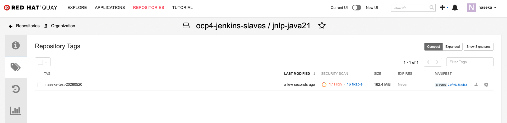


## 13) Optional: ImageStream or direct registry image

For first Test Jenkins validation, direct registry image is simpler:

```yaml
image: "registry.svc.ifortuna.cz/ocp4-jenkins-slaves/jnlp-java21:naseka-test-YYYYMMDD"
```

If using direct registry image, I do not need a new ImageStream immediately.

ImageStream is relevant only if I want OpenShift internal cached style like:

```text
image-registry.openshift-image-registry.svc:5000/shared-images/jnlp-java21:latest
```

For test, avoid touching existing:

```text
shared-images/jnlp:latest
```

## 14) Change only Test Jenkins jenkins.yaml

On Test Jenkins server, backup first:

```bash
sudo cp -a jenkins.yaml jenkins.yaml.$(date +%Y%m%d-%H%M%S).before-jnlp-java21-test
```

Current shared JNLP image:

```yaml
image: "image-registry.openshift-image-registry.svc:5000/shared-images/jnlp:latest"
```

For test only, change to:

```yaml
image: "registry.svc.ifortuna.cz/ocp4-jenkins-slaves/jnlp-java21:naseka-test-YYYYMMDD"
```

Do this only in Test Jenkins.

Do not change prod.

First i did change in UI for a quick test:

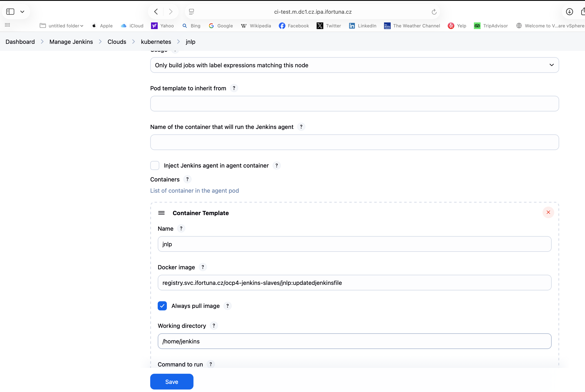


## 15) Validate from nasekatest pipeline

Use a stage that runs in the default Jenkins agent / JNLP side:

```groovy
stage('jnlp java check') {
  steps {
    sh '''
      echo "checking default Jenkins agent container"
      command -v java
      java -version
    '''
  }
}
```

Expected:

```text
Java 21
```

SUCCSESS!!

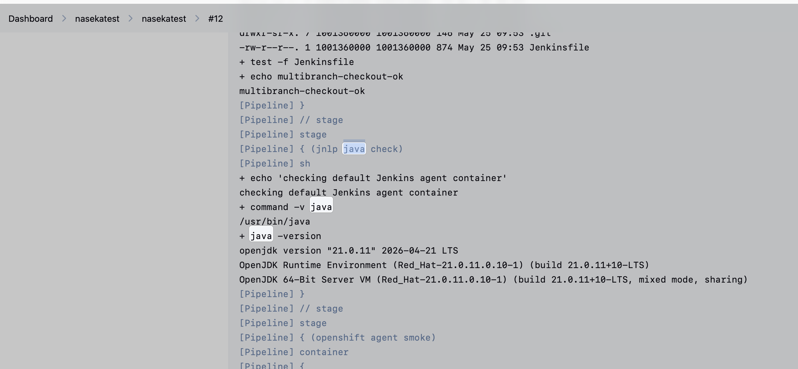


## 16) Check actual OpenShift pod image

Use the Test Jenkins namespace where agent pods are created, likely:

```bash
oc project jenkins-test
oc get pods
```

Then check the build pod:

```bash
oc get pod <pod-name> -o yaml | grep -A3 -B3 jnlp-java21 # -0 yaml = print the full pod definistion in yaml format THEN search insdie that yaml outut for the text jnlp-java21
```

Expected image:

```text
registry.svc.ifortuna.cz/ocp4-jenkins-slaves/jnlp-java21:naseka-test-YYYYMMDD
```


I added sleep into reply pipeline to have time to check pod

Result:

```bash
naseka@CZMB94D536 jnlp-java21 % oc get pods
NAME                                         READY   STATUS    RESTARTS   AGE
nasekatest-nasekatest-16-qk431-j4zdv-jvslk   2/2     Running   0          6s
romantest-master-29-2qshm-w0rqv-1nxcb        2/2     Running   0          33d
romantest-master-29-2qshm-w0rqv-39mnz        2/2     Running   0          33d
romantest-master-29-2qshm-w0rqv-cht58        2/2     Running   0          33d
romantest-master-29-2qshm-w0rqv-ppjnh        2/2     Running   0          33d
naseka@CZMB94D536 jnlp-java21 % oc get pod nasekatest-nasekatest-16-qk431-j4zdv-jvslk -o yaml | grep -A3 -B3 jnlp-java21
      value: https://ci-test.m.dc1.cz.ipa.ifortuna.cz/
    - name: SONAR_URL
      value: http://sonar-prod.sonar-prod.svc:9000
    image: registry.svc.ifortuna.cz/ocp4-jenkins-slaves/jnlp-java21:naseka-test-20260520
    imagePullPolicy: Always
    name: jnlp
    resources:
--
      readOnly: true
      recursiveReadOnly: Disabled
  - containerID: cri-o://53eb7735e40e24d6c5c5f3d1ade12e799568b6d523941e26e8f42e881e598c05
    image: registry.svc.ifortuna.cz/ocp4-jenkins-slaves/jnlp-java21:naseka-test-20260520
    imageID: registry.svc.ifortuna.cz/ocp4-jenkins-slaves/jnlp-java21@sha256:2af467834da38962c0bc527de9936b9c6135a8caead2ceb35444e00c1685b629
    lastState: {}
    name: jnlp
    ready: true
naseka@CZMB94D536 jnlp-java21 % 
```

i also can see in console output that java version is correct:

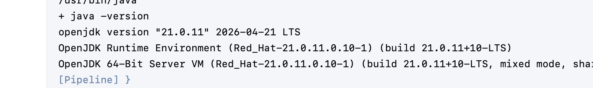


i create an image stream:

```bash
oc import-image jnlp-java21:naseka-test-20260520 \
  --from=registry.svc.ifortuna.cz/ocp4-jenkins-slaves/jnlp-java21:naseka-test-20260520 \
  --reference-policy=local \
  --confirm \
  -n shared-images
  ```

i dont have permissions and i think i have permissions for jenkins namespace instead! so:

```bash
oc import-image jnlp-java21:naseka-test-20260520 \
  --from=registry.svc.ifortuna.cz/ocp4-jenkins-slaves/jnlp-java21:naseka-test-20260520 \
  --reference-policy=local \
  --confirm \
  -n jenkins
  ```


Internal registry sevice format is:

`image-registry.openshift-image-registry.svc:5000/<namespace>/<imagestream>:<tag>`

so my will be:

`image-registry.openshift-image-registry.svc:5000/jenkins/jnlp-java21:naseka-test-20260520`

I put that new address in ui:


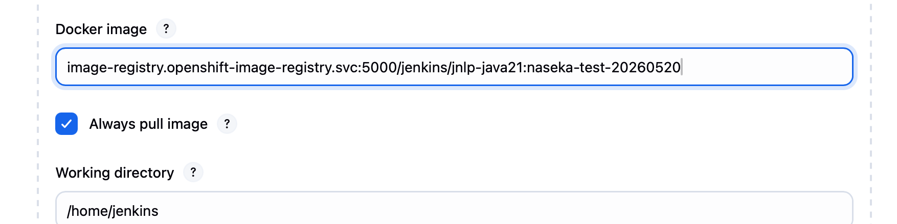

i run the job again:

1) i checked running pods in jenkins-test and i can see the regisry there:

```bash
naseka@CZMB94D536 jnlp-java21 % oc get pods
NAME                                         READY   STATUS    RESTARTS   AGE
nasekatest-nasekatest-18-rwqcd-gz6f3-bq17q   2/2     Running   0          5s
romantest-master-29-2qshm-w0rqv-1nxcb        2/2     Running   0          33d
romantest-master-29-2qshm-w0rqv-39mnz        2/2     Running   0          33d
romantest-master-29-2qshm-w0rqv-cht58        2/2     Running   0          33d
romantest-master-29-2qshm-w0rqv-ppjnh        2/2     Running   0          33d
naseka@CZMB94D536 jnlp-java21 % oc get pod nasekatest-nasekatest-18-rwqcd-gz6f3-bq17q -o yaml | grep -A3 -B3 jnlp-java21 
      value: https://ci-test.m.dc1.cz.ipa.ifortuna.cz/
    - name: SONAR_URL
      value: http://sonar-prod.sonar-prod.svc:9000
    image: image-registry.openshift-image-registry.svc:5000/jenkins/jnlp-java21:naseka-test-20260520
    imagePullPolicy: Always
    name: jnlp
    resources:
--
      readOnly: true
      recursiveReadOnly: Disabled
  - containerID: cri-o://1a387b4fa60d9d390c937827d7bb067b2aec40014b0da719890da9f1813e12c2
    image: image-registry.openshift-image-registry.svc:5000/jenkins/jnlp-java21:naseka-test-20260520
    imageID: image-registry.openshift-image-registry.svc:5000/jenkins/jnlp-java21@sha256:2af467834da38962c0bc527de9936b9c6135a8caead2ceb35444e00c1685b629
    lastState: {}
    name: jnlp
    ready: true
naseka@CZMB94D536 jnlp-java21 % 
```

2) checked console output again for java version: all good

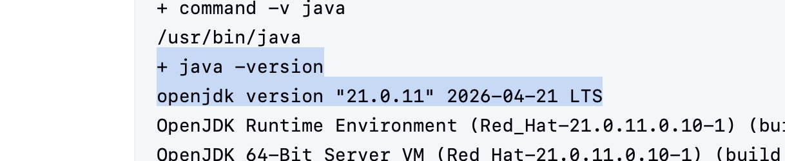


3) change yaml (after backup)


If checking ImageStreams:

```bash
oc get imagestream jnlp -n shared-images
```

But for direct registry image, `jnlp-java21` may not exist as an ImageStream yet, and that is OK.

## 17) Stop conditions

Stop immediately if any command/output shows:

```text
registry.svc.ifortuna.cz/ocp4-jenkins-slaves/jnlp:latest
image-registry.openshift-image-registry.svc:5000/shared-images/jnlp:latest
openjdk-21-runtime:latest
jnlp-java21:latest
```

during first test.

First test must use:

```text
openjdk-21-runtime:naseka-test-YYYYMMDD
jnlp-java21:naseka-test-YYYYMMDD
```

## 18) What is safe here

Safe:

```text
docker build locally in OrbStack
docker images
docker inspect
docker run --rm -it
pushing new repo + test tag
changing only Test Jenkins jenkins.yaml
running nasekatest validation
```

Not safe unless planned:

```text
pushing to real ocp4_jenkins_docker_slaves repo
triggering real Jenkins agent image-builder job
changing shared-images/jnlp:latest
changing ocp4-jenkins-slaves/jnlp:latest
changing prod Jenkins jenkins.yaml
```
