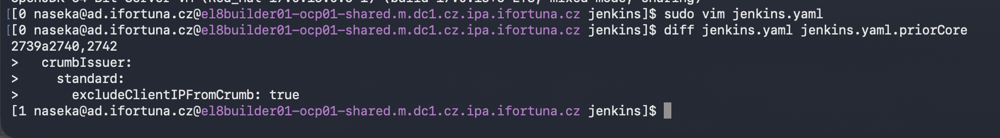
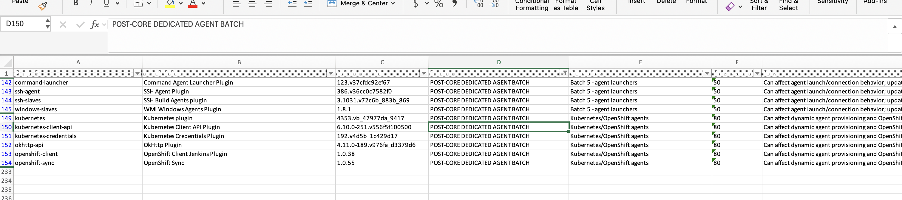
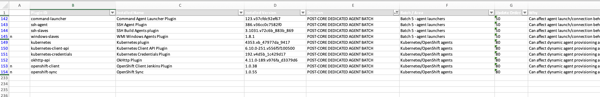
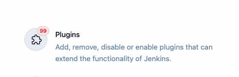
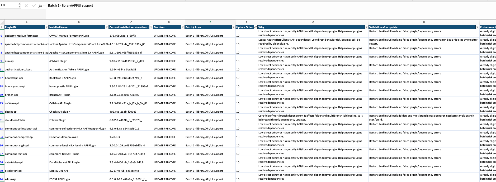
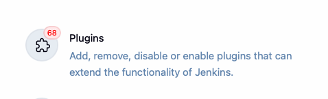
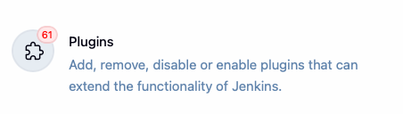
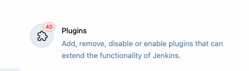
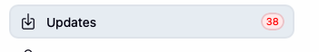

1) i did backups of plugins and yaml
2) i did document the version of jenkins prior udpate
3) i did playgins pre core udpate
4) now i need to change yaml: modified -> removed this:


5) apply changes in UI
6) run: 

sudo systemctl stop jenkins
sudo dnf update jenkins
sudo systemctl daemon-reload
sudo systemctl start jenkins
sudo systemctl status jenkins

7) troubleshooting: 

`sudo systemctl status jenkins -l --no-pager`

```bash
[130 naseka@ad.ifortuna.cz@el8builder01-ocp01-shared.m.dc1.cz.ipa.ifortuna.cz ~]$ sudo systemctl status jenkins -l --no-pager
● jenkins.service - Jenkins Continuous Integration Server
   Loaded: loaded (/usr/lib/systemd/system/jenkins.service; enabled; vendor preset: disabled)
  Drop-In: /etc/systemd/system/jenkins.service.d
           └─override.conf
   Active: failed (Result: exit-code) since Mon 2026-05-25 12:39:20 UTC; 20h ago
  Process: 552682 ExecStart=/usr/bin/jenkins (code=exited, status=5)
 Main PID: 552682 (code=exited, status=5)
   Status: "Jenkins stopped"

May 25 12:38:59 el8builder01-ocp01-shared.m.dc1.cz.ipa.ifortuna.cz jenkins[552682]: 2026-05-25 12:38:59.765+0000 [id=190]        WARNING        h.plugins.sshslaves.SSHLauncher#shutdownAndAwaitTerminationOfLauncher: launcherExecutorService thread pool did not terminate cleanly
May 25 12:38:59 el8builder01-ocp01-shared.m.dc1.cz.ipa.ifortuna.cz jenkins[552682]: 2026-05-25 12:38:59.767+0000 [id=191]        WARNING        h.plugins.sshslaves.SSHLauncher#shutdownAndAwaitTerminationOfLauncher: launcherExecutorService thread pool did not terminate cleanly
May 25 12:38:59 el8builder01-ocp01-shared.m.dc1.cz.ipa.ifortuna.cz jenkins[552682]: 2026-05-25 12:38:59.768+0000 [id=216]        WARNING        h.plugins.sshslaves.SSHLauncher#shutdownAndAwaitTerminationOfLauncher: launcherExecutorService thread pool did not terminate cleanly
May 25 12:38:59 el8builder01-ocp01-shared.m.dc1.cz.ipa.ifortuna.cz jenkins[552682]: 2026-05-25 12:38:59.770+0000 [id=224]        WARNING        h.plugins.sshslaves.SSHLauncher#shutdownAndAwaitTerminationOfLauncher: launcherExecutorService thread pool did not terminate cleanly
May 25 12:39:20 el8builder01-ocp01-shared.m.dc1.cz.ipa.ifortuna.cz systemd[1]: jenkins.service: Main process exited, code=exited, status=5/NOTINSTALLED
May 25 12:39:20 el8builder01-ocp01-shared.m.dc1.cz.ipa.ifortuna.cz systemd[1]: jenkins.service: Failed with result 'exit-code'.
May 25 12:39:20 el8builder01-ocp01-shared.m.dc1.cz.ipa.ifortuna.cz systemd[1]: Stopped Jenkins Continuous Integration Server.
May 25 12:39:26 el8builder01-ocp01-shared.m.dc1.cz.ipa.ifortuna.cz systemd[1]: jenkins.service: Start request repeated too quickly.
May 25 12:39:26 el8builder01-ocp01-shared.m.dc1.cz.ipa.ifortuna.cz systemd[1]: jenkins.service: Failed with result 'exit-code'.
May 25 12:39:26 el8builder01-ocp01-shared.m.dc1.cz.ipa.ifortuna.cz systemd[1]: Failed to start Jenkins Continuous Integration Server.
[3 naseka@ad.ifortuna.cz@el8builder01-ocp01-shared.m.dc1.cz.ipa.ifortuna.cz ~]$ 
```

`sudo journalctl -u jenkins -b --no-pager -n 300`

```bash
[3 naseka@ad.ifortuna.cz@el8builder01-ocp01-shared.m.dc1.cz.ipa.ifortuna.cz ~]$ sudo journalctl -u jenkins -b --no-pager -n 300
-- Logs begin at Mon 2026-05-18 10:10:54 UTC, end at Tue 2026-05-26 08:55:22 UTC. --
May 25 12:38:44 el8builder01-ocp01-shared.m.dc1.cz.ipa.ifortuna.cz jenkins[552682]:         at Jenkins Main ClassLoader//org.eclipse.jetty.ee9.nested.ScopedHandler.nextScope(ScopedHandler.java:162)
May 25 12:38:44 el8builder01-ocp01-shared.m.dc1.cz.ipa.ifortuna.cz jenkins[552682]:         at Jenkins Main ClassLoader//org.eclipse.jetty.ee9.servlet.ServletHandler.doScope(ServletHandler.java:483)
May 25 12:38:44 el8builder01-ocp01-shared.m.dc1.cz.ipa.ifortuna.cz jenkins[552682]:         at Jenkins Main ClassLoader//org.eclipse.jetty.ee9.nested.ScopedHandler.nextScope(ScopedHandler.java:160)
May 25 12:38:44 el8builder01-ocp01-shared.m.dc1.cz.ipa.ifortuna.cz jenkins[552682]:         at Jenkins Main ClassLoader//org.eclipse.jetty.ee9.nested.SessionHandler.doScope(SessionHandler.java:589)
May 25 12:38:44 el8builder01-ocp01-shared.m.dc1.cz.ipa.ifortuna.cz jenkins[552682]:         at Jenkins Main ClassLoader//org.eclipse.jetty.ee9.nested.ScopedHandler.nextScope(ScopedHandler.java:160)
May 25 12:38:44 el8builder01-ocp01-shared.m.dc1.cz.ipa.ifortuna.cz jenkins[552682]:         at Jenkins Main ClassLoader//org.eclipse.jetty.ee9.nested.ContextHandler.doScope(ContextHandler.java:962)
May 25 12:38:44 el8builder01-ocp01-shared.m.dc1.cz.ipa.ifortuna.cz jenkins[552682]: Caused: jakarta.servlet.ServletException: Unexpected Exception
May 25 12:38:44 el8builder01-ocp01-shared.m.dc1.cz.ipa.ifortuna.cz jenkins[552682]:         at Jenkins Main ClassLoader//org.eclipse.jetty.ee9.nested.ContextHandler.doScope(ContextHandler.java:982)
May 25 12:38:44 el8builder01-ocp01-shared.m.dc1.cz.ipa.ifortuna.cz jenkins[552682]:         at Jenkins Main ClassLoader//org.eclipse.jetty.ee9.nested.ScopedHandler.handle(ScopedHandler.java:123)
May 25 12:38:44 el8builder01-ocp01-shared.m.dc1.cz.ipa.ifortuna.cz jenkins[552682]:         at Jenkins Main ClassLoader//org.eclipse.jetty.ee9.nested.ContextHandler.handle(ContextHandler.java:1731)
May 25 12:38:44 el8builder01-ocp01-shared.m.dc1.cz.ipa.ifortuna.cz jenkins[552682]:         at Jenkins Main ClassLoader//org.eclipse.jetty.ee9.nested.HttpChannel$RequestDispatchable.dispatch(HttpChannel.java:1586)
May 25 12:38:44 el8builder01-ocp01-shared.m.dc1.cz.ipa.ifortuna.cz jenkins[552682]:         at Jenkins Main ClassLoader//org.eclipse.jetty.ee9.nested.HttpChannel.dispatch(HttpChannel.java:737)
May 25 12:38:44 el8builder01-ocp01-shared.m.dc1.cz.ipa.ifortuna.cz jenkins[552682]:         at Jenkins Main ClassLoader//org.eclipse.jetty.ee9.nested.HttpChannel.handle(HttpChannel.java:520)
May 25 12:38:44 el8builder01-ocp01-shared.m.dc1.cz.ipa.ifortuna.cz jenkins[552682]:         at Jenkins Main ClassLoader//org.eclipse.jetty.ee9.nested.ContextHandler$CoreContextHandler$CoreToNestedHandler.handle(ContextHandler.java:3059)
May 25 12:38:44 el8builder01-ocp01-shared.m.dc1.cz.ipa.ifortuna.cz jenkins[552682]:         at Jenkins Main ClassLoader//org.eclipse.jetty.server.handler.ContextHandler.handle(ContextHandler.java:1226)
May 25 12:38:44 el8builder01-ocp01-shared.m.dc1.cz.ipa.ifortuna.cz jenkins[552682]:         at Jenkins Main ClassLoader//org.eclipse.jetty.server.handler.gzip.GzipHandler.handle(GzipHandler.java:621)
May 25 12:38:44 el8builder01-ocp01-shared.m.dc1.cz.ipa.ifortuna.cz jenkins[552682]:         at Jenkins Main ClassLoader//org.eclipse.jetty.server.Server.handle(Server.java:197)
May 25 12:38:44 el8builder01-ocp01-shared.m.dc1.cz.ipa.ifortuna.cz jenkins[552682]:         at Jenkins Main ClassLoader//org.eclipse.jetty.server.internal.HttpChannelState$HandlerInvoker.run(HttpChannelState.java:788)
May 25 12:38:44 el8builder01-ocp01-shared.m.dc1.cz.ipa.ifortuna.cz jenkins[552682]:         at Jenkins Main ClassLoader//org.eclipse.jetty.server.internal.HttpConnection.onFillable(HttpConnection.java:420)
May 25 12:38:44 el8builder01-ocp01-shared.m.dc1.cz.ipa.ifortuna.cz jenkins[552682]:         at Jenkins Main ClassLoader//org.eclipse.jetty.server.internal.HttpConnection$FillableCallback.succeeded(HttpConnection.java:1809)
May 25 12:38:44 el8builder01-ocp01-shared.m.dc1.cz.ipa.ifortuna.cz jenkins[552682]:         at Jenkins Main ClassLoader//org.eclipse.jetty.io.FillInterest.fillable(FillInterest.java:105)
May 25 12:38:44 el8builder01-ocp01-shared.m.dc1.cz.ipa.ifortuna.cz jenkins[552682]:         at Jenkins Main ClassLoader//org.eclipse.jetty.io.SelectableChannelEndPoint$1.run(SelectableChannelEndPoint.java:54)
May 25 12:38:44 el8builder01-ocp01-shared.m.dc1.cz.ipa.ifortuna.cz jenkins[552682]:         at Jenkins Main ClassLoader//org.eclipse.jetty.util.thread.strategy.AdaptiveExecutionStrategy.runTask(AdaptiveExecutionStrategy.java:492)
May 25 12:38:44 el8builder01-ocp01-shared.m.dc1.cz.ipa.ifortuna.cz jenkins[552682]:         at Jenkins Main ClassLoader//org.eclipse.jetty.util.thread.strategy.AdaptiveExecutionStrategy.epcRunTask(AdaptiveExecutionStrategy.java:428)
May 25 12:38:44 el8builder01-ocp01-shared.m.dc1.cz.ipa.ifortuna.cz jenkins[552682]:         at Jenkins Main ClassLoader//org.eclipse.jetty.util.thread.strategy.AdaptiveExecutionStrategy.consumeTask(AdaptiveExecutionStrategy.java:401)
May 25 12:38:44 el8builder01-ocp01-shared.m.dc1.cz.ipa.ifortuna.cz jenkins[552682]:         at Jenkins Main ClassLoader//org.eclipse.jetty.util.thread.strategy.AdaptiveExecutionStrategy.tryProduce(AdaptiveExecutionStrategy.java:255)
May 25 12:38:44 el8builder01-ocp01-shared.m.dc1.cz.ipa.ifortuna.cz jenkins[552682]:         at Jenkins Main ClassLoader//org.eclipse.jetty.util.thread.strategy.AdaptiveExecutionStrategy.produce(AdaptiveExecutionStrategy.java:196)
May 25 12:38:44 el8builder01-ocp01-shared.m.dc1.cz.ipa.ifortuna.cz jenkins[552682]:         at Jenkins Main ClassLoader//org.eclipse.jetty.util.thread.QueuedThreadPool.runJob(QueuedThreadPool.java:1009)
May 25 12:38:44 el8builder01-ocp01-shared.m.dc1.cz.ipa.ifortuna.cz jenkins[552682]:         at Jenkins Main ClassLoader//org.eclipse.jetty.util.thread.QueuedThreadPool$Runner.doRunJob(QueuedThreadPool.java:1240)
May 25 12:38:44 el8builder01-ocp01-shared.m.dc1.cz.ipa.ifortuna.cz jenkins[552682]:         at Jenkins Main ClassLoader//org.eclipse.jetty.util.thread.QueuedThreadPool$Runner.run(QueuedThreadPool.java:1194)
May 25 12:38:44 el8builder01-ocp01-shared.m.dc1.cz.ipa.ifortuna.cz jenkins[552682]:         at java.base/java.lang.Thread.run(Thread.java:1583)
May 25 12:38:44 el8builder01-ocp01-shared.m.dc1.cz.ipa.ifortuna.cz jenkins[552682]: 2026-05-25 12:38:44.381+0000 [id=23]        WARNING        h.i.i.InstallUncaughtExceptionHandler#handleException: Caught unhandled exception with ID fbf79fd8-ce25-4f5b-800c-a62bff31b3f7
May 25 12:38:44 el8builder01-ocp01-shared.m.dc1.cz.ipa.ifortuna.cz jenkins[552682]: java.lang.ClassNotFoundException: net.bull.javamelody.internal.web.CounterServletResponseWrapper
May 25 12:38:44 el8builder01-ocp01-shared.m.dc1.cz.ipa.ifortuna.cz jenkins[552682]: Caused: java.lang.NoClassDefFoundError: net/bull/javamelody/internal/web/CounterServletResponseWrapper
May 25 12:38:44 el8builder01-ocp01-shared.m.dc1.cz.ipa.ifortuna.cz jenkins[552682]:         at PluginClassLoader for monitoring//net.bull.javamelody.MonitoringFilter.createResponseWrapper(MonitoringFilter.java:324)
May 25 12:38:44 el8builder01-ocp01-shared.m.dc1.cz.ipa.ifortuna.cz jenkins[552682]:         at PluginClassLoader for monitoring//net.bull.javamelody.MonitoringFilter.doFilter(MonitoringFilter.java:221)
May 25 12:38:44 el8builder01-ocp01-shared.m.dc1.cz.ipa.ifortuna.cz jenkins[552682]:         at PluginClassLoader for monitoring//net.bull.javamelody.MonitoringFilter.doFilter(MonitoringFilter.java:213)
May 25 12:38:44 el8builder01-ocp01-shared.m.dc1.cz.ipa.ifortuna.cz jenkins[552682]:         at PluginClassLoader for monitoring//net.bull.javamelody.PluginMonitoringFilter.doFilter(PluginMonitoringFilter.java:87)
May 25 12:38:44 el8builder01-ocp01-shared.m.dc1.cz.ipa.ifortuna.cz jenkins[552682]:         at PluginClassLoader for monitoring//org.jvnet.hudson.plugins.monitoring.HudsonMonitoringFilter.doFilter(HudsonMonitoringFilter.java:120)
May 25 12:38:44 el8builder01-ocp01-shared.m.dc1.cz.ipa.ifortuna.cz jenkins[552682]:         at hudson.util.PluginServletFilter$1.doFilter(PluginServletFilter.java:197)
May 25 12:38:44 el8builder01-ocp01-shared.m.dc1.cz.ipa.ifortuna.cz jenkins[552682]:         at io.jenkins.servlet.FilterChainWrapper$2.doFilter(FilterChainWrapper.java:53)
May 25 12:38:44 el8builder01-ocp01-shared.m.dc1.cz.ipa.ifortuna.cz jenkins[552682]:         at javax.servlet.FilterChain$doFilter.call(Unknown Source)
May 25 12:38:44 el8builder01-ocp01-shared.m.dc1.cz.ipa.ifortuna.cz jenkins[552682]:         at org.codehaus.groovy.runtime.callsite.CallSiteArray.defaultCall(CallSiteArray.java:47)
May 25 12:38:44 el8builder01-ocp01-shared.m.dc1.cz.ipa.ifortuna.cz jenkins[552682]:         at org.codehaus.groovy.runtime.callsite.AbstractCallSite.call(AbstractCallSite.java:116)
May 25 12:38:44 el8builder01-ocp01-shared.m.dc1.cz.ipa.ifortuna.cz jenkins[552682]:         at org.codehaus.groovy.runtime.callsite.AbstractCallSite.call(AbstractCallSite.java:136)
May 25 12:38:44 el8builder01-ocp01-shared.m.dc1.cz.ipa.ifortuna.cz jenkins[552682]:         at PluginClassLoader for jira-trigger//com.ceilfors.jenkins.plugins.jiratrigger.ExceptionLoggingFilter.doFilter(ExceptionLoggingFilter.groovy:29)
May 25 12:38:44 el8builder01-ocp01-shared.m.dc1.cz.ipa.ifortuna.cz jenkins[552682]:         at io.jenkins.servlet.FilterWrapper$1.doFilter(FilterWrapper.java:42)
May 25 12:38:44 el8builder01-ocp01-shared.m.dc1.cz.ipa.ifortuna.cz jenkins[552682]:         at hudson.util.PluginServletFilter$1.doFilter(PluginServletFilter.java:197)
May 25 12:38:44 el8builder01-ocp01-shared.m.dc1.cz.ipa.ifortuna.cz jenkins[552682]:         at jenkins.util.HttpServletFilter$1.doFilter(HttpServletFilter.java:77)
May 25 12:38:44 el8builder01-ocp01-shared.m.dc1.cz.ipa.ifortuna.cz jenkins[552682]:         at hudson.util.PluginServletFilter$1.doFilter(PluginServletFilter.java:197)
May 25 12:38:44 el8builder01-ocp01-shared.m.dc1.cz.ipa.ifortuna.cz jenkins[552682]:         at hudson.util.PluginServletFilter.doFilter(PluginServletFilter.java:203)
May 25 12:38:44 el8builder01-ocp01-shared.m.dc1.cz.ipa.ifortuna.cz jenkins[552682]:         at Jenkins Main ClassLoader//org.eclipse.jetty.ee9.servlet.FilterHolder.doFilter(FilterHolder.java:202)
May 25 12:38:44 el8builder01-ocp01-shared.m.dc1.cz.ipa.ifortuna.cz jenkins[552682]:         at Jenkins Main ClassLoader//org.eclipse.jetty.ee9.servlet.ServletHandler$Chain.doFilter(ServletHandler.java:1640)
May 25 12:38:44 el8builder01-ocp01-shared.m.dc1.cz.ipa.ifortuna.cz jenkins[552682]:         at jenkins.ErrorAttributeFilter.doFilter(ErrorAttributeFilter.java:29)
May 25 12:38:44 el8builder01-ocp01-shared.m.dc1.cz.ipa.ifortuna.cz jenkins[552682]:         at Jenkins Main ClassLoader//org.eclipse.jetty.ee9.servlet.FilterHolder.doFilter(FilterHolder.java:202)
May 25 12:38:44 el8builder01-ocp01-shared.m.dc1.cz.ipa.ifortuna.cz jenkins[552682]:         at Jenkins Main ClassLoader//org.eclipse.jetty.ee9.servlet.ServletHandler$Chain.doFilter(ServletHandler.java:1640)
May 25 12:38:44 el8builder01-ocp01-shared.m.dc1.cz.ipa.ifortuna.cz jenkins[552682]:         at hudson.security.csrf.CrumbFilter.doFilter(CrumbFilter.java:159)
May 25 12:38:44 el8builder01-ocp01-shared.m.dc1.cz.ipa.ifortuna.cz jenkins[552682]:         at Jenkins Main ClassLoader//org.eclipse.jetty.ee9.servlet.FilterHolder.doFilter(FilterHolder.java:202)
May 25 12:38:44 el8builder01-ocp01-shared.m.dc1.cz.ipa.ifortuna.cz jenkins[552682]:         at Jenkins Main ClassLoader//org.eclipse.jetty.ee9.servlet.ServletHandler$Chain.doFilter(ServletHandler.java:1640)
May 25 12:38:44 el8builder01-ocp01-shared.m.dc1.cz.ipa.ifortuna.cz jenkins[552682]:         at jenkins.security.csp.impl.CspFilter.doFilter(CspFilter.java:58)
May 25 12:38:44 el8builder01-ocp01-shared.m.dc1.cz.ipa.ifortuna.cz jenkins[552682]:         at Jenkins Main ClassLoader//org.eclipse.jetty.ee9.servlet.FilterHolder.doFilter(FilterHolder.java:202)
May 25 12:38:44 el8builder01-ocp01-shared.m.dc1.cz.ipa.ifortuna.cz jenkins[552682]:         at Jenkins Main ClassLoader//org.eclipse.jetty.ee9.servlet.ServletHandler$Chain.doFilter(ServletHandler.java:1640)
May 25 12:38:44 el8builder01-ocp01-shared.m.dc1.cz.ipa.ifortuna.cz jenkins[552682]:         at hudson.security.ChainedServletFilter2$1.doFilter(ChainedServletFilter2.java:94)
May 25 12:38:44 el8builder01-ocp01-shared.m.dc1.cz.ipa.ifortuna.cz jenkins[552682]:         at jenkins.security.AcegiSecurityExceptionFilter.doFilter(AcegiSecurityExceptionFilter.java:52)
May 25 12:38:44 el8builder01-ocp01-shared.m.dc1.cz.ipa.ifortuna.cz jenkins[552682]:         at hudson.security.ChainedServletFilter2$1.doFilter(ChainedServletFilter2.java:99)
May 25 12:38:44 el8builder01-ocp01-shared.m.dc1.cz.ipa.ifortuna.cz jenkins[552682]:         at hudson.security.UnwrapSecurityExceptionFilter.doFilter(UnwrapSecurityExceptionFilter.java:54)
May 25 12:38:44 el8builder01-ocp01-shared.m.dc1.cz.ipa.ifortuna.cz jenkins[552682]:         at hudson.security.ChainedServletFilter2$1.doFilter(ChainedServletFilter2.java:99)
May 25 12:38:44 el8builder01-ocp01-shared.m.dc1.cz.ipa.ifortuna.cz jenkins[552682]:         at org.springframework.security.web.access.ExceptionTranslationFilter.doFilter(ExceptionTranslationFilter.java:125)
May 25 12:38:44 el8builder01-ocp01-shared.m.dc1.cz.ipa.ifortuna.cz jenkins[552682]:         at org.springframework.security.web.access.ExceptionTranslationFilter.doFilter(ExceptionTranslationFilter.java:119)
May 25 12:38:44 el8builder01-ocp01-shared.m.dc1.cz.ipa.ifortuna.cz jenkins[552682]:         at hudson.security.ChainedServletFilter2$1.doFilter(ChainedServletFilter2.java:99)
May 25 12:38:44 el8builder01-ocp01-shared.m.dc1.cz.ipa.ifortuna.cz jenkins[552682]:         at org.springframework.security.web.authentication.AnonymousAuthenticationFilter.doFilter(AnonymousAuthenticationFilter.java:100)
May 25 12:38:44 el8builder01-ocp01-shared.m.dc1.cz.ipa.ifortuna.cz jenkins[552682]:         at hudson.security.ChainedServletFilter2$1.doFilter(ChainedServletFilter2.java:99)
May 25 12:38:44 el8builder01-ocp01-shared.m.dc1.cz.ipa.ifortuna.cz jenkins[552682]:         at org.springframework.security.web.authentication.rememberme.RememberMeAuthenticationFilter.doFilter(RememberMeAuthenticationFilter.java:150)
May 25 12:38:44 el8builder01-ocp01-shared.m.dc1.cz.ipa.ifortuna.cz jenkins[552682]:         at org.springframework.security.web.authentication.rememberme.RememberMeAuthenticationFilter.doFilter(RememberMeAuthenticationFilter.java:105)
May 25 12:38:44 el8builder01-ocp01-shared.m.dc1.cz.ipa.ifortuna.cz jenkins[552682]:         at hudson.security.ChainedServletFilter2$1.doFilter(ChainedServletFilter2.java:99)
May 25 12:38:44 el8builder01-ocp01-shared.m.dc1.cz.ipa.ifortuna.cz jenkins[552682]:         at org.springframework.security.web.authentication.AbstractAuthenticationProcessingFilter.doFilter(AbstractAuthenticationProcessingFilter.java:235)
May 25 12:38:44 el8builder01-ocp01-shared.m.dc1.cz.ipa.ifortuna.cz jenkins[552682]:         at org.springframework.security.web.authentication.AbstractAuthenticationProcessingFilter.doFilter(AbstractAuthenticationProcessingFilter.java:229)
May 25 12:38:44 el8builder01-ocp01-shared.m.dc1.cz.ipa.ifortuna.cz jenkins[552682]:         at hudson.security.ChainedServletFilter2$1.doFilter(ChainedServletFilter2.java:99)
May 25 12:38:44 el8builder01-ocp01-shared.m.dc1.cz.ipa.ifortuna.cz jenkins[552682]:         at jenkins.security.BasicHeaderProcessor.doFilter(BasicHeaderProcessor.java:106)
May 25 12:38:44 el8builder01-ocp01-shared.m.dc1.cz.ipa.ifortuna.cz jenkins[552682]:         at hudson.security.ChainedServletFilter2$1.doFilter(ChainedServletFilter2.java:99)
May 25 12:38:44 el8builder01-ocp01-shared.m.dc1.cz.ipa.ifortuna.cz jenkins[552682]:         at org.springframework.security.web.context.SecurityContextPersistenceFilter.doFilter(SecurityContextPersistenceFilter.java:117)
May 25 12:38:44 el8builder01-ocp01-shared.m.dc1.cz.ipa.ifortuna.cz jenkins[552682]:         at org.springframework.security.web.context.SecurityContextPersistenceFilter.doFilter(SecurityContextPersistenceFilter.java:87)
May 25 12:38:44 el8builder01-ocp01-shared.m.dc1.cz.ipa.ifortuna.cz jenkins[552682]:         at hudson.security.HttpSessionContextIntegrationFilter2.doFilter(HttpSessionContextIntegrationFilter2.java:63)
May 25 12:38:44 el8builder01-ocp01-shared.m.dc1.cz.ipa.ifortuna.cz jenkins[552682]:         at hudson.security.ChainedServletFilter2$1.doFilter(ChainedServletFilter2.java:99)
May 25 12:38:44 el8builder01-ocp01-shared.m.dc1.cz.ipa.ifortuna.cz jenkins[552682]:         at hudson.security.ChainedServletFilter2.doFilter(ChainedServletFilter2.java:111)
May 25 12:38:44 el8builder01-ocp01-shared.m.dc1.cz.ipa.ifortuna.cz jenkins[552682]:         at hudson.security.HudsonFilter.doFilter(HudsonFilter.java:173)
May 25 12:38:44 el8builder01-ocp01-shared.m.dc1.cz.ipa.ifortuna.cz jenkins[552682]:         at Jenkins Main ClassLoader//org.eclipse.jetty.ee9.servlet.FilterHolder.doFilter(FilterHolder.java:202)
May 25 12:38:44 el8builder01-ocp01-shared.m.dc1.cz.ipa.ifortuna.cz jenkins[552682]:         at Jenkins Main ClassLoader//org.eclipse.jetty.ee9.servlet.ServletHandler$Chain.doFilter(ServletHandler.java:1640)
May 25 12:38:44 el8builder01-ocp01-shared.m.dc1.cz.ipa.ifortuna.cz jenkins[552682]:         at org.kohsuke.stapler.UncaughtExceptionFilter.doFilter(UncaughtExceptionFilter.java:26)
May 25 12:38:44 el8builder01-ocp01-shared.m.dc1.cz.ipa.ifortuna.cz jenkins[552682]:         at Jenkins Main ClassLoader//org.eclipse.jetty.ee9.servlet.FilterHolder.doFilter(FilterHolder.java:202)
May 25 12:38:44 el8builder01-ocp01-shared.m.dc1.cz.ipa.ifortuna.cz jenkins[552682]:         at Jenkins Main ClassLoader//org.eclipse.jetty.ee9.servlet.ServletHandler$Chain.doFilter(ServletHandler.java:1640)
May 25 12:38:44 el8builder01-ocp01-shared.m.dc1.cz.ipa.ifortuna.cz jenkins[552682]:         at hudson.util.CharacterEncodingFilter.doFilter(CharacterEncodingFilter.java:85)
May 25 12:38:44 el8builder01-ocp01-shared.m.dc1.cz.ipa.ifortuna.cz jenkins[552682]:         at Jenkins Main ClassLoader//org.eclipse.jetty.ee9.servlet.FilterHolder.doFilter(FilterHolder.java:202)
May 25 12:38:44 el8builder01-ocp01-shared.m.dc1.cz.ipa.ifortuna.cz jenkins[552682]:         at Jenkins Main ClassLoader//org.eclipse.jetty.ee9.servlet.ServletHandler$Chain.doFilter(ServletHandler.java:1640)
May 25 12:38:44 el8builder01-ocp01-shared.m.dc1.cz.ipa.ifortuna.cz jenkins[552682]:         at org.kohsuke.stapler.DiagnosticThreadNameFilter.doFilter(DiagnosticThreadNameFilter.java:31)
May 25 12:38:44 el8builder01-ocp01-shared.m.dc1.cz.ipa.ifortuna.cz jenkins[552682]:         at Jenkins Main ClassLoader//org.eclipse.jetty.ee9.servlet.FilterHolder.doFilter(FilterHolder.java:202)
May 25 12:38:44 el8builder01-ocp01-shared.m.dc1.cz.ipa.ifortuna.cz jenkins[552682]:         at Jenkins Main ClassLoader//org.eclipse.jetty.ee9.servlet.ServletHandler$Chain.doFilter(ServletHandler.java:1640)
May 25 12:38:44 el8builder01-ocp01-shared.m.dc1.cz.ipa.ifortuna.cz jenkins[552682]:         at jenkins.security.SuspiciousRequestFilter.doFilter(SuspiciousRequestFilter.java:38)
May 25 12:38:44 el8builder01-ocp01-shared.m.dc1.cz.ipa.ifortuna.cz jenkins[552682]:         at Jenkins Main ClassLoader//org.eclipse.jetty.ee9.servlet.FilterHolder.doFilter(FilterHolder.java:202)
May 25 12:38:44 el8builder01-ocp01-shared.m.dc1.cz.ipa.ifortuna.cz jenkins[552682]:         at Jenkins Main ClassLoader//org.eclipse.jetty.ee9.servlet.ServletHandler$Chain.doFilter(ServletHandler.java:1640)
May 25 12:38:44 el8builder01-ocp01-shared.m.dc1.cz.ipa.ifortuna.cz jenkins[552682]:         at Jenkins Main ClassLoader//org.eclipse.jetty.ee9.servlet.ServletHandler.doHandle(ServletHandler.java:526)
May 25 12:38:44 el8builder01-ocp01-shared.m.dc1.cz.ipa.ifortuna.cz jenkins[552682]:         at Jenkins Main ClassLoader//org.eclipse.jetty.ee9.nested.ScopedHandler.handle(ScopedHandler.java:125)
May 25 12:38:44 el8builder01-ocp01-shared.m.dc1.cz.ipa.ifortuna.cz jenkins[552682]:         at Jenkins Main ClassLoader//org.eclipse.jetty.ee9.security.SecurityHandler.handle(SecurityHandler.java:574)
May 25 12:38:44 el8builder01-ocp01-shared.m.dc1.cz.ipa.ifortuna.cz jenkins[552682]:         at Jenkins Main ClassLoader//org.eclipse.jetty.ee9.nested.HandlerWrapper.handle(HandlerWrapper.java:124)
May 25 12:38:44 el8builder01-ocp01-shared.m.dc1.cz.ipa.ifortuna.cz jenkins[552682]:         at Jenkins Main ClassLoader//org.eclipse.jetty.ee9.nested.ScopedHandler.nextHandle(ScopedHandler.java:195)
May 25 12:38:44 el8builder01-ocp01-shared.m.dc1.cz.ipa.ifortuna.cz jenkins[552682]:         at Jenkins Main ClassLoader//org.eclipse.jetty.ee9.nested.SessionHandler.doHandle(SessionHandler.java:612)
May 25 12:38:44 el8builder01-ocp01-shared.m.dc1.cz.ipa.ifortuna.cz jenkins[552682]:         at Jenkins Main ClassLoader//org.eclipse.jetty.ee9.nested.ScopedHandler.nextHandle(ScopedHandler.java:193)
May 25 12:38:44 el8builder01-ocp01-shared.m.dc1.cz.ipa.ifortuna.cz jenkins[552682]:         at Jenkins Main ClassLoader//org.eclipse.jetty.ee9.nested.ContextHandler.doHandle(ContextHandler.java:1047)
May 25 12:38:44 el8builder01-ocp01-shared.m.dc1.cz.ipa.ifortuna.cz jenkins[552682]:         at Jenkins Main ClassLoader//org.eclipse.jetty.ee9.nested.ScopedHandler.nextScope(ScopedHandler.java:162)
May 25 12:38:44 el8builder01-ocp01-shared.m.dc1.cz.ipa.ifortuna.cz jenkins[552682]:         at Jenkins Main ClassLoader//org.eclipse.jetty.ee9.servlet.ServletHandler.doScope(ServletHandler.java:483)
May 25 12:38:44 el8builder01-ocp01-shared.m.dc1.cz.ipa.ifortuna.cz jenkins[552682]:         at Jenkins Main ClassLoader//org.eclipse.jetty.ee9.nested.ScopedHandler.nextScope(ScopedHandler.java:160)
May 25 12:38:44 el8builder01-ocp01-shared.m.dc1.cz.ipa.ifortuna.cz jenkins[552682]:         at Jenkins Main ClassLoader//org.eclipse.jetty.ee9.nested.SessionHandler.doScope(SessionHandler.java:589)
May 25 12:38:44 el8builder01-ocp01-shared.m.dc1.cz.ipa.ifortuna.cz jenkins[552682]:         at Jenkins Main ClassLoader//org.eclipse.jetty.ee9.nested.ScopedHandler.nextScope(ScopedHandler.java:160)
May 25 12:38:44 el8builder01-ocp01-shared.m.dc1.cz.ipa.ifortuna.cz jenkins[552682]:         at Jenkins Main ClassLoader//org.eclipse.jetty.ee9.nested.ContextHandler.doScope(ContextHandler.java:962)
May 25 12:38:44 el8builder01-ocp01-shared.m.dc1.cz.ipa.ifortuna.cz jenkins[552682]:         at Jenkins Main ClassLoader//org.eclipse.jetty.ee9.nested.ScopedHandler.handle(ScopedHandler.java:123)
May 25 12:38:44 el8builder01-ocp01-shared.m.dc1.cz.ipa.ifortuna.cz jenkins[552682]:         at Jenkins Main ClassLoader//org.eclipse.jetty.ee9.nested.ContextHandler.handle(ContextHandler.java:1731)
May 25 12:38:44 el8builder01-ocp01-shared.m.dc1.cz.ipa.ifortuna.cz jenkins[552682]:         at Jenkins Main ClassLoader//org.eclipse.jetty.ee9.nested.HttpChannel$RequestDispatchable.dispatch(HttpChannel.java:1586)
May 25 12:38:44 el8builder01-ocp01-shared.m.dc1.cz.ipa.ifortuna.cz jenkins[552682]:         at Jenkins Main ClassLoader//org.eclipse.jetty.ee9.nested.HttpChannel.dispatch(HttpChannel.java:737)
May 25 12:38:44 el8builder01-ocp01-shared.m.dc1.cz.ipa.ifortuna.cz jenkins[552682]:         at Jenkins Main ClassLoader//org.eclipse.jetty.ee9.nested.HttpChannel.handle(HttpChannel.java:520)
May 25 12:38:44 el8builder01-ocp01-shared.m.dc1.cz.ipa.ifortuna.cz jenkins[552682]:         at Jenkins Main ClassLoader//org.eclipse.jetty.ee9.nested.ContextHandler$CoreContextHandler$CoreToNestedHandler.handle(ContextHandler.java:3059)
May 25 12:38:44 el8builder01-ocp01-shared.m.dc1.cz.ipa.ifortuna.cz jenkins[552682]:         at Jenkins Main ClassLoader//org.eclipse.jetty.server.handler.ContextHandler.handle(ContextHandler.java:1226)
May 25 12:38:44 el8builder01-ocp01-shared.m.dc1.cz.ipa.ifortuna.cz jenkins[552682]:         at Jenkins Main ClassLoader//org.eclipse.jetty.server.handler.gzip.GzipHandler.handle(GzipHandler.java:621)
May 25 12:38:44 el8builder01-ocp01-shared.m.dc1.cz.ipa.ifortuna.cz jenkins[552682]:         at Jenkins Main ClassLoader//org.eclipse.jetty.server.Server.handle(Server.java:197)
May 25 12:38:44 el8builder01-ocp01-shared.m.dc1.cz.ipa.ifortuna.cz jenkins[552682]:         at Jenkins Main ClassLoader//org.eclipse.jetty.server.internal.HttpChannelState$HandlerInvoker.run(HttpChannelState.java:788)
May 25 12:38:44 el8builder01-ocp01-shared.m.dc1.cz.ipa.ifortuna.cz jenkins[552682]:         at Jenkins Main ClassLoader//org.eclipse.jetty.server.internal.HttpConnection.onFillable(HttpConnection.java:420)
May 25 12:38:44 el8builder01-ocp01-shared.m.dc1.cz.ipa.ifortuna.cz jenkins[552682]:         at Jenkins Main ClassLoader//org.eclipse.jetty.server.internal.HttpConnection$FillableCallback.succeeded(HttpConnection.java:1809)
May 25 12:38:44 el8builder01-ocp01-shared.m.dc1.cz.ipa.ifortuna.cz jenkins[552682]:         at Jenkins Main ClassLoader//org.eclipse.jetty.io.FillInterest.fillable(FillInterest.java:105)
May 25 12:38:44 el8builder01-ocp01-shared.m.dc1.cz.ipa.ifortuna.cz jenkins[552682]:         at Jenkins Main ClassLoader//org.eclipse.jetty.io.SelectableChannelEndPoint$1.run(SelectableChannelEndPoint.java:54)
May 25 12:38:44 el8builder01-ocp01-shared.m.dc1.cz.ipa.ifortuna.cz jenkins[552682]:         at Jenkins Main ClassLoader//org.eclipse.jetty.util.thread.QueuedThreadPool.runJob(QueuedThreadPool.java:1009)
May 25 12:38:44 el8builder01-ocp01-shared.m.dc1.cz.ipa.ifortuna.cz jenkins[552682]:         at Jenkins Main ClassLoader//org.eclipse.jetty.util.thread.QueuedThreadPool$Runner.doRunJob(QueuedThreadPool.java:1240)
May 25 12:38:44 el8builder01-ocp01-shared.m.dc1.cz.ipa.ifortuna.cz jenkins[552682]:         at Jenkins Main ClassLoader//org.eclipse.jetty.util.thread.QueuedThreadPool$Runner.run(QueuedThreadPool.java:1194)
May 25 12:38:44 el8builder01-ocp01-shared.m.dc1.cz.ipa.ifortuna.cz jenkins[552682]:         at java.base/java.lang.Thread.run(Thread.java:1583)
May 25 12:38:44 el8builder01-ocp01-shared.m.dc1.cz.ipa.ifortuna.cz jenkins[552682]: 2026-05-25 12:38:44.382+0000 [id=23]        WARNING        o.e.jetty.ee9.nested.HttpChannel#handleException: /tcpSlaveAgentListener/
May 25 12:38:44 el8builder01-ocp01-shared.m.dc1.cz.ipa.ifortuna.cz jenkins[552682]: java.lang.ClassNotFoundException: com.michelin.cio.hudson.plugins.rolestrategy.RoleMap$1
May 25 12:38:44 el8builder01-ocp01-shared.m.dc1.cz.ipa.ifortuna.cz jenkins[552682]: Caused: java.lang.NoClassDefFoundError: com/michelin/cio/hudson/plugins/rolestrategy/RoleMap$1
May 25 12:38:44 el8builder01-ocp01-shared.m.dc1.cz.ipa.ifortuna.cz jenkins[552682]:         at PluginClassLoader for role-strategy//com.michelin.cio.hudson.plugins.rolestrategy.RoleMap.hasPermission(RoleMap.java:148)
May 25 12:38:44 el8builder01-ocp01-shared.m.dc1.cz.ipa.ifortuna.cz jenkins[552682]:         at PluginClassLoader for role-strategy//com.michelin.cio.hudson.plugins.rolestrategy.RoleMap$AclImpl.hasPermission(RoleMap.java:801)
May 25 12:38:44 el8builder01-ocp01-shared.m.dc1.cz.ipa.ifortuna.cz jenkins[552682]:         at hudson.security.SidACL._hasPermission(SidACL.java:73)
May 25 12:38:44 el8builder01-ocp01-shared.m.dc1.cz.ipa.ifortuna.cz jenkins[552682]:         at hudson.security.SidACL.hasPermission2(SidACL.java:54)
May 25 12:38:44 el8builder01-ocp01-shared.m.dc1.cz.ipa.ifortuna.cz jenkins[552682]:         at hudson.security.ACL.checkPermission(ACL.java:75)
May 25 12:38:44 el8builder01-ocp01-shared.m.dc1.cz.ipa.ifortuna.cz jenkins[552682]:         at hudson.security.AccessControlled.checkPermission(AccessControlled.java:52)
May 25 12:38:44 el8builder01-ocp01-shared.m.dc1.cz.ipa.ifortuna.cz jenkins[552682]:         at jenkins.model.Jenkins.getTarget(Jenkins.java:5219)
May 25 12:38:44 el8builder01-ocp01-shared.m.dc1.cz.ipa.ifortuna.cz jenkins[552682]:         at org.kohsuke.stapler.Stapler.tryInvoke(Stapler.java:750)
May 25 12:38:44 el8builder01-ocp01-shared.m.dc1.cz.ipa.ifortuna.cz jenkins[552682]:         at org.kohsuke.stapler.Stapler.invoke(Stapler.java:938)
May 25 12:38:44 el8builder01-ocp01-shared.m.dc1.cz.ipa.ifortuna.cz jenkins[552682]:         at org.kohsuke.stapler.Stapler.invoke(Stapler.java:721)
May 25 12:38:44 el8builder01-ocp01-shared.m.dc1.cz.ipa.ifortuna.cz jenkins[552682]:         at hudson.init.impl.InstallUncaughtExceptionHandler.handleException(InstallUncaughtExceptionHandler.java:59)
May 25 12:38:44 el8builder01-ocp01-shared.m.dc1.cz.ipa.ifortuna.cz jenkins[552682]:         at hudson.init.impl.InstallUncaughtExceptionHandler.lambda$init$0(InstallUncaughtExceptionHandler.java:33)
May 25 12:38:44 el8builder01-ocp01-shared.m.dc1.cz.ipa.ifortuna.cz jenkins[552682]:         at org.kohsuke.stapler.UncaughtExceptionFilter.reportException(UncaughtExceptionFilter.java:37)
May 25 12:38:44 el8builder01-ocp01-shared.m.dc1.cz.ipa.ifortuna.cz jenkins[552682]:         at org.kohsuke.stapler.UncaughtExceptionFilter.doFilter(UncaughtExceptionFilter.java:31)
May 25 12:38:44 el8builder01-ocp01-shared.m.dc1.cz.ipa.ifortuna.cz jenkins[552682]:         at Jenkins Main ClassLoader//org.eclipse.jetty.ee9.servlet.FilterHolder.doFilter(FilterHolder.java:202)
May 25 12:38:44 el8builder01-ocp01-shared.m.dc1.cz.ipa.ifortuna.cz jenkins[552682]:         at Jenkins Main ClassLoader//org.eclipse.jetty.ee9.servlet.ServletHandler$Chain.doFilter(ServletHandler.java:1640)
May 25 12:38:44 el8builder01-ocp01-shared.m.dc1.cz.ipa.ifortuna.cz jenkins[552682]:         at hudson.util.CharacterEncodingFilter.doFilter(CharacterEncodingFilter.java:85)
May 25 12:38:44 el8builder01-ocp01-shared.m.dc1.cz.ipa.ifortuna.cz jenkins[552682]:         at Jenkins Main ClassLoader//org.eclipse.jetty.ee9.servlet.FilterHolder.doFilter(FilterHolder.java:202)
May 25 12:38:44 el8builder01-ocp01-shared.m.dc1.cz.ipa.ifortuna.cz jenkins[552682]:         at Jenkins Main ClassLoader//org.eclipse.jetty.ee9.servlet.ServletHandler$Chain.doFilter(ServletHandler.java:1640)
May 25 12:38:44 el8builder01-ocp01-shared.m.dc1.cz.ipa.ifortuna.cz jenkins[552682]:         at org.kohsuke.stapler.DiagnosticThreadNameFilter.doFilter(DiagnosticThreadNameFilter.java:31)
May 25 12:38:44 el8builder01-ocp01-shared.m.dc1.cz.ipa.ifortuna.cz jenkins[552682]:         at Jenkins Main ClassLoader//org.eclipse.jetty.ee9.servlet.FilterHolder.doFilter(FilterHolder.java:202)
May 25 12:38:44 el8builder01-ocp01-shared.m.dc1.cz.ipa.ifortuna.cz jenkins[552682]:         at Jenkins Main ClassLoader//org.eclipse.jetty.ee9.servlet.ServletHandler$Chain.doFilter(ServletHandler.java:1640)
May 25 12:38:44 el8builder01-ocp01-shared.m.dc1.cz.ipa.ifortuna.cz jenkins[552682]:         at jenkins.security.SuspiciousRequestFilter.doFilter(SuspiciousRequestFilter.java:38)
May 25 12:38:44 el8builder01-ocp01-shared.m.dc1.cz.ipa.ifortuna.cz jenkins[552682]:         at Jenkins Main ClassLoader//org.eclipse.jetty.ee9.servlet.FilterHolder.doFilter(FilterHolder.java:202)
May 25 12:38:44 el8builder01-ocp01-shared.m.dc1.cz.ipa.ifortuna.cz jenkins[552682]:         at Jenkins Main ClassLoader//org.eclipse.jetty.ee9.servlet.ServletHandler$Chain.doFilter(ServletHandler.java:1640)
May 25 12:38:44 el8builder01-ocp01-shared.m.dc1.cz.ipa.ifortuna.cz jenkins[552682]:         at Jenkins Main ClassLoader//org.eclipse.jetty.ee9.servlet.ServletHandler.doHandle(ServletHandler.java:526)
May 25 12:38:44 el8builder01-ocp01-shared.m.dc1.cz.ipa.ifortuna.cz jenkins[552682]:         at Jenkins Main ClassLoader//org.eclipse.jetty.ee9.nested.ScopedHandler.handle(ScopedHandler.java:125)
May 25 12:38:44 el8builder01-ocp01-shared.m.dc1.cz.ipa.ifortuna.cz jenkins[552682]:         at Jenkins Main ClassLoader//org.eclipse.jetty.ee9.security.SecurityHandler.handle(SecurityHandler.java:574)
May 25 12:38:44 el8builder01-ocp01-shared.m.dc1.cz.ipa.ifortuna.cz jenkins[552682]:         at Jenkins Main ClassLoader//org.eclipse.jetty.ee9.nested.HandlerWrapper.handle(HandlerWrapper.java:124)
May 25 12:38:44 el8builder01-ocp01-shared.m.dc1.cz.ipa.ifortuna.cz jenkins[552682]:         at Jenkins Main ClassLoader//org.eclipse.jetty.ee9.nested.ScopedHandler.nextHandle(ScopedHandler.java:195)
May 25 12:38:44 el8builder01-ocp01-shared.m.dc1.cz.ipa.ifortuna.cz jenkins[552682]:         at Jenkins Main ClassLoader//org.eclipse.jetty.ee9.nested.SessionHandler.doHandle(SessionHandler.java:612)
May 25 12:38:44 el8builder01-ocp01-shared.m.dc1.cz.ipa.ifortuna.cz jenkins[552682]:         at Jenkins Main ClassLoader//org.eclipse.jetty.ee9.nested.ScopedHandler.nextHandle(ScopedHandler.java:193)
May 25 12:38:44 el8builder01-ocp01-shared.m.dc1.cz.ipa.ifortuna.cz jenkins[552682]:         at Jenkins Main ClassLoader//org.eclipse.jetty.ee9.nested.ContextHandler.doHandle(ContextHandler.java:1047)
May 25 12:38:44 el8builder01-ocp01-shared.m.dc1.cz.ipa.ifortuna.cz jenkins[552682]:         at Jenkins Main ClassLoader//org.eclipse.jetty.ee9.nested.ScopedHandler.nextScope(ScopedHandler.java:162)
May 25 12:38:44 el8builder01-ocp01-shared.m.dc1.cz.ipa.ifortuna.cz jenkins[552682]:         at Jenkins Main ClassLoader//org.eclipse.jetty.ee9.servlet.ServletHandler.doScope(ServletHandler.java:483)
May 25 12:38:44 el8builder01-ocp01-shared.m.dc1.cz.ipa.ifortuna.cz jenkins[552682]:         at Jenkins Main ClassLoader//org.eclipse.jetty.ee9.nested.ScopedHandler.nextScope(ScopedHandler.java:160)
May 25 12:38:44 el8builder01-ocp01-shared.m.dc1.cz.ipa.ifortuna.cz jenkins[552682]:         at Jenkins Main ClassLoader//org.eclipse.jetty.ee9.nested.SessionHandler.doScope(SessionHandler.java:589)
May 25 12:38:44 el8builder01-ocp01-shared.m.dc1.cz.ipa.ifortuna.cz jenkins[552682]:         at Jenkins Main ClassLoader//org.eclipse.jetty.ee9.nested.ScopedHandler.nextScope(ScopedHandler.java:160)
May 25 12:38:44 el8builder01-ocp01-shared.m.dc1.cz.ipa.ifortuna.cz jenkins[552682]:         at Jenkins Main ClassLoader//org.eclipse.jetty.ee9.nested.ContextHandler.doScope(ContextHandler.java:962)
May 25 12:38:44 el8builder01-ocp01-shared.m.dc1.cz.ipa.ifortuna.cz jenkins[552682]: Caused: jakarta.servlet.ServletException: Unexpected Exception
May 25 12:38:44 el8builder01-ocp01-shared.m.dc1.cz.ipa.ifortuna.cz jenkins[552682]:         at Jenkins Main ClassLoader//org.eclipse.jetty.ee9.nested.ContextHandler.doScope(ContextHandler.java:982)
May 25 12:38:44 el8builder01-ocp01-shared.m.dc1.cz.ipa.ifortuna.cz jenkins[552682]:         at Jenkins Main ClassLoader//org.eclipse.jetty.ee9.nested.ScopedHandler.handle(ScopedHandler.java:123)
May 25 12:38:44 el8builder01-ocp01-shared.m.dc1.cz.ipa.ifortuna.cz jenkins[552682]:         at Jenkins Main ClassLoader//org.eclipse.jetty.ee9.nested.ContextHandler.handle(ContextHandler.java:1731)
May 25 12:38:44 el8builder01-ocp01-shared.m.dc1.cz.ipa.ifortuna.cz jenkins[552682]:         at Jenkins Main ClassLoader//org.eclipse.jetty.ee9.nested.HttpChannel$RequestDispatchable.dispatch(HttpChannel.java:1586)
May 25 12:38:44 el8builder01-ocp01-shared.m.dc1.cz.ipa.ifortuna.cz jenkins[552682]:         at Jenkins Main ClassLoader//org.eclipse.jetty.ee9.nested.HttpChannel.dispatch(HttpChannel.java:737)
May 25 12:38:44 el8builder01-ocp01-shared.m.dc1.cz.ipa.ifortuna.cz jenkins[552682]:         at Jenkins Main ClassLoader//org.eclipse.jetty.ee9.nested.HttpChannel.handle(HttpChannel.java:520)
May 25 12:38:44 el8builder01-ocp01-shared.m.dc1.cz.ipa.ifortuna.cz jenkins[552682]:         at Jenkins Main ClassLoader//org.eclipse.jetty.ee9.nested.ContextHandler$CoreContextHandler$CoreToNestedHandler.handle(ContextHandler.java:3059)
May 25 12:38:44 el8builder01-ocp01-shared.m.dc1.cz.ipa.ifortuna.cz jenkins[552682]:         at Jenkins Main ClassLoader//org.eclipse.jetty.server.handler.ContextHandler.handle(ContextHandler.java:1226)
May 25 12:38:44 el8builder01-ocp01-shared.m.dc1.cz.ipa.ifortuna.cz jenkins[552682]:         at Jenkins Main ClassLoader//org.eclipse.jetty.server.handler.gzip.GzipHandler.handle(GzipHandler.java:621)
May 25 12:38:44 el8builder01-ocp01-shared.m.dc1.cz.ipa.ifortuna.cz jenkins[552682]:         at Jenkins Main ClassLoader//org.eclipse.jetty.server.Server.handle(Server.java:197)
May 25 12:38:44 el8builder01-ocp01-shared.m.dc1.cz.ipa.ifortuna.cz jenkins[552682]:         at Jenkins Main ClassLoader//org.eclipse.jetty.server.internal.HttpChannelState$HandlerInvoker.run(HttpChannelState.java:788)
May 25 12:38:44 el8builder01-ocp01-shared.m.dc1.cz.ipa.ifortuna.cz jenkins[552682]:         at Jenkins Main ClassLoader//org.eclipse.jetty.server.internal.HttpConnection.onFillable(HttpConnection.java:420)
May 25 12:38:44 el8builder01-ocp01-shared.m.dc1.cz.ipa.ifortuna.cz jenkins[552682]:         at Jenkins Main ClassLoader//org.eclipse.jetty.server.internal.HttpConnection$FillableCallback.succeeded(HttpConnection.java:1809)
May 25 12:38:44 el8builder01-ocp01-shared.m.dc1.cz.ipa.ifortuna.cz jenkins[552682]:         at Jenkins Main ClassLoader//org.eclipse.jetty.io.FillInterest.fillable(FillInterest.java:105)
May 25 12:38:44 el8builder01-ocp01-shared.m.dc1.cz.ipa.ifortuna.cz jenkins[552682]:         at Jenkins Main ClassLoader//org.eclipse.jetty.io.SelectableChannelEndPoint$1.run(SelectableChannelEndPoint.java:54)
May 25 12:38:44 el8builder01-ocp01-shared.m.dc1.cz.ipa.ifortuna.cz jenkins[552682]:         at Jenkins Main ClassLoader//org.eclipse.jetty.util.thread.QueuedThreadPool.runJob(QueuedThreadPool.java:1009)
May 25 12:38:44 el8builder01-ocp01-shared.m.dc1.cz.ipa.ifortuna.cz jenkins[552682]:         at Jenkins Main ClassLoader//org.eclipse.jetty.util.thread.QueuedThreadPool$Runner.doRunJob(QueuedThreadPool.java:1240)
May 25 12:38:44 el8builder01-ocp01-shared.m.dc1.cz.ipa.ifortuna.cz jenkins[552682]:         at Jenkins Main ClassLoader//org.eclipse.jetty.util.thread.QueuedThreadPool$Runner.run(QueuedThreadPool.java:1194)
May 25 12:38:44 el8builder01-ocp01-shared.m.dc1.cz.ipa.ifortuna.cz jenkins[552682]:         at java.base/java.lang.Thread.run(Thread.java:1583)
May 25 12:38:49 el8builder01-ocp01-shared.m.dc1.cz.ipa.ifortuna.cz jenkins[552682]: 2026-05-25 12:38:49.763+0000 [id=82]        WARNING        h.plugins.sshslaves.SSHLauncher#launch: SSH Launch of bgrobot01-feed01-shared.d.dc1.cz.ipa.ifortuna.cz on bgrobot01-feed01-shared.d.dc1.cz.ipa.ifortuna.cz failed in 10,553 ms
May 25 12:38:49 el8builder01-ocp01-shared.m.dc1.cz.ipa.ifortuna.cz jenkins[552682]: 2026-05-25 12:38:49.765+0000 [id=101]        WARNING        h.plugins.sshslaves.SSHLauncher#launch: SSH Launch of aprobot01-feed01-shared.d.dc1.cz.ipa.ifortuna.cz on aprobot01-feed01-shared.d.dc1.cz.ipa.ifortuna.cz failed in 10,546 ms
May 25 12:38:49 el8builder01-ocp01-shared.m.dc1.cz.ipa.ifortuna.cz jenkins[552682]: 2026-05-25 12:38:49.767+0000 [id=107]        WARNING        h.plugins.sshslaves.SSHLauncher#launch: SSH Launch of brrobot01-feed01-shared.d.dc1.cz.ipa.ifortuna.cz on brrobot01-feed01-shared.d.dc1.cz.ipa.ifortuna.cz failed in 10,554 ms
May 25 12:38:49 el8builder01-ocp01-shared.m.dc1.cz.ipa.ifortuna.cz jenkins[552682]: 2026-05-25 12:38:49.769+0000 [id=105]        WARNING        h.plugins.sshslaves.SSHLauncher#launch: SSH Launch of spinrobot01-feed01-shared.d.dc1.cz.ipa.ifortuna.cz on spinrobot01-feed01-shared.d.dc1.cz.ipa.ifortuna.cz failed in 10,552 ms
May 25 12:38:49 el8builder01-ocp01-shared.m.dc1.cz.ipa.ifortuna.cz jenkins[552682]: 2026-05-25 12:38:49.769+0000 [id=113]        WARNING        h.plugins.sshslaves.SSHLauncher#launch: SSH Launch of ivgrobot01-feed01-shared.d.dc1.cz.ipa.ifortuna.cz on ivgrobot01-feed01-shared.d.dc1.cz.ipa.ifortuna.cz failed in 10,544 ms
May 25 12:38:49 el8builder01-ocp01-shared.m.dc1.cz.ipa.ifortuna.cz jenkins[552682]: 2026-05-25 12:38:49.769+0000 [id=131]        WARNING        h.plugins.sshslaves.SSHLauncher#launch: SSH Launch of btrobot01-feed01-shared.d.dc1.cz.ipa.ifortuna.cz on btrobot01-feed01-shared.d.dc1.cz.ipa.ifortuna.cz failed in 10,540 ms
May 25 12:38:49 el8builder01-ocp01-shared.m.dc1.cz.ipa.ifortuna.cz jenkins[552682]: 2026-05-25 12:38:49.795+0000 [id=29]        WARNING        jenkins.model.Jenkins#_cleanUpAwaitDisconnects: Failed to shut down remote computer connection within 10 seconds
May 25 12:38:49 el8builder01-ocp01-shared.m.dc1.cz.ipa.ifortuna.cz jenkins[552682]: java.util.concurrent.TimeoutException
May 25 12:38:49 el8builder01-ocp01-shared.m.dc1.cz.ipa.ifortuna.cz jenkins[552682]:         at java.base/java.util.concurrent.FutureTask.get(FutureTask.java:204)
May 25 12:38:49 el8builder01-ocp01-shared.m.dc1.cz.ipa.ifortuna.cz jenkins[552682]:         at jenkins.model.Jenkins._cleanUpAwaitDisconnects(Jenkins.java:3944)
May 25 12:38:49 el8builder01-ocp01-shared.m.dc1.cz.ipa.ifortuna.cz jenkins[552682]:         at jenkins.model.Jenkins.cleanUp(Jenkins.java:3653)
May 25 12:38:49 el8builder01-ocp01-shared.m.dc1.cz.ipa.ifortuna.cz jenkins[552682]:         at hudson.lifecycle.ExitLifecycle.restart(ExitLifecycle.java:66)
May 25 12:38:49 el8builder01-ocp01-shared.m.dc1.cz.ipa.ifortuna.cz jenkins[552682]:         at hudson.lifecycle.ExitLifecycle.onBootFailure(ExitLifecycle.java:77)
May 25 12:38:49 el8builder01-ocp01-shared.m.dc1.cz.ipa.ifortuna.cz jenkins[552682]:         at hudson.util.BootFailure.publish(BootFailure.java:55)
May 25 12:38:49 el8builder01-ocp01-shared.m.dc1.cz.ipa.ifortuna.cz jenkins[552682]:         at hudson.WebAppMain$3.run(WebAppMain.java:272)
May 25 12:38:49 el8builder01-ocp01-shared.m.dc1.cz.ipa.ifortuna.cz jenkins[552682]: 2026-05-25 12:38:49.796+0000 [id=29]        WARNING        jenkins.model.Jenkins#_cleanUpAwaitDisconnects: Ran out of time waiting for agents to disconnect
May 25 12:38:49 el8builder01-ocp01-shared.m.dc1.cz.ipa.ifortuna.cz jenkins[552682]: 2026-05-25 12:38:49.798+0000 [id=29]        SEVERE        jenkins.model.Jenkins#_cleanUpPluginServletFilters: Failed to stop filters
May 25 12:38:49 el8builder01-ocp01-shared.m.dc1.cz.ipa.ifortuna.cz jenkins[552682]: java.lang.ClassNotFoundException: net.bull.javamelody.MonitoringInitialContextFactory
May 25 12:38:49 el8builder01-ocp01-shared.m.dc1.cz.ipa.ifortuna.cz jenkins[552682]:         at java.base/java.net.URLClassLoader.findClass(URLClassLoader.java:445)
May 25 12:38:49 el8builder01-ocp01-shared.m.dc1.cz.ipa.ifortuna.cz jenkins[552682]:         at jenkins.util.URLClassLoader2.findClass(URLClassLoader2.java:70)
May 25 12:38:49 el8builder01-ocp01-shared.m.dc1.cz.ipa.ifortuna.cz jenkins[552682]:         at java.base/java.lang.ClassLoader.loadClass(ClassLoader.java:593)
May 25 12:38:49 el8builder01-ocp01-shared.m.dc1.cz.ipa.ifortuna.cz jenkins[552682]:         at java.base/java.lang.ClassLoader.loadClass(ClassLoader.java:526)
May 25 12:38:49 el8builder01-ocp01-shared.m.dc1.cz.ipa.ifortuna.cz jenkins[552682]: Caused: java.lang.NoClassDefFoundError: net/bull/javamelody/MonitoringInitialContextFactory
May 25 12:38:49 el8builder01-ocp01-shared.m.dc1.cz.ipa.ifortuna.cz jenkins[552682]:         at PluginClassLoader for monitoring//net.bull.javamelody.FilterContext.destroy(FilterContext.java:466)
May 25 12:38:49 el8builder01-ocp01-shared.m.dc1.cz.ipa.ifortuna.cz jenkins[552682]:         at PluginClassLoader for monitoring//net.bull.javamelody.MonitoringFilter.destroy(MonitoringFilter.java:174)
May 25 12:38:49 el8builder01-ocp01-shared.m.dc1.cz.ipa.ifortuna.cz jenkins[552682]:         at PluginClassLoader for monitoring//net.bull.javamelody.PluginMonitoringFilter.destroy(PluginMonitoringFilter.java:73)
May 25 12:38:49 el8builder01-ocp01-shared.m.dc1.cz.ipa.ifortuna.cz jenkins[552682]:         at hudson.util.PluginServletFilter.cleanUp(PluginServletFilter.java:228)
May 25 12:38:49 el8builder01-ocp01-shared.m.dc1.cz.ipa.ifortuna.cz jenkins[552682]:         at jenkins.model.Jenkins._cleanUpPluginServletFilters(Jenkins.java:3967)
May 25 12:38:49 el8builder01-ocp01-shared.m.dc1.cz.ipa.ifortuna.cz jenkins[552682]:         at jenkins.model.Jenkins.cleanUp(Jenkins.java:3655)
May 25 12:38:49 el8builder01-ocp01-shared.m.dc1.cz.ipa.ifortuna.cz jenkins[552682]:         at hudson.lifecycle.ExitLifecycle.restart(ExitLifecycle.java:66)
May 25 12:38:49 el8builder01-ocp01-shared.m.dc1.cz.ipa.ifortuna.cz jenkins[552682]:         at hudson.lifecycle.ExitLifecycle.onBootFailure(ExitLifecycle.java:77)
May 25 12:38:49 el8builder01-ocp01-shared.m.dc1.cz.ipa.ifortuna.cz jenkins[552682]:         at hudson.util.BootFailure.publish(BootFailure.java:55)
May 25 12:38:49 el8builder01-ocp01-shared.m.dc1.cz.ipa.ifortuna.cz jenkins[552682]:         at hudson.WebAppMain$3.run(WebAppMain.java:272)
May 25 12:38:49 el8builder01-ocp01-shared.m.dc1.cz.ipa.ifortuna.cz jenkins[552682]: 2026-05-25 12:38:49.798+0000 [id=29]        INFO        hudson.lifecycle.Lifecycle#onStatusUpdate: Jenkins stopped
May 25 12:38:49 el8builder01-ocp01-shared.m.dc1.cz.ipa.ifortuna.cz jenkins[552682]: 2026-05-25 12:38:49.799+0000 [id=33]        INFO        winstone.Logger#logInternal: JVM is terminating. Shutting down Jetty
May 25 12:38:49 el8builder01-ocp01-shared.m.dc1.cz.ipa.ifortuna.cz jenkins[552682]: 2026-05-25 12:38:49.799+0000 [id=33]        INFO        org.eclipse.jetty.server.Server#doStop: Stopped oejs.Server@74a195a4{STOPPING}[12.1.8,sto=0]
May 25 12:38:49 el8builder01-ocp01-shared.m.dc1.cz.ipa.ifortuna.cz jenkins[552682]: 2026-05-25 12:38:49.800+0000 [id=33]        INFO        o.e.j.server.AbstractConnector#doStop: Stopped oejs.ServerConnector@2c383e33{HTTP/1.1, (http/1.1)}{0.0.0.0:8080}
May 25 12:38:49 el8builder01-ocp01-shared.m.dc1.cz.ipa.ifortuna.cz jenkins[552682]: 2026-05-25 12:38:49.806+0000 [id=33]        SEVERE        h.i.i.InstallUncaughtExceptionHandler$DefaultUncaughtExceptionHandler#uncaughtException: A thread (Thread-9/33) died unexpectedly due to an uncaught exception. This may leave your server corrupted and usually indicates a software bug.
May 25 12:38:49 el8builder01-ocp01-shared.m.dc1.cz.ipa.ifortuna.cz jenkins[552682]: java.lang.ClassNotFoundException: org.jenkinsci.plugins.ssegateway.SubscriptionConfigQueue$SubscriptionConfig
May 25 12:38:49 el8builder01-ocp01-shared.m.dc1.cz.ipa.ifortuna.cz jenkins[552682]:         at java.base/java.net.URLClassLoader.findClass(URLClassLoader.java:445)
May 25 12:38:49 el8builder01-ocp01-shared.m.dc1.cz.ipa.ifortuna.cz jenkins[552682]:         at jenkins.util.URLClassLoader2.findClass(URLClassLoader2.java:70)
May 25 12:38:49 el8builder01-ocp01-shared.m.dc1.cz.ipa.ifortuna.cz jenkins[552682]:         at java.base/java.lang.ClassLoader.loadClass(ClassLoader.java:593)
May 25 12:38:49 el8builder01-ocp01-shared.m.dc1.cz.ipa.ifortuna.cz jenkins[552682]:         at java.base/java.lang.ClassLoader.loadClass(ClassLoader.java:526)
May 25 12:38:49 el8builder01-ocp01-shared.m.dc1.cz.ipa.ifortuna.cz jenkins[552682]: Caused: java.lang.NoClassDefFoundError: org/jenkinsci/plugins/ssegateway/SubscriptionConfigQueue$SubscriptionConfig
May 25 12:38:49 el8builder01-ocp01-shared.m.dc1.cz.ipa.ifortuna.cz jenkins[552682]:         at PluginClassLoader for sse-gateway//org.jenkinsci.plugins.ssegateway.SubscriptionConfigQueue.stop(SubscriptionConfigQueue.java:106)
May 25 12:38:49 el8builder01-ocp01-shared.m.dc1.cz.ipa.ifortuna.cz jenkins[552682]:         at PluginClassLoader for sse-gateway//org.jenkinsci.plugins.ssegateway.Endpoint$SSEListenChannelFilter.destroy(Endpoint.java:253)
May 25 12:38:49 el8builder01-ocp01-shared.m.dc1.cz.ipa.ifortuna.cz jenkins[552682]:         at hudson.util.PluginServletFilter.destroy(PluginServletFilter.java:209)
May 25 12:38:49 el8builder01-ocp01-shared.m.dc1.cz.ipa.ifortuna.cz jenkins[552682]:         at Jenkins Main ClassLoader//org.eclipse.jetty.ee9.servlet.FilterHolder.destroyInstance(FilterHolder.java:186)
May 25 12:38:49 el8builder01-ocp01-shared.m.dc1.cz.ipa.ifortuna.cz jenkins[552682]:         at Jenkins Main ClassLoader//org.eclipse.jetty.ee9.servlet.FilterHolder.doStop(FilterHolder.java:163)
May 25 12:38:49 el8builder01-ocp01-shared.m.dc1.cz.ipa.ifortuna.cz jenkins[552682]:         at Jenkins Main ClassLoader//org.eclipse.jetty.util.component.AbstractLifeCycle.stop(AbstractLifeCycle.java:131)
May 25 12:38:49 el8builder01-ocp01-shared.m.dc1.cz.ipa.ifortuna.cz jenkins[552682]:         at Jenkins Main ClassLoader//org.eclipse.jetty.ee9.servlet.ServletHandler.doStop(ServletHandler.java:259)
May 25 12:38:49 el8builder01-ocp01-shared.m.dc1.cz.ipa.ifortuna.cz jenkins[552682]:         at Jenkins Main ClassLoader//org.eclipse.jetty.util.component.AbstractLifeCycle.stop(AbstractLifeCycle.java:131)
May 25 12:38:49 el8builder01-ocp01-shared.m.dc1.cz.ipa.ifortuna.cz jenkins[552682]:         at Jenkins Main ClassLoader//org.eclipse.jetty.util.component.ContainerLifeCycle.stop(ContainerLifeCycle.java:181)
May 25 12:38:49 el8builder01-ocp01-shared.m.dc1.cz.ipa.ifortuna.cz jenkins[552682]:         at Jenkins Main ClassLoader//org.eclipse.jetty.util.component.ContainerLifeCycle.doStop(ContainerLifeCycle.java:203)
May 25 12:38:49 el8builder01-ocp01-shared.m.dc1.cz.ipa.ifortuna.cz jenkins[552682]:         at Jenkins Main ClassLoader//org.eclipse.jetty.ee9.nested.AbstractHandler.doStop(AbstractHandler.java:88)
May 25 12:38:49 el8builder01-ocp01-shared.m.dc1.cz.ipa.ifortuna.cz jenkins[552682]:         at Jenkins Main ClassLoader//org.eclipse.jetty.ee9.security.SecurityHandler.doStop(SecurityHandler.java:414)
May 25 12:38:49 el8builder01-ocp01-shared.m.dc1.cz.ipa.ifortuna.cz jenkins[552682]:         at Jenkins Main ClassLoader//org.eclipse.jetty.ee9.security.ConstraintSecurityHandler.doStop(ConstraintSecurityHandler.java:413)
May 25 12:38:49 el8builder01-ocp01-shared.m.dc1.cz.ipa.ifortuna.cz jenkins[552682]:         at Jenkins Main ClassLoader//org.eclipse.jetty.util.component.AbstractLifeCycle.stop(AbstractLifeCycle.java:131)
May 25 12:38:49 el8builder01-ocp01-shared.m.dc1.cz.ipa.ifortuna.cz jenkins[552682]:         at Jenkins Main ClassLoader//org.eclipse.jetty.util.component.ContainerLifeCycle.stop(ContainerLifeCycle.java:181)
May 25 12:38:49 el8builder01-ocp01-shared.m.dc1.cz.ipa.ifortuna.cz jenkins[552682]:         at Jenkins Main ClassLoader//org.eclipse.jetty.util.component.ContainerLifeCycle.doStop(ContainerLifeCycle.java:203)
May 25 12:38:49 el8builder01-ocp01-shared.m.dc1.cz.ipa.ifortuna.cz jenkins[552682]:         at Jenkins Main ClassLoader//org.eclipse.jetty.ee9.nested.AbstractHandler.doStop(AbstractHandler.java:88)
May 25 12:38:49 el8builder01-ocp01-shared.m.dc1.cz.ipa.ifortuna.cz jenkins[552682]:         at Jenkins Main ClassLoader//org.eclipse.jetty.util.component.AbstractLifeCycle.stop(AbstractLifeCycle.java:131)
May 25 12:38:49 el8builder01-ocp01-shared.m.dc1.cz.ipa.ifortuna.cz jenkins[552682]:         at Jenkins Main ClassLoader//org.eclipse.jetty.util.component.ContainerLifeCycle.stop(ContainerLifeCycle.java:181)
May 25 12:38:49 el8builder01-ocp01-shared.m.dc1.cz.ipa.ifortuna.cz jenkins[552682]:         at Jenkins Main ClassLoader//org.eclipse.jetty.util.component.ContainerLifeCycle.doStop(ContainerLifeCycle.java:203)
May 25 12:38:49 el8builder01-ocp01-shared.m.dc1.cz.ipa.ifortuna.cz jenkins[552682]:         at Jenkins Main ClassLoader//org.eclipse.jetty.ee9.nested.AbstractHandler.doStop(AbstractHandler.java:88)
May 25 12:38:49 el8builder01-ocp01-shared.m.dc1.cz.ipa.ifortuna.cz jenkins[552682]:         at Jenkins Main ClassLoader//org.eclipse.jetty.ee9.nested.ContextHandler.stopContext(ContextHandler.java:890)
May 25 12:38:49 el8builder01-ocp01-shared.m.dc1.cz.ipa.ifortuna.cz jenkins[552682]:         at Jenkins Main ClassLoader//org.eclipse.jetty.ee9.servlet.ServletContextHandler.stopContext(ServletContextHandler.java:371)
May 25 12:38:49 el8builder01-ocp01-shared.m.dc1.cz.ipa.ifortuna.cz jenkins[552682]:         at Jenkins Main ClassLoader//org.eclipse.jetty.ee9.webapp.WebAppContext.stopWebapp(WebAppContext.java:1427)
May 25 12:38:49 el8builder01-ocp01-shared.m.dc1.cz.ipa.ifortuna.cz jenkins[552682]:         at Jenkins Main ClassLoader//org.eclipse.jetty.ee9.webapp.WebAppContext.stopContext(WebAppContext.java:1387)
May 25 12:38:49 el8builder01-ocp01-shared.m.dc1.cz.ipa.ifortuna.cz jenkins[552682]:         at Jenkins Main ClassLoader//org.eclipse.jetty.ee9.nested.ContextHandler.doStopInContext(ContextHandler.java:741)
May 25 12:38:49 el8builder01-ocp01-shared.m.dc1.cz.ipa.ifortuna.cz jenkins[552682]:         at Jenkins Main ClassLoader//org.eclipse.jetty.server.handler.ContextHandler$ScopedContext.call(ContextHandler.java:1632)
May 25 12:38:49 el8builder01-ocp01-shared.m.dc1.cz.ipa.ifortuna.cz jenkins[552682]:         at Jenkins Main ClassLoader//org.eclipse.jetty.ee9.nested.ContextHandler.doStop(ContextHandler.java:734)
May 25 12:38:49 el8builder01-ocp01-shared.m.dc1.cz.ipa.ifortuna.cz jenkins[552682]:         at Jenkins Main ClassLoader//org.eclipse.jetty.ee9.servlet.ServletContextHandler.doStop(ServletContextHandler.java:284)
May 25 12:38:49 el8builder01-ocp01-shared.m.dc1.cz.ipa.ifortuna.cz jenkins[552682]:         at Jenkins Main ClassLoader//org.eclipse.jetty.util.component.AbstractLifeCycle.stop(AbstractLifeCycle.java:131)
May 25 12:38:49 el8builder01-ocp01-shared.m.dc1.cz.ipa.ifortuna.cz jenkins[552682]:         at Jenkins Main ClassLoader//org.eclipse.jetty.util.component.ContainerLifeCycle.stop(ContainerLifeCycle.java:181)
May 25 12:38:49 el8builder01-ocp01-shared.m.dc1.cz.ipa.ifortuna.cz jenkins[552682]:         at Jenkins Main ClassLoader//org.eclipse.jetty.util.component.ContainerLifeCycle.doStop(ContainerLifeCycle.java:203)
May 25 12:38:49 el8builder01-ocp01-shared.m.dc1.cz.ipa.ifortuna.cz jenkins[552682]:         at Jenkins Main ClassLoader//org.eclipse.jetty.server.Handler$Abstract.doStop(Handler.java:553)
May 25 12:38:49 el8builder01-ocp01-shared.m.dc1.cz.ipa.ifortuna.cz jenkins[552682]:         at Jenkins Main ClassLoader//org.eclipse.jetty.server.handler.ContextHandler.lambda$doStop$0(ContextHandler.java:961)
May 25 12:38:49 el8builder01-ocp01-shared.m.dc1.cz.ipa.ifortuna.cz jenkins[552682]:         at Jenkins Main ClassLoader//org.eclipse.jetty.server.handler.ContextHandler$ScopedContext.call(ContextHandler.java:1638)
May 25 12:38:49 el8builder01-ocp01-shared.m.dc1.cz.ipa.ifortuna.cz jenkins[552682]:         at Jenkins Main ClassLoader//org.eclipse.jetty.server.handler.ContextHandler.doStop(ContextHandler.java:961)
May 25 12:38:49 el8builder01-ocp01-shared.m.dc1.cz.ipa.ifortuna.cz jenkins[552682]:         at Jenkins Main ClassLoader//org.eclipse.jetty.ee9.nested.ContextHandler$CoreContextHandler.doStop(ContextHandler.java:2891)
May 25 12:38:49 el8builder01-ocp01-shared.m.dc1.cz.ipa.ifortuna.cz jenkins[552682]:         at Jenkins Main ClassLoader//org.eclipse.jetty.util.component.AbstractLifeCycle.stop(AbstractLifeCycle.java:131)
May 25 12:38:49 el8builder01-ocp01-shared.m.dc1.cz.ipa.ifortuna.cz jenkins[552682]:         at Jenkins Main ClassLoader//org.eclipse.jetty.util.component.ContainerLifeCycle.stop(ContainerLifeCycle.java:181)
May 25 12:38:49 el8builder01-ocp01-shared.m.dc1.cz.ipa.ifortuna.cz jenkins[552682]:         at Jenkins Main ClassLoader//org.eclipse.jetty.util.component.ContainerLifeCycle.doStop(ContainerLifeCycle.java:203)
May 25 12:38:49 el8builder01-ocp01-shared.m.dc1.cz.ipa.ifortuna.cz jenkins[552682]:         at Jenkins Main ClassLoader//org.eclipse.jetty.server.Handler$Abstract.doStop(Handler.java:553)
May 25 12:38:49 el8builder01-ocp01-shared.m.dc1.cz.ipa.ifortuna.cz jenkins[552682]:         at Jenkins Main ClassLoader//org.eclipse.jetty.server.handler.gzip.GzipHandler.doStop(GzipHandler.java:146)
May 25 12:38:49 el8builder01-ocp01-shared.m.dc1.cz.ipa.ifortuna.cz jenkins[552682]:         at Jenkins Main ClassLoader//org.eclipse.jetty.util.component.AbstractLifeCycle.stop(AbstractLifeCycle.java:131)
May 25 12:38:49 el8builder01-ocp01-shared.m.dc1.cz.ipa.ifortuna.cz jenkins[552682]:         at Jenkins Main ClassLoader//org.eclipse.jetty.util.component.ContainerLifeCycle.stop(ContainerLifeCycle.java:181)
May 25 12:38:49 el8builder01-ocp01-shared.m.dc1.cz.ipa.ifortuna.cz jenkins[552682]:         at Jenkins Main ClassLoader//org.eclipse.jetty.util.component.ContainerLifeCycle.doStop(ContainerLifeCycle.java:203)
May 25 12:38:49 el8builder01-ocp01-shared.m.dc1.cz.ipa.ifortuna.cz jenkins[552682]:         at Jenkins Main ClassLoader//org.eclipse.jetty.server.Handler$Abstract.doStop(Handler.java:553)
May 25 12:38:49 el8builder01-ocp01-shared.m.dc1.cz.ipa.ifortuna.cz jenkins[552682]:         at Jenkins Main ClassLoader//org.eclipse.jetty.server.Server.doStop(Server.java:738)
May 25 12:38:49 el8builder01-ocp01-shared.m.dc1.cz.ipa.ifortuna.cz jenkins[552682]:         at Jenkins Main ClassLoader//org.eclipse.jetty.util.component.AbstractLifeCycle.stop(AbstractLifeCycle.java:131)
May 25 12:38:49 el8builder01-ocp01-shared.m.dc1.cz.ipa.ifortuna.cz jenkins[552682]:         at Jenkins Main ClassLoader//winstone.Launcher.shutdown(Launcher.java:441)
May 25 12:38:49 el8builder01-ocp01-shared.m.dc1.cz.ipa.ifortuna.cz jenkins[552682]:         at Jenkins Main ClassLoader//winstone.ShutdownHook.run(ShutdownHook.java:28)
May 25 12:38:59 el8builder01-ocp01-shared.m.dc1.cz.ipa.ifortuna.cz jenkins[552682]: 2026-05-25 12:38:59.761+0000 [id=160]        WARNING        h.plugins.sshslaves.SSHLauncher#shutdownAndAwaitTerminationOfLauncher: launcherExecutorService thread pool did not terminate cleanly
May 25 12:38:59 el8builder01-ocp01-shared.m.dc1.cz.ipa.ifortuna.cz jenkins[552682]: 2026-05-25 12:38:59.762+0000 [id=178]        WARNING        h.plugins.sshslaves.SSHLauncher#shutdownAndAwaitTerminationOfLauncher: launcherExecutorService thread pool did not terminate cleanly
May 25 12:38:59 el8builder01-ocp01-shared.m.dc1.cz.ipa.ifortuna.cz jenkins[552682]: 2026-05-25 12:38:59.765+0000 [id=190]        WARNING        h.plugins.sshslaves.SSHLauncher#shutdownAndAwaitTerminationOfLauncher: launcherExecutorService thread pool did not terminate cleanly
May 25 12:38:59 el8builder01-ocp01-shared.m.dc1.cz.ipa.ifortuna.cz jenkins[552682]: 2026-05-25 12:38:59.767+0000 [id=191]        WARNING        h.plugins.sshslaves.SSHLauncher#shutdownAndAwaitTerminationOfLauncher: launcherExecutorService thread pool did not terminate cleanly
May 25 12:38:59 el8builder01-ocp01-shared.m.dc1.cz.ipa.ifortuna.cz jenkins[552682]: 2026-05-25 12:38:59.768+0000 [id=216]        WARNING        h.plugins.sshslaves.SSHLauncher#shutdownAndAwaitTerminationOfLauncher: launcherExecutorService thread pool did not terminate cleanly
May 25 12:38:59 el8builder01-ocp01-shared.m.dc1.cz.ipa.ifortuna.cz jenkins[552682]: 2026-05-25 12:38:59.770+0000 [id=224]        WARNING        h.plugins.sshslaves.SSHLauncher#shutdownAndAwaitTerminationOfLauncher: launcherExecutorService thread pool did not terminate cleanly
May 25 12:39:20 el8builder01-ocp01-shared.m.dc1.cz.ipa.ifortuna.cz systemd[1]: jenkins.service: Main process exited, code=exited, status=5/NOTINSTALLED
May 25 12:39:20 el8builder01-ocp01-shared.m.dc1.cz.ipa.ifortuna.cz systemd[1]: jenkins.service: Failed with result 'exit-code'.
May 25 12:39:20 el8builder01-ocp01-shared.m.dc1.cz.ipa.ifortuna.cz systemd[1]: Stopped Jenkins Continuous Integration Server.
May 25 12:39:26 el8builder01-ocp01-shared.m.dc1.cz.ipa.ifortuna.cz systemd[1]: jenkins.service: Start request repeated too quickly.
May 25 12:39:26 el8builder01-ocp01-shared.m.dc1.cz.ipa.ifortuna.cz systemd[1]: jenkins.service: Failed with result 'exit-code'.
May 25 12:39:26 el8builder01-ocp01-shared.m.dc1.cz.ipa.ifortuna.cz systemd[1]: Failed to start Jenkins Continuous Integration Server.
```


# creating log files and analysing

```bash
sudo journalctl -u jenkins --since "2026-05-25 12:35:00" --until "2026-05-25 12:39:30" --no-pager > /tmp/jenkins-start-failure.log
```

then i copied them to my comp and then to AI:


`scp jenkins-test:/tmp/jenkins-start-failure.log ~/Downloads/`


# yaml fix: myViewsTabBar is deppreciated

just removed the line from yaml

# forget the previous failed attempts, allow me to try starting it again

systemd may block new starts due to jenkins retry limit (i dont think we hit it)

`sudo systemctl reset-failed jenkins`

# start again

`sudo systemctl start jenkins`

# check status

`sudo systemctl status jenkins`

## i ran ai to check all docs for all updates, cause we have a bit jump:

prior i update from  2.504.2 to 2.555.1, check official jenkins documentation online and tell me what is needed to update. its quite big jump
11:55 AM


Worked for 18s
Yes, it is a big jump. Official Jenkins LTS path says you must read every skipped LTS section: 2.516.x, 2.528.x, 2.541.x, 2.555.x.

For your upgrade 2.504.2 -> 2.555.1, required/high-risk items:

Java 21 or Java 25 is mandatory
Jenkins 2.555.1 will not run on Java 17. Controller and agents must run Java 21/25 before core upgrade.
Check:

java -version
Update plugins before core upgrade and again after
Jenkins docs explicitly say plugins must be updated both before and after upgrading to 2.555.1.

Remove crumbIssuer from JCasC YAML
You already did this. Remove whole block:

crumbIssuer:
  standard:
    excludeClientIPFromCrumb: ...
In 2.555.1, JCasC can stop Jenkins startup if this deprecated section exists.

### Remove myViewsTabBar from JCasC YAML


### other things to be done:

ok- Timestamper plugin must be updated before 2.528.1+
Official docs say if Timestamper is old, upgrade can fail and may require rollback.

ok - Active Directory plugin must be at least 2.40 before 2.516.1+
Because Jenkins removed jbcrypt.

not using - If using Microsoft Entra ID plugin - not using
Must be 580.v2f665882b_a_71 or newer before 2.516.1+.

not using - If using Customizable Header plugin - not using
Update it with Jenkins 2.516.1+, older versions are incompatible with the redesigned header.

not using -If using Content Security Policy plugin - not using
For 2.541.1+, disable it or update it to 2.x, because CSP support moved into Jenkins core.

#### RPM repo/signing change
2.541.1+ uses unified RPM packages and a new GPG signing key. On RHEL/RPM systems, be ready to accept/import the new Jenkins package signing key.

Your immediate blocker from the log is not JavaMelody first. It is:

ConfiguratorException: 'myViewsTabBar' is deprecated
Fix that in YAML, then start again and read the next first error.

Sources: Jenkins official upgrade guides for 2.516, 2.528, 2.541, 2.555, and Java support policy.

# tests

## check logs

```bash
sudo journalctl -u jenkins --since "30 minutes ago" --no-pager \
  | grep -Ei "severe|failed loading plugin|failed to load plugin|unsatisfied dependency|dependency errors|ConfiguratorException|NoClassDefFoundError|ClassNotFoundException" \
  || echo "OK: no serious Jenkins startup/plugin errors found"
  ```


## ui checks


Manage Jenkins pages
Open:
Dashboard
Manage Jenkins
Plugins
Nodes
Credentials
Security
Script Approval
Configuration as Code

Expected: no red warnings, no stack traces, no plugin dependency warnings.

## now updating post core dedicated agent batch:



after core udpate i can see that 106 plugins need to be updated

## plugin backup

## plugin update in ui for agent dedicated batch

so i updated dedicated agent batch (forgot to do plugin back up..):



## restart jenkins

```bash
sudo systemctl restart jenkins
sudo systemctl status jenkins
```

# again check logs

```bash
sudo journalctl -u jenkins --since "15 minutes ago" --no-pager \
  | grep -Ei "severe|failed loading plugin|failed to load plugin|unsatisfied dependency|dependency errors|ConfiguratorException|NoClassDefFoundError|ClassNotFoundException" \
  || echo "OK"
```

# agnets and remote execution checks (will be done in prod)

```text
This batch is all about agents and remote execution: SSH agents, Windows agents, Kubernetes/OpenShift dynamic agents.

Check these specifically:

SSH agents
Plugins: ssh-agent, ssh-slaves, command-launcher

Go to Manage Jenkins -> Nodes.
Pick one SSH agent.
Disconnect/reconnect it.
Check agent log.
Run a job on that agent:
pipeline {
  agent { label 'YOUR_SSH_AGENT_LABEL' }
  stages {
    stage('ssh-agent-smoke') {
      steps {
        sh 'hostname'
        sh 'whoami'
        sh 'java -version'
      }
    }
  }
}
Expected: connects, runs command, no remoting/JNLP/SSH errors.

Windows agents
Plugin: windows-slaves

Check one Windows node if you have it:

Node connects.
Run:
pipeline {
  agent { label 'YOUR_WINDOWS_LABEL' }
  stages {
    stage('windows-smoke') {
      steps {
        bat 'hostname'
        bat 'whoami'
        bat 'java -version'
      }
    }
  }
}
Expected: no launch failure, no service wrapper/remoting error.

Kubernetes/OpenShift dynamic agents
Plugins: kubernetes, kubernetes-client-api, kubernetes-credentials, openshift-client, openshift-sync

Run your normal OpenShift/Kubernetes agent smoke job. It should prove:

Jenkins can create pod
pod starts
agent connects back
workspace is mounted
job finishes
pod is cleaned up
Good smoke pipeline:

pipeline {
  agent {
    label 'YOUR_K8S_OR_OPENSHIFT_AGENT_LABEL'
  }
  stages {
    stage('pod-smoke') {
      steps {
        sh 'hostname'
        sh 'whoami'
        sh 'java -version'
        sh 'env | sort | grep -Ei "KUBERNETES|OPENSHIFT|JENKINS" || true'
      }
    }
  }
}
Also check in OpenShift while job runs:

oc get pods -n <jenkins-agent-namespace>
oc describe pod <pod-name> -n <jenkins-agent-namespace>
Expected: pod created, container ready, agent online, pod removed after build.

Credentials/API check
Because kubernetes-credentials and openshift-client were updated:

Open Manage Jenkins -> Credentials
Verify OpenShift/Kubernetes credentials still exist
Run one job that uses oc login/token/cluster access
Check no credential binding or token errors
Final targeted log check

sudo journalctl -u jenkins --since "30 minutes ago" --no-pager \
  | grep -Ei "ssh|kubernetes|openshift|remoting|jnlp|agent|slave|credential|NoClassDefFoundError|ClassNotFoundException|failed|severe"
Some offline agent noise may be normal. The important bad signs are: pod creation failure, credential failure, remoting disconnect, Java version mismatch, or plugin class errors.
```

# i also ran my multibranch ppeliene to be sure all good

all good

# check again plugins state



# export current available updates again

compair them to my old batch table

```bash
[1 naseka@ad.ifortuna.cz@el8builder01-ocp01-shared.m.dc1.cz.ipa.ifortuna.cz jenkins]$ exit
logout
Connection to el8builder01-ocp01-shared.m.dc1.cz.ipa.ifortuna.cz closed.
naseka@Mac JenkinsTestUpdate % cd ~/JenkinsTestUpdate
ssh jenkins-test '
for f in /var/lib/jenkins/plugins/*/META-INF/MANIFEST.MF; do
  name=$(sudo awk -F": *" "/^Short-Name:/ {print \$2; exit}" "$f" | tr -d "\r")
  version=$(sudo awk -F": *" "/^Plugin-Version:/ {print \$2; exit}" "$f" | tr -d "\r")
  if [ -n "$name" ] && [ -n "$version" ]; then
    printf "%s %s\n" "$name" "$version"
  fi
done | sort
' > test-plugins-versions-after-core.txt
naseka@Mac JenkinsTestUpdate % ls
jenkins-start-failure.log		prod-plugins-versions.txt		test-installed-plugins.tsv		test-plugins-versions.txt
prod-dnf-info-jenkins.txt		test-dnf-info-jenkins.txt		test-plugins-versions-after-core.txt
naseka@Mac JenkinsTestUpdate % 
```
# i have uplloaded it to AI togher with my excel table i used till now and asked to create same batches

again going batch by batch:



1,2,3,4,6, PRIOR core

5, 8 after core (we already updated after core, so all good)

new plugins appeared... 

rest dont touch within this deploy


# plugin update

# 1 batch -> 


```bash
sudo systemctl restart jenkins
sudo systemctl status jenkins
```

## again check logs

```bash
sudo journalctl -u jenkins --since "15 minutes ago" --no-pager \
  | grep -Ei "severe|failed loading plugin|failed to load plugin|unsatisfied dependency|dependency errors|ConfiguratorException|NoClassDefFoundError|ClassNotFoundException" \
  || echo "OK"
```

## UI CHECK: Restart; Jenkins UI loads; no failed plugin/dependency errors.

now 77 plugins left:


# 2nd batch ->

## terminal basic checks
## UI check: smoke test for my multibranch job



# 3rd batch ->

Login; Manage Jenkins; Credentials; Script Approval; admin permissions.


now 61 plugins left:



# 4rth batch ->

Run representative checkout/build/report/notification job where applicable.

now 40 plugins left:



# batch 6 (5th uppload) ->

now 38 plugins left:



