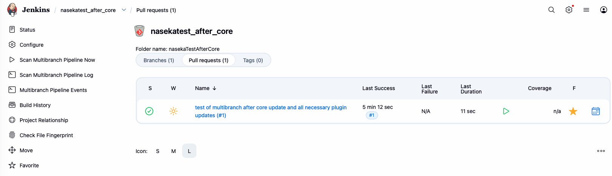

# i addded extra branch -> pushed it -> created pull request in bitbucket

```bash
git checkout -b jenkins-after-core-smoke
git add .
git status
git commit -m "test of multibranch after core update and all necessary plugin updates"
git push --set-upstream origin jenkins-after-core-smoke
```

then created pull request in bitbucket

then i could see all good in jenkins:



