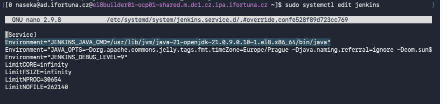
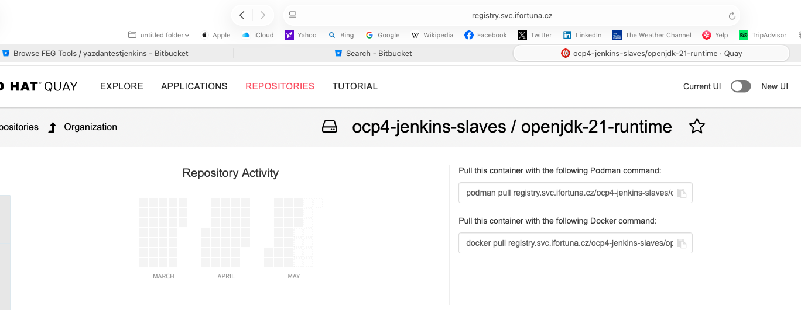
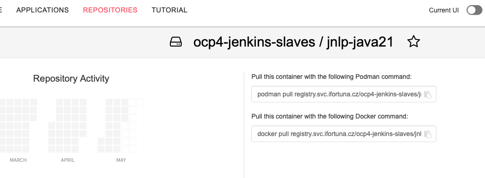
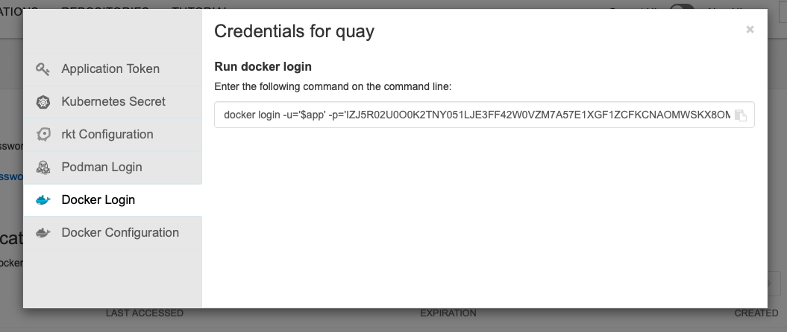

# Deploy 1 - Jenkins Java udpate and JNLP update to Java 21

# Preparation 

Goal:

- prepare Jenkins Test for core update
- switch controller Java to Java 21
- make sure Kubernetes/JNLP agents also use Java 21
- update safe plugins before core
- JCasC
- update Jenkins core from `2.504.2` to `2.555.1`
- update remaining safe plugins after core
- validate Bitbucket, multibranch, OpenShift agents, credentials, and UI

Test Jenkins:

```text
https://ci-test.m.dc1.cz.ipa.ifortuna.cz
```

OC namespace:

```bash
oc project jenkins-test
```

## 1) Check current Jenkins version and repo

First I checked what Jenkins version is installed and what version is available from the enabled repo.

```bash
sudo dnf info jenkins
```

Important result:

```text
Installed: 2.504.2
Available: 2.555.1
```

I also compared Test and Prod package info, so I knew both instances use the same Jenkins repo.

```bash
ssh jenkins-prod 'sudo dnf info jenkins' > prod-dnf-info-jenkins.txt
ssh jenkins-test 'sudo dnf info jenkins' > test-dnf-info-jenkins.txt
diff -u prod-dnf-info-jenkins.txt test-dnf-info-jenkins.txt
```

Then I checked the repo file:

```bash
cat /etc/yum.repos.d/jenkins.repo
```

Expected Jenkins stable/LTS repo:

```text
baseurl=http://pkg.jenkins.io/redhat-stable
```

## 2) Read Jenkins upgrade requirement

Jenkins `2.555.1` requires Java 21 or Java 25.

This means:

- controller JVM must run Java 21/25
- agent JVM must also run Java 21/25
- application build Java can still be Java 8/11/17/etc inside build containers
- Jenkins remoting/JNLP Java is the important one for agent connection

Check current Java:

```bash
[0 naseka@ad.ifortuna.cz@el8builder01-ocp01-shared.m.dc1.cz.ipa.ifortuna.cz ~]$ java --version # check current java on the server
openjdk 17.0.15 2025-04-15 LTS
OpenJDK Runtime Environment (Red_Hat-17.0.15.0.6-1) (build 17.0.15+6-LTS)
OpenJDK 64-Bit Server VM (Red_Hat-17.0.15.0.6-1) (build 17.0.15+6-LTS, mixed mode, sharing)
[0 naseka@ad.ifortuna.cz@el8builder01-ocp01-shared.m.dc1.cz.ipa.ifortuna.cz ~]$ which java # when i type java, which executable file will I run? result is a symlink managed by alternatives 
/usr/bin/java
[0 naseka@ad.ifortuna.cz@el8builder01-ocp01-shared.m.dc1.cz.ipa.ifortuna.cz ~]$ readlink -f $(which java) # readlink -f follows all simlinks until it reaches the real file
/usr/lib/jvm/java-17-openjdk-17.0.15.0.6-2.el8.x86_64/bin/java
[0 naseka@ad.ifortuna.cz@el8builder01-ocp01-shared.m.dc1.cz.ipa.ifortuna.cz ~]$ 
```

On Test, default Java was Java 17, so I had to install and configure Java 21 before core update.

# Deploy 1 - part 1 - install java 21 for Jenkins controller

## 1) Install Java 21 for Jenkins controller 

Check if Java 21 is available:

```bash
sudo dnf list available 'java-21-openjdk*' # dnf = package manager -> show me available packages whose name starts with java-21-openjdk. We use DNF when we want to install or update software
```


*OpenJDK* = open-source implementation of Java, which many vendors build and distribuie.

Install Java 21 headless package:

```bash
sudo dnf install java-21-openjdk-headless
```
*Headless* means a Java runtime without GUI/desktop libraries (enough, cause jenkins doesnt need to open windows, render desktop UI etc)

Find exact Java 21 binary:

```bash
rpm -ql java-21-openjdk-headless | grep '/bin/java$' # rpm = Red Hat Package Manager -q query -l list files -> ask rpm: show me all files installed by the package java-21-openjdk-headless. We use RPM when we want to inspect something already installed
```
```bash
[0 naseka@ad.ifortuna.cz@el8builder01-ocp01-shared.m.dc1.cz.ipa.ifortuna.cz ~]$ rpm -ql java-21-openjdk-headless | grep '/bin/java$'
/usr/lib/jvm/java-21-openjdk-21.0.9.0.10-1.el8.x86_64/bin/java # here we can see the path of Java 21 binary
[0 naseka@ad.ifortuna.cz@el8builder01-ocp01-shared.m.dc1.cz.ipa.ifortuna.cz ~]$ 
```

Installing java 21 adds another Java version, but it doesnt remove or replace Java 17 automatically! If we wanted to switch to Java 21 for the whole server we would run: `sudo alternatives --config java`

```bash
[0 naseka@ad.ifortuna.cz@el8builder01-ocp01-shared.m.dc1.cz.ipa.ifortuna.cz ~]$ sudo alternatives --config 'java'

There are 3 programs which provide 'java'.

  Selection    Command
-----------------------------------------------
*  1           java-11-openjdk.x86_64 (/usr/lib/jvm/java-11-openjdk-11.0.25.0.9-2.el8.x86_64/bin/java)
 + 2           java-17-openjdk.x86_64 (/usr/lib/jvm/java-17-openjdk-17.0.15.0.6-2.el8.x86_64/bin/java)
   3           java-21-openjdk.x86_64 (/usr/lib/jvm/java-21-openjdk-21.0.9.0.10-1.el8.x86_64/bin/java)

Enter to keep the current selection[+], or type selection number: ^C
```


## 2) Tell systemd Jenkins to use Java 21, cause I dont want to switch java on the whole server

Edit Jenkins systemd override:

```bash
sudo systemctl edit jenkins
```

Add this under `[Service]`, using the exact Java 21 path:

```ini
Environment="JENKINS_JAVA_CMD=/usr/lib/jvm/java-21-openjdk-21.0.9.0.10-1.el8.x86_64/bin/java"
```



Verify override:

```bash
sudo cat /etc/systemd/system/jenkins.service.d/override.conf
```

Reload and restart:

```bash
sudo systemctl daemon-reload
sudo systemctl restart jenkins
sudo systemctl status jenkins
```

Confirm Jenkins process really runs on Java 21:

```bash
sudo readlink -f /proc/$(pgrep -u jenkins -f jenkins.war)/exe # pgrep searches for running processes; -u jenkins = owned by user jenkins; -f = full command line contains jenkins.war. Command = find the process ID of a process owned by user jenkins whose full command line contains jenkins.war
```

Expected:

```bash
[130 naseka@ad.ifortuna.cz@el8builder01-ocp01-shared.m.dc1.cz.ipa.ifortuna.cz ~]$ sudo readlink -f /proc/$(pgrep -u jenkins -f jenkins.war)/exe
/usr/lib/jvm/java-21-openjdk-21.0.9.0.10-1.el8.x86_64/bin/java
[0 naseka@ad.ifortuna.cz@el8builder01-ocp01-shared.m.dc1.cz.ipa.ifortuna.cz ~]$ 

```

Check logs for Java/runtime problems:

```bash
sudo journalctl -u jenkins --since "30 minutes ago" --no-pager \
  | grep -Ei "UnsupportedClassVersion|UnsupportedClassVersionError|major version|classversion|has been compiled by a more recent version|illegal reflective|InaccessibleObjectException|IllegalAccessException|add-opens|module java"
```


# Deploy 1 - part 2 - update JNLP to java 21

## 1) Check JNLP agent Java version

After controller Java 21 was done, I checked the real Jenkins agent/JNLP Java version.

I ran this in my test pipeine, and figured that it runs still on Java 17. 

```groovy
pipeline {
    //testing webhook v3
  agent {
    kubernetes {
      inheritFrom 'buildah'
    }
  }

  options {
    timeout(time: 10, unit: 'MINUTES')
  }

  stages {
    stage('checkout confirmed') {
      steps {
        echo "branch=${env.BRANCH_NAME}"
        echo "node=${env.NODE_NAME}"
        sh '''
          pwd
          ls -la
          test -f Jenkinsfile
          echo "multibranch-checkout-ok"
        '''
      }
    }

    //This stage in my test pipeline doesnt specify the containers, so it will be default container which is jnlp container:

    stage('jnlp java check') {
      steps {
        sh '''
          echo "checking default Jenkins agent container"
          command -v java
          java -version
        '''
      }
    }

    stage('openshift agent smoke') {
      steps {
        container('buildah') {
          sh '''
            id || true
            buildah version || true
            echo "openshift-agent-ok"
          '''
        }
      }
    }
  }
}
```

It showed Java 17, so the current JNLP image was not suitable for Jenkins `2.555.1`.

Existing image in `jenkins.yaml`:

```yaml
image: "image-registry.openshift-image-registry.svc:5000/shared-images/jnlp:latest"
```

Check OpenShift ImageStream:

```bash
oc get imagestream jnlp -n shared-images # confrms the image name inside shared-images
oc describe imagestream jnlp -n shared-images # gives detailed info and shows from where the image was coming from
```


i can see that Quay has newer looing tags.. so check which java those tags contain:


I tried newer old JNLP tags via swapping them in JMLP pod template and running my multibranch pipeline, but they still had Java 17. Therefore I created a new Java 21 JNLP image.

## 2) Build Java 21 runtime and JNLP Java 21 image safely

Safe rule:

Do not overwrite:

```text
registry.svc.ifortuna.cz/ocp4-jenkins-slaves/jnlp:latest
image-registry.openshift-image-registry.svc:5000/shared-images/jnlp:latest
```

Use new repos and test tags:

```text
registry.svc.ifortuna.cz/ocp4-jenkins-slaves/openjdk-21-runtime:naseka-test-YYYYMMDD
registry.svc.ifortuna.cz/ocp4-jenkins-slaves/jnlp-java21:naseka-test-YYYYMMDD
```
So i created new repos for java 21 and jnlp on java 21: 






On MacBook with OrbStack:

```bash
open -a OrbStack
docker version
docker info
```

From my old notes, use the generated encrypted password / application token quay account settings, which gave me command to login:



```bash
naseka@CZMB94D536 nasekatest % docker login -u='$app' -p='IZJ5R02U0O0K2TNY051LJE3FF42W0VZM7A57E1XGF1ZCFKCNAOMWSKX8OME9U2P0W26KI53TZHNH8VE05JULHHS0CYLNWAADI2C5MS1UCBS7FWEYB7I66A4B' registry.svc.ifortuna.cz
WARNING! Using --password via the CLI is insecure. Use --password-stdin.
Login Succeeded
naseka@CZMB94D536 nasekatest % 
```

Prepare test tag:

```bash
TAG="naseka-test-$(date +%Y%m%d)"
echo $TAG
```

Pull Java 21 runtime for OpenShift architecture:

```bash
docker pull --platform linux/amd64 registry.access.redhat.com/ubi9/openjdk-21-runtime:latest
```

Tag it:

```bash
docker tag \
  registry.access.redhat.com/ubi9/openjdk-21-runtime:latest \
  registry.svc.ifortuna.cz/ocp4-jenkins-slaves/openjdk-21-runtime:$TAG
```

Verify:

```bash
docker inspect registry.svc.ifortuna.cz/ocp4-jenkins-slaves/openjdk-21-runtime:$TAG | grep -E '"Architecture"|"JAVA_VERSION"'
docker run --rm -it registry.svc.ifortuna.cz/ocp4-jenkins-slaves/openjdk-21-runtime:$TAG java -version
```

Expected:

```text
Architecture: amd64
Java: 21
```

Push runtime:

```bash
docker push registry.svc.ifortuna.cz/ocp4-jenkins-slaves/openjdk-21-runtime:$TAG
```

Copy existing JNLP Dockerfile into test repo:

```bash
cd ~/Devops/nasekatest
cp -R ~/Devops/ocp4_jenkins_docker_slaves/jnlp ./jnlp-java21
```

Edit `jnlp-java21/Dockerfile`:

```dockerfile
FROM registry.svc.ifortuna.cz/ocp4-jenkins-slaves/openjdk-21-runtime:naseka-test-YYYYMMDD
```

Build JNLP Java 21:

```bash
cd ~/Devops/nasekatest/jnlp-java21
docker build \
  --platform linux/amd64 \
  -t registry.svc.ifortuna.cz/ocp4-jenkins-slaves/jnlp-java21:$TAG \
  .
```

Verify:

```bash
docker run --rm -it \
  --entrypoint sh \
  registry.svc.ifortuna.cz/ocp4-jenkins-slaves/jnlp-java21:$TAG \
  -c 'java -version'
```

Expected:

```text
Java 21
```

Push:

```bash
docker push registry.svc.ifortuna.cz/ocp4-jenkins-slaves/jnlp-java21:$TAG
```

## 12) Change only Test Jenkins to use JNLP Java 21

Backup YAML:

```bash
cd /var/lib/jenkins
sudo cp -a jenkins.yaml jenkins.yaml.$(date +%Y%m%d-%H%M%S).before-jnlp-java21-test
```

Change only Test Jenkins JNLP image:

```yaml
image: "registry.svc.ifortuna.cz/ocp4-jenkins-slaves/jnlp-java21:naseka-test-YYYYMMDD"
```

Then run the multibranch validation pipeline with:

```groovy
stage('jnlp java check') {
  steps {
    sh '''
      echo "checking default Jenkins agent container"
      command -v java
      java -version
    '''
  }
}
```

Expected:

```text
Java 21
```

Check actual pod image while job is running:

```bash
oc project jenkins-test
oc get pods
oc get pod <pod-name> -o yaml | grep -A3 -B3 jnlp-java21
```

Expected:

```text
registry.svc.ifortuna.cz/ocp4-jenkins-slaves/jnlp-java21:naseka-test-YYYYMMDD
```
# Deploy 2 - core
## 1) Export installed plugin versions before plugin updates

I created an evidence file from the installed plugins:

```bash
ssh jenkins-test '
for f in /var/lib/jenkins/plugins/*/META-INF/MANIFEST.MF; do
  name=$(sudo awk -F": *" "/^Short-Name:/ {print \$2; exit}" "$f" | tr -d "\r")
  title=$(sudo awk -F": *" "/^Long-Name:/ {print \$2; exit}" "$f" | tr -d "\r")
  version=$(sudo awk -F": *" "/^Plugin-Version:/ {print \$2; exit}" "$f" | tr -d "\r")
  if [ -n "$name" ] && [ -n "$version" ]; then
    printf "%s|%s|%s\n" "$name" "$title" "$version"
  fi
done | sort
' > test-installed-plugins.tsv
```

File format:

```text
plugin-id | plugin-display-name | installed-version
```

I used this with the Excel plugin evaluation table to split plugins into batches.

Decision labels:

```text
UPDATE PRE-CORE
DEFER
PIN / DO NOT UPDATE
RESEARCH FIRST
```

I deferred risky plugins before core, especially Bitbucket, Blue Ocean, Kubernetes, Office 365 Connector, Coverage, and similar plugins with compatibility/config risk.

## 2) Clean old plugin backups and create a fresh backup

Check plugin backup disk usage:

```bash
sudo du -sh /var/lib/jenkins/plugins*
```

Remove only old backup directories that are safe to delete:

```bash
cd /var/lib/jenkins
sudo rm -rf plugins.03072024
sudo rm -rf plugins.17072024 plugins.27062024
```

Create fresh backup before plugin update:

```bash
cd /var/lib/jenkins
sudo cp -ar plugins plugins.$(date +%Y%m%d-%H%M%S)
```

## 3) Update pre-core plugins in batches

Before each plugin batch:

1. Create fresh plugin backup.
2. In UI, use "Prepare for Shutdown".
3. Confirm build queue is empty.
4. Confirm no executor is busy.
5. Update only selected plugins from the current batch.
6. Restart Jenkins.
7. Check logs and UI.
8. Run smoke tests.

Commands after each batch:

```bash
sudo systemctl restart jenkins
sudo systemctl status jenkins
```

Plugin/dependency log check:

```bash
sudo journalctl -u jenkins --since "15 minutes ago" --no-pager \
  | grep -Ei "failed loading plugin|failed to load plugin|unsatisfied dependency|dependency errors|severe|NoClassDefFoundError|ClassNotFoundException" \
  || echo "OK"
```

UI checks:

```text
Dashboard opens
Manage Jenkins opens
Plugins page opens
Credentials page opens
Security page opens
Script Approval opens
No stack trace
No failed plugin/dependency warning
```


## 4) Run pipeline and multibranch smoke tests

Basic Pipeline smoke:

```groovy
pipeline {
    agent any

    stages {
        stage('Smoke') {
            steps {
                sh 'echo smoke-start'
                sh 'sleep 5'
                script {
                    def out = sh(script: 'echo smoke-output', returnStdout: true).trim()
                    echo "Captured: ${out}"
                }
                sh 'echo smoke-end'
            }
        }
    }
}
```

Expected:

```text
Build starts
Agent/executor is allocated
Console log shows smoke-start
Build waits
Console log shows Captured: smoke-output
Build finishes SUCCESS
```

OpenShift/buildah smoke:

```groovy
pipeline {
  agent {
    kubernetes {
      inheritFrom 'buildah'
    }
  }

  options {
    timeout(time: 10, unit: 'MINUTES')
    skipDefaultCheckout(true)
  }

  stages {
    stage('OpenShift agent smoke') {
      steps {
        container('buildah') {
          sh '''
            echo "node=$NODE_NAME"
            echo "workspace=$WORKSPACE"
            id || true
            pwd
            java -version || true
            buildah version || true
            echo "openshift-agent-ok"
          '''
        }
      }
    }
  }
}
```

Multibranch checks:

```text
Open existing multibranch job
Open branch list
Open Configure if needed
Run Scan Multibranch Pipeline Now
Confirm Bitbucket connection works
Confirm branch/PR discovery works
Confirm no credential or SCM API errors
```

Webhook test:

```text
Push harmless Jenkinsfile change
Do not manually trigger build
Confirm Jenkins starts build automatically
Confirm SUCCESS
```


## 5) Prepare for core update

Before core update I had:

- controller Java 21 done
- JNLP agent Java 21 tested
- pre-core plugin batches done
- YAML backup
- plugin backup
- current Jenkins version recorded
- basic health checked

Backup YAML:

```bash
cd /var/lib/jenkins
sudo cp jenkins.yaml jenkins.yaml.$(date +%Y%m%d-%H%M%S)
```

Backup plugins:

```bash
cd /var/lib/jenkins
sudo cp -ar plugins plugins.$(date +%Y%m%d-%H%M%S)
```

Health checks! - check du and jenkins status just in case

## 6) Fix JCasC deprecated settings before/around core update

Official upgrade review showed that some JCasC fields are deprecated and can block startup.

Removed from `jenkins.yaml`:

```yaml
crumbIssuer:
  standard:
    excludeClientIPFromCrumb: ...
```

Also removed deprecated:

```text
myViewsTabBar
```

Important lesson:

If Jenkins fails during startup after core update, read the first real `ConfiguratorException`. Do not focus only on later plugin cleanup stack traces.

## 7) Perform Jenkins core update

Commands used:

```bash
sudo systemctl stop jenkins
sudo dnf update jenkins
sudo systemctl daemon-reload
sudo systemctl start jenkins
sudo systemctl status jenkins
```

Troubleshooting status:

```bash
sudo systemctl status jenkins -l --no-pager
```

Troubleshooting logs:

```bash
sudo journalctl -u jenkins -b --no-pager -n 300
```

Create log file for analysis:

```bash
sudo journalctl -u jenkins --since "2026-05-25 12:35:00" --until "2026-05-25 12:39:30" --no-pager > /tmp/jenkins-start-failure.log
scp jenkins-test:/tmp/jenkins-start-failure.log ~/Downloads/
```

After fixing YAML and if systemd blocked start attempts:

```bash
sudo systemctl reset-failed jenkins
sudo systemctl start jenkins
sudo systemctl status jenkins
```

## 8) Validate after core update

Serious startup/plugin log check:

```bash
sudo journalctl -u jenkins --since "30 minutes ago" --no-pager \
  | grep -Ei "severe|failed loading plugin|failed to load plugin|unsatisfied dependency|dependency errors|ConfiguratorException|NoClassDefFoundError|ClassNotFoundException" \
  || echo "OK: no serious Jenkins startup/plugin errors found"
```

UI checks:

```text
Dashboard
Manage Jenkins
Plugins
Nodes
Credentials
Security
Script Approval
Configuration as Code
```

Expected:

```text
Pages open
No red warnings
No stack traces
No plugin dependency warnings
Login/admin permissions OK
```

## 9) Update post-core plugin batches

After core update, Jenkins showed more available plugin updates.

I exported current plugin versions again:

```bash
cd ~/JenkinsTestUpdate
ssh jenkins-test '
for f in /var/lib/jenkins/plugins/*/META-INF/MANIFEST.MF; do
  name=$(sudo awk -F": *" "/^Short-Name:/ {print \$2; exit}" "$f" | tr -d "\r")
  version=$(sudo awk -F": *" "/^Plugin-Version:/ {print \$2; exit}" "$f" | tr -d "\r")
  if [ -n "$name" ] && [ -n "$version" ]; then
    printf "%s %s\n" "$name" "$version"
  fi
done | sort
' > test-plugins-versions-after-core.txt
```

Then I used the same batch approach:

```text
Update selected batch in UI
Restart Jenkins
Check status
Check logs
Run matching smoke tests
Continue only if clean
```

Commands after each post-core batch:

```bash
sudo systemctl restart jenkins
sudo systemctl status jenkins
```

Log check:

```bash
sudo journalctl -u jenkins --since "15 minutes ago" --no-pager \
  | grep -Ei "severe|failed loading plugin|failed to load plugin|unsatisfied dependency|dependency errors|ConfiguratorException|NoClassDefFoundError|ClassNotFoundException" \
  || echo "OK"
```

## 10) Agent and remote execution validation

For production this must be validated more carefully than on Test, because Test had only offline agents.

SSH agent smoke:

```groovy
pipeline {
  agent { label 'YOUR_SSH_AGENT_LABEL' }
  stages {
    stage('ssh-agent-smoke') {
      steps {
        sh 'hostname'
        sh 'whoami'
        sh 'java -version'
      }
    }
  }
}
```

Windows agent smoke if used:

```groovy
pipeline {
  agent { label 'YOUR_WINDOWS_LABEL' }
  stages {
    stage('windows-smoke') {
      steps {
        bat 'hostname'
        bat 'whoami'
        bat 'java -version'
      }
    }
  }
}
```

OpenShift checks while pod is running:

```bash
oc get pods -n <jenkins-agent-namespace>
oc describe pod <pod-name> -n <jenkins-agent-namespace>
```

Targeted agent log check:

```bash
sudo journalctl -u jenkins --since "30 minutes ago" --no-pager \
  | grep -Ei "ssh|kubernetes|openshift|remoting|jnlp|agent|slave|credential|NoClassDefFoundError|ClassNotFoundException|failed|severe"
```

## 11) Final Bitbucket and multibranch validation

After core and plugin updates, I tested Bitbucket/multibranch with a real branch and pull request.

Commands:

```bash
git checkout -b jenkins-after-core-smoke
git add .
git status
git commit -m "test of multibranch after core update and all necessary plugin updates"
git push --set-upstream origin jenkins-after-core-smoke
```

Then I created a pull request in Bitbucket and confirmed Jenkins discovered it and built successfully.

Expected:

```text
Branch discovered
PR discovered
Webhook works
Build starts automatically
Build finishes SUCCESS
No Bitbucket credential/SCM errors
```

## 12) Production update plan based on Test

Production pre-check commands:

```bash
sudo systemctl status jenkins
sudo dnf info jenkins
cat /etc/yum.repos.d/jenkins.repo
df -h
free -h
```

Production backups:

```bash
cd /var/lib/jenkins
sudo cp jenkins.yaml jenkins.yaml.$(date +%Y%m%d-%H%M%S).before-prod-update
sudo cp -ar plugins plugins.$(date +%Y%m%d-%H%M%S).before-prod-update
```

Production core update commands:

```bash
sudo systemctl stop jenkins
sudo dnf update jenkins
sudo systemctl daemon-reload
sudo systemctl start jenkins
sudo systemctl status jenkins
```

Production validation commands:

```bash
sudo journalctl -u jenkins --since "30 minutes ago" --no-pager \
  | grep -Ei "severe|failed loading plugin|failed to load plugin|unsatisfied dependency|dependency errors|ConfiguratorException|NoClassDefFoundError|ClassNotFoundException" \
  || echo "OK"
```

Bitbucket/webhook focused check:

```bash
sudo journalctl -u jenkins --since "30 minutes ago" --no-pager \
  | grep -Ei "bitbucket|branch|scm|git|credential|webhook|error|exception|failed"
```


## 13) Approach

```text
Check current state
Create rollback point
Change one area
Restart
Check logs
Check UI
Run smoke test
Record result
Continue to next area
```

