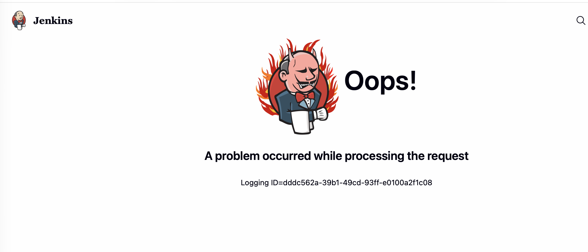
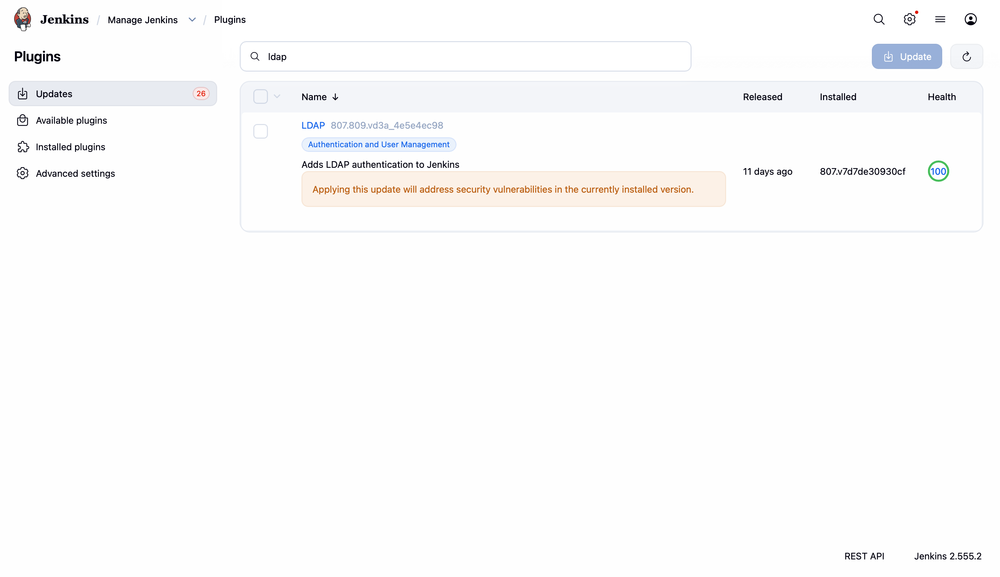
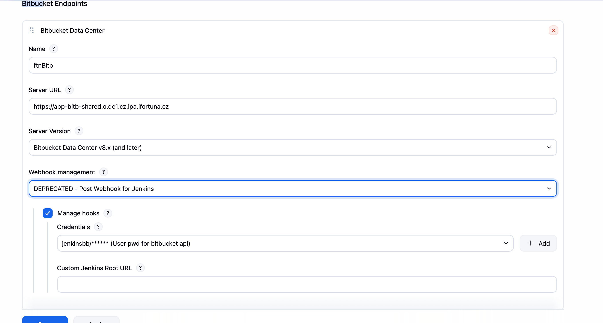
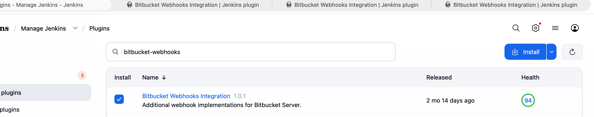
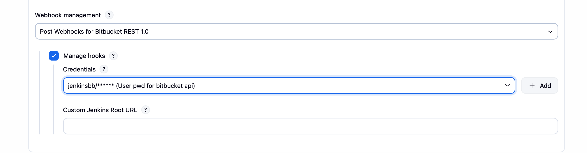
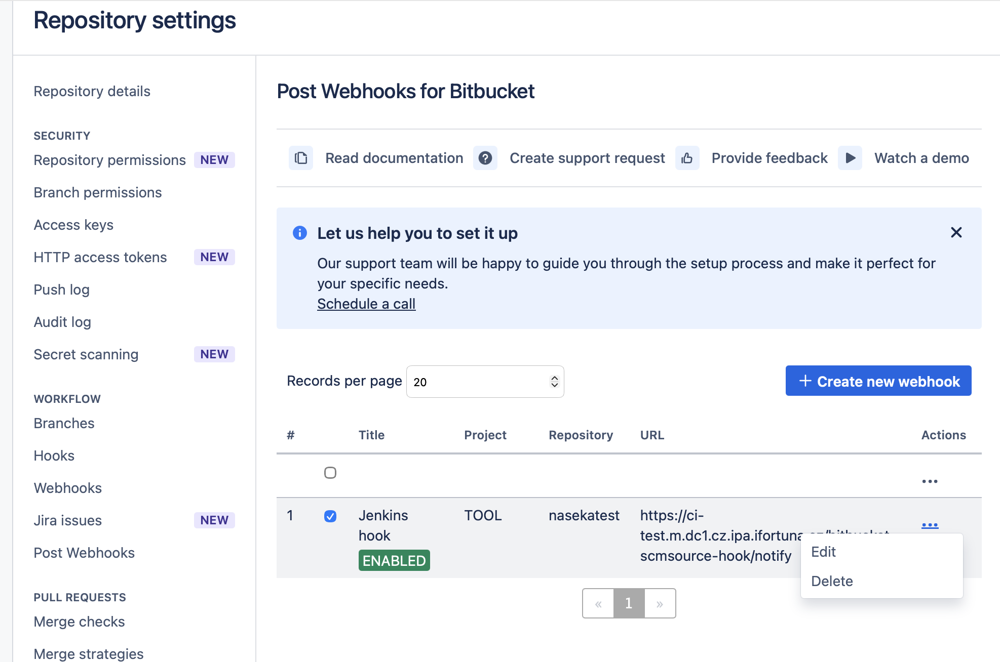
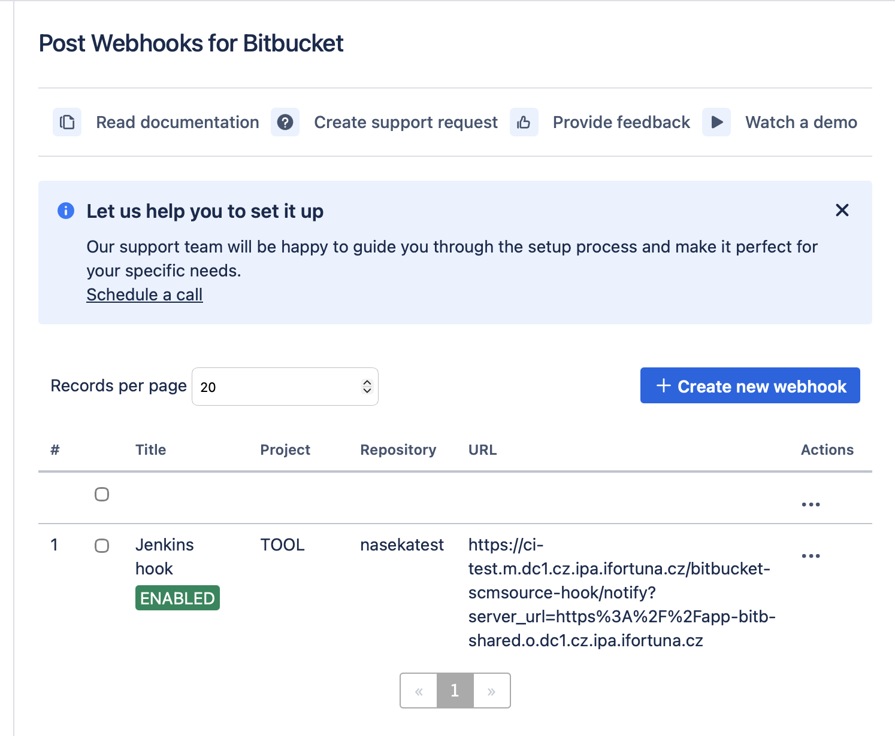
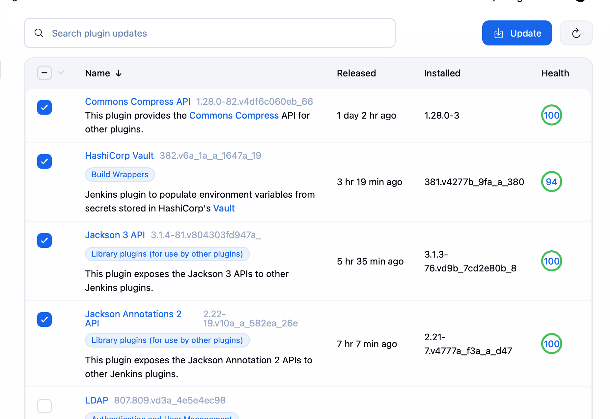

1. more plugins to update on ui
2. i created plugins backup
3. i updated plugins except for blue ocean, bitbucket and 
Office 365 Connector / Power Automate workflows
Version 5.3.0 and
Quay Tag Parameter
Version 1.0.123.ved40a_a_e1fcd7

after update cannot loing: 



try to trace this id:

sudo journalctl -u jenkins --since "10 minutes ago" -o short-iso --no-pager \
  | grep -F -A120 -B20 'dddc562a-39b1-49cd-93ff-e0100a2f1c08'


LDAP error:

javax.naming.PartialResultException: Unprocessed Continuation Reference(s)
PluginClassLoader for ldap
DefaultLdapAuthoritiesPopulator.getGroupMembershipRoles
LDAPSecurityRealm


check current and backup ldap plugin files:

```bash
sudo ls -ld plugins/ldap*
sudo ls -ld plugins.YOUR_BACKUP/ldap*
```

i replaced ldap plugin from backup to plugins (basically downgraded)

```bash
[0 naseka@ad.ifortuna.cz@el8builder01-ocp01-shared.m.dc1.cz.ipa.ifortuna.cz jenkins]$ sudo cp -a plugins.20260601-073342/ldap* plugins/
[0 naseka@ad.ifortuna.cz@el8builder01-ocp01-shared.m.dc1.cz.ipa.ifortuna.cz jenkins]$ sudo chown -R jenkins:jenkins plugins/ldap*
[0 naseka@ad.ifortuna.cz@el8builder01-ocp01-shared.m.dc1.cz.ipa.ifortuna.cz jenkins]$ sudo systemctl stop jenkins
[0 naseka@ad.ifortuna.cz@el8builder01-ocp01-shared.m.dc1.cz.ipa.ifortuna.cz jenkins]$ sudo systemctl start jenkins
[0 naseka@ad.ifortuna.cz@el8builder01-ocp01-shared.m.dc1.cz.ipa.ifortuna.cz jenkins]$ 
```

then i could login


Also note this in your update notes: LDAP plugin restored from backup because updated version caused login failure with PartialResultException: Unprocessed Continuation Reference(s) during group lookup.

so this combination works ok, keep it as it is:




# bitbucket to resolve

The issue in your screenshots is a Bitbucket plugin dependency + behavior-change chain, not one isolated plugin.

Your installed “safe” set is still around the old versions:

cloudbees-bitbucket-branch-source = 936.1.1
blueocean = 1.27.19
blueocean-bitbucket-pipeline = 1.27.19
bitbucket = 273.v7b_535e8f11c2
The update center is warning that if you update one of them, the others become incompatible. So this must be treated as one risky Bitbucket/Blue Ocean batch, not random checkbox updates.

Your notes say the exact same thing here:

47.jenkins_test_update.md (line 1301): “Plugin risk: Bitbucket webhooks”, old plugin-based webhooks deprecated, native Bitbucket webhooks behaved differently, builds stopped triggering, downgrade needed.
JENKINS-predani-prednaska 4.md (line 550): Roman found webhooks stopped working after update and downgraded cloudbees-bitbucket-branch-source to 936.1.1.
49.jenkins_precore_plugin_update.md (line 1): you explicitly deferred cloudbees-bitbucket-branch-source, bitbucket, blueocean, blueocean-bitbucket-pipeline, and atlassian-bitbucket-server-integration.
videos_content.md (line 1385): “Bitbucket webhooks stopped working after updates”; then “chain downgrade: Branch Source -> Bitbucket Pipeline -> Blue Ocean”.
Official docs confirm why this is risky:

Bitbucket Branch Source 937.3.1 is current and requires Jenkins 2.541.3, so your Jenkins 2.555.2 is new enough. Core version is not the blocker. Source: Jenkins plugin page. https://plugins.jenkins.io/cloudbees-bitbucket-branch-source/
The Bitbucket Branch Source user guide says webhook registration is controlled under Manage Jenkins -> System -> Bitbucket Endpoints, with Manage hooks, credentials, callback URL, and webhook implementation choice. Source: https://github.com/jenkinsci/bitbucket-branch-source-plugin/blob/master/docs/USER_GUIDE.adoc#webhooks-registering
The same official guide says for Bitbucket Data Center there are webhook implementation choices: native, deprecated plugin implementation, or another extension implementation.
The release notes for 937.2.x explicitly say the old Plugin Webhook implementation is deprecated and replaced by the new bitbucket-webhooks plugin, and should be migrated for Data Center. Source: https://github.com/jenkinsci/bitbucket-branch-source-plugin/releases
Blue Ocean docs explicitly say not to update one Blue Ocean plugin at a time; update the main Blue Ocean plugin so dependencies move together. Source: https://plugins.jenkins.io/blueocean/
So my read is:

Do not update only Bitbucket Branch Source, only Bitbucket, or only Blue Ocean. If you test this, do it as a deliberate batch on Test Jenkins only:

cloudbees-bitbucket-branch-source
bitbucket
blueocean
blueocean-bitbucket-pipeline
Then validate exactly what your notes say:

Manage Jenkins -> System -> Bitbucket Endpoints -> Webhook implementation
and test:

multibranch scan
branch push trigger
pull request trigger
webhook creation/recreation after saving job config
Bitbucket repo webhook entries
journalctl grep for bitbucket/webhook/scm errors
Bitbucket Server Integration 4.2.0 -> 6.0.0 is Bitbucket-related, but it is not the red dependency loop shown in your screenshots. I would treat it as separate risky SCM work, not mix it into the same first test unless you deliberately want a bigger blast radius.


47.jenkins_test_update.md
Document · MD
Open in

JENKINS-predani-prednaska 4.md
Document · MD
Open in

49.jenkins_precore_plugin_update.md
Open preview
Open in


## actual changes:

1) Bitbucket Server Integration
Version 6.0.0 -> updated this plugin only

2) tested bb multibranch - nasekatest push worked

3) now update reamining bibtucket + blue ocean plugins:


Preparation	
Checking internet connectivity
Checking update center connectivity
Success
Bitbucket Branch Source	 Downloaded Successfully. Will be activated during the next boot
Bitbucket	 Downloaded Successfully. Will be activated during the next boot
Bitbucket Branch Source	 Success
Common API for Blue Ocean	 Downloaded Successfully. Will be activated during the next boot
REST API for Blue Ocean	 Downloaded Successfully. Will be activated during the next boot
Pipeline SCM API for Blue Ocean	 Downloaded Successfully. Will be activated during the next boot
Design Language	 Downloaded Successfully. Will be activated during the next boot
Blue Ocean Core JS	 Downloaded Successfully. Will be activated during the next boot
Web for Blue Ocean	 Pending
JWT for Blue Ocean	 Pending
REST Implementation for Blue Ocean	 Pending
Pipeline implementation for Blue Ocean	 Pending
Bitbucket Pipeline for Blue Ocean	 Pending
GitHub Pipeline for Blue Ocean	 Pending
Git Pipeline for Blue Ocean	 Pending
Config API for Blue Ocean	 Pending
Dashboard for Blue Ocean	 Pending
Personalization for Blue Ocean	 Pending
Events API for Blue Ocean	 Pending
Blue Ocean Pipeline Editor	 Pending
i18n for Blue Ocean	 Pending
Blue Ocean	 Pending
Blue Ocean Core JS	 Pending
Blue Ocean Pipeline Editor	 Pending
Common API for Blue Ocean	 Pending
Config API for Blue Ocean	 Pending
Dashboard for Blue Ocean	 Pending
Design Language	 Pending
Events API for Blue Ocean	 Pending
Git Pipeline for Blue Ocean	 Pending
GitHub Pipeline for Blue Ocean	 Pending
i18n for Blue Ocean	 Pending
JIRA Integration for Blue Ocean	 Pending
JWT for Blue Ocean	 Pending
Personalization for Blue Ocean	 Pending
Pipeline implementation for Blue Ocean	 Pending
Pipeline SCM API for Blue Ocean	 Pending
REST API for Blue Ocean	 Pending
REST Implementation for Blue Ocean	 Pending
Web for Blue Ocean	 Pending


4) i have pushed new branch and changes to new branch on bb 
  ! webhook didnt trigger
  ! manual scan worked thogh

  

  cause using the old plugin-style webhook and the updated Bitbucket Branch Source docs days that this implementation is deprecated.

  Jenkins Test branch discovery works by manual scan, but automatic push webhook did not discover new branch.
Bitbucket endpoint still uses deprecated “Post Webhook for Jenkins” webhook management.
This matches the known Bitbucket Branch Source webhook migration risk from notes and official docs.
Need test whether switching endpoint webhook management to native/new bitbucket-webhooks implementation restores automatic branch indexing.

5) installing new plugin:



6) after restart modify the setting to bitbucket-webhooks:



7) pushed changes to bb, still new branches dont appear in jenkins..

8) checked hte log:

```bash
sudo journalctl -u jenkins --since "10 minutes ago" --no-pager \
  | grep -Ei "bitbucket|webhook|hook|SCMHeadEvent|SCMSourceEvent|notify|nasekatest|error|exception|failed"
```

```bash
[0 naseka@ad.ifortuna.cz@el8builder01-ocp01-shared.m.dc1.cz.ipa.ifortuna.cz ~]$ sudo journalctl -u jenkins --since "10 minutes ago" --no-pager \
>   | grep -Ei "bitbucket|webhook|hook|SCMHeadEvent|SCMSourceEvent|notify|nasekatest|error|exception|failed"
Jun 01 12:48:56 el8builder01-ocp01-shared.m.dc1.cz.ipa.ifortuna.cz jenkins[1041898]: 2026-06-01 12:48:56.685+0000 [id=1599]        INFO        i.j.b.a.FavoritingScmListener#onCheckout: Automatically favorited nasekatest/test_after_new_plugin for sach.martin
Jun 01 12:48:56 el8builder01-ocp01-shared.m.dc1.cz.ipa.ifortuna.cz jenkins[1041898]: 2026-06-01 12:48:56.692+0000 [id=1600]        INFO        i.j.b.a.FavoritingScmListener#onCheckout: Automatically favorited nasekatest/newtest for sach.martin
Jun 01 12:49:00 el8builder01-ocp01-shared.m.dc1.cz.ipa.ifortuna.cz jenkins[1041898]: 2026-06-01 12:49:00.338+0000 [id=1541]        INFO        hudson.slaves.NodeProvisioner#update: nasekatest-newtest-1-kng9p-czq6x-rs1t0 provisioning successfully completed. We have now 15 computer(s)
Jun 01 12:49:00 el8builder01-ocp01-shared.m.dc1.cz.ipa.ifortuna.cz jenkins[1041898]: 2026-06-01 12:49:00.355+0000 [id=1542]        INFO        hudson.slaves.NodeProvisioner#update: nasekatest-test-after-new-plugin-1-qqfjb-l213r-m0j2t provisioning successfully completed. We have now 15 computer(s)
Jun 01 12:49:01 el8builder01-ocp01-shared.m.dc1.cz.ipa.ifortuna.cz jenkins[1041898]: 2026-06-01 12:49:01.330+0000 [id=1707]        INFO        o.c.j.p.k.KubernetesLauncher#launch: Created Pod: kubernetes jenkins-test/nasekatest-test-after-new-plugin-1-qqfjb-l213r-m0j2t
Jun 01 12:49:01 el8builder01-ocp01-shared.m.dc1.cz.ipa.ifortuna.cz jenkins[1041898]: 2026-06-01 12:49:01.359+0000 [id=1540]        INFO        o.c.j.p.k.KubernetesLauncher#launch: Created Pod: kubernetes jenkins-test/nasekatest-newtest-1-kng9p-czq6x-rs1t0
Jun 01 12:49:02 el8builder01-ocp01-shared.m.dc1.cz.ipa.ifortuna.cz jenkins[1041898]: 2026-06-01 12:49:02.772+0000 [id=1707]        INFO        o.c.j.p.k.KubernetesLauncher#launch: Pod is running: kubernetes jenkins-test/nasekatest-test-after-new-plugin-1-qqfjb-l213r-m0j2t
Jun 01 12:49:03 el8builder01-ocp01-shared.m.dc1.cz.ipa.ifortuna.cz jenkins[1041898]: 2026-06-01 12:49:03.204+0000 [id=1540]        INFO        o.c.j.p.k.KubernetesLauncher#launch: Pod is running: kubernetes jenkins-test/nasekatest-newtest-1-kng9p-czq6x-rs1t0
Jun 01 12:49:09 el8builder01-ocp01-shared.m.dc1.cz.ipa.ifortuna.cz jenkins[1041898]: 2026-06-01 12:49:09.111+0000 [id=1747]        WARNING        i.j.b.a.FavoritingScmListener#onCheckout: Unexpected error when retrieving changeset
Jun 01 12:49:09 el8builder01-ocp01-shared.m.dc1.cz.ipa.ifortuna.cz jenkins[1041898]:                 at hudson.remoting.UserRequest$ExceptionResponse.retrieve(UserRequest.java:384)
Jun 01 12:49:09 el8builder01-ocp01-shared.m.dc1.cz.ipa.ifortuna.cz jenkins[1041898]: hudson.plugins.git.GitException: Error: git log --raw --no-merges --no-abbrev -M "--format=commit %H%ntree %T%nparent %P%nauthor %aN <%aE> %ai%ncommitter %cN <%cE> %ci%n%n%w(0,4,4)%B" -n 1 f172f96c80ce30a0dd59a8ef467a28280fbb627a in /home/jenkins/workspace/nasekatest_test_after_new_plugin
Jun 01 12:49:09 el8builder01-ocp01-shared.m.dc1.cz.ipa.ifortuna.cz jenkins[1041898]: 2026-06-01 12:49:09.231+0000 [id=1749]        WARNING        i.j.b.a.FavoritingScmListener#onCheckout: Unexpected error when retrieving changeset
Jun 01 12:49:09 el8builder01-ocp01-shared.m.dc1.cz.ipa.ifortuna.cz jenkins[1041898]:                 at hudson.remoting.UserRequest$ExceptionResponse.retrieve(UserRequest.java:384)
Jun 01 12:49:09 el8builder01-ocp01-shared.m.dc1.cz.ipa.ifortuna.cz jenkins[1041898]: hudson.plugins.git.GitException: Error: git log --raw --no-merges --no-abbrev -M "--format=commit %H%ntree %T%nparent %P%nauthor %aN <%aE> %ai%ncommitter %cN <%cE> %ci%n%n%w(0,4,4)%B" -n 1 f172f96c80ce30a0dd59a8ef467a28280fbb627a in /home/jenkins/workspace/nasekatest_newtest
Jun 01 12:49:11 el8builder01-ocp01-shared.m.dc1.cz.ipa.ifortuna.cz jenkins[1041898]: 2026-06-01 12:49:11.142+0000 [id=1735]        INFO        o.c.j.p.k.KubernetesSlave#_terminate: Terminating Kubernetes instance for agent nasekatest-test-after-new-plugin-1-qqfjb-l213r-m0j2t
Jun 01 12:49:11 el8builder01-ocp01-shared.m.dc1.cz.ipa.ifortuna.cz jenkins[1041898]: 2026-06-01 12:49:11.173+0000 [id=1735]        INFO        o.c.j.p.k.KubernetesSlave#deleteSlavePod: Terminated Kubernetes instance for agent jenkins-test/nasekatest-test-after-new-plugin-1-qqfjb-l213r-m0j2t
Jun 01 12:49:11 el8builder01-ocp01-shared.m.dc1.cz.ipa.ifortuna.cz jenkins[1041898]: 2026-06-01 12:49:11.173+0000 [id=1735]        INFO        o.c.j.p.k.KubernetesSlave#_terminate: Disconnected computer nasekatest-test-after-new-plugin-1-qqfjb-l213r-m0j2t
Jun 01 12:49:11 el8builder01-ocp01-shared.m.dc1.cz.ipa.ifortuna.cz jenkins[1041898]: 2026-06-01 12:49:11.176+0000 [id=1735]        INFO        j.s.DefaultJnlpSlaveReceiver#channelClosed: Computer.threadPoolForRemoting [#37] for nasekatest-test-after-new-plugin-1-qqfjb-l213r-m0j2t terminated: java.nio.channels.ClosedChannelException
Jun 01 12:49:11 el8builder01-ocp01-shared.m.dc1.cz.ipa.ifortuna.cz jenkins[1041898]: 2026-06-01 12:49:11.264+0000 [id=1738]        INFO        o.c.j.p.k.KubernetesSlave#_terminate: Terminating Kubernetes instance for agent nasekatest-newtest-1-kng9p-czq6x-rs1t0
Jun 01 12:49:11 el8builder01-ocp01-shared.m.dc1.cz.ipa.ifortuna.cz jenkins[1041898]: 2026-06-01 12:49:11.284+0000 [id=1738]        INFO        o.c.j.p.k.KubernetesSlave#deleteSlavePod: Terminated Kubernetes instance for agent jenkins-test/nasekatest-newtest-1-kng9p-czq6x-rs1t0
Jun 01 12:49:11 el8builder01-ocp01-shared.m.dc1.cz.ipa.ifortuna.cz jenkins[1041898]: 2026-06-01 12:49:11.284+0000 [id=1738]        INFO        o.c.j.p.k.KubernetesSlave#_terminate: Disconnected computer nasekatest-newtest-1-kng9p-czq6x-rs1t0
Jun 01 12:49:11 el8builder01-ocp01-shared.m.dc1.cz.ipa.ifortuna.cz jenkins[1041898]: 2026-06-01 12:49:11.285+0000 [id=1738]        INFO        j.s.DefaultJnlpSlaveReceiver#channelClosed: Computer.threadPoolForRemoting [#39] for nasekatest-newtest-1-kng9p-czq6x-rs1t0 terminated: java.nio.channels.ClosedChannelException
Jun 01 12:49:11 el8builder01-ocp01-shared.m.dc1.cz.ipa.ifortuna.cz jenkins[1041898]: 2026-06-01 12:49:11.368+0000 [id=1700]        INFO        o.j.p.l.queue.LockRunListener#onCompleted: nasekatest » test_after_new_plugin #1
Jun 01 12:49:11 el8builder01-ocp01-shared.m.dc1.cz.ipa.ifortuna.cz jenkins[1041898]: 2026-06-01 12:49:11.439+0000 [id=1699]        INFO        o.j.p.l.queue.LockRunListener#onCompleted: nasekatest » newtest #1
Jun 01 12:50:41 el8builder01-ocp01-shared.m.dc1.cz.ipa.ifortuna.cz jenkins[1041898]: 2026-06-01 12:50:41.507+0000 [id=1420]        WARNING        h.plugins.sshslaves.SSHLauncher#launch: SSH Launch of brrobot01-feed01-shared.d.dc1.cz.ipa.ifortuna.cz on brrobot01-feed01-shared.d.dc1.cz.ipa.ifortuna.cz failed in 165,045 ms
Jun 01 12:50:41 el8builder01-ocp01-shared.m.dc1.cz.ipa.ifortuna.cz jenkins[1041898]: 2026-06-01 12:50:41.507+0000 [id=1528]        WARNING        h.plugins.sshslaves.SSHLauncher#launch: SSH Launch of spinrobot01-feed01-shared.d.dc1.cz.ipa.ifortuna.cz on spinrobot01-feed01-shared.d.dc1.cz.ipa.ifortuna.cz failed in 165,044 ms
Jun 01 12:50:41 el8builder01-ocp01-shared.m.dc1.cz.ipa.ifortuna.cz jenkins[1041898]: 2026-06-01 12:50:41.508+0000 [id=1523]        WARNING        h.plugins.sshslaves.SSHLauncher#launch: SSH Launch of ivgrobot01-feed01-shared.d.dc1.cz.ipa.ifortuna.cz on ivgrobot01-feed01-shared.d.dc1.cz.ipa.ifortuna.cz failed in 165,045 ms
Jun 01 12:50:41 el8builder01-ocp01-shared.m.dc1.cz.ipa.ifortuna.cz jenkins[1041898]: 2026-06-01 12:50:41.509+0000 [id=83]        WARNING        h.plugins.sshslaves.SSHLauncher#launch: SSH Launch of btrobot01-feed01-shared.d.dc1.cz.ipa.ifortuna.cz on btrobot01-feed01-shared.d.dc1.cz.ipa.ifortuna.cz failed in 165,048 ms
Jun 01 12:50:41 el8builder01-ocp01-shared.m.dc1.cz.ipa.ifortuna.cz jenkins[1041898]: 2026-06-01 12:50:41.509+0000 [id=113]        WARNING        h.plugins.sshslaves.SSHLauncher#launch: SSH Launch of bgrobot01-feed01-shared.d.dc1.cz.ipa.ifortuna.cz on bgrobot01-feed01-shared.d.dc1.cz.ipa.ifortuna.cz failed in 165,048 ms
Jun 01 12:50:41 el8builder01-ocp01-shared.m.dc1.cz.ipa.ifortuna.cz jenkins[1041898]: 2026-06-01 12:50:41.512+0000 [id=1303]        WARNING        h.plugins.sshslaves.SSHLauncher#launch: SSH Launch of aprobot01-feed01-shared.d.dc1.cz.ipa.ifortuna.cz on aprobot01-feed01-shared.d.dc1.cz.ipa.ifortuna.cz failed in 165,050 ms
Jun 01 12:52:29 el8builder01-ocp01-shared.m.dc1.cz.ipa.ifortuna.cz jenkins[1041898]: 2026-06-01 12:52:29.038+0000 [id=1518]        WARNING        c.c.j.p.b.i.w.p.AbstractPluginWebhookProcessor#canHandle: bitbucket-webhooks plugin found, skipping this deprecated implementation.
Jun 01 12:52:29 el8builder01-ocp01-shared.m.dc1.cz.ipa.ifortuna.cz jenkins[1041898]: 2026-06-01 12:52:29.038+0000 [id=1518]        WARNING        c.c.j.p.b.i.w.p.AbstractPluginWebhookProcessor#canHandle: bitbucket-webhooks plugin found, skipping this deprecated implementation.
Jun 01 12:52:29 el8builder01-ocp01-shared.m.dc1.cz.ipa.ifortuna.cz jenkins[1041898]: 2026-06-01 12:52:29.038+0000 [id=1518]        WARNING        c.c.j.p.b.h.BitbucketSCMSourcePushHookReceiver#getHookProcessor: No processor found for the incoming Bitbucket hook. Skipping.
Jun 01 12:52:29 el8builder01-ocp01-shared.m.dc1.cz.ipa.ifortuna.cz jenkins[1041898]: 2026-06-01 12:52:29.039+0000 [id=1518]        WARNING        h.i.i.InstallUncaughtExceptionHandler#handleException: Caught unhandled exception with ID cf5baf9b-0747-4e00-9ad7-eae5d0190977
Jun 01 12:52:29 el8builder01-ocp01-shared.m.dc1.cz.ipa.ifortuna.cz jenkins[1041898]: java.lang.Exception: No processor found that supports this event. Refer to the user documentation on how configure the webHook in Bitbucket at https://github.com/jenkinsci/bitbucket-branch-source-plugin/blob/master/docs/USER_GUIDE.adoc#webhooks-registering
Jun 01 12:52:29 el8builder01-ocp01-shared.m.dc1.cz.ipa.ifortuna.cz jenkins[1041898]:         at org.kohsuke.stapler.HttpResponses.error(HttpResponses.java:90)
Jun 01 12:52:29 el8builder01-ocp01-shared.m.dc1.cz.ipa.ifortuna.cz jenkins[1041898]:         at PluginClassLoader for cloudbees-bitbucket-branch-source//com.cloudbees.jenkins.plugins.bitbucket.hooks.BitbucketSCMSourcePushHookReceiver.doNotify(BitbucketSCMSourcePushHookReceiver.java:126)
Jun 01 12:52:29 el8builder01-ocp01-shared.m.dc1.cz.ipa.ifortuna.cz jenkins[1041898]:         at PluginClassLoader for atlassian-bitbucket-server-integration//com.atlassian.bitbucket.jenkins.internal.applink.oauth.serviceprovider.auth.OAuth1aRequestFilter.doFilter(OAuth1aRequestFilter.java:76)
Jun 01 12:52:29 el8builder01-ocp01-shared.m.dc1.cz.ipa.ifortuna.cz jenkins[1041898]:         at PluginClassLoader for jira-trigger//com.ceilfors.jenkins.plugins.jiratrigger.ExceptionLoggingFilter.doFilter(ExceptionLoggingFilter.groovy:29)
Jun 01 12:52:29 el8builder01-ocp01-shared.m.dc1.cz.ipa.ifortuna.cz jenkins[1041898]:         at jenkins.ErrorAttributeFilter.doFilter(ErrorAttributeFilter.java:29)
Jun 01 12:52:29 el8builder01-ocp01-shared.m.dc1.cz.ipa.ifortuna.cz jenkins[1041898]:         at PluginClassLoader for cloudbees-bitbucket-branch-source//com.cloudbees.jenkins.plugins.bitbucket.hooks.BitbucketSCMSourcePushHookReceiver.process(BitbucketSCMSourcePushHookReceiver.java:74)
Jun 01 12:52:29 el8builder01-ocp01-shared.m.dc1.cz.ipa.ifortuna.cz jenkins[1041898]:         at jenkins.security.AcegiSecurityExceptionFilter.doFilter(AcegiSecurityExceptionFilter.java:52)
Jun 01 12:52:29 el8builder01-ocp01-shared.m.dc1.cz.ipa.ifortuna.cz jenkins[1041898]:         at hudson.security.UnwrapSecurityExceptionFilter.doFilter(UnwrapSecurityExceptionFilter.java:54)
Jun 01 12:52:29 el8builder01-ocp01-shared.m.dc1.cz.ipa.ifortuna.cz jenkins[1041898]:         at org.springframework.security.web.access.ExceptionTranslationFilter.doFilter(ExceptionTranslationFilter.java:125)
Jun 01 12:52:29 el8builder01-ocp01-shared.m.dc1.cz.ipa.ifortuna.cz jenkins[1041898]:         at org.springframework.security.web.access.ExceptionTranslationFilter.doFilter(ExceptionTranslationFilter.java:119)
Jun 01 12:52:29 el8builder01-ocp01-shared.m.dc1.cz.ipa.ifortuna.cz jenkins[1041898]:         at org.kohsuke.stapler.UncaughtExceptionFilter.doFilter(UncaughtExceptionFilter.java:26)
Jun 01 12:54:41 el8builder01-ocp01-shared.m.dc1.cz.ipa.ifortuna.cz jenkins[1041898]: 2026-06-01 12:54:41.933+0000 [id=81]        WARNING        h.plugins.sshslaves.SSHLauncher#launch: SSH Launch of macosbuild01-jenkins-shared on 10.30.213.110 failed in 825,473 ms
Jun 01 12:54:41 el8builder01-ocp01-shared.m.dc1.cz.ipa.ifortuna.cz jenkins[1041898]: 2026-06-01 12:54:41.988+0000 [id=129]        WARNING        h.plugins.sshslaves.SSHLauncher#launch: SSH Launch of rhel6build on rhel6build-jenkins-shared.d.dc1.cz.ipa.ifortuna.cz failed in 825,529 ms
Jun 01 12:54:42 el8builder01-ocp01-shared.m.dc1.cz.ipa.ifortuna.cz jenkins[1041898]: 2026-06-01 12:54:42.017+0000 [id=89]        WARNING        h.plugins.sshslaves.SSHLauncher#launch: SSH Launch of rhel7build on rhelbuild01-jenkins-shared.d.dc1.cz.ipa.ifortuna.cz failed in 825,557 ms
Jun 01 12:54:42 el8builder01-ocp01-shared.m.dc1.cz.ipa.ifortuna.cz jenkins[1041898]: 2026-06-01 12:54:42.048+0000 [id=149]        WARNING        h.plugins.sshslaves.SSHLauncher#launch: SSH Launch of macosbuild2 on 10.30.213.101 failed in 825,589 ms
Jun 01 12:54:42 el8builder01-ocp01-shared.m.dc1.cz.ipa.ifortuna.cz jenkins[1041898]: 2026-06-01 12:54:42.048+0000 [id=100]        WARNING        h.plugins.sshslaves.SSHLauncher#launch: SSH Launch of macos-qa on 10.30.213.100 failed in 825,588 ms
Jun 01 12:54:42 el8builder01-ocp01-shared.m.dc1.cz.ipa.ifortuna.cz jenkins[1041898]: 2026-06-01 12:54:42.064+0000 [id=104]        WARNING        h.plugins.sshslaves.SSHLauncher#launch: SSH Launch of feeds_robot_test on app01-feed02-shared.d.dc1.cz.ipa.ifortuna.cz failed in 825,603 ms
[0 naseka@ad.ifortuna.cz@el8builder01-ocp01-shared.m.dc1.cz.ipa.ifortuna.cz ~]$ 
```

IMPORTANT LINES:

```bash
bitbucket-webhooks plugin found, skipping this deprecated implementation.
No processor found for the incoming Bitbucket hook. Skipping. # looks like some mismatch
java.lang.Exception: No processor found that supports this event.
```

That means Jenkins receives the webhook, but the webhook payload type does not match the selected Jenkins webhook processor.

one of following happening:

1.
Bitbucket sends old Post Webhook format
Jenkins is now configured to use a newer/native webhook handler
Result: Jenkins receives it but cannot process it

OR

2. Bitbucket sends old Post Webhook format
Jenkins is now configured to use a newer/native webhook handler
Result: Jenkins receives it but cannot process it


it looks like yaml is my issue:


```text
jenkins.yaml still defines old/deprecated webhook config
bitbucket-webhooks plugin is now installed
old built-in webhook processor disables itself
new processor is not correctly configured from JCasC
webhook arrives, but Jenkins has no matching handler
```


## problem

so old setup is depreciated, but for new plugin we need to do also update bitbucket side

Official release notes back this up: Branch Source deprecated the old plugin webhook and later disables the embedded processor when bitbucket-webhooks is installed. The new plugin README says it handles specific supported Bitbucket webhook implementations, not every old hook automatically.

Sources:

https://github.com/jenkinsci/bitbucket-branch-source-plugin/releases
https://github.com/jenkinsci/bitbucket-webhooks-plugin
https://github.com/jenkinsci/bitbucket-branch-source-plugin/blob/master/docs/USER_GUIDE.adoc#manual-registration

## solution

From your notes: before, you were using the old plugin-based Post Webhooks path, not native.

Evidence:

24. jenkins upgrade.md (line 107): old strategy was “Plugin-based,” “previously used by company.”
Same note says old plugin created POST webhooks, while new behavior creates Bitbucket-native hooks.
32.external_aps.md (line 314): “now we are using plugin and they deprecated this feature.”
32.external_aps.md (line 318): “now we are using post webhooks, but native solution creates entries here.”
47.jenkins_test_update.md (line 1337): old behavior = plugin-based webhook, creates POST webhooks. Newer behavior = native Bitbucket webhook.
So the old working setup was:

Bitbucket-side Post Webhooks plugin/hook
        ->
Jenkins Bitbucket Branch Source old plugin-based webhook handler
Not this:

Bitbucket native webhook
        ->
Jenkins native Data Center webhook handler
And not necessarily this new extra plugin you installed today:

bitbucket-webhooks plugin
Your old “safe set” note lists:

cloudbees-bitbucket-branch-source: 936.1.1
blueocean: 1.27.19
blueocean-bitbucket-pipeline: 1.27.19
bitbucket: 273.v7b_535e8f11c2
It does not list bitbucket-webhooks as part of the old working setup.

Why Roman downgraded: because newer Bitbucket Branch Source moved away from the old plugin-based Post Webhooks implementation. Your notes say webhooks stopped working after update, and Roman downgraded cloudbees-bitbucket-branch-source to 936.1.1 to keep the existing Post Webhooks setup working without changing Bitbucket-side hooks.

So the actual answer is:

You were not on native before. You were on old Post Webhooks. Roman downgraded because the new Bitbucket Branch Source path broke that old webhook behavior, and switching to native would require a Bitbucket-side hook change/migration.

Your current situation matches that exactly. Manual scan works, webhook path breaks.


24. jenkins upgrade.md
Document · MD
Open in

32.external_aps.md
Document · MD
Open in

47.jenkins_test_update.md
Document · MD
Open in


# wrap up for bitbucket

Old setup:
Bitbucket Post Webhooks add-on
  -> old embedded Jenkins Branch Source plugin-webhook processor

New supported setup:
Bitbucket Post Webhooks add-on
  -> Jenkins bitbucket-webhooks plugin
  -> Bitbucket Branch Source


it might be that i need to delete the webhook and let jenkins create a new webhook!



i deleted existing one 

resaved the job -> it created a new one in bitbucket:





[Mon Jun 01 15:24:31 UTC 2026] Received io.jenkins.plugins.bitbucket.webhook.moveworkforward.processor.PostWebhooksPushEvent CREATED event from 10.32.157.66 ⇒ https://ci-test.m.dc1.cz.ipa.ifortuna.cz:8080/bitbucket-scmsource-hook/notify with timestamp Mon Jun 01 15:24:26 UTC 2026
Connecting to https://app-bitb-shared.o.dc1.cz.ipa.ifortuna.cz using jenkinsbb/****** (User pwd for bitbucket api)
Looking up TOOL/nasekatest for pull requests
Checking PR-1 from TOOL/nasekatest and branch jenkins-after-core-smoke

  1 pull requests were processed
Looking up TOOL/nasekatest for branches
Checking branch bbwebhookv1 from TOOL/nasekatest
      ‘Jenkinsfile’ found
    Met criteria
Scheduled build for branch: bbwebhookv1

  1 branches were processed (query completed)
[Mon Jun 01 15:24:31 UTC 2026] io.jenkins.plugins.bitbucket.webhook.moveworkforward.processor.PostWebhooksPushEvent CREATED event from 10.32.157.66 ⇒ https://ci-test.m.dc1.cz.ipa.ifortuna.cz:8080/bitbucket-scmsource-hook/notify with timestamp Mon Jun 01 15:24:26 UTC 2026 processed in 0.32 sec


# what to do:

bitbucket-webhooks installed
Jenkins endpoint = Post Webhooks for Bitbucket REST 1.0
old Bitbucket Post Webhook deleted
Jenkins recreated the hook
push triggered multibranch indexing
branch became visible


# continuation:




