# problem

last time there was this error after update:

```bash
javax.naming.PartialResultException: Unprocessed Continuation Reference(s) PluginClassLoader for ldap DefaultLdapAuthoritiesPopulator.getGroupMembershipRoles LDAPSecurityRealm # = Active Directory did not return a clean complete search result. It returned “continue/search somewhere else too,” and the LDAP client/plugin did not handle that continuation.
```

it happened at `DefaultLdapAuthoritiesPopulator.getGroupMembershipRoles LDAPSecurityRealm` -> so it happend at resolving LDAP groups/roles for the user after authentication

so updated plugin could not complete AD group membership looukup, cause group search hit LDAP referrals/continuation references.

# resoluion ideas

Likely fixes are one of these:

Restore previous LDAP plugin version, which you already did before.
Add/narrow groupSearchBase so Jenkins searches only the OU where Jenkins/Bitbucket groups live.
Ensure referral handling is ignored/followed consistently. You already have JVM arg:

`-Djava.naming.referral=ignore`

but the newer plugin may not behave the same with it.

# check my current (old) version and new version, which i tried to update to

```bash 
[0 naseka@ad.ifortuna.cz@el8builder01-ocp01-shared.m.dc1.cz.ipa.ifortuna.cz plugins]$ ls -l ldap*
-rw-r--r-- 1 jenkins jenkins 3156025 Jun 23  2025 ldap.bak
-rw-r--r-- 1 jenkins jenkins 3158414 May 26 11:42 ldap.jpi

ldap:
total 8
drwxr-xr-x 3 jenkins jenkins 4096 May 26 11:43 META-INF
drwxr-xr-x 3 jenkins jenkins 4096 May 26 11:43 WEB-INF
[0 naseka@ad.ifortuna.cz@el8builder01-ocp01-shared.m.dc1.cz.ipa.ifortuna.cz plugins]$ cd ldap
[0 naseka@ad.ifortuna.cz@el8builder01-ocp01-shared.m.dc1.cz.ipa.ifortuna.cz ldap]$ ls
META-INF  WEB-INF
[0 naseka@ad.ifortuna.cz@el8builder01-ocp01-shared.m.dc1.cz.ipa.ifortuna.cz ldap]$ cat META-INF/
cat: META-INF/: Is a directory
[1 naseka@ad.ifortuna.cz@el8builder01-ocp01-shared.m.dc1.cz.ipa.ifortuna.cz ldap]$ cd META-INF/
[0 naseka@ad.ifortuna.cz@el8builder01-ocp01-shared.m.dc1.cz.ipa.ifortuna.cz META-INF]$ ls
MANIFEST.MF  maven
[0 naseka@ad.ifortuna.cz@el8builder01-ocp01-shared.m.dc1.cz.ipa.ifortuna.cz META-INF]$ cat MANIFEST.MF 
Manifest-Version: 1.0
Created-By: Maven Archiver 3.6.5
Java-Version: 17
Build-Jdk-Spec: 21 # This plugin was built/compiled using JDK 21.
Specification-Title: LDAP Plugin
Specification-Version: 0.0
Implementation-Title: LDAP Plugin
Implementation-Version: 807.v7d7de30930cf
Group-Id: org.jenkins-ci.plugins
Artifact-Id: ldap
Short-Name: ldap
Long-Name: LDAP Plugin
Url: https://github.com/jenkinsci/ldap-plugin
Compatible-Since-Version: 1.16
Plugin-Version: 807.v7d7de30930cf # current plugin version
Hudson-Version: 2.504.3
Jenkins-Version: 2.504.3 # minimum jenkins core version required for this ldap plugin
Plugin-Dependencies: mailer:525.v2458b_d8a_1a_71
Plugin-Developers: 
Plugin-License-Name: The MIT license
Plugin-License-Url: https://opensource.org/licenses/MIT
Plugin-ScmConnection: scm:git:https://github.com/jenkinsci/ldap-plugin.g
 it
Plugin-ScmTag: 7d7de30930cf2188bc36ef445731919bfc202b67
Plugin-ScmUrl: https://github.com/jenkinsci/ldap-plugin
Implementation-Build: 7d7de30930cf2188bc36ef445731919bfc202b67

[0 naseka@ad.ifortuna.cz@el8builder01-ocp01-shared.m.dc1.cz.ipa.ifortuna.cz META-INF]$ 
```

# explanation of the jump from 807.v7d7de30930cf to 807.809.vd3a_4e5e4ec98

jump is about LDAP referrals. Jenkins advisory says 807.v7d7de30930cf and older followed LDAP referrals; 807.809.vd3a_4e5e4ec98 no longer follows them.

So the needed config is: make Jenkins LDAP searches work without *following referrals*.


# actual change

inside my yaml -> this is part responsible for ldap config:

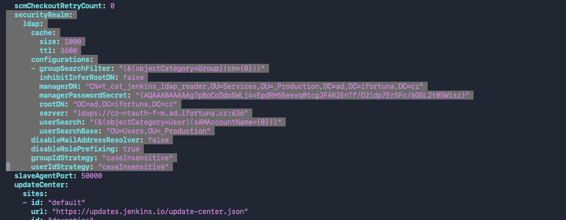

my yaml has no explicit `groupMembershipStrategy` at all

i have this:

```yaml
groupSearchFilter: "(&(objectCategory=Group)(cn={0}))"
rootDN: "DC=ad,DC=ifortuna,DC=cz"
userSearchBase: "OU=Users,OU=_Production"
```

and i dont have this:

```yaml
groupSearchBase: ...
groupMembershipStrategy: ...
```

Jenkins then uses LDAP plugin defaults for group membership lookup. With no groupSearchBase, group lookup can start too broadly under rootDN:

```yaml
rootDN: "DC=ad,DC=ifortuna,DC=cz"
```

so for new LDAP i would need to add explicit group lookup config.

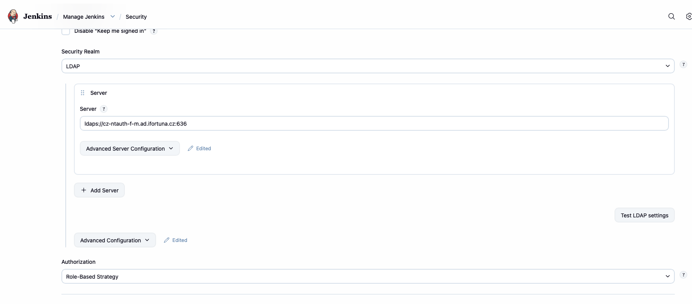

config is in advanced server configuration:

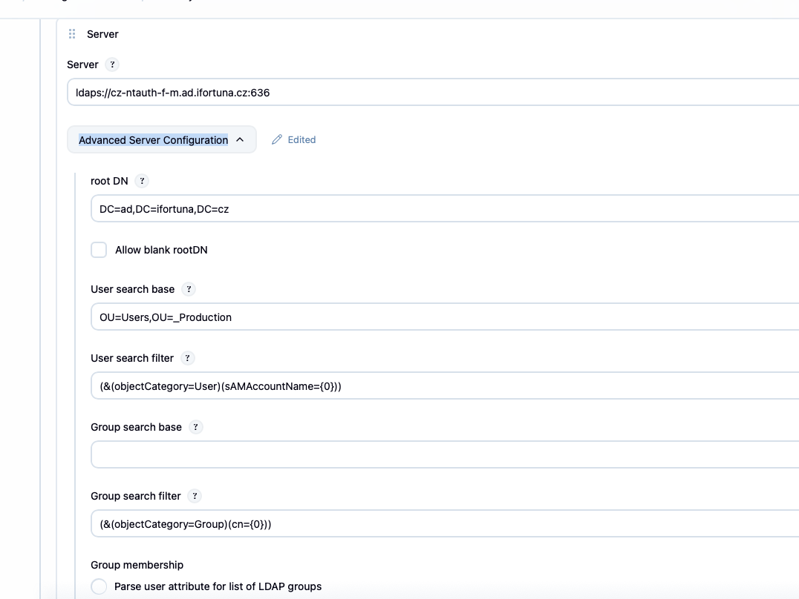

i can see my group search base is empty:

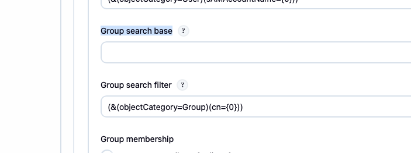

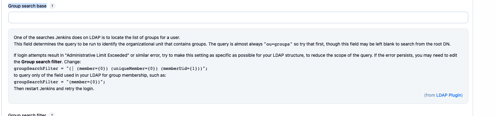

so i beleive i start with ou=groups:

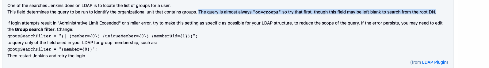

# some theory

OU = Organizational Unit
DN = Distinguished Name (full ldap oath to one object)

example: `CN=bitbucket_web,OU=Groups,OU=_Production,DC=ad,DC=ifortuna,DC=cz`

CN = Common Name (actual object name, for ex. `bitbucket_web`)

OU = Organizational Unit (folder in active directory, for ex. OU=Users,OU=_Production -> means the object is inside `Groups` folder, which is inside `_Production` folder)

DC = Domain Component (a piece of the domain name, for ex: `DC=ad,DC=ifortuna,DC=cz`)


So fulul DN: `CN=bitbucket_web,OU=Groups,OU=_Production,DC=ad,DC=ifortuna,DC=cz` means:

group named bitbucket_web
inside OU Groups
inside OU _Production
inside domain ad.ifortuna.cz


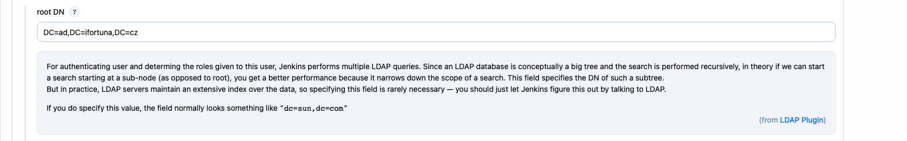


Root DN = base domain jenkins searches under, so Jenkins starts from the domain `ad.ifortuna.cz`, so jenkins searches for users, relateive to Root DN. 


means Jenkins searches users under: `OU=Users,OU=_Production,DC=ad,DC=ifortuna,DC=cz`

Group search base means where Jenkins searhces for groups relative to Root DN

I guess this:

OU=Groups,OU=_Production

so i put this:

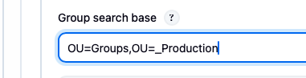

and click 
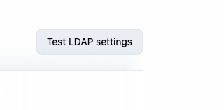

success:

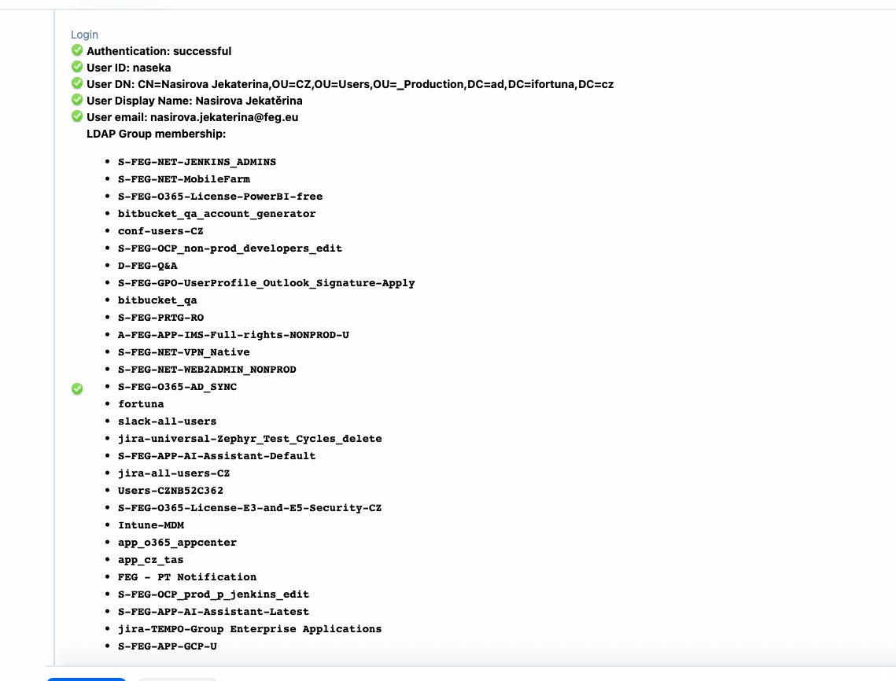

try this ai script in console:

```groovy
import jenkins.model.Jenkins
import hudson.security.LDAPSecurityRealm
import javax.naming.Context
import javax.naming.directory.InitialDirContext
import javax.naming.directory.SearchControls

def realm = Jenkins.instance.securityRealm
assert realm instanceof LDAPSecurityRealm : "Current security realm is not LDAP: ${realm.class.name}"

def cfg = realm.configurations[0]
def group = "S-FEG-OCP_prod_p_jenkins_edit"

def env = new Hashtable()
env[Context.INITIAL_CONTEXT_FACTORY] = "com.sun.jndi.ldap.LdapCtxFactory"
env[Context.PROVIDER_URL] = cfg.server
env[Context.SECURITY_AUTHENTICATION] = "simple"
env[Context.SECURITY_PRINCIPAL] = cfg.managerDN
env[Context.SECURITY_CREDENTIALS] = cfg.managerPasswordSecret.plainText
env[Context.REFERRAL] = "ignore"

def ctx = null

try {
  ctx = new InitialDirContext(env)

  def controls = new SearchControls()
  controls.searchScope = SearchControls.SUBTREE_SCOPE
  controls.returningAttributes = ["distinguishedName"] as String[]
  controls.countLimit = 10
  controls.timeLimit = 10000

  println("LDAP server: ${cfg.server}")
  println("Root DN: ${cfg.rootDN}")
  println("Searching group: ${group}")

  def results = ctx.search(
    cfg.rootDN,
    "(&(objectCategory=Group)(cn=${group}))",
    controls
  )

  def found = false

  while (results.hasMore()) {
    found = true
    def item = results.next()
    def dn = item.attributes.get("distinguishedName")?.get()?.toString()

    println("Group DN: ${dn}")

    def groupSearchBase = dn
      .replaceFirst(/(?i)^CN=[^,]+,/, "")
      .replaceFirst(/(?i),?${java.util.regex.Pattern.quote(cfg.rootDN)}$/, "")

    println("Candidate Jenkins Group search base: ${groupSearchBase}")
  }

  if (!found) {
    println("Group not found")
  }
} finally {
  if (ctx != null) {
    ctx.close()
  }
}
```

so i believe it can work:

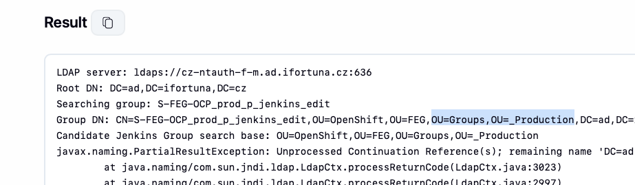

# after ui change 

logged out, loggied in -> ok

# update yaml
update ldap

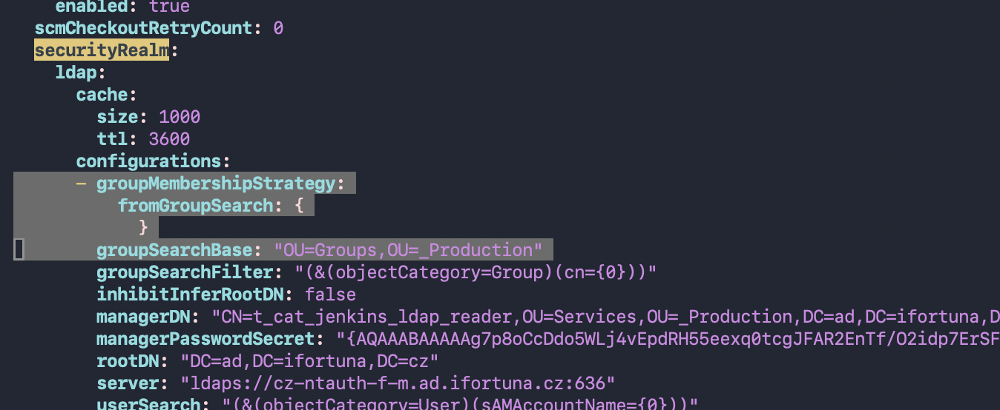

```bash

[0 naseka@ad.ifortuna.cz@el8builder01-ocp01-shared.m.dc1.cz.ipa.ifortuna.cz jenkins]$ diff jenkins.yaml jenkins.yaml.20260602-111636
3000,3004c3000
<       - groupMembershipStrategy:
<           fromGroupSearch: {
<             }
<         groupSearchBase: "OU=Groups,OU=_Production"
<         groupSearchFilter: "(&(objectCategory=Group)(cn={0}))"
---
>       - groupSearchFilter: "(&(objectCategory=Group)(cn={0}))"
[1 naseka@ad.ifortuna.cz@el8builder01-ocp01-shared.m.dc1.cz.ipa.ifortuna.cz jenkins]$ 
```

also update bitbucket part:

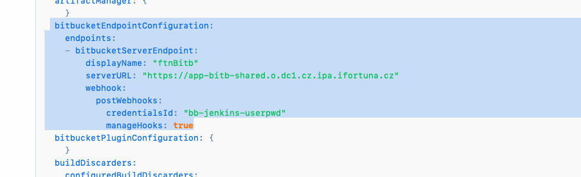


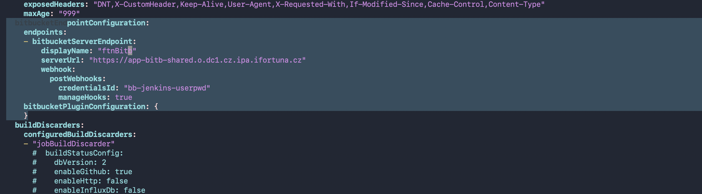


had to fix bitbucket plugins part

```bash
[0 naseka@ad.ifortuna.cz@el8builder01-ocp01-shared.m.dc1.cz.ipa.ifortuna.cz jenkins]$ diff jenkins.yaml jenkins.yaml.20260602-111636
3000,3004c3000
<       - groupMembershipStrategy:
<           fromGroupSearch: {
<             }
<         groupSearchBase: "OU=Groups,OU=_Production"
<         groupSearchFilter: "(&(objectCategory=Group)(cn={0}))"
---
>       - groupSearchFilter: "(&(objectCategory=Group)(cn={0}))"
3107a3104
>         credentialsId: "bb-jenkins-userpwd"
3108a3106
>         manageHooks: true
3110,3115d3107
<         webhook:
<           postWebhooks:
<             credentialsId: "bb-jenkins-userpwd"
<             manageHooks: true
<   bitbucketPluginConfiguration: {
<     }
[1 naseka@ad.ifortuna.cz@el8builder01-ocp01-shared.m.dc1.cz.ipa.ifortuna.cz jenkins]$ 
```

! recap of yaml changes: jnlp running on different agent, crumble issuer, tab viewer, + changes above. 


