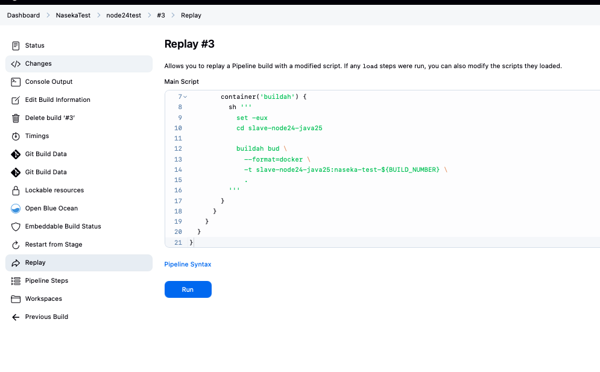
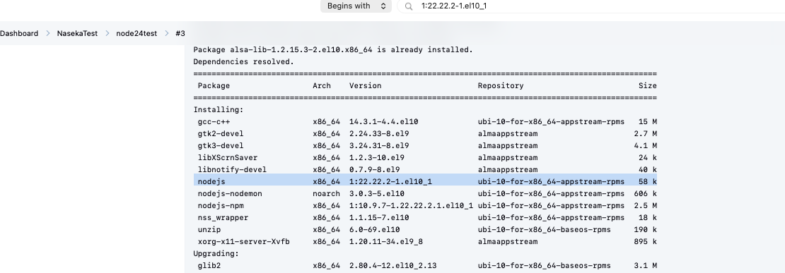
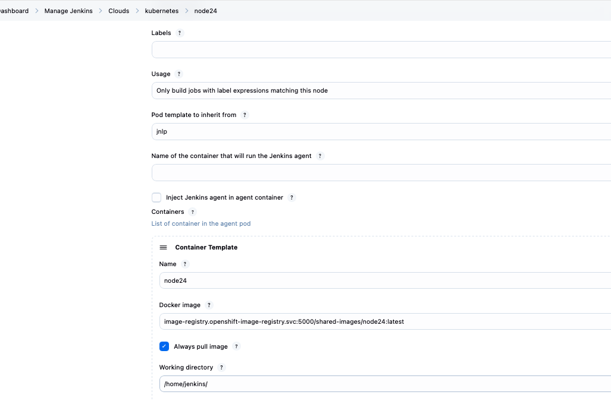
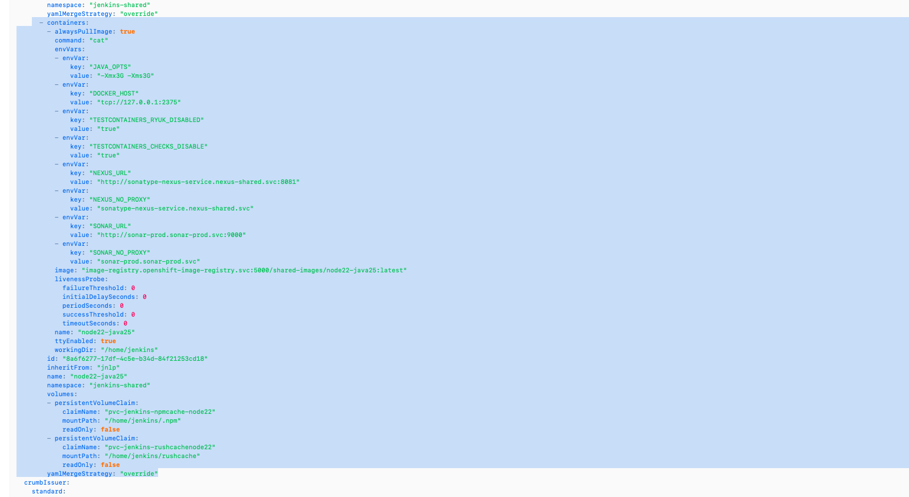
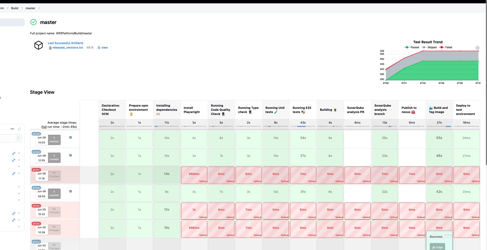

1. copy slave-node22-java25

2. change env variable from 22 to 24: 

ENV NODEJS_VERSION=24 \

3. i want to check node 24. actually ther eis a pod template with node 24:


i ran the test pipeline with the new dockerfile and figured, that even if i put 24 version => it still downloads 22 :/ 






4) find the existing node 24 source image:




oc describe is node24 -n shared-images


old agent not in yaml issue:

o get the current resolved image link/digest from OpenShift, run:

oc get istag node22-java25:latest -n shared-images -o jsonpath='{.image.dockerImageReference}{"\n"}'

looks like need to copy this block to my yaml: 



command to search through logs: `sudo journalctl -u jenkins --since "today"   | grep -Ei "configSubmit|doConfigSubmit|/configure|Manage Jenkins|reload configuration|Reload Configuration"`


to find the location for docker image in imagestream:
```bash
oc get istag node22-java25:latest -n shared-images`

```bash
naseka@CZMB94D536 jnlp-java21 % oc get istag node22-java25:latest -n shared-images 
NAME                   IMAGE REFERENCE                                                                                                                                        UPDATED
node22-java25:latest   image-registry.openshift-image-registry.svc:5000/shared-images/node22-java25@sha256:ed956cafed6de6b853e21015fd52b64fa0ced70bd5bcc55fa24907c542d38cd2   9 days ago
naseka@CZMB94D536 jnlp-java21 %
```


# troubleshooting further




## compair two builds: i can see that successful build uses node 20 and unsuccessful uses node 24:

746 (success) and 747 (failure)

### 746: 

#### name of pod:
Created Pod: kubernetes jenkins-shared/wp-platform-build-master-746-xc664-5t728-5l2n3
[PodInfo] jenkins-shared/wp-platform-build-master-746-xc664-5t728-5l2n3
	Container [buildah] waiting [ContainerCreating] No message
	Container [jnlp] waiting [ContainerCreating] No message
	Container [node20] waiting [ContainerCreating] No message
	Pod [Pending][ContainersNotReady] containers with unready status: [node20 buildah jnlp]
[PodInfo] jenkins-shared/wp-platform-build-master-746-xc664-5t728-5l2n3
	Container [buildah] waiting [ContainerCreating] No message
	Container [jnlp] waiting [ContainerCreating] No message
	Container [node20] waiting [ContainerCreating] No message
	Pod [Pending][ContainersNotReady] containers with unready status: [node20 buildah jnlp]
[PodInfo] jenkins-shared/wp-platform-build-master-746-xc664-5t728-5l2n3
	Container [buildah] waiting [ContainerCreating] No message
	Container [jnlp] waiting [ContainerCreating] No message
	Container [node20] waiting [ContainerCreating] No message
	Pod [Pending][ContainersNotReady] containers with unready status: [node20 buildah jnlp]
[PodInfo] jenkins-shared/wp-platform-build-master-746-xc664-5t728-5l2n3
	Container [buildah] waiting [ContainerCreating] No message
	Container [jnlp] waiting [ContainerCreating] No message
	Container [node20] waiting [ContainerCreating] No message
	Pod [Pending][ContainersNotReady] containers with unready status: [node20 buildah jnlp]
[PodInfo] jenkins-shared/wp-platform-build-master-746-xc664-5t728-5l2n3
	Container [buildah] waiting [ContainerCreating] No message
	Container [jnlp] waiting [ContainerCreating] No message
	Container [node20] waiting [ContainerCreating] No message
	Pod [Pending][ContainersNotReady] containers with unready status: [node20 buildah jnlp]
[PodInfo] jenkins-shared/wp-platform-build-master-746-xc664-5t728-5l2n3
	Container [buildah] waiting [ContainerCreating] No message
	Container [jnlp] waiting [ContainerCreating] No message
	Container [node20] waiting [ContainerCreating] No message
	Pod [Pending][ContainersNotReady] containers with unready status: [node20 buildah jnlp]
[PodInfo] jenkins-shared/wp-platform-build-master-746-xc664-5t728-5l2n3
	Container [buildah] waiting [ContainerCreating] No message
	Container [jnlp] waiting [ContainerCreating] No message
	Container [node20] waiting [ContainerCreating] No message
	Pod [Pending][ContainersNotReady] containers with unready status: [node20 buildah jnlp]
[PodInfo] jenkins-shared/wp-platform-build-master-746-xc664-5t728-5l2n3
	Container [buildah] waiting [ContainerCreating] No message
	Container [jnlp] waiting [ContainerCreating] No message
	Container [node20] waiting [ContainerCreating] No message
	Pod [Pending][ContainersNotReady] containers with unready status: [node20 buildah jnlp]
[PodInfo] jenkins-shared/wp-platform-build-master-746-xc664-5t728-5l2n3
	Container [buildah] waiting [ContainerCreating] No message
	Container [jnlp] waiting [ContainerCreating] No message
	Container [node20] waiting [ContainerCreating] No message
	Pod [Pending][ContainersNotReady] containers with unready status: [node20 buildah jnlp]
[PodInfo] jenkins-shared/wp-platform-build-master-746-xc664-5t728-5l2n3
	Container [buildah] waiting [ContainerCreating] No message
	Container [jnlp] waiting [ContainerCreating] No message
	Container [node20] waiting [ContainerCreating] No message
	Pod [Pending][ContainersNotReady] containers with unready status: [node20 buildah jnlp]
[PodInfo] jenkins-shared/wp-platform-build-master-746-xc664-5t728-5l2n3
	Container [buildah] waiting [ContainerCreating] No message
	Container [jnlp] waiting [ContainerCreating] No message
	Container [node20] waiting [ContainerCreating] No message
	Pod [Pending][ContainersNotReady] containers with unready status: [node20 buildah jnlp]
[PodInfo] jenkins-shared/wp-platform-build-master-746-xc664-5t728-5l2n3
	Container [buildah] waiting [ContainerCreating] No message
	Container [jnlp] waiting [ContainerCreating] No message
	Container [node20] waiting [ContainerCreating] No message
	Pod [Pending][ContainersNotReady] containers with unready status: [node20 buildah jnlp]
Agent wp-platform-build-master-746-xc664-5t728-5l2n3 is provisioned from template WP_Platform_Build_master_746-xc664-5t728


#### nodeimage address in registry:

    image: "image-registry.openshift-image-registry.svc:5000/shared-images/node20:latest"
    imagePullPolicy: "Always"
    name: "node20"

### 747:

#### name of pod:


Created Pod: kubernetes jenkins-shared/wp-platform-build-master-747-mf0p8-3mx4t-1tf51
[PodInfo] jenkins-shared/wp-platform-build-master-747-mf0p8-3mx4t-1tf51
	Container [buildah] waiting [ContainerCreating] No message
	Container [jnlp] waiting [ContainerCreating] No message
	Container [node24] waiting [ContainerCreating] No message
	Pod [Pending][ContainersNotReady] containers with unready status: [node24 buildah jnlp]
[PodInfo] jenkins-shared/wp-platform-build-master-747-mf0p8-3mx4t-1tf51
	Container [buildah] waiting [ContainerCreating] No message
	Container [jnlp] waiting [ContainerCreating] No message
	Container [node24] waiting [ContainerCreating] No message
	Pod [Pending][ContainersNotReady] containers with unready status: [node24 buildah jnlp]
[PodInfo] jenkins-shared/wp-platform-build-master-747-mf0p8-3mx4t-1tf51
	Container [buildah] waiting [ContainerCreating] No message
	Container [jnlp] waiting [ContainerCreating] No message
	Container [node24] waiting [ContainerCreating] No message
	Pod [Pending][ContainersNotReady] containers with unready status: [node24 buildah jnlp]
[PodInfo] jenkins-shared/wp-platform-build-master-747-mf0p8-3mx4t-1tf51
	Container [buildah] waiting [ContainerCreating] No message
	Container [jnlp] waiting [ContainerCreating] No message
	Container [node24] waiting [ContainerCreating] No message
	Pod [Pending][ContainersNotReady] containers with unready status: [node24 buildah jnlp]
[PodInfo] jenkins-shared/wp-platform-build-master-747-mf0p8-3mx4t-1tf51
	Container [buildah] waiting [ContainerCreating] No message
	Container [jnlp] waiting [ContainerCreating] No message
	Container [node24] waiting [ContainerCreating] No message
	Pod [Pending][ContainersNotReady] containers with unready status: [node24 buildah jnlp]
[PodInfo] jenkins-shared/wp-platform-build-master-747-mf0p8-3mx4t-1tf51
	Container [buildah] waiting [ContainerCreating] No message
	Container [jnlp] waiting [ContainerCreating] No message
	Container [node24] waiting [ContainerCreating] No message
	Pod [Pending][ContainersNotReady] containers with unready status: [node24 buildah jnlp]
[PodInfo] jenkins-shared/wp-platform-build-master-747-mf0p8-3mx4t-1tf51
	Container [buildah] waiting [ContainerCreating] No message
	Container [jnlp] waiting [ContainerCreating] No message
	Container [node24] waiting [ContainerCreating] No message
	Pod [Pending][ContainersNotReady] containers with unready status: [node24 buildah jnlp]
[PodInfo] jenkins-shared/wp-platform-build-master-747-mf0p8-3mx4t-1tf51
	Container [buildah] waiting [ContainerCreating] No message
	Container [jnlp] waiting [ContainerCreating] No message
	Container [node24] waiting [ContainerCreating] No message
	Pod [Pending][ContainersNotReady] containers with unready status: [node24 buildah jnlp]
[PodInfo] jenkins-shared/wp-platform-build-master-747-mf0p8-3mx4t-1tf51
	Container [buildah] waiting [ContainerCreating] No message
	Container [jnlp] waiting [ContainerCreating] No message
	Container [node24] waiting [ContainerCreating] No message
	Pod [Pending][ContainersNotReady] containers with unready status: [node24 buildah jnlp]
[PodInfo] jenkins-shared/wp-platform-build-master-747-mf0p8-3mx4t-1tf51
	Container [buildah] waiting [ContainerCreating] No message
	Container [jnlp] waiting [ContainerCreating] No message
	Container [node24] waiting [ContainerCreating] No message
	Pod [Pending][ContainersNotReady] containers with unready status: [node24 buildah jnlp]
[PodInfo] jenkins-shared/wp-platform-build-master-747-mf0p8-3mx4t-1tf51
	Container [buildah] waiting [ContainerCreating] No message
	Container [jnlp] waiting [ContainerCreating] No message
	Container [node24] waiting [ContainerCreating] No message
	Pod [Pending][ContainersNotReady] containers with unready status: [node24 buildah jnlp]
[PodInfo] jenkins-shared/wp-platform-build-master-747-mf0p8-3mx4t-1tf51
	Container [buildah] waiting [ContainerCreating] No message
	Container [jnlp] waiting [ContainerCreating] No message
	Container [node24] waiting [ContainerCreating] No message
	Pod [Pending][ContainersNotReady] containers with unready status: [node24 buildah jnlp]
[PodInfo] jenkins-shared/wp-platform-build-master-747-mf0p8-3mx4t-1tf51
	Container [buildah] waiting [ContainerCreating] No message
	Container [jnlp] waiting [ContainerCreating] No message
	Container [node24] waiting [ContainerCreating] No message
	Pod [Pending][ContainersNotReady] containers with unready status: [node24 buildah jnlp]
Agent wp-platform-build-master-747-mf0p8-3mx4t-1tf51 is provisioned from template WP_Platform_Build_master_747-mf0p8-3mx4t


#### nodeimage address in registry:
    image: "image-registry.openshift-image-registry.svc:5000/shared-images/node24:latest"
    imagePullPolicy: "Always"
    name: "node24"


## why one build chooses node20 and another chooses 24:


# new findings

node20 works ok, node 24 failed

my test only proved that my dockerfile is correct. but it doesnt prove that jenkins production pod template uses this image

## checked the image:

You have access to the following projects and can switch between them with 'oc project <projectname>':

    arch
    atlantis
    idm
    isesync
    jenkins
  * jenkins-shared
    jenkins-test
    mw
    netbox
    nexus
    openshift-logging
    prometheus
    quay
    revelio
    shared-images
    sonar
    thanos
    thanos-shared
    tools
    vault
    wulcan

Using project "jenkins-shared".
naseka@CZMB94D536 nasekatest % oc describe istag node24:latest -n shared-images
Image Name:	sha256:c18eb8c4a298edaa593077ab64d2b7aa66416d5b1619c8546e81d153f66a2fb1
Docker Image:	image-registry.openshift-image-registry.svc:5000/shared-images/node24@sha256:c18eb8c4a298edaa593077ab64d2b7aa66416d5b1619c8546e81d153f66a2fb1
Name:		sha256:c18eb8c4a298edaa593077ab64d2b7aa66416d5b1619c8546e81d153f66a2fb1
Created:	4 days ago
Annotations:	image.openshift.io/dockerLayersOrder=ascending
Image Size:	559MB in 2 layers
Layers:		76.23MB	sha256:eb592bc75a725663b5f71e3d2fad36c33fea1394ab2d572b62c3b582ee4c0305
		482.8MB	sha256:62fc4f3713eb9b341f3bc5a7c1fdb2ece17646386a69e0cd12512fda77522ddf
Image Created:	5 days ago
Author:		<none>
Arch:		amd64
Command:	/bin/bash
Working Dir:	/
User:		<none>
Exposes Ports:	<none>
Docker Labels:	architecture=x86_64
		build-date=2025-09-24T07:42:22Z
		com.redhat.component=ubi10-container
		com.redhat.license_terms=https://www.redhat.com/en/about/red-hat-end-user-license-agreements#UBI
		cpe=cpe:/o:redhat:enterprise_linux:10.0
		description=The Universal Base Image is designed and engineered to be the base layer for all of your containerized applications, middleware and utilities. This base image is freely redistributable, but Red Hat only supports Red Hat technologies through subscriptions for Red Hat products. This image is maintained by Red Hat and updated regularly.
		distribution-scope=public
		io.buildah.version=1.39.4
		io.k8s.description=The Universal Base Image is designed and engineered to be the base layer for all of your containerized applications, middleware and utilities. This base image is freely redistributable, but Red Hat only supports Red Hat technologies through subscriptions for Red Hat products. This image is maintained by Red Hat and updated regularly.
		io.k8s.display-name=Red Hat Universal Base Image 10
		io.openshift.expose-services=
		io.openshift.tags=base rhel10
		maintainer=Red Hat, Inc.
		name=ubi10/ubi
		org.opencontainers.image.revision=15e5733dc128d8178e29f49c1c417ff41c5d7125
		release=1758699521
		summary=Provides the latest release of Red Hat Universal Base Image 10.
		url=https://catalog.redhat.com/en/search?searchType=containers
		vcs-ref=15e5733dc128d8178e29f49c1c417ff41c5d7125
		vcs-type=git
		vendor=Red Hat, Inc.
		version=10.0
Environment:	container=oci
		NODEJS_VERSION=24
		JAVA_HOME=/usr/lib/jvm/java
		PATH=/opt/async-profiler:/usr/local/sbin:/usr/local/bin:/usr/sbin:/usr/bin:/sbin:/bin
naseka@CZMB94D536 nasekatest % 


so i can see that it is plain redhat ubi 10:

```bash
		build-date=2025-09-24T07:42:22Z
		com.redhat.component=ubi10-container
		com.redhat.license_terms=https://www.redhat.com/en/about/red-hat-end-user-license-agreements#UBI
```


and i ndont see my npm_config_prefix and path doesnt contain what i added..:


```bash
Environment:	container=oci
		NODEJS_VERSION=24
		JAVA_HOME=/usr/lib/jvm/java
		PATH=/opt/async-profiler:/usr/local/sbin:/usr/local/bin:/usr/sbin:/usr/bin:/sbin:/bin
```

3 days ago - on friday I upploaded new image to EXISTING LOCATION:

https://registry.svc.ifortuna.cz/repository/ocp4-jenkins-slaves/slave-node24-java25?tab=tags


Node 24 in ui:


