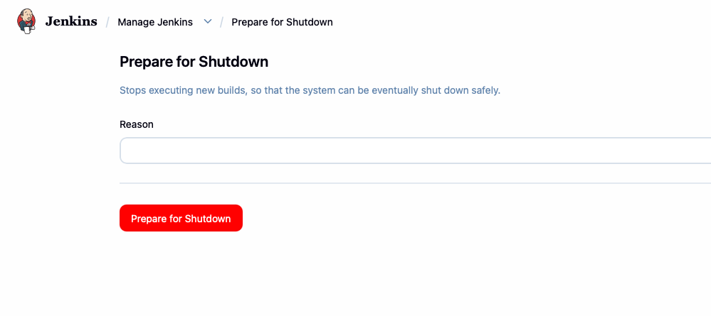
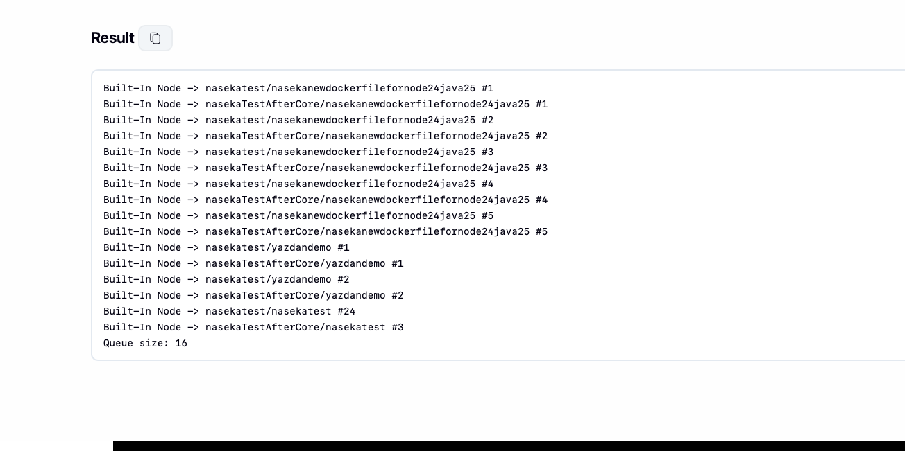
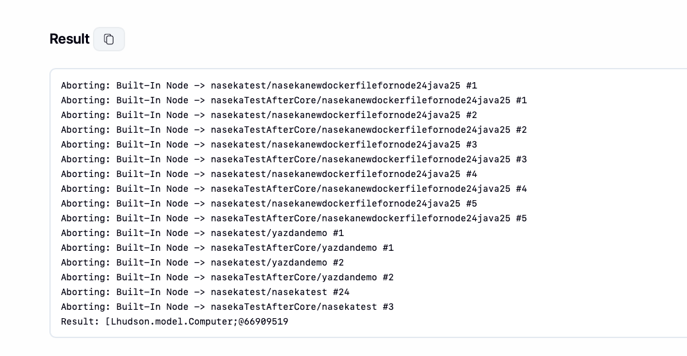
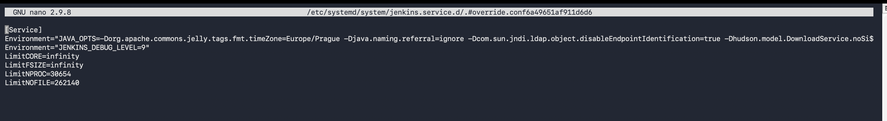
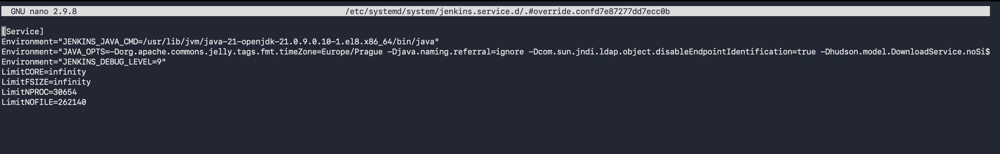
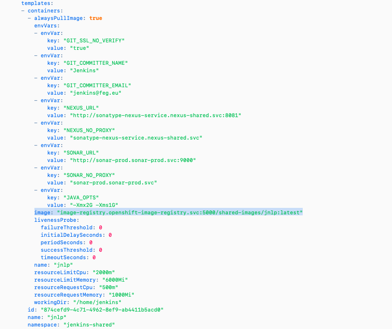
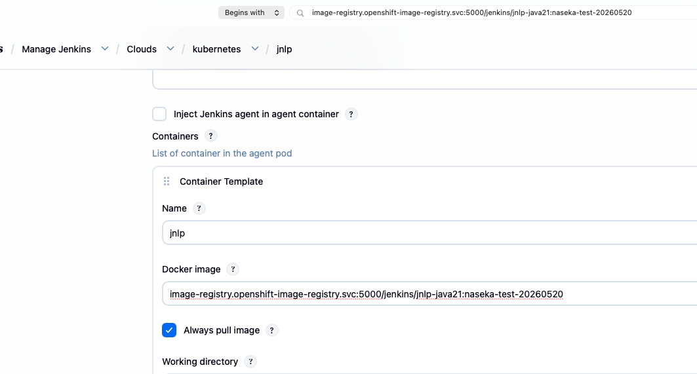
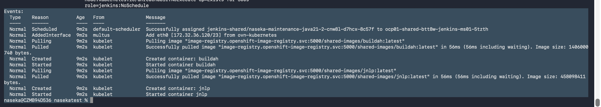

# prepare for outage

1) prepare for shutdown so no new builds are running

manage jenkins -> prepare for shutdown



2) run this script to check running builds:

```groovy
Jenkins.instance.computers.each { c ->
  (c.executors + c.oneOffExecutors).each { e ->
    def exec = e.currentExecutable
    if (exec != null) {
      println "${c.displayName} -> ${exec}"
    }
  }
}
println "Queue size: ${Jenkins.instance.queue.items.size()}"
```




3) abort running jobs - note aborting time:

```groovy
Jenkins.instance.computers.each { c ->
  (c.executors + c.oneOffExecutors).each { e ->
    def exec = e.currentExecutable
    if (exec != null) {
      println "Aborting: ${c.displayName} -> ${exec}"
      e.interrupt(Result.ABORTED)
    }
  }
}
```




# Deploy 1 - part 1 - install java 21 for Jenkins controller

## 1) Install Java 21 for Jenkins controller 

Check if Java 21 is available:

```bash
sudo dnf list available 'java-21-openjdk*'
```

Install Java 21 headless package:

```bash
sudo dnf install java-21-openjdk-headless
```

Find exact Java 21 binary:

```bash
rpm -ql java-21-openjdk-headless | grep '/bin/java$' # -q query -l list files -> ask rpm: show me all files installed by the package java-21-openjdk-headless.
```

```bash
[0 naseka@ad.ifortuna.cz@el8builder01-ocp01-shared.m.dc1.cz.ipa.ifortuna.cz ~]$ rpm -ql java-21-openjdk-headless | grep '/bin/java$'
/usr/lib/jvm/java-21-openjdk-21.0.9.0.10-1.el8.x86_64/bin/java # here we can see the path of Java 21 binary
[0 naseka@ad.ifortuna.cz@el8builder01-ocp01-shared.m.dc1.cz.ipa.ifortuna.cz ~]$ 
```


### stop jenkins

```bash
sudo systemctl stop jenkins
sudo systemctl status jenkins
```

## 2) Tell systemd Jenkins to use Java 21, cause I dont want to switch java on the whole server

Edit Jenkins systemd override:

```bash
sudo systemctl edit jenkins
```

**production**:



**test**:




Add this under `[Service]`, using the exact Java 21 path:

```ini
Environment="JENKINS_JAVA_CMD=/usr/lib/jvm/java-21-openjdk-21.0.9.0.10-1.el8.x86_64/bin/java"
```


Verify override:

```bash
sudo cat /etc/systemd/system/jenkins.service.d/override.conf
```


# Deploy 1 - part 2 - update JNLP to java 21

Backup YAML:

```bash
cd /var/lib/jenkins
sudo cp -a jenkins.yaml jenkins.yaml.$(date +%Y%m%d-%H%M%S).before-jnlp-java21
```

Change Jenkins JNLP image swapping this in yaml:





`image-registry.openshift-image-registry.svc:5000/jenkins/jnlp-java21:naseka-test-20260520`


Reload and restart:

```bash
sudo systemctl daemon-reload
sudo systemctl start jenkins
sudo systemctl status jenkins
```

Confirm Jenkins process really runs on Java 21:

```bash
sudo readlink -f /proc/$(pgrep -u jenkins -f jenkins.war)/exe # pgrep searches for running processes; -u jenkins = owned by user jenkins; -f = full command line contains jenkins.war. Command = find the process ID of a process owned by user jenkins whose full command line contains jenkins.war
```

Expected:

```bash
[130 naseka@ad.ifortuna.cz@el8builder01-ocp01-shared.m.dc1.cz.ipa.ifortuna.cz ~]$ sudo readlink -f /proc/$(pgrep -u jenkins -f jenkins.war)/exe
/usr/lib/jvm/java-21-openjdk-21.0.9.0.10-1.el8.x86_64/bin/java
[0 naseka@ad.ifortuna.cz@el8builder01-ocp01-shared.m.dc1.cz.ipa.ifortuna.cz ~]$ 

```

Check logs for Java/runtime problems:

```bash
sudo journalctl -u jenkins --since "5 minutes ago" --no-pager \
  | grep -Ei "UnsupportedClassVersion|UnsupportedClassVersionError|major version|classversion|has been compiled by a more recent version|illegal reflective|InaccessibleObjectException|IllegalAccessException|add-opens|module java"
```


## remove prepare for shutdown to be able to test

Manage Jenkins -> Cancel Quite Down

# test it out

## tun this simple pipeline: https://ci.svc.ifortuna.cz/job/Naseka_maintenance-java21/configure

```groovy
pipeline {
  agent {
    kubernetes {
      inheritFrom 'buildah'
    }
  }

  options {
    timeout(time: 20, unit: 'MINUTES')
    skipDefaultCheckout(true)
  }

  stages {
    stage('jnlp java check') {
      steps {
        container('jnlp') {
          sh '''
            echo "Inside explicit JNLP container"
            echo "NODE_NAME=$NODE_NAME"
            echo "HOSTNAME=$HOSTNAME"
            echo "WORKSPACE=$WORKSPACE"
            echo "Java path:"
            command -v java
            echo "Java version:"
            java -version
          '''
        }
      }
    }

    stage('buildah smoke') {
      steps {
        container('buildah') {
          sh '''
            echo "Inside explicit buildah container"
            echo "NODE_NAME=$NODE_NAME"
            echo "HOSTNAME=$HOSTNAME"
            id || true
            pwd
            buildah version || true
            echo "openshift-agent-ok"
          '''
        }
      }
    }

    stage('keep pod alive') {
      steps {
        container('jnlp') {
          sh '''
            echo "Sleeping 10 minutes for OpenShift pod inspection"
            echo "HOSTNAME=$HOSTNAME"
            sleep 600
          '''
        }
      }
    }
  }
}
```

## while running check pod provisioning:


Check actual pod image while job is running:

```bash
oc project jenkins-shared
oc get pods
oc get pod naseka-maintenance-java21-2-cnw8l-d7hcx-8c57f
oc describe pod naseka-maintenance-java21-2-cnw8l-d7hcx-8c57f
```

check events and from where image is pulled:




## compair console output of new run with run yesterday prior the change:

https://ci.svc.ifortuna.cz/job/Naseka_maintenance-java21/2/

# rollback plan


```bash
sudo systemctl stop jenkins
cd /var/lib/jenkins
sudo cp -a jenkins.yaml.<BACKUP_TIMESTAMP>.before-java21-jnlp jenkins.yaml
sudo systemctl edit jenkins
```
remove this: 

```text
Environment="JENKINS_JAVA_CMD=/usr/lib/jvm/java-21-openjdk-21.0.9.0.10-1.el8.x86_64/bin/java"
```

```bash
sudo systemctl daemon-reload
sudo systemctl start jenkins
sudo systemctl status jenkins
sudo readlink -f /proc/$(pgrep -u jenkins -f jenkins.war)/exe #exected result: /usr/lib/jvm/java-17-openjdk-.../bin/java
```
run same maintenance pipeline