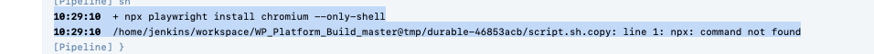
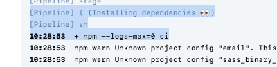
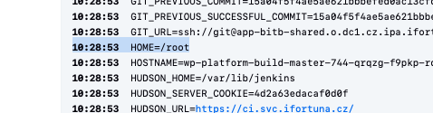
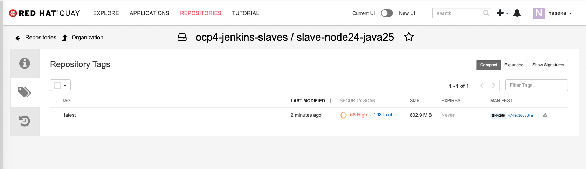

# Problem:
1. Yazdan added new pod template for node24 java25
2. first npm didnt work
3. npm was fixed in the docker file
4. now npx doesn work


# Solution
I need to understand Yazdan's docker file and compair to my docker file for node22 java25

# failure from console output



# more on console output

npm ci completed successfully: means Jenkins installed all project dependencies exactly from the lock file before running build/test commands. Since that step succeeded, the issue was not dependency installation. 



`npm ci`  = clean install:

Main differences from npm install:

            npm ci deletes existing node_modules first.
            It requires package-lock.json.
            It does not update package-lock.json.
            It fails if package.json and package-lock.json do not match.
            It is usually faster and more reproducible in Jenkins.


So dependency installation worked, then later the pipeline tried to run npx, but the node24 image does not have npx available on PATH.

Looked at the Yazdan's dockerfile:

```bash
FROM registry.svc.ifortuna.cz/build-images/ubi10:latest

ENV NODEJS_VERSION=24

#test ubi10 java25, trigger rebuild
RUN set -ex &&\
    export https_proxy=http://10.0.68.20:3128 &&\
    export http_proxy=http://10.0.68.20:3128 &&\
    export no_proxy=nexus.svc.ifortuna.cz &&\
    dnf update -y --exclude=filesystem &&\
    dnf install -y  --setopt=tsflags=nodocs  --disablerepo=FTN_ftn-pg_contrib_\*  procps-ng tar gcc make bzip2 java-25-openjdk-headless java-25-openjdk-devel java-25-openjdk &&\
    MODULE_DEPS="make gcc gcc-c++ git openssl-devel unzip nss" && \
    INSTALL_PKGS="$MODULE_DEPS nodejs${NODEJS_VERSION}-npm nodejs-nodemon nss_wrapper" && \
    ln -s /usr/lib/node_modules/nodemon/bin/nodemon.js /usr/bin/nodemon && \
    ln -s /usr/bin/node-24 /usr/bin/node && \
    ln -s /usr/bin/npm-24 /usr/bin/npm && \
    dnf install -y --setopt=tsflags=nodocs --nobest $INSTALL_PKGS && \
    rpm -V $INSTALL_PKGS && \
    node -v | grep -qe "^v$NODEJS_VERSION\." && echo "Found NODE $NODEJS_VERSION" && \
    npm -v && echo "Found NPM" && \
    ln -s /usr/lib/node_modules /usr/local/lib/node_modules &&\
    curl -k -o /etc/pki/ca-trust/source/anchors/ftn_ca_bundle.crt https://nexus.svc.ifortuna.cz/repository/jenkins/ftn_ca_bundle.crt && \
    update-ca-trust extract &&\
    mkdir -p /opt/async-profiler &&  \
    curl -k -o /tmp/async-profiler.tar.gz -fSL https://nexus.svc.ifortuna.cz/repository/ocp_infra/async-profiler/async-profiler-3.0-linux-x64.tar.gz && \
    tar -xf /tmp/async-profiler.tar.gz -C /opt/async-profiler --strip-components=1 && \
    rm -rf /tmp/async-profiler.tar.gz &&\
    dnf clean all &&\
    rm -rf /var/cache/dnf &&\
    rm -rf /tmp/*

ENV JAVA_HOME /usr/lib/jvm/java
ENV PATH=/opt/async-profiler:$PATH
```

## compaired to my dockerfile: base was java25 image


```bash
FROM registry.svc.ifortuna.cz/ocp4-jenkins-slaves/slave-base-java25:latest #!!! so i modified the base image. i dont need maven! just java 25

ENV NODEJS_VERSION=22 \
    NPM_CONFIG_PREFIX=/home/jenkins/.npm-global \
    PATH=/opt/rh/rh-php56/root/usr/bin:/opt/rh/rh-nodejs14/root/bin:/home/jenkins/node_modules/.bin/:/home/jenkins/.npm-global/bin/:$PATH

ADD almalinux.repo /etc/yum.repos.d/

USER root

# Install Node.js 22 and browser dependencies


RUN set -ex &&\
    export https_proxy=http://10.0.68.20:3128 &&\
    export http_proxy=http://10.0.68.20:3128 &&\
    export no_proxy="nexus.svc.ifortuna.cz,sonatype-nexus-service.nexus-shared.svc,czdcm-satellite.lx.ifortuna.cz" &&\
    curl -sL https://dl.yarnpkg.com/rpm/yarn.repo | tee /etc/yum.repos.d/yarn.repo &&\
    ls -ltr /etc/yum.repos.d/ &&\
    ln -s /usr/lib/node_modules/nodemon/bin/nodemon.js /usr/bin/nodemon && \
    dnf install -y --setopt=tsflags=nodocs --nobest nodejs npm nodejs-nodemon nss_wrapper make gcc gcc-c++ git openssl-devel libXScrnSaver unzip xorg-x11-server-Xvfb gtk2-devel gtk3-devel libnotify-devel nss libXScrnSaver alsa-lib && \
    node -v | grep -qe "^v$NODEJS_VERSION\." && echo "Found VERSION $NODEJS_VERSION" && \
    curl -o /tmp/google-chrome-stable_current_x86_64.rpm https://dl.google.com/linux/direct/google-chrome-stable_current_x86_64.rpm &&\
    curl -o /tmp/linux_signing_key.pub https://dl.google.com/linux/linux_signing_key.pub && \
    rpm --import /tmp/linux_signing_key.pub && \
    dnf install -y --nogpgcheck --setopt=tsflags=nodocs /tmp/google-chrome-stable_current_x86_64.rpm &&\
    dnf clean all &&\
    rm -rf /var/cache/* &&\
    rm -rf /tmp/*

USER jenkins
```


## original docker file for maven-node22-java25, which i used to create my dockerifle later:

```bash
FROM registry.svc.ifortuna.cz/ocp4-jenkins-slaves/slave-maven-java25:latest 


#here we are setting build runtime environment: 1) NODEJS_VERSION=22: expected major Node version.2)NPM_CONFIG_PREFIX=/home/jenkins/.npm-global: global npm installs go under Jenkins home, not system dirs.3) PATH=...: adds several directories to command lookup:
##old PHP path
##old Node.js 14 Software Collection path
##npm global binaries: /home/jenkins/.npm-global/bin
##existing system PATH

ENV NODEJS_VERSION=22 \
    NPM_CONFIG_PREFIX=/home/jenkins/.npm-global \
    PATH=/opt/rh/rh-php56/root/usr/bin:/opt/rh/rh-nodejs14/root/bin:/home/jenkins/node_modules/.bin/:/home/jenkins/.npm-global/bin/:$PATH         

# trigger build 234
# repo se pridava kvuli zavislostem google-chrome, xdg-utils, liberation-fonts, vulkan-loader
# pro jednoduchost pridano do nexus 

# Copies custom repo config into the image. Comment says it is needed for dependencies of Google Chrome
ADD almalinux.repo /etc/yum.repos.d/


# Switches to root because package installation and writing into /usr/bin, /etc/yum.repos.d, /tmp, etc. require root.
USER root


# runs a shell block:
## set -e: fail immediately if a command fails.
## set -x: print commands while executing, useful in build logs.
RUN set -ex &&\
# Sets proxy only inside this RUN layer so dnf and curl can reach external/internal repos.
    export https_proxy=http://10.0.68.20:3128 &&\
    export http_proxy=http://10.0.68.20:3128 &&\
    export no_proxy="nexus.svc.ifortuna.cz,sonatype-nexus-service.nexus-shared.svc,czdcm-satellite.lx.ifortuna.cz" &&\
    #!!!!! dnf -y module enable nodejs:$NODEJS_VERSION && \

#Adds Yarn RPM repo. The comments say this was added because of npm-related problems, although in the current active install line it does not actually install yarn.
    curl -sL https://dl.yarnpkg.com/rpm/yarn.repo | tee /etc/yum.repos.d/yarn.repo &&\

#Debugging: shows which repos are available during build.
    ls -ltr /etc/yum.repos.d/ &&\
    # pridani yarn kvuli problemum s npm
    #MODULE_DEPS="make gcc gcc-c++ git openssl-devel libXScrnSaver unzip xorg-x11-server-Xvfb gtk2-devel gtk3-devel libnotify-devel nss libXScrnSaver alsa-lib" && \
    #INSTALL_PKGS="$MODULE_DEPS nodejs npm nodejs-nodemon nss_wrapper" && \

#Creates nodemon command manually. This is a bit fragile because it creates the symlink before nodejs-nodemon is installed.
    ln -s /usr/lib/node_modules/nodemon/bin/nodemon.js /usr/bin/nodemon && \
    # dnf install -y --setopt=tsflags=nodocs --nobest $INSTALL_PKGS && \
#Installs Node and many build/browser dependencies.
##important part nodejs npm -> this installs the normal unverstioned node/npm packages -> thats why npx works in this image
    dnf install -y --setopt=tsflags=nodocs --nobest nodejs npm nodejs-nodemon nss_wrapper make gcc gcc-c++ git openssl-devel libXScrnSaver unzip xorg-x11-server-Xvfb gtk2-devel gtk3-devel libnotify-devel nss libXScrnSaver alsa-lib && \
    #rpm -V $INSTALL_PKGS && \
# Verifies installed Node major version is 22. If Node is not v22.x, the Docker build fails.
    node -v | grep -qe "^v$NODEJS_VERSION\." && echo "Found VERSION $NODEJS_VERSION" && \
    # dnf install -y --setopt=tsflags=nodocs python3 bzip2 gcc-c++ make &&\
    # dnf install -y nodejs --disablerepo="*" --enablerepo="yarn"  &&\

#Downloads and installs Google Chrome stable.
    curl -o /tmp/google-chrome-stable_current_x86_64.rpm https://dl.google.com/linux/direct/google-chrome-stable_current_x86_64.rpm &&\
    curl -o /tmp/linux_signing_key.pub https://dl.google.com/linux/linux_signing_key.pub && \
    rpm --import /tmp/linux_signing_key.pub && \
    dnf install -y --nogpgcheck --setopt=tsflags=nodocs /tmp/google-chrome-stable_current_x86_64.rpm &&\
#Cleans package cache and temporary files to make the final image smaller.
    dnf clean all &&\
    rm -rf /var/cache/* &&\
    rm -rf /tmp/*
#Very important. Final container runs as jenkins, not root.

USER jenkins
# Enabling Java 25 build agents for jenkins
```

# main difference with yazdan's file

1. 
`FROM registry.svc.ifortuna.cz/build-images/ubi10:latest` -> this is generic base image -> more setup needed. better use this one: `FROM registry.svc.ifortuna.cz/ocp4-jenkins-slaves/slave-base-java25:latest`

2. node/npm installation style.


indeed this part of yazdan's file makes sure, that its node-24: `INSTALL_PKGS="$MODULE_DEPS nodejs${NODEJS_VERSION}-npm nodejs-nodemon nss_wrapper"` in my docker file i had `dnf install ... nodejs npm ...` which created starndard commands without providing versioned binaries

3. he manually creates 

```dockerfile
ln -s /usr/bin/node-24 /usr/bin/node
ln -s /usr/bin/npm-24 /usr/bin/npm
```

but he doesnt create:

```dockefile
ln -s /usr/bin/npx-24 /usr/bin/npx
``` 

so the problem: `npx: command not found`

4. in general (also problem in original)

we create symlinks before installing packages, better first install packages and then create symlinks:
```dockerfile
dnf install ... && \
ln -sf /usr/bin/node-24 /usr/bin/node && \
ln -sf /usr/bin/npm-24 /usr/bin/npm && \
ln -sf /usr/bin/npx-24 /usr/bin/npx
```

5. very important!

in the console output there is : `HOME=/root`



but it shoudl be `USER jenkins` -> this will affect so many things. 

6. in my dockerfiel there is npm env and path setup:

```dockerfile
ENV NPM_CONFIG_PREFIX=/home/jenkins/.npm-global
PATH=/home/jenkins/node_modules/.bin/:/home/jenkins/.npm-global/bin/:$PATH
```

in yazdan's:

```dockerfile
PATH=/opt/async-profiler:$PATH
```

### fix for yazdan's file:

1. add:
`ln -sf /usr/bin/npx-24 /usr/bin/npx && \` -> this will fix npx error adam reported

2. restore npm behaviour:

```dockerfile
ENV NPM_CONFIG_PREFIX=/home/jenkins/.npm-global \
    PATH=/opt/async-profiler:/home/jenkins/node_modules/.bin:/home/jenkins/.npm-global/bin:$PATH
```

explanation: 

your dockerffile only has this in path: `ENV PATH=/opt/async-profiler:$PATH`, but the block above does two things:

a) `ENV NPM_CONFIG_PREFIX=/home/jenkins/.npm-global` -> if inpm installs a global tool, put command binaries here, not under system folders like /usr

b) then this part:
`PATH=/opt/async-profiler:/home/jenkins/node_modules/.bin:/home/jenkins/.npm-global/bin:$PATH` = when looking for commands -> search these folders

3. make sure USER jenkins at the end (in my original dockerfile first you are USER root -> you run commands and at the end you switch to user jenkins):

```dockerfile
USER jenkins
```

# if i recreated dockerfile from existing node22-java25 (just swapped 22 into 24)


```dockerfile
FROM registry.svc.ifortuna.cz/ocp4-jenkins-slaves/slave-base-java25:latest

ENV NODEJS_VERSION=24 \
    NPM_CONFIG_PREFIX=/home/jenkins/.npm-global \
    PATH=/opt/rh/rh-php56/root/usr/bin:/opt/rh/rh-nodejs14/root/bin:/home/jenkins/node_modules/.bin/:/home/jenkins/.npm-global/bin/:$PATH

ADD almalinux.repo /etc/yum.repos.d/

USER root

# Install Node.js 24 and browser dependencies

RUN set -ex &&\
    export https_proxy=http://10.0.68.20:3128 &&\
    export http_proxy=http://10.0.68.20:3128 &&\
    export no_proxy="nexus.svc.ifortuna.cz,sonatype-nexus-service.nexus-shared.svc,czdcm-satellite.lx.ifortuna.cz" &&\
    curl -sL https://dl.yarnpkg.com/rpm/yarn.repo | tee /etc/yum.repos.d/yarn.repo &&\
    ls -ltr /etc/yum.repos.d/ &&\
    ln -s /usr/lib/node_modules/nodemon/bin/nodemon.js /usr/bin/nodemon && \
    dnf install -y --setopt=tsflags=nodocs --nobest nodejs npm nodejs-nodemon nss_wrapper make gcc gcc-c++ git openssl-devel libXScrnSaver unzip xorg-x11-server-Xvfb gtk2-devel gtk3-devel libnotify-devel nss libXScrnSaver alsa-lib && \
    node -v | grep -qe "^v$NODEJS_VERSION\." && echo "Found VERSION $NODEJS_VERSION" && \
    curl -o /tmp/google-chrome-stable_current_x86_64.rpm https://dl.google.com/linux/direct/google-chrome-stable_current_x86_64.rpm &&\
    curl -o /tmp/linux_signing_key.pub https://dl.google.com/linux/linux_signing_key.pub && \
    rpm --import /tmp/linux_signing_key.pub && \
    dnf install -y --nogpgcheck --setopt=tsflags=nodocs /tmp/google-chrome-stable_current_x86_64.rpm &&\
    dnf clean all &&\
    rm -rf /var/cache/* &&\
    rm -rf /tmp/*

USER jenkins
```

ran this pipeline: https://ci.svc.ifortuna.cz/job/nasekatest/job/node24test/4/

```groovy
pipeline {
  agent { label 'buildah' }

  stages {
    stage('Build slave-node24-java25') {
      steps {
        container('buildah') {
          sh '''
            set -eux
            cd slave-node24-java25

            buildah bud \
              --format=docker \
              -t slave-node24-java25:naseka-test-${BUILD_NUMBER} \
              .
          '''
        }
      }
    }

    stage('Verify slave-node24-java25') {
      steps {
        container('buildah') {
          sh '''
            set -eux

            ctr=$(buildah from slave-node24-java25:naseka-test-${BUILD_NUMBER})

            buildah run "$ctr" -- node -v
            buildah run "$ctr" -- npm -v
            buildah run "$ctr" -- npx -v
            buildah run "$ctr" -- whoami
            buildah run "$ctr" -- sh -c 'echo HOME=$HOME'
            buildah run "$ctr" -- sh -c 'command -v node && command -v npm && command -v npx'

            buildah rm "$ctr"
          '''
        }
      }
    }
  }
}
```

it failed.. version is not 24, but 22

### more troubleshooting:

this command:

`dnf install ... nodejs npm ...` -> still resolves to node 22

so `NODEJS_VERSION=24` is just expectation/check variable. it doesnt tell node which package to install

`dnf install ... nodejs npm ...` -> says give me default nodejs pacakge and my repo answered default is node22.

so my build failed on `node -v | grep -qe "^v$NODEJS_VERSION\."`

so i cannot use plain `nodejs npm` unless my repo default is changed to Node 24.

i need `nodejs24-npm`


FROM registry.svc.ifortuna.cz/ocp4-jenkins-slaves/slave-base-java25:latest

ENV NODEJS_VERSION=24 \
    NPM_CONFIG_PREFIX=/home/jenkins/.npm-global \
    PATH=/opt/rh/rh-php56/root/usr/bin:/opt/rh/rh-nodejs14/root/bin:/home/jenkins/node_modules/.bin/:/home/jenkins/.npm-global/bin/:$PATH

ADD almalinux.repo /etc/yum.repos.d/

USER root

# Install Node.js 24 and browser dependencies

RUN set -ex &&\
    export https_proxy=http://10.0.68.20:3128 &&\
    export http_proxy=http://10.0.68.20:3128 &&\
    export no_proxy="nexus.svc.ifortuna.cz,sonatype-nexus-service.nexus-shared.svc,czdcm-satellite.lx.ifortuna.cz" &&\
    curl -sL https://dl.yarnpkg.com/rpm/yarn.repo | tee /etc/yum.repos.d/yarn.repo &&\
    ls -ltr /etc/yum.repos.d/ &&\
    ln -s /usr/lib/node_modules/nodemon/bin/nodemon.js /usr/bin/nodemon && \
    dnf install -y --setopt=tsflags=nodocs --nobest nodejs24-npm npm nodejs-nodemon nss_wrapper make gcc gcc-c++ git openssl-devel libXScrnSaver unzip xorg-x11-server-Xvfb gtk2-devel gtk3-devel libnotify-devel nss libXScrnSaver alsa-lib && \
    node -v | grep -qe "^v$NODEJS_VERSION\." && echo "Found VERSION $NODEJS_VERSION" && \
    curl -o /tmp/google-chrome-stable_current_x86_64.rpm https://dl.google.com/linux/direct/google-chrome-stable_current_x86_64.rpm &&\
    curl -o /tmp/linux_signing_key.pub https://dl.google.com/linux/linux_signing_key.pub && \
    rpm --import /tmp/linux_signing_key.pub && \
    dnf install -y --nogpgcheck --setopt=tsflags=nodocs /tmp/google-chrome-stable_current_x86_64.rpm &&\
    dnf clean all &&\
    rm -rf /var/cache/* &&\
    rm -rf /tmp/*

USER jenkins


# useful command to show how i changed it -> send to yazdan

```bash
naseka@CZMB94D536 ocp4-jenkins-agents-java25 % git diff -- slave-node24-java25/Dockerfile
diff --git a/slave-node24-java25/Dockerfile b/slave-node24-java25/Dockerfile
index 2cd6504..e50eaa3 100644
--- a/slave-node24-java25/Dockerfile
+++ b/slave-node24-java25/Dockerfile
@@ -1,33 +1,35 @@
-FROM registry.svc.ifortuna.cz/build-images/ubi10:latest
+FROM registry.svc.ifortuna.cz/ocp4-jenkins-slaves/slave-base-java25:latest
 
-ENV NODEJS_VERSION=24
+ENV NODEJS_VERSION=24 \
+    NPM_CONFIG_PREFIX=/home/jenkins/.npm-global \
+    PATH=/opt/rh/rh-php56/root/usr/bin:/opt/rh/rh-nodejs14/root/bin:/home/jenkins/node_modules/.bin/:/home/jenkins/.npm-global/bin/:$PATH
+
+ADD almalinux.repo /etc/yum.repos.d/
+
+USER root
+
+# Install Node.js 24 and browser dependencies
 
-#test ubi10 java25, trigger rebuild
 RUN set -ex &&\
     export https_proxy=http://10.0.68.20:3128 &&\
     export http_proxy=http://10.0.68.20:3128 &&\
-    export no_proxy=nexus.svc.ifortuna.cz &&\
-    dnf update -y --exclude=filesystem &&\
-    dnf install -y  --setopt=tsflags=nodocs  --disablerepo=FTN_ftn-pg_contrib_\*  procps-ng tar gcc make bzip2 java-25-openjdk-headless java-25-openjdk-devel java-25-openjdk &&\
-    MODULE_DEPS="make gcc gcc-c++ git openssl-devel unzip nss" && \
-    INSTALL_PKGS="$MODULE_DEPS nodejs${NODEJS_VERSION}-npm nodejs-nodemon nss_wrapper" && \
+    export no_proxy="nexus.svc.ifortuna.cz,sonatype-nexus-service.nexus-shared.svc,czdcm-satellite.lx.ifortuna.cz" &&\
+    curl -sL https://dl.yarnpkg.com/rpm/yarn.repo | tee /etc/yum.repos.d/yarn.repo &&\
+    ls -ltr /etc/yum.repos.d/ &&\
     ln -s /usr/lib/node_modules/nodemon/bin/nodemon.js /usr/bin/nodemon && \
-    ln -s /usr/bin/node-24 /usr/bin/node && \
-    ln -s /usr/bin/npm-24 /usr/bin/npm && \
-    dnf install -y --setopt=tsflags=nodocs --nobest $INSTALL_PKGS && \
-    rpm -V $INSTALL_PKGS && \
-    node -v | grep -qe "^v$NODEJS_VERSION\." && echo "Found NODE $NODEJS_VERSION" && \
+    dnf install -y --setopt=tsflags=nodocs --nobest nodejs24-npm nodejs-nodemon nss_wrapper make gcc gcc-c++ git openssl-devel libXScrnSaver unzip xorg-x11-server-Xvfb gtk2-devel gtk3-devel libnotify-devel nss libXScrnSaver alsa-lib && \
+    ln -sf /usr/bin/node-24 /usr/bin/node && \
+    ln -sf /usr/bin/npm-24 /usr/bin/npm && \
+    ln -sf /usr/bin/npx-24 /usr/bin/npx && \
+    node -v | grep -qe "^v$NODEJS_VERSION\." && echo "Found VERSION $NODEJS_VERSION" && \
     npm -v && echo "Found NPM" && \
-    ln -s /usr/lib/node_modules /usr/local/lib/node_modules &&\
-    curl -k -o /etc/pki/ca-trust/source/anchors/ftn_ca_bundle.crt https://nexus.svc.ifortuna.cz/repository/jenkins/ftn_ca_bundle.crt && \
-    update-ca-trust extract &&\
-    mkdir -p /opt/async-profiler &&  \
-    curl -k -o /tmp/async-profiler.tar.gz -fSL https://nexus.svc.ifortuna.cz/repository/ocp_infra/async-profiler/async-profiler-3.0-linux-x64.tar.gz && \
-    tar -xf /tmp/async-profiler.tar.gz -C /opt/async-profiler --strip-components=1 && \
-    rm -rf /tmp/async-profiler.tar.gz &&\
+    npx -v && echo "Found NPX" && \
+    curl -o /tmp/google-chrome-stable_current_x86_64.rpm https://dl.google.com/linux/direct/google-chrome-stable_current_x86_64.rpm &&\
+    curl -o /tmp/linux_signing_key.pub https://dl.google.com/linux/linux_signing_key.pub && \
+    rpm --import /tmp/linux_signing_key.pub && \
+    dnf install -y --nogpgcheck --setopt=tsflags=nodocs /tmp/google-chrome-stable_current_x86_64.rpm &&\
     dnf clean all &&\
-    rm -rf /var/cache/dnf &&\
+    rm -rf /var/cache/* &&\
     rm -rf /tmp/*
 
-ENV JAVA_HOME /usr/lib/jvm/java
-ENV PATH=/opt/async-profiler:$PATH
\ No newline at end of file
+USER jenkins
\ No newline at end of file
naseka@CZMB94D536 ocp4-jenkins-agents-java25 % 
```


after the change in docker file -> jenkins pushed the new image ok:



now i can run my test pipeline