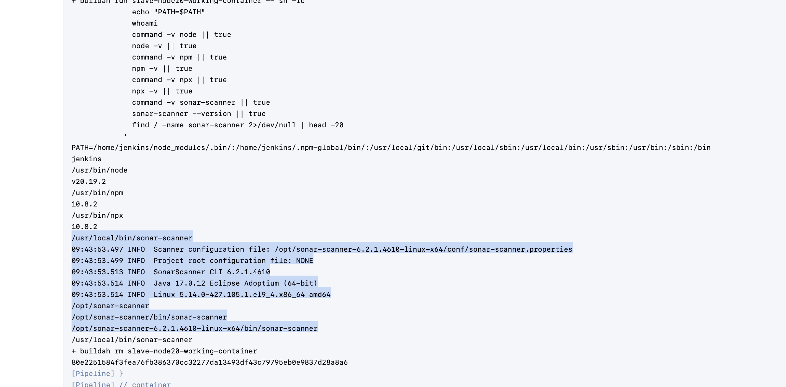
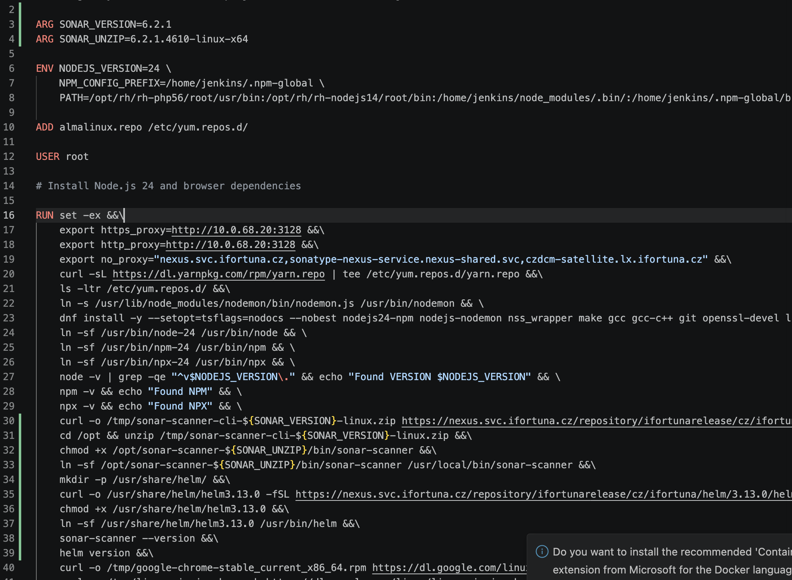

# check whether sonar commands existed in the old base ubi10 image:

created a pipeline checking that:

https://ci.svc.ifortuna.cz/job/Naseka%20Jenkins%20Admin/job/Inspectubi10/1/console


```groovy
pipeline {
  agent { label 'buildah' }

  stages {
    stage('Check images') {
      steps {
        container('buildah') {
          sh '''
            set -eux

            for IMG in \
              registry.svc.ifortuna.cz/build-images/ubi10:latest \
              registry.svc.ifortuna.cz/ocp4-jenkins-slaves/slave-base-java25:latest \
              registry.svc.ifortuna.cz/ocp4-jenkins-slaves/slave-node24-java25:latest
            do
              echo "===== $IMG ====="
              ctr=$(buildah from --tls-verify=false "$IMG")
              buildah run "$ctr" -- sh -lc 'command -v sonar-scanner || true; sonar-scanner --version || true; echo "$PATH"'
              buildah rm "$ctr"
            done
          '''
        }
      }
    }
  }
}
```

nothing was there

# checking working node 20 image:

first -> find the registry lcoation: 

```bash
oc get istag node20:latest -n shared-images -o jsonpath='{.image.dockerImageReference}{"\n"}'
```
```bash
naseka@CZMB94D536 nasekatest % oc get istag node20:latest -n shared-images -o jsonpath='{.image.dockerImageReference}{"\n"}'
registry.svc.ifortuna.cz/ocp4-jenkins-slaves/slave-node20@sha256:06cad57f83430f3729e97f9cee3632dc6ad416a369ecf65c731a9c2bd04144fb
naseka@CZMB94D536 nasekatest % 
```

# run the pipeline again:

pipeline {
  agent { label 'buildah' }

  stages {
    stage('Check node20') {
      steps {
        container('buildah') {
          sh '''
            set -eux

            IMG='registry.svc.ifortuna.cz/ocp4-jenkins-slaves/slave-node20@sha256:06cad57f83430f3729e97f9cee3632dc6ad416a369ecf65c731a9c2bd04144fb'

            ctr=$(buildah from --tls-verify=false "$IMG")
            buildah run "$ctr" -- sh -lc '
              echo "PATH=$PATH"
              whoami
              command -v node || true
              node -v || true
              command -v npm || true
              npm -v || true
              command -v npx || true
              npx -v || true
              command -v sonar-scanner || true
              sonar-scanner --version || true
              find / -name sonar-scanner 2>/dev/null | head -20
            '
            buildah rm "$ctr"
          '''
        }
      }
    }
  }
}

and yes old node 20 has sonar scanner:



# what else might be missing from node 20? run new pipeline:

```groovy
pipeline {
  agent { label 'buildah' }

  stages {
    stage('Compare node20 vs node24-java25') {
      steps {
        container('buildah') {
          sh '''
            set -eux

            OLD='registry.svc.ifortuna.cz/ocp4-jenkins-slaves/slave-node20@sha256:06cad57f83430f3729e97f9cee3632dc6ad416a369ecf65c731a9c2bd04144fb'
            NEW='registry.svc.ifortuna.cz/ocp4-jenkins-slaves/slave-node24-java25:latest'

            for NAME in old new; do
              if [ "$NAME" = old ]; then IMG="$OLD"; else IMG="$NEW"; fi
              echo "===== Inspecting $NAME: $IMG ====="
              ctr=$(buildah from --tls-verify=false "$IMG")

              buildah run "$ctr" -- sh -lc '
                echo "### USER"; whoami; id
                echo "### PATH"; echo "$PATH"
                echo "### JAVA"; command -v java || true; java -version || true
                echo "### NODE"; command -v node || true; node -v || true
                echo "### NPM"; command -v npm || true; npm -v || true
                echo "### NPX"; command -v npx || true; npx -v || true
                echo "### SONAR"; command -v sonar-scanner || true; sonar-scanner --version || true
                echo "### COMMON TOOLS"
                for c in git ssh curl unzip tar gzip make gcc g++ python python3 helm pnpm yarn nodemon google-chrome Xvfb; do
                  printf "%-20s" "$c"; command -v "$c" || true
                done
                echo "### IMPORTANT DIRS"
                ls -ld /opt/sonar-scanner* /usr/local/bin/sonar-scanner /home/jenkins/.npm-global /home/jenkins/node_modules 2>/dev/null || true
              ' | tee "$NAME-tools.txt"

              buildah run "$ctr" -- sh -lc 'rpm -qa | sort' > "$NAME-rpms.txt"
              buildah rm "$ctr"
            done

            echo "===== Commands/tools difference ====="
            diff -u old-tools.txt new-tools.txt || true

            echo "===== RPM packages only in old node20 ====="
            comm -23 old-rpms.txt new-rpms.txt || true

            echo "===== RPM packages only in new node24-java25 ====="
            comm -13 old-rpms.txt new-rpms.txt || true
          '''
        }
      }
    }
  }
}
```

!!! yarn and helm are missing on top of sonar!

# inspect if basic ubi 10 has yarn and helm


```groovy
pipeline {
  agent { label 'buildah' }

  stages {
    stage('Check ubi10 tools') {
      steps {
        container('buildah') {
          sh '''
            set -eux

            IMG='registry.svc.ifortuna.cz/build-images/ubi10:latest'

            ctr=$(buildah from --tls-verify=false "$IMG")
            buildah run "$ctr" -- sh -lc '
              echo "PATH=$PATH"
              for c in helm yarn node npm npx sonar-scanner git curl; do
                printf "%-20s" "$c"
                command -v "$c" || true
              done
              helm version || true
              yarn --version || true
            '
            buildah rm "$ctr"
          '''
        }
      }
    }
  }
}
```

helm, yarn and sonar-scanner are not there


# were they in original slave-maven-java25 base image? which was base for maven-node22-java25?

```groovy
pipeline {
  agent { label 'buildah' }

  stages {
    stage('Check slave-maven-java25 tools') {
      steps {
        container('buildah') {
          sh '''
            set -eux

            IMG='registry.svc.ifortuna.cz/ocp4-jenkins-slaves/slave-maven-java25:latest'

            ctr=$(buildah from --tls-verify=false "$IMG")
            buildah run "$ctr" -- sh -lc '
              echo "PATH=$PATH"
              whoami
              java -version || true
              mvn -version || true

              for c in helm yarn node npm npx sonar-scanner git curl unzip tar gzip make gcc g++ python3 nodemon google-chrome Xvfb; do
                printf "%-20s" "$c"
                command -v "$c" || true
              done

              sonar-scanner --version || true
              helm version || true
              yarn --version || true
            '
            buildah rm "$ctr"
          '''
        }
      }
    }
  }
}
```

that image does have: sonar-scanner, helm, yarn

So likely history:

slave-maven-java25 provided sonar-scanner and helm.
Your copied node22-java25 changed base from slave-maven-java25 to slave-base-java25 to remove Maven.
By doing that, you also lost inherited sonar-scanner and helm.
Old node20 had sonar-scanner, helm, and yarn, but yarn did not come from slave-maven-java25.

# i checked slave-maven-java25 dockerfile and took from there commands to install helm and sonnar to my new dockerfile


1. created new branch

2. edited the dockerfile



