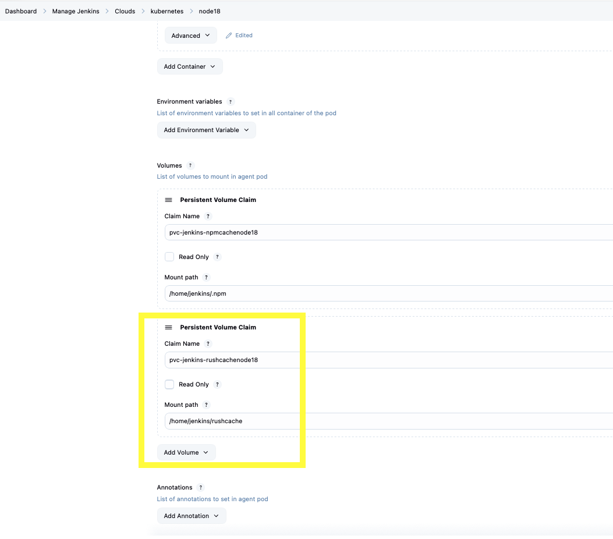
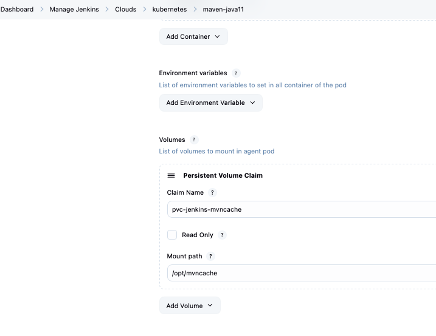
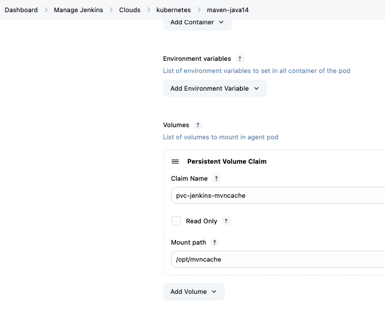

# explanation of the problem

Investigate high storage usage on Jenkins/OpenShift PVC: pvc-jenkins-rushcachenode18
This PVC is mounted in node18 Jenkins agents at: /home/jenkins/rushcache


`/home/jenkins/rushcache/build-cache` is inside the agent pod mount, its not a real directory on the Jenkins controller.

so you cannot check it with `du -sh /home/jenkins/rushcache/build-cache`

so we need to check that from a pod that has pvc-jenkins-rushcachenode18 mounted.

## theory behind:

Rush is a build/dependency manager for big JavaScript/TypeScript repositories.

npm/yarn/pnpm = manage one JavaScript project
Rush = manage many JavaScript projects together in one

PVC = named disk in OpenShift

Jenkins pod is temporary, so if hte pod stored everything inside -> all files would dissapear when the pod dies. So PVC is the fix for that issue.

Discs of openshift for ex.:

```text
pvc-jenkins-rushcache14      = disk for node14 Rush cache
pvc-jenkins-rushcachenode18  = disk for node18 Rush cache
pvc-jenkins-rushcache22      = disk for node22 Rush cache
pvc-jenkins-mvncache         = disk for Maven cache
```

When Jenkins starts a pod, it can plug in on of these disks.Inside the pod Jenkins chooses where the named disc indicated in pod template appears -> mount path

example:

```text
PVC/disk:     pvc-jenkins-rushcachenode18
Mounted at:   /home/jenkins/rushcache
```



so `/home/jenkins/rushcache` is not a real folder on Jenkins controller, its a folder inside the pod, backed by PVC disk


Different PVCs can be mounted to the same path in different pod templates. Ex:

```text
node14 pod:
  pvc-jenkins-rushcache14 mounted at /home/jenkins/rushcache

node18 pod:
  pvc-jenkins-rushcachenode18 mounted at /home/jenkins/rushcache

node22 pod:
  pvc-jenkins-rushcache22 mounted at /home/jenkins/rushcache
```
inside each pod the path looks the same: `/home/jenkins/rushcache`, but behind it actual disk is different, cause claim name is different. 

If claim name is also the same -> then its the same PCV/disc. For ex. 





that means both of the pod templates are mounting the same OpenShift disk -> meaning both pod templates share same stored files. If one pod writes a file there, another pod using the same PVC can see it too.

## useful command:

`oc get pvc`

```bash
naseka@Mac ~ % oc get pvc
NAME                          STATUS   VOLUME                                     CAPACITY   ACCESS MODES   STORAGECLASS           VOLUMEATTRIBUTESCLASS   AGE
pvc-jenkins-aws-credentials   Bound    pvc-00fd295e-7e1b-4796-a955-7ad22eceead5   200Mi      RWX            ontap-generic-retain   <unset>                 2y215d
pvc-jenkins-beton-cache       Bound    pvc-9ff50114-1de3-4225-9b27-e0eb9b6f9b7b   5G         RWX            ontap-generic-retain   <unset>                 2y62d
pvc-jenkins-dockerindocker    Bound    pvc-0f3bf128-565a-4324-b98a-7a1e3e07590a   100Gi      RWX            ontap-generic-retain   <unset>                 2y296d
pvc-jenkins-gradlecache       Bound    pvc-980c5337-ff28-475b-8e25-a89d3d2653d3   30Gi       RWX            ontap-generic-retain   <unset>                 2y364d
pvc-jenkins-mvncache          Bound    pvc-5ce6a30d-5608-4889-90a5-c756041d3502   300Gi      RWX            ontap-generic-retain   <unset>                 2y364d
pvc-jenkins-node16workspace   Bound    pvc-5ba252e0-8f6a-4795-b95c-cc8dfbb208f1   10Gi       RWX            ontap-generic-retain   <unset>                 2y239d
pvc-jenkins-npmcache          Bound    pvc-844c9f66-1bec-4f7f-8ba5-c03601def8dc   30Gi       RWX            ontap-generic-retain   <unset>                 2y363d
pvc-jenkins-npmcache-node20   Bound    pvc-6523a8de-c648-4d9a-8278-1ce5a11f7a87   20Gi       RWX            ontap-generic-retain   <unset>                 2y54d
pvc-jenkins-npmcachenode18    Bound    pvc-a618516d-4af6-4b1a-a5c5-9144d7a1cbb5   10Gi       RWX            ontap-generic-retain   <unset>                 2y35d
pvc-jenkins-npmcachenode22    Bound    pvc-e1d6f3f0-0786-4b51-8ee9-4ec1e32e0c49   10Gi       RWX            ontap-generic-retain   <unset>                 449d
pvc-jenkins-npmcachenode24    Bound    pvc-6f519478-1ced-4dca-9a1e-bf0e9175e0f2   10Gi       RWX            ontap-generic-retain   <unset>                 17d
pvc-jenkins-nvdcache          Bound    pvc-c892828e-df7f-4d1e-9b81-6d7bb1d42e88   30Gi       RWX            ontap-generic-retain   <unset>                 2y364d
pvc-jenkins-perftests         Bound    pvc-8f9d8f01-79ce-4d2a-a3b9-a37f71193068   1Gi        RWX            ontap-generic-retain   <unset>                 2y203d
pvc-jenkins-rushcache         Bound    pvc-e4a26e71-9640-4d0e-a139-9c95b293f30f   50Gi       RWX            ontap-generic-retain   <unset>                 2y196d
pvc-jenkins-rushcachenode18   Bound    pvc-84700660-4606-4b20-b5e4-24f0229d990b   360Gi      RWX            ontap-generic-retain   <unset>                 2y35d
pvc-jenkins-rushcachenode20   Bound    pvc-c6172536-2ce2-4a25-a1bf-f9e5eba3a6f7   50Gi       RWX            ontap-generic-retain   <unset>                 543d
pvc-jenkins-ssh               Bound    pvc-2d9caaa1-342d-4d16-8db6-dad11b989881   20Mi       ROX            ontap-generic-retain   <unset>                 3y4d
pvc-jenkins-test-storage      Bound    pvc-5a7c47fa-a7b8-4636-b14c-74925a0803ee   5Gi        RWX            ontap-generic-retain   <unset>                 227d
redis-data                    Bound    pvc-21cb4090-dcae-4b3e-9118-0688e56e54db   1Gi        RWX            ontap-generic          <unset>                 2y265d
naseka@Mac ~ % 
```

when we need to create an agent with rush, we would need to create a new pvc and reflect it in pod template config

each different node version, needs its own disc/PVC. So we have tool-specific cache PVCs, sometimes split by Node version

why to split by node versions: tools like npm, node_modules, build tools, Rush-related build outputs can depend on the Node version.


# steps 

i would try to find if there is running pod with node18:

`oc get pods -o wide`

```bash
naseka@Mac ~ % oc get pods -o wide
NAME                                                              READY   STATUS        RESTARTS   AGE     IP              NODE                                    NOMINATED NODE   READINESS GATES
b-services-mw-promotion-manager-build-bugfix-2feg-5871-19-2wr12   3/3     Terminating   0          4m5s    172.32.42.169   ocp01-shared-btt8w-jenkins-ms01-2gwnx   <none>           <none>
b-services-mw-promotion-manager-build-bugfix-2feg-5871-20-m54fz   3/3     Running       0          8s      172.32.72.98    ocp01-shared-btt8w-jenkins-ms01-4gd8g   <none>           <none>
beton-apicalipse-develop-1414-2v6t7-dzpbt-0xx2q                   3/3     Running       0          3m47s   172.32.45.148   ocp01-shared-btt8w-jenkins-ms01-8mzsb   <none>           <none>
beton-apicalipse-master-1142-j7qb0-49f45-nvs5q                    3/3     Running       0          3m51s   172.32.64.168   ocp01-shared-btt8w-jenkins-ms01-4gx2w   <none>           <none>
eb-fortunaweb-fe-fortunaweb-fe-feature-2foptimize-offer-1-p4rnj   3/3     Running       0          9m44s   172.32.31.209   ocp01-shared-btt8w-jenkins-ms01-jz47b   <none>           <none>
na-android-store-pr-8197-7-hm5hr-dnjt1-2gxtz                      2/2     Running       0          17m     172.32.59.66    ocp01-shared-btt8w-jenkins-ms01-xvtxf   <none>           <none>
na-android-store-pr-8197-7-ktnn4-k18dh-lxq36                      2/2     Running       0          17m     172.32.47.251   ocp01-shared-btt8w-jenkins-ms01-4xhp7   <none>           <none>
na-android-store-pr-8203-2-cbkfc-vgdbl-ttp76                      2/2     Running       0          3m18s   172.32.31.210   ocp01-shared-btt8w-jenkins-ms01-jz47b   <none>           <none>
na-android-store-pr-8203-2-dwmlb-fn4vn-03f4s                      2/2     Terminating   0          3m18s   172.32.60.17    ocp01-shared-btt8w-jenkins-ms01-l6srh   <none>           <none>
na-android-store-pr-8203-3-m7d2k-n3l1p-76p24                      2/2     Running       0          2m43s   172.32.32.66    ocp01-shared-btt8w-jenkins-ms01-x2kfx   <none>           <none>
na-android-store-pr-8204-1-h27kj-klk36-94xjf                      2/2     Running       0          23m     172.32.35.215   ocp01-shared-btt8w-jenkins-ms01-zdvrb   <none>           <none>
qa-performance-sitespeed-run-sitespeed-tests-470652-sst98-56kfh   2/2     Running       0          53m     172.32.64.158   ocp01-shared-btt8w-jenkins-ms01-4gx2w   <none>           <none>
qa-performance-sitespeed-run-sitespeed-tests-470656-bv24x-1zbzn   2/2     Running       0          53m     172.32.60.7     ocp01-shared-btt8w-jenkins-ms01-l6srh   <none>           <none>
qa-performance-sitespeed-run-sitespeed-tests-470667-dsp4q-p0gk5   2/2     Running       0          23m     172.32.75.153   ocp01-shared-btt8w-jenkins-ms01-9tkgj   <none>           <none>
qa-performance-sitespeed-run-sitespeed-tests-470668-5g512-02qkx   2/2     Running       0          23m     172.32.36.237   ocp01-shared-btt8w-jenkins-ms01-5tzth   <none>           <none>
qa-performance-sitespeed-run-sitespeed-tests-470669-llkgx-srxr9   2/2     Running       0          23m     172.32.69.96    ocp01-shared-btt8w-jenkins-ms01-c5qxp   <none>           <none>
qa-performance-sitespeed-run-sitespeed-tests-470670-p8kmc-0bpc7   2/2     Terminating   0          23m     172.32.72.88    ocp01-shared-btt8w-jenkins-ms01-4gd8g   <none>           <none>
qa-performance-sitespeed-run-sitespeed-tests-470671-k6m1f-ktpx7   2/2     Running       0          23m     172.32.64.163   ocp01-shared-btt8w-jenkins-ms01-4gx2w   <none>           <none>
qa-performance-sitespeed-run-sitespeed-tests-470672-lmwbt-zb6j5   2/2     Running       0          23m     172.32.64.165   ocp01-shared-btt8w-jenkins-ms01-4gx2w   <none>           <none>
qa-performance-sitespeed-run-sitespeed-tests-470676-ngn5g-dj2l0   2/2     Running       0          23m     172.32.60.13    ocp01-shared-btt8w-jenkins-ms01-l6srh   <none>           <none>
qa-performance-sitespeed-run-sitespeed-tests-470677-bdfg9-gqgpn   2/2     Running       0          23m     172.32.69.97    ocp01-shared-btt8w-jenkins-ms01-c5qxp   <none>           <none>
qa-performance-sitespeed-run-sitespeed-tests-470679-vrtrl-h5743   2/2     Running       0          23m     172.32.36.238   ocp01-shared-btt8w-jenkins-ms01-5tzth   <none>           <none>
qa-performance-sitespeed-run-sitespeed-tests-470680-djlc2-0jg4c   2/2     Running       0          23m     172.32.42.162   ocp01-shared-btt8w-jenkins-ms01-2gwnx   <none>           <none>
qa-performance-sitespeed-run-sitespeed-tests-470681-qtdv3-1bp6f   2/2     Running       0          23m     172.32.36.239   ocp01-shared-btt8w-jenkins-ms01-5tzth   <none>           <none>
qa-performance-sitespeed-run-sitespeed-tests-470682-nf01j-3p68m   2/2     Running       0          23m     172.32.42.163   ocp01-shared-btt8w-jenkins-ms01-2gwnx   <none>           <none>
qa-performance-sitespeed-run-sitespeed-tests-470683-qrbb5-2tc2b   2/2     Running       0          23m     172.32.72.89    ocp01-shared-btt8w-jenkins-ms01-4gd8g   <none>           <none>
qa-performance-sitespeed-run-sitespeed-tests-470684-3rtnv-3b464   2/2     Running       0          23m     172.32.69.98    ocp01-shared-btt8w-jenkins-ms01-c5qxp   <none>           <none>
qa-performance-sitespeed-run-sitespeed-tests-470685-0g34b-kmq8v   2/2     Terminating   0          23m     172.32.45.143   ocp01-shared-btt8w-jenkins-ms01-8mzsb   <none>           <none>
qa-performance-sitespeed-run-sitespeed-tests-470687-tmbct-978v8   2/2     Running       0          23m     172.32.75.155   ocp01-shared-btt8w-jenkins-ms01-9tkgj   <none>           <none>
qa-performance-sitespeed-run-sitespeed-tests-470688-n9d1l-fq362   2/2     Running       0          23m     172.32.60.14    ocp01-shared-btt8w-jenkins-ms01-l6srh   <none>           <none>
qa-performance-sitespeed-run-sitespeed-tests-470689-n0786-3z78s   2/2     Running       0          23m     172.32.69.99    ocp01-shared-btt8w-jenkins-ms01-c5qxp   <none>           <none>
qa-performance-sitespeed-run-sitespeed-tests-470690-c3l8w-w4lh9   2/2     Running       0          23m     172.32.75.152   ocp01-shared-btt8w-jenkins-ms01-9tkgj   <none>           <none>
qa-performance-sitespeed-web-vitals-sitespeed-cron-17029--7nv47   2/2     Running       0          53m     172.32.32.52    ocp01-shared-btt8w-jenkins-ms01-x2kfx   <none>           <none>
qa-performance-sitespeed-web-vitals-sitespeed-cron-17030--x0znp   2/2     Running       0          23m     172.32.41.137   ocp01-shared-btt8w-jenkins-ms01-pf6l5   <none>           <none>
redis-betsys-b9f4576b-rttdx                                       1/1     Running       0          127d    172.32.30.3     ocp01-shared-btt8w-jenkins-ms01-jz47b   <none>           <none>
rgl-netcheck                                                      1/1     Running       0          125m    172.32.45.98    ocp01-shared-btt8w-jenkins-ms01-8mzsb   <none>           <none>
naseka@Mac ~ %  
```
since i see nothing:

```bash
naseka@Mac ~ % oc get pods -o wide | grep node18
naseka@Mac ~ % 
```

i would run some test pipeline using node18.

i create simple pipeline job with the following pipeline: 

```groovy
pipeline {
  agent {
    kubernetes {
      inheritFrom 'node18' //"create a temporary agent pod using node18 pod template"
    }
  }

  options {
    timeout(time: 10, unit: 'MINUTES') //This protects Jenkins from leaving the job running forever. Good to have
  }

  stages {
    stage('rushcache folder sizes') {
      steps {
        sh '''
          du -sh /home/jenkins/rushcache/* 2>/dev/null | sort -h
        ''' //lists the size of each top level item inside /home/jenkins/rushcache, sorted smallest to largest. error output is discarded.
      }
    }
  }
}
```

Output:

```text
+ sort -h
+ du -sh /home/jenkins/rushcache/build-cache /home/jenkins/rushcache/pnpm-store /home/jenkins/rushcache/rush-5.107.1 /home/jenkins/rushcache/rush-5.107.1-v18.20.4 /home/jenkins/rushcache/rush-5.107.1-v18.20.6 /home/jenkins/rushcache/rush-5.146.0-v18.20.6 /home/jenkins/rushcache/rush-5.160.1-v18.20.6 /home/jenkins/rushcache/sonar /home/jenkins/rushcache/temp
4.0K	/home/jenkins/rushcache/temp
131M	/home/jenkins/rushcache/rush-5.107.1
132M	/home/jenkins/rushcache/rush-5.107.1-v18.20.4
132M	/home/jenkins/rushcache/rush-5.107.1-v18.20.6
145M	/home/jenkins/rushcache/rush-5.146.0-v18.20.6
160M	/home/jenkins/rushcache/rush-5.160.1-v18.20.6
1.7G	/home/jenkins/rushcache/sonar
5.4G	/home/jenkins/rushcache/pnpm-store
252G	/home/jenkins/rushcache/build-cache
```

# finding the responsible person

1) inspected running pods and figured that this one is using node18: https://ci.svc.ifortuna.cz/job/WEB/job/fortunaweb-fe/job/fortunaweb-fe/job/bugfix%252FIN-378164-perf-issues-offer/ 
2) then checked in bitbucket who has agent node18 in pipelines and found 2 jenkins files: 1) corresponding to the running pod above: https://app-bitb-shared.o.dc1.cz.ipa.ifortuna.cz/projects/WEB/repos/fortunaweb-fe/browse/JenkinsfileOcp4 2) another jenkinsfile also in web: https://app-bitb-shared.o.dc1.cz.ipa.ifortuna.cz/projects/WEB/repos/live3-fe/browse/JenkinsfileOcp4#16-17,115,128
3) i checked the activity on bitbucket repo and i bet its the guys from https://app-bitb-shared.o.dc1.cz.ipa.ifortuna.cz/projects/WEB/repos/fortunaweb-fe/browse (running pod belonged to them as well)
4) texted to this guy: Novosad Dominik novdom novosad.dominik@feg.eu as a main contributor to this repo