# office 365 plugin
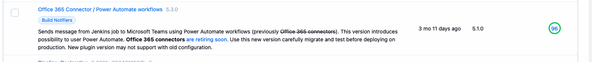

we dont have system wide config for that:

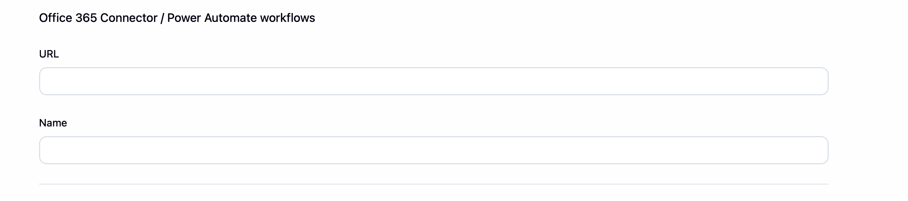

so i believe we have this inside pipelines:

search for: `office365Connector`


also configured on jobs levels:
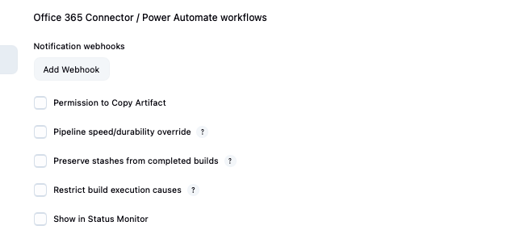


Risk For Your Jenkins
Focus validation on notification delivery:

Run one job that uses Office 365 Connector.
Confirm message appears in Teams/Outlook/Power Automate.
Test through your Jenkins proxy if the webhook URL goes outside.
Check logs after the build:
sudo journalctl -u jenkins --since "15 minutes ago" --no-pager \
  | grep -Ei "office|365|connector|webhook|teams|outlook|power|http|proxy|failed|exception|timeout"
Official compare link:
https://github.com/jenkinsci/office-365-connector-plugin/compare/Office-365-Connector-5.1.0...Office-365-Connector-5.3.0


Main changes from official GitHub compare:

HTTP client changed from Apache HttpClient 4 to HttpClient 5.
This affects how the plugin sends webhook POST requests to Teams/Outlook/Power Automate. Proxy/no-proxy and timeout behavior are the areas to test.

Commons Lang migrated from old commons-lang 2.x to commons-lang3.
Low behavioral risk, mostly dependency modernization.

Security/dependency fix for Snyk issue:
commons-validator changed from 1.9.0 to 1.10.1, and commons-beanutils / commons-logging are excluded from that dependency. The commit message says it addresses CWE-470: Unsafe Reflection.

MessageCard payload now includes:
@context: https://schema.org/extensions
@type: MessageCard

This changes the JSON body sent for MessageCard-style notifications. It should be compatible with Microsoft connector schemas, but it is still a real payload change.

Build/test maintenance:
JUnit 5 migration, Jenkins plugin parent/BOM bumps, Java 21/25 testing, GitHub Actions updates. These are not direct Jenkins runtime behavior changes.

You would do it like this:

Open plugin page
https://plugins.jenkins.io/Office-365-Connector/
Check:

current version
required Jenkins version
links to Releases, Dependencies, GitHub
Open dependencies page
https://plugins.jenkins.io/Office-365-Connector/dependencies/
Compare what dependencies 5.3.0 needs. In this case important ones were:

apache-httpcomponents-client-5-api
commons-lang3-api
That already hints: “HTTP client changed” and “Commons Lang changed”.

Open GitHub repo from plugin page
https://github.com/jenkinsci/office-365-connector-plugin
Find tags for both versions
Open tags:

https://github.com/jenkinsci/office-365-connector-plugin/tags
Find:

Office-365-Connector-5.1.0
Office-365-Connector-5.3.0
Compare tags directly
Use GitHub compare URL:

https://github.com/jenkinsci/office-365-connector-plugin/compare/Office-365-Connector-5.1.0...Office-365-Connector-5.3.0
This is the key step. It shows all commits and changed files between your installed version and target version.

Read commit titles first
Look for meaningful commits, ignore release/dependabot noise first.

Important ones here were:

Migrate to httpclient5
Explicitly declare dependencies
Migrate Commons Lang from 2 to 3
Fixes issue reported by snyk
Include type in Message Card messages
Open important commits
For each important commit, open it and check changed files.

Especially check:

src/main/java/...
pom.xml
Ignore most of:

src/test/...
.github/...
Those are usually test/build changes, not runtime Jenkins behavior.

Check pom.xml
Compare dependency changes:

old plugin used apache-httpcomponents-client-4-api
new plugin uses apache-httpcomponents-client-5-api
old plugin used Commons Lang 2
new plugin uses commons-lang3-api
commons-validator changed from 1.9.0 to 1.10.1
Translate code changes into operational risk
For this plugin:

HTTP code changed -> test webhook delivery
proxy code changed -> test Jenkins proxy/no-proxy behavior
payload fields changed -> test Teams/Outlook/Power Automate message rendering
dependency security fix -> good reason to update
Create test checklist
For Jenkins:

sudo systemctl restart jenkins
sudo systemctl status jenkins
Then run one job using Office 365 Connector and check logs:

sudo journalctl -u jenkins --since "15 minutes ago" --no-pager \
  | grep -Ei "office|365|connector|webhook|teams|outlook|power|http|proxy|failed|exception|timeout"
That is basically the manual workflow: plugin page -> dependencies -> GitHub tags -> compare -> inspect pom.xml and src/main -> convert changes into Jenkins validation steps.


i can see dependancies plugins are installed:

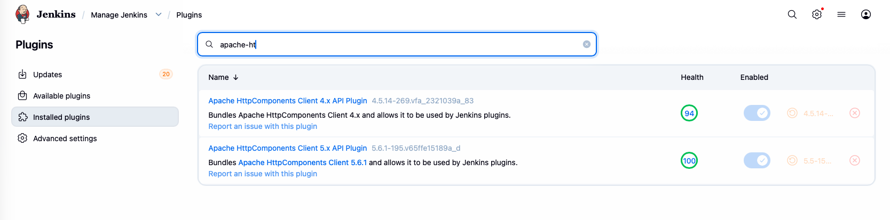

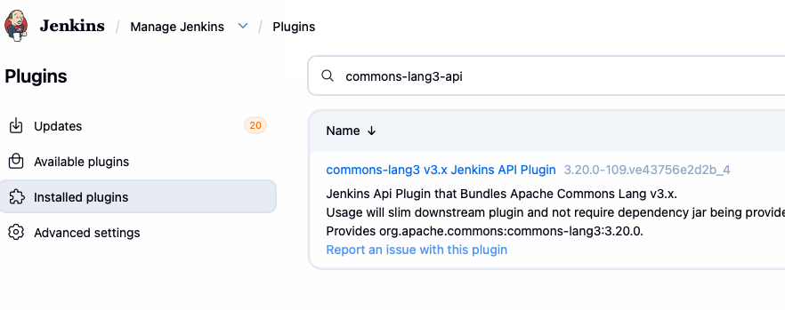


## actions

i updated office365 plugin -> restarted jenkins

got some errors -> so i ran this command to save to log file to my comp and sent the file to ai:

```bash
ssh jenkins-test 'sudo journalctl -u jenkins --since "2026-06-12 13:00:00" --no-pager -o short-iso' \
  | grep -Ei "failed|severe|error|exception|caused by|failed loading plugin|failed to load plugin|unsatisfied dependency|NoClassDefFoundError|ClassNotFoundException|ConfiguratorException|Office|365|connector" \
  > ~/Downloads/jenkins-plugin-update-errors.log
```

nothing related to my plugin update.

## test 
TO DO - run the job using that plugin!!!

# quay plugin

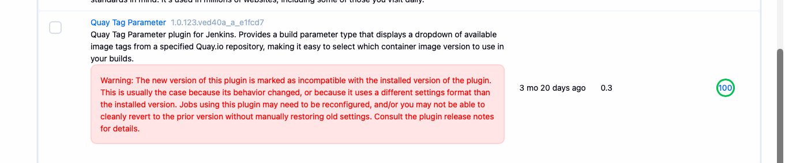

i did plugins backup

then investigation of changes:

New dependencies:
okhttp-api
credentials
jackson2-api
plain-credentials
workflow-step-api

New config model uses:
organization
repository
credentialsId
tagLimit
defaultTag

It adds/uses:
Quay.io Image Parameter
Pipeline step: quayImage

Important operational detail: the new source hardcodes:

https://quay.io/api/v1
quay.io/<organization>/<repository>:<tag>
So if your old plugin was used for internal Quay / private registry URL, this update may break that use case.


i checked what jobs use the plugin and figured there are plenty, had to stop the search cause was too long:

```bash
[0 naseka@ad.ifortuna.cz@jenkins01-ocp01-shared.m.dc1.cz.ipa.ifortuna.cz ~]$ sudo grep -RIl "quay\|Quay" /var/lib/jenkins/jobs --include=config.xml
/var/lib/jenkins/jobs/Inka/jobs/_Deployment Pipelines/jobs/cacheman_multiple/config.xml
/var/lib/jenkins/jobs/Inka/jobs/_Deployment Pipelines/jobs/rsync_multiple/config.xml
/var/lib/jenkins/jobs/Inka/jobs/_Deployment Pipelines/jobs/web_multiple/config.xml
/var/lib/jenkins/jobs/Inka/jobs/_Deployment Pipelines/jobs/rsync/config.xml
/var/lib/jenkins/jobs/Inka/jobs/_Deployment Pipelines/jobs/cacheman/config.xml
/var/lib/jenkins/jobs/Inka/jobs/_Deployment Pipelines/jobs/web/config.xml
/var/lib/jenkins/jobs/HTK/jobs/Print Services/jobs/Deploy/config.xml
/var/lib/jenkins/jobs/HTK/jobs/Retail monitoring service/branches/PR-13/config.xml
/var/lib/jenkins/jobs/HTK/jobs/feg-reporting-web/jobs/Deploy/config.xml
/var/lib/jenkins/jobs/HTK/jobs/Retail Offer Services/branches/asustic-Opti.gkggr3.e-processing/config.xml
/var/lib/jenkins/jobs/HTK/jobs/Retail Offer Services/branches/v-14-4-0.95fiud/config.xml
/var/lib/jenkins/jobs/HTK/jobs/Retail Offer Services/branches/v-15-1-0.8sr2ll/config.xml
/var/lib/jenkins/jobs/HTK/jobs/Retail Offer Services/branches/v-15-0-0.4o6773/config.xml
/var/lib/jenkins/jobs/HTK/jobs/Retail Offer Services/branches/v-14-2-0.r6qn0t/config.xml
/var/lib/jenkins/jobs/HTK/jobs/Retail Offer Services/branches/v-15-4-0.dgp4uv/config.xml
/var/lib/jenkins/jobs/HTK/jobs/Retail Offer Services/branches/v-15-3-0.rpu9st/config.xml
/var/lib/jenkins/jobs/HTK/jobs/Retail Offer Services/branches/master/config.xml
/var/lib/jenkins/jobs/HTK/jobs/Retail Offer Services/branches/v-14-0-0.phunnv/config.xml
/var/lib/jenkins/jobs/HTK/jobs/Retail Offer Services/branches/v-14-3-0.97o54o/config.xml
/var/lib/jenkins/jobs/HTK/jobs/Retail Offer Services/branches/v-15-2-0.i9o143/config.xml
/var/lib/jenkins/jobs/HTK/jobs/Retail Offer Services/branches/develop/config.xml
/var/lib/jenkins/jobs/HTK/jobs/Retail Offer Services/branches/v-14-6-0.gutmen/config.xml
/var/lib/jenkins/jobs/HTK/jobs/kasanova-shop-management/jobs/Deploy/config.xml
/var/lib/jenkins/jobs/HTK/jobs/Retail Deploy/config.xml
/var/lib/jenkins/jobs/HTK/jobs/Retail Reporting/jobs/Deploy/config.xml
/var/lib/jenkins/jobs/GAMING_STUDIO/config.xml
/var/lib/jenkins/jobs/QA/jobs/_CORE/jobs/Services/jobs/_core-report-service DEPLOY/config.xml
/var/lib/jenkins/jobs/QA/jobs/_CORE/jobs/Services/jobs/_core-configuration-service DEPLOY/config.xml
/var/lib/jenkins/jobs/QA/jobs/_CORE/jobs/Services/jobs/_core-log-service DEPLOY/config.xml
/var/lib/jenkins/jobs/QA/jobs/_CORE/jobs/Services/jobs/_core-notification-service DEPLOY/config.xml
/var/lib/jenkins/jobs/QA/jobs/_CORE/jobs/Services/jobs/_PORTAL DEPLOY/config.xml
^C
```

for usage we also need to check jenkinsfiles of multibranch jobs, cause it may use the new/old step in code rather than job UI paraments

I found out that usage is hight and we have this in our jobs:


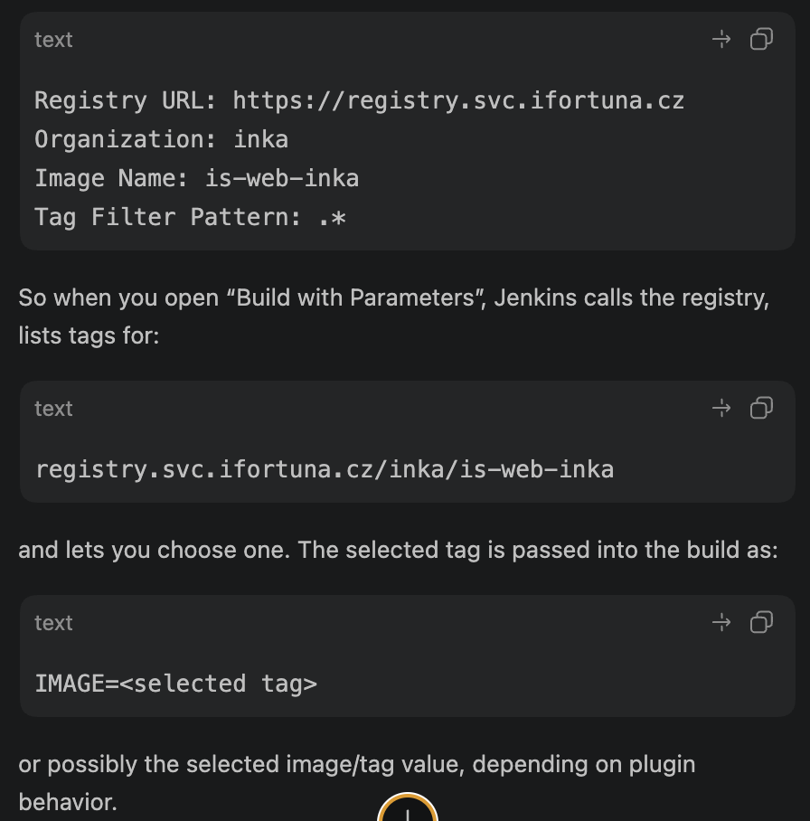

But the new 1.0.123... plugin source I checked is built around:

https://quay.io/api/v1

and its new config fields are more like:

organization
repository
credentialsId
tagLimit
defaultTag
I did not see a Registry URL field in the new plugin code. So this update is likely not just risky; it may be functionally wrong for your setup if you use internal Quay/registry at registry.svc.ifortuna.cz.

## create a representative test job on jenkins test

that uses the same Quay Image Tag Parameter shape as production, then run it before and after the plugin update

i used the same image as in the example above:

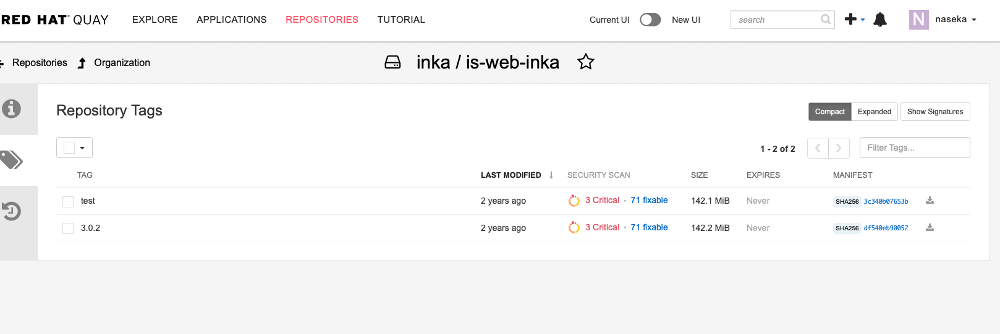


so i created simple pipeline job -> checked the box parametrized and put same data as for inka above -> i have Buld with parametrs and when i click it i can see dropdown:

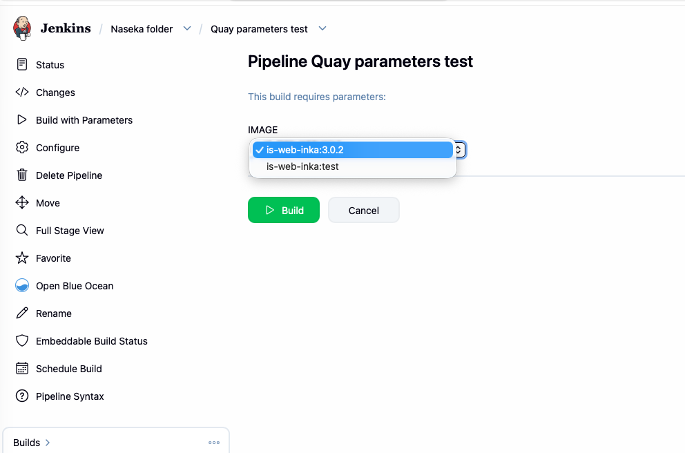


pipeline:

```groovy
pipeline {
  agent any

  stages {
    stage('Show selected Quay tag') {
      steps {
        echo "Selected IMAGE parameter: ${params.IMAGE}"
        sh '''
          echo "IMAGE=$IMAGE"
          env | sort | grep -E '^IMAGE=' || true
        '''
      }
    }
  }
}
```

i select this: 

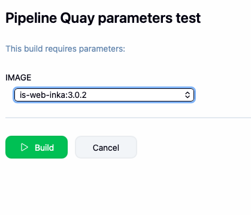

and i build it

console output:

```text
+ echo IMAGE=is-web-inka:3.0.2
IMAGE=is-web-inka:3.0.2
+ env
+ sort
+ grep -E '^IMAGE='
IMAGE=is-web-inka:3.0.2
```

this proves before plugin update:

  dropdown loads tags from internal registry
  parameter selection works
  selected value reaches the build


## update plugin

1. create a backup
2. update plugin in ui
3. restart jenkins: 

  second time after restart there is this error:

```bash
[130 naseka@ad.ifortuna.cz@el8builder01-ocp01-shared.m.dc1.cz.ipa.ifortuna.cz jenkins]$ sudo systemctl restart jenkins
Job for jenkins.service failed because the control process exited with error code.
See "systemctl status jenkins.service" and "journalctl -xe" for details.
[1 naseka@ad.ifortuna.cz@el8builder01-ocp01-shared.m.dc1.cz.ipa.ifortuna.cz jenkins]$ 
```
  
  run checks:

  ```bash
  sudo journalctl -u jenkins --since "5 minutes ago" --no-pager -o short-iso \
>   | grep -Ei "jenkins.service|Main process|control process|start operation|timeout|failed|exit|killed|Started|Stopped|Started oejs|Jenkins is fully up"
```
  
Common shortcuts in terminal

Ctrl + U     delete from cursor to beginning of line
Ctrl + K     delete from cursor to end of line
Ctrl + W     delete previous word

problem:

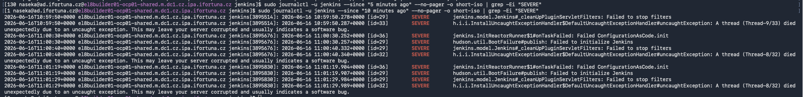

i ran further checks to find out exact which yaml key is invalid:

```bash
sudo journalctl -u jenkins --since "2026-06-16 10:57:40" --no-pager -o short-iso \
  | grep -Ei -B25 -A10 "Failed ConfigurationAsCode.init|BootFailure|UnknownAttributesException|ConfiguratorException|Invalid configuration|No configurator|Available attributes"
```
failure is in:

```text
Failed ConfigurationAsCode.init
UnknownAttributesException:
unclassified: Invalid configuration elements ... imageTagParameterConfiguration
```

this is no longer recognized in yaml:

```yaml
unclassified:
  imageTagParameterConfiguration:
```


## resolve the problem


### documentation

from Jenkins Handbook

https://www.jenkins.io/doc/book/managing/casc/


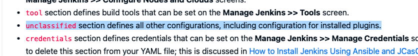


from plugin docs
https://plugins.jenkins.io/quay-tag-parameter/

so in new plugin those are the fields:

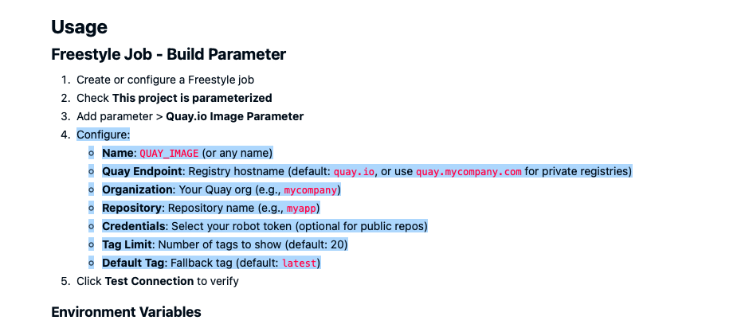

in the old plugin those are the fields:

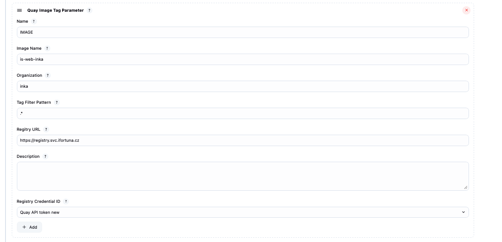

so migration mapping is roughly: 

```text

Name                  -> Name
Image Name            -> Repository
Organization          -> Organization
Registry URL          -> Quay Endpoint
Registry Credential ID -> Credentials
Tag Filter Pattern    -> no obvious equivalent in current official docs

```

### remove broken jcasc block

1) backup yaml
2) remove the block:

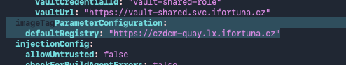

### start jenkins again -> works:

```bash

[0 naseka@ad.ifortuna.cz@el8builder01-ocp01-shared.m.dc1.cz.ipa.ifortuna.cz jenkins]$ sudo systemctl status jenkins
● jenkins.service - Jenkins Continuous Integration Server
   Loaded: loaded (/usr/lib/systemd/system/jenkins.service; enabled; vendor preset: disabled)
  Drop-In: /etc/systemd/system/jenkins.service.d
           └─override.conf
   Active: active (running) since Tue 2026-06-16 11:40:53 UTC; 24s ago
 Main PID: 3896657 (java)
    Tasks: 95 (limit: 100691)
   Memory: 684.3M
   CGroup: /system.slice/jenkins.service
           └─3896657 /usr/lib/jvm/java-21-openjdk-21.0.9.0.10-1.el8.x86_64/bin/java -Dorg.apache.commons.jelly.tags.fmt.timeZone=Europe/Prague -Djava.naming.referral=ignore -Dcom.sun.jndi.ldap.object.disableEndpointIdentification=true -Dhudson.model.DownloadService.no>

Jun 16 11:41:08 el8builder01-ocp01-shared.m.dc1.cz.ipa.ifortuna.cz jenkins[3896657]: 2026-06-16 11:41:08.265+0000 [id=164]        INFO        h.m.DownloadService$Downloadable#load: Obtained the updated data file for hudson.tools.JDKInstaller
Jun 16 11:41:08 el8builder01-ocp01-shared.m.dc1.cz.ipa.ifortuna.cz jenkins[3896657]: 2026-06-16 11:41:08.266+0000 [id=164]        INFO        hudson.util.Retrier#start: Performed the action check updates server successfully at the attempt #1
Jun 16 11:41:10 el8builder01-ocp01-shared.m.dc1.cz.ipa.ifortuna.cz jenkins[3896657]: 2026-06-16 11:41:10.392+0000 [id=232]        INFO        h.TcpSlaveAgentListener$ConnectionHandler#run: Accepted JNLP4-connect connection #5 from /10.0.175.18:35070
Jun 16 11:41:10 el8builder01-ocp01-shared.m.dc1.cz.ipa.ifortuna.cz jenkins[3896657]: 2026-06-16 11:41:10.393+0000 [id=233]        INFO        h.TcpSlaveAgentListener$ConnectionHandler#run: Accepted JNLP4-connect connection #6 from /10.0.175.18:47002
Jun 16 11:41:10 el8builder01-ocp01-shared.m.dc1.cz.ipa.ifortuna.cz jenkins[3896657]: 2026-06-16 11:41:10.398+0000 [id=198]        INFO        o.j.r.p.i.ConnectionHeadersFilterLayer#onRecv: [JNLP4-connect connection from egress-jenkins-test.m.dc1.cz.ipa.ifortuna.cz/10.>
Jun 16 11:41:10 el8builder01-ocp01-shared.m.dc1.cz.ipa.ifortuna.cz jenkins[3896657]: 2026-06-16 11:41:10.402+0000 [id=199]        INFO        o.j.r.p.i.ConnectionHeadersFilterLayer#onRecv: [JNLP4-connect connection from egress-jenkins-test.m.dc1.cz.ipa.ifortuna.cz/10.>
Jun 16 11:41:11 el8builder01-ocp01-shared.m.dc1.cz.ipa.ifortuna.cz jenkins[3896657]: 2026-06-16 11:41:11.043+0000 [id=235]        INFO        h.TcpSlaveAgentListener$ConnectionHandler#run: Accepted JNLP4-connect connection #7 from /10.0.175.18:44454
Jun 16 11:41:11 el8builder01-ocp01-shared.m.dc1.cz.ipa.ifortuna.cz jenkins[3896657]: 2026-06-16 11:41:11.049+0000 [id=236]        INFO        h.TcpSlaveAgentListener$ConnectionHandler#run: Accepted JNLP4-connect connection #8 from /10.0.175.18:34177
Jun 16 11:41:11 el8builder01-ocp01-shared.m.dc1.cz.ipa.ifortuna.cz jenkins[3896657]: 2026-06-16 11:41:11.051+0000 [id=199]        INFO        o.j.r.p.i.ConnectionHeadersFilterLayer#onRecv: [JNLP4-connect connection from egress-jenkins-test.m.dc1.cz.ipa.ifortuna.cz/10.>
Jun 16 11:41:11 el8builder01-ocp01-shared.m.dc1.cz.ipa.ifortuna.cz jenkins[3896657]: 2026-06-16 11:41:11.053+0000 [id=199]        INFO        o.j.r.p.i.ConnectionHeadersFilterLayer#onRecv: [JNLP4-connect connection from egress-jenkins-test.m.dc1.cz.ipa.ifortuna.cz/10.>
lines 1-21/21 (END)

```

### check my old test job:

i can see my config from the job was removed:

now: 
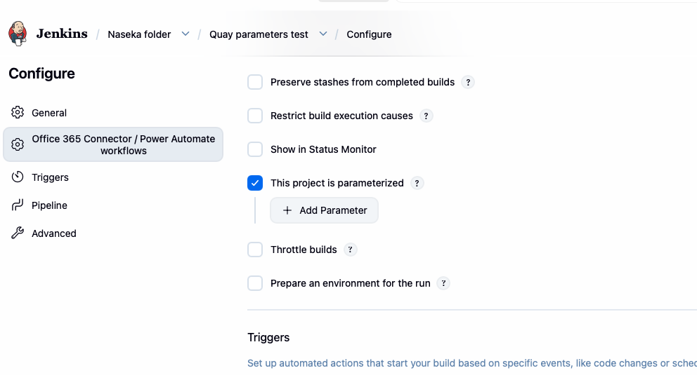

before plugin update:


check whether Jenkins kept it as "old/undreadable" data:

and i can see my job:

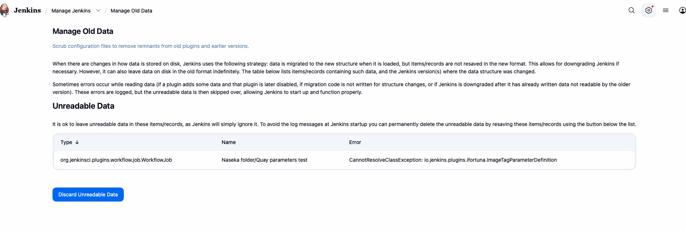

what it means: 

-> the old job config contains this old class: io.jenkins.plugins.ifortuna.ImageTagParameterDefinition
-> the new quay plugin doesnt provide that class anymore, so jenkins cannot deserialize the old parameter, hence "CannotResolveClassException"
-> new plugin expects a different parameter implementation
-> i would need to recreate parameter manually using the new plugin's parameter type, hten save the job

performed a test what would happen if i dont change any config of the job and just build it again:

so after removing the part in JCASC -> job ran, but `params.IMAGE` is null and `env IMAGE` is empty. Dangerous for production: image tag in production jobs will be empty or null!

Therefore every job using the old Quay parameter must be migrated/recreated before production update. 

result:

Old Quay parameter exists in config.xml
but Jenkins cannot load its class
so it is skipped as unreadable data
and no IMAGE parameter is created for the build


### try to migrate the config

1. do backup of my job config:

```bash
[0 naseka@ad.ifortuna.cz@el8builder01-ocp01-shared.m.dc1.cz.ipa.ifortuna.cz jobs]$ sudo cp -a "/var/lib/jenkins/jobs/Naseka folder/jobs/Quay parameters test/config.xml" "/var/lib/jenkins/jobs/Naseka folder/jobs/Quay parameters test/config.xml.before-quay-param-migration-$(date +%Y%m%d)"
```

2. command that gives exactly the active job configs that need migration with config files at any depth:

```bash
sudo grep -RIl \
  "io.jenkins.plugins.ifortuna.ImageTagParameterDefinition" \
  /var/lib/jenkins/jobs --include=config.xml
```

result in test:

```bash
[0 naseka@ad.ifortuna.cz@el8builder01-ocp01-shared.m.dc1.cz.ipa.ifortuna.cz ~]$ sudo grep -RIl \
>   "io.jenkins.plugins.ifortuna.ImageTagParameterDefinition" \
>   /var/lib/jenkins/jobs --include=config.xml
/var/lib/jenkins/jobs/Naseka folder/jobs/Quay parameters test/config.xml
[0 naseka@ad.ifortuna.cz@el8builder01-ocp01-shared.m.dc1.cz.ipa.ifortuna.cz ~]$ 
```

3. Recreate the parameter in UI and save and compair the xml fiels

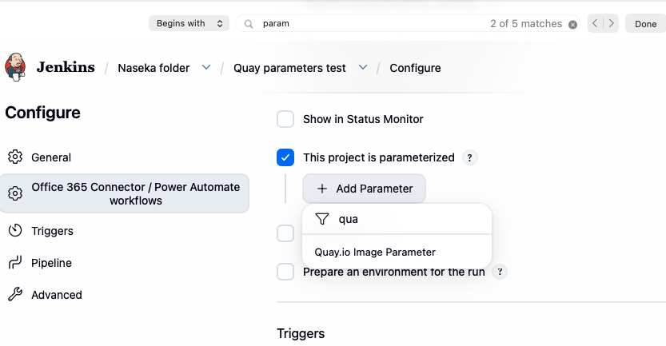

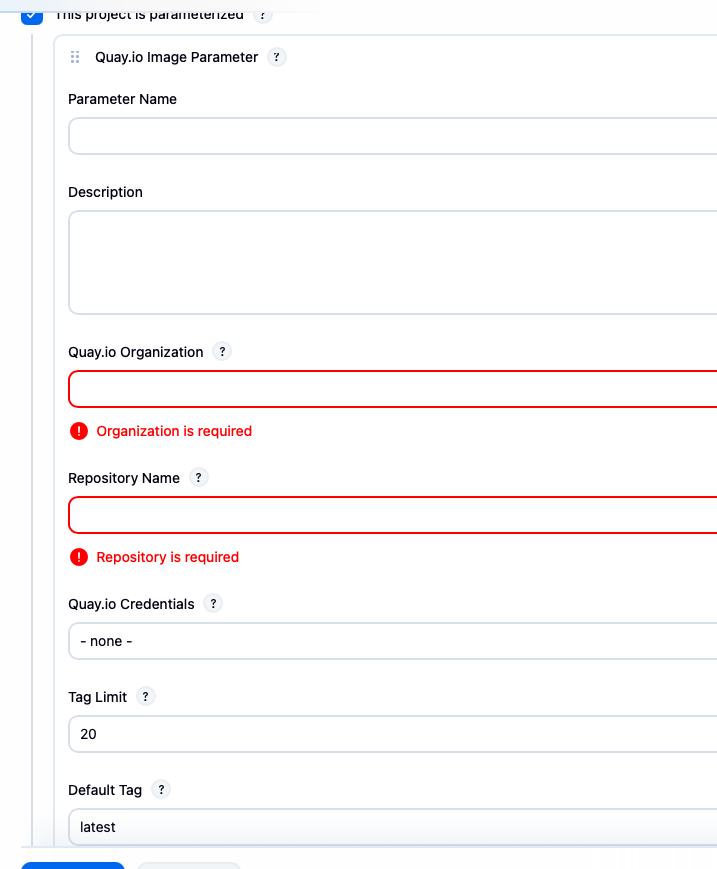

### problem: i cannot see any field specifying quay endpoint. 

In the Yaml file there used to be the global config: 


in ui prior plugin update there is this field in System (prntscreen from prod with old plugin): 

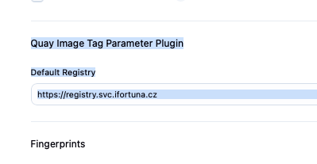

corresponds to prod yaml:

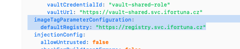


Official plugin docs say the endpoint exists for Pipeline parameter syntax as:

```groovy
quayImageParameter(
    quayEndpoint: 'quay.mycompany.com'
)
```

since i cannot specify endpoint without indicating it in pipelien, i first test against public quay.io:

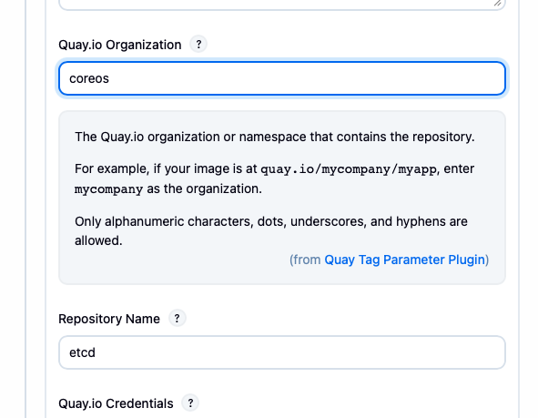


Old plugin:
Job config can specify Registry URL or use global defaultRegistry.

New plugin UI:
No Registry URL / Quay Endpoint field visible.

Result:
Test Connection times out, likely trying quay.io from a network that cannot reach it or is blocked.

### checking via pipeline

I have added this config:

with this pipeline:

```groovy
pipeline {
    agent any

    stages {
        stage('Test quayEndpoint support') {
            steps {
                script {
                    def imageRef = quayImage(
                        organization: 'inka',
                        repository: 'is-web-inka',
                        quayEndpoint: 'czdcm-quay.lx.ifortuna.cz',
                        credentialsId: 'Quay API token new',
                        tag: '3.0.2'
                    )

                    echo "imageRef=${imageRef}"
                }
            }
        }
    }
}
```

I tried official jenkins step docs and my installed plugin ui doesnt have quayEndpoint


result of pipelin above:

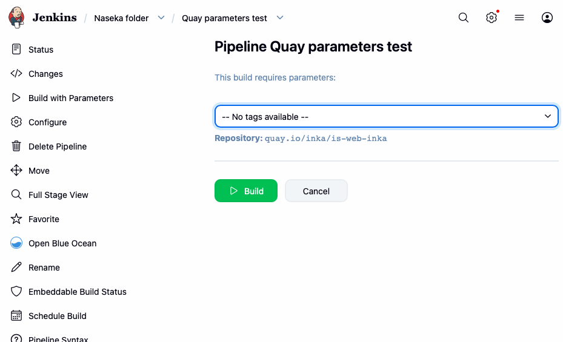

Repository: quay.io/inka/is-web-inka

so migration seems to not be possible due to new installed plugin ui forces quay.io and has no endpoint field.

we need to wait till new release

# downgrade test plugin back to production version till we can specify our endpoint for Quay

## find the correct backup file and check its version

```bash
[0 naseka@ad.ifortuna.cz@el8builder01-ocp01-shared.m.dc1.cz.ipa.ifortuna.cz jenkins]$ sudo find . -maxdepth 1 -type d -name 'plugins.2026*' -printf '%TY-%Tm-%Td %TH:%TM %p\n' | sort
2025-06-23 11:55 ./plugins.20260513
2026-05-13 14:43 ./plugins.20260518-124131
2026-05-18 13:17 ./plugins.20260519-074956
2026-05-26 10:31 ./plugins.20260526-112326
2026-05-26 12:25 ./plugins.20260601-073342
2026-06-12 13:00 ./plugins.20260616-105342
[0 naseka@ad.ifortuna.cz@el8builder01-ocp01-shared.m.dc1.cz.ipa.ifortuna.cz jenkins]$ sudo ls -l plugins.20260616-105342/quay-tag-parameter*
-rw-r--r-- 1 jenkins jenkins 3726895 Jun 24  2020 plugins.20260616-105342/quay-tag-parameter.jpi #plugin archive file

plugins.20260616-105342/quay-tag-parameter: #unpacked plugin filder with meta-inf and web-inf inside
total 8
drwxr-xr-x 3 jenkins jenkins 4096 Jun 24  2020 META-INF
drwxr-xr-x 3 jenkins jenkins 4096 Jun 24  2020 WEB-INF
[0 naseka@ad.ifortuna.cz@el8builder01-ocp01-shared.m.dc1.cz.ipa.ifortuna.cz jenkins]$ sudo unzip -p plugins.20260616-105342/quay-tag-parameter.jpi META-INF/MANIFEST.MF \
>   | grep -Ei 'Short-Name|Plugin-Version'
Short-Name: quay-tag-parameter
Plugin-Version: 0.3
[0 naseka@ad.ifortuna.cz@el8builder01-ocp01-shared.m.dc1.cz.ipa.ifortuna.cz jenkins]$ 
```

## check prod version:

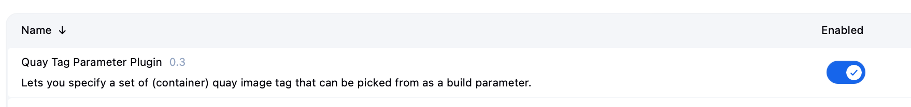

so its correct and we can downgrade

## remove the currently installed plugin files:

`sudo rm -rf plugins/quay-tag-parameter plugins/quay-tag-parameter.jpi`

## restore from backup:

```bash
[0 naseka@ad.ifortuna.cz@el8builder01-ocp01-shared.m.dc1.cz.ipa.ifortuna.cz jenkins]$ sudo rm -rf plugins/quay-tag-parameter plugins/quay-tag-parameter.jpi
[0 naseka@ad.ifortuna.cz@el8builder01-ocp01-shared.m.dc1.cz.ipa.ifortuna.cz jenkins]$ sudo cp -a plugins.20260616-105342/quay-tag-parameter.jpi plugins/
[0 naseka@ad.ifortuna.cz@el8builder01-ocp01-shared.m.dc1.cz.ipa.ifortuna.cz jenkins]$ sudo cp -a plugins.20260616-105342/quay-tag-parameter plugins/
[0 naseka@ad.ifortuna.cz@el8builder01-ocp01-shared.m.dc1.cz.ipa.ifortuna.cz jenkins]$ sudo chown -R jenkins:jenkins plugins/quay-tag-parameter*
```

