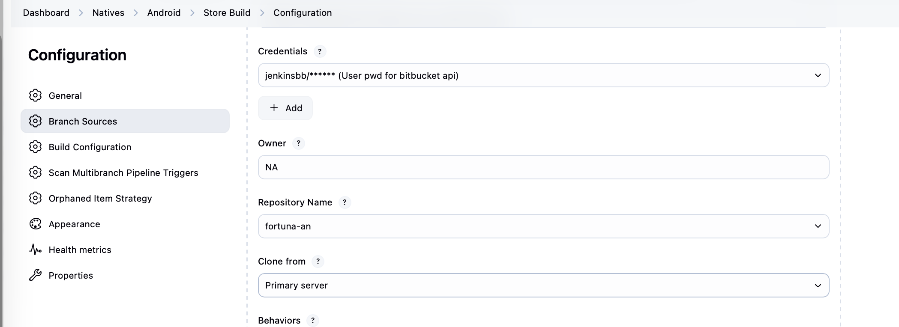
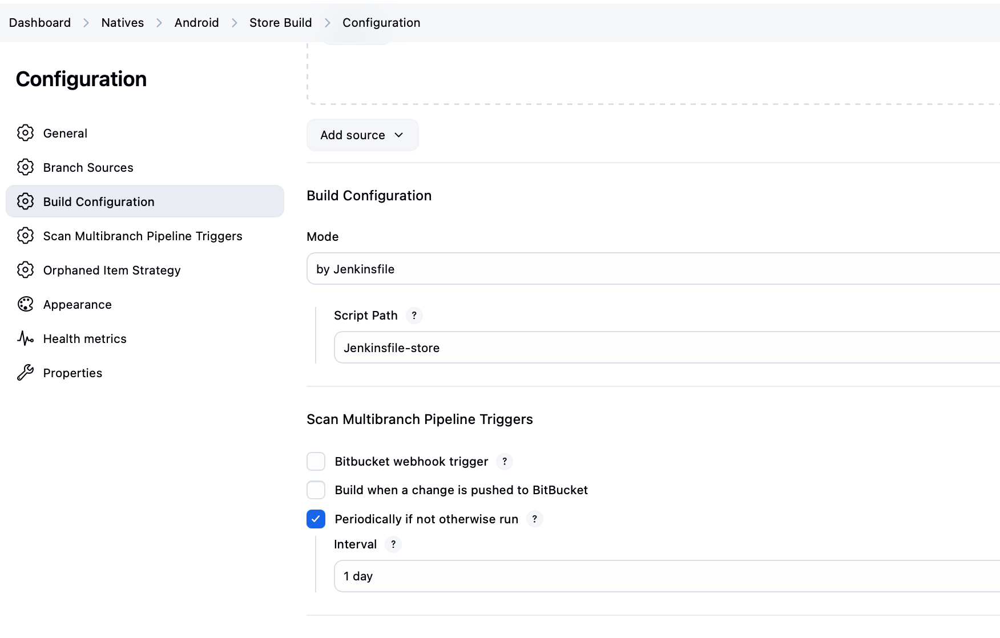
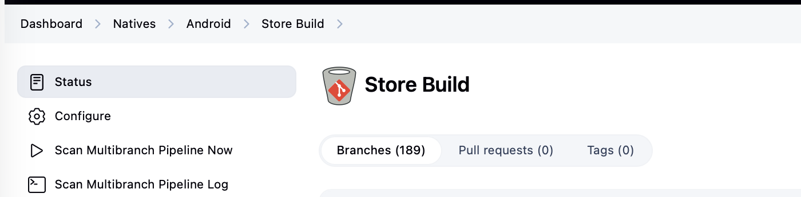
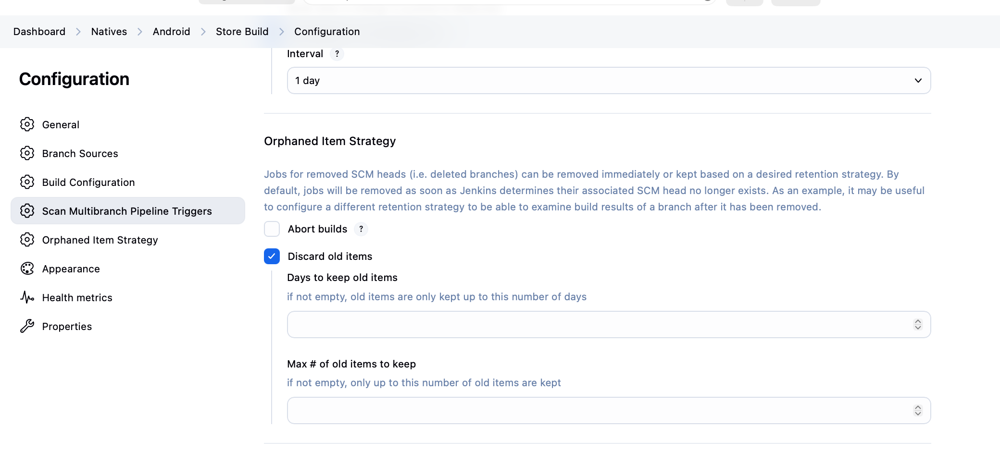
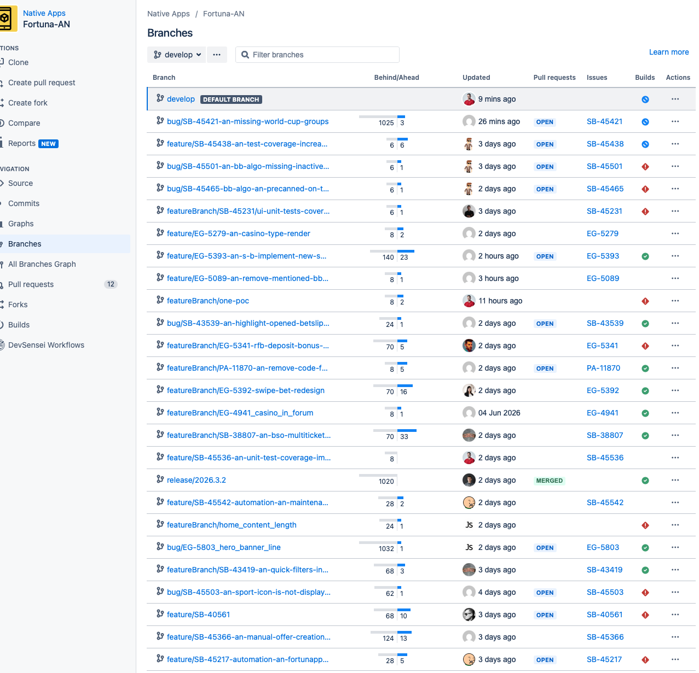

# problem

IN-381578: zabbix alert on < 10 % available space

Server: jenkins01-ocp01-shared
Filesystem: /opt
Size: 1.1T
Used: 908G
Available: 98G
Usage: 91%
Alert: less than 10% free

# quick immediate fix prior investigation - enlarge the space

Roman added extra disk capacity to the Jenkins VM

# Investigation flow

## 1. confirm filesystem usage: 

`df -h /opt`

## 2. start running disc usage. `cd location` and then run du command: `sudo du -hs * | sort -hr` 

a) first run on whole jobs level to find largest directories:

```bash
cd /opt/jenkins/jobs
sudo du -hs * | sort -hr
```
roman got:

```bash
165G MW
142G NA
63G QA
39G WEB
37G BETON
```

b) then you separately run du for largest folders NA and MW

roman ran this for NA:

```bash
 [0 <a href="mailto:root@jenkins01-ocp01-shared" rel="noreferrer noopener" title="mailto:root@jenkins01-ocp01-shared" target="_blank">root@jenkins01-ocp01-shared</a>.m.dc1.cz.ipa.ifortuna.cz jobs]# du -hs * | sort -hr
112G Android
27G iOS
2.3G AndroidLibraries
936M iOSLibraries
152M tools
[0 root@jenkins01-ocp01-shared
```

i was invesitgating MW and then SonarQube, but it was not the cause of the issue.

c) inside android:

```bash
[0 naseka@ad.ifortuna.cz@jenkins01-ocp01-shared.m.dc1.cz.ipa.ifortuna.cz ~]$ cd /opt/jenkins/jobs/NA/jobs/Android/jobs
[0 naseka@ad.ifortuna.cz@jenkins01-ocp01-shared.m.dc1.cz.ipa.ifortuna.cz jobs]$ sudo du -hs * | sort -hr
84G	Store Build
29G	Store
5.9G	Nightly Build
208M	Firebase-RemoteConfig
16M	Automation build check
5.2M	Deploy to Production
[0 naseka@ad.ifortuna.cz@jenkins01-ocp01-shared.m.dc1.cz.ipa.ifortuna.cz jobs]$ 
```

so the main suspect is Store Build


```bash
[0 naseka@ad.ifortuna.cz@jenkins01-ocp01-shared.m.dc1.cz.ipa.ifortuna.cz Store Build]$ ls
branches  config.xml  indexing  name-utf8.txt  state.xml
```

so now i will inspect branches folder inside multibranch jobs:

`sudo du -hs * | sort -hr`

```bash
[0 naseka@ad.ifortuna.cz@jenkins01-ocp01-shared.m.dc1.cz.ipa.ifortuna.cz branches]$ sudo du -hs * | sort -hr
25G	release-2026-3-1.ug6l8i
12G	release-2026-3-0.9oi7s5
12G	release-2026-1-0.k80366
5.5G	release-2026-2-1.0skj4m
5.5G	release-2026-2-0.9h0kk3
5.5G	release-2026-1-1.d45gp1
4.2G	release-2026-3-2.c6edta
3.3G	release-3-57-2.bknaj4
3.3G	release-3-57-0.mvbuvq
3.1G	develop
2.8G	release-2026-2-2.sf79s0
1.7G	release-3-57-3.hb4591
1.7G	release-3-57-1.tuiahr
```
largest branch is **25G release-2026-3-1.ug6l8i**

i will inspect its builds:

```bash
[0 naseka@ad.ifortuna.cz@jenkins01-ocp01-shared.m.dc1.cz.ipa.ifortuna.cz branches]$ cd release-2026-3-1.ug6l8i
[0 naseka@ad.ifortuna.cz@jenkins01-ocp01-shared.m.dc1.cz.ipa.ifortuna.cz release-2026-3-1.ug6l8i]$ ls
builds  config.xml  name-utf8.txt  nextBuildNumber  scm-last-seen-revision-hash.xml
[0 naseka@ad.ifortuna.cz@jenkins01-ocp01-shared.m.dc1.cz.ipa.ifortuna.cz release-2026-3-1.ug6l8i]$ cd builds
[0 naseka@ad.ifortuna.cz@jenkins01-ocp01-shared.m.dc1.cz.ipa.ifortuna.cz builds]$ ls
1  2  3  4  5  6  legacyIds  permalinks
[0 naseka@ad.ifortuna.cz@jenkins01-ocp01-shared.m.dc1.cz.ipa.ifortuna.cz builds]$ sudo du -hs * | sort -hr
4.2G	6
4.2G	5
4.2G	4
4.2G	3
4.2G	2
4.2G	1
4.0K	permalinks
0	legacyIds
[0 naseka@ad.ifortuna.cz@jenkins01-ocp01-shared.m.dc1.cz.ipa.ifortuna.cz builds]$ cd 6
[0 naseka@ad.ifortuna.cz@jenkins01-ocp01-shared.m.dc1.cz.ipa.ifortuna.cz 6]$ sudo du -hs * | sort -hr
4.2G	archive
19M	log
1.7M	libs
1.3M	workflow-completed
444K	build.xml
116K	log-index
4.0K	changelog1985236027668282243.xml
4.0K	changelog13692233171302432433.xml
[0 naseka@ad.ifortuna.cz@jenkins01-ocp01-shared.m.dc1.cz.ipa.ifortuna.cz 6]$ 
```

i can see each build archive is huge and they are responsible for such a growth

## 3. find repository and Jenkinsfile


in the Store Build configuration in Jenkins I can find repo name in BitBucket:



and jenkins file, which is Jenkinsfile-store:



They miss retention policy in the jenkinsfile:

```groovy
options {
    parallelsAlwaysFailFast()
}
```

I notified Marko Vukusav, who is the author of this file according to Bitbucket. He added buildDiscarder block. It resolves the route cause of the issue and jenkins will clean iteself from those huge artifacts, which are older than 7 days and won't keep more than 10 builds' artifacts. its still 42 G, but Roman enlarged the space. So we are good now

```groovy
options {
        timeout(time: 3, unit: 'HOURS')
        parallelsAlwaysFailFast()
        buildDiscarder(

                logRotator(

                        // Keep at most the LAST 15 builds for this job/branch
                        // Older builds are completely deleted (logs, metadata, workspace refs)
                        numToKeepStr: '15',

                        // Delete builds older than 14 days
                        // If a build is older than 14 days, it is deleted even if there are fewer than 10 builds
                        daysToKeepStr: '14',

                        // Keep archived artifacts (archiveArtifacts) only for the LAST 10 builds
                        // This deletes the heavy files under:
                        //   builds/<buildNumber>/archive/
                        // while the build record itself may still exist
                        artifactNumToKeepStr: '10',

                        // Delete archived artifacts older than 7 days
                        // Even if the build itself is kept, its APK/AAB files are removed
                        artifactDaysToKeepStr: '7'
                )
        )
    }
```


```bash
[130 naseka@ad.ifortuna.cz@jenkins01-ocp01-shared.m.dc1.cz.ipa.ifortuna.cz ~]$ df -h /opt
Filesystem                   Size  Used Avail Use% Mounted on
/dev/mapper/vg1_data-lv_opt  1.1T  908G   98G  91% /opt
[0 naseka@ad.ifortuna.cz@jenkins01-ocp01-shared.m.dc1.cz.ipa.ifortuna.cz ~]$ sudo du -xhd1 /opt 2>/dev/null | sort -hr | head -20 #inside opt which direct folder is using the space
```

# Check if we dont experience the issue still:

```bash
[0 naseka@ad.ifortuna.cz@jenkins01-ocp01-shared.m.dc1.cz.ipa.ifortuna.cz 6]$ df -h /opt
Filesystem                   Size  Used Avail Use% Mounted on
/dev/mapper/vg1_data-lv_opt  1.4T  882G  408G  69% /opt
[0 naseka@ad.ifortuna.cz@jenkins01-ocp01-shared.m.dc1.cz.ipa.ifortuna.cz 6]$ 
```

# Other improvements:

they have 189 branches in Store Build:



Implement Orphaned Item Strategy. At the moment Jenkins keeps branches forever:




Orphaned Item Strategy will not help, when they still have all those branches in bitbucket..



Talk to Zdenka, that we need inform developers:

1. Developers should periodically remove stale merged feature/bug branches

2. or enable deletion of the source branch during PR merge. Before bulk deletion, exclude protected and long-lived branches -> maybe discuss with Vasek

3. Then we can implement orohaned item strategy in Jenkins to not have hundreds of branches