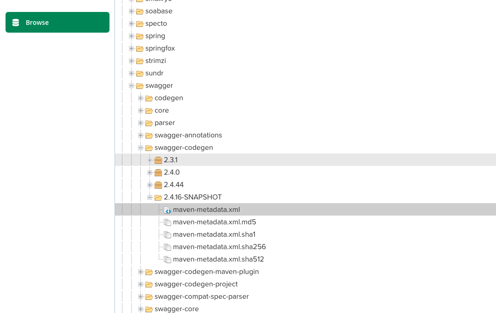
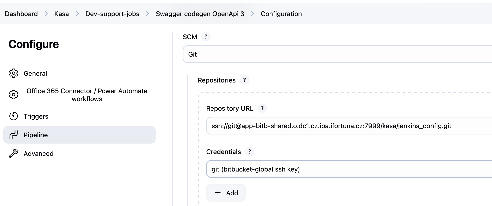
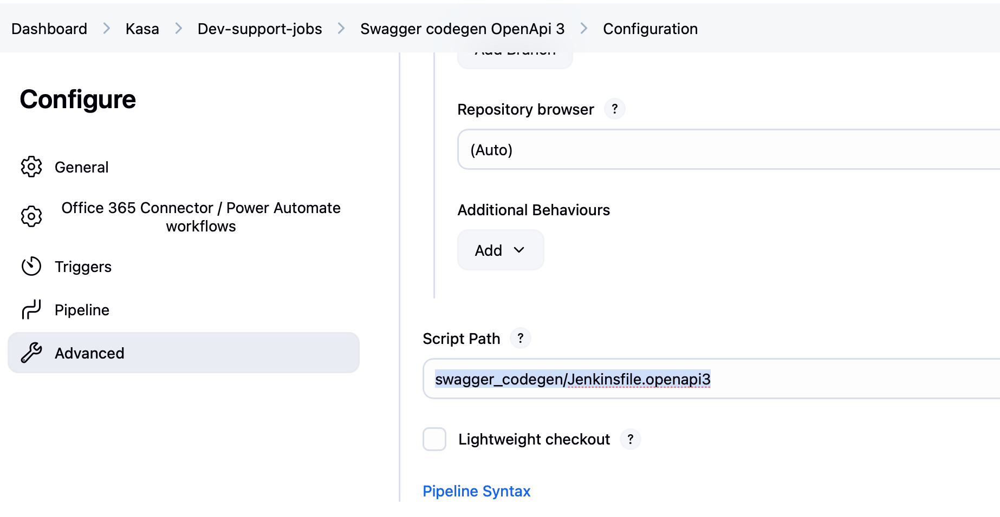
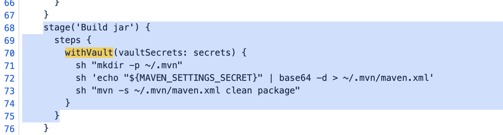
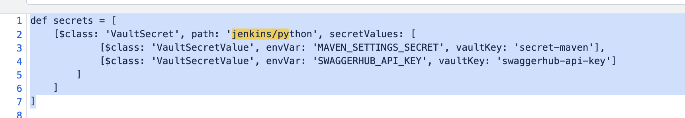
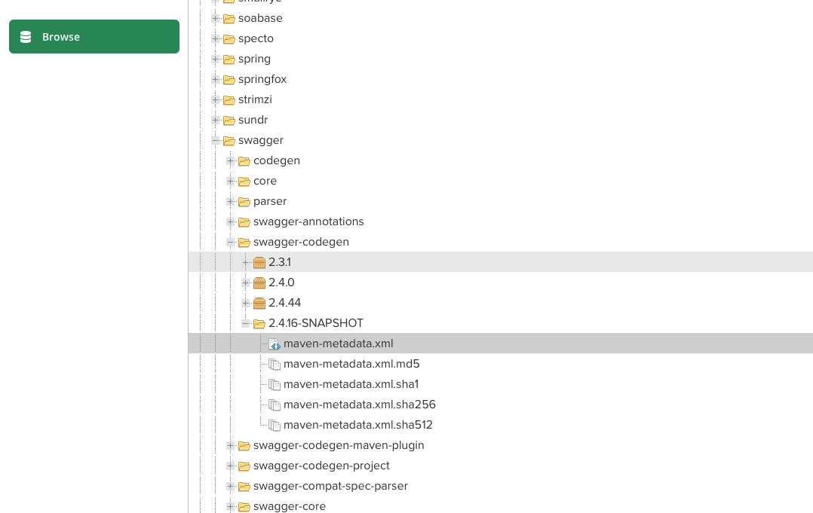
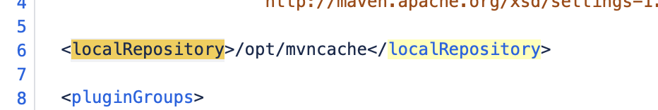
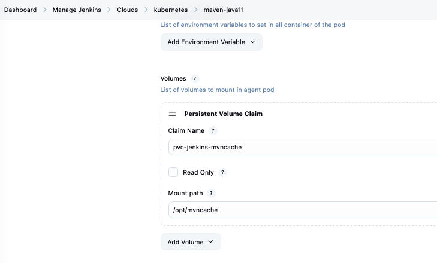
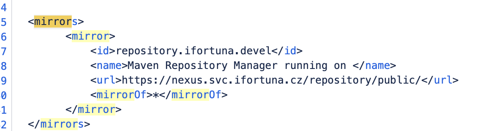

# problem: https://jira.myfortuna.eu/browse/INFRA-42097


Ahoj Katko, kluci z infry te naprasili, ze umis pomoct s jenkinsem. jedna nasich (KASA team) pipeline nove vyhazuje toto: 
 
Plain Text
 
13:42:20  [INFO] BUILD FAILURE
13:42:20  [INFO] ------------------------------------------------------------------------
13:42:20  [INFO] Total time:  3.205 s
13:42:20  [INFO] Finished at: 2026-06-23T11:42:20Z
13:42:20  [INFO] ------------------------------------------------------------------------
13:42:20  [ERROR] Failed to execute goal on project swagger-codegen: Could not resolve dependencies for project io.swagger.codegen.v3:swagger-codegen:jar:3.0.22-SNAPSHOT: The following artifacts could not be resolved: io.swagger:swagger-codegen:jar:2.4.16-SNAPSHOT, io.swagger.codegen.v3:swagger-codegen:jar:3.0.22-SNAPSHOT: Failure to find io.swagger:swagger-codegen:jar:2.4.16-20200930.025839-16 in https://nexus.svc.ifortuna.cz/repository/public/ was cached in the local repository, resolution will not be reattempted until the update interval of repository.ifortuna.devel has elapsed or updates are forced -> [Help 1]
 
 
dokazala bys pls rict, co s tim? 

(http://jenkins01-ocp01-shared.m.dc1.cz.ipa.ifortuna.cz:8080/job/Kasa/job/Dev-support-jobs/job/Swagg…)
 
Diky

## solution
browse - and open the tree as following:

```text
io
  swagger
    swagger-codegen
      2.4.16-SNAPSHOT
```



then i checked maven-metadata.xml: jar and pom files are mentioned, but not there

# pipeline solutions from rektoris


based on the job config, found the jenkinsfile: https://app-bitb-shared.o.dc1.cz.ipa.ifortuna.cz/projects/KASA/repos/jenkins_config/browse/swagger_codegen/Jenkinsfile.openapi3






https://app-bitb-shared.o.dc1.cz.ipa.ifortuna.cz/projects/KASA/repos/jenkins_config/browse/swagger_codegen/Jenkinsfile.openapi3

## pipeline itslef

Maven downloads Java dependencies and builds the Java project



So this job already uses Maven settings from Vault:


```text
path: jenkins/python
vaultKey: secret-maven
envVar: MAVEN_SETTINGS_SECRET
```



Looks like settings come from Vault secret key secret-maven, not directly in the Jenkinsfile.


# recap for the presentation

## actual issue

maven failed with:

```text
Could not resolve dependencies
io.swagger:swagger-codegen:jar:2.4.16-SNAPSHOT
io.swagger.codegen.v3:swagger-codegen:jar:3.0.22-SNAPSHOT

Could not find artifact io.swagger:swagger-codegen:jar:2.4.16-20200930.025839-16
in repository.ifortuna.devel (https://nexus.svc.ifortuna.cz/repository/public/)
```

maven is looking for artifacts in /repository/public in Nexus

In Nexus folder existed, but it had no .jar/.pom files:




The maven-metadata.xml said Maven should look for:


```text
swagger-codegen-2.4.16-20200930.025839-16.jar
swagger-codegen-2.4.16-20200930.025839-16.pom
```
so metadata existed, but the artifacts are not in `public`


##  agent check

jenkinsfile says:

```groovy
agent {
  kubernetes {
    inheritFrom 'maven-java11'
    defaultContainer 'maven-java11'
  }
}
```

console ouput confirmed the pod used:

```text
container: maven-java11
image: image-registry.openshift-image-registry.svc:5000/shared-images/maven-java11:latest
```

I checked pod template and its settings.xml (Rektoris Jakub told me to change settings.xml there): `OS/ocp4_jenkins_docker_slaves/slave-maven-java11/settings.xml`

It is default maven config for jobs using that image. But then its up to pipeline if it uses the default settings or other settings.

In the Jenkinsfile:

```groovy
withVault(vaultSecrets: secrets) {
  sh "mkdir -p ~/.mvn"
  sh 'echo "${MAVEN_SETTINGS_SECRET}" | base64 -d > ~/.mvn/maven.xml'
  sh "mvn -s ~/.mvn/maven.xml clean package"
}
```

console output confirmed, that jenkins reading maven settings from vault:

```text
[Pipeline] withVault
Retrieving secret: jenkins/python
+ base64 -d
+ mvn -s /home/jenkins/.mvn/maven.xml clean package
```

so: 1. jenkins reads maven settings from vault -> 2. jenkins decodes it into: `/home/jenkins/.mvn/maven.xml` -> 3. maven is started with `mvn -s /home/jenkins/.mvn/maven.xml clean package`


jenkinsfile stage:

```groovy
    stage('Build jar') {
      steps {
        withVault(vaultSecrets: secrets) {
          sh "mkdir -p ~/.mvn"
          sh 'echo "${MAVEN_SETTINGS_SECRET}" | base64 -d > ~/.mvn/maven.xml' //jenkins take value from `secret-maven` vault key and puts it into MAVEN_SETTINGS_SECRET. then decode base64 text output into normal text (real xml) and redirect the output into a file. ~ is jenkins user home (~ = /home/jenkins)
          sh "mvn -s ~/.mvn/maven.xml clean package" // starts maven -s option means use this exact file as maven settings
        }
      }
    }
```

## vault explanation

jenkinsfile defines:

```groovy
def secrets = [
  [$class: 'VaultSecret', path: 'jenkins/python', secretValues: [
    [$class: 'VaultSecretValue', envVar: 'MAVEN_SETTINGS_SECRET', vaultKey: 'secret-maven'],
    [$class: 'VaultSecretValue', envVar: 'SWAGGERHUB_API_KEY', vaultKey: 'swaggerhub-api-key']
  ]]
]
```

so 

```text
Vault path: jenkins/python
Vault key: secret-maven
Jenkins env var: MAVEN_SETTTINGS_SECRET
```

So jenkins take value from `secret-maven` vault key and puts it into MAVEN_SETTINGS_SECRET. then decode base64 text output into normal text (real xml) and redirect the output into a file. ~ is jenkins user home (~ = /home/jenkins)

## problem

current maven settings send eveerything to Nexus `public`

bad config pattern:

```xml
<mirror>
  <id>repository.ifortuna.devel</id>
  <url>https://nexus.svc.ifortuna.cz/repository/public/</url>
  <mirrorOf>*</mirrorOf>
</mirror>
```

`mirrorOf=*` means: Mirror all Maven repositories through public. That includes snapshot dependancies. But guys from Nexus said: 

```text
Maven Central dependencies -> /repository/maven-central/
Internal releases -> /repository/maven-releases/
Internal snapshots -> /repository/maven-snapshots/
```

## what is needed for a test

1. create a new vault key with correct value (take existing decoded value)
2. change jenkisnffile (i would do it in replay) -> specify new valytKey
3. change maven command from: `sh "mvn -s ~/.mvn/maven.xml clean package"` into `sh 'mvn -s ~/.mvn/maven.xml -Dmaven.repo.local="$WORKSPACE/.m2repo" -U clean package'` -> 


`-D` = set maven option -  define a java/maven system property, saying "i am passing a named setting/property to Maven"

Maven accepts properties with `-Dname=value`

Examples:

```text
-DskipTests=true
-Denv=dev
-Dmaven.repo.local=/tmp/myrepo
```
`maven.repo.local`-> property name, that controls maven's local repository location

local repository location = the folder on disk where Maven stores downloaded dependencies/plugins


normally maven uses 

```text
~/.m2/repository
```

or whatever is set in settings.xml:

```xml
<localRepository>/opt/mvncache</localRepository>
```





in the pod template, from which jenkinsfile inherits, we do have PVC:



so in this job `/opt/mvncache` is backed by PVC


we can also see in console output of the job:

```text
volumeMounts:
- mountPath: "/opt/mvncache"
  name: "volume-1"
```


so when we add 

```bash
-Dmaven.repo.local="$WORKSPACE/.m2repo"
```

we temporarily override maven settings for localRepository, so maven will not use /opt/mvncache for that run, it will use a fresh folder inside the job workspace


## next steps

1. create a new key in the same vault path:

path: jenkins/python
key: secret-maven-kasa-test

2. for the value: take current secret-maven content -> decode to xml -> change <mirror> block url: 



3. base64 encode the fixed xml: 

a) first replace this: 

```xml
<mirrors>
  <mirror>
    <id>repository.ifortuna.devel</id>
    <name>Maven Repository Manager running on </name>
    <url>https://nexus.svc.ifortuna.cz/repository/public/</url>
    <mirrorOf>*</mirrorOf>
  </mirror>
</mirrors>
```

with this:

```xml
<mirrors>
  <mirror>
    <id>repository.ifortuna.devel</id>
    <name>Nexus Maven Central proxy</name>
    <url>https://nexus.svc.ifortuna.cz/repository/maven-central/</url>
    <mirrorOf>central</mirrorOf>
  </mirror>
</mirrors>
```

Before: send everything to public.
After: send only Maven Central requests to maven-central.

Maven always has a default repository called `central` (even if its not in the settings file)

with new mirror block we say `only if Maven wants the built-in Maven Central repo, use company Nexus maven-central instead.` So maven central normal releases -> /maven-central


so Maven is asking: `Where can I download this dependency from?`

the mirror block answers: `Do not download from the original repository. Download from this Nexus URL instead.`

in our case current settings.xml:

<mirror>
  <id>repository.ifortuna.devel</id>
  <url>https://nexus.svc.ifortuna.cz/repository/public/</url>
  <mirrorOf>*</mirrorOf>
</mirror>

means: Whatever Maven wants to download, use Nexus public instead.


so maven wanted this snaphsot: `io.swagger:swagger-codegen:2.4.16-SNAPSHOT` and because of wrong mirror going always to public, where its not located, error happened.


b) add repositories profile: add this after </mirrors> and before </settings>

```xml
<profiles>
  <profile>
    <id>ifortuna-repositories</id>
    <activation>
      <activeByDefault>true</activeByDefault>
    </activation>

    <repositories>
      <repository>
        <id>repository.ifortuna.releases</id>
        <name>iFortuna Maven releases</name>
        <url>https://nexus.svc.ifortuna.cz/repository/maven-releases/</url>
        <releases>
          <enabled>true</enabled>
        </releases>
        <snapshots>
          <enabled>false</enabled>
        </snapshots>
      </repository>

      <repository>
        <id>repository.ifortuna.snapshots</id>
        <name>iFortuna Maven snapshots</name>
        <url>https://nexus.svc.ifortuna.cz/repository/maven-snapshots/</url>
        <releases>
          <enabled>false</enabled>
        </releases>
        <snapshots>
          <enabled>true</enabled>
          <updatePolicy>always</updatePolicy>
        </snapshots>
      </repository>
    </repositories>

    <pluginRepositories>
      <pluginRepository>
        <id>repository.ifortuna.releases</id>
        <name>iFortuna Maven plugin releases</name>
        <url>https://nexus.svc.ifortuna.cz/repository/maven-releases/</url>
        <releases>
          <enabled>true</enabled>
        </releases>
        <snapshots>
          <enabled>false</enabled>
        </snapshots>
      </pluginRepository>

      <pluginRepository>
        <id>repository.ifortuna.snapshots</id>
        <name>iFortuna Maven plugin snapshots</name>
        <url>https://nexus.svc.ifortuna.cz/repository/maven-snapshots/</url>
        <releases>
          <enabled>false</enabled>
        </releases>
        <snapshots>
          <enabled>true</enabled>
          <updatePolicy>always</updatePolicy>
        </snapshots>
      </pluginRepository>
    </pluginRepositories>
  </profile>
</profiles>
```
The maven-snapshots and maven-releases mappings come from the <repositories> block, not from the mirror block.


that tells maven explicitly where to download dependancies from

maven has two directions:
- download dependanceis: this is controleld by `repositories` -> when build needs snapshot dependancy, downlad it from maven-snapshots. this is where our failure comes from

- upload built artifacts: this is controlled by project pom.xml, usually `<distributionManagement>` and by maven command `mvn deploy`, but our comand is `mvn clean package`, meaning it builds a jar locally, but it does NOT deploy/uploat artifacts to Nexus.


4. store base64 text as value of `secret-maven-kasa-test`

5. change this line in replay Jenkinsfile from 

```groovy
[$class: 'VaultSecretValue', envVar: 'MAVEN_SETTINGS_SECRET', vaultKey: 'secret-maven'],
```

to 

```groovy
[$class: 'VaultSecretValue', envVar: 'MAVEN_SETTINGS_SECRET', vaultKey: 'secret-maven-kasa-test'],
```
6. also change maven command from 

```groovy
sh "mvn -s ~/.mvn/maven.xml clean package"
```

to 

```groovy
sh 'mvn -s ~/.mvn/maven.xml -Dmaven.repo.local="$WORKSPACE/.m2repo" -U clean package'
```


7. old bad log had `https://nexus.svc.ifortuna.cz/repository/public/`

expected new log for snaphot should be: `https://nexus.svc.ifortuna.cz/repository/maven-snapshots/` 

a) -> if build passes root cause was wrong maven settings/cache

b) if build fails but now uses `maven-snapshots` then setttings are fixed, but the artifact is missing from the correc nexus snapshots repo

c) if build still uses `public` then new vault key is not used or smth else overrides maven repositories

