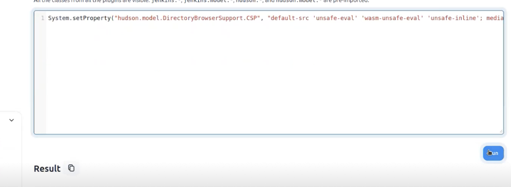
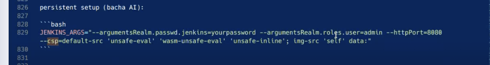
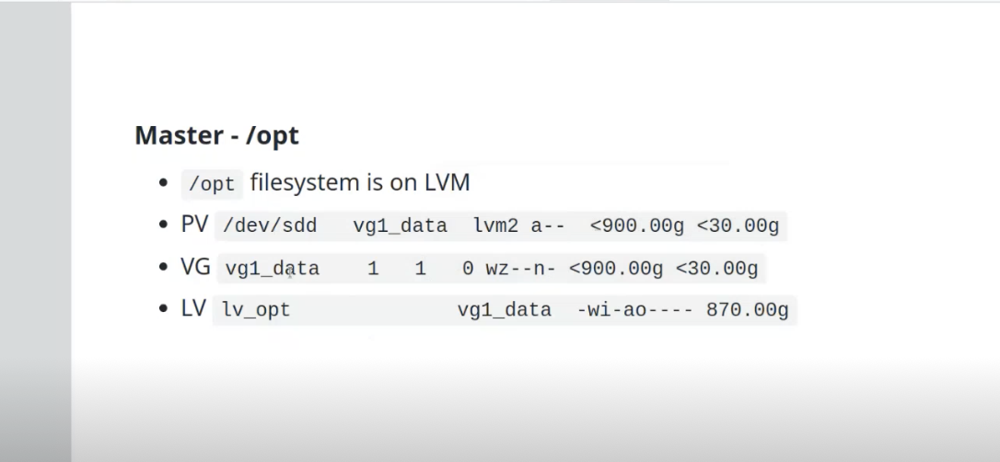

# in console you can change some jenkins parameters

there was problem with one plugin: html report
plugin sumarizes info from building and testing

in browswer developer view there was issue with csp
so he ran it and it worked:

then he changes this in production jenkins:

we can alsways resize the disk (check his presentation):

