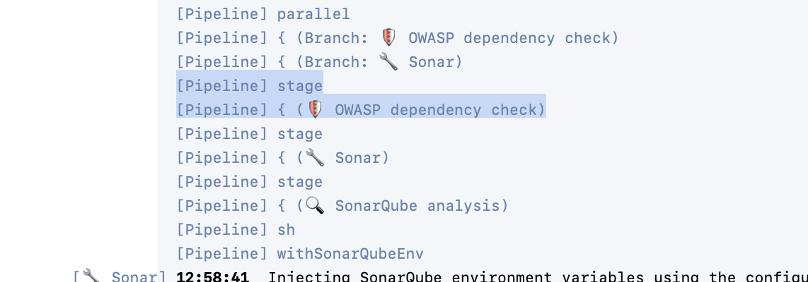
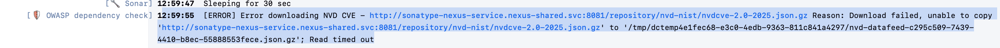

# problem

OWASP Dependency Check build failure due to NVD feed download timeout
The build on Jenkins is failing because the NVD data feed download from Nexus times out. Can somebody check this. Thank you.
 
 
MW » SB Services MW » promotion-manager » build » bugfix/EG-6140-expired-bonuses-in-bonus-widget #3…
Error:
13:00:51  Caused by: java.util.concurrent.ExecutionException: org.owasp.dependencycheck.utils.DownloadFailedException: Download failed, unable to copy 'http://sonatype-nexus-service.nexus-shared.svc:8081/repository/nvd-nist/nvdcve-2.0-2023.json.gz' to '/tmp/dctemp4e1fec68-e3c0-4edb-9363-811c841a4297/nvd-datafeed-f9b9da0f-cdc9-4da6-98af-9241170260ec.json.gz'; Read timed out
 

## terms

**OWASP Dependency Check**

A security tool used in the build. It scans project dependencies, such as Maven/npm libraries, and checks whether they have known vulnerabilities.

**NVD**

National Vulnerability Database. This is a public database from NIST that contains vulnerability records.

**CVE**

A public ID for a known security vulnerability. Example format: CVE-2026-12345

**NIST**

The US organization that maintains the NVD database.

**Nexus**

An internal repository/cache server. Instead of every Jenkins build downloading directly from the internet, builds download through Nexus. Nexus can cache files so future downloads are faster and more reliable.

**NVD feed**

A downloadable file containing vulnerability data. Dependency Check needs these files before it can scan dependencies.

**nvdcve-2.0-2023.json.gz**

A yearly vulnerability feed for 2023.

**nvdcve-2.0-modified.json.gz**

The important one here. This is the recent/changed CVE feed. Dependency Check downloads it often because it contains recently modified vulnerability data.

**.json.gz**

A compressed JSON file. JSON is structured text data; .gz means it is compressed to make it smaller.

## what actually happened

Normally, the modified feed (nvdcve-2.0-modified.json.gz) is small, around 2 MB. But NIST made a huge update around June 16-17, touching about 95% of CVEs. Because so many records changed, the modified feed became about 211 MB.

That caused two problems:
1. The file was much bigger than normal.
2. NIST was overloaded and sending the file very slowly, around 108 KB/s.

At that speed, downloading 211 MB would take roughly 33 minutes.

But the build, Nexus, or Dependency Check had much shorter timeouts. So the download failed before it could finish.

## Errors 

### First Error: `Read timed out`: 

        13:00:51  Caused by: java.util.concurrent.ExecutionException: org.owasp.dependencycheck.utils.DownloadFailedException: Download failed, unable to copy 'http://sonatype-nexus-service.nexus-shared.svc:8081/repository/nvd-nist/nvdcve-2.0-2023.json.gz' to '/tmp/dctemp4e1fec68-e3c0-4edb-9363-811c841a4297/nvd-datafeed-f9b9da0f-cdc9-4da6-98af-9241170260ec.json.gz'; Read timed out


Means: *I started downloading, but the server was too slow, so I gave up.*

### Later Error: `Server status: 500 - Server Error`

        14:00:43  [ERROR] 	UpdateException: The execution of the download was interrupted
        14:00:43  [ERROR] 		caused by ExecutionException: org.owasp.dependencycheck.utils.DownloadFailedException: http://sonatype-nexus-service.nexus-shared.svc:8081/repository/nvd-nist/nvdcve-2.0-modified.json.gz - Server status: 500 - Server reason: Server Error
        14:00:43  [ERROR] 		caused by DownloadFailedException: http://sonatype-nexus-service.nexus-shared.svc:8081/repository/nvd-nist/nvdcve-2.0-modified.json.gz - Server status: 500 - Server reason: Server Error
        14:00:43  [ERROR] 		caused by HttpResponseException: status code: 500, reason phrase: Server Error
        14:00:43  [ERROR] 	NoDataException: No documents exist


This means Nexus asked for the file, but the upstream fetch failed and Nexus returned an internal server error. In this case, Nexus itself was not really the root cause; it was failing because the remote NIST source was too slow or unavailable.

# solution

## Warming The Cache

The command ran a temporary pod inside the Jenkins namespace and downloaded all NVD feed files through Nexus.

That did two things:

1. It tested whether each feed was available.
2. It forced Nexus to cache successful downloads.


Once Nexus has a file cached, Jenkins builds can download it quickly from Nexus instead of waiting for Nexus to fetch it from NIST.

The yearly feeds worked:

```text
2023 HTTP 200
2024 HTTP 200
2025 HTTP 200
```

But the `modified` feed failed:

```text
modified HTTP 500
```

So the diagnosis was clear: yearly files were okay after cache warming, but the modified feed was still broken upstream.

## what the command did

```bash
oc run nvd-warm ... # that started a temporary OpenShift pod
-n jenkins-shared # it ran in the same namespace as Jenkins, so the test matched the real build environment
for y in $(seq 2002 2025) modified # it checked every yearly feed from 2002 to 2025 plus the special `modified` feed
curl ... # it downloaded each file
-s -o /dev/null # it threw away the downloaded file inside the pod, but nexus still cached it, which was the useful part
--max-time 600 #it allowed up to 600 seconds or 10 minutes for each downlaod. That is longer than the Jenkins build timeout, so it helped distinguish “slow but eventually works” from “actually broken.”
```


The modified feed only contains recently changed CVE records, not all records forever.
NIST made a huge change, so for a few days that file contained a massive amount of changed data. That made the file huge: about 211 MB.
After enough days passed, those old changes were no longer considered “recent,” so they dropped out of the modified feed. The file became small again: about 2 MB.
Once the file was small, Nexus could download it quickly, save it in cache, and Jenkins could finish the OWASP Dependency Check step successfully.

# explanation of CVE years and dates

`CVE year` = the year in the CVE ID or the year the vulnerability belongs to.  For ex. `CVE-2021-12345` is 2021 CVE.


`modified date` = the last time NIST changed the informatino about that CVE. For ex. 

```text
CVE-2021-12345
Last modified: June 17, 2026
```

## Simple example of why it would be updated:

A vulnerability from 2021 originally says:

```text
CVE-2021-12345 affects Library X versions before 2.0
```

Later, in 2026, NIST learns more and updates it to:

```text
CVE-2021-12345 affects Library X versions before 2.4
Severity changed from Medium to High
```

That CVE is still a 2021 CVE, so it belongs in the 2021 yearly feed.
But because it was edited recently, it also appears in the modified feed.
So when NIST touched almost all CVEs, even old ones, the modified feed became huge.

# how i would investigate step by step

1. console output check

2. search for `Failed in branch`

    

    so i konw the failing stage name

3. then i look for the place whre the stage in pipeline actually starts. Here it is:



4. from there i scroll down and search for the errors with this on the left in the log:


5. found the first error with this pipeline stage and errors after that:



that tells me:

```
Stage: OWASP dependency check
Problem: downloading NVD CVE feed
Source: Nexus URL
Failure: Read timed out
File: nvdcve-2.0-2025.json.gz
```